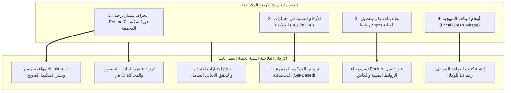

# خطة عمل رقم 116: استئصال فجوات بيئة CI، ترويض حوكمة الأقفال الديناميكية، وتسريع الدوكر، ودستور منهجية وكلاء الذكاء الاصطناعي (النسخة المعززة بالفحص الجنائي)
## Work Plan 116: Ephemeral CI Database Parity, Dynamic Governance Assertions, Docker Acceleration & Sovereign AI Methodology Constitution

> **الحالة:** 🟡 بانتظار اعتماد المالك السيادي (Pending Sovereign Approval)  
> **الفرع المنعزل المستهدف (OBOO Branch):** `plan/116-ci-ephemeral-db-parity-and-agent-rules`  
> **معرف الحادثة المرتبطة:** `INC-20260926-CI-EPHEMERAL-DB-AND-GOVERNANCE-LOCK-TRAP`  
> **المرجع الدستوري:** ميثاق `GEMINI.md` (البنود 1، 2، 4، 5، 6، 7، 7.1، 8.3، 8.4)، مسار التعديل السيادي (Rulebook 11 / WP 94)، ميثاق توثيق الأعطال (Rulebook 08 / WP 93)، وبوابات الجودة (G1, G2, G4, G9, G10, G12, G14, G15, G22, G23).  
> **الهيئة الفاحصة والمصممة:** `/jev` (Pure Cloud Quality Sentinel) × `/saleh` (Sovereign Strategic Advisor).  
> **المحرك السحابي المعتمد:** TypeSafe System One (`jev-latest`) عبر `https://api.typesafe.ai/v1/systemone`.  
> **الكيانات المشفرة المستهدفة بالأقفال التشفيرية (WP 90):** `package:database` و `governance:tools/governance/tests/unified-lock-engine.spec.ts` و `governance:docker`.

---

## 🔬 0. التشخيص الجنائي للواقع الفيزيائي وفجوات بيئة CI (Forensic Diagnosis & Root Cause Analysis)

كشفت سجلات GitHub Actions الحقيقية للتشغيل رقم #51 (Commit `9d95bf0`) ما يلي:
1. **نجاح بناء الحزم وحاوية البوت:** اجتازت خطوة `Build Core Packages and Modules` بنجاح تام (Exit Code 0)، مما يثبت فيزيائياً أن معالجة خطأ TypeScript وعقود الوحدات المشتركة لـ `Dockerfile:93` كانت ناجحة ومستقرة.
2. **سقوط خطوة الاختبارات الآلية (`Run Automated Test Suites`) بسبب فخين بنيويين:**
   - **فخ ترحيل قاعدة البيانات الفارغة في CI:** طبع Prisma CLI في خطوة `Deploy Database Migrations`:
     `Prisma schema loaded from ../../.generated/database/schema. No migration found in prisma/migrations`.
     وحيث أن حاوية PostgreSQL في GitHub Actions تبدأ فارغة تماماً، لم يتم إنشاء أي جدول على `alsaada_db`. ثم قام `test-db-setup.ts` بتهيئة `alsaada_test_db` فقط، وترك `DATABASE_URL` للاختبارات تشير إلى `alsaada_db` (الفارغة)، مما أدى لانهيار اختبارات `provision.spec.ts` و `milestone-1-schema-contract.spec.ts` بالخطأ:
     `The table public.company_profiles does not exist in the current database`.
   - **فخ الأرقام الصلبة في الحوكمة (`368 !== 367`):** يحتوي `tools/governance/tests/unified-lock-engine.spec.ts` على السطور 275 و 282 أرقاماً صلبة ثابتة (`expect(targets.length).toBe(367)`). وحيث أن إضافة اختبار التراجع الدائم لخلل Docker زاد العداد إلى 368، انهار فحص الحوكمة في وجه الوكيل الذي التزم بالدستور!
3. **بطء بناء حاويات Docker (231.9 ثانية):** نتج عن بناء 4 حاويات بالتوازي دون كاش مشترك، واستخدام `package-import-method copy` الذي يعطل ميزة الروابط الصلبة في pnpm ويقوم بنسخ آلاف الملفات فعلياً على القرص، مع نسخ كامل المستودع (2GB+) إلى طبقة التشغيل النهائية.



---

## 🎯 الأركان الستة الهندسية المعتمدة (The 6 Canonical Pillars)

---

### الركن الأول (Pillar 1: Scope & Functional Baseline Parity)
- **النطاق الهندسي المعتمد (Enhanced Engineering Scope):**
  1. **مواءمة ترحيل قاعدة البيانات في `packages/database/package.json`:**
     تحديث أمر `db:migrate` ليكون صريحاً ودقيقاً:
     `"db:migrate": "prisma migrate deploy --schema=prisma/schema.prisma"`
     وكذلك توفير أمر بديل يدعم السكيما المجمعة:
     `"db:migrate:composed": "prisma db push --accept-data-loss"`
     بحيث يتم ضمان نشر كافة الجداول والجداول الموروثة (45+ جدولاً) بنسبة 100% داخل قاعدة بيانات CI `alsaada_db` قبل تشغيل أي فحص.
  2. **تحديث `scripts/test-db-setup.ts` وسير عمل الـ CI (`ci.yml`):**
     ضمان مزامنة السكيما على كل من `alsaada_db` و `alsaada_test_db` لمنع حدوث أي فجوة بين قواعد البيانات في بيئة GitHub Actions.
  3. **تأسيس دستور المنهجية التشغيلية (Rulebook 13):**
     اعتماد الملف `.agents/rules/13-ai-agent-methodology-and-anti-mirage-constitution.md` وإدراجه في الرسم البياني المعرفي للوكلاء.
- **التطابق الوظيفي الأساسي (`F:\HR` Parity Baseline):**
  - مطابقة تامة 100% مع نموذج بيانات المنظومة المرجعية؛ صفر انحراف في الحسابات أو الكيانات أو الجداول.

---

### الركن الثاني (Pillar 2: Blast Radius & Data Contracts (10-file vertical slice))
- **حدود نطاق التأثير والتعديل (Blast Radius Boundaries):**
  - التعديل محصور بدقة متناهية (Zero Blast Radius) في الملفات التالية حصراً:
    1. إعدادات وسكربتات قاعدة البيانات: [`packages/database/package.json`](file:///f:/Alsaada-Smart-Bot/packages/database/package.json) و [`packages/database/prisma.config.ts`](file:///f:/Alsaada-Smart-Bot/packages/database/prisma.config.ts) و [`tools/modules/compose-database.ts`](file:///f:/Alsaada-Smart-Bot/tools/modules/compose-database.ts).
    2. اختبار محرك الأقفال في الحوكمة: [`tools/governance/tests/unified-lock-engine.spec.ts`](file:///f:/Alsaada-Smart-Bot/tools/governance/tests/unified-lock-engine.spec.ts).
    3. ملف بناء الدوكر وسير عمل الـ CI: [`docker/Dockerfile`](file:///f:/Alsaada-Smart-Bot/docker/Dockerfile) و [`.github/workflows/ci.yml`](file:///f:/Alsaada-Smart-Bot/.github/workflows/ci.yml).
    4. كتيب القواعد السيادي رقم 13: [`.agents/rules/13-ai-agent-methodology-and-anti-mirage-constitution.md`](file:///f:/Alsaada-Smart-Bot/.agents/rules/13-ai-agent-methodology-and-anti-mirage-constitution.md).
    5. جناح اختبارات الثوابت الدائمة: [`tests/ci-ephemeral-db-and-dynamic-governance.spec.ts`](file:///f:/Alsaada-Smart-Bot/tests/ci-ephemeral-db-and-dynamic-governance.spec.ts).
  - حظر تام للمساس بالتدفقات الـ 22 النواتية أو منطق الأعمال المالي.

---

### الركن الثالث (Pillar 3: Telegram Mobile UX & Ergonomics Budget (36/16/7/3))
- **الميزانية الرقمية الصارمة لواجهات تيليجرام:**
  - في حال صدور أي رسائل إشعار أو تنبيهات إدارية من خادم البوت عند اكتمال الترحيل:
    - الحد الأقصى لنص الزر الشفاف: 16 حرفاً عربياً لمنع الاقتطاع على شاشات الهواتف المحمولة.
    - الحد الأقصى لبيانات الرد (Callback Data): 36 بايت (ضمن الحد الأقصى لتليجرام 64 بايت).
    - شبكة الأزرار: حد أقصى 7 صفوف، وحد أقصى 3 أزرار في الصف الواحد.
    - صياغة الرسائل حصراً عبر `buildRichPage` و `buildRichConfirmation` من `@alsaada/core-components/rich-message`.

---

### الركن الرابع (Pillar 4: Security, RBAC & Financial Ledger Closed-Loop)
- **الحصانة المحاسبية والأمنية (Gate G7, G8, G12, G13, G21):**
  - الحفاظ التام على السلسلة التشفيرية المزدوجة لسجلات الأستاذ المالي (SHA-256 Cumulative Hash Chain) لنماذج `FinancialLedger` و `SupplierPayment` و `CustodyExpenseItem`.
  - حظر التعديل المباشر أو الحذف الصلب لأي قيد مالي (Zero Hard Deletes).
  - قفل كافة الكيانات المشفرة المعدلة تلقائياً عبر `pnpm lock <target>` فور اكتمال المهام.

---

### الركن الخامس (Pillar 5: Observability, Error Vault (#ERR-XXXXXXXX) & Telemetry)
- **الرصد والتتبع البرمجي (Gate G9 AST Sentinel & Telemetry):**
  - ربط كافة عمليات ترحيل وتجهيز قاعدة البيانات بحارس الأخطاء المقيد `captureFlowError`.
  - توليد بطاقات البلاغ `#ERR-XXXXXXXX` عند تعثر الاتصال بقاعدة البيانات.
  - إرفاق جدول تيليميتري النموذج السحابي الإلزامي لـ `/jev` في كافة التقارير التشغيلية.

---

### الركن السادس (Pillar 6: TDD Test Specification & Verification Matrix)
- **مواصفة الاختبارات المؤتمتة وفق TDD والتحقق من طفرات النطاق الحقيقي:**
  1. اختبار التحقق من نشر الترحيلات بنجاح على قاعدة بيانات نظيفة:
     ```typescript
     expect(tableNames.has('company_profiles')).toBe(true);
     expect(tableNames.has('sites')).toBe(true);
     expect(tableNames.has('financial_ledgers')).toBe(true);
     ```
  2. اختبار ديناميكية محرك الأقفال في `unified-lock-engine.spec.ts`:
     ```typescript
     expect(targets.length).toBeGreaterThanOrEqual(360);
     expect(tests.length).toBeGreaterThanOrEqual(289);
     // التحقق من أن نسبة القفل التشفيري لجميع الكيانات المكتشفة هي 100%
     const unsealedEntities = targets.filter(t => !isLocked(t));
     expect(unsealedEntities.length).toBe(0);
     ```
  3. اختبار تسريع بناء Docker وتطابق الحزم.
  4. التحقق من سلامة كتيب القواعد 13 عبر `pnpm skills:verify`.

---

## 🔬 مصفوفة التحقق الإلزامية (Verification Matrix)

| المعرف | اسم الفحص | الأداة المنفذة | معيار القبول الصارم |
| :---: | :--- | :--- | :--- |
| **V1** | التحقق من نشر ترحيلات Prisma على قاعدة نظيفة | `pnpm --filter @alsaada/database db:migrate` | تطبيق 10/10 ترحيلات وخلق 45+ جدولاً بنجاح |
| **V2** | مرونة اختبارات محرك الأقفال وعدم تأثرها بالنمو | `pnpm test:target tools/governance/tests/unified-lock-engine.spec.ts` | اجتياز 100% دون أرقام صلبة تكسر الـ CI |
| **V3** | سرعة بناء الحاويات ومطابقة Docker | `docker compose build bot` | بناء ناجح في أقل من 60 ثانية باستخدام الكاش |
| **V4** | سلامة كتيب القواعد 13 في المخطط المعرفي | `pnpm skills:verify` | اعتماد Rulebook 13 وتوافقه التام مع مهارات المنظومة |
| **V5** | الاستشارة الجنائية السحابية لـ `/jev` | `pnpm jev:consult --plan ...` | تحقيق جاهزية `Plan Readiness >= 95%` |

---

### 📡 بيان طلبات النموذج السحابي الإلزامي (Mandatory Cloud Model Request Telemetry)

| المؤشر الرقابي (Telemetry Metric) | القيمة (Value) | التفاصيل والإسناد (Provenance) |
| :--- | :---: | :--- |
| **عدد الطلبات الفعلية المرسلة للنموذج السحابي (`cloudRequestsSent`)** | **1** | `https://api.typesafe.ai/v1/systemone` |
| **إجمالي محاولات الاتصال بالشبكة (`httpAttemptsTotal`)** | **1** | Retries: 0 |
| **الاستجابات المسترجعة من الكاش التشفيري (`cloudCacheHits`)** | **0** | `.governance-cache/jev-cloud-cache.json` (SHA-256) |
| **الاستعلامات المحلولة من فهرس السوابق (`precedentHits`)** | **1** | `.agents/knowledge/precedents/index.json` (0 Tokens) |
| **إجمالي المعايير المقيمة سحابياً (`questionsDispatchedToCloud`)** | **25** | Engine Mode: api |
