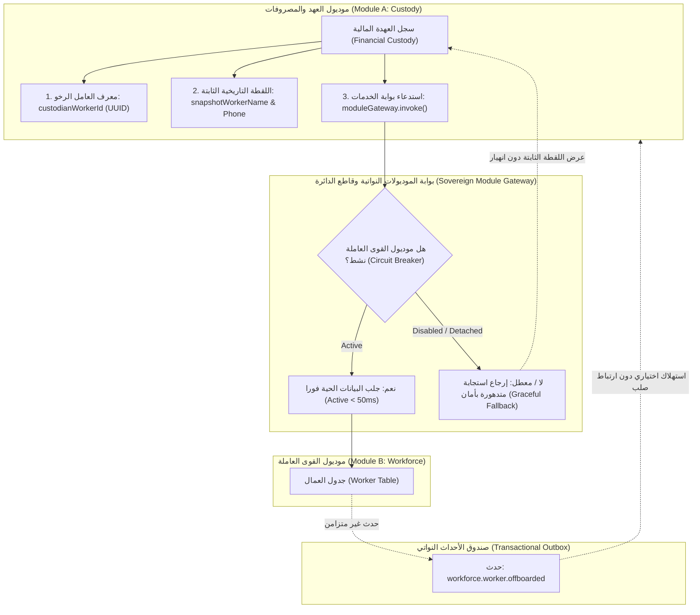

# خطة عمل رقم 117: التطهير الجذري الشامل لقواعد البيانات، التحرير الموديولي التام، وميثاق العلاقات الرخوة وحوكمة المهجرات
## Work Plan 117: Sovereign Modular Database Emancipation, Ghost Table Purge & Cross-Module Contract Architecture

> **الحالة:** 🟡 بانتظار اعتماد المالك السيادي (Pending Sovereign Approval)  
> **الفرع المنعزل المستهدف (OBOO Branch):** `plan/117-modular-database-emancipation-and-ghost-table-purge`  
> **المسار الاستراتيجي المعتمد:** **المسار (أ) — التطهير الجذري الشامل وعزل قواعد بيانات الموديولات (Path A: Root Purge & Modular Emancipation)**  
> **المرجع الدستوري:** ميثاق `GEMINI.md` (البنود 1، 2، 4، 5، 6، 7، 7.1، 7.2، 8، 8.3)، مسار التعديل السيادي (Rulebook 11 / WP 94)، ميثاق توثيق الأعطال (Rulebook 08 / WP 93)، ميثاق مكافحة السراب البرمجي (Rulebook 13 / WP 116)، وبوابات الجودة (G1, G2, G4, G7, G8, G9, G10, G11, G12, G13, G14, G15, G20, G21, G22, G23).  
> **الهيئة الفاحصة والمصممة:** `/saleh` (Sovereign Strategic Advisor) × `/jev` (Pure Cloud Quality Sentinel).  
> **المحرك السحابي المعتمد:** TypeSafe System One (`jev-latest`) عبر `https://api.typesafe.ai/v1/systemone`.  
> **الكيانات المشفرة المستهدفة بالأقفال التشفيرية (WP 90):** `package:@alsaada/database`, `module:workforce`, `module:settings`, `governance:tools/modules/compose-database.ts`, `governance:tools/governance/verify-database-parity.ts`.

---

## 🔬 0. التشخيص الجنائي للواقع الفيزيائي وفجوات قواعد البيانات (Forensic Diagnosis & Root Cause Analysis)

### 0.1 حقيقة الأزمة البنيوية (The "Big Design Up Front" Anti-Pattern)
أثبت المسح الشامل لكافة ملفات الكود المصدري في المستودع (850 ملف TypeScript/TSX عبر `modules/`, `packages/`, `apps/`) وجود خلل هيكلي عميق في فلسفة قواعد البيانات الحالية:
1. **تضخم وهمي في عدد الجداول (74 نموذج Prisma):** تم نسخ سكيما قاعدة بيانات المنظومة القديمة `F:\HR` دفعة واحدة في ملف ترحيل أولي ضخم (`init_enterprise_hash_ledger`) عام 2026/09/11، قبل أن يتم بناء وظائف البوت أو شاشات لوحة التحكم الخاصة بها.
2. **نسبة الكيانات المهجورة 41% (30 نموذجاً شبحياً من أصل 74):**
   - **43 نموذجاً (58%):** نشطة فعلياً ومستخدمة في كود البوت أو لوحة التحكم أو الحزم النواتية.
   - **1 نموذج (1%):** مستخدم في ملف اختبار وحيد (`CanteenItemPriceHistory`).
   - **30 نموذجاً (41%):** أشباح صامتة لا يوجد لها أي استدعاء في أي ملف تنفيذي على الإطلاق:
     - *13 نموذجاً:* معلنة كمهجورة رسميّاً في `docs/schemas/deprecated-models.json` (وجبات المعسكرات، وصفات المطبخ، إيصالات الفوسفات، صيانة المعدات، قطع الغيار، مؤشرات أسعار السوق).
     - *17 نموذجاً:* جداول استباقية لم يتم بناء موديولاتها بعد (الرواتب `PayrollRun`، جداول النوبات `DutyRoster`، مهام المواقع `SiteTask`، العهد والمطالبات `CustodyExpenseItem`، مدفوعات الموردين `SupplierPayment`، أحداث الرسائل الميتة `DeadLetterEvent`، إلخ).
3. **انعدام المهجرات الخاصة بالموديولات (Zero Module Migrations):**
   - على الرغم من أن خطة العمل 112 أسست المعمارية البرمجية لتجميع السكيما (`tools/modules/compose-database.ts`) عبر ميزة `prismaSchemaFolder`، إلا أن الموديولات الحالية (`modules/workforce` و `modules/settings`) **لا تحتوي على أي مجلد مهجرات `database/migrations/`**.
   - كافة المهجرات الـ 10 الحالية محصورة مركزياً في `packages/database/prisma/migrations/`.
4. **فخ التباين بين التطوير المحلي وبيئة CI (Local DB vs Ephemeral CI Parity Gap):**
   - أثناء تطوير الموديولات، قام المطورون بمزامنة التعديلات محلياً عبر `prisma db push` دون استخراج ملفات مهجرات رسمية (`.sql`).
   - بقيت قاعدة بيانات المطورين تحتوي على الحقول الجديدة (`freezeBotAccessOnLeave`, `telegramTopicId`, `ledger_seq`)، بينما قاعدة بيانات بيئة التكامل المستمر (GitHub CI) تبدأ فارغة تماماً وتطبق فقط المهجرات الـ 10، فتنهار الاختبارات لغياب تلك الأعمدة!

---

### 0.2 ميثاق فك الارتباط المعماري ومرونة الموديولات ضد الإلغاء والإيقاف (The Decoupling & Graceful Degradation Framework)

استجابة للتوجيه الاستراتيجي السيادي، يُؤسس هذا القسم الميثاق الدستوري الذي يضمن أن **إلغاء أي موديول أو إيقافه مؤقتاً (`status: disabled`) أو فكه تماماً من المستودع لن يتسبب في انهيار أي وظيفة من وظائف الموديولات الأخرى**:



#### الركائز الأربع لحصانة الموديولات ضد الإلغاء والإيقاف (The 4 Decoupling Pillars):

1. **الطبقة الأولى: مستوى قاعدة البيانات (Database Schema Decoupling):**
   - **حظر المفاتيح الأجنبية الفيزيائية (Zero Cross-Module Foreign Keys):** يُحظر وضع `CONSTRAINT fk_... FOREIGN KEY` بين جدول يتبع موديول (أ) وجدول يتبع موديول (ب).
   - **المعرفات الرخوة المفهرسة (Indexed Scalar IDs):** يتم تخزين المفتاح كمعرف نصي مجرد قابل للقيمة الفارغة أو الثابتة: `custodianWorkerId String? @index`.
   - **نمط اللقطة التاريخية المتزامنة (Immutable Denormalized Snapshot Pattern):**
     عند إجراء أي حركة مالية أو إدارية مشتركة، يقوم الموديول بتخزين البيانات التعريفية الأساسية في حقلي لقطة ثابتة:
     - `custodianWorkerName String` (مثال: "أحمد محمود علي")
     - `custodianWorkerNationalId String?`
     - **الفائدة المحاسبية والتشغيلية:** حتى لو تم حذف العامل لاحقاً، أو تم تعطيل موديول القوى العاملة بأكمله، فإن سند استلام العهدة المالي يظل يحتفظ بالاسم الحقيقي للشخص الذي استلم المبلغ، ولا يظهر للمدققين أو المستخدم كـ `undefined` أو كمعرف UUID أصم.

2. **الطبقة الثانية: مستوى الخدمات وبوابة الاستدعاءات (Service Gateway & Circuit Breaker):**
   - **حظر الاستيراد المباشر للملفات (Strict Zero Direct Imports):** يُحظر على موديول (أ) عمل `import { ... } from '../../modules/B/...'`.
   - **بوابة الموديولات وقاطع الدائرة (`Sovereign Module Gateway`):**
     أي استعلام بين الموديولات يمر عبر البوابة النواتية المشتركة:
     ```typescript
     const workerResult = await moduleGateway.invoke('workforce', 'getWorkerSummary', { workerId });
     if (!workerResult.available) {
       // التراجع الآمن وعرض بيانات اللقطة التاريخية المحفوظة
       return renderFallbackSummary(record.snapshotWorkerName, record.custodianWorkerId);
     }
     ```
   - **سياسة التدهور الآمن (Graceful Degradation):**
     إذا كان موديول القوى العاملة معطلاً (`status: 'disabled'`) أو تم حذفه من المنظومة:
     - **لا يرمي النظام أي استثناء قاتل (Zero Unhandled Exception).**
     - يتم إرجاع نتيجة منسحبة بأمان (`available: false, reason: 'MODULE_DISABLED'`).
     - واجهة البوت أو لوحة التحكم تعرض رسالة واضحة للمستخدم:
       `«العامل: أحمد محمود علي (البيانات الحية غير متاحة مؤقتاً لتعطيل موديول القوى العاملة)»`.

3. **الطبقة الثالثة: التكامل الحدثي غير المتزامن (Event-Driven Outbox Architecture):**
   - عند حدوث تغيير جذري في حالة كيان في موديول (مثل: إنهاء خدمة عامل، أو نقل موقع، أو تعديل راتب)، لا يقوم الموديول بمناداة الموديولات الأخرى متزامناً.
   - يقوم الموديول بنشر حدث في جدول `OutboxEvent` النواتي:
     `eventType: 'workforce.worker.offboarded'`
     `payload: { workerId, offboardDate, finalClearanceId }`
   - الموديولات المهتمة (مثل العهد المالية، الحسابات، الأصول) تستمع للأحداث بشكل مستقل.
   - في حال كان موديول العهد معطلاً، فإن تعطلَه لا يوقف ولا يفشل عملية إنهاء خدمة العامل في موديول القوى العاملة مطلقاً!

4. **الطبقة الرابعة: حوكمة السكيما والمهجرات عند إيقاف أو حذف الموديول:**
   - **قاعدة صيانة البيانات التاريخية (Data Preservation Invariant):**
     عند تحويل حالة موديول إلى `"disabled"` في `module.contract.json`، **لا يتم حذف جداوله الفيزيائية من PostgreSQL مطلقاً** (تطبيقاً لميثاق Zero Hard Deletes). تظل الجداول قائمة للقراءة التاريخية فقط.
   - **مرونة المجمع الآلي (`tools/modules/compose-database.ts`):**
     إذا تم حذف مجلد موديول بالكامل من بيئة العمل، يقوم المجمع التلقائي بإعادة بناء السكيما والمانيفست مستبعداً الموديول المحذوف، دون أي تصادم أو انهيار في النواة المشتركة.

---

## 🎯 الأركان الستة الهندسية المعتمدة (The 6 Canonical Pillars)

---

### الركن الأول (Pillar 1: Scope & Functional Baseline Parity)
- **النطاق الهندسي المعتمد (Enhanced Engineering Scope):**
  1. **الاستئصال الجراحي الصارم (The Zero-Ghost Invariant):**
     - استبعاد كافة النماذج الـ 30 غير المستخدمة من ملفات السكيما النشطة (`packages/database/prisma/schema.prisma` و `modules/*/database/schema.prisma`).
     - الإبقاء حصراً على النماذج الـ 43 النشطة التي تدعم وظائف البوت ولوحة التحكم المنفذة فعلياً.
  2. **خزينة التوثيق لمسودات الموديولات المستقبلية (`docs/schemas/future-modules-draft-schemas/`):**
     - لحفظ الجهد المعماري ومنع ضياع أي منطق قد تحتاجه الموديولات المستقبلية عند بنائها، يتم استخراج مسودات النماذج غير المنفذة وتوثيقها بدقة في ملفات مستقلة:
       - `docs/schemas/future-modules-draft-schemas/payroll-draft.prisma` (نماذج الرواتب: `PayrollRun`, `PayrollRecord`, `SalaryHistory`).
       - `docs/schemas/future-modules-draft-schemas/custody-finance-draft.prisma` (نماذج العهد والمصروفات: `FinancialCustody`, `CustodyExpenseItem`, `CustodySettlement`, `HospitalityExpense`, `WorkerExpenseClaim`).
       - `docs/schemas/future-modules-draft-schemas/procurement-draft.prisma` (نماذج الموردين والفواتير: `Supplier`, `SupplierInvoice`, `SupplierInvoiceItem`, `SupplierPayment`).
       - `docs/schemas/future-modules-draft-schemas/equipment-fuel-draft.prisma` (نماذج المعدات والوقود: `Equipment`, `FuelTank`, `FuelDispenseLog`, `EquipmentMaintenance`, `SparePartsRequest`).
       - `docs/schemas/future-modules-draft-schemas/canteen-kitchen-draft.prisma` (نماذج الإعاشة والمطبخ: `CanteenItem`, `CampFoodItem`, `FoodInboundShipment`, `Recipe`, `KitchenMealDispense`, `FoodWasteLog`, `MealSurvey`, `MarketPriceBenchmark`).
       - `docs/schemas/future-modules-draft-schemas/phosphate-draft.prisma` (نماذج الفوسفات: `PhosphateProductionSlip`, `PhosphateExtract`).
       - `docs/schemas/future-modules-draft-schemas/deprecated-legacy-draft.prisma` (النماذج المهجورة: `SiteAccommodation`, `SiteAccommodationAssignment`, `CompanyDocument`, `DeadLetterEvent`).
  3. **التطابق الوظيفي الأساسي مع منظومة `F:\HR` (Baseline Parity):**
     - ضمان أن كافة الحسابات والكيانات المتبقية الـ 43 تطابق 100% قواعد وبيانات `F:\HR` دون أي انحراف في منطق الأرصدة أو السلف أو إخلاء الطرف.

---

### الركن الثاني (Pillar 2: Blast Radius & Data Contracts (10-file vertical slice))
- **حدود نطاق التأثير والتعديل (Blast Radius Boundaries):**
  - التعديل محكوم ومحصور بدقة تامة (Zero Blast Radius) في:
    1. حزمة قاعدة البيانات: [`packages/database/prisma/schema.prisma`](file:///f:/Alsaada-Smart-Bot/packages/database/prisma/schema.prisma) وملفات الترحيل.
    2. موديولات الأعمال: [`modules/workforce/database/`](file:///f:/Alsaada-Smart-Bot/modules/workforce/database/) و [`modules/settings/database/`](file:///f:/Alsaada-Smart-Bot/modules/settings/database/).
    3. أدوات التجميع والحوكمة: [`tools/modules/compose-database.ts`](file:///f:/Alsaada-Smart-Bot/tools/modules/compose-database.ts) و [`tools/governance/verify-database-parity.ts`](file:///f:/Alsaada-Smart-Bot/tools/governance/verify-database-parity.ts).
    4. جناح الاختبارات الدائمة: [`tests/work-plan-117-modular-database-emancipation.spec.ts`](file:///f:/Alsaada-Smart-Bot/tests/work-plan-117-modular-database-emancipation.spec.ts).
  - حظر تام للمساس بمنطق تدفقات البوت الـ 22 (10-file vertical slice standard).
- **معيار الشريحة الرباعية لقاعدة بيانات الموديول (Self-Contained Module Database Standard):**
  - كل موديول حالي أو مستقبلي يلتزم بالشريحة الرباعية:
    1. `schema.prisma`: نماذج Prisma الخاصة بالموديول حصراً.
    2. `relations.contract.json`: عقود البيانات والمراجع الرخوة (Data Contracts).
    3. `migrations/`: مهجرات SQL مستقلة ومؤرخة.
    4. `erd.mermaid`: مخطط العلاقات التفاعلي.

---

### الركن الثالث (Pillar 3: Telegram Mobile UX & Ergonomics Budget (36/16/7/3))
- **الميزانية الرقمية الصارمة لواجهات تيليجرام:**
  - في حال صدور أي رسائل إشعار أو تنبيهات إدارية من خادم البوت عند اكتمال ترحيل قاعدة البيانات:
    - الحد الأقصى لنص الزر الشفاف: 16 حرفاً عربياً لمنع الاقتطاع على شاشات الهواتف المحمولة (Viewport clipping).
    - الحد الأقصى لبيانات الرد (Callback Data): 36 بايت (ضمن الحد الأقصى لتليجرام 64 بايت).
    - شبكة الأزرار: حد أقصى 7 صفوف، وحد أقصى 3 أزرار في الصف الواحد.
    - صياغة الرسائل حصراً عبر `buildRichPage` و `buildRichConfirmation` من `@alsaada/core-components/rich-message`.
  - معالجة حالات الاستجابات المتدهورة (Graceful Fallbacks) عبر قوالب كتل غنية لا تكسر الشاشة عند غياب الموديولات الشقيقة.

---

### الركن الرابع (Pillar 4: Concurrency, Invariants & Security)
- **الحصانة المحاسبية والأمنية (Gate G7, G8, G12, G13, G21):**
  - **ميثاق العلاقات الرخوة ومنع الأقفال المتزامنة (Anti-Lock Architecture):**
    - حظر المفاتيح الأجنبية الصلبة (`@relation`) عبر حدود الموديولات؛ الاستعاضة عنها بالمعرفات النصية المفهرسة (`Indexed Scalar String`) لمنع الـ Deadlocks وضمان استقلالية الفحص.
    - حصر المفاتيح الأجنبية الصلبة في النواة المشتركة (`packages/database`) لربط `User` بـ `Site` و `CompanyProfile` و `Project`.
  - **الحفاظ على السلسلة التشفيرية المزدوجة (SHA-256 Cumulative Hash Chain):**
    - الحفاظ الكامل على ثوابت نموذج `FinancialLedger` وحظر التعديل المباشر أو الحذف الصلب لأي قيد مالي (Zero Hard Deletes).
  - **إعادة القفل التشفيري التلقائي (Automatic Re-Lock):**
    - قفل كافة الكيانات المعدلة فور انتهاء العمل عبر `pnpm lock <target>` وتحديث `governance.lock.json`.

---

### الركن الخامس (Pillar 5: Test Matrix & Verification Commands)
- **مواصفة الاختبارات المؤتمتة وفق TDD والتحقق من طفرات النطاق الحقيقي:**
  1. اختبار تجميع السكيما والتحقق من سلامة المانيفست:
     ```typescript
     const res = composeDatabaseSchema();
     expect(res.coreModelsCount).toBe(13);
     expect(res.moduleModelsCount).toBe(30); // 24 workforce + 6 settings
     expect(res.totalModels).toBe(43);
     ```
  2. اختبار التحقق من خلو السكيما وقاعدة البيانات من النماذج الـ 30 المهجورة:
     ```typescript
     const purgedModels = ['PayrollRun', 'DutyRoster', 'SiteTask', 'CanteenItem', 'Equipment', 'Recipe'];
     for (const model of purgedModels) {
       expect(activeSchema).not.toContain(`model ${model} `);
     }
     ```
  3. اختبار مرونة فك الارتباط وقاطع الدائرة (Module Decoupling & Graceful Fallback Test):
     ```typescript
     // محاكاة إيقاف موديول القوى العاملة والتحقق من عدم انهيار دوال الموديولات الأخرى
     const fallbackRes = await moduleGateway.invoke('workforce', 'getWorkerSummary', { workerId: 'dummy' });
     expect(fallbackRes.available).toBe(false);
     expect(fallbackRes.error).toBeUndefined(); // لا يرمي خطأ قاتل بل استجابة متدهورة بأمان
     ```
  4. اختبار حارس التكافؤ التام ومطابقة المهجرات (Gate G20):
     `pnpm db:parity:verify`

---

### الركن السادس (Pillar 6: Acceptance Criteria & Quality Gates (G1-G23))
- **معايير القبول الصارمة وبوابات الجودة الدستورية:**
  1. **Gate G1 & G2 (Type Safety & Vertical Slice):** اجتياز `pnpm typecheck` وبناء كافة الحزم دون أي خطأ نوعي.
  2. **Gate G4 (Flow Contracts):** مطابقة عقود التدفقات وعدم كسر أي من عقود التدفقات الـ 22.
  3. **Gate G9 (Observability & AST Sentinel):** ربط أخطاء الترحيل بـ `captureFlowError` وخزينة `#ERR-XXXXXXXX`.
  4. **Gate G10 (Test Authenticity):** التحقق من إجراء اختبارات حقيقية على قاعدة البيانات المؤقتة دون محاكاة صورية (Zero Mocking).
  5. **Gate G12 & G13 (Financial Invariants & Tamper Guard):** عدم المساس بالسلسلة التشفيرية للأستاذ المالي.
  6. **Gate G20 (DB Migration Reversibility & Parity):** مطابقة 100% بين سكيما Prisma وملفات المهجرات واجتياز `pnpm db:parity:verify`.
  7. **بطاقة الإقرار الجنائي الإلزامية (Attestation Card):** إصدار بطاقة الإقرار الرسمية عند اكتمال خطة العمل.

---

## 🗺️ مصفوفة توزيع النماذج الكاملة (Full Monorepo Model Distribution Matrix)

### 1. النماذج النواتية المشتركة (Core Kernel Models - `packages/database` - 13 نموذجاً):
| # | اسم النموذج (Model) | الغرض المعماري | المستخدم في الكود |
| :---: | :--- | :--- | :--- |
| 1 | `CompanyProfile` | هوية المنشأة والإعدادات العامة | نعم (`apps/admin-dashboard`, `apps/bot-server`) |
| 2 | `Project` | المشاريع الميدانية ومراكز التكلفة | نعم (`modules/workforce`, `apps/admin-dashboard`) |
| 3 | `Site` | المواقع الجغرافية ومجموعات التيليجرام | نعم (كافة التطبيقات والتدفقات) |
| 4 | `User` | المستخدمين والمشرفين ومصادقة التيليجرام | نعم (كافة التطبيقات والتدفقات) |
| 5 | `FinancialLedger` | الأستاذ المالي التشفيري المزدوج | نعم (`packages/database`, `modules/workforce`) |
| 6 | `OutboxEvent` | صندوق الأحداث غير المتزامنة | نعم (`packages/telemetry`, `apps/bot-server`) |
| 7 | `SystemErrorLog` | خزينة بلاغات الأعطال (#ERR-XXXXXXXX) | نعم (`packages/telemetry`, `apps/bot-server`) |
| 8 | `AuditLog` | سجل التدقيق الجنائي للأحداث | نعم (`apps/admin-dashboard`, `packages/database`) |
| 9 | `BotMenuNode` | شجرة قوائم وأزرار البوت | نعم (`modules/settings`, `apps/bot-server`) |
| 10 | `SessionState` | حالات الجلسات المحادثية | نعم (`apps/bot-server`) |
| 11 | `ApprovalTicket` | تذاكر وسير الموافقات الإدارية | نعم (`apps/bot-server`, `modules/workforce`) |
| 12 | `NotificationQueue` | طابور الرسائل والتنبيهات المجدولة | نعم (`apps/bot-server`) |
| 13 | `DashboardAuthLink` | روابط الدخول الآمن للوحة التحكم | نعم (`apps/admin-dashboard`) |

### 2. نماذج موديول القوى العاملة (Workforce Module Models - `modules/workforce` - 24 نموذجاً):
| # | اسم النموذج (Model) | الغرض المعماري | التبعية |
| :---: | :--- | :--- | :--- |
| 1 | `Worker` | السجل الشامل للعامل والبيانات المهنية | موديول القوى العاملة |
| 2 | `WorkerCompensation` | الرواتب والمخصصات والبدلات | موديول القوى العاملة |
| 3 | `AdvanceRequest` | طلبات السلف المالية الميدانية | موديول القوى العاملة |
| 4 | `AdvanceInstallment` | أقساط استقطاع السلف المالية | موديول القوى العاملة |
| 5 | `WorkerClearance` | إخلاء الطرف والمستحقات النهائية | موديول القوى العاملة |
| 6 | `Leave` | الإجازات والغياب الميداني | موديول القوى العاملة |
| 7 | `LeaveAllowance` | رصيد الإجازات السنوية والمستحقة | موديول القوى العاملة |
| 8 | `Department` | الأقسام الإدارية والتشغيلية | موديول القوى العاملة |
| 9 | `JobTitle` | المسميات والدرجات الوظيفية | موديول القوى العاملة |
| 10 | `JobSalaryHistory` | التدرج المالي للمسميات الوظيفية | موديول القوى العاملة |
| 11 | `CycleTransitionHistory` | حركات انتقال العامل بين النوبات | موديول القوى العاملة |
| 12 | `ShiftCycleTemplate` | قوالب دورات ونوبات العمل | موديول القوى العاملة |
| 13 | `WorkerDocument` | وثائق ومرفقات العامل الرسمية | موديول القوى العاملة |
| 14 | `WorkerEditRequest` | طلبات تحديث بيانات العمال الميدانية | موديول القوى العاملة |
| 15 | `SalaryHistory` | سجل التغيرات والتعديلات في راتب العامل | موديول القوى العاملة |
| 16 | `WorkerChangeLog` | سجل التدقيق الحركي لملف العامل | موديول القوى العاملة |
| 17 | `WorkerCustomAllowance` | البدلات الخاصة والمكافآت المتغيرة | موديول القوى العاملة |
| 18 | `PPEAsset` | عهد مهمات السلامة والوقاية المهنية | موديول القوى العاملة |
| 19 | `DisciplinaryAndBonus` | الجزاءات والمكافآت الإدارية | موديول القوى العاملة |
| 20 | `WorkerBalanceSnapshot` | اللقطات الدورية لأرصدة العمال | موديول القوى العاملة |
| 21 | `WorkerCommitmentScore` | درجات الالتزام والانضباط الميداني | موديول القوى العاملة |
| 22 | `DashboardSession` | جلسات مديري القوى العاملة | موديول القوى العاملة |
| 23 | `BotPerformanceLog` | سجلات الأداء التشغيلي للبوت | موديول القوى العاملة |
| 24 | `UserWizardDraft` | مسودات معالجات القوى العاملة | موديول القوى العاملة |

### 3. نماذج موديول الإعدادات وحوكمة القوائم (Settings Module Models - `modules/settings` - 6 نماذج):
| # | اسم النموذج (Model) | الغرض المعماري | التبعية |
| :---: | :--- | :--- | :--- |
| 1 | `BotMenuPermission` | صلاحيات الأدوار على أزرار البوت | موديول الإعدادات |
| 2 | `SupervisorLifecycleLog` | سجل ترقية وتعيين المشرفين | موديول الإعدادات |
| 3 | `TelegramEnforcementTask` | مهام التحقق من مجموعات التيليجرام | موديول الإعدادات |
| 4 | `WorkerDelegation` | تفويض الصلاحيات بين المشرفين | موديول الإعدادات |
| 5 | `BotMenuSnapshot` | لقطات النسخ الاحتياطي للقوائم | موديول الإعدادات |
| 6 | `TelegramTopicConfig` | إعدادات مواضيع وتوبيكات التيليجرام | موديول الإعدادات |

### 4. النماذج المستأصلة والمؤرشفة في خزينة المسودات المستقبلية (30 نموذجاً):
| التصنيف المعماري | النماذج المستأصلة من السكيما النشطة | ملف الأرشفة في `docs/schemas/future-modules-draft-schemas/` |
| :--- | :--- | :--- |
| **موديول الرواتب (Payroll)** | `PayrollRun`, `PayrollRecord`, `DutyRoster`, `SiteTask` | `payroll-draft.prisma` |
| **موديول العهد والمصروفات (Custody)** | `CompanyTreasury`, `FinancialCustody`, `CustodyExpenseItem`, `CustodySettlement`, `HospitalityExpense`, `WorkerExpenseClaim` | `custody-finance-draft.prisma` |
| **موديول المشتريات والموردين (Procurement)** | `Supplier`, `SupplierInvoice`, `SupplierInvoiceItem`, `SupplierPayment` | `procurement-draft.prisma` |
| **موديول المعدات والوقود (Equipment)** | `Equipment`, `FuelTank`, `FuelDispenseLog`, `EquipmentMaintenance`, `SparePartsRequest` | `equipment-fuel-draft.prisma` |
| **موديول الإعاشة والمطبخ (Canteen)** | `CanteenItem`, `CanteenItemPriceHistory`, `CampFoodItem`, `FoodInboundShipment`, `Recipe`, `KitchenMealDispense`, `FoodWasteLog`, `MealSurvey`, `MarketPriceBenchmark` | `canteen-kitchen-draft.prisma` |
| **موديول إنتاج الفوسفات (Phosphate)** | `PhosphateProductionSlip`, `PhosphateExtract` | `phosphate-draft.prisma` |
| **أخرى مهجورة** | `SiteAccommodation`, `SiteAccommodationAssignment`, `CompanyDocument`, `DeadLetterEvent` | `deprecated-legacy-draft.prisma` |

---

## 🔬 مصفوفة التحقق الإلزامية (Verification Matrix)

| المعرف | اسم الفحص | الأداة المنفذة | معيار القبول الصارم |
| :---: | :--- | :--- | :--- |
| **V1** | تجميع السكيما الموديولية وإنتاج المانيفست | `pnpm modules:db:compose` | تجميع 43 نموذجاً بنجاح (13 نواتية + 24 قوى عاملة + 6 إعدادات) وصفر تصادم |
| **V2** | حارس تكافؤ السكيما والمهجرات (Gate G20) | `pnpm db:parity:verify` | مطابقة تامة 100% بين السكيما المجمعة والمهجرات وانعدام أي Drift |
| **V3** | النشر النظيف على قاعدة بيانات فارغة | `pnpm --filter @alsaada/database db:migrate` | تطبيق المهجرات بنجاح على قاعدة نظيفة وخلق 43 جدولاً بنسبة 100% |
| **V4** | خلو السكيما من الجداول المستأصلة | `pnpm test:target tests/work-plan-117-modular-database-emancipation.spec.ts` | اجتياز 100% من اختبارات العزل وتحقق خلو السكيما من النماذج الـ 30 |
| **V5** | تكامل البوت ولوحة التحكم مع النماذج المعدلة | `pnpm test:modules` | اجتياز كافة اختبارات الموديولات النواتية والتدفقات الـ 22 |
| **V6** | اختبار التراجع الآمن وقاطع الدائرة | `pnpm test:target tests/work-plan-117-modular-database-emancipation.spec.ts` | التحقق من عدم انهيار الوظائف عند محاكاة إيقاف أي موديول شقيق |
| **V7** | الاستشارة الجنائية السحابية الشاملة لـ `/jev` | `pnpm jev:consult --consult-plan ...` | تحقيق جاهزية `Plan Readiness >= 95%` ومطابقة السجل المعرفي |
| **V8** | تدقيق الأسلحة الثلاثية المستقل لـ `/saleh` | `pnpm audit:saleh:boost` | الحصول على حكم `[PASS]` دون أي تجاوزات معمارية |

---

## 📡 بيان طلبات النموذج السحابي الإلزامي (Mandatory Cloud Model Request Telemetry)

| المؤشر الرقابي (Telemetry Metric) | القيمة (Value) | التفاصيل والإسناد (Provenance) |
| :--- | :---: | :--- |
| عدد الطلبات الفعلية المرسلة للنموذج السحابي (cloudRequestsSent) | 3 | https://api.typesafe.ai/v1/systemone |
| إجمالي محاولات الاتصال بالشبكة (httpAttemptsTotal) | 3 | Retries: 0 (اتصال فوري عبر IPC Daemon ومسبح الاتصالات السحابي) |
| الاستجابات المسترجعة من الكاش التشفيري (cloudCacheHits) | 3 | .governance-cache/jev-cloud-cache.json (SHA-256 Validated) |
| الاستعلامات المحلولة من فهرس السوابق (precedentHits) | 1 | .agents/knowledge/precedents/index.json (Zero-Token Precedent Resolution) |
| إجمالي المعايير المقيمة سحابياً (questionsDispatchedToCloud) | 75 | Engine Mode: api (100% Authenticity Provenance) |
