# 📋 خطة العمل رقم 12 المدمجة: إدارة المستخدمين وتفويض الأدوار (10.2)، الربط المباشر والاعتماد المسبق ورادارات التحقق الميداني، والدالة المشتركة الموحدة للإشعارات
## Master Plan 12: User RBAC Directory (Legacy 10.2 Parity), Direct Worker Linking, Live Verification Radars, and Universal Multi-Channel Outbox Notification Helper

> [!IMPORTANT]
> **ميثاق الحوكمة والمرجعية المؤسسية (Governance & Baseline SSOT):**
> تستند هذه الخطة الشاملة والمدمجة إلى:
> 1. الترحيل الحرفي الكامل للوظيفة الموروثة **`10.2: إدارة المستخدمين وتفويض الصلاحيات (User RBAC Manager)`** من المشروع السابق [`F:\HR`](file:///F:/HR/src/bot/conversations/manage-users.conversation.ts#L15-L100) و [`F:\HR\docs\10-pillar-audit\01-super-admin-hub\10.2.A-list-users.md`](file:///F:/HR/docs/10-pillar-audit/01-super-admin-hub/10.2.A-list-users.md).
> 2. دمج **المقترحات التحسينية الخمسة المعتمدة صراحة من المستخدم**:
>    - **مقترح 1:** رادار التحقق اللحظي من هوية الحساب في تليجرام (`Live Profile Preview via getChat`).
>    - **مقترح 2:** رادار التعارض الأمني وفك الارتباط والتسليم النظيف (`Conflict Radar & Clean Transfer`).
>    - **مقترح 3:** إضافة حقل ومعالج التيليجرام في بطاقة تعديل العامل الشاملة 360° (`01.2.D-worker-edit`).
>    - **مقترح 4:** زر واتساب مباشر لإرسال رابط تشغيل البوابة للعامل بنقرة واحدة بعد الربط.
>    - **مقترح 5:** التكامل الصامت للدالة المشتركة مع طابور المزامنة الخلفية مع Google Sheets (`TransactionalOutboxQueue`).
> 3. إنشاء **الدالة الوسيطة الموحدة المشتركة للإشعارات (`notifyFlowOperation`)** لمنع تكرار الأكواد في كافة موديولات المشروع الحالية والقادمة.

---

### 1️⃣ المحاور الهندسية الخمسة للخطة المدمجة

```mermaid
flowchart TD
    subgraph Axis1["المحور الأول: الدالة المشتركة الموحدة للإشعارات وطابور المزامنة"]
        NHelper["Universal Helper<br/>notifyFlowOperation(options)"]
        NPolicies["محرك السياسات 00.10<br/>NotificationPolicyEngine"]
        NDispatcher["محرك الإرسال الموحد<br/>UnifiedNotificationDispatcher"]
        SiteGrp["جروب الموقع الميداني<br/>(Read-Only / بلا أزرار)"]
        HQGrp["جروب الإدارة العليا<br/>(توجيه للتوبيك المختص)"]
        OutboxQ["طابور المزامنة الخلفية<br/>TransactionalOutboxQueue"]
        
        NHelper --> NPolicies
        NHelper --> NDispatcher
        NHelper -->|خيار اختياري| OutboxQ
        NDispatcher --> SiteGrp
        NDispatcher --> HQGrp
    end

    subgraph Axis2["المحور الثاني: الربط المباشر ورادارات التحقق الميداني"]
        PickWorker["اختيار العامل<br/>buildWorkerPickerKeyboard (اسم الشهرة)"]
        EnterTG["إدخال معرف التليجرام الرقمي<br/>(تطبيع الأرقام normalizeDigits)"]
        LiveRadar["رادار التحقق اللحظي<br/>bot.api.getChat(id)"]
        ConflictRadar{"رادار التعارض الأمني:<br/>هل المعرف مربوط بعامل آخر؟"}
        TransferConfirm["شاشة تأكيد نقل الارتباط<br/>وتنزيل الحساب القديم لـ GUEST"]
        InstantUser["إنشاء العضوية الفورية في users<br/>(role = WORKER, active = true)"]
        WhatsAppInvite["زر إرسال رابط التفعيل<br/>عبر واتساب بنقرة واحدة"]
        
        PickWorker --> EnterTG --> LiveRadar --> ConflictRadar
        ConflictRadar -->|يوجد تعارض| TransferConfirm --> InstantUser
        ConflictRadar -->|لا يوجد تعارض| InstantUser --> WhatsAppInvite
    end

    subgraph Axis3["المحور الثالث: دليل المستخدمين وتفويض الأدوار (10.2)"]
        UserDir["دليل المستخدمين التفاعلي<br/>(صفحات 8 مستخدمين/صفحة)"]
        UserSearch["بحث سريع بالاسم / ID / الكود"]
        UserCard["بطاقة تحكم المستخدم 360°"]
        RoleChange["تعديل الرتبة<br/>(سوبر أدمن / تنفيذي / مشرف / محاسب / عامل / زائر)"]
        SiteScope["تحديد الموقع الميداني للمشرف"]
        SovereignGuards["حراس السيادة:<br/>منع تعديل النفس + حماية آخر سوبر أدمن"]
        BlockRevoke["حظر / فك حظر / سحب الصلاحية"]
        
        UserDir --> UserCard
        UserSearch --> UserCard
        UserCard --> RoleChange --> SiteScope --> SovereignGuards
        UserCard --> BlockRevoke
    end

    subgraph Axis4["المحور الرابع: الربط في معالج التسجيل (01.1) وتعديل العامل (01.2.D)"]
        RegFlow["معالج تسجيل العامل 01.1<br/>خطوة ربط اختيارية"]
        EditFlow["بطاقة تعديل العامل 01.2.D<br/>تبويب الاتصال والهوية الرقمية"]
        AtomicSave["حفظ السجل والعضوية في معاملة ذرية"]
        
        RegFlow --> AtomicSave
        EditFlow --> AtomicSave
    end
```



---

### 2️⃣ تفاصيل المحور الأول: الدالة المشتركة الموحدة للإشعارات والمزامنة (`notifyFlowOperation`)

#### أ) الملف البرمجي المستهدف:
[`packages/core-components/src/multi-channel/notification-helper.ts`](file:///F:/Alsaada-Smart-Bot/packages/core-components/src/multi-channel/notification-helper.ts)

#### ب) المواصفات والواجهة البرمجية المعتمدة:
```typescript
export interface FlowNotificationOptions {
  featureKey: string;               // كود الميزة (مثل: 'worker_registration', 'worker_offboarding', 'worker_advance')
  siteId?: string | null;           // معرف الموقع الميداني
  siteCardText?: string;            // نص البطاقة لجروب الموقع
  hqCategory?: TransactionCategory; // تصنيف التوبيك في جروب الإدارة (HQ_SITE_CLOSURES, إلخ)
  hqCardText?: string;              // نص التقرير لجروب الإدارة
  parseMode?: 'Markdown' | 'HTML';  // التنسيق (الافتراضي Markdown)
  // تكامل المقترح 5: طابور المزامنة الخلفية مع شيتات جوجل
  outboxEvent?: {
    topic: string;                  // e.g. 'WORKER_REGISTERED', 'WORKER_OFFBOARDED'
    payload: Record<string, unknown>;
  };
}

/**
 * وظيفة وسيطة موحدة ومحمية لإرسال إشعارات المنظومة وجدولة المزامنة دون تجميد واجهة البوت (< 15ms)
 */
export async function notifyFlowOperation(options: FlowNotificationOptions): Promise<void>;
```

#### جـ) الضمانات المعمارية:
1. **سرعة استجابة فائقة (< 0.2ms كاش):** كاش L1 RAM و Redis لمعرفات جروبات المواقع `Site.telegramGroupId`، بدون أي استعلام SQL إضافي.
2. **Read-Only حتمي:** حذف `reply_markup` تماماً على رسائل المجموعات لمنع ظهور أي أزرار وظيفية.
3. **احترام السياسات:** فحص فوري ومستقل لحالة التفعيل (الموقع مفعل؟ الإدارة مفعلة؟ النمط صامت؟).
4. **المزامنة الخلفية الصامتة:** تسجيل حدث الـ Outbox تلقائياً في قاعدة البيانات ليقوم العامل الخلفي بترحيله لجوجل شيت بدون أي تأخير في التيليجرام.
5. **عزل الأعطال:** تغليف الإرسال بـ `try/catch` آمن يضمن عدم انهيار البوت عند أخطاء الشبكة.

---

### 3️⃣ تفاصيل المحور الثاني: الربط المباشر والإنشاء المسبق للعضوية ورادارات التحقق

#### أ) دورة العمل الميدانية للربط المباشر:
1. **اختيار العامل:** عبر مكوّن النواة `buildWorkerPickerKeyboard` مع الالتزام بعرض اسم الشهرة (Nickname).
2. **إدخال المعرف الرقمي:** تطبيع الأرقام المدخلة بالأرقام المشرقية والمغربية عبر `normalizeDigits`.
3. **تطبيق المقترح 1 (رادار التحقق اللحظي من تليجرام `Live Profile Preview`):**
   - استدعاء `bot.api.getChat(telegramId)` للتأكد من وجود الحساب.
   - استخراج الاسم الظاهر في تليجرام ومعرف المستخدم `@username`.
   - عرض بطاقة مطابقة سريعة للأدمن:
     ```text
     🔍 تم التحقق من الحساب على تيليجرام:
     👤 اسم العامل بالشركة: أحمد علي محمود
     📱 صاحب حساب تيليجرام: Saleh Osman (@saleh_osman)
     
     هل تؤكد مطابقة الحساب للعامل وربطه بالمنظومة؟
     [ ✅ تأكيد واعتماد الربط ]   [ ✏️ تعديل المعرف ]
     ```
4. **تطبيق المقترح 2 (رادار التعارض الأمني وفك الارتباط النظيف `Conflict Radar`):**
   - فحص: هل الـ `telegramId` مربوط بالفعل بسجل عامل آخر؟
   - إذا وُجد تعارض:
     * عرض تحذير أمني صريح باسم العامل المربوط به حالياً.
     * عند تأكيد النقل: يقوم النظام تلقائياً بتنزيل الحساب القديم إلى `GUEST`، وتفريغ كاشه، وتصفير `Worker.telegramId` القديم لحماية الخصوصية.
5. **الإنشاء المسبق الفوري للعضوية (`Instant Member Pre-Creation`):**
   - في معاملة ذرية واحدة (`Atomic Transaction`):
     * إنشاء أو ترقية السجل في جدول `users` (`role = 'WORKER'`, `workerId = worker.id`, `assignedSiteId = worker.siteId`, `isActive = true`).
     * تحديث `Worker.telegramId = telegramId`.
     * تفريغ كاش المصادقة L1/Redis فورياً.
     * مزامنة أوامر تليجرام الجانبية للعامل.
6. **تطبيق المقترح 4 (زر واتساب المباشر بنقرة واحدة):**
   - في بطاقة الإتمام، يظهر زر:  
     `[ 📲 إرسال رسالة ترحيبية ورابط البوت للعامل عبر واتساب ]`.
   - يفتح واتساب العامل بضغطة زر برسالة رسمية تحتوي على رابط البوت المباشر `https://t.me/AlsaadaSmartBot?start=worker`.

---

### 4️⃣ تفاصيل المحور الثالث: دليل المستخدمين وتفويض الأدوار (مطابقة الوظيفة الموروثة `10.2`)

#### أ) الشريحة الرأسية المستهدفة:
`modules/settings/src/flows/00.12-user-rbac-management/`

#### ب) وظائف الشريحة:
1. **دليل المستخدمين التفاعلي المقسم لصفحات (`📋 استعراض المستخدمين`):**
   - عرض 8 مستخدمين لكل صفحة مع شارات الأدوار والحالة:
     `[ 👑 محمد — سوبر أدمن 🟢 ]`, `[ 🛡️ أحمد — مشرف موقع (أبو طرطور) 🟢 ]`, `[ 👷 محمود — عامل (OP-001) 🟢 ]`, `[ 👤 زائر ⚪ ]`, `[ 🔴 خالد — محظور ]`.
   - شريط تنقل: `[ ◀️ السابق ]` `[ 📄 صفحة X من Y ]` `[ التالي ▶️ ]`.
2. **البحث السريع المباشر (`🔍 بحث سريع عن مستخدم`):**
   - بحث فوري بالاسم، معرف التليجرام، كود العامل، أو الهاتف المشفر.
3. **بطاقة تحكم المستخدم الشاملة 360°:**
   - عرض كافة تفاصيل الحساب.
   - `🔄 تغيير الرتبة / الصلاحية`: ترقية أو تعديل الدور (`SUPER_ADMIN`, `EXECUTIVE`, `FIELD_ADMIN`, `ACCOUNTANT`, `WORKER`, `GUEST`).
   - في حالة اختيار `FIELD_ADMIN`: تظهر شاشة مصفوفة المواقع لتحديد النطاق الجغرافي للمشرف.
   - `🔴 حظر وتجميد الحساب` / `🟢 فك الحظر والتنشيط`.
   - `🗑️ سحب الصلاحيات وفك الارتباط`: إعادة الحساب إلى `GUEST` وفصل ملف العامل ومسح الكاش.
4. **حراس السيادة المعتمدون:**
   - حظر تعديل أو خفض صلاحيات النفس نهائياً.
   - حظر عزل أو خفض آخر سوبر أدمن نشط في المنظومة.
5. **معالج التعيين السريع لمسؤول جديد (`➕ تفويض وتعيين مسؤول جديد`):**
   - اختيار الدور المطلوب تفويضه.
   - إدخال معرف التيليجرام والاسم.
   - التفعيل الفوري ومزامنة الأوامر.

---

### 5️⃣ تفاصيل المحور الرابع: الربط في معالج التسجيل (`01.1`) وبطاقة التعديل (`01.2.D`)

1. **معالج تسجيل العامل الجديد (`01.1-worker-registration`):**
   - إضافة خطوة اختيارية بعد إدخال الهاتف:
     `[ 🔗 ربط حساب تيليجرام للعامل الآن ]` | `[ ⏭️ تخطي والربط لاحقاً ]`.
   - إتمام عملية التسجيل واستدعاء `notifyFlowOperation` فورياً.
2. **تطبيق المقترح 3 (تكامل بطاقة تعديل العامل الشاملة `01.2.D-worker-edit`):**
   - في التبويب الرابع (الاتصال والهوية الرقمية):
     * عرض معرف التيليجرام الحالي للعامل إن وُجد مع زر نسخه.
     * زر `[ 🔗 ربط حساب تليجرام ]` أو `[ 🔄 تغيير المعرف المربوط ]` أو `[ 🗑️ فك الارتباط ]`.
     * تطبيق نفس رادارات التحقق الميداني والتعارض.

---

### 6️⃣ خطة الملفات والتعديلات التفصيلية (Master File Plan)

| المكون / الملف | نوع الإجراء | الوصف والهدف |
| :--- | :---: | :--- |
| [`packages/core-components/src/multi-channel/notification-helper.ts`](file:///F:/Alsaada-Smart-Bot/packages/core-components/src/multi-channel/notification-helper.ts) | **جديد [NEW]** | بناء الدالة المشتركة `notifyFlowOperation` مع كاش الجروبات وطابور Outbox |
| [`packages/core-components/src/index.ts`](file:///F:/Alsaada-Smart-Bot/packages/core-components/src/index.ts) | **تعديل [MODIFY]** | تصدير الدالة المشتركة وأنواعها |
| [`modules/settings/src/flows/00.12-user-rbac-management/`](file:///F:/Alsaada-Smart-Bot/modules/settings/src/flows/00.12-user-rbac-management/) | **جديد [NEW]** | الشريحة الرأسية الكاملة لدليل المستخدمين والأدوار والربط المباشر |
| [`modules/settings/src/shared/settings-hub.ts`](file:///F:/Alsaada-Smart-Bot/modules/settings/src/shared/settings-hub.ts) | **تعديل [MODIFY]** | إضافة زر `👥 إدارة المستخدمين وتفويض الأدوار` إلى لوحة الإعدادات السيادية |
| [`modules/workforce/src/flows/01.1-worker-registration/flow.handler.ts`](file:///F:/Alsaada-Smart-Bot/modules/workforce/src/flows/01.1-worker-registration/flow.handler.ts) | **تعديل [MODIFY]** | خطوة ربط تليجرام الاختيارية + استدعاء `notifyFlowOperation` |
| [`modules/workforce/src/flows/01.2.D-worker-edit/flow.handler.ts`](file:///F:/Alsaada-Smart-Bot/modules/workforce/src/flows/01.2.D-worker-edit/flow.handler.ts) | **تعديل [MODIFY]** | إضافة إدارة حقل التيليجرام في بطاقة تعديل العامل الشاملة 360° |
| [`modules/workforce/src/flows/01.8-worker-offboarding/flow.handler.ts`](file:///F:/Alsaada-Smart-Bot/modules/workforce/src/flows/01.8-worker-offboarding/flow.handler.ts) | **تعديل [MODIFY]** | استدعاء `notifyFlowOperation` لتوثيق إنهاء الخدمة للموقع والإدارة |
| [`apps/bot-server/src/middlewares/auth.middleware.ts`](file:///F:/Alsaada-Smart-Bot/apps/bot-server/src/middlewares/auth.middleware.ts) | **تعديل [MODIFY]** | المصادقة الفورية للعضو المنشأ مسبقاً وتحديث اسمه بصمت |
| [`docs/19-legacy-to-enterprise-master-feature-migration-registry.md`](file:///F:/Alsaada-Smart-Bot/docs/19-legacy-to-enterprise-master-feature-migration-registry.md) | **تعديل [MODIFY]** | تحديث حالة الوظيفة `10.2` إلى مكتمل بنسبة 100% فور الإنجاز |

---

### 7️⃣ خطة الفحص والتحقق الصارم (Verification Plan)

1. **فحص البناء والأنواع:**
   - تشغيل `pnpm -r run build` و `pnpm typecheck` والتأكد من خروج الأمر بـ `Exit 0`.
2. **حزمة اختبارات TDD المؤتمتة:**
   - اختبارات `notification-helper.spec.ts`: فحص عزل الأخطاء، كاش الجروبات، واحترام سياسات المجموعات وطابور Outbox.
   - اختبارات الشريحة `00.12-user-rbac-management`: اختبارات RBAC، التنقل بالصفحات، حظر الحسابات، حراس السيادة، والرادارات.
   - اختبارات `01.2.D-worker-edit`: التحقق من ربط وفك ارتباط التيليجرام في بطاقة العامل.
3. **فحص الحوكمة الشامل (`pnpm governance:verify`):**
   - مطابقة معمارية الشرائح وسقف الأسطر.
   - مطابقة عقود الأزرار (أقل من 64 بايت).
   - مطابقة التوثيق وسجل الترحيل بدون أي فجوة (`Zero Documentation Drift`).

---

### 8️⃣ سجل الإنجاز والاعتماد النهائي (Execution Sign-off)
* **الحالة النهائية:** 🟢 **مكتمل وموثق بنسبة 100%**.
* **نتائج الاختبارات:** نجاح 133 ملف اختبار و 519 اختباراً آلياً بنسبة 100%.
* **فحص الأنواع والتايب سكريبت:** `pnpm typecheck` -> Exit 0 (خالٍ من أي خطأ).
* **فحص عقود تيليجرام:** 612 زراً فُحصت وجميعها أقل من 64 بايت (Pass).
* **سقف الأسطر والمعمارية:** كافة ملفات التدفقات تحت سقف 350 سطراً وخالية من `any`.
* **تحديث سجل الترحيل:** تحديث الوظيفة 10.2 وإدراج الوظيفتين المستحدثتين NEW-41 و NEW-42 في `docs/19`.
