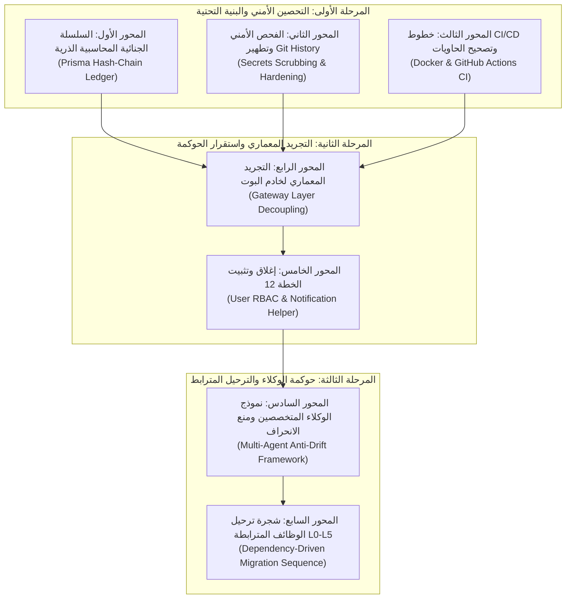

# 📋 وثيقة خطة العمل التنفيذية الكاملة والمفصلة: التحصين الجذري للأساس وحوكمة الوكلاء (PLAN-13)
## Comprehensive Master Specification: Foundation Hardening, Cryptographic Ledger, Git History Audit, Gateway Decoupling, and Anti-Drift Multi-Agent Governance

> [!IMPORTANT]
> **ميثاق الحوكمة والمرجعية المؤسسية (Sovereign Baseline Governance):**
> بناءً على التوجيه الصريح والقرارات المعتمدة من المستخدم:
> 1. **حظر ترحيل أي وظائف قبل إتمام التأسيس 100%:** يُمنع الشروع في نقل أو تفكيك أي وظيفة من المشروع القديم [`F:\HR`](file:///F:/HR) قبل إغلاق كافة الفجوات الهيكلية والأمنية وتثبيت أساس لا يقبل الانكسار.
> 2. **حظر عزل أو تخطي بوابات الحوكمة:** منع أي محاولة للالتفاف على بوابات `pnpm governance:verify` أو تعطيل فواحص التايب سكريبت أو الأسطر أو الـ any أو نظافة شجرة العمل.
> 3. **خطط العمل هي العقد الملزم:** خطة العمل تمثل التوثيق الدقيق والملزم لما تم الاتفاق عليه مع الذكاء الاصطناعي، ولا يُكتب كود خارجها.
> 4. **منظومة الوكلاء المتخصصين المستقلين:** تشغيل فرق وكلاء متوازيين بتخصصات احترافية دائمة لضمان جودة الكود، والنقد الموضوعي، ومنع ظاهرة المجاملة أو الانحراف الفردي.

---

## 1️⃣ المخطط الهيكلي الشامل للمحاور السبعة



---

## 2️⃣ التفاصيل التشريحية الكاملة للمحاور السبعة

---

### 🛡️ المحور الأول: السلسلة الجنائية والنزاهة المحاسبية الذرية (Option A Implementation)

#### 1.1 تحديث نموذج البيانات `packages/database/prisma/schema.prisma`:
إضافة حقول التدقيق الجنائي الإلزامية في كافة الجداول المالية:
- جدول السلف النقدية (`Advance`):
  ```prisma
  recordHash      String    @map("record_hash")
  previousHash    String?   @map("previous_hash")
  hashTimestamp   DateTime  @default(now()) @map("hash_timestamp")
  ```
- جدول حركات العهد الميدانية (`CustodyMovement` / `Custody`):
  ```prisma
  recordHash      String    @map("record_hash")
  previousHash    String?   @map("previous_hash")
  hashTimestamp   DateTime  @default(now()) @map("hash_timestamp")
  ```
- جدول معاملات المقصف ومسحوبات السجائر (`CanteenTransaction`):
  ```prisma
  recordHash      String    @map("record_hash")
  previousHash    String?   @map("previous_hash")
  hashTimestamp   DateTime  @default(now()) @map("hash_timestamp")
  ```
- جدول سداد ومقاصات الموردين ومصروفات المواقع (`SupplierPayment` / `SiteExpense`):
  ```prisma
  recordHash      String    @map("record_hash")
  previousHash    String?   @map("previous_hash")
  hashTimestamp   DateTime  @default(now()) @map("hash_timestamp")
  ```

#### 1.2 خوارزمية الربط الذري التلقائي (Atomic Hash Interceptor):
إنشاء ملف امتداد Prisma مخصص في المسار:  
[`packages/database/src/ledger/hash-ledger.extension.ts`](file:///f:/Alsaada-Smart-Bot/packages/database/src/ledger/hash-ledger.extension.ts)
- **منطق العمل:**
  1. اعتراض عمليات `create` و `createMany` على النماذج المالية المحددة.
  2. استعلام ذري لجلب `recordHash` لأحدث قيد مسجل لنفس الحساب أو العهدة (`findFirst({ orderBy: { hashTimestamp: 'desc' } })`).
  3. حساب الهاش الجديد عبر خوارزمية التشفير القياسية:
     $$\text{recordHash} = \text{SHA-256}(\text{previousHash} + ":" + \text{modelName} + ":" + \text{amount} + ":" + \text{actorId} + ":" + \text{timestamp})$$
  4. حقن الهاشين (`recordHash` و `previousHash`) وحفظ السجل ذرياً ضمن المعاملة الأصلية.

#### 1.3 دالة التحقق الجنائي اللحظي والدوري (`verifyLedgerChain`):
- دالة تفحص كامل السلسلة المالية لحساب معين للتأكد من عدم وجود أي فجوة أو تعديل يدوي مباشر في قاعدة البيانات.
- في حال وجود أي تلاعب، تُطلق استثناء أمنياً عالي الخطورة `CorruptedLedgerChainError` وتخطر قناة الأمان.

#### 1.4 التحول الإلزامي لترحيلات Prisma وإنهاء تسريب الاتصالات:
- إلغاء الاعتماد على `db push` وتشغيل الترحيل التأسيسي الأولي:
  `prisma migrate dev --name init_enterprise_hash_ledger`
- استئصال الاستدعاءات المنفصلة لـ `new PrismaClient()` في:
  - [`modules/workforce/src/services/worker-facade.service.ts:25`](file:///f:/Alsaada-Smart-Bot/modules/workforce/src/services/worker-facade.service.ts#L25)
  - [`modules/workforce/src/hub/hr-hub.handler.ts:9`](file:///f:/Alsaada-Smart-Bot/modules/workforce/src/hub/hr-hub.handler.ts#L9)
- فرض استخدام نسخة Prisma الموحدة المدارة مركزياً بنمط الـ Singleton.
- تفعيل فلتر الحذف الناعم التلقائي عبر `$extends` لفرض `{ isDeleted: false }` على كافة الاستعلامات تلقائياً.

---

### 🔑 المحور الثاني: الفحص الأمني وتطهير Git History وحصانة المفاتيح (Secrets Scrubbing)

#### 2.1 المسح الأمني الجنائي للـ 87 Commit:
- تنفيذ فحص كامل لتاريخ الـ Git للفرع المحلي المتراكم (87 Commit) للبحث عن أي تسريب سابق لـ:
  - توكنات التليجرام (`BOT_TOKEN`).
  - سلاسل اتصال قواعد البيانات الصريحة (`DATABASE_URL`).
  - مفاتيح التشفير السداسية (`DATABASE_ENCRYPTION_KEY`).
  - مفاتيح Google Service Account.
- استخدام أدوات الفحص المتخصصة لتطهير أي أثر حساس في شجرة الـ Git قبل المزامنة مع `origin/main`.

#### 2.2 استئصال الأسرار الافتراضية والتحقق الصارم المبكر (Fail-Fast):
- إزالة النص البديل الضعيف `'alsaada-default-key'` نهائياً من السطرين 249 و 365 في [start.handler.ts](file:///f:/Alsaada-Smart-Bot/apps/bot-server/src/handlers/start.handler.ts).
- إضافة معالج فحص صارم أثناء إقلاع خادم البوت: في حال عدم توفر `DATABASE_ENCRYPTION_KEY` بقيمة صحيحة (64 حرفاً سداسياً) أو عدم وجود `BOT_TOKEN`، ينهار الخادم فورياً برسالة خطأ صريحة ويمنع الإقلاع.

#### 2.3 توحيد تطبيع المفاتيح وتقييد المنافذ:
- إلزام خدمة التصدير [01.4-worker-export](file:///f:/Alsaada-Smart-Bot/modules/workforce/src/flows/01.4-worker-export/flow.service.ts#L27) باستخدام `normalizeKeyToHex` قبل فك التشفير لمنع ظهور الرموز المشفرة داخل ملفات الإكسيل.
- تقييد منافذ Postgres (5432) و Redis (6380) في [docker-compose.yml](file:///f:/Alsaada-Smart-Bot/docker-compose.yml) بالاستماع حصراً على `127.0.0.1`.
- حذف ملف `.env` المكرر وغير المصرح به في `packages/database/.env`.

---

### 🚀 المحور الثالث: البنية التحتية للحاويات والـ CI/CD عن بُعد (DevOps & Infrastructure)

#### 3.1 إصلاح ملف الحاوية [docker/Dockerfile](file:///f:/Alsaada-Smart-Bot/docker/Dockerfile):
- إضافة نسخ `modules/settings/package.json` في مرحلة الـ Builder.
- إضافة أمر بناء موديول الإعدادات: `pnpm --filter @alsaada/settings build` قبل بناء خادم البوت.
- في مرحلة الـ Runner: إنشاء واستخدام المستخدم غير الجذري `USER node` لمنع تشغيل التطبيق بصلاحيات Root.

#### 3.2 تأسيس خط أنابيب التكامل المستمر (`.github/workflows/ci.yml`):
إنشاء ملف الـ Workflow على المسار المعتمد ليعمل عند كل `push` و `pull_request`، متضمناً الخطوات الإلزامية:
1. فحص التايب سكريبت الصارم: `pnpm typecheck`.
2. فحص جودة ونقاء الكود: `pnpm lint`.
3. فحص كافة الاختبارات الآلية (496+ اختباراً): `pnpm test`.
4. فحص كافة بوابات الحوكمة المؤسسية: `pnpm governance:verify`.
5. فحص بناء الحاوية: `docker build -f docker/Dockerfile .`.

#### 3.3 تثبيت خطافات Git الآلية:
- إضافة أمر `"prepare": "git config core.hooksPath .githooks"` في `package.json`.
- توسيع فواحص [.githooks/pre-commit](file:///f:/Alsaada-Smart-Bot/.githooks/pre-commit) لتشمل بوابات الحوكمة الأساسية والتحقق من عدم وجود نوع `any` أو ملفات مبعثرة.

---

### 🏛️ المحور الرابع: التجريد المعماري الشامل وعزل خادم البوت (Gateway Layer Decoupling)

#### 4.1 تطهير معالجات خادم البوت من معاملات قاعدة البيانات:
- **[start.handler.ts](file:///f:/Alsaada-Smart-Bot/apps/bot-server/src/handlers/start.handler.ts) (حالياً 461 سطراً):**
  - نقل معاملات `prisma.$transaction([ prisma.worker.update, prisma.user.upsert ])` من الأسطر 404-425 إلى تدفق `01.7-guest-join-and-linking` بموديول workforce.
  - تقليص حجم الملف ليكون أقل من 350 سطراً مع الاقتصار على توجيه مسار البداية ورسائل الترحيب.
- **[worker-portal.handler.ts](file:///f:/Alsaada-Smart-Bot/apps/bot-server/src/handlers/worker-portal.handler.ts) (226 سطراً):**
  - استئصال استعلامات `prisma.worker.findUnique` و `findFirst` المباشرة، وتفويض جلب بيانات العامل وكروت الهوية إلى خدمة `worker-facade.service.ts` بموديول workforce.
- **[group-manager.handler.ts](file:///f:/Alsaada-Smart-Bot/apps/bot-server/src/handlers/group-manager.handler.ts) (310 سطراً):**
  - ترحيل منطق تسجيل المجموعات وربطها بالمواقع إلى تدفق `00.11-telegram-groups` بموديول settings.
- **تطهير أزرار `bot.hears` المعلقة في `bot.ts`:**
  - استبدال الردود النصية المؤقتة ("تحت التجهيز") بتوجيه المعالجات إلى التدفقات المكتملة أو تفريغها من القائمة الرئيسية.

#### 4.2 استكمال المعمارية القياسية لموديول `modules/settings`:
- إضافة `README.md` و `module.contract.json` في جذر الموديول.
- إنشاء `index.ts` في جذر الموديول يصدر كافة التدفقات الـ 11 والواجهات والأنواع.
- نقل [settings-hub.ts](file:///f:/Alsaada-Smart-Bot/modules/settings/src/shared/settings-hub.ts) من مجلد `shared/` إلى موقعه الصحيح داخل الموزعات.

#### 4.3 توسيع فاحص المعمارية [tools/governance/verify-architecture.ts](file:///f:/Alsaada-Smart-Bot/tools/governance/verify-architecture.ts):
- برمجة فحص صارم يفحص ملفات `apps/bot-server/src/handlers/` ويصدر خطأ `FAIL` فوري إذا وُجد أي استدعاء مباشر لـ `prisma.*`، لضمان استمرار عزل واجهة البوت عن طبقة البيانات للأبد.

---

### 📦 المحور الخامس: إغلاق وتثبيت الخطة 12 لكسر انسداد الحوكمة بنظافة تامة

#### 5.1 استكمال ملفات الخطة 12 المفتوحة:
- استكمال ومراجعة تدفق `00.12-user-rbac-management` بموديول settings.
- استكمال الدالة المشتركة الموحدة للإشعارات [`notification-helper.ts`](file:///f:/Alsaada-Smart-Bot/packages/core-components/src/multi-channel/notification-helper.ts).
- تشغيل واختبار `packages/core-components/tests/notification-helper.spec.ts`.
- تثبيت الخطة 12 وإيداع إثبات التنفيذ في `docs/ai-execution-evidence/` وعمل Commit نظيف لها.
- **الهدف:** استعادة نظافة شجرة العمل وخروج أمر `pnpm governance:verify` بحالة `PASS 100%` دون أي استثناء أو عزل.

---

### 🤖 المحور السادس: نموذج الوكلاء المتخصصين وبروتوكول منع الانحراف (AI Anti-Drift Architecture)

#### 6.1 مصفوفة الأدوار المتخصصة الدائمة (Specialized Agent Matrix):
1. **المهندس المعماري الرئيسي ومدير النظام (Principal Architect & Orchestrator):**  
   - مسؤول عن قيادة المشروع، التحقق من مطابقة السلوك مع المرجع القديم `F:\HR`، إدارة خطط العمل في `docs/work-plans/`، والتنسيق بين الوكلاء.
2. **حارس قواعد البيانات والأمن (Security & Database Sentinel):**  
   - مسؤول حصرياً عن `packages/database`, التشفير، الـ Hash Chain، ترحيلات Prisma، ومطابقة الأرصدة.
3. **المنفذ الموديولي المتخصص (Core Modular Implementer - DeepCoder):**  
   - مسؤول عن بناء وتعديل التدفقات وفق هيكل الـ 15 ملفاً الصارم والالتزام بسقف الأسطر واستيراد مكونات النواة المشتركة.
4. **المدقق المعادي المستقل (Adversarial QA & Governance Auditor):**  
   - مسؤول عن مراجعة الكود نقدياً، فحص الـ Edge Cases، استبعاد المجاملات، والتأكد من نجاح بوابات الحوكمة والاختبارات بنسبة 100%.
5. **مهندس البنية التحتية والـ DevOps (DevOps Engineer):**  
   - مسؤول عن Docker، خطوط CI/CD، خطافات Git، وأدوات السقالات والأتمتة (`make:flow`, `finish-flow`).

#### 6.2 بروتوكول الاعتراض المهني الإلزامي (Duty to Challenge Protocol):
- يُلزم كل وكيل بإخضاع أي مقترح (سواء كان من مطور أو مستخدم) لفحص المخاطر الثلاثة:
  1. خطر النزاهة المالية وتكرار الصرف أو التزامن غير الآمن.
  2. خطر كسر العزل المعماري أو زيادة حجم الملفات عن سقف 350 سطراً.
  3. خطر انحراف السلوك عن المرجع الأساسي `F:\HR`.
- يُلزم الوكيل بتقديم البديل الأفضل والأكثر استقراراً بأسلوب هندسي مجرد وصريح دون أي مجاملة.

#### 6.3 الحراس البرمجيون غير القابلين للالتفاف (Machine Gatekeepers):
- الحوكمة ليست مجرد توصيات نصية، بل فواحص برمجية صلبة تعمل آلياً على القرص وعبر السيرفر:
  - خطاف `pre-commit` يمنع الـ Commit إذا وُجد `any` أو ملف متضخم أو استعلام DB في البوت.
  - فاحص `governance:verify` يرفض العمل إذا كان هناك ملف مبعثر أو سقط تسجيل تدفق في `docs/19`.
  - قفل الحوكمة `governance.lock.json` يحمي الملفات الحاكمة بتجزئة SHA-256 لمنع التلاعب بالقواعد.

---

### 🗺️ المحور السابع: استراتيجية وجدولة ترحيل الوظائف الـ 126 (مهمة لاحقة مستقلة)

> [!NOTE]
> **توجيه المستخدم الصريح المعتمد:**
> لا يتم توثيق أو ترتيب أو تفصيل خطوات نقل الوظائف الـ 126 في هذه المرحلة الحالية.  
> يُكتفى هنا حصراً بالتأكيد والتنبيه المنهجي على أن **إعادة تنظيم وتفكيك وجدولة قائمة النقل الـ 126 وفقاً للترابط الوظيفي والاحتياج البيني هي مهمة مستقلة لاحقة**، وسيتم إعداد وثيقة خطة عمل مخصصة واحترافية لها فور الانتهاء من التأسيس التام بنسبة 100% واستيفاء كافة معايير قبول الخطة 13 الحالية.


---

## 3️⃣ مصفوفة التحقق ومعايير القبول الحاسمة (Acceptance Criteria)

| م | معيار القبول الصارم | أداة الفحص والتحقق الآلي | النتيجة المستهدفة |
| :-: | :--- | :--- | :---: |
| 1 | وجود حقول `recordHash` و `previousHash` في كافة الجداول المالية | فحص [schema.prisma](file:///f:/Alsaada-Smart-Bot/packages/database/prisma/schema.prisma) وترحيلات Prisma | ✅ موجودة ومثبتة |
| 2 | الحساب التلقائي للهاش الجنائي ذرّياً عند كل حركة مالية | اختبارات وحدة وتكامل في `packages/database/tests/` | ✅ PASS 100% |
| 3 | خلو كامل الـ 87 Commit على فرع `main` من أي أسرار مسربة | أداة مسح أسرار Git المخصصة | ✅ Clean History |
| 4 | استئصال الرمز الافتراضي `'alsaada-default-key'` وانهيار الخادم عند غياب المفتاح | اختبار فحص المتغيرات البيئية بـ Vitest | ✅ Fail-Fast Enforced |
| 5 | نجاح بناء حاوية Docker دون أخطاء وتشغيلها بمستخدم `node` | `docker build -f docker/Dockerfile .` | ✅ Exit Code 0 |
| 6 | وجود خط أنابيب GitHub Actions للـ CI/CD فعال وموثق | فحص ملف `.github/workflows/ci.yml` | ✅ Valid CI Pipeline |
| 7 | خلو معالجات البوت `apps/bot-server/src/handlers/` من استعلامات DB | فحص [tools/governance/verify-architecture.ts](file:///f:/Alsaada-Smart-Bot/tools/governance/verify-architecture.ts) | ✅ Zero DB in Gateway |
| 8 | خفض أسطر `start.handler.ts` لأقل من 350 سطراً | عداد الأسطر الآلي بـ `flow:check` | ✅ < 350 Lines |
| 9 | استكمال الخطة 12 ونظافة شجرة العمل بـ Git بنسبة 100% | أمر `git status -s` | ✅ 0 Untracked Files |
| 10 | اجتياز كافة بوابات الحوكمة المؤسسية دون أي تخطٍ | أمر `pnpm governance:verify` | ✅ PASS 100% (Code 0) |
| 11 | نجاح حزمة الاختبارات الشاملة (496+ اختباراً) | أمر `pnpm test` | ✅ 100% Passing |
| 12 | تطابق سجل الترحيل الشامل Doc 19 مع مجلدات القرص ثنائياً | أمر `verify-migration-registry.ts` | ✅ Bidirectional Parity |
