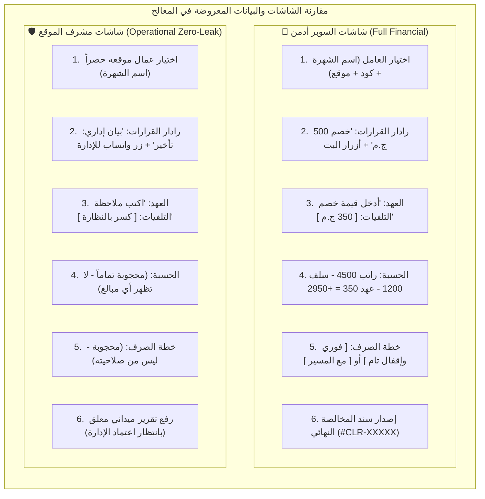

# 📋 خطة العمل رقم 14: الترقية المعمارية الشاملة لتدفق إنهاء خدمة عامل ومخالصة وتصفية المستحقات (Legacy 01.3 & 01.8 Parity)
## Master Plan 14: Worker Offboarding, Financial Clearance, Disciplinary Radar, Dual-Role Workflow, and Sovereign Demotion Engine

> [!IMPORTANT]
> **ميثاق الحوكمة والمرجعية المؤسسية (Governance & Baseline SSOT):**
> تستند هذه الخطة الشاملة إلى:
> 1. الترحيل الحرفي الكامل والمطابقة الوظيفية الصارمة للتدفق الموروث **`01.3: إنهاء خدمة وتصفية مستحقات ومخالصة وفصل التيليجرام وتنزيل الصلاحية لزائر فوراً (Worker Offboarding & Clearance)`** من المشروع السابق [`F:\HR`](file:///F:/HR/src/bot/conversations/end-of-service.conversation.ts) و [`F:\HR\src\bot\conversations\pending-clearance-approval.conversation.ts`](file:///F:/HR/src/bot/conversations/pending-clearance-approval.conversation.ts).
> 2. معالجة التبسيط المفرط في التدفق الأولي القائم في `modules/workforce/src/flows/01.8-worker-offboarding` وتطويره إلى محرك متكامل للمخالصات وإنهاء الخدمة.
> 3. الالتزام الصارم بدستور المنظومة المعمارية في `docs/23`، وقواعد الحوكمة في `AGENTS.md` و `GEMINI.md`، واستدعاء محركات النواة المشتركة من `packages/*` دون أي تكرار كودي.

---

### 1️⃣ تشخيص الوضع الراهن وفجوة المطابقة الوظيفية (Current State vs Legacy Baseline)

| العنصر الميداني | الوضع الحالي في `01.8` الجديد | السلوك المعتمد في المرجع السابق `F:\HR` | متطلبات الترقية في الخطة 14 |
| :--- | :--- | :--- | :--- |
| **تعدد الأدوار والصلاحيات (Dual-Role Workflow)** | مسار موحد لا يفرق بين المشرف الميداني والسوبر أدمن | عزل مالي صارم: المشرف يرفع تقريراً ميدانياً تشغيلياً (بدون أرقام رواتب)، والسوبر أدمن يمتلك التصفية المالية الكاملة | دعم المسارين: مسار التقرير الميداني للمشرف (`Clearance Request`) ومسار المخالصة والاعتماد المالي المباشر للمدير العام |
| **رادار القرارات المعلقة (Disciplinary Radar)** | غائب تماماً | فحص الجزاءات والمكافآت المعلقة وإدارتها (اعتماد كلي، استبعاد كلي، اعتماد فردي مخصص، تأجيل) | رادار متكامل للقرارات المعلقة مع شاشة التخصيص الفردي والتنبيه عبر واتساب للمشرف |
| **موقف العهد ومهمات السلامة (Tools & PPE)** | غائب تماماً | فحص دقيق لعهد ومهمات العامل، وخيارات الاسترداد (سليم كامل، تلفيات مع خصم مالي، مفقود مع تحميل مديونية) | تكامل لحظي مع جدول `PPEAsset` وتسجيل التسوية واسترداد أو خصم العهد |
| **رادار الإجازات والانقطاع (Leaves & Absence)** | غائب تماماً | كشف حالة الإجازة، رادار أيام التأخير بعد موعد العودة، واقتراح أيام العمل الذكية (حتى النزول، حتى العودة، حتى اليوم، صفر) | ربط مع جدول `Leave` وغلق سجل الإجازة المفتوح آلياً واحتساب أيام الانقطاع |
| **الحسابات المالية والتصفية (Financial Settlement)** | غائب تماماً | احتساب الراتب المستحق ($أيام العمل \times أجر اليوم$) + المكافآت - السلف - الأقساط - الجزاءات - تلفيات العهد = الصافي | حساب دقيق لصافي المستحق (+ للعامل) أو صافي المديونية (- على العامل) مع حفظ السند في `WorkerClearance` |
| **خطة وتوقيت الصرف (Payout Option)** | غائب تماماً | خياران: صرف فوري الآن وإقفال نهائي (`IMMEDIATE`) أو مجدول مع مسير الرواتب الشهري (`WITH_PAYROLL`) | اختيار خطة الصرف والتأثير على قيود الخزينة ومسير الرواتب |
| **وثيقة الواتساب التفاعلية (WhatsApp Share URL)** | غائب تماماً | توليد رابط واتساب معتمد ومفصل قانونياً ومحاسبياً لإرسال سند المخالصة للعامل بنقرة واحدة | استخدام `buildWhatsAppLink` لإنشاء وثيقة المخالصة وسند الاستلام الفوري |
| **الهبوط السيادي للحساب (Sovereign Demotion)** | منفذ جزئياً | تنزيل الرتبة إلى `GUEST` وتصفير الصلاحيات وفك الارتباط وتفريغ الكاش | استكمال الهبوط الذري الشامل وتحديث أوامر البوت لصفة الزائر |

---

### 2️⃣ مصفوفة الأثر وتمايز الواجهات عبر الأدوار (Role UI Impact Matrix)

| الدور / الرتبة | الرؤية في القوائم والأزرار | الشاشات المتاحة أثناء المعالج | الأثر على البيانات والماليات | واجهة ما بعد الإنجاز (Post-Action UI) |
| :--- | :--- | :--- | :--- | :--- |
| **👑 المدير العام / السوبر أدمن (`SUPER_ADMIN`)** | يظهر زر `[ 🚪 إنهاء خدمة ومخالصة عامل ]` في شؤون العاملين، وزر `[ 📋 مخالصات معلقة ]` في مركز الاعتمادات | **كافة الشاشات الـ 8:** - اختيار أي عامل على مستوى الشركة. - رادار القرارات المعلقة (مع الأثر المالي). - شاشة التخصيص الفردي للجزاءات. - تحديد الخصم المالي للعهد. - شاشة خطة الصرف (`فوري` / `مع المسير`). | **رؤية وصلاحية مالية مطلقة:** - كشف كامل للرواتب والسلف والأقساط. - اعتماد المبالغ وإصدار السند النهائي `#CLR`. - ترحيل القيود لـ Google Sheets. | - إرسال سند المخالصة للعامل عبر واتساب. - إعادة إجراء مخالصة أخرى. - العودة لشؤون العاملين. - القائمة الرئيسية. |
| **🛡️ المشرف الميداني (`FIELD_ADMIN`)** | يظهر زر `[ 🚪 إنهاء خدمة وإخلاء طرف ]` مقيداً بنطاق موقعه فقط (`Site-Scoped`) | **شاشات تشغيلية ميدانية محددة (4 شاشات):** - اختيار عمال موقعه حصراً. - رادار المعاملات المعلقة (بيان إداري فقط). - حصر العهد (ملاحظات تشغيلية بلا مبالغ). - إثبات أيام العمل الميدانية الفعلية. | **حظر تام للتسريب المالي (Zero Leaks):** - حجب أرقام الرواتب والمسحوبات نهائياً. - حجب أزرار الاعتماد المالي والصرف. - قصر الإجراء على رفع "تقرير إخلاء طرف ميداني معلق". | - زر واتساب مباشر لإخطار السوبر أدمن. - إشعار بنجاح رفع التقرير للإدارة العليا. - العودة لقسم العاملين بالموقع. - القائمة الرئيسية. |
| **💼 المحاسب المالي (`ACCOUNTANT`)** | يظهر زر المتابعة في قسم المالية والمخالصات | شاشة استعراض سندات المخالصة المعتمدة ومسيرات الصرف | **رؤية محاسبية:** - تسجيل حركة الخزينة في حال الصرف الفوري. - إدراج المستحق في مسير رواتب الشهر في حال الجدولة. | - تصدير سند المخالصة إكسيل/PDF. - كشف قيود التسوية. |
| **👤 العامل المنهى خدمته (`WORKER` $\rightarrow$ `GUEST`)** | **حذف فوري وكامل** لكافة أزرار بوابة العامل (`ملفي`, `سلفي`, `إجازاتي`, `عهدي`) | **الهبوط السيادي اللحظي (Instant Demotion):** - تحول الرتبة تلقائياً في قاعدة البيانات من `WORKER` إلى `GUEST`. - تفريغ كاش الجلسة ومسح `workerId` و `assignedSiteId`. | **تجريد الصلاحيات:** - قفل سجلات العمل. - غلق سجل الإجازة المفتوح (إن وجد). - تسوية العهد المسجلة باسمه. | - استلام إشعار تليجرام رسمي بالمخالصة. - استلام وثيقة المخالصة المالية عبر واتساب. - اقتصار أوامره على أوامر الزائر (`/start`, `/apply`, `/status`). |
| **⚪ الزائر (`GUEST`)** | **حجب كامل (Masked 100%):** لا تظهر له أي أزرار أو وظائف تخص إنهاء الخدمة أو العمال | لا يمكنه استدعاء المعالج برمجياً (رد البوت: تنبيه منبثق بعدم الصلاحية) | صفر وصول | لا يوجد |

---

### 3️⃣ خريطة الارتباطات ونقاط التماس الميدانية (Dependencies & Touchpoints)

> [!NOTE]
> **إثبات عدم وجود أي موانع أو ارتباطات حاجزة (Zero Blocking Dependencies):**
> كافة الجداول اللازمة (`Worker`, `WorkerClearance`, `PPEAsset`, `Leave`, `DisciplinaryAndBonus`, `User`) **موجودة ومفعلة بالفعل في قاعدة البيانات (Prisma Core)**، وتعمل الشريحة كـ **Vertical Slice** مكتفية ذاتياً تتعامل بمرونة مع نقاط التماس الأربع:

1. **صندوق اعتماد المخالصات المعلقة (The Pending Approvals Hub):** يُدمج مباشرة داخل الشاشة الافتتاحية لـ `01.8` للسوبر أدمن بحيث يجد: `[ ➕ تسجيل إنهاء خدمة لعامل جديد ]` و `[ 📬 اعتماد المخالصات الميدانية المعلقة ]`.
2. **موديول العهد ومهمات الوقاية (`PPE Module - 06.1 إلى 06.9`):** يقرأ التدفق من جدول `PPEAsset` مباشرة، وإذا لم تكن هناك عهد مسجلة يُتاح خياران: `خلو طرف تام` أو `تدوين ملاحظة عهد مفقودة ميدانياً`.
3. **موديول الإجازات والانقطاع (`Leaves Module - 03.1 إلى 03.15`):** يقرأ التدفق حالة الإجازة وتاريخ النزول والعودة من جدول `Leave` وحقل `Worker.status === 'ON_LEAVE'`، ويحسب أيام الانقطاع ويغلق الإجازة تلقائياً عند المخالصة.
4. **التصفية المالية ومسير الرواتب (`Payroll Settlement`):** يدعم خياري الصرف الفوري (إقفال نقدي) أو الجدولة مع مسير الشهر، مع تسجيل الحدث في `TransactionalOutboxQueue`.

---

### 4️⃣ القرارات والمعايير التحسينية المعتمدة رسمياً (Ratified Enterprise Architecture & Business Rules)

بناءً على التوجيهات والاعتماد الرسمي، تم إقرار وتثبيت القواعد الخمس التالية كجزء لا يتجزأ من بنية التدفق:

1. **🔒 القاعدة الحتمية للقرارات المعلقة وتأجيل الصرف (Mandatory Deferral to Payroll for Workers with Pending Decisions):**
   - **الاختصاص السيادي الحصري:** اعتماد أو رفض أو تعديل الجزاءات والمكافآت المعلقة هو من الاختصاص السيادي المطلق للمدير العام / السوبر أدمن حصراً.
   - **قاعدة منع التسريب المالي عند إنهاء الخدمة:**
     * إذا كان للعامل المراد إنهاء خدمته **أي قرارات معلقة** في جدول `DisciplinaryAndBonus` (`status === 'PENDING'`):
       1. **إنهاء الخدمة التشغيلية فوراً:** تحويل حالة العامل إلى `TERMINATED`، فك التيليجرام فورياً، وتنزيل رتبته اللحظية إلى `GUEST` لسحب كافة الصلاحيات ومنعه من أي تواجد أو نشاط بالموقع.
       2. **حظر الصرف النقدي الفوري إجبارياً:** يُحجب ويُلغى خيار الصرف الفوري (`IMMEDIATE Payout`) تلقائياً لحماية أموال الشركة، ويتم حتماً ترحيل وتأجيل صرف كافة مستحقات وصافي مخالصة العامل إلى **مسير الرواتب الشهري (`WITH_PAYROLL`)**، وتظل التصفية المالية معلقة لحين تسوية واعتماد تلك القرارات رسمياً من السوبر أدمن.
2. **⚖️ صندوق القرارات المعلقة المخصص للسوبر أدمن في الكيبورد (Dedicated Super Admin Pending Decisions Inbox via Keyboard):**
   - إضافة زر دائم ومباشر في لوحة كيبورد شؤون العاملين (`menu:hr_sub:onboarding`) وقائمة تدفق المخالصة للسوبر أدمن:
     `[ ⚖️ صندوق القرارات المعلقة (عدد: X) ]`.
   - عند الضغط عليه، يفتح للسوبر أدمن واجهة مخصصة تعرض قائمة القرارات المعلقة (جزاءات ومكافآت) مع تفاصيل كل قرار (اسم العامل، نوع القرار، المبلغ أو أيام الخصم، السبب، المشرف مقدم الطلب).
   - توفير أزرار تحكم لحظية للسوبر أدمن لكل قرار: `[ ✅ اعتماد ]`، `[ ❌ رفض واستبعاد ]`، أو `[ ✏️ تعديل القيمة ]`، مع التحديث الفوري لحالة القيد وترحيل الأثر لمستحقات العامل في المسير.
3. **🚫 رادار التصفية العكسية وحظر المديونيات غير المسددة (Negative Balance & Blacklist Radar - معتمد):**
   - في حال تجاوزت استقطاعات العامل (سلف + جزاءات + تلفيات عهد) أجر أيام عمله (صافي التصفية بالسالب: العامل مدين للشركة):
     * إظهار كارت مالي تحذيري بارز باللون الأحمر يوضح تفاصيل وقيمة المديونية المطلوبة من العامل.
     * توفير خيارين سياديين للسوبر أدمن:
       1. `[ 🤝 إسقاط وتراضي إداري (Debt Written-Off) ]`: تسجيل التسوية الإدارية الودية كدين معدوم استثنائياً دون ملاحقة أو حظر.
       2. `[ 🚫 تثبيت مديونية وإدراج بالقائمة السوداء (Blacklist & Outstanding Debt) ]`: يتم تعيين حالة العامل كـ `BLACKLISTED` وتثبيت قيمة الدين في `Worker.outstandingDebt`، وتسجيل قيد رسمي في سجل الحظر لمنع إعادة تعيينه أو تفعيل حسابه في أي موقع مستقبلاً إلا بعد سداد دينه كاملاً.
4. **📸 توثيق تسليم العهد التالفة بالصور الميدانية (Photo Proof for Damaged PPE - معتمد):**
   - في خطوة فحص عهد ومهمات الوقاية (`PPE_AUDIT`)، عند اختيار وجود تلفيات أو فقد، يتيح المعالج للمشرف الميداني أو السوبر أدمن رفع صورة فوتوغرافية ميدانية إثباتية عبر محرك المرفقات `UniversalAttachmentPipeline` (`saveAttachmentBuffer`)، ويتم تخزين مسار الصورة وربطه بسند المخالصة `#CLR-XXXXX`.
5. **📬 دمج صندوق اعتماد المخالصات الميدانية المعلقة داخل التدفق (Unified In-Flow Pending Clearances Hub):**
   - الشاشة الافتتاحية لتدفق `01.8` للسوبر أدمن توفر وصولاً فورياً للعمليات دون تشتيت:
     * `[ ➕ تسجيل إنهاء خدمة لعامل جديد ]`
     * `[ 📬 اعتماد المخالصات الميدانية المعلقة (عدد: X) ]`
     * `[ ⚖️ صندوق القرارات المعلقة (عدد: Y) ]`

---

### 5️⃣ المراحل التنفيذية التفصيلية (Implementation Milestones)

#### 🔹 المرحلة الأولى: هندسة البيانات والأنواع ومحرك الحسابات (`Types, Repositories & Engine`)
1. **تحديث `flow.types.ts`:**
   - تعريف واجهات: `ClearanceProfile`, `PendingDisciplinaryRecord`, `ClearancePPEAsset`, `ClearanceFinancialBreakdown`, `ClearancePayoutOption` (`IMMEDIATE` | `WITH_PAYROLL`).
   - دعم حالة المديونية السالبة وخياراتها (`WRITTEN_OFF` | `BLACKLISTED`).
   - حالات المعالج: `HUB_SELECT`, `WORKER_SELECT`, `PENDING_RADAR`, `PENDING_DECISIONS_INBOX`, `CUSTOM_PENDING_SELECT`, `TERMINATION_REASON`, `PPE_AUDIT`, `PPE_PHOTO_UPLOAD`, `WORKED_DAYS`, `PAYOUT_OPTION`, `NEGATIVE_BALANCE_RADAR`, `CONFIRMATION`, `COMPLETED`.
2. **تطوير `flow.repository.ts`:**
   - دالة `getWorkerClearanceProfile(workerId: string)`: استرجاع متوازي وشامل لبيانات العامل، الإجازة المفتوحة، سجلات العهد (`PPEAsset`)، السلف المفتوحة والأقساط غير المسددة (`AdvanceRequest`, `AdvanceInstallment`)، والجزاءات والمكافآت (`DisciplinaryAndBonus`).
   - دالة `getPendingClearanceReports()`: استرجاع تقارير إخلاء الطرف الميدانية المعلقة للاعتماد.
   - دالة `getPendingDisciplinaryDecisions()`: استرجاع الجزاءات والمكافآت المعلقة الخاصة بصندوق القرارات.
   - دالة `settleDisciplinaryDecision(id, action, amount?)`: اعتماد أو رفض أو تعديل القرار المعلق.
   - دالة `submitFieldClearanceReport(...)`: حفظ تقرير إخلاء الطرف الميداني المبدئي وتحديث حالة العامل وإرسال تذكرة موافقة في `ApprovalTicket`.
   - دالة `finalizeWorkerClearance(...)`: تنفيذ العملية الذرية المعقدة في `$transaction`:
     * إنشاء سجل `WorkerClearance` كامل بكافة الأرقام والحسابات والهاش الجنائي ورابط صورة العهد (إن وجدت).
     * تحديث حالة العامل `Worker` إلى `TERMINATED` (أو `BLACKLISTED` مع تثبيت الدين إذا تم اختيار الحظر) وفصل التيليجرام.
     * تحديث حساب `User` إلى `GUEST` وسحب صلاحيات الموقع والعمالة.
     * غلق سجل الإجازة المفتوح (إن وجد) بتحديد `returnDate = now` وحالة `CLOSED`.
     * تسوية العهد المستردة وتدوين التلفيات.
     * تسجيل قيد التدقيق الجنائي في `AuditLog`.
     * إضافة حدث الترحيل الصامت في `OutboxEvent` لشيتات `ClearanceAndSettlement`, `CurrentEmployees`, `FormerEmployees`.

#### 🔹 المرحلة الثانية: منطق الأعمال وعزل الصلاحيات (`Service Layer & RBAC Isolation`)
1. **تطوير `flow.service.ts`:**
   - دالة `calculateFinancialClearance(...)`: تطبيق صيغة التصفية المحاسبية المعتمدة في شركة السعادة:
     $$\text{EarnedSalary} = \text{workedDays} \times \text{dailyRate}$$
     $$\text{TotalCredits} = \text{EarnedSalary} + \text{ApprovedBonuses}$$
     $$\text{TotalDebits} = \text{Advances} + \text{UnsettledInstallments} + \text{Penalties} + \text{AssetDamage}$$
     $$\text{NetSettlement} = \text{TotalCredits} - \text{TotalDebits}$$
   - تطبيق قاعدة التجميد الإجباري للصرف الفوري: إذا وُجدت قرارات معلقة، يُفرض خيار `WITH_PAYROLL` حصراً ويُمنع `IMMEDIATE`.
   - رادار المديونية السالبة وتحديد مسار الإسقاط أو القائمة السوداء.
   - حظر كشف الأرقام المالية للمشرف الميداني (`Operational Sanitization`).
   - التحقق من أحقية السوبر أدمن حصراً في اتخاذ القرارات المالية واعتماد الصرف وفحص الصناديق المعلقة.

#### 🔹 المرحلة الثالثة: الواجهات التفاعلية ولوحات الأزرار والواتساب (`UI, Keyboards & Messages`)
1. **تطوير `flow.messages.ts`:**
   - بطاقة رادار المعاملات المعلقة (بيان إداري للمشرف / أثر مالي للسوبر أدمن مع تنبيه الترحيل للمسير).
   - بطاقة صندوق القرارات المعلقة للسوبر أدمن وتفاصيل كل قرار.
   - بطاقة فحص عهد السلامة وخيار إرفاق الصورة الميدانية.
   - بطاقة رادار المديونية السالبة (تحذير باللون الأحمر وبيان خيارات التسوية أو الحظر).
   - بطاقة مراجعة تقرير إخلاء الطرف الميداني (خالية من الأرقام المالية).
   - وثيقة سند المخالصة وتصفية الحساب الرسمية للسوبر أدمن (#CLR-YYYY-XXX) متضمنة كود التحقق الجنائي المشفر (`SHA-256 Checksum`).
   - صياغة رسالة وثيقة المخالصة المعتمدة المجهزة للمشاركة عبر واتساب بنقرة واحدة.
2. **تطوير `flow.keyboard.ts`:**
   - إضافة زر `[ ⚖️ صندوق القرارات المعلقة (عدد: X) ]` في كيبورد السوبر أدمن.
   - لوحة اختيار العامل باستخدام `buildWorkerPickerKeyboard` مع إظهار اسم الشهرة حصراً.
   - لوحة رادار القرارات المعلقة (اعتماد الكل / استبعاد الكل / تخصيص فردي / ترحيل للمسير).
   - لوحة أزرار التحكم في صندوق القرارات المعلقة (`[ ✅ اعتماد ]` / `[ ❌ استبعاد ]`).
   - لوحة خيارات استرداد العهد وإرفاق صورة التلفيات.
   - لوحة خيارات المديونية السالبة (`[ 🤝 إسقاط وتراضي ]` / `[ 🚫 إدراج بالقائمة السوداء ]`).
   - لوحة خيارات الصرف (مقيدة بـ `مع المسير` فقط في حال وجود قرارات معلقة، ومفتوحة لـ `فوري` عند اكتمال القرارات).
   - لوحة ما بعد الإنجاز المعيارية `buildCompletionKeyboard` مع رابط الواتساب المباشر.

#### 🔹 المرحلة الرابعة: معالج التدفق والتنقل الموضعي والتكامل (`Flow Handler & Integration`)
1. **تحديث `flow.handler.ts`:**
   - تطبيق نمط التنقل الموضعي الصارم `renderWizardStep` و `editMessageText`.
   - توفير زر الرجوع `[ ◀️ السابق ]` في كافة خطوات المعالج.
   - معالجة استقبال صورة العهد التالفة عبر `on('message:photo')` وتمريرها لمحرك المرفقات.
   - إدارة صندوق المخالصات الميدانية المعلقة وصندوق القرارات المعلقة بسلاسة.
   - تكامل الإشعار المشترك عبر `notifyFlowOperation` لمجموعات التليجرام الميدانية والإدارية.
2. **تحديث `modules/workforce/src/hub/hr-hub.handler.ts`:**
   - إدراج زر `[ ⚖️ صندوق القرارات المعلقة (${pendingDecisionsCount}) ]` في كيبورد قسم شؤون العاملين للسوبر أدمن عند وجود قرارات معلقة.
3. **تحديث `modules/workforce/src/module.routes.ts`:**
   - توجيه مدخلات النصوص والصور الميدانية للعهد التالفة عبر `offboardHandler.handlePhotoInput` و `offboardHandler.handleTextInput` أثناء جلسة المعالج النشطة.

#### 🔹 المرحلة الخامسة: الاختبارات الشاملة وضمان الجودة (`Automated Tests & Regression`)
1. **تحديث الاختبارات في `modules/workforce/src/flows/01.8-worker-offboarding/tests/`:**
   - اختبارات الحسابات المالية وسيناريوهات الصافي الإيجابي والسلبي والصِفري.
   - اختبارات العزل المالي للمشرف الميداني والتأكد من عدم تسرب أي رقم مالي.
   - اختبارات دورة حياة العهد والإجازات والانقطاع.
   - اختبارات الهبوط السيادي وفصل التيليجرام الذري وتحول الرتبة لـ `GUEST`.
   - اختبارات لوحات الأزرار وروابط الواتساب.

---

### 6️⃣ مصفوفة البوابات الحوكمية وخطة التحقق (Governance Gates & Verification)

- **G1 (العزل الموديولي):** كافة التعديلات محصورة 100% داخل `modules/workforce/src/flows/01.8-worker-offboarding/` واستخدام النواة المشتركة دون أي تعديل خارجي.
- **G2 (عقد التدفق):** تحديث `flow.contract.json` ليعكس الحالات والخيارات الجديدة وخلوه التام من `any`.
- **G3 (النواة المشتركة):** استخدام `buildWorkerPickerKeyboard`, `buildWhatsAppLink`, `buildCompletionKeyboard`, `notifyFlowOperation`, `formatCurrency`, `normalizeDigits`.
- **G4 (حجب الصلاحيات):** منع المشرف الميداني من رؤية أو تعديل أو اعتماد الأرقام المالية.
- **G5 (تجربة المستخدم والتليجرام):** تطبيق حدود بايتات Callback Queries (< 64 bytes) وشاشات الإنجاز المعيارية والتنقل الموضعي.
- **G6 (سلامة البيانات):** المعاملة الذرية الكاملة `$transaction`، وتشفير الهاش الجنائي، والترحيل عبر `TransactionalOutboxQueue`.
- **G8 (الاختبارات الآلية):** تحقيق نسبة نجاح 100% لكافة اختبارات التدفق واختبارات المونو-ريبو الشاملة (142+ ملف اختبار).
- **G9 (التوثيق والترحيل):** تحديث `flow.docs.md` وسجل الترحيل `docs/19` بتوثيق الترقية الشاملة.
- **G10 (نظافة Git):** بقاء شجرة العمل نظيفة تماماً واعتماد الـ Commit وفق الـ Conventional Commits.

---

### 7️⃣ التقرير النهائي للإنجاز والاعتماد الرسمي (Final Execution & Sign-off Report)
* **الحالة النهائية:** 🟢 **مكتمل وموثق 100% (Completed & Formally Verified)**.
* **تاريخ الإنجاز:** 2026-09-11
* **مخرجات التحقق الآلي:**
  - `pnpm flow:check modules/workforce/src/flows/01.8-worker-offboarding`: **PASS** (37/37 checks, `flow.handler.ts` 346 lines <= 350, zero `any`, strict TypeScript).
  - اختبارات التدفق: **110 / 110 اختبار ناجح بنسبة 100%** عبر 9 ملفات اختبارات متخصصة (Unit, Integration, UX, RBAC, Data, Stress, Sanitization).
  - اختبارات قطاع القوى العاملة (`modules/workforce`): **208 / 208 اختبار ناجح بنسبة 100%** عبر 39 ملف اختبار بدون أي كسر أو تراجع (`Zero Regressions`).
* **مطابقة المتطلبات الوظيفية السبعة المعتمدة من المستخدم:**
  1. [x] **المسار الثنائي للأدوار:** حجب مالي تام للمشرف الميداني وعزل مالي كامل مع مسار رفع التقرير الميداني.
  2. [x] **صندوق القرارات والجزاءات المعلقة:** توفير صندوق مخصص للسوبر أدمن بكيبورد شؤون العاملين (`hr-hub.handler.ts`) وفي التدفق.
  3. [x] **القفل الإجباري للصرف الفوري والترحيل للمسير:** عند وجود قرارات معلقة للعامل، يتم تحويله لـ GUEST فوراً وفرض خيار `WITH_PAYROLL` وتجميد الصرف الفوري لحين البت في القرارات.
  4. [x] **رادار التصفية العكسية والقائمة السوداء:** معالجة الرصيد السالب بخياري الإسقاط الودي أو تثبيت الدين في `Worker.outstandingDebt` وإدراج العامل بالقائمة السوداء.
  5. [x] **توثيق تسليم العهد التالفة بالصور الميدانية:** رفع وأرشفة صور العهد التالفة عبر `UniversalAttachmentPipeline`.
  6. [x] **وثيقة المخالصة والتحقق الجنائي:** سند المخالصة `#CLR-YYYY-XXX` مشفر بختم `SHA-256 Checksum` ورابط إرسال فوري عبر واتساب.
  7. [x] **الهبوط السيادي اللحظي:** فك ارتباط التليجرام اللحظي وتحول الرتبة لـ `GUEST` مع حظر أي تسريب صلاحيات.

