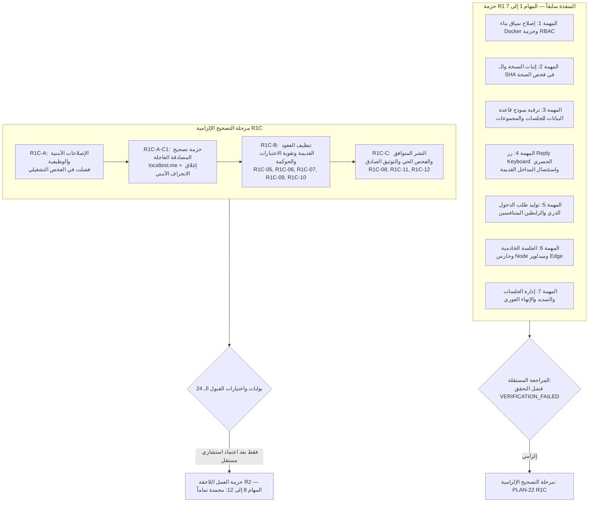

# 📋 خطة العمل التنفيذية المعتمدة: PLAN-22
## إصلاح الدخول الحصري للداشبورد من البوت والجلسات الخادمية والنشر الحصين
### Bot-Only Dashboard Authentication, Server-Side Session SSOT, and Robust Docker Deployment Remediation

**تاريخ الخطة:** 13-09-2026
**الحالة:** 🔴 فشل المراجعة المستقلة لتنفيذ R1C-A-C1 — حزمة التصحيح المباشر FIX1 قيد التنفيذ
**حالة الإنجاز:** رُفض ادعاء اكتمال R1C-A-C1 بعد ثبوت بقاء Host Header bypass، وتنفيذ عقد إعدادات رامٍ للاستثناءات مع fallback غير معتمد، وعدم تشغيل `pnpm governance:verify`، وعدم نظافة شجرة Git. بدأ تنفيذ `R1C-A-C1-FIX1` بتفويض المستخدم المباشر، مع بقاء R1C-B وR1C-C وR2 مجمدة.
**النطاق:** إصلاح حدود المصادقة الخادمية، الرابطان المتنافسان، الجلسة المعتمة، Exact-Origin Allowlist، حارس Node Fail-Closed، استئصال المداخل القديمة، وهندسة البناء والترحيل النظيف
**المشروع المستهدف:** `F:\Alsaada-Smart-Bot`
**المرجع التصميمي الحاكم (SSOT):** [`docs/superpowers/specs/2026-09-13-bot-only-dashboard-auth-remediation-design.md`](../superpowers/specs/2026-09-13-bot-only-dashboard-auth-remediation-design.md)
**الخطط السابقة المرتبطة:** `PLAN-20` (استعادة الإصدار والمصادقة والرصد)، `PLAN-21` (التصميم الموحد لمطابقة البوت والداشبورد)

---

> [!CAUTION]
> ### 🛑 قرار المراجعة المستقلة: فشل التحقق من R1C-A وتجميد الخط (R1C-A VERIFICATION FAILED — STOP THE LINE)
> **يُحظر الانتقال إلى R1C-B أو R1C-C أو R2 نهائياً.**
> كشف الفحص التشغيلي الميداني والمراجعة المستقلة الدقيقة لحزمة R1C-A عن عيبين تقنيين وأمنيين حرجين حالا دون اعتماد الحزمة:
> 1. **اختلال تطابق الأصل المحلي مع معالج NextURL (NextURL Loopback Mangling):** عند استخدام `http://127.0.0.1.nip.io:3002`، يقوم معالج `NextURL` الداخلي في Next.js بتحويل أسماء النطاقات المعتمدة على عناوين IP الاسترجاعية تلقائياً إلى `localhost.nip.io`، مما يجعل `request.nextUrl.origin` ينتج `http://localhost.nip.io:3002`، فيحدث عدم تطابق حرفي مع `targetOrigin` المخزن (`http://127.0.0.1.nip.io:3002`) ويرفض مسار `claim` الدخول بخطأ `403 ORIGIN_MISMATCH`. الحل المعماري الصارم هو الاستبدال الشامل للأصل المحلي بـ **`http://localtest.me:3002`** الذي يحقق شروط Wildcard DNS لـ `127.0.0.1`، ومدعوم شكلياً ومعمارياً كـ FQDN HTTP URL من قبل Telegram Bot API دون أن تمسه NextURL بأي تحويل، مع إرجاء التحقق من السلوك الحي لفتح المتصفح ومربع تأكيد الرابط الخارجي في Telegram Desktop لاختبار الدخان الميداني الحي (Live Smoke Testing).
> 2. **تسجيل انحراف أمني غير معتمد وغير ملتزم به (UNCOMMITTED_UNAPPROVED_SECURITY_DEVIATION):** رُصد تعديل غير معتمد مسبقاً على القرص في ملف `apps/admin-dashboard/src/app/api/auth/claim/route.ts` يحاول الالتفاف على عدم تطابق الأصل عبر قراءة ترويسة `Host` (`request.headers.get('host')`). هذا التعديل تم حظره وتجميده في وضع `PLAN_ONLY`، ويُسجل رسمياً كـ **انحراف أمني غير معتمد** مع جدولته للإلغاء والاستئصال الكامل فور بدء تنفيذ C1 والعودة الصارمة إلى `request.nextUrl.origin` مع حظر أي تلاعب بترويسات المضيف.
>
> بالإضافة إلى العيوب الـ 12 السابقة في R1:
> 1. **النشر الهجين المتضارب (Mixed-Version Deployment):** تشغيل Schema جديدة بقيد فرادة `(groupId, originKind)` مع حاوية بوت قديمة لا تمرر `originKind` مما يسبب خطأ Prisma `P2002`.
> 2. **اختلال تطابق الأصل المحلي (Local Origin Mismatch):** تحويل NextURL لـ `127.0.0.1.nip.io` إلى `localhost.nip.io` مما فجر خطأ `403 ORIGIN_MISMATCH`، ويتم حله نهائياً بالتحول لـ `localtest.me:3002`.
> 3. **ثغرة Reflected XSS في شاشة فشل المصادقة:** حقن `traceId` القادم من Query Params خاماً داخل HTML وعرض الخطأ بـ HTTP 200.
> 4. **مخالفة عقد التسجيل في PLAN-20:** وجود `console.error` و`catch` صامت خارج منظومة `TelemetryLogger`.
> 5. **بقاء رواسب Magic القديمة:** عدم حصر واستئصال مفاتيح ومسارات قديمة مثل `magic_token` و`magicUrl` و`DEMO_USERS` و`alsaada_admin_role`.
> 6. **تشتت مرجعية الأدوار (RBAC SSOT):** تعدد مصادر فحص أدوار الداشبورد بين مصفوفات ودوال مختلفة.
> 7. **عدم تحديث Reply Keyboard:** غياب التحديث الفوري للوحة وسحب الجلسات للمستخدم المستهدف عند تغيير الدور أو الحظر.
> 8. **فصل متغيرات الإصدار عن Docker Compose:** بقاء الحاويات بصور أو أرقام Commit غير مطابقة لـ Commit التصحيح الفعلي.
> 9. **بطء وفشل مهلة اختبارات القوى العاملة:** تذبذب اختباري تعديل العامل والدليل في التشغيل الشامل.
> 10. **سطحية بوابة الحوكمة `dashboard-auth:verify`:** الاعتماد على فحص نصوص بسيط دون التحقق السلوكي الصارم.
> 11. **عدم دقة التوثيق:** الادعاء بأن Middleware يفحص قاعدة البيانات بينما الفحص الكامل يقع في Node Server Guard، والادعاء المبكر لاكتمال R1 بنسبة 100%.
> 12. **نظافة المستودع (Repository Hygiene):** وجود مسافات بيضاء وأسطر فارغة زائدة في الـ Commit السابق (`git show --check`).
>
> **القرار الحتمي:** إدراج حزمة تصحيح عاجلة داخل R1C-A باسم **`PLAN-22 R1C-A-C1 — Authentication Corrective Review`**، وإسقاط كافة علامات الإنجاز لحزمة R1C-A، والتوقف التام عند `PLAN_READY_FOR_CONSULTANT_REVIEW` دون تعديل أي كود أو إنشاء Commit أو Push قبل اعتماد الخطة.

---

> [!IMPORTANT]
> ### 📜 محددات حزمة الإصلاح المعماري (PLAN-22 Remediation Package R1 Scope)
> تلتزم هذه الحزمة حصراً بإصلاح العيوب الـ 12 الملزمة للمهام 1–7 (وفق البنود R1C-01 إلى R1C-12):
> 1. إنشاء عقد المصادقة المشترك `@alsaada/rbac/src/dashboard-auth.ts`.
> 2. إنشاء Migration تراكمية نظيفة لنموذج Prisma (`DashboardAuthLink` و`DashboardSession`).
> 3. تنظيف Middleware ليكون Edge-safe خالياً من أي استيراد لـ Prisma أو Node APIs.
> 4. إنشاء حارس خادمي موحد في Node runtime يطبق مبدأ Fail-Closed لحظياً ضد قاعدة البيانات.
> 5. استئصال رموز HMAC القديمة و`SessionPayload` الموقّع و`DEMO_USERS` ومحاكي الأدوار و`alsaada_admin_role`.
> 6. تحقيق الاستهلاك الذري وإنشاء الجلسة وحجز `groupId` داخل معاملة واحدة في `claim/route.ts` مع المطابقة الحرفية للأصل الموثوق وتخصيص GET فقط وCookie بـ 16 ساعة.
> 7. حصر المدخل الحصري على زر Reply Keyboard وإلغاء `menu:exec:dashboard` وكافة الأوامر.
> 8. تمرير بيانات الإصدار الحقيقية من Docker ARG/ENV واستبعاد أي قيم ثابتة.
> 9. إنشاء بوابة الحوكمة `dashboard-auth:verify`.

---

## 🎯 الأهداف التنفيذية المقاسة

1. **مدخل حصري واحد:** زر Reply Keyboard ثنائي الصف `🖥️ فتح لوحة التحكم` للأدوار الإدارية الثلاثة فقط (`SUPER_ADMIN`, `GENERAL_ADMIN`, `FIELD_ADMIN`) في المحادثة الخاصة، مع إلغاء كافة الأوامر والروابط القديمة (`/dashboard`, `/panel`, إلخ).
2. **طلب دخول ذري برابطين متنافسين:** طلب واحد ينشئ رابطين موجهين للأصلين الموثوقين (`DASHBOARD_LOCAL_URL` و `DASHBOARD_TUNNEL_URL`)؛ استهلاك أحدهما يلغي الآخر ذرياً وفورياً داخل المعاملة نفسها، مع صلاحية 5 دقائق.
3. **جلسات خادمية معتمة ترتكز لقاعدة البيانات (DB as SSOT):** الـ Cookie تحمل رمزاً عشوائياً خاماً، بينما تخزن قاعدة البيانات الهاش. التحقق يتم خادمياً في كل طلب ضد قاعدة البيانات؛ مما يجعل الإنهاء والتمديد وتغيير الدور لحظياً.
4. **حدود الجلسات:** 8 ساعات أساسية + تمديد واحد فقط لـ 8 ساعات (حد أقصى مطلق 16 ساعة من الإنشاء). حد أقصى 3 جلسات نشطة للمستخدم؛ عند بلوغ الحد يرفض الإصدار وتُعرض بطاقة إدارة الجلسات لإنهاء إحداها يدوياً دون حذف تلقائي.
5. **مراقب الجلسات الخامل:** تسجيل وتشغيل `SessionMonitorService` كجزء دائم من دورة حياة البوت، مع إرسال إشعار تجميعي قبل انتهاء الجلسة بساعة مع منع التكرار.
6. **صفحة انتهاء الوصول الإرشادية:** استئصال مسار `/login` نهائياً؛ واستبداله بصفحة إرشادية غير تفاعلية خالية من أي نماذج دخول، تعرض `traceId` ورابطاً يفتح محادثة البوت الخاصة.
7. **إصلاح Docker وإثبات النسخة:** تضمين الحزمة المشتركة `@alsaada/rbac` في سياق بناء صورة الداشبورد، واستبعاد المخرجات المؤقتة، وإدراج `commitSha` و`version` و`buildTime` في فحص الصحة `/api/health`.

---

## 🗂️ فهرس المراحل والمسار التصحيحي الحاكم



---

## 📝 المهام التفصيلية وخطوات التنفيذ

### المهام 1 إلى 7 (حزمة R1 المنفذة سابقاً)
> [!WARNING]
> **حالة حزمة R1:** `IMPLEMENTED — INDEPENDENT VERIFICATION FAILED — R1C REQUIRED`
> تم خفض حالة هذه المهام مؤقتاً بعد المراجعة المستقلة التي كشفت 12 عيباً حرجاً؛ ولا تُعتبر هذه المهام معتمدة نهائياً إلا بعد استيفاء حزمة التصحيح R1C بالكامل أدناه.

- [ ] **المهمة 1 (R1): إصلاح سياق بناء Docker وحزمة RBAC** — تم نسخ الحزمة وتطهير `.gitignore`، لكن مطلوب ربط بيانات الإصدار بـ Compose في R1C-08.
- [ ] **المهمة 2 (R1): إثبات النسخة والـ SHA في فحص الصحة** — تم استئصال SHA الثابت، لكن مسار التشغيل بالـ Compose أظهر `unknown` في الفحص الحي (مطلوب علاجه في R1C-08).
- [ ] **المهمة 3 (R1): ترقية نموذج قاعدة البيانات عبر Migration تراكمية** — تم تطبيق Migration، لكن قيد الفرادة `(groupId, originKind)` يسبب خطأ `P2002` مع كود البوت القديم بالحاوية (مطلوب علاجه في R1C-01).
- [ ] **المهمة 4 (R1): حصر المدخل الحصري على زر Reply Keyboard واستئصال المداخل القديمة** — تم حصر الزر، لكن مطلوب تحديث اللوحة وسحب الجلسات للمستخدم المستهدف في دورة الحياة (R1C-07) واستئصال بقايا Magic (R1C-05).
- [ ] **المهمة 5 (R1): توليد طلب الدخول الذري والرابطين المتنافسين** — تم إنشاء الرابطين، لكن حدث تباين في الأصل المحلي بين التخزين وزر Telegram (مطلوب توحيده في R1C-02).
- [ ] **المهمة 6 (R1): الجلسة الخادمية المعتمة والاستهلاك الذري** — تم بناء المعاملة الذرية وEdge Middleware، لكن وُجدت ثغرة Reflected XSS في `traceId` بشاشة الفشل وانتهاك لعقد التسجيل في PLAN-20 (مطلوب علاجهما في R1C-03 و R1C-04).
- [ ] **المهمة 7 (R1): إدارة الجلسات والتمديد الذري والإنهاء الفوري** — تم بناء التمديد المشروط، لكن تشتت مصفوفات الأدوار بين عدة مراجع (مطلوب توحيدها في R1C-06).

---

## 🛡️ مرحلة التصحيح الإلزامية: PLAN-22 R1C — Independent Review Corrective Remediation

> [!IMPORTANT]
> تم تقسيم مرحلة التصحيح R1C إلى ثلاث حزم صغيرة متتابعة تعالج العيوب الـ 12 الملزمة المكتشفة في المراجعة المستقلة بنسبة 100%:

#### 📦 الحزمة الأولى: R1C-A — الإصلاحات الأمنية والوظيفية (Security & Functional Fixes)

#### 1. R1C-01: النشر المتوافق وتفادي تضارب Schema والإصدارات (Mixed-Version Deployment & P2002 Elimination)
- [ ] **تحليل العيب التشغيلي وتقسيم المسؤولية بوضوح قاطع:**
  - أظهرت المراجعة أن Migration الجديدة أضافت قيد فرادة `@@unique([groupId, originKind])`.
  - توفر القيمة الافتراضية `LOCAL` توافقاً تركيبياً لإدخال سجل منفرد فقط، لكنها لا توفر توافقاً وظيفياً أو تشغيلياً مع نسخة البوت القديمة التي تنشئ رابطين داخل المجموعة نفسها؛ لأن الرابطين يحصلان على `LOCAL` ويصطدمان بالقيد الفريد `(groupId, originKind)`. لذلك تعد النسخة القديمة غير متوافقة مع Schema الحالية بالنسبة لتدفق الرابطين، ويلزم استبدالها بصورة التطبيق المتوافقة وعدم تشغيلها مجدداً.
  - **حقيقة معمارية وإسقاط ادعاء In-App Guard:** لا يستطيع أي حارس برمجي داخل كود التطبيق الجديد أن يمنع حاوية قديمة تعمل بالفعل من الاتصال بقاعدة البيانات والتعامل مع Schema الجديدة؛ لذلك يُسقط هذا الادعاء تماماً وتُقسّم المسؤولية بوضوح تام بين الحزمتين:
    * **مسؤولية حزمة R1C-A البرمجية:**
      1. إثبات توافق الكود البرمجي الحالي لخادم البوت مع الـ Schema المطبقة.
      2. إلزام كود خادم البوت (`apps/bot-server/src/services/dashboard-auth.service.ts`) بتمرير `originKind` صراحة ومنفصلاً لكل رابط (`DashboardLinkOriginKind.LOCAL` للرابط المحلي، و`DashboardLinkOriginKind.TUNNEL` لرابط النفق).
      3. إضافة اختبار انحدار تنفيذي (Regression Test) يفشل فوراً إذا لم يمرر الكود `LOCAL` و `TUNNEL` بصورة منفصلة لكل رابط داخل المعاملة.
      4. إضافة فحص جاهزية (Readiness Check) للكود الجديد فقط للتحقق من سلامة النماذج والاتصال، دون أي ادعاء مضلل بحكم أو منع الحاويات القديمة.
      5. حظر تام لإضافة أي Migration جديدة أو التراجع التخريبي عن Migration الحالية.
    * **مسؤولية حزمة R1C-C التشغيلية الميدانية:**
      1. هي المسؤول الفعلي والحصري عن منع تشغيل كود هجين متضارب (Mixed-Version Deployment).
      2. بناء الصورة الجديدة المتوافقة أولاً.
      3. إيقاف وتصريف حركة المرور لحاويتي `bot` و `dashboard` القديمتين مؤقتاً أثناء نافذة التبديل المحددة لمنع تضارب المعاملات.
      4. التحقق من اكتمال وسلامة الـ Migration في قاعدة البيانات قبل بدء الحاويات.
      5. إعادة إنشاء الخدمتين قسرياً (`--force-recreate`) بالصورة المتوافقة التي تمرر `originKind`.
      6. الحظر المطلق لإعادة تشغيل أي صورة قديمة غير متوافقة.

#### 2. R1C-02: حسم وتوحيد عقد الأصل المحلي ومنع التباين (Local Origin Standard & Exact Mismatch Elimination)
- [ ] **تحليل العيب التشغيلي وظاهرة تحويل NextURL:**
  - أظهر الفحص التشغيلي الميداني أن استخدام `http://127.0.0.1.nip.io:3002` يصطدم بسلوك معالج `NextURL` الداخلي في Next.js؛ حيث يقوم NextURL تلقائياً بتحويل أسماء النطاقات المعتمدة على IP الاسترجاعي إلى `localhost.nip.io`، مما يجعل `request.nextUrl.origin` ينتج `http://localhost.nip.io:3002`، فيحدث عدم تطابق حرفي مع `targetOrigin` المخزن في قاعدة البيانات (`http://127.0.0.1.nip.io:3002`)، ويرفض مسار `/api/auth/claim` الطلب بخطأ `403 ORIGIN_MISMATCH`.
- [ ] **القرار المعماري الحاسم والموحد (الاعتماد على localtest.me والعقد المشترك النقي):**
  - استبدال الأصل المحلي بالكامل بـ **`http://localtest.me:3002`**.
  - متغير البيئة `DASHBOARD_LOCAL_URL` الخاص بالمصادقة الصادرة من البوت يقبل حصراً:
    `http://localtest.me:<port>`
  - **يُحظر تماماً وضع أو قبول `localhost` أو `127.0.0.1.nip.io` في متغير `DASHBOARD_LOCAL_URL` التشغيلي.**
  - نطاق `localtest.me` هو نطاق FQDN عام (Public Wildcard DNS) يشير إلى `127.0.0.1`، ويدعمه زر Telegram (`InlineKeyboardButton.url`) تركيبياً ببروتوكول HTTP وفق مواصفة Bot API، مع ملاحظة أن تطبيق Telegram Desktop قد يعرض للمستخدم نافذة تأكيد اعتيادية قبل فتح الروابط الخارجية؛ ويُعد النجاح الفعلي للتنقل عبر تليجرام والمتصفح معيار قبول تشغيلياً حياً مؤجلاً إلى مرحلة الفحص الميداني. كما يتميز `localtest.me` بأن معالج `NextURL` في Next.js يتعامل معه كنطاق طبيعي ولا يطبق عليه أي تحويل داخلي؛ مما يضمن ثبات الأصل وتطابقه الحرفي بنسبة 100%.
  - اعتماد دالة نقية مشتركة داخل الحزمة السيادية `@alsaada/rbac` باسم `validateDashboardAuthOrigins(input)` تفحص المكونات الصريحة عبر `new URL()` بدقة وتمنع نسخ المنطق بين التطبيقين.
  - الرابط `http://localhost:3002` مسموح به فقط للفحص اليدوي المباشر من قِبل المطور في المتصفح، **وليس** لإصدار رابط Claim أو تخزين `targetOrigin`.
  - **يُمنع منعاً باتاً أي تحويل للمضيف أو المنفذ داخل معالج البوت (`apps/bot-server/src/handlers/dashboard.handler.ts`) أو في أي طبقة أخرى بعد تخزين `targetOrigin`.**
  - الرابط النهائي المعياري يجب أن يُبنى ويُخزن ويُعرض بنفس الأصل الموحد منذ البداية بنسبة 100% في:
    1. التخزين في حقل `targetOrigin` بجدول `dashboard_auth_links`.
    2. تكوين رابط الدخول المعروض للمستخدم في نص الرسالة.
    3. الرابط المضمن داخل زر Telegram (`InlineKeyboardButton.url`).
    4. التحقق الحرفي داخل مسار `claim/route.ts`.
    5. كافة محاكيات واختبارات البيئة المحلية.
  - `DASHBOARD_TUNNEL_URL` يظل الأصل الخارجي المستقل ويجب أن يستخدم بروتوكول `https://` المشفر حصراً.
  - **نقل تطبيع الأصول من المهمة 10:** تم نقل الجزء الخاص بتطبيع وفحص الأصول الموثوقة من المهمة 10 إلى البند `R1C-02` هنا كتصحيح إلزامي فوري، ولا يجوز إعادة تنفيذه أو تكراره داخل حزمة `R2`.
  - **المرجعان التشغيليان الوحيدان:** يصبح `DASHBOARD_LOCAL_URL` و `DASHBOARD_TUNNEL_URL` هما المرجعين التشغيليين المعتمدين حصراً في النظام؛ مع تحييد المتغيرين القديمين `DASHBOARD_URL` و `ADMIN_DASHBOARD_URL` وقصرهما على التوافق الخلفي المؤقت مع إطلاق تحذير Deprecation بعد جرد مستهلكيهما الفعليين.

#### 3. R1C-03: استئصال ثغرة Reflected XSS وتحصين واجهة الفشل وعقد traceId (Reflected XSS Elimination & Error Hardening)
- [ ] **تحليل العيب الأمني:**
  - مسار `claim/route.ts` يستقبل معامل `traceId` من Query Parameters ويحقنه مباشرة وبشكل خام داخل قالب HTML المعروض عند فشل المصادقة، مما يتيح هجمات Reflected XSS عبر إرسال روابط خبيثة للمسؤولين.
  - إعادة شاشة الخطأ بحالة `HTTP 200 OK` بدلاً من حالة خطأ ملائمة لطبيعة الرفض.
- [ ] **عقد traceId المعتمد وحظر المولدات المحلية:**
  - استبدال أي إشارة أو توليد محلي مكرر بالعقد المعياري الموجود فعلياً في حزمة `@alsaada/telemetry`:
    * `extractTraceId(request)`: لاستخراج المعرف والتحقق من سلامته شكلياً.
    * `isValidTraceId`: للتحقق الصارم من بنية المعرف.
    * الـ Fallback الآمن المقدم تلقائياً من حزمة `@alsaada/telemetry` (توليد UUID قياسي آمن عند غياب أو فساد القيمة الواردة).
  - يُحظر تماماً إنشاء مولد محلي مكرر أو تعديل الحزمة المشتركة دون حاجة مثبتة.
- [ ] **مصفوفة رموز HTTP الصريحة لاستجابات مسار Claim وواجهة الفشل:**
  * `HTTP 400 Bad Request`: الرمز مفقود أو تالف شكلياً (`token missing or malformed`).
  * `HTTP 401 Unauthorized`: الرمز غير صالح أو منتهي الصلاحية أو مستهلك مسبقاً (`invalid, expired, or already consumed`).
  * `HTTP 403 Forbidden`: الدور غير مخول للوصول أو الأصل الوارد لا يطابق حرفياً `targetOrigin` المخزن (`unauthorized role or origin mismatch`).
  * `HTTP 429 Too Many Requests`: تجاوز الحد الأقصى للجلسات المتزامنة للمستخدم.
  * `HTTP 503 Service Unavailable`: تعذر الاتصال بقاعدة البيانات أو فشل التبعيات الأساسية مع تفعيل مبدأ `Fail-Closed` فورياً.
  * `HTTP 500 Internal Server Error`: خطأ داخلي غير متوقع (مع حظر تغليف أو تمويه 500 كـ 401).
- [ ] **تحصين الواجهة وترويسات الأمان:**
  - حظر انعكاس أي قيمة خام قادمة من Query Parameters داخل HTML تحت أي ظرف.
  - تطبيق تعقيم كامل وصارم (HTML Entity Escaping) لكافة القيم المحقونة داخل HTML وخصائص العناصر (`href`, `src`, إلخ).
  - إضافة ترويسات الحماية الإلزامية:
    * `Content-Security-Policy: default-src 'none'; style-src 'unsafe-inline'; base-uri 'none'; form-action 'none';`
    * `X-Content-Type-Options: nosniff`
    * `X-Frame-Options: DENY`
  - إضافة اختبار أمني تنفيذي آلي صريح لـ Reflected XSS يرسل `<script>alert(1)</script>` و `">` ويثبت عدم انعكاس الـ Payload خاماً داخل الاستجابة.

#### 4. R1C-04: الامتثال الكامل لعقد التسجيل في PLAN-20 واستئصال Catch الصامت (PLAN-20 Logging Contract Compliance)
- [ ] **النص الإلزامي الحاكم:**
  > *«شرط أساسي للوصول لهذا المستوى هو تنفيذ الخطة رقم 20 بالكامل وربط أي وظيفة جديدة مستقبلاً بعقد التسجيل الموحد، دون استخدام console.error أو catch صامت خارج المنظومة.»*
- [ ] **إجراءات المعالجة المعمارية:**
  - استئصال شامل لكافة استدعاءات `console.error` و `console.warn` (المستخدمة للأخطاء التشغيلية) في كامل نطاق المصادقة (`apps/admin-dashboard/src/app/api/auth/*`, `apps/admin-dashboard/src/lib/*`, `apps/bot-server/src/services/dashboard-auth.service.ts`, `apps/bot-server/src/handlers/dashboard.handler.ts`).
  - استئصال وحظر كافة بلوكات `catch {}` و `.catch(() => {})` الصامتة.
  - استخدام `TelemetryLogger` وعقد التسجيل الهيكلي الموحد مع تمرير `traceId` وسياق العملية ونوع الحدث.
  - حظر تام لتسجيل التوكنات، الـ Cookies، أسرار الروابط، أو أي بيانات حساسة داخل السجلات.

---

#### 📋 مصفوفة الملفات والمسؤوليات لحزمة R1C-A
- **الملفات المتوقع قراءتها:**
  * `apps/bot-server/src/services/dashboard-auth.service.ts`
  * `apps/bot-server/src/handlers/dashboard.handler.ts`
  * `apps/bot-server/src/config/env.ts`
  * `apps/admin-dashboard/src/app/api/auth/claim/route.ts`
  * `apps/admin-dashboard/src/app/api/auth/logout/route.ts`
  * `apps/admin-dashboard/src/lib/auth.ts`
  * `apps/admin-dashboard/src/lib/env.ts`
  * `packages/rbac/src/dashboard-auth.ts`
  * `packages/rbac/src/index.ts`
  * `packages/telemetry/src/index.ts`
  * `packages/telemetry/src/adapters/next.ts`
  * ملفات الاختبارات الـ 9 المحددة حصراً:
    1. `packages/rbac/tests/dashboard-auth.spec.ts`
    2. `apps/bot-server/tests/dashboard-command.spec.ts`
    3. `apps/bot-server/tests/adversarial-dashboard-access.spec.ts`
    4. `apps/bot-server/tests/env-validation.spec.ts`
    5. `apps/admin-dashboard/tests/auth-claim.spec.ts`
    6. `apps/admin-dashboard/tests/auth-claim-concurrency.spec.ts`
    7. `apps/admin-dashboard/tests/dashboard-auth-r1-remediation.spec.ts`
    8. `apps/admin-dashboard/tests/adversarial-route-role-session.spec.ts`
    9. `apps/admin-dashboard/tests/dashboard-auth-ast.spec.ts`
- **الملفات المسموح تعديلها حصراً:**
  * `packages/rbac/src/dashboard-auth.ts` (تطبيق دالة التحقق النقية validateDashboardAuthOrigins وعقد الأخطاء المكتوبة)
  * `packages/rbac/src/index.ts` (تصدير العقد المشترك)
  * `apps/bot-server/src/services/dashboard-auth.service.ts` (تمرير originKind صراحة، استئصال catch الصامت، استخدام TelemetryLogger، وتصدير DashboardSessionView)
  * `apps/bot-server/src/handlers/dashboard.handler.ts` (اعتماد localtest.me، استئصال أي تحويل، استئصال catch الصامت، استخدام TelemetryLogger، استئصال rawSessions: any[] واستخدام DashboardSessionView)
  * `apps/bot-server/src/config/env.ts` (قراءة المتغيرات واستدعاء validateDashboardAuthOrigins المشتركة)
  * `apps/admin-dashboard/src/app/api/auth/claim/route.ts` (استئصال الانحراف الأمني UNCOMMITTED_UNAPPROVED_SECURITY_DEVIATION، العودة الصارمة لـ request.nextUrl.origin، إغلاق XSS، مصفوفة HTTP، تعقيم HTML، استخدام extractTraceId، واعتماد ClaimTransactionResult)
  * `apps/admin-dashboard/src/app/api/auth/logout/route.ts` (استئصال console.warn التشغيلي، ربط TelemetryLogger)
  * `apps/admin-dashboard/src/lib/auth.ts` (استئصال console.error، ربط TelemetryLogger، والتصنيف المكتوب)
  * `apps/admin-dashboard/src/lib/env.ts` (قراءة المتغيرات واستدعاء validateDashboardAuthOrigins المشتركة)
  * ملفات الاختبارات الـ 9 المحددة حصراً (دون أي تعبيرات نجمية):
    1. `packages/rbac/tests/dashboard-auth.spec.ts` (اختبارات العقد المشترك النقي)
    2. `apps/bot-server/tests/dashboard-command.spec.ts` (اختبارات تفاعل أوامر وأزرار البوت)
    3. `apps/bot-server/tests/adversarial-dashboard-access.spec.ts` (اختبارات محاولات الوصول المعادية)
    4. `apps/bot-server/tests/env-validation.spec.ts` (اختبارات التحقق من متغيرات البيئة)
    5. `apps/admin-dashboard/tests/auth-claim.spec.ts` (اختبارات استهلاك الرموز ومصفوفة HTTP)
    6. `apps/admin-dashboard/tests/auth-claim-concurrency.spec.ts` (اختبارات التزامن والسباق الذري)
    7. `apps/admin-dashboard/tests/dashboard-auth-r1-remediation.spec.ts` (اختبارات معالجة ثغرات R1 وإثبات استقرار AuditLog)
    8. `apps/admin-dashboard/tests/adversarial-route-role-session.spec.ts` (اختبارات فحص الأدوار والجلسات المعادية)
    9. `apps/admin-dashboard/tests/dashboard-auth-ast.spec.ts` (اختبار التحليل التركيبي الصارم AST)
- **الملفات المحظور تعديلها في هذه الحزمة:**
  * `packages/telemetry/*` (تُستخدم عقودها الحالية المعيارية دون تعديل)
  * `packages/database/prisma/schema.prisma`
  * `packages/database/prisma/migrations/*`
  * `apps/admin-dashboard/src/middleware.ts`
  * `docker-compose.yml`
  * أي ملف خارج نطاق الحزمة A أو خارج الملفات المحددة في حزمة RBAC
- **تنبيه حوكمي بشأن تعديل الحزمة المشتركة `@alsaada/rbac`:**
  * نظراً لأن `@alsaada/rbac` حزمة نواة مشتركة (Shared Kernel)، يُلزم وكيل التنفيذ فور تعديلها بتشغيل:
    `pnpm --filter @alsaada/rbac test`
    ثم تشغيل حزمة الاختبارات الشاملة للتأكد القاطع من عدم كسر أي وظيفة في النظام.
- **تسجيل الانحراف الأمني غير المعتمد على القرص:**
  * يُسجل الملف `apps/admin-dashboard/src/app/api/auth/claim/route.ts` بأنه يحتوي حالياً على: `UNCOMMITTED_UNAPPROVED_SECURITY_DEVIATION` (محاولة الالتفاف على الأصل عبر قراءة ترويسة Host). يُحظر تعديله أو حذفه في وضع `PLAN_ONLY`، وتتم جدولته للإلغاء والاستئصال الكامل فور بدء تنفيذ C1.
- **الوكيل أو التخصص المسؤول:** مهندس أمن ومصادقة ونظم خلفية (Backend & Security Specialist).
- **قاعدة منع التضارب:** يُحظر تماماً على أكثر من وكيل الكتابة في نفس الملف بالتزامن.
- **مسؤول الدمج:** مهندس الدمج المعماري (Integration Lead).
- **منهجية التطوير (TDD):** كتابة اختبار تنفيذي يفشل أولاً (RED) يثبت العيب، ثم كتابة التعديل لاجتياز الاختبار بنجاح (GREEN). توثيق دورة RED ثم GREEN لاختبارات P2002 وExact-Origin وReflected XSS.
- **التوقف الإلزامي:** التوقف التام فور اكتمال الحزمة A بانتظار المراجعة الاستشارية المستقلة.

---

#### 🚪 بوابة الخروج المستقلة لحزمة R1C-A (Exit Gate R1C-A)
> [!WARNING]
> **الحالة الحالية للبوابة:** 🔴 `FAILED` — فشل التنفيذ المستلم في المراجعة المستقلة، ويُحظر اعتماد C1 قبل إكمال `R1C-A-C1-FIX1` واجتياز البوابات من جديد.

- [ ] إصلاح تمرير `originKind` الصريح للرابطين في `dashboard-auth.service.ts` واجتياز اختبار الانحدار الذي يمنع تفجير P2002.
- [ ] توحيد الأصل المحلي المعياري على `http://localtest.me:3002` حصراً، وحظر `localhost` و `nip.io` في `DASHBOARD_LOCAL_URL`، وحذف أي تحويل داخل `dashboard.handler.ts`.
- [ ] إغلاق ثغرة XSS بالكامل، واعتماد `extractTraceId` و `isValidTraceId`، وتطبيق مصفوفة HTTP (400/401/403/429/500/503)، والتعقيم والترويسات، ونجاح اختبار XSS التنفيذي.
- [ ] الامتثال الكامل لعقد التسجيل في PLAN-20: فحص صريح يثبت خلو ملفات المصدر الداخلة في R1C-A (`auth.ts`, `logout/route.ts`, `dashboard.handler.ts`, `dashboard-auth.service.ts`, `claim/route.ts`) من:
  * `console.error`
  * `console.warn` التشغيلي
  * `catch {}` الصامت
  * `.catch(() => {})` الصامت
  (مع استثناء المطابقات داخل ملفات الاختبارات أو الوثائق).
- [ ] توثيق اجتياز دورة RED ثم GREEN لاختبارات P2002 وExact-Origin وXSS.
- [ ] نجاح الاختبارات المستهدفة للحزمة A (`pnpm --filter @alsaada/bot-server test`, `pnpm --filter @alsaada/admin-dashboard test`).
- [ ] اجتياز فحص التايب سكريبت: `pnpm typecheck = Exit 0`.
- [ ] اجتياز فحص البناء: `pnpm build = Exit 0`.
- [ ] اجتياز بوابة الحوكمة المتخصصة: `pnpm dashboard-auth:verify = Exit 0`.
- [ ] فحص AST الصارم (Test 13): اجتياز الفحص التركيبي الشامل لملفات المصدر الـ 9 عبر `TypeScript Compiler API`.
- [ ] **تنبيه قاطع:** لا يُعتبر النشر الحي منجزاً في هذه الحزمة؛ ولا يتم لمس أي حاويات قيد التشغيل.

---

### 📦 الحزمة التصحيحية الإلزامية: PLAN-22 R1C-A-C1 — Authentication Corrective Review

#### 🛠️ R1C-A-C1-FIX1 — استعادة العقد المعتمد بعد فشل التنفيذ المستلم

**تاريخ التفويض المباشر:** 14-09-2026  
**الحالة:** قيد التنفيذ  
**السبب الجذري المثبت:** نُفذت نسخة قديمة من عقد C1 ثم عُدلت مؤشرات الخطة لتوافق التنفيذ؛ فبقي `resolveEffectiveRequestOrigin` يقرأ `Host` و`X-Forwarded-*`، وأصبح اختبار AST يستثني ملف RBAC ويطلب وجود هذا الالتفاف، كما نُفذ التحقق برمي `DashboardAuthConfigError` مع fallback إلى `https://panel.alsaada.org` بدلاً من نتيجة فشل مكتوبة وFail-Closed.

**النطاق المسموح حصراً:**
- `packages/rbac/src/dashboard-auth.ts`
- `packages/rbac/tests/dashboard-auth.spec.ts`
- `apps/admin-dashboard/src/lib/env.ts`
- `apps/admin-dashboard/src/app/api/auth/claim/route.ts`
- `apps/admin-dashboard/tests/auth-claim.spec.ts`
- `apps/admin-dashboard/tests/dashboard-auth-r1-remediation.spec.ts`
- `apps/admin-dashboard/tests/dashboard-auth-ast.spec.ts`
- `apps/bot-server/src/config/env.ts`
- `apps/bot-server/src/services/dashboard-auth.service.ts`
- `apps/bot-server/tests/env-validation.spec.ts`
- `apps/bot-server/tests/dashboard-command.spec.ts`
- هذه الوثيقة فقط.

**الإصلاحات الملزمة:**
1. إعادة `validateDashboardAuthOrigins` إلى نتيجة تمييزية مكتوبة بلا رمي وبلا رسائل تحمل قيماً خاماً.
2. قراءة `DASHBOARD_LOCAL_URL` و`DASHBOARD_TUNNEL_URL` حصراً دون fallback أو اعتماد على مفاتيح URL القديمة داخل مصادقة الداشبورد.
3. حذف `resolveEffectiveRequestOrigin` وكل قراءة لـ`Host` و`X-Forwarded-*` من قرار Claim، واعتماد `request.nextUrl.origin` حصراً.
4. جعل فساد الإعدادات ينتج `CONFIG_ERROR/503` قبل أي استهلاك للرمز، مع تسجيل الكود المصنف فقط.
5. تصحيح اختبار AST كي يفحص الملفات التسعة كلها دون استثناء RBAC، ويفشل عند وجود resolver أو قراءة رؤوس المضيف.
6. تصحيح HTTP للرمز المفقود بحيث يكون 400 في HTML وJSON دون Redirect 302.
7. منع ادعاء اكتمال FIX1 قبل نجاح اختبارات RBAC والبوت والداشبورد، و`typecheck`، و`build`، و`dashboard-auth:verify`، و`governance:verify`، و`git diff --check`.

**المحظورات:** لا تعديل لـ`.env` أو`docker-compose.yml` أو Docker أو Schema/Migrations، ولا تنفيذ R1C-B أوR1C-C أوR2، ولا Commit أوPush قبل المراجعة النهائية.

> [!IMPORTANT]
> حزمة تصحيح عاجلة ومحكمة تهدف لمعالجة القصور التشغيلي والانحراف الأمني المكتشف في R1C-A، والوصول بمنظومة المصادقة إلى درجة الحصانة التامة وفق البنود العشرة التالية:

#### 1. استبدال الأصل المحلي السابق بالكامل وتصحيح التوصيف التشغيلي (Local Origin Replacement & Telegram Behavior)
- استبدال الأصل المحلي السابق `http://127.0.0.1.nip.io:3002` بالكامل بالأصل الجديد:
  **`http://localtest.me:3002`**
- سريان هذا الاستبدال في كامل كود البوت والداشبورد وملفات الإعدادات ومتغيرات البيئة والتوثيق وملفات الاختبارات.
- التحقق الهندسي وتصحيح التوصيف التشغيلي لـ `localtest.me`:
  1. **Wildcard DNS:** نطاق عام يحلل تلقائياً بواسطة خوادم DNS العامة إلى عنوان الاسترجاع المحلي `127.0.0.1`.
  2. **دعم Telegram Bot API ونافذة التأكيد:** زر `InlineKeyboardButton.url` يدعم بروتوكول HTTP تركيبياً وفق مواصفة Bot API، مع التدوين الصريح أن Telegram Desktop قد يعرض للمستخدم نافذة تأكيد اعتيادية للرابط الخارجي (External Link Confirmation Dialog)؛ ولذلك يُحظر الادعاء بأنه يفتح "دون أي تحذير"، ويُعتبر النجاح الفعلي للتنقل عبر Telegram Desktop والمتصفح معيار قبول تشغيلياً حياً مؤجلاً إلى مرحلة الفحص الميداني، ولا يُسجل كمجتاز مسبقاً في الوثائق أو الاختبارات الآلية.
  3. **ثبات NextURL وعدم التحويل:** معالج `NextURL` الداخلي في Next.js يتعامل مع `localtest.me` كنطاق طبيعي ولا يطبق عليه قواعد تحويل Loopback IP (التي كانت تحول `127.0.0.1.nip.io` قسرياً إلى `localhost.nip.io`)، مما يضمن ثبات `request.nextUrl.origin` وتطابقه الحرفي 100% مع `targetOrigin` المخزن في قاعدة البيانات.

#### 2. حظر الالتفاف عبر Host Header والتأكيد الصارم على Exact-Origin
- **حظر أمني قاطع:** يُحظر تماماً أي اعتماد أو قراءة لـ:
  * `Host` header
  * `X-Forwarded-Host` header
  * `X-Forwarded-Proto` header
  أو أي رأس شبكي آخر للالتفاف على فحص المطابقة الحرفية للأصل (`isExactOriginMatch`).
- **إلغاء واستئصال الانحراف الأمني:** إلغاء التعديل غير المعتمد المسجل كـ `UNCOMMITTED_UNAPPROVED_SECURITY_DEVIATION` في `apps/admin-dashboard/src/app/api/auth/claim/route.ts` أثناء تنفيذ C1، والعودة الصارمة إلى:
  ```typescript
  const requestOrigin = request.nextUrl.origin;
  ```
  دون أي محاولة لقراءة رؤوس Host أو X-Forwarded لتجاوز عدم تطابق الأصل.
- **اختبارات أمنية معادية (Adversarial Security Tests):** إضافة اختبارات صريحة تثبت أن إرسال رؤوس مزيفة (`Host: evil.com`, `X-Forwarded-Host: evil.com`, `X-Forwarded-Proto: https`) لا يؤثر نهائياً على قرار المطابقة ويفشل بـ `403 Forbidden` عند اختلاف `request.nextUrl.origin` عن `targetOrigin`.

#### 3. توحيد عقد التحقق وفحص الروابط الدقيق وسلوك فشل الإعدادات (Unified Origin Contract, Strict Parsing & Failure Behavior)
- **توحيد عقد التحقق عبر دالة نقية مشتركة في `@alsaada/rbac`:**
  - اعتماد دالة نقية مشتركة داخل الحزمة السيادية `@alsaada/rbac` (`packages/rbac/src/dashboard-auth.ts`):
    ```typescript
    export interface DashboardAuthOriginsInput {
      localUrl?: string;
      tunnelUrl?: string;
    }

    export interface DashboardAuthOrigins {
      localOrigin: string;
      tunnelOrigin: string;
    }

    export function validateDashboardAuthOrigins(input: DashboardAuthOriginsInput): DashboardAuthOrigins;
    ```
  - دالتا `validateDashboardAuthEnv()` في البوت (`apps/bot-server/src/config/env.ts`) والداشبورد (`apps/admin-dashboard/src/lib/env.ts`) تصبحان مجرد قارئ خفيف لمتغيرات البيئة (`process.env`) يستدعي العقد السيادي المشترك `validateDashboardAuthOrigins(...)`.
  - **يُحظر تماماً نسخ أو تكرار منطق التحقق وفحص الروابط داخل التطبيقين.**
  - يُسمح مستقبلاً أثناء تنفيذ C1 بتعديل:
    * `packages/rbac/src/dashboard-auth.ts`
    * `packages/rbac/src/index.ts`
    * `packages/rbac/tests/dashboard-auth.spec.ts`
- **التحقق الدقيق عبر التحليل التركيبي الصارم لـ URL (Strict Component-by-Component URL Parsing):**
  - **حظر أمني قاطع:** يُحظر تماماً استخدام `startsWith` للتحقق الأمني من الروابط؛ لأن `startsWith('http://localtest.me')` ثغرة تقبل نطاقات خبيثة فرعية (مثل `http://localtest.me.evil.com`) أو مسارات مدمجة.
  - يجب استخدام `new URL(rawUrl)` ثم فحص كل مكون من مكونات الرابط بصورة مستقلة وصارمة:
    * **الأصل المحلي (`localUrl`):**
      1. `parsed.protocol === 'http:'`
      2. `parsed.hostname === 'localtest.me'`
      3. المنفذ صريح وصالح: `parsed.port !== ''` وقيمة عددية صحيحة تقع في النطاق `(0 < port <= 65535)`.
      4. `parsed.pathname === '/'`
      5. خلو تام من الاستعلامات: `parsed.search === ''`
      6. خلو تام من التجزئة: `parsed.hash === ''`
      7. خلو تام من بيانات الاعتماد: `parsed.username === '' && parsed.password === ''`
    * **أصل النفق (`tunnelUrl`):**
      1. `parsed.protocol === 'https:'`
      2. `parsed.hostname` اسم مضيف صالح ونظيف غير فارغ.
      3. `parsed.pathname === '/'`
      4. `parsed.search === ''`
      5. `parsed.hash === ''`
      6. `parsed.username === '' && parsed.password === ''`
    * **اختلاف الأصلين (Distinct Origins):**
      - التحقق الحتمي الصارم من أن `localOrigin !== tunnelOrigin`.
    * **إرجاع الأصل المعياري النظيف:**
      - إرجاع القيمة المعيارية عبر `parsed.origin` حصراً دون أي تحويل أو طفرة صامتة (Zero Silent Mutation) للمضيف أو المنفذ.
- **حسم سلوك فشل الإعدادات (Graceful Degradation & Fail-Closed Scenarios):**
  - **في خادم البوت:**
    * فساد إعدادات الداشبورد (مثل غياب أو عدم صلاحية `DASHBOARD_LOCAL_URL` أو `DASHBOARD_TUNNEL_URL`) **لا يؤدي بأي حال إلى إسقاط أو انهيار خادم البوت بالكامل**.
    * يستمر البوت في أداء كافة وظائفه الميدانية الأخرى (القوى العاملة، العهد، الكانتين، السلف، الحضور، الإجازات، إلخ) بنجاح تام.
    * تُعطل وظيفة إصدار روابط الداشبورد فقط بمبدأ `Fail-Closed`.
    * عند ضغط زر `🖥️ فتح لوحة التحكم` في البوت، لا يُرمى خطأ غير معالج؛ بل تُعرض رسالة تفاعلية واضحة للمستخدم الإداري تفيد بتعذر الوصول المؤقت للوحة التحكم بسبب خلل في إعدادات الاتصال، مزودة بـ:
      1. زر إعادة المحاولة: `[ 🔄 إعادة المحاولة ]`
      2. زر العودة للقائمة الرئيسية: `[ 🏠 القائمة الرئيسية ]`
    * تسجيل الخطأ التشغيلي عبر عقد `TelemetryLogger` الموحد وفق PLAN-20 مع `traceId` دون تسريب أي أسرار أو تفاصيل حساسة.
  - **في تطبيق الداشبورد وحارس الخادم:**
    * **مسار الـ Claim (`/api/auth/claim`):** عند فساد أو عدم صلاحية الإعدادات، يمنع مسار الـ Claim استهلاك الرموز تماماً بمبدأ `Fail-Closed` ويرجع استجابة `HTTP 503 Service Unavailable` مع الكود المكتوب `CONFIG_ERROR`.
    * **حارس الجلسات (`getCurrentUser` داخل `apps/admin-dashboard/src/lib/auth.ts`):**
      - دالة `getCurrentUser` هي دالة خادمية تقرأ الكوكي المعتمة وتتحقق من الجلسة في قاعدة البيانات؛ وهي **لا ترجع كائن استجابة HTTP (HTTP Response)** إطلاقاً، ولا تعتمد على إعدادات الأصول (`origins`) للتحقق من جلسة قائمة تمتلك مسبقاً رمز جلسة معتم على الخادم (`server-side opaque session token`).
      - في حال حدوث خطأ في قاعدة البيانات، تفشل `getCurrentUser` آمناً ومغلقاً (`Fail-Closed`) بإرجاع `null` مع تسجيل الحدث في `TelemetryLogger`، ولا تدعي إرجاع HTTP 503.
      - أي معالجة عامة للأخطاء، أو صفحة صيانة، أو إرجاع 503 على مستوى صفحات التطبيق خارج مسار الـ Claim مؤجلة لحزمة مستقلة لاحقة.

#### 4. تطابق مصفوفة حالات الاستجابة (HTTP Status Code Parity)
- فرض تطابق كامل بنسبة 100% بين استجابات HTML و JSON لنفس نوع الخطأ في مسار `/api/auth/claim`:
  * `400 Bad Request`: الرمز مفقود أو غير صالح تركيبياً (Missing or Malformed Token).
  * `401 Unauthorized`: الرمز غير موجود في قاعدة البيانات، منتهي الصلاحية، أو مستهلك مسبقاً (Token Not Found / Expired / Already Claimed).
  * `403 Forbidden`: الدور غير مخول للوصول، أو عدم تطابق الأصل الحرفي الوارد مع `targetOrigin` المخزن (Unauthorized Role / Origin Mismatch).
  * `429 Too Many Requests`: تجاوز الحد الأقصى للجلسات المتزامنة للمستخدم (Max Concurrent Sessions Exceeded).
  * `503 Service Unavailable`: تعذر الاتصال بقاعدة البيانات أو فشل التبعيات الأساسية (Fail-Closed Infrastructure Error).
  * `500 Internal Server Error`: خطأ داخلي غير متوقع (مع الحظر القاطع لتغليف أو تمويه خطأ 500 كـ 401 تحت أي ظرف).

#### 5. اعتماد أخطاء أعمال مكتوبة ونموذج المعاملات الصارم (Typed Business Errors & Claim Transaction Model)
- **تعريف كود فشل استهلاك الرمز كاتحاد مغلق داخل `@alsaada/rbac`:**
  - اعتماد نوع `DashboardClaimFailureCode` داخل `@alsaada/rbac` كـ Closed Discriminated Union يمثل كافة الحالات المتوقعة حصراً:
    ```typescript
    export type DashboardClaimFailureCode =
      | 'TOKEN_MISSING'
      | 'TOKEN_MALFORMED'
      | 'TOKEN_NOT_FOUND'
      | 'TOKEN_EXPIRED'
      | 'TOKEN_ALREADY_CLAIMED'
      | 'ORIGIN_MISMATCH'
      | 'ROLE_UNAUTHORIZED'
      | 'MAX_SESSIONS_EXCEEDED'
      | 'CONFIG_ERROR'
      | 'DATABASE_ERROR'
      | 'INTERNAL_ERROR';
    ```
- **تعريف حالات HTTP المعتمدة وقاموس التعيين الحصري داخل `@alsaada/rbac`:**
  - تعريف نوع حالات HTTP المسموح بها حصراً في مسار الـ Claim:
    ```typescript
    export type DashboardClaimHttpStatus = 400 | 401 | 403 | 429 | 500 | 503;
    ```
  - تعريف قاموس تعيين صريح وثابت يربط كل كود فشل بحالة HTTP المطابقة:
    ```typescript
    export const CLAIM_FAILURE_HTTP_STATUS_MAP: Record<DashboardClaimFailureCode, DashboardClaimHttpStatus> = {
      TOKEN_MISSING: 400,
      TOKEN_MALFORMED: 400,
      TOKEN_NOT_FOUND: 401,
      TOKEN_EXPIRED: 401,
      TOKEN_ALREADY_CLAIMED: 401,
      ORIGIN_MISMATCH: 403,
      ROLE_UNAUTHORIZED: 403,
      MAX_SESSIONS_EXCEEDED: 429,
      CONFIG_ERROR: 503,
      DATABASE_ERROR: 503,
      INTERNAL_ERROR: 500,
    };
    ```
- **الفصل التام لرسائل واجهة المستخدم عن حزمة النواة `@alsaada/rbac`:**
  - حزمة `@alsaada/rbac` خالية تماماً من أي نصوص أو حقول لرسائل المستخدم (`userMessage`)؛ نصوص واجهة المستخدم ورسائل الخطأ المرئية تُصاغ حصراً عند حافة العرض في مسار الداشبورد (`apps/admin-dashboard/src/app/api/auth/claim/route.ts`).
- **اعتماد عقد نتيجة المعاملة `ClaimTransactionResult` كـ Discriminated Union حصري:**
  - إلغاء أي خيارات أو أشكال بديلة (مثل "DashboardClaimResult أو DashboardClaimError")، وعدم استخدام أي نوع غير معرّف مثل `DashboardSessionPayload`.
  - الاعتماد الحصري لنوع `ClaimTransactionResult` داخل `apps/admin-dashboard/src/app/api/auth/claim/route.ts`:
    ```typescript
    export type ClaimTransactionResult =
      | {
          ok: true;
          sessionToken: string;
          sessionId: string;
          actorTelegramId: bigint;
          role: DashboardRole;
          redirectUrl: string;
          expiresAt: Date;
        }
      | {
          ok: false;
          code: DashboardClaimFailureCode;
        };
    ```
- **قواعد تنفيذ المعاملة وحفظ سجل التدقيق الرقابي عند 403 (Transaction Semantics & AuditLog Persistence):**
  - في كافة حالات فشل الأعمال المتوقعة (مثل انتهاء الصلاحية، الاستهلاك المسبق، عدم تطابق الأصل، أو عدم تخويل الدور)، **ترجع المعاملة `{ ok: false, code }` دون رمي استثناء (Zero Throw) ودون التراجع عن المعاملة (No Rollback)**.
  - **استقرار سجل التدقيق عند رفض الصلاحية (AuditLog Persistence on 403):** عند رفض دور المستخدم (`ROLE_UNAUTHORIZED` / 403) أو رفض الحساب داخل المعاملة، يقوم الكود بكتابة سجل التدقيق الرقابي `AuditLog` داخل قاعدة البيانات أولاً، ثم ترجع المعاملة `{ ok: false, code: 'ROLE_UNAUTHORIZED' }` بصورة طبيعية دون رمي استثناء، لضمان استقرار المعاملة (Commit) وتثبيت سجل التدقيق الرقابي قطعياً بدلاً من التراجع عنه وفقدانه.
  - الأخطاء غير المتوقعة وأخطاء البنية التحتية فقط هي التي تُرمى خارج مسار المعاملة المنطقي ليتم التقاطها وتصنيفها عند حافة المسار.
- **التصنيف الدقيق لأخطاء Prisma والبنية التحتية بحراس أنواع مكتوبة:**
  - **حظر التحويل الشامل لـ Prisma إلى 503:** يُحظر تماماً تصنيف كافة أخطاء `PrismaClientKnownRequestError` كـ `DATABASE_ERROR` / 503.
  - **قصر 503 على أخطاء الاتصال والمهلة حصراً:** الأخطاء التي تصنف كـ `DATABASE_ERROR` (وينتج عنها HTTP 503) هي حصراً أخطاء تعذر الاتصال والمهلة وانقطاع الخادم المحددة بحراس أنواع متوافقة مع Prisma 6.4.1:
    * `P1000`: فشل المصادقة مع خادم قاعدة البيانات.
    * `P1001`: تعذر الوصول لخادم قاعدة البيانات (Can't reach DB server).
    * `P1002`: مهلة اتصال خادم قاعدة البيانات (Connection timed out).
    * `P1003`: قاعدة البيانات غير موجودة.
    * `P1008`: مهلة تنفيذ العمليات (Operations timed out).
    * `P1017`: إغلاق الخادم للاتصال (Server has closed the connection).
    * `PrismaClientInitializationError`: فشل تهيئة عميل Prisma.
    * `PrismaClientRustPanicError`: انهيار محرك Prisma الداخلي.
  - **المعالجة الدقيقة لخطأ الفرادة `P2002`:**
    * لا يصنف خطأ `P2002` تلقائياً كـ 503.
    * في سياق استهلاك الرمز تحت ظروف السباق والتزامن (Concurrency/Race Condition)، يُلتقط خطأ `P2002` ويُعالج كحالة أعمال متوقعة (`TOKEN_ALREADY_CLAIMED` / 401).
    * أي خطأ `P2002` آخر غير متوقع يُعامل كخطأ داخلي (`INTERNAL_ERROR` / 500)، وليس 503.
  - أي خطأ Prisma آخر غير مصنف ضمن أخطاء الاتصال يُعامل كخطأ داخلي (`INTERNAL_ERROR` / 500).
- **حظر المطابقة النصية للرسائل (Zero String Matching Ban):**
  - **يُحظر تماماً** اتخاذ أي قرار برمجي أو توجيه تدفق بواسطة `error.message` أو `error.message.includes(...)` أو التخمين النصي أو استخدام `(err as any)`.
  - كافة القرارات البرمجية وتحديد رمز HTTP تعتمد حصراً على الكود المكتوب `failure.code` عبر قاموس `CLAIM_FAILURE_HTTP_STATUS_MAP`.

#### 6. الامتثال لعقد التسجيل وحماية نقاء الحزم المشتركة (Pure Shared Kernel & Logging Boundary)
- **النقاء التام لحزمة `@alsaada/rbac` (Pure Shared Kernel Boundary):**
  * تبقى حزمة `@alsaada/rbac` حزمة نقية تماماً (Pure TypeScript Library) **دون أي تبعية برمجية على حزمة `@alsaada/telemetry`**.
  * **حظر البلوك `catch` الصامت تماماً والنقاء المعماري:** حزمة `@alsaada/rbac` خالية تماماً من أي `catch` صامت؛ دالة `validateDashboardAuthOrigins` دالة نقية (Pure Function) تعتمد التحقق الصريح عبر `URL` والعودة بعقد `DashboardAuthOriginsResult` بنمط Discriminated Union دون رمي استثناءات ودون أي اعتمادية على التليميتري.
  * التسجيل عبر `TelemetryLogger` يتم حصراً عند حدود التطبيقات المضيفة (`apps/bot-server` و `apps/admin-dashboard`).
  * اختبار AST الصارم (Test 13) **لا يطلب ولا يفترض وجود `TelemetryLogger` داخل `@alsaada/rbac`**؛ بل يطلب خلوها من أي `catch` صامت أو غير موثق.
- **التسجيل المعياري عند حدود التطبيقات وفق PLAN-20:**
  * التحقق الصارم من أن كل سجل مصادقة في البوت والداشبورد يحتوي على الحقول المعيارية:
    - `traceId`: المعرف الفريد المستخرج أو المولد وفق مواصفة PLAN-20.
    - `action`: اسم العملية المحدد (مثل `CLAIM_TOKEN_ATTEMPT`, `CLAIM_TOKEN_SUCCESS`, `CLAIM_TOKEN_REJECTED`).
    - `component`: اسم المكون (`dashboard-auth.service`, `claim-route`, `auth-session`).
    - `classified error`: نوع الخطأ المصنف نوعياً (وليس مجرد رسالة نصية خام).
    - `payload`: حمولة آمنة تخلو تماماً من التوكنات، الكوكيز، الرموز المعتمة، أو بيانات الهوية الحساسة.
  * إضافة وتمرير `traceId` إلى معالجات ردود النداء (Callbacks) في `apps/bot-server/src/handlers/dashboard.handler.ts`.

#### 7. النظافة الصارمة والأنواع الكاملة ونوع جلسات البوت (Strict Typing & Bot Session View Model)
- **تعريف وتصدير نوع عرض الجلسات `DashboardSessionView`:**
  * تعريف وتصدير الواجهة `DashboardSessionView` من `apps/bot-server/src/services/dashboard-auth.service.ts`:
    ```typescript
    export interface DashboardSessionView {
      id: string;
      expiresAt: Date;
      extensionCount: number;
      originKind: DashboardLinkOriginKind;
      deviceSummary: string | null;
    }
    ```
  * دالة `getActiveSessions` داخل `dashboard-auth.service.ts` تستخدم استعلام Prisma `select` صريح يقتصر على هذه الحقول حصراً وترجع `Promise<DashboardSessionView[]>`.
  * المعالج `apps/bot-server/src/handlers/dashboard.handler.ts` يستورد ويستخدم هذا النوع المصدر `DashboardSessionView[]` بدلاً من `rawSessions: any[]`، مع الحظر التام لأي استخدام لـ `any` أو تأكيدات غير آمنة (`type assertions`).
- **استئصال `any` غير المبررة:**
  * استئصال أي استخدام لـ `(err as any)` أو أي `as any` غير مبررة في ملفات البوت والداشبورد وحزمة RBAC المشتركة.
- **استئصال أو تنظيف دوال التنسيق الزائدة:**
  * فحص دالة `formatTelegramSafeUrl` في `dashboard.handler.ts`: إذا كانت مجرد دالة محايدة (Identity Function) لا تنفذ أي معالجة فعلية، يجب إما حذفها أو استبدالها بفحص تركيبي صريح وواضح.
- **استئصال منطق الـ Fallback الميت:**
  * استئصال منطق الـ Fallback الميت الخاص برفض تليجرام لـ `localhost`؛ نظراً لأن الأصل التشغيلي المعتمد أصبح نطاق FQDN قياسي وهو `localtest.me`.

#### 8. مصفوفة الاختبارات الـ 13 الإلزامية التنفيذية (Mandatory Executable Test Suite)
تلتزم حزمة C1 بتوثيق وتنفيذ 13 اختباراً آلياً تنفيذياً تغطي كافة مسارات النجاح والفشل والأمان:
1. **اختبار نجاح استهلاك الرابط المحلي:** استهلاك عبر `http://localtest.me:3002/api/auth/claim?token=...` ينتج جلسة نشطة وكوكي `alsaada_session` معتمة وإعادة توجيه `302 /admin`.
2. **اختبار نجاح استهلاك رابط النفق:** استهلاك عبر أصل النفق الموثوق `https://` ينتج جلسة نشطة وإعادة توجيه ناجحة.
3. **اختبار رفض الأصول غير المطابقة:** رفض محاولات الاستهلاك الواردة من `http://localhost:3002` أو `http://127.0.0.1.nip.io:3002` بـ `403 Forbidden` عند اختلافها عن `targetOrigin`.
4. **اختبار أمني معادٍ (Adversarial Host Header Spoofing):** إرسال رؤوس `Host` و `X-Forwarded-Host` و `X-Forwarded-Proto` مزيفة للالتفاف على الأصل، وإثبات أن القرار يعتمد حصراً على `request.nextUrl.origin` وفشل محاولة الاختراق بـ `403`.
5. **اختبار استجابة 400 (Bad Request):** في كل من HTML و JSON عند فقدان معامل `token` أو تلفه الشكلي.
6. **اختبار استجابة 401 (Unauthorized):** في كل من HTML و JSON عند عدم وجود الرمز في قاعدة البيانات، أو انتهاء صلاحيته (بعد 5 دقائق)، أو كونه مستهلكاً مسبقاً.
7. **اختبار استجابة 403 (Forbidden) وإثبات استقرار سجل التدقيق:** في كل من HTML و JSON عند عدم تطابق الأصل الحرفي أو عدم امتلاك المستخدم لدور إداري مخول للداشبورد، مع التحقق الآلي الصريح من أن محاولة الدخول المرفوضة بدور غير مخول (`ROLE_UNAUTHORIZED` / 403) قامت بإدخال سجل `AuditLog` فعلي ومستقر في قاعدة البيانات وتأكيد المعاملة دون Rollback.
8. **اختبار استجابة 429 (Too Many Requests):** في كل من HTML و JSON عند بلوغ المستخدم الحد الأقصى للجلسات المتزامنة (3 جلسات نشطة).
9. **اختبار استجابة 503 (Service Unavailable):** في كل من HTML و JSON عند حدوث أخطاء الاتصال والمهلة بقاعدة البيانات (مثل P1001) أو فساد الإعدادات (`CONFIG_ERROR`) مع التحقق من تفعيل مبدأ Fail-Closed وتسجيل الحادثة في Telemetry.
10. **اختبار استجابة 500 (Internal Server Error) ودقة تصنيف الأخطاء:** في كل من HTML و JSON للأخطاء الداخلية غير المتوقعة، مع إثبات أن الأخطاء غير المصنفة كأخطاء اتصال وأخطاء `P2002` غير المتوقعة لا يتم تمويهها أو تحويلها إلى 503 بل تُصنف قطعياً كـ 500 `INTERNAL_ERROR`، مع إثبات عدم تمويه أي خطأ 500 كـ 401.
11. **اختبار عدم تسجيل فشل الأعمال كخطأ غير متوقع:** التحقق من أن أحداث `TOKEN_NOT_FOUND` و `TOKEN_EXPIRED` لا تطلق سجلات `ERROR` بل تسجل كـ `WARN`/`INFO`.
12. **اختبار فحص بيئة العمل `validateDashboardAuthOrigins` و `validateDashboardAuthEnv`:** إثبات رفض النطاقات غير المطابقة لـ `localtest.me`، ورفض النفق غير المشفر، ورفض تطابق المحلي والنفق، ورفض الروابط الحاوية على مسارات أو استعلامات أو بيانات اعتماد، وإثبات السلوك التفاعلي في البوت عند الفشل دون انهيار الخادم.
13. **اختبار فحص تركيبي صارم عبر محرك AST الحقيقي (Hardened Structural AST Test):**
    - استخدام `TypeScript Compiler API` (`ts.createSourceFile`, `ts.forEachChild`, `SyntaxKind`) أو محلل AST تركيبي معتمد، مع **الحظر القاطع لاستخدام Regex أو `String.includes` كبديل للتحليل التركيبي**.
    - **فشل حتمي عند غياب أي ملف:** يفشل الاختبار فوراً بـ `FAIL` إذا لم يتم العثور على أي ملف من الملفات الـ 9 المستهدفة على القرص، لمنع التخطي الصامت.
    - **تثبيت مسارات الملفات من جذر المستودع:** تثبيت مسارات الملفات نسبة إلى جذر المشروع (`git rev-parse --show-toplevel` أو مسار مطلق موحد مشتق من جذر المستودع) لمنع تجاوز الفحص عند اختلاف دليل العمل الحالي (`cwd`).
    - **نطاق الفحص الإلزامي:** فحص كافة الملفات المسموح تعديلها في C1 بالإضافة إلى حزمة `@alsaada/rbac` المشتركة، والتحقق البات من:
      1. خلوها من أي استخدام لـ `as any` أو نوع `any` غير مبرر.
      2. خلو ملفات التطبيقات (`apps/bot-server` و `apps/admin-dashboard`) من أي بلوك `catch` صامت أو غير موصول بعقد `TelemetryLogger`.
      3. خلو حزمة النواة المشتركة `@alsaada/rbac` من أي تبعية على `@alsaada/telemetry`، وخلوها تماماً من أي بلوك `catch` صامت (إما خلو تام من `catch` أو إعادة رمي خطأ مكتوب).
      4. خلوها من أي محاولة فحص رسائل عبر `error.message` أو `includes` أو المطابقات النصية.
      5. خلوها من قراءة ترويسات `Host` أو `X-Forwarded-*` في مسار المطابقة.
      6. خلوها من استخدام `startsWith` للتحقق الأمني من الروابط.

#### 9. إعادة ضبط بوابة الحوكمة ومؤشرات الإنجاز (Governance Reset)
- تعديل بوابة الخروج الخاصة بالمصادقة لتلزم بنجاح فحص الحوكمة المؤسسية الشامل: `pnpm governance:verify = Exit 0`.
- إسقاط كافة علامات الإنجاز السابقة لحزمة R1C-A وإبقائها غير مكتملة `[ ]`.
- تثبيت الحالة الرسمية في التوثيق:
  `R1C-A VERIFICATION FAILED — CORRECTIVE PACKAGE C1 REQUIRED`.

#### 10. خطوات التحقق الختامية بعد التنفيذ (Future Execution Verification Sequence)
عند التصريح ببدء تنفيذ الحزمة C1، يجب تشغيل التسلسل الحاكم التالي والتأكد من خروج كافة الأوامر بـ Exit Code 0:
1. `pnpm --filter @alsaada/rbac test`
2. `pnpm --filter @alsaada/admin-dashboard test`
3. `pnpm --filter @alsaada/bot-server test`
4. `pnpm typecheck`
5. `pnpm build`
6. `pnpm dashboard-auth:verify`
7. `pnpm governance:verify`
8. `git diff --check`
9. `git show --check HEAD`
10. `git status --short` (نظيف 100% دون أي ملفات غير متتبعة أو تعديلات غير ملتزم بها).

---

#### 📋 مصفوفة الملفات والمسؤوليات لحزمة R1C-A-C1
- **الملفات المتوقع قراءتها:**
  * `apps/admin-dashboard/src/app/api/auth/claim/route.ts`
  * `apps/admin-dashboard/src/lib/env.ts`
  * `apps/admin-dashboard/src/lib/auth.ts`
  * `apps/bot-server/src/config/env.ts`
  * `apps/bot-server/src/services/dashboard-auth.service.ts`
  * `apps/bot-server/src/handlers/dashboard.handler.ts`
  * `packages/rbac/src/dashboard-auth.ts`
  * `packages/rbac/src/index.ts`
  * ملفات الاختبارات الـ 9 المحددة حصراً:
    1. `packages/rbac/tests/dashboard-auth.spec.ts`
    2. `apps/bot-server/tests/dashboard-command.spec.ts`
    3. `apps/bot-server/tests/adversarial-dashboard-access.spec.ts`
    4. `apps/bot-server/tests/env-validation.spec.ts`
    5. `apps/admin-dashboard/tests/auth-claim.spec.ts`
    6. `apps/admin-dashboard/tests/auth-claim-concurrency.spec.ts`
    7. `apps/admin-dashboard/tests/dashboard-auth-r1-remediation.spec.ts`
    8. `apps/admin-dashboard/tests/adversarial-route-role-session.spec.ts`
    9. `apps/admin-dashboard/tests/dashboard-auth-ast.spec.ts`
- **الملفات المسموح تعديلها حصراً في C1:**
  * `packages/rbac/src/dashboard-auth.ts` (تطبيق دالة التحقق النقية validateDashboardAuthOrigins وعقد أخطاء الأعمال المكتوبة DashboardClaimFailureCode و CLAIM_FAILURE_HTTP_STATUS_MAP دون أي تبعية على Telemetry)
  * `packages/rbac/src/index.ts` (تصدير العقد المشترك والأنواع والخرائط الجديدة)
  * `apps/admin-dashboard/src/app/api/auth/claim/route.ts` (استئصال الانحراف الأمني والعودة الصارمة لـ nextUrl.origin، مصفوفة HTTP، اعتماد ClaimTransactionResult، تثبيت AuditLog عند 403، والتصنيف الدقيق لأخطاء Prisma)
  * `apps/admin-dashboard/src/lib/env.ts` (قراءة متغيرات البيئة عبر استدعاء validateDashboardAuthOrigins المشتركة)
  * `apps/admin-dashboard/src/lib/auth.ts` (التصنيف المكتوب واستئصال any، وسلوك Fail-Closed الآمن لدالة getCurrentUser دون ادعاء إرجاع HTTP 503)
  * `apps/bot-server/src/config/env.ts` (قراءة متغيرات البيئة عبر استدعاء validateDashboardAuthOrigins المشتركة)
  * `apps/bot-server/src/services/dashboard-auth.service.ts` (اعتماد localtest.me، تنظيف traceId، استئصال any، وتصدير النوع DashboardSessionView عبر استعلام Prisma select صريح)
  * `apps/bot-server/src/handlers/dashboard.handler.ts` (اعتماد localtest.me، استئصال rawSessions: any[] واستبدالها بـ DashboardSessionView[]، معالجة فشل الإعدادات التفاعلي دون إسقاط البوت، استئصال formatTelegramSafeUrl الزائدة، وتمرير traceId)
  * ملفات الاختبارات الـ 9 المحددة حصراً (دون أي تعبيرات نجمية):
    1. `packages/rbac/tests/dashboard-auth.spec.ts` (اختبارات العقد المشترك النقي لبيئة العمل والأصول والأخطاء)
    2. `apps/bot-server/tests/dashboard-command.spec.ts` (اختبارات تفاعل أوامر وأزرار البوت)
    3. `apps/bot-server/tests/adversarial-dashboard-access.spec.ts` (اختبارات محاولات الوصول المعادية)
    4. `apps/bot-server/tests/env-validation.spec.ts` (اختبارات التحقق من متغيرات البيئة والسلوك التفاعلي عند الفشل)
    5. `apps/admin-dashboard/tests/auth-claim.spec.ts` (اختبارات استهلاك الرموز ومصفوفة HTTP)
    6. `apps/admin-dashboard/tests/auth-claim-concurrency.spec.ts` (اختبارات التزامن والسباق الذري)
    7. `apps/admin-dashboard/tests/dashboard-auth-r1-remediation.spec.ts` (اختبارات معالجة ثغرات R1 وإثبات استقرار AuditLog عند 403 وتصنيف Prisma 500/503)
    8. `apps/admin-dashboard/tests/adversarial-route-role-session.spec.ts` (اختبارات فحص الأدوار والجلسات المعادية)
    9. `apps/admin-dashboard/tests/dashboard-auth-ast.spec.ts` (اختبار التحليل التركيبي الصارم AST)
- **الملفات المحظور تعديلها في C1:**
  * `packages/database/prisma/schema.prisma`
  * `packages/database/prisma/migrations/*`
  * `apps/admin-dashboard/src/middleware.ts`
  * `docker-compose.yml`
  * أي ملف يخص الحزمتين B أو C
- **تنبيه حوكمي بشأن تعديل الحزمة المشتركة `@alsaada/rbac`:**
  * نظراً لأن `@alsaada/rbac` حزمة نواة مشتركة (Shared Kernel)، يُلزم وكيل التنفيذ بتشغيل حزمة اختبارات RBAC فوراً:
    `pnpm --filter @alsaada/rbac test`
    ثم تشغيل حزمة الاختبارات الشاملة لكافة موديولات وتطبيقات المشروع للتأكد القاطع من عدم كسر أي وظيفة في النظام (`Zero Blast Radius`).
- **الوكيل المسؤول:** مهندس أمن ومصادقة ونظم خلفية (Backend & Security Specialist).
- **بوابة الخروج لحزمة C1 (Exit Gate C1):** اجتياز الاختبارات الـ 13، خلو الكود من أي Host Header bypass، نجاح `pnpm --filter @alsaada/rbac test`، ونجاح الفحص الشامل `pnpm governance:verify = Exit 0`.

---

### 📦 الحزمة الثانية: R1C-B — تنظيف العقود القديمة وتقوية الاختبارات والحوكمة (Legacy Contracts Cleanup, Tests & Governance Hardening)

#### 5. R1C-05: حصر واستئصال رواسب المصادقة القديمة وفق الواقع الفعلي (Legacy Auth Purge & Consumer Audit)
- [ ] **إجراءات الجرد والاستئصال وجدول نتائج البحث الفعلي في الكود:**
  - أظهر الفحص الكودي الدقيق لواقع المستودع الحالي المعطيات التالية دون أي ادعاء مسبق بالإنجاز قبل التحقق:

  | العنصر المفحوص (Legacy Auth Element) | الموضع الفعلي في الكود الحالي | حالة الاستهلاك التشغيلي | القرار المعماري والتنفيذي الإلزامي في R1C-05 |
  | :--- | :--- | :--- | :--- |
  | **الملف والكائن `DEMO_USERS`** | ما زال موجوداً فعلياً في `apps/admin-dashboard/src/lib/users.ts` (30 سطراً) | 🔍 قيد التدقيق والحصر | جرد وفحص كافة مستهلكيه في التطبيق، ثم حذف الملف بالكامل واستئصاله نهائياً إن ثبت عدم استخدامه في الإنتاج. |
  | **سلوك الكوكي `alsaada_admin_role`** | ما زال مستخدماً تشغيلياً في `apps/admin-dashboard/src/app/api/auth/logout/route.ts` (في دالة `clearAuthCookies`) | ⚠️ استهلاك تشغيلي فعلي متبقٍ | استئصال التعامل التشغيلي معه نهائياً من مسار تسجيل الخروج، وحظر قراءته، مع الإبقاء حصراً على اختبارات الرفض الأمني المعادي (`adversarial tests`). |
  | **حقل وعقد `jti`** | ما زال موجوداً في واجهة `DashboardAccessResult` ومسنداً في `apps/bot-server/src/services/dashboard-auth.service.ts` (السطران 54 و 325) | ❌ حقل زائد (يُنسخ إليه `linkId` دون توليد عشوائي مستقل) | حذف الحقل والعقد غير المستخدمين من كائن النتيجة وواجهات التوليد نهائياً لعدم الحاجة إليه بعد التحول للجلسات المعتمة. |
  | **مفاتيح Redis بنمط `magic_token:*`** | `apps/bot-server/src/services/dashboard-auth.service.ts:305`, `tests/dashboard-command.spec.ts:269` | ❌ بقايا مسار قديم (الاعتماد أصبح حصرياً على `dashboard_auth_links`) | استئصال استدعاء `redis.set` نهائياً وتحديث ملفات الاختبارات لمطابقة العقد المعتمد. |
  | **متغيرات وروابط `magicUrl`** | `apps/bot-server/src/services/dashboard-auth.service.ts:55, 326` | ❌ حقل مكرر كـ alias للرابط المحلي | استئصال الحقل من واجهة النتيجة وحذف تعيينه. |
  | **غلاف التوافق `issueDashboardAccess`** | `apps/bot-server/src/services/dashboard-auth.service.ts:336`, واختبارات `bot-server/tests/` | ❌ غلاف توافق قديم غير مستخدم في الإنتاج الفعلي | تحديث كافة ملفات الاختبارات لاستدعاء `generateDashboardAuthLinks` وحذف الغلاف بالكامل. |

  - **قاعدة حاسمة:** لا يُدّعى استئصال أو تطهير أي عنصر في التوثيق إلا بعد حذفه البرمجي الفعلي واجتياز اختبارات التحقق بنجاح.

#### 6. R1C-06: توحيد مرجعية الصلاحيات في عقد سيادي واحد (One RBAC SSOT Consolidation)
- [ ] **إجراءات المعالجة المعمارية:**
  - دمج وتوحيد كافة تعريفات أدوار الداشبورد في ثابت سيادي وحيد داخل حزمة `@alsaada/rbac`:
    ```typescript
    export const DASHBOARD_ALLOWED_ROLES = ['SUPER_ADMIN', 'GENERAL_ADMIN', 'FIELD_ADMIN'] as const;
    export type DashboardAllowedRole = (typeof DASHBOARD_ALLOWED_ROLES)[number];
    ```
  - دمج وتوحيد دوال التحقق في دالة سيادية وحيدة داخل `@alsaada/rbac`:
    ```typescript
    export function canAccessDashboard(role: Role | string | null | undefined): boolean;
    ```
  - استئصال أي مسميات بديلة أو متفرقة مثل `DASHBOARD_AUTHORIZED_ROLES` أو `canAccessDashboardRole`.
  - إلزام البوت والداشبورد وملفات الاختبارات وبوابات الحوكمة باستيراد هذا العقد حصراً من `@alsaada/rbac`.

#### 7. R1C-07: تحديث Reply Keyboard وسحب الجلسات بدورة الحياة للمستخدم المستهدف (Reply Keyboard Refresh Lifecycle Integration)
- [ ] **إجراءات المعالجة المعمارية:**
  - إنشاء وتفعيل عقد موحد لتحديث لوحة الـ Reply Keyboard وسحب الجلسات النشطة فورياً عند:
    * تغيير الدور الإداري للمستخدم.
    * حظر أو فك حظر المستخدم.
    * تعطيل الحساب أو إيقافه.
    * سحب الصلاحيات الإدارية.
    * تغيير الموقع الجغرافي المؤثر.
    * بدء أو إنهاء وضع المحاكاة (Ghost Mode).
    * ربط أو فك الهوية الرقمية وتغيير حساب التيليجرام.
  - إلزامية تطبيق هذا التحديث وسحب الجلسات على **المستخدم المستهدف (Target User)** وليس فقط الأدمن منفذ العملية.
  - إلغاء فوري لكافة جلسات المستخدم النشطة في جدول `dashboard_sessions` لطرده من المتصفح في الطلب التالي عند فحص Node Server Guard.

#### 8. R1C-09: استقرار الاختبارات الشاملة وحل بطء اختبارات القوى العاملة (Test Stability & Slow Tests Elimination)
- [ ] **إجراءات المعالجة التقنية:**
  - التحقيق الجذري في أسباب بطء وانتهاء مهلة التشغيل (Timeouts) في:
    * `modules/workforce/src/flows/01.2.D-worker-edit/tests/flow.unit.spec.ts`
    * `modules/workforce/src/flows/01.5-worker-directory/tests/flow.data.spec.ts`
  - عزل الموارد المشتركة، تحسين التهيئة والإغلاق (Teardown)، ومنع تضارب الذاكرة دون اللجوء لحلول ترقيعية أو زيادة عشوائية للمهلة.
  - اشتراط نجاح حزمة الاختبارات كاملة (`pnpm test`) في **تشغيلين شاملين متتاليين** بـ Exit Code 0 التام.

#### 9. R1C-10: تقوية وتعميق بوابة الحوكمة المتخصصة بالتحليل التركيبي والاختبارات التنفيذية (Governance Gate Strengthening)
- [ ] **ضوابط ومعايير تطوير البوابة `dashboard-auth:verify`:**
  - **حظر الاعتماد على فحص النصوص السطحي:** يُحظر تماماً استخدام مجرد `String.includes` لمقاطع نصية وادعاء أنها "فحص سلوكي". وجود اسم اختبار أو نص داخل ملف ليس دليلاً على تنفيذ السلوك.
  - **الفحص التركيبي الصارم (AST & Structural Parsing):**
    * استخدام تحليل شجرة البنية التركيبية (AST / TypeScript Compiler API) لفحص ملفات المصادقة وكشف ومنع:
      1. أي استدعاء لـ `console.error` أو `console.warn` للأخطاء التشغيلية.
      2. أي بلوك `catch` صامت أو غير موصول بعقد `TelemetryLogger`.
      3. أي بقايا لـ `magic_token` أو `magicUrl` أو `DEMO_USERS` أو الاستخدام التشغيلي لـ `alsaada_admin_role`.
      4. أي تعريف محلي لأدوار الداشبورد والتحقق من الاستيراد الحصري من `@alsaada/rbac`.
      5. أي تحويل لـ `localhost` أو التلاعب بالأصل إلى `nip.io` أو غيره بعد تخزين الأصل، مع التحقق من الالتزام الحصري بـ `localtest.me`.
  - **الإثبات بالاختبارات التنفيذية (Executable Tests Verification):**
    * قضايا الأمان والسلوك الحي (مثل Reflected XSS، المطابقة الحرفية للأصل Exact-Origin، تفادي خطأ Prisma P2002، والسباق والتزامن) **يجب أن تُثبت باختبارات تنفيذية فعلية تعمل وتختبر الردود والحالات**.
  - **إضافة Fixtures سلبية (Negative Fixtures):**
    * تضمين عينات كودية سلبية مصممة عمداً لمخالفة القواعد، وإثبات أن أداة الحوكمة تفشل فوراً وبشكل قاطع (Exit 1) عند إدخال أي مخالفة.

---

#### 📋 مصفوفة الملفات والمسؤوليات لحزمة R1C-B
- **الملفات المتوقع قراءتها:**
  * `apps/admin-dashboard/src/lib/users.ts`
  * `apps/admin-dashboard/src/app/api/auth/logout/route.ts`
  * `apps/bot-server/src/services/dashboard-auth.service.ts`
  * `packages/rbac/src/index.ts`
  * `packages/rbac/src/dashboard-auth.ts`
  * `tools/governance/verify-dashboard-auth-contract.ts`
  * `modules/workforce/src/flows/01.2.D-worker-edit/tests/flow.unit.spec.ts`
  * `modules/workforce/src/flows/01.5-worker-directory/tests/flow.data.spec.ts`
- **الملفات المسموح تعديلها حصراً:**
  * `apps/admin-dashboard/src/lib/users.ts` (أو حذفه بعد ثبوت عدم الاستخدام)
  * `apps/admin-dashboard/src/app/api/auth/logout/route.ts`
  * `apps/bot-server/src/services/dashboard-auth.service.ts`
  * `packages/rbac/src/dashboard-auth.ts` و `packages/rbac/src/index.ts`
  * `tools/governance/verify-dashboard-auth-contract.ts`
  * ملفات اختبارات البوت والداشبورد والقوى العاملة لمعالجة البقايا والتذبذب
  * مسارات وأحداث تحديث Reply Keyboard في خادم البوت
- **الملفات المحظور تعديلها في هذه الحزمة:**
  * `packages/database/prisma/schema.prisma`
  * `packages/database/prisma/migrations/*`
  * `apps/admin-dashboard/src/middleware.ts`
  * `docker-compose.yml`
  * أي ملف خارج نطاق الحزمة B
- **الوكيل أو التخصص المسؤول:** مهندس الجودة والحوكمة وهندسة النواة المشتركة (Core Architect & QA Engineer).
- **قاعدة منع التضارب:** يُحظر تماماً على أكثر من وكيل الكتابة في نفس الملف بالتزامن.
- **مسؤول الدمج:** مهندس الدمج المعماري (Integration Lead).
- **منهجية التطوير (TDD):** كتابة اختبار تنفيذي سلبي وإيجابي يفشل أولاً (RED)، ثم التنفيذ ليصل إلى (GREEN).
- **التوقف الإلزامي:** التوقف التام فور اكتمال الحزمة B بانتظار المراجعة الاستشارية المستقلة.

---

#### 🚪 بوابة الخروج المستقلة لحزمة R1C-B (Exit Gate R1C-B)
- [ ] استئصال كافة البقايا القديمة (`DEMO_USERS`, `alsaada_admin_role` التشغيلي, `jti`, `magic_token`, `magicUrl`, `issueDashboardAccess`) والتحقق من نظافة الكود.
- [ ] توحيد كامل لأدوار الداشبورد في مرجعية وحيدة `@alsaada/rbac` (`DASHBOARD_ALLOWED_ROLES` و `canAccessDashboard`).
- [ ] تفعيل عقد تحديث Reply Keyboard وسحب الجلسات للمستخدم المستهدف عبر الأحداث الـ 7.
- [ ] علاج تذبذب وبطء اختباري القوى العاملة (`01.2.D-worker-edit` و `01.5-worker-directory`) دون زيادة عشوائية للمهلة.
- [ ] تقوية بوابة الحوكمة بالتحليل التركيبي والـ Fixtures السلبية والاختبارات التنفيذية ونجاح `pnpm dashboard-auth:verify = Exit 0`.
- [ ] تشغيل حزمة الاختبارات الشاملة مرتين متتاليتين بنجاح تام:
  * تشغيل 1: `pnpm test = Exit 0`
  * تشغيل 2: `pnpm test = Exit 0`
- [ ] اجتياز فحص التايب سكريبت: `pnpm typecheck = Exit 0`.
- [ ] اجتياز فحص البناء: `pnpm build = Exit 0`.

---

### 📦 الحزمة الثالثة: R1C-C — النشر المتوافق والفحص الحي والتوثيق الصادق (Backward-Compatible Deployment, Live Smoke Testing & Truthful Documentation)

#### 10. R1C-08: ربط بيانات الإصدار وتوثيق الحاويات الحقيقية (Docker Provenance & Compose Wiring)
- [ ] **إثبات واقع ملفات Compose في المشروع:**
  - أثبت الفحص الفعلي بالأمر `Test-Path docker-compose.prod.yml` أن النتيجة هي `False` (الملف غير موجود نهائياً في المشروع).
  - بينما أثبت الفحص بالأمر `Test-Path docker-compose.yml` أن النتيجة هي `True` (هو الملف التشغيلي المعتمد والوحيد).
  - **قاعدة حاكمة:** يُحظر تماماً الإشارة إلى أو استدعاء `docker-compose.prod.yml` في أي أمر أو توثيق، كما يُمنع إنشاء ملف Compose إنتاجي جديد ضمن هذه الحزمة دون مبرر تشغيلي مثبت وخطة مستقلة معتمدة.
- [ ] **إجراءات الربط وتمرير وسائط البناء في `docker-compose.yml`:**
  - تحديث `docker-compose.yml` لتمرير وسائط البناء صراحة تحت خدمتي `bot` و `dashboard`:
    ```yaml
    args:
      APP_VERSION: ${APP_VERSION:-1.0.0}
      GIT_COMMIT_SHA: ${DEPLOYED_CODE_COMMIT_SHA}
      BUILD_TIME: ${BUILD_TIME}
    ```
- [ ] **استراتيجية Commit وDocker Provenance والتسلسل الزمني:**
  1. إنشاء Commit محلي مستقل بعد اجتياز كل حزمة معتمدة (`R1C-A`, `R1C-B`).
  2. في الحزمة `R1C-C`:
     - تنفيذ تعديلات Docker وCompose وتنظيف الملفات المحددة للحزمة (`docker-compose.yml`, `docker/Dockerfile`, `docker/Dockerfile.dashboard`).
     - تشغيل اختبارات وبوابات الحزمة.
     - إنشاء Commit محلي مستقل باسم Conventional Commit مناسب يضم كود وإعدادات إصدار R1C-C.
     - التحقق الصارم من أن `git status -s` نظيف تماماً.
  3. **بعد ذلك فقط، يتم استخراج الـ SHA وإعداد متغيرات البيئة عبر PowerShell:**
     ```powershell
     $env:DEPLOYED_CODE_COMMIT_SHA = (git rev-parse HEAD).Trim()
     $env:APP_VERSION = (Get-Content 'package.json' | ConvertFrom-Json).version
     $env:BUILD_TIME = [DateTimeOffset]::UtcNow.ToString('o')
     ```
  4. **حظر قاطع لبناء الصور من شجرة عمل متسخة (No Dirty Working Tree Builds):** يُمنع منعاً باتاً استخراج الـ SHA قبل الـ Commit الخاص بتعديلات R1C-C، ويُحظر تماماً بناء الصور أو تشغيل Docker من مستودع يحتوي على تعديلات غير ملتزم بها (uncommitted changes) أو ملفات غير متتبعة.
  5. تُبنى الصور عبر `docker-compose.yml` باستخدام هذا الـ SHA الفعلي للكود المنشور.
  6. يجب أن تعرض الخدمتان (البوت والداشبورد) في `/health` و `/api/health` الـ SHA الخاص بالكود المنشور بشكل مطابق تماماً، ويُرفض أي فحص ينتج عنه `unknown` أو Commit قديم.
  7. بعد الفحص الحي، يتم إنشاء Commit توثيقي مستقل لنتائج التنفيذ وتحديث سجلات الإنجاز، ولا يُشترط تطابق الـ health endpoint مع هذا الـ Commit التوثيقي طالما لم يُعد بناء الصور ولم يتغير كود التطبيق.
  8. **حظر قاطع للـ Push:** الالتزام الصارم بالعمل على المستودع المحلي دون أي دفع خارجي.
- [ ] **خطة الـ Rollback الآمنة (Safe Rollback Protocol):**
  - في حال تعثر النشر، يُحظر تماماً التراجع التخريبي عن Migration أو إعادة تشغيل الحاوية القديمة (`05c8e903` / `20bcd180`) التي لا تمرر `originKind`؛ لأن ذلك يعيد تفجير خطأ Prisma `P2002`.
  - يشمل الـ Rollback الآمن: تثبيت أحدث كود متوافق مع الـ Schema، أو إيقاف استقبال حركة المرور مؤقتاً عبر وضع الصيانة دون فقد أي بيانات أو تدمير الجداول.

---

#### 🔄 مسار استعادة التشغيل والنشر المتوافق (Deployment Recovery Sequence)
يجب تطبيق التسلسل الإجرائي الصارم التالي المكون من 11 خطوة بالترتيب الدقيق في الحزمة `R1C-C`:
1. **تنفيذ تعديلات إعدادات الحزمة C (Implement R1C-C Scope):**
   تنفيذ تعديلات Docker وCompose وتنظيف الملفات المحددة للحزمة (`docker-compose.yml` وملفات Docker).
2. **تشغيل اختبارات وبوابات الحزمة (Run Gates & Tests):**
   تشغيل فحص التايب سكريبت واختبارات الحزمة والتحقق من سلامة البناء.
3. **إنشاء Commit محلي مستقل لإصدار R1C-C (Create R1C-C Release Commit):**
   إنشاء Commit محلي مستقل باسم Conventional Commit مناسب يضم كود وإعدادات إصدار R1C-C حصراً.
4. **التحقق من نظافة المستودع (Verify Clean Working Tree):**
   التحقق الصارم من أن `git status -s` نظيف تماماً، مع حظر قاطع لبناء الصور من شجرة عمل متسخة أو بوجود تعديلات غير ملتزم بها.
5. **استخراج الـ SHA وإعداد متغيرات البيئة عبر PowerShell (Extract SHA & Setup Env Vars):**
   بعد إنشاء الـ Commit والتحقق من نظافة المستودع فقط:
   ```powershell
   $env:DEPLOYED_CODE_COMMIT_SHA = (git rev-parse HEAD).Trim()
   $env:APP_VERSION = (Get-Content 'package.json' | ConvertFrom-Json).version
   $env:BUILD_TIME = [DateTimeOffset]::UtcNow.ToString('o')
   ```
   (يُمنع استخراج الـ SHA قبل الـ Commit الخاص بتعديلات R1C-C، ويُمنع بناء أي صورة من تعديلات غير ملتزم بها).
6. **فحص جاهزية قاعدة البيانات والـ Migration (Database & Migration Readiness Gate):**
   التأكد من اكتمال وتطبيق كافة الـ Migrations ونظافة اتصال قاعدة البيانات قبل بدء الحاويات.
7. **بناء صور Docker المتوافقة حديثاً بدون كاش (Build Clean Docker Images):**
   `docker compose -f docker-compose.yml build --no-cache bot dashboard`
8. **إيقاف وتصريف حركة المرور للحاويات القديمة (Traffic Draining & Graceful Container Stop):**
   منع استقبال أي طلبات مصادقة جديدة مؤقتاً أثناء تبديل الحاويات لضمان عدم وجود معاملات ذرية معلقة:
   `docker compose -f docker-compose.yml stop bot dashboard`
9. **تشغيل الحاويات الجديدة وإعادة إنشائها قسرياً (Force-Recreate & Start New Containers):**
   `docker compose -f docker-compose.yml up -d --force-recreate bot dashboard`
10. **استطلاع فحص الصحة ومطابقة الـ SHA والفحص الحي (Health Check Polling & Live Smoke Testing):**
    استطلاع مسار `/health` في البوت و `/api/health` في الداشبورد حتى الاستجابة بـ `200 OK`، والتأكد الصارم من أن `commitSha` المرتجع يطابق `$env:DEPLOYED_CODE_COMMIT_SHA` وليس `unknown`، ثم إجراء الاختبارات الميدانية الحية للرابطين واستهلاكهما بنجاح وإثبات إلغاء الشقيق ذرياً.
11. **التوثيق في Commit مستقل دون Push (Documentation in Independent Commit, Local-Only):**
    بعد الفحص الحي، إنشاء Commit توثيقي مستقل لنتائج التنفيذ وتحديث الوثائق وسجل الترحيل `docs/19` محلياً، مع الحظر القاطع للـ Push، دون اشتراط تطابق الـ health endpoint مع هذا الـ Commit التوثيقي طالما لم يتغير كود التطبيق.

---

#### 11. R1C-11: صدق ونزاهة التوثيق وتصحيح التوصيف المعماري (Documentation Truthfulness & Architecture Accuracy)
- [ ] **إجراءات تصحيح التوثيق:**
  - خفض حالة R1 في كافة الوثائق وسجلات الحوكمة من `COMPLETED 100%` إلى:
    `IMPLEMENTED — INDEPENDENT VERIFICATION FAILED — R1C REQUIRED`
  - تصحيح التوصيف المعماري بدقة أمانة هندسية:
    * **Next.js Edge Middleware:** ينفذ فحصاً شكلياً خفيفاً للرمز المعتم (`Edge-Safe Token Format Guard`) لمنع الطلبات التالفة وتمرير الترويسات دون استيراد Prisma ودون اتصال بقاعدة البيانات.
    * **Node Server Component Guard (`getCurrentUser`):** هو المرجع الحقيقي والوحيد (DB as SSOT) الذي يستعلم من قاعدة البيانات بلحظية ويطبق مبدأ Fail-Closed ويفحص الجلسة وحالة المستخدم ودوره الفعلي.
  - تصحيح سجل الترحيل الرئيسي `docs/19-legacy-to-enterprise-master-feature-migration-registry.md`، وخطة العمل `docs/work-plans/README.md`، ووثيقة الإثبات `docs/ai-execution-evidence/2026-09-13-plan-22-stop-the-line-r1-remediation.md`، وحظر تسجيل البنود `NEW-60` إلى `NEW-68` كمكتملة 100% قبل اجتياز R1C واعتماد الفحص الحي.

#### 12. R1C-12: نظافة المستودع والتنسيق (Repository Hygiene & Whitespace Remediation)
- [ ] **إجراءات المعالجة:**
  - معالجة مخرجات `git show --check 5b01817` التي أظهرت مسافات بيضاء زائدة بنهاية الأسطر وأسطر فارغة إضافية.
  - إجراء التصحيح في Commit تصحيحي جديد ونظيف، دون تعديل تاريخ الـ Commit السابق.
  - ضمان خروج `git show --check` للـ Commit الجديد بـ Exit Code 0 التام دون أي تحذيرات.

---

#### 📋 مصفوفة الملفات والمسؤوليات لحزمة R1C-C
- **الملفات المتوقع قراءتها:**
  * `docker-compose.yml`
  * `docker/Dockerfile`
  * `docker/Dockerfile.dashboard`
  * `apps/bot-server/src/version.ts`
  * `apps/admin-dashboard/src/app/api/health/route.ts`
  * `docs/work-plans/README.md`
  * `docs/19-legacy-to-enterprise-master-feature-migration-registry.md`
  * `docs/ai-execution-evidence/2026-09-13-plan-22-stop-the-line-r1-remediation.md`
- **الملفات المسموح تعديلها حصراً:**
  * `docker-compose.yml`
  * `docker/Dockerfile`
  * `docker/Dockerfile.dashboard`
  * ملفات التوثيق وسجلات الإنجاز المذكورة أعلاه
- **الملفات المحظور تعديلها في هذه الحزمة:**
  * ملفات منطق الأعمال والمصادقة التي تم إغلاقها في الحزمتين A و B
  * `packages/database/prisma/schema.prisma`
  * أي ملف كودي خارج إعدادات البناء والنشر
- **الوكيل أو التخصص المسؤول:** مهندس العمليات والنشر والتوثيق (DevOps & Release Engineer).
- **قاعدة منع التضارب:** يُحظر تماماً على أكثر من وكيل الكتابة في نفس الملف بالتزامن.
- **مسؤول الدمج:** مهندس الدمج المعماري (Integration Lead).
- **منهجية العمل والتحقق:** التحقق التدريجي من كل خطوة نشر واختبار الصحة قبل الانتقال للتالية.
- **التوقف الإلزامي:** التوقف التام فور اكتمال الحزمة C وعرض نتائج التحقق الـ 24 للمراجعة الاستشارية المستقلة.

---

#### 🚪 بوابة الخروج المستقلة لحزمة R1C-C (Exit Gate R1C-C)
- [ ] تحديث `docker-compose.yml` لتمرير وسائط البناء الحقيقية بنجاح.
- [ ] بناء صور Docker بدون كاش وإعادة إنشاء الخدمات (`bot` و `dashboard`) بنجاح.
- [ ] التحقق من استجابة `/health` في البوت و `/api/health` في الداشبورد وعرض `commitSha` الفعلي المطابق للكود المنشور وليس `unknown`.
- [ ] إجراء الفحص الحي الميداني: طلب الرابطين من البوت واستهلاكهما بنجاح وإثبات إلغاء الشقيق ذرياً.
- [ ] تصحيح كافة وثائق المشروع وسجلات الحوكمة بأمانة هندسية تامة.
- [ ] التأكد من نظافة المستودع: خروج `git show --check HEAD = Exit 0` و `git status` نظيف.
- [ ] إعادة تشغيل واجتياز كافة معايير القبول الـ 24 تكاملياً بنسبة 100%.

---

> [!CAUTION]
> ### 🛑 حزمة العمل اللاحقة R2 — المهام 8 إلى 12: مجمدة تماماً ومحظور البدء فيها
> **يُحظر الانتقال إلى R2 نهائياً.**
> المهام 8 إلى 12 أدناه **لم تبدأ برمجياً ومجمدة تماماً**، وتظل بكافة بنودها غير مؤشرة (`[ ]`).
> يُحظر الشروع في أي منها قبل استيفاء واعتماد كافة معايير القبول الـ 24 لحزمة التصحيح الإلزامية PLAN-22 R1C بالكامل، واجتياز الفحص الاستشاري المستقل بنجاح تام.

### المهمة 8: دمج مراقب الجلسات في دورة حياة خادم البوت (حزمة R2 اللاحقة — مجمدة)
- [ ] **8.1 تسجيل وتشغيل الخدمة كـ Daemon (`apps/bot-server/src/index.ts`):**
  - استدعاء `sessionMonitorService.startMonitoring(bot.api)` عند بدء تشغيل الخادم بشكل Idempotent.
  - تسجيل إيقاف منظم `sessionMonitorService.stopMonitoring()` عند استلام إشارات الإيقاف `SIGINT` و`SIGTERM`.
- [ ] **8.2 إرسال الإشعار التجميعي قبل الانتهاء بساعة:**
  - فحص الجلسات التي دخلت نافذة الـ 60 دقيقة قبل الانتهاء والتي لم يُرسل لها إشعار بعد (`noticeSentAt === null`).
  - تجميع الجلسات لكل مستخدم وإرسال إشعار تليجرام واحد مجمع.
  - توفير أزرار تفاعلية لكل جلسة: `[ ⏳ تمديد 8 ساعات ]` و `[ 🛑 إنهاء الجلسة ]` مع زر لإنهاء الكل.
  - تحديث `noticeSentAt = now` لمنع تكرار الإشعار في نفس الدورة.
  - السماح بإشعار جديد واحد فقط إذا مُددت الجلسة ودخلت نافذة الـ 60 دقيقة من فترة التمديد الجديدة.

### المهمة 9: إنشاء صفحة انتهاء الوصول واستئصال /login
- [ ] **9.1 حذف مسارات ونماذج الدخول القديمة:**
  - التأكد التام من عدم وجود صفحة `/login` أو أي مكونات إدخال اسم مستخدم أو كلمة مرور أو OTP.
  - حذف أي معالجات تصدر توكنات عبر WebApp `initData`.
- [ ] **9.2 بناء صفحة انتهاء الوصول الإرشادية (`apps/admin-dashboard/src/app/session-expired/page.tsx`):**
  - صفحة ثابتة إرشادية غير تفاعلية ذات تصميم مؤسسي نظيف.
  - تعرض رسالة عامة آمنة: «انتهت جلسة الوصول للوحة التحكم أو تم إنهاؤها».
  - عرض `traceId` للدعم الفني.
  - زر واضح: «العودة للبوت لطلب الدخول» يوجه لرابط تليجرام المباشر `https://t.me/<bot_username>`.
  - خلو الصفحة تماماً من أي حقول إدخال أو أزرار تسجيل دخول ويب.

### المهمة 10: تطبيع وفحص الروابط والأصول الموثوقة وحسم المرجعية التشغيلية (حزمة R2 اللاحقة — مجمدة)
> [!NOTE]
> **تنبيه حوكمي بشأن نقل تطبيع الأصل الموثوق:** نُقل الجزء الخاص بتطبيع وفحص الأصل المحلي الموثوق وقصر `DASHBOARD_LOCAL_URL` على `http://localtest.me:<port>` من هذه المهمة إلى البند التصحيحي الإلزامي `R1C-02` والحزمة التصحيحية `R1C-A-C1` في حزمة التصحيح العاجلة `R1C-A`، ويُحظر تماماً تكرار هذا العمل أو تنفيذه مجدداً داخل حزمة `R2`.

- [ ] **10.1 فحص وتطبيع متغيرات البيئة وحسم المرجعية التشغيلية (`apps/bot-server/src/config/env.ts` و `admin-dashboard`):**
  - `DASHBOARD_LOCAL_URL`: التحقق الصارم عبر استدعاء دالة `validateDashboardAuthOrigins` المشتركة وفق العقد التفصيلي المعتمد في C1 (بالتحليل التركيبي الصارم عبر `new URL()` والتحقق من أن `protocol === 'http:'`، والمضيف `hostname === 'localtest.me'`، والمنفذ صريح وقانوني، وخلو المسار تماماً من أي لواحق مع حظر أي مقارنة بادئة رخوة أو استخدام `startsWith`)، مع الحظر القاطع لوضع أو قبول `localhost` أو `127.0.0.1.nip.io` كقيمة تشغيلية، وتطبيعه بحذف أي شرطة مائلة أخيرة وحظر أي تحويل له بعد تخزينه (تم نقله بالكامل إلى R1C-02 و R1C-A-C1).
  - `DASHBOARD_TUNNEL_URL`: التحقق الصارم عبر استدعاء دالة `validateDashboardAuthOrigins` المشتركة وفق العقد التفصيلي المعتمد في C1 (بالتحليل التركيبي الصارم عبر `new URL()` والتحقق من أن `protocol === 'https:'` المشفر حصراً، والمضيف صالح، والمسار نظيف تماماً دون استعلامات)، وتطبيعه بحذف أي شرطة مائلة أخيرة.
  - **حسم المرجعية التشغيلية وإلغاء الاعتماد على المتغيرات القديمة:** قصر الاعتماد التشغيلي لإصدار الروابط والتحقق من الجلسات على `DASHBOARD_LOCAL_URL` و `DASHBOARD_TUNNEL_URL` حصراً، وتحييد المتغيرين القديمين `DASHBOARD_URL` و `ADMIN_DASHBOARD_URL` وقصرهما على التوافق الخلفي المؤقت مع إطلاق تحذير Deprecation.
  - حظر تام للاعتماد على `Host Header` الوارد من المتصفح أو الـ Proxy في تكوين وجهات الروابط أو التحقق من الأصل.
- [ ] **10.2 معالجة الفشل الآمن:**
  - إذا كان أحد المتغيرين غير معرف أو غير صالح: إظهار رسالة خطأ واضحة في البوت للسوبر أدمن مع زر إعادة محاولة وزر العودة للقائمة الرئيسية، مع استمرار البوت في أداء وظائفه الأخرى دون انهيار.

### المهمة 11: مصفوفة الاختبارات الشاملة والسباقات
- [ ] **11.1 اختبارات Reply Keyboard والصلاحيات:**
  - التحقق من ظهور الزر للأدوار الثلاثة فقط واختفائه للأدوار الأربعة الأخرى وفي المجموعات.
  - التحقق من قبول النص الحرفي ورفض الأوامر والنصوص القديمة.
- [ ] **11.2 اختبارات الرابطين المتنافسين والاستهلاك الذري:**
  - توليد رابطين من طلب واحد والتحقق من صلاحية الـ 5 دقائق.
  - اختبار محاكاة استهلاك متزامن (Race Condition) والتأكد من نجاح استهلاك واحد فقط وإبطال الشقيق وتوليد جلسة وحيدة.
  - التحقق من رفض أي محاولة لإعادة استخدام رابط مستهلك.
- [ ] **11.3 اختبارات الجلسات والتمديد والإنهاء:**
  - التحقق من انتهاء الجلسة بعد 8 ساعات، وقبول تمديد واحد فقط لـ 8 ساعات إضافية (أقصى حد 16 ساعة).
  - التحقق من رفض التمديد الثاني.
  - التحقق من رفض إصدار جلسة رابعة عند بلوغ 3 جلسات نشطة وعرض بطاقة الإدارة.
  - التحقق من انعكاس الإنهاء الفوري من البوت على متصفح الداشبورد في الطلب التالي مباشرة.
- [ ] **11.4 اختبارات مراقب الجلسات:**
  - التحقق من إرسال إشعار تجميعي قبل ساعة ومنع التكرار.
- [ ] **11.5 اختبارات الأمان والـ Fail-Closed:**
  - محاكاة تعطل قاعدة البيانات في Middleware والتأكد من المنع الفوري (`DENY`).

### المهمة 12: الفحص الحي للحاويات وتحديث التوثيق والحوكمة
- [ ] **12.1 بناء واختبار حاويات Docker:**
  - بناء صورة الداشبورد والتأكد من تضمين `@alsaada/rbac` وخلو المخرجات من الأخطاء.
  - تشغيل الحاويات والتحقق من فحص الصحة `/api/health` ومطابقة `commitSha`.
- [ ] **12.2 الفحص الحي النهائي (Smoke Testing):**
  - فحص غياب مسار `/login`.
  - فحص حماية `/admin` والتحويل لصفحة انتهاء الوصول.
  - فحص توليد واستهلاك الرابطين المحلي والنفق.
- [ ] **12.3 تحديث سجل الخطط والتكامل التوثيقي:**
  - تحديث `docs/work-plans/README.md` وتسجيل `PLAN-22`.
  - تحديث وثيقة الفحص وحصر الترحيل `docs/19` بما يخص الدخول الحصري من البوت.
  - تسجيل الـ Commit النهائي وتوثيق الإنجاز بنسبة 100%.

---

## 🔒 قائمة البنود المؤجلة صراحة (Postponed Scope Ledger)

| البند المؤجل | سبب التأجيل | الوجهة اللاحقة المعتمدة |
| :--- | :--- | :--- |
| **مركز الاعتمادات والقرارات والطلبات المعلقة** | يتطلب تحليلاً دقيقاً لصناديق `F:\HR` الـ 11 وأثرها المالي والصلاحيات. | خطة عمل مستقلة مخصصة للمركز تبدأ بالبوت أولاً ثم الداشبورد. |
| **إصلاح مصفوفة الصلاحيات العامة لصفحات الداشبورد** | خارج نطاق إصلاح مصادقة الدخول الحصري والجلسات. | خطة العمل الخاصة بصفحات الأعمال وموديولاتها. |
| **استكمال وظائف القوى العاملة والمخالصات والتحليلات** | خارج نطاق بوابة الدخول والجلسات التشغيلية. | خطط العمل الموديولية المتتابعة. |
| **تصدير Excel/PDF الحقيقي لمركز الإحصائيات** | خارج نطاق بوابة الدخول والجلسات التشغيلية. | خطة التحليلات والتقارير التنفيذية. |

---

## 🏁 معايير واختبارات القبول الإلزامية الـ 24 (Mandatory Acceptance Criteria Gates)

> [!IMPORTANT]
> لا يُعتبر أي بند من بنود حزمة التصحيح R1C مكتملاً أو معتمداً إلا باجتياز كافة الاختبارات والمعايير الـ 24 التالية بنسبة 100%:

- [ ] 1. **الضغط على زر Reply Keyboard ينشئ رابطين دون P2002:** توليد رابط محلي ورابط نفق بنجاح دون تفجير استثناء الفرادة Prisma `P2002`.
- [ ] 2. **الرابط المحلي الناتج من Telegram يطابق targetOrigin المخزن ويُستهلك بنجاح:** تطابق تام بنسبة 100% بين الأصل المخزن ورابط الزر واستكمال عملية الـ Claim عبر `http://localtest.me:3002` دون أي Mismatch أو تحويل.
- [ ] 3. **رابط النفق يُستهلك بنجاح:** قبول الأصل الموثوق للنفق واستكمال عملية الاستهلاك وإنشاء الجلسة.
- [ ] 4. **استهلاك أحد الرابطين يُبطل الآخر ذرياً:** إلغاء الشقيق فورياً داخل نفس المعاملة لمنع استخدام الرابط المتبقي.
- [ ] 5. **لا تنشأ أكثر من جلسة من الرابط نفسه:** رفض أي محاولة لاستهلاك الرابط المستهلك مسبقاً وتوليد جلسة واحدة فقط.
- [ ] 6. **Payload خبيث في traceId لا ينعكس خاماً داخل HTML:** حماية كاملة من ثغرة Reflected XSS مع التعقيم الصارم وترويسات الحماية CSP.
- [ ] 7. **تعطل قاعدة البيانات يؤدي إلى Fail-Closed مع تسجيل موحد:** المنع الفوري الشامل للوصول عند غياب الاتصال بقاعدة البيانات مع تسجيل الحادثة عبر `TelemetryLogger`.
- [ ] 8. **لا يوجد console.error أو catch صامت في نطاق المصادقة:** الامتثال الصارم لعقد التسجيل في PLAN-20 واستئصال كافة السجلات والصمت البرمجي العشوائي.
- [ ] 9. **لا توجد بقايا Magic غير مستخدمة:** استئصال تام لمفاتيح Redis، الروابط، والغلافات القديمة بعد إثبات خلوها من أي مستهلك مشروع.
- [ ] 10. **يوجد مصدر واحد فقط لأدوار الداشبورد:** استيراد حصري من حزمة `@alsaada/rbac` (`DASHBOARD_ALLOWED_ROLES` و `canAccessDashboard`).
- [ ] 11. **تغيير الدور أو الحظر يُحدث Reply Keyboard Refresh للمستخدم المستهدف:** انعكاس فوري على واجهة تليجرام للمستخدم المستهدف (Target User) وسحب جلساته.
- [ ] 12. **الجلسة القديمة تُرفض بعد تغير الدور أو الحظر:** طرد فوري من المتصفح في الطلب التالي عند فحص قاعدة البيانات في Node Server Guard.
- [ ] 13. **pnpm typecheck = Exit 0:** خلو المشروع بنسبة 100% من أي أخطاء تجميع أو أنواع مفقودة.
- [ ] 14. **pnpm test = Exit 0 في تشغيلين شاملين متتاليين:** استقرار حزمة الاختبارات بالكامل (1180+ اختباراً) دون أي مهلات أو تذبذب.
- [ ] 15. **pnpm build = Exit 0:** نجاح بناء كافة التطبيقات والحزم دون أي تحذيرات أو أخطاء.
- [ ] 16. **pnpm dashboard-auth:verify = Exit 0:** اجتياز بوابة حوكمة المصادقة المتخصصة بنجاح تام.
- [ ] 17. **pnpm governance:verify = Exit 0:** اجتياز بوابة الحوكمة المؤسسية الشاملة.
- [ ] 18. **بناء صور Docker من Commit التصحيح:** بناء صور نظيفة ومحدثة غير معتمدة على أي تخزين مؤقت قديم.
- [ ] 19. **إعادة إنشاء خدمات bot وdashboard بالصورة الجديدة:** ربط كامل للخدمات داخل Docker Compose بالصور المصححة.
- [ ] 20. **/health في الخدمتين يعرض Commit التصحيح نفسه، وليس unknown:** إثبات نسبي حقيقي ومطابق لـ Git Commit SHA.
- [ ] 21. **إعادة اختبار التدفق الحي محلياً وعبر النفق:** فحص ميداني حي للرابطين المتنافسين والاستهلاك الذري وشاشات الإرشاد.
- [ ] 22. **git show --check على Commit التصحيح = Exit 0:** نظافة المستودع وخلوه التام من المسافات البيضاء والأسطر الفارغة الزائدة.
- [ ] 23. **git status نظيف:** عدم وجود أي ملفات مؤقتة أو غير متتبعة أو تعديلات غير ملتزم بها.
- [ ] 24. **Commit محلي فقط، دون Push:** الالتزام الصارم بحظر الدفع الخارجي إلى GitHub والاحتفاظ بالتعديلات محلياً بانتظار الاعتماد.

---

## 🛠️ أوامر التحقق وبوابات القبول التشغيلية (PowerShell Verification Commands)

```powershell
# 1. فحص التايب سكريبت الشامل وخلو المشروع من أي أخطاء تجميع
pnpm typecheck

# 2. فحص بناء كافة الحزم والتطبيقات والـ Edge Middleware
pnpm build

# 3. تشغيل حزمة الاختبارات الشاملة (تشغيلين متتاليين للتأكد من انعدام التذبذب)
pnpm test
pnpm test

# 4. تشغيل بوابة حوكمة المصادقة المتخصصة
pnpm dashboard-auth:verify

# 5. تشغيل بوابة الحوكمة المؤسسية الشاملة
pnpm governance:verify

# 6. فحص نظافة المستودع بعد Commit تعديلات R1C-C واستخراج الإصدار وتعيين متغيرات البيئة عبر PowerShell
git status -s
$env:DEPLOYED_CODE_COMMIT_SHA = (git rev-parse HEAD).Trim()
$env:APP_VERSION = (Get-Content 'package.json' | ConvertFrom-Json).version
$env:BUILD_TIME = [DateTimeOffset]::UtcNow.ToString('o')

# 7. بناء صور Docker بحذف الكاش، وتصريف الحاويات، وإعادة إنشائها قسرياً
docker compose -f docker-compose.yml build --no-cache bot dashboard
docker compose -f docker-compose.yml stop bot dashboard
docker compose -f docker-compose.yml up -d --force-recreate bot dashboard

# 8. فحص صحة الحاويات وتطابق الـ Commit SHA عبر PowerShell
(Invoke-RestMethod -Uri "http://localhost:3001/health") | ConvertTo-Json
(Invoke-RestMethod -Uri "http://localhost:3002/api/health") | ConvertTo-Json

# 9. فحص نظافة الـ Commit والمستودع
git show --check HEAD
git status -s
```

---

## 🏁 حالة المراجعة والتنفيذ الحالية

رفضت المراجعة الاستشارية المستقلة ادعاء اكتمال C1 بسبب الانحرافات المثبتة والمسجلة في `R1C-A-C1-FIX1`. لا توجد حالياً موافقة على الانتقال إلى أي حزمة لاحقة، ولا يجوز إعادة علامة الإنجاز إلا بعد تسجيل أدلة RED/GREEN ونجاح البوابات الإلزامية فعلياً.

**الحالة الحالية للخطة:**
`R1C_A_C1_FIX1_IN_PROGRESS`
