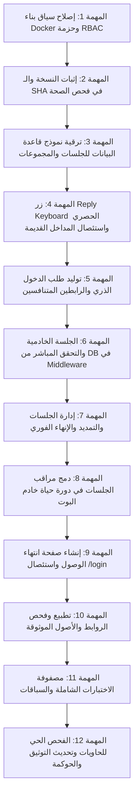

# 📋 خطة العمل التنفيذية المعتمدة: PLAN-22
## إصلاح الدخول الحصري للداشبورد من البوت والجلسات الخادمية والنشر الحصين
### Bot-Only Dashboard Authentication, Server-Side Session SSOT, and Robust Docker Deployment Remediation

**تاريخ الخطة:** 13-09-2026  
**الحالة:** 🟡 مسودة معتمدة قيد المراجعة والتنفيذ (Draft Ready for Review & Approval)  
**النطاق:** مدخل الداشبورد الحصري من البوت، طلب الدخول الذري والرابطان المتنافسان، الجلسات الخادمية المربوطة بقاعدة البيانات، مراقبة الجلسات، صفحة انتهاء الوصول، إصلاح Docker وإثبات النسخة  
**المشروع المستهدف:** `F:\Alsaada-Smart-Bot`  
**المرجع التصميمي الحاكم (SSOT):** [`docs/superpowers/specs/2026-09-13-bot-only-dashboard-auth-remediation-design.md`](../superpowers/specs/2026-09-13-bot-only-dashboard-auth-remediation-design.md)  
**الخطط السابقة المرتبطة:** `PLAN-20` (استعادة الإصدار والمصادقة والرصد)، `PLAN-21` (التصميم الموحد لمطابقة البوت والداشبورد)  

---

> [!IMPORTANT]
> ### 📜 دستور الحوكمة ومحددات النطاق الصارمة
> 1. **المرجعية الحاكمة:** هذه الخطة التنفيذية تحكم حصراً الأقسام 18 إلى 25 من تصميم `PLAN-21`، وتتبع بنسبة 100% القرارات المعتمدة في وثيقة التصميم الإصلاحي [`docs/superpowers/specs/2026-09-13-bot-only-dashboard-auth-remediation-design.md`](../superpowers/specs/2026-09-13-bot-only-dashboard-auth-remediation-design.md).
> 2. **البنود المؤجلة صراحة (Zero Scope Bleed):**
>    - يُحظر التطرق إلى إصلاح مصفوفة صلاحيات صفحات أو واجهات الداشبورد الموسعة.
>    - يُحظر تعديل صفحات القوى العاملة أو المخالصات أو التحليلات الوهمية خارج مسار حماية الجلسة.
>    - **فصل مركز الاعتمادات والقرارات والطلبات المعلقة:** مؤجل تماماً لخطة عمل لاحقة مستقلة بعد تحليل صناديق `F:\HR` الـ 11.
> 3. **حظر التعديل قبل الاعتماد:** لا يُعدل أي ملف كودي قبل اعتماد هذه الخطة كتابياً.

---

## 🎯 الأهداف التنفيذية المقاسة

1. **مدخل حصري واحد:** زر Reply Keyboard ثنائي الصف `🖥️ فتح لوحة التحكم` للأدوار الإدارية الثلاثة فقط (`SUPER_ADMIN`, `GENERAL_ADMIN`, `FIELD_ADMIN`) في المحادثة الخاصة، مع إلغاء كافة الأوامر والروابط القديمة (`/dashboard`, `/panel`, إلخ).
2. **طلب دخول ذري برابطين متنافسين:** طلب واحد ينشئ رابطين موجهين للأصلين الموثوقين (`DASHBOARD_LOCAL_URL` و `DASHBOARD_TUNNEL_URL`)؛ استهلاك أحدهما يلغي الآخر ذرياً وفورياً داخل المعاملة نفسها، مع صلاحية 5 دقائق.
3. **جلسات خادمية معتمة ترتكز لقاعدة البيانات (DB as SSOT):** الـ Cookie تحمل رمزاً عشوائياً خاماً، بينما تخزن قاعدة البيانات الهاش. التحقق يتم خادمياً في كل طلب ضد قاعدة البيانات؛ مما يجعل الإنهاء والتمديد وتغيير الدور لحظياً.
4. **حدود الجلسات:** 8 ساعات أساسية + تمديد واحد فقط لـ 8 ساعات (حد أقصى مطلق 16 ساعة من الإنشاء). حد أقصى 3 جلسات نشطة للمستخدم؛ عند بلوغ الحد يرفض الإصدار وتُعرض بطاقة إدارة الجلسات لإنهاء إحداها يدوياً دون حذف تلقائي.
5. **مراقب الجلسات الخامل:** تسجيل وتشغيل `SessionMonitorService` كجزء دائم من دورة حياة البوت، مع إرسال إشعار تجميعي قبل انتهاء الجلسة بساعة مع منع التكرار.
6. **صفحة انتهاء الوصول الإرشادية:** استئصال مسار `/login` نهائياً؛ واستبداله بصفحة إرشادية غير تفاعلية خالية من أي نماذج دخول، تعرض `traceId` ورابطاً يفتح محادثة البوت الخاصة.
7. **إصلاح Docker وإثبات النسخة:** تضمين الحزمة المشتركة `@alsaada/rbac` في سياق بناء صورة الداشبورد، واستبعاد المخرجات المؤقتة، وإدراج `commitSha` و`version` و`buildTime` في فحص الصحة `/api/health`.

---

## 🗂️ فهرس المهام وحزم التعديل



---

## 📝 المهام التفصيلية وخطوات التنفيذ

### المهمة 1: إصلاح سياق بناء Docker وحزمة RBAC
- [x] **1.1 تحديث ملف Docker الداشبورد (`docker/Dockerfile.dashboard` و `docker/Dockerfile`):**
  - إضافة نسخ حزمة `@alsaada/rbac`:
    - `COPY packages/rbac/package.json packages/rbac/`
    - `COPY packages/rbac/src/ packages/rbac/src/`
    - `COPY packages/rbac/tsconfig.json packages/rbac/`
  - التأكد من تثبيت الحزم وبناء `@alsaada/rbac` في مرحلة الـ Builder قبل بناء تطبيق `apps/admin-dashboard` وتطبيق `apps/bot-server`.
- [x] **1.2 تطهير سياق البناء ومستودع Git:**
  - إدراج `.next/` و`*.tsbuildinfo` ومجلدات الـ coverage ضمن `.dockerignore` و`.gitignore`.
  - استئصال مجلد `apps/admin-dashboard/.next` بالكامل من تعقب Git (`git rm -r --cached`).
- [x] **1.3 التحقق المحلي:**
  - بناء تطبيق الداشبورد محلياً بنجاح (`pnpm --filter @alsaada/admin-dashboard build`) وخروج الأمر بـ Exit 0.
  - بناء صورة Docker بنجاح تام (`docker build -f docker/Dockerfile.dashboard -t alsaada-dashboard:verify .`) وخروج الأمر بـ Exit 0.


### المهمة 2: إثبات النسخة ورقم الـ Commit في فحص الصحة
- [x] **2.1 حقن بيانات الإصدار في بيئة البناء والتطبيق:**
  - إنشاء `apps/admin-dashboard/src/lib/version.ts` لدعم قراءة `version`، `commitSha`، و`buildTime`.
  - دعم قراءة `APP_VERSION` و`GIT_COMMIT_SHA` في `apps/bot-server/src/config/env.ts`.
- [x] **2.2 تحديث فحص صحة الداشبورد (`apps/admin-dashboard/src/app/api/health/route.ts`):**
  - تحديث الاستجابة لتشمل `version` و`commitSha` و`buildTime` في حالتي 200 و503.
- [x] **2.3 إنشاء / تحديث فحص صحة خادم البوت (`apps/bot-server`):**
  - إنشاء مسار HTTP أصيل في `apps/bot-server/src/index.ts` على المنفذ `3000` (المربوط بـ `3001` خارجياً) يعرض بيانات النسخة والـ Commit المشغل، وإدراج رقم الـ Commit في رسالة `/ping`.
- [x] **2.4 اختبارات الوحدة والتحقق الحي:**
  - تحديث واجتياز اختبارات `apps/admin-dashboard/tests/health-route.spec.ts` بنجاح 100%.
  - التحقق الحي من الحاويتين المشغلتين على `http://localhost:3002/api/health` و `http://localhost:3001/api/health`.


### المهمة 3: ترقية نموذج قاعدة البيانات للجلسات والمجموعات
- [x] **3.1 تحديث مخطط Prisma (`packages/database/prisma/schema.prisma`):**
  - ترقية `DashboardAuthLink`:
    - إضافة حقل `groupId String @default("") @db.VarChar(64)` لربط رابطي المحلي والنفق المنبثقين من نفس الطلب.
    - إضافة فهرس مركّب `@@index([groupId, claimedAt])`.
  - ترقية `DashboardSession`:
    - إضافة حقل `extensionCount Int @default(0)` لضمان قصر التمديد على مرة واحدة فقط.
    - إضافة حقل `extendedAt DateTime?` لتوثيق لحظة التمديد.
    - إضافة حقل `maxExpiresAt DateTime?` يمثل الحد الأقصى المطلق (وقت الإنشاء + 16 ساعة).
- [x] **3.2 توليد وترحيل قاعدة البيانات:**
  - تشغيل `pnpm --filter @alsaada/database db:generate` وتوليد العميل في 807ms بنجاح.
  - تطبيق التحديث على قاعدة البيانات الحية (`prisma db push`) ومزامنة الجداول بنجاح تام.
- [x] **3.3 فحص التوافقية والتحقق التجريبي:**
  - بناء حزمة قاعدة البيانات بنجاح تام (`pnpm --filter @alsaada/database build`).
  - تشغيل واجتياز اختبارات حزمة قاعدة البيانات (`8 passed, 80 tests`) بنسبة 100%.
  - التحقق المباشر من وجود الأعمدة الأربعة في جدول `dashboard_sessions` و `dashboard_auth_links` عبر استعلام SQL داخل حاوية PostgreSQL الحية.


### المهمة 4: زر Reply Keyboard الحصري واستئصال المداخل القديمة
- [x] **4.1 تحديث لوحة Reply Keyboard الثابتة (`apps/bot-server/src/keyboards/reply-bar.keyboard.ts`):**
  - إضافة الزر المستقل بعرض صف كامل بالنص الحرفي الدقيق: `🖥️ فتح لوحة التحكم`.
  - ضبط شروط الظهور الصارمة:
    - المحادثة خاصة (`ctx.chat?.type === 'private'`).
    - الحساب نشط وغير محظور (`user.isActive && !user.isBanned`).
    - الدور الفعّال حصراً من الثلاثي: `SUPER_ADMIN`، `GENERAL_ADMIN`، `FIELD_ADMIN`.
    - عدم تفعيل وضع المحاكاة لدور غير إداري (`!ctx.isImpersonating || isImpersonatedAdmin`).
  - حظر ظهور الزر تماماً لـ: `WORKER_SUPERVISOR`، `WORKER`، `SUPPLIER`، `GUEST`.
- [x] **4.2 معالجة حدث الضغط في خادم البوت (`apps/bot-server/src/bot.ts`):**
  - استخدام المطابقة الحرفية الصارمة للنص: `bot.hears('🖥️ فتح لوحة التحكم', handleDashboardCommand)`.
  - تنقيح `isNav` واستبعاد العبارة الفضفاضة «لوحة التحكم» وقصرها حصراً على النص الدقيق.
  - إعادة التحقق الخادمي اللحظي من هوية وصلاحية المستخدم ونوع المحادثة قبل اتخاذ أي إجراء.
  - رفض الطلبات الواردة في المجموعات والسوبرجروب فورياً برفع تنبيه آمن وبدون توليد أي توكنات أو إرسال روابط في الخاص.
- [x] **4.3 استئصال المداخل القديمة نهائياً:**
  - حذف تسجيل الأوامر القديمة نهائياً من `command-scope.service.ts`: استئصال `/dashboard` لكافة الأدوار بدون استثناء.
  - التأكد من عدم وجود تسجيل لأي أوامر مثل `/dashboard` أو `/admin_dashboard` أو `/panel`.
  - تثبيت سلوك `start.handler.ts`: قصر الرابط العميق `start=dashboard_access` على التوجيه الإرشادي وتحديث اللوحة دون إصدار أي توكنات تلقائياً.
- [x] **4.4 مزامنة وتحديث اللوحة ومنع التسريب القديم:**
  - تفعيل استدعاء `ensurePersistentKeyboard(..., true)` عند هبوط الدور (`onWorkerDemoted`) أو تبديل الهوية والمحاكاة (`onImpersonationChange`).
  - تزويد `ScreenFlowService` بدالة `removePersistentKeyboard` التي ترسل `ReplyKeyboardRemove` لتطهير كاش العميل في تليجرام ومنع بقاء الزر الإداري.
  - نجاح كامل الاختبارات لـ bot-server (184/184) واختبارات الداشبورد (161/161) بنسبة 100%.

### المهمة 5: توليد طلب الدخول الذري والرابطين المتنافسين
- [ ] **5.1 فحص سقف الجلسات النشطة قبل الإصدار (`apps/bot-server/src/services/dashboard-auth.service.ts`):**
  - حساب الجلسات النشطة الحالية للمستخدم (`revokedAt: null, expiresAt > now`).
  - إذا كان عدد الجلسات `>= 3`:
    - رفض إصدار طلب جديد.
    - عرض بطاقة إدارة الجلسات النشطة توضح الوصول للحد الأقصى (3 جلسات) مع أزرار إنهاء الجلسات لإتاحة إصدار طلب جديد.
- [ ] **5.2 توليد طلب برابطين متنافسين (Atomic Competing Links):**
  - إنشاء `groupId` عشوائي موحد للطلب.
  - توليد سرين عشوائيين مستقلين عاليي الأمان:
    - سر الرابط المحلي (`originKind = 'LOCAL'`).
    - سر رابط النفق (`originKind = 'TUNNEL'`).
  - حفظ هاش SHA-256 للسرين في جدول `dashboard_auth_links` بصلاحية 5 دقائق مع ربطهما بنفس الـ `groupId`.
  - بناء الروابط المعتمدة استناداً للمتغيرين الموثوقين المطبعين:
    - `${DASHBOARD_LOCAL_URL}/api/auth/claim?token=${localToken}`
    - `${DASHBOARD_TUNNEL_URL}/api/auth/claim?token=${tunnelToken}`
- [ ] **5.3 صياغة وإرسال بطاقة الاختيار:**
  - إرسال رسالة نصية تحتوي على زري URL:
    - `🖥️ فتح محليًا`
    - `🌐 فتح عبر النفق`
  - توضيح انتهاء الصلاحية خلال 5 دقائق، وأن استخدام أي من الرابطين يلغي الرابط الآخر فوراً.

### المهمة 6: الجلسة الخادمية والتحقق المباشر من DB في Middleware
- [ ] **6.1 الاستهلاك الذري وإبطال الرابط الشقيق (`apps/admin-dashboard/src/app/api/auth/claim/route.ts`):**
  - استقبال الرمز والتحقق من الهاش داخل معاملة قاعدة بيانات (`prisma.$transaction`):
    - فحص وجود السجل وعدم استهلاكه (`claimedAt: null`) وسريان وقته (`expiresAt > now`).
    - تحديث السجل المستهلك بوضع `claimedAt = now`.
    - **الإبطال الذري للرابط الشقيق في نفس المعاملة:** إلغاء/استهلاك كافة الروابط المرتبطة بنفس الـ `groupId` لمنع استخدام الرابط الآخر:
      `updateMany({ where: { groupId, claimedAt: null }, data: { claimedAt: now, claimTraceId: traceId } })`.
  - إعادة التحقق من حالة المستخدم ودوره الإداري وسقف الجلسات المتزامنة (<= 3).
  - إذا فشل أي شرط: إرجاع خطأ أمني وتحويل المستخدم لصفحة انتهاء الوصول.
- [ ] **6.2 إنشاء الجلسة الخادمية المعتمدة وتعيين الـ Cookie:**
  - توليد رمز جلسة عشوائي خام معتم (Cryptographically Secure Opaque Token).
  - تخزين هاش SHA-256 للرمز في جدول `dashboard_sessions`:
    - `expiresAt = now + 8 hours`.
    - `maxExpiresAt = now + 16 hours`.
    - `extensionCount = 0`.
    - تخزين بصمة المتصفح والأصل ونوع الجهاز.
  - تعيين الـ Cookie باسم `alsaada_session`:
    - القيمة: الرمز الخام المعتم فقط (بدون أي payload أو توقيع يحمل وقتاً أو دوراً).
    - `HttpOnly = true`، `SameSite = 'Lax'`، `Path = '/'`.
    - `Secure = true` (مع استثناء وحيد لـ `http://localhost` في بيئة التطوير فقط).
    - `Max-Age = 8 * 3600`.
- [ ] **6.3 التحقق الخادمي الصارم في Middleware والمسارات المحمية:**
  - قراءة الرمز الخام من الـ Cookie وحساب الهاش.
  - الاستعلام المباشر من قاعدة البيانات عن الجلسة:
    - التحقق من `revokedAt === null`.
    - التحقق من `expiresAt > now`.
    - جلب المستخدم المرتبط والتأكد من `isActive === true` و`isBanned === false` واستمرار دوره ضمن الأدوار الإدارية الثلاثة.
  - **مبدأ Fail-Closed:** في حال حدوث أي خطأ في قاعدة البيانات أو انقطاع الاتصال، يُرفض الطلب فورياً (`DENY`) ولا يُسمح بالمرور تحت أي ظرف.
  - عند الرفض أو انتهاء الجلسة: إعادة التوجيه لصفحة انتهاء الوصول الإرشادية `/session-expired`.

### المهمة 7: إدارة الجلسات والتمديد والإنهاء الفوري
- [ ] **7.1 معالجة تمديد الجلسة في البوت (`dashboard.handler.ts`):**
  - فحص الجلسة: التحقق من أنها غير منتهية وغير ملغاة (`revokedAt === null`).
  - فحص عدد التمديدات: التحقق من أن `extensionCount < 1`. إذا كان سبق تمديدها، يرفض الطلب ويعلم المستخدم بالحد الأقصى.
  - حساب وقت الانتهاء الجديد: `newExpiresAt = min(currentExpiresAt + 8 hours, maxExpiresAt)`.
  - تحديث قاعدة البيانات فورياً: زيادة `extensionCount = 1` وتحديث `extendedAt` و`expiresAt`.
  - تسجيل حدث تدقيق جنائي موحد `DASHBOARD_SESSION_EXTENDED`.
  - **الأثر اللحظي:** بما أن المتصفح يستعلم من قاعدة البيانات في كل طلب، فإن التمديد يسري فوراً دون الحاجة لتحديث الـ Cookie.
- [ ] **7.2 معالجة إنهاء الجلسة الفردي وإنهاء الكل:**
  - إنهاء جلسة محددة (`sess_rev:<id>`): تحديث السجل بـ `revokedAt = now` مع سبب الإلغاء.
  - إنهاء كافة الجلسات (`sess_rev_all`): إلغاء جميع الجلسات النشطة للمستخدم.
  - **الأثر اللحظي:** في أول طلب تالٍ للمتصفح، يرفض Middleware الجلسة فورياً ويحوله لصفحة انتهاء الوصول.
- [ ] **7.3 بطاقة عرض وإدارة الجلسات في البوت:**
  - عرض قائمة الجلسات النشطة ببيانات منقحة:
    - نوع المتصفح والجهاز المشتق من User-Agent.
    - وجهة الدخول (محلي أو نفق).
    - وقت الإنشاء، آخر نشاط، وموعد الانتهاء.
    - حالة التمديد (متاح للتمديد أو تم استهلاك التمديد).
    - حجب وتشفير عنوان IP في رسالة التليجرام.

### المهمة 8: دمج مراقب الجلسات في دورة حياة خادم البوت
- [ ] **8.1 تسجيل وتشغيل الخدمة كـ Daemon (`apps/bot-server/src/index.ts`):**
  - استدعاء `sessionMonitorService.startMonitoring(bot.api)` عند بدء تشغيل الخادم بشكل Idempotent.
  - تسجيل إيقاف منظم `sessionMonitorService.stopMonitoring()` عند استلام إشارات الإيقاف `SIGINT` و`SIGTERM`.
- [ ] **8.2 إرسال الإشعار التجميعي قبل الانتهاء بساعة:**
  - فحص الجلسات التي دخلت نافذة الـ 60 دقيقة قبل الانتهاء والتي لم يُرسل لها إشعار بعد (`noticeSentAt === null`).
  - تجميع الجلسات لكل مستخدم وإرسال إشعار تليجرام واحد مجمع.
  - توفير أزرار تفاعلية لكل جلسة: `[ ⏳ تمديد 8 ساعات ]` و `[ 🛑 إنهاء الجلسة ]` مع زر لإنهاء الكل.
  - تحديث `noticeSentAt = now` لمنع تكرار الإشعار في نفس الدورة.
  - السماح بإشعار جديد واحد فقط إذا مُددت الجلسة ودخلت نافذة الـ 60 دقيقة من فترة التمديد الجديدة.

### المهمة 9: إنشاء صفحة انتهاء الوصول واستئصال /login
- [ ] **9.1 حذف مسارات ونماذج الدخول القديمة:**
  - التأكد التام من عدم وجود صفحة `/login` أو أي مكونات إدخال اسم مستخدم أو كلمة مرور أو OTP.
  - حذف أي معالجات تصدر توكنات عبر WebApp `initData`.
- [ ] **9.2 بناء صفحة انتهاء الوصول الإرشادية (`apps/admin-dashboard/src/app/session-expired/page.tsx`):**
  - صفحة ثابتة إرشادية غير تفاعلية ذات تصميم مؤسسي نظيف.
  - تعرض رسالة عامة آمنة: «انتهت جلسة الوصول للوحة التحكم أو تم إنهاؤها».
  - عرض `traceId` للدعم الفني.
  - زر واضح: «العودة للبوت لطلب الدخول» يوجه لرابط تليجرام المباشر `https://t.me/<bot_username>`.
  - خلو الصفحة تماماً من أي حقول إدخال أو أزرار تسجيل دخول ويب.

### المهمة 10: تطبيع وفحص الروابط والأصول الموثوقة
- [ ] **10.1 فحص وتطبيع متغيرات البيئة (`apps/bot-server/src/config/env.ts` و `admin-dashboard`):**
  - `DASHBOARD_LOCAL_URL`: التأكد من كونه يبدأ بـ `http://localhost:<port>` أو HTTPS موثوق صريح، وتطبيعه بحذف الشرطة المائلة الأخيرة.
  - `DASHBOARD_TUNNEL_URL`: التأكد الصارم من كونه يبدأ بـ `https://`، وتطبيعه بحذف الشرطة المائلة الأخيرة.
  - حظر الاعتماد على `Host Header` في تكوين وجهات الروابط.
- [ ] **10.2 معالجة الفشل الآمن:**
  - إذا كان أحد المتغيرين غير معرف أو غير صالح: إظهار رسالة خطأ واضحة في البوت للسوبر أدمن مع زر إعادة محاولة وزر العودة للقائمة الرئيسية، مع استمرار البوت في أداء وظائفه الأخرى دون انهيار.

### المهمة 11: مصفوفة الاختبارات الشاملة والسباقات
- [ ] **11.1 اختبارات Reply Keyboard والصلاحيات:**
  - التحقق من ظهور الزر للأدوار الثلاثة فقط واختفائه للأدوار الأربعة الأخرى وفي المجموعات.
  - التحقق من قبول النص الحرفي ورفض الأوامر والنصوص القديمة.
- [ ] **11.2 اختبارات الرابطين المتنافسين والاستهلاك الذري:**
  - توليد رابطين من طلب واحد والتحقق من صلاحية الـ 5 دقائق.
  - اختبار محاكاة استهلاك متزامن (Race Condition) والتأكد من نجاح استهلاك واحد فقط وإبطال الشقيق وتوليد جلسة وحيدة.
  - التحقق من رفض أي محاولة لإعادة استخدام رابط مستهلك.
- [ ] **11.3 اختبارات الجلسات والتمديد والإنهاء:**
  - التحقق من انتهاء الجلسة بعد 8 ساعات، وقبول تمديد واحد فقط لـ 8 ساعات إضافية (أقصى حد 16 ساعة).
  - التحقق من رفض التمديد الثاني.
  - التحقق من رفض إصدار جلسة رابعة عند بلوغ 3 جلسات نشطة وعرض بطاقة الإدارة.
  - التحقق من انعكاس الإنهاء الفوري من البوت على متصفح الداشبورد في الطلب التالي مباشرة.
- [ ] **11.4 اختبارات مراقب الجلسات:**
  - التحقق من إرسال إشعار تجميعي قبل ساعة ومنع التكرار.
- [ ] **11.5 اختبارات الأمان والـ Fail-Closed:**
  - محاكاة تعطل قاعدة البيانات في Middleware والتأكد من المنع الفوري (`DENY`).

### المهمة 12: الفحص الحي للحاويات وتحديث التوثيق والحوكمة
- [ ] **12.1 بناء واختبار حاويات Docker:**
  - بناء صورة الداشبورد والتأكد من تضمين `@alsaada/rbac` وخلو المخرجات من الأخطاء.
  - تشغيل الحاويات والتحقق من فحص الصحة `/api/health` ومطابقة `commitSha`.
- [ ] **12.2 الفحص الحي النهائي (Smoke Testing):**
  - فحص غياب مسار `/login`.
  - فحص حماية `/admin` والتحويل لصفحة انتهاء الوصول.
  - فحص توليد واستهلاك الرابطين المحلي والنفق.
- [ ] **12.3 تحديث سجل الخطط والتكامل التوثيقي:**
  - تحديث `docs/work-plans/README.md` وتسجيل `PLAN-22`.
  - تحديث وثيقة الفحص وحصر الترحيل `docs/19` بما يخص الدخول الحصري من البوت.
  - تسجيل الـ Commit النهائي وتوثيق الإنجاز بنسبة 100%.

---

## 🔒 قائمة البنود المؤجلة صراحة (Postponed Scope Ledger)

| البند المؤجل | سبب التأجيل | الوجهة اللاحقة المعتمدة |
| :--- | :--- | :--- |
| **مركز الاعتمادات والقرارات والطلبات المعلقة** | يتطلب تحليلاً دقيقاً لصناديق `F:\HR` الـ 11 وأثرها المالي والصلاحيات. | خطة عمل مستقلة مخصصة للمركز تبدأ بالبوت أولاً ثم الداشبورد. |
| **إصلاح مصفوفة الصلاحيات العامة لصفحات الداشبورد** | خارج نطاق إصلاح مصادقة الدخول الحصري والجلسات. | خطة العمل الخاصة بصفحات الأعمال وموديولاتها. |
| **استكمال وظائف القوى العاملة والمخالصات والتحليلات** | خارج نطاق بوابة الدخول والجلسات التشغيلية. | خطط العمل الموديولية المتتابعة. |
| **تصدير Excel/PDF الحقيقي لمركز الإحصائيات** | خارج نطاق بوابة الدخول والجلسات التشغيلية. | خطة التحليلات والتقارير التنفيذية. |

---

## 🛠️ أوامر التحقق وبوابات القبول (Verification Gates)

```bash
# 1. فحص التايب سكريبت الشامل وخلو المشروع من أي أخطاء
pnpm typecheck

# 2. فحص بناء كافة الحزم والتطبيقات
pnpm build

# 3. تشغيل حزمة الاختبارات الخاصة بالمصادقة والجلسات
pnpm --filter @alsaada/admin-dashboard test
pnpm --filter @alsaada/bot-server test

# 4. بوابة الحوكمة الشاملة
pnpm governance:verify

# 5. اختبار بناء صورة Docker للداشبورد من الصفر
docker build -f docker/Dockerfile.dashboard -t alsaada-dashboard:remediation .
```

---

## 🏁 إقرار الجاهزية

هذه الخطة تمثل صياغة تنفيذية مباشرة وتفصيلية بنسبة 100% لمواصفة التصميم المعتمدة في `docs/superpowers/specs/2026-09-13-bot-only-dashboard-auth-remediation-design.md`.  
التنفيذ سيبدأ فور اعتماد هذه الخطة كتابياً من قِبل المستخدم.
