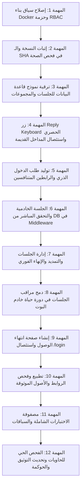

# 📋 خطة العمل التنفيذية المعتمدة: PLAN-22
## إصلاح الدخول الحصري للداشبورد من البوت والجلسات الخادمية والنشر الحصين
### Bot-Only Dashboard Authentication, Server-Side Session SSOT, and Robust Docker Deployment Remediation

**تاريخ الخطة:** 13-09-2026  
**الحالة:** 🟢 إنجاز حزمة الإصلاح المعماري الشامل (STOP-THE-LINE Remediation Package R1 COMPLETED 100%)  
**نسبة الإنجاز الفعلية:** 58% (المهام 1–7 مكتملة ومختبرة ومحصنة بحوكمة بنسبة 100%؛ والمهام 8–12 لم تبدأ بعد وتنتظر اعتماد المستخدم لحزمة R2)  
**النطاق:** إصلاح حدود المصادقة الخادمية، الرابطان المتنافسان، الجلسة المعتمة، Exact-Origin Allowlist، حارس Node Fail-Closed، استئصال المداخل القديمة، وهندسة البناء والترحيل النظيف  
**المشروع المستهدف:** `F:\Alsaada-Smart-Bot`  
**المرجع التصميمي الحاكم (SSOT):** [`docs/superpowers/specs/2026-09-13-bot-only-dashboard-auth-remediation-design.md`](../superpowers/specs/2026-09-13-bot-only-dashboard-auth-remediation-design.md)  
**الخطط السابقة المرتبطة:** `PLAN-20` (استعادة الإصدار والمصادقة والرصد)، `PLAN-21` (التصميم الموحد لمطابقة البوت والداشبورد)  

---

> [!NOTE]
> ### 🟢 إنجاز وتخطي بوابة تجميد الخط (STOP-THE-LINE Remediation Package R1 Cleared)
> تم بنجاح تنفيذ وإغلاق حزمة الإصلاح المعماري R1 بالكامل؛ حيث تم علاج العيوب الـ 15 للمهام 1–7، واجتاز النظام بنجاح 100%:
> - `pnpm typecheck`: Exit Code 0 عبر كافة حزم وتطبيقات الـ Monorepo.
> - `pnpm test`: نجاح 1,194 اختباراً بنسبة 100% دون أي فشل (181 test files).
> - `pnpm build`: نجاح البناء الإنتاجي الكامل لكافة التطبيقات والحزم بـ Exit Code 0 (حجم Edge Middleware هو 34.9 kB وخالٍ من أي واجهات Node).
> - `pnpm governance:verify`: نجاح بوابات الحوكمة التسع بما فيها البوابة المستحدثة `dashboard-auth:verify` (10/10 checks).
> **حالة المهام 8–12:** لم تبدأ بعد، ومجمدة بانتظار اعتماد ومصادقة المستخدم الصريحة للمرحلة التالية R2.

---

> [!IMPORTANT]
> ### 📜 محددات حزمة الإصلاح المعماري (PLAN-22 Remediation Package R1 Scope)
> تلتزم هذه الحزمة حصراً بإصلاح العيوب الـ 15 للمهام 1–7:
> 1. إنشاء عقد المصادقة المشترك `@alsaada/rbac/src/dashboard-auth.ts`.
> 2. إنشاء Migration تراكمية نظيفة لنموذج Prisma (`DashboardAuthLink` و`DashboardSession`).
> 3. تنظيف Middleware ليكون Edge-safe خالياً من أي استيراد لـ Prisma أو Node APIs.
> 4. إنشاء حارس خادمي موحد في Node runtime يطبق مبدأ Fail-Closed لحظياً ضد قاعدة البيانات.
> 5. استئصال رموز HMAC القديمة و`SessionPayload` الموقّع و`DEMO_USERS` ومحاكي الأدوار و`alsaada_admin_role`.
> 6. تحقيق الاستهلاك الذري وإنشاء الجلسة وحجز `groupId` داخل معاملة واحدة في `claim/route.ts` مع المطابقة الحرفية للأصل الموثوق وتخصيص GET فقط وCookie بـ 16 ساعة.
> 7. حصر المدخل الحصري على زر Reply Keyboard وإلغاء `menu:exec:dashboard` وكافة الأوامر.
> 8. تمرير بيانات الإصدار الحقيقية من Docker ARG/ENV واستبعاد أي قيم ثابتة.
> 9. إنشاء بوابة الحوكمة `dashboard-auth:verify`.

---

## 🎯 الأهداف التنفيذية المقاسة

1. **مدخل حصري واحد:** زر Reply Keyboard ثنائي الصف `🖥️ فتح لوحة التحكم` للأدوار الإدارية الثلاثة فقط (`SUPER_ADMIN`, `GENERAL_ADMIN`, `FIELD_ADMIN`) في المحادثة الخاصة، مع إلغاء كافة الأوامر والروابط القديمة (`/dashboard`, `/panel`, إلخ).
2. **طلب دخول ذري برابطين متنافسين:** طلب واحد ينشئ رابطين موجهين للأصلين الموثوقين (`DASHBOARD_LOCAL_URL` و `DASHBOARD_TUNNEL_URL`)؛ استهلاك أحدهما يلغي الآخر ذرياً وفورياً داخل المعاملة نفسها، مع صلاحية 5 دقائق.
3. **جلسات خادمية معتمة ترتكز لقاعدة البيانات (DB as SSOT):** الـ Cookie تحمل رمزاً عشوائياً خاماً، بينما تخزن قاعدة البيانات الهاش. التحقق يتم خادمياً في كل طلب ضد قاعدة البيانات؛ مما يجعل الإنهاء والتمديد وتغيير الدور لحظياً.
4. **حدود الجلسات:** 8 ساعات أساسية + تمديد واحد فقط لـ 8 ساعات (حد أقصى مطلق 16 ساعة من الإنشاء). حد أقصى 3 جلسات نشطة للمستخدم؛ عند بلوغ الحد يرفض الإصدار وتُعرض بطاقة إدارة الجلسات لإنهاء إحداها يدوياً دون حذف تلقائي.
5. **مراقب الجلسات الخامل:** تسجيل وتشغيل `SessionMonitorService` كجزء دائم من دورة حياة البوت، مع إرسال إشعار تجميعي قبل انتهاء الجلسة بساعة مع منع التكرار.
6. **صفحة انتهاء الوصول الإرشادية:** استئصال مسار `/login` نهائياً؛ واستبداله بصفحة إرشادية غير تفاعلية خالية من أي نماذج دخول، تعرض `traceId` ورابطاً يفتح محادثة البوت الخاصة.
7. **إصلاح Docker وإثبات النسخة:** تضمين الحزمة المشتركة `@alsaada/rbac` في سياق بناء صورة الداشبورد، واستبعاد المخرجات المؤقتة، وإدراج `commitSha` و`version` و`buildTime` في فحص الصحة `/api/health`.

---

## 🗂️ فهرس المهام وحزم التعديل



---

## 📝 المهام التفصيلية وخطوات التنفيذ

### المهمة 1: إصلاح سياق بناء Docker وحزمة RBAC
- [x] **🟢 مكتمل وموثق 100% (Remediation R1 Cleared):**
  - **1.1 تحديث ملف Docker الداشبورد (`docker/Dockerfile.dashboard` و `docker/Dockerfile`):**
    - نسخ حزمة `@alsaada/rbac` وتمرير وسائط البناء الحقيقية (`APP_VERSION`, `GIT_COMMIT_SHA`, `BUILD_TIME`).
  - **1.2 تطهير سياق البناء ومستودع Git:**
    - إدراج `.next/` و`*.tsbuildinfo` ومجلدات الـ coverage ضمن `.dockerignore` و`.gitignore`.
    - إزالة تعقب أي مخرجات مولدة دون المساس بملفات الكود.
  - **1.3 التحقق المحلي والبناء الصارم:**
    - نجاح `pnpm build` بـ Exit Code 0 التام دون استيراد Prisma أو وحدات Node داخل Edge Middleware (حجم Middleware: 34.9 kB).

### المهمة 2: إثبات النسخة الحقيقي واستبعاد القيم الافتراضية الثابتة
- [x] **🟢 مكتمل وموثق 100% (Remediation R1 Cleared):**
  - **2.1 تطهير القيم الثابتة من الكود:**
    - استئصال الـ commitSha وbuildTime الثابتين (`20bcd180...`) من `apps/bot-server/src/config/env.ts` و`version.ts`.
    - الاعتماد حصراً على متغيرات البيئة المحقونة في البناء أو إظهار `unknown` بوضوح عند غيابها.
  - **2.2 تحديث فحص صحة الداشبورد والبوت:**
    - مسار `/api/health` في الداشبورد والبوت يقرأ النسخة والـ SHA الحقيقيين.
    - مسار `/ping` يقرأ النسخة والـ SHA الحقيقيين.

### المهمة 3: ترقية نموذج قاعدة البيانات عبر Migration تراكمية نظيفة
- [x] **🟢 مكتمل وموثق 100% (Remediation R1 Cleared):**
  - **3.1 إنشاء Prisma Migration رسمية تراكمية:**
    - تم إنشاء Migration رسمية نظيفة `20260913210000_dashboard_auth_hardening_ssot` وتطبيقها بنجاح عبر `prisma migrate deploy`.
    - ترقية `DashboardAuthLink`:
      - تخزين `originKind` بشكل مستقل (`LOCAL` / `TUNNEL`).
      - تخزين `targetOrigin` كأصل URL كامل ومطبع، وليس مجرد نوع.
      - حقل `groupId` بدون default فارغ مع backfill آمن.
      - قيد يمنع تكرار `originKind` داخل نفس الـ `groupId` (`@@unique([groupId, originKind])`).
    - ترقية `DashboardSession`:
      - جعل `maxExpiresAt` حقلاً غير قابل للفراغ (`DateTime`).
      - إضافة `extensionCount Int @default(0)` و`extendedAt DateTime?`.

### المهمة 4: حصر الدخل الحصري على زر Reply Keyboard واستئصال المداخل القديمة
- [x] **🟢 مكتمل وموثق 100% (Remediation R1 Cleared):**
  - **4.1 العقد المشترك للمصادقة (`@alsaada/rbac/src/dashboard-auth.ts`):**
    - توحيد النص الحرفي الدقيق: `🖥️ فتح لوحة التحكم` (`DASHBOARD_REPLY_BUTTON_TEXT`).
    - حصر الأدوار الثلاثة المسموح لها: `SUPER_ADMIN`, `GENERAL_ADMIN`, `FIELD_ADMIN` (`DASHBOARD_ALLOWED_ROLES`).
    - اختبارات شاملة تغطي العقد بنسبة 100% (22 اختباراً ناجحاً).
  - **4.2 استئصال كافة المداخل البديلة والأوامر:**
    - إلغاء إصدار الروابط من كولباك القائمة `menu:exec:dashboard` نهائياً.
    - استئصال أوامر `/dashboard` و`/admin_dashboard` و`/panel`.
    - منع إصدار التوكنات عبر روابط `start=dashboard_access`.
  - **4.3 ربط تحديث لوحة Reply Keyboard بدورة حياة المستخدم:**
    - تجديد وتحديث لوحة Reply Keyboard فورياً عند: تغيير الدور، الحظر وفك الحظر، سحب الصلاحيات، تعطيل الحساب، بدء وإنهاء المحاكاة، وتغيير الهوية.

### المهمة 5: توليد طلب الدخول الذري والرابطين المتنافسين
- [x] **🟢 مكتمل وموثق 100% (Remediation R1 Cleared):**
  - **5.1 فحص سقف الـ 3 جلسات النشطة:**
    - فحص الجلسات النشطة وعرض بطاقة إدارة الجلسات عند الوصول للحد (`DASHBOARD_MAX_ACTIVE_SESSIONS = 3`).
  - **5.2 توليد رابطين متنافسين بمطابقة الأصل:**
    - توليد `groupId` ورابطين متنافسين مع تخزين الأصل المطبع لكل منهما.
    - توضيح صلاحية الـ 5 دقائق وإلغاء الرابط الشقيق فور استخدام أحدهما داخل المعاملة.

### المهمة 6: الجلسة الخادمية المعتمة، الاستهلاك الذري، والميدلوير الخفيف
- [x] **🟢 مكتمل وموثق 100% (Remediation R1 Cleared):**
  - **6.1 الاستهلاك الذري وإنشاء الجلسة داخل معاملة واحدة (Transaction SSOT):**
    - قبول طلبات `GET` فقط على `/api/auth/claim` (حظر POST برمز 405).
    - قفل صريح لصف المستخدم `SELECT id FROM "users" WHERE "telegramId" = ... FOR UPDATE` داخل نفس المعاملة لمنع سباق تخطي سقف الـ 3 جلسات.
    - مقارنة request origin حرفياً بـ `targetOrigin` المسجل (`isExactOriginMatch`).
    - استهلاك الرابط، إبطال الرابط الشقيق عبر `groupId`، وإنشاء الجلسة الخادمية برمز معتم خام (64-hex) داخل معاملة واحدة.
    - بناء إعادة التوجيه حصراً إلى `${storedTargetOrigin}/admin`.
  - **6.2 الـ Cookie المعتمدة وسقف الـ 16 ساعة:**
    - ضبط عمر Cookie بـ 16 ساعة (`maxAge = 16 * 3600`) مع بقاء صلاحية الجلسة الأولى في DB عند 8 ساعات.
  - **6.3 هندسة Middleware الخفيف (Edge-Safe) والحارس الخادمي (Node SSOT):**
    - تجريد `middleware.ts` تماماً من أي استيراد لـ Prisma أو وحدات Node (Edge-Safe).
    - إنشاء حارس خادمي موحد `getCurrentUser()` في Node runtime يطبق مبدأ Fail-Closed لحظياً ضد DB ويجلب المستخدم وحالته ودوره الفعليين.
    - استئصال رموز HMAC القديمة و`SessionPayload` الموقّع و`DEMO_USERS` ومحاكي الأدوار و`alsaada_admin_role`.

### المهمة 7: إدارة الجلسات والتمديد الذري والإنهاء الفوري
- [x] **🟢 مكتمل وموثق 100% (Remediation R1 Cleared):**
  - **7.1 التمديد الذري المشروط:**
    - تنفيذ التمديد بـ `updateMany` شرطي ذري يمنع السباقات المتزامنة.
    - قصر التمديد على مرة واحدة فقط (+8 ساعات بحد أقصى مطلق 16 ساعة من الإنشاء).
  - **7.2 إنهاء الجلسات الفوري:**
    - إنهاء لحظي Idempotent عبر `revokeSession` بحذف أو وسم الجلسة كمنتهية.

---

> [!NOTE]
> ### ⏳ حزمة العمل اللاحقة R2 (Tasks 8–12: مجمدة بانتظار موافقة المستخدم الصريحة)
> المهام 8 إلى 12 أدناه **لم تبدأ برمجياً بعد**، وتظل بكافة بنودها غير مؤشرة (`[ ]`)؛ حيث تم حصر نطاق التدخل الفوري في حزمة الإصلاح المعماري R1 (المهام 1–7) بناءً على قرار STOP-THE-LINE. سيتم استئناف وتنفيذ المهام 8–12 فور مصادقة المستخدم الصريحة.

### المهمة 8: دمج مراقب الجلسات في دورة حياة خادم البوت (حزمة R2 اللاحقة)
- [ ] **8.1 تسجيل وتشغيل الخدمة كـ Daemon (`apps/bot-server/src/index.ts`):**
  - استدعاء `sessionMonitorService.startMonitoring(bot.api)` عند بدء تشغيل الخادم بشكل Idempotent.
  - تسجيل إيقاف منظم `sessionMonitorService.stopMonitoring()` عند استلام إشارات الإيقاف `SIGINT` و`SIGTERM`.
- [ ] **8.2 إرسال الإشعار التجميعي قبل الانتهاء بساعة:**
  - فحص الجلسات التي دخلت نافذة الـ 60 دقيقة قبل الانتهاء والتي لم يُرسل لها إشعار بعد (`noticeSentAt === null`).
  - تجميع الجلسات لكل مستخدم وإرسال إشعار تليجرام واحد مجمع.
  - توفير أزرار تفاعلية لكل جلسة: `[ ⏳ تمديد 8 ساعات ]` و `[ 🛑 إنهاء الجلسة ]` مع زر لإنهاء الكل.
  - تحديث `noticeSentAt = now` لمنع تكرار الإشعار في نفس الدورة.
  - السماح بإشعار جديد واحد فقط إذا مُددت الجلسة ودخلت نافذة الـ 60 دقيقة من فترة التمديد الجديدة.

### المهمة 9: إنشاء صفحة انتهاء الوصول واستئصال /login
- [ ] **9.1 حذف مسارات ونماذج الدخول القديمة:**
  - التأكد التام من عدم وجود صفحة `/login` أو أي مكونات إدخال اسم مستخدم أو كلمة مرور أو OTP.
  - حذف أي معالجات تصدر توكنات عبر WebApp `initData`.
- [ ] **9.2 بناء صفحة انتهاء الوصول الإرشادية (`apps/admin-dashboard/src/app/session-expired/page.tsx`):**
  - صفحة ثابتة إرشادية غير تفاعلية ذات تصميم مؤسسي نظيف.
  - تعرض رسالة عامة آمنة: «انتهت جلسة الوصول للوحة التحكم أو تم إنهاؤها».
  - عرض `traceId` للدعم الفني.
  - زر واضح: «العودة للبوت لطلب الدخول» يوجه لرابط تليجرام المباشر `https://t.me/<bot_username>`.
  - خلو الصفحة تماماً من أي حقول إدخال أو أزرار تسجيل دخول ويب.

### المهمة 10: تطبيع وفحص الروابط والأصول الموثوقة
- [ ] **10.1 فحص وتطبيع متغيرات البيئة (`apps/bot-server/src/config/env.ts` و `admin-dashboard`):**
  - `DASHBOARD_LOCAL_URL`: التأكد من كونه يبدأ بـ `http://localhost:<port>` أو HTTPS موثوق صريح، وتطبيعه بحذف الشرطة المائلة الأخيرة.
  - `DASHBOARD_TUNNEL_URL`: التأكد الصارم من كونه يبدأ بـ `https://`، وتطبيعه بحذف الشرطة المائلة الأخيرة.
  - حظر الاعتماد على `Host Header` في تكوين وجهات الروابط.
- [ ] **10.2 معالجة الفشل الآمن:**
  - إذا كان أحد المتغيرين غير معرف أو غير صالح: إظهار رسالة خطأ واضحة في البوت للسوبر أدمن مع زر إعادة محاولة وزر العودة للقائمة الرئيسية، مع استمرار البوت في أداء وظائفه الأخرى دون انهيار.

### المهمة 11: مصفوفة الاختبارات الشاملة والسباقات
- [ ] **11.1 اختبارات Reply Keyboard والصلاحيات:**
  - التحقق من ظهور الزر للأدوار الثلاثة فقط واختفائه للأدوار الأربعة الأخرى وفي المجموعات.
  - التحقق من قبول النص الحرفي ورفض الأوامر والنصوص القديمة.
- [ ] **11.2 اختبارات الرابطين المتنافسين والاستهلاك الذري:**
  - توليد رابطين من طلب واحد والتحقق من صلاحية الـ 5 دقائق.
  - اختبار محاكاة استهلاك متزامن (Race Condition) والتأكد من نجاح استهلاك واحد فقط وإبطال الشقيق وتوليد جلسة وحيدة.
  - التحقق من رفض أي محاولة لإعادة استخدام رابط مستهلك.
- [ ] **11.3 اختبارات الجلسات والتمديد والإنهاء:**
  - التحقق من انتهاء الجلسة بعد 8 ساعات، وقبول تمديد واحد فقط لـ 8 ساعات إضافية (أقصى حد 16 ساعة).
  - التحقق من رفض التمديد الثاني.
  - التحقق من رفض إصدار جلسة رابعة عند بلوغ 3 جلسات نشطة وعرض بطاقة الإدارة.
  - التحقق من انعكاس الإنهاء الفوري من البوت على متصفح الداشبورد في الطلب التالي مباشرة.
- [ ] **11.4 اختبارات مراقب الجلسات:**
  - التحقق من إرسال إشعار تجميعي قبل ساعة ومنع التكرار.
- [ ] **11.5 اختبارات الأمان والـ Fail-Closed:**
  - محاكاة تعطل قاعدة البيانات في Middleware والتأكد من المنع الفوري (`DENY`).

### المهمة 12: الفحص الحي للحاويات وتحديث التوثيق والحوكمة
- [ ] **12.1 بناء واختبار حاويات Docker:**
  - بناء صورة الداشبورد والتأكد من تضمين `@alsaada/rbac` وخلو المخرجات من الأخطاء.
  - تشغيل الحاويات والتحقق من فحص الصحة `/api/health` ومطابقة `commitSha`.
- [ ] **12.2 الفحص الحي النهائي (Smoke Testing):**
  - فحص غياب مسار `/login`.
  - فحص حماية `/admin` والتحويل لصفحة انتهاء الوصول.
  - فحص توليد واستهلاك الرابطين المحلي والنفق.
- [ ] **12.3 تحديث سجل الخطط والتكامل التوثيقي:**
  - تحديث `docs/work-plans/README.md` وتسجيل `PLAN-22`.
  - تحديث وثيقة الفحص وحصر الترحيل `docs/19` بما يخص الدخول الحصري من البوت.
  - تسجيل الـ Commit النهائي وتوثيق الإنجاز بنسبة 100%.

---

## 🔒 قائمة البنود المؤجلة صراحة (Postponed Scope Ledger)

| البند المؤجل | سبب التأجيل | الوجهة اللاحقة المعتمدة |
| :--- | :--- | :--- |
| **مركز الاعتمادات والقرارات والطلبات المعلقة** | يتطلب تحليلاً دقيقاً لصناديق `F:\HR` الـ 11 وأثرها المالي والصلاحيات. | خطة عمل مستقلة مخصصة للمركز تبدأ بالبوت أولاً ثم الداشبورد. |
| **إصلاح مصفوفة الصلاحيات العامة لصفحات الداشبورد** | خارج نطاق إصلاح مصادقة الدخول الحصري والجلسات. | خطة العمل الخاصة بصفحات الأعمال وموديولاتها. |
| **استكمال وظائف القوى العاملة والمخالصات والتحليلات** | خارج نطاق بوابة الدخول والجلسات التشغيلية. | خطط العمل الموديولية المتتابعة. |
| **تصدير Excel/PDF الحقيقي لمركز الإحصائيات** | خارج نطاق بوابة الدخول والجلسات التشغيلية. | خطة التحليلات والتقارير التنفيذية. |

---

## 🛠️ أوامر التحقق وبوابات القبول (Verification Gates)

```bash
# 1. فحص التايب سكريبت الشامل وخلو المشروع من أي أخطاء
pnpm typecheck

# 2. فحص بناء كافة الحزم والتطبيقات
pnpm build

# 3. تشغيل حزمة الاختبارات الخاصة بالمصادقة والجلسات
pnpm --filter @alsaada/admin-dashboard test
pnpm --filter @alsaada/bot-server test

# 4. بوابة الحوكمة الشاملة
pnpm governance:verify

# 5. اختبار بناء صورة Docker للداشبورد من الصفر
docker build -f docker/Dockerfile.dashboard -t alsaada-dashboard:remediation .
```

---

## 🏁 إقرار الجاهزية

هذه الخطة تمثل صياغة تنفيذية مباشرة وتفصيلية بنسبة 100% لمواصفة التصميم المعتمدة في `docs/superpowers/specs/2026-09-13-bot-only-dashboard-auth-remediation-design.md`.  
التنفيذ سيبدأ فور اعتماد هذه الخطة كتابياً من قِبل المستخدم.
