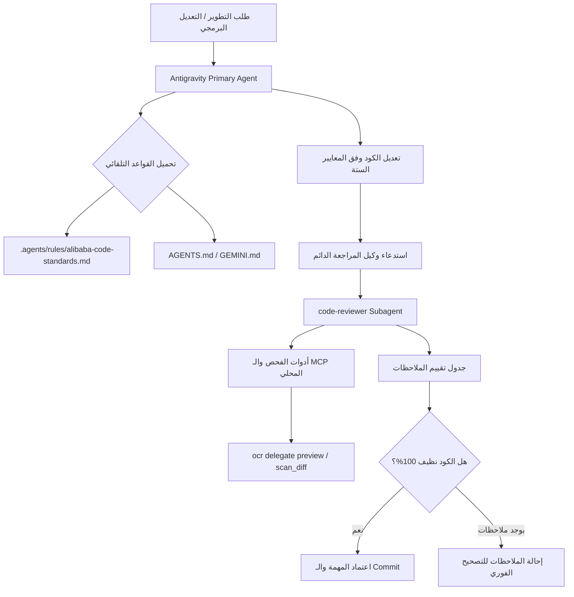

# 📋 خطة العمل التنفيذية المعتمدة: PLAN-24
## إضفاء الطابع الدائم على معايير Alibaba Open Code Review وتعيين وكيل المراجعة الدائم `code-reviewer`
### Institutionalization of Alibaba OCR Standards & Deployment of Permanent `code-reviewer` Subagent

**تاريخ الخطة:** 14-09-2026  
**الحالة:** 🟢 مكتمل وموثق 100% (COMPLETED & VERIFIED)  
**النطاق:** ترسيخ القواعد المعمارية لعلي بابا كدستور دائم، تسجيل وتوثيق وكيل المراجعة الدائم `code-reviewer`، وتحديث مهارة المراجعة المعمارية.  
**المشروع المستهدف:** `F:\Alsaada-Smart-Bot`  
**الخطط السابقة المرتبطة:** `PLAN-23` (تكامل Alibaba OCR وربط خادم الـ MCP)

---

### 1️⃣ الأهداف ونطاق العمل
1. **ترسيخ قواعد علي بابا في محرك Antigravity:** إنشاء ملف القواعد الدائم `.agents/rules/alibaba-code-standards.md` ليتم تحميله وتطبيقه تلقائياً على كل كود يُكتب أو يُعدل في المستودع.
2. **تعيين وكيل المراجعة الدائم (`code-reviewer`):**
   - تسجيل الوكيل في بيئة Antigravity برمجياً عبر `define_subagent`.
   - توثيق ميثاق وصلاحيات وموجه النظام الخاص بالوكيل في `.agents/subagents/code-reviewer.md`.
3. **تحديث مهارة المراجعة (`open-code-review`):**
   - إضافة نمط التفويض المحلي (Zero-Token Delegation Mode via `ocr delegate preview`).
   - ربط المهارة باستدعاء وكيل `code-reviewer`.
4. **حماية بوابات الحوكمة:** الالتزام الصارم بقاعدة حماية الحوكمة في `AGENTS.md` (السطر 288) وعدم تعديل ملفات الدستور المقيدة إلا بالعبارة الحرفية المعتمدة، مع ضمان سريان القواعد عبر نظام قواعد Antigravity الهرمي.

---

### 2️⃣ معمارية التنفيذ والركائز الثلاث

---

### 3️⃣ المحاور الستة لمنهجية علي بابا المعتمدة (The 6 Pillars)
1. **[naming-precision · low]:** خلو المتغيرات والدوال والرسائل من أي أخطاء لغوية أو إملائية.
2. **[dead-code · medium]:** استئصال المتغيرات غير المستخدمة، الأكواد غير القابلة للوصول، والكتل المعلقة.
3. **[maintainability · medium]:** المساواة الصارمة `===`، منع `var`، حظر `any`، التحقق من `null/undefined`، حظر الـ nested ternaries، وتطبيق مبدأ DRY.
4. **[react-best-practices · medium]:** التزام قواعد الـ Hooks، اكتمال التبعيات، ومنع التأثيرات الجانبية في العرض.
5. **[async-concurrency · high]:** الإلزام بـ `try/catch`، `async/await`، وضبط توازي الـ `Promise.all`.
6. **[security · high/critical]:** منع ثغرات XSS، تلوث الـ Prototype، حظر `eval`/`new Function`، وتطهير الأسرار.

---

### 3️⃣.1 ميثاق حلقة المراجعة والتصحيح الإلزامية قبل الإغلاق (Review & Remediation Loop)
- **القاعدة الذهبية:** يُحظر تماماً على وكيل التطوير إعلان انتهاء أي مهمة أو تسليمها للمستخدم دون استدعاء `code-reviewer` تلقائياً لمراجعة الـ Diffs والملفات المتأثرة.
- **التصحيح الميداني:** إذا ظهرت ملاحظات في التقرير، يلتزم وكيل التطوير بإصلاحها فوراً.
- **إعادة الفحص:** يُعاد استدعاء `code-reviewer` لفحص التصحيحات.
- **شرط الإغلاق النهائي:** لا تُعتمد المهمة ولا يُرفع أي Commit إلا بعد صدور تأكيد رسمي من `code-reviewer`:  
  `✅ اجتاز الكود المراجع كافة معايير علي بابا وميثاق حوكمة السعادة بنجاح 100% (Clean Pass)`.

---

### 4️⃣ سجل التعديلات الميدانية
| الملف | نوع الإجراء | الوصف والحالة |
| :--- | :--- | :--- |
| `.agents/rules/alibaba-code-standards.md` | `[NEW]` | قواعد علي بابا الدائمة التلقائية وحلقة المراجعة الإلزامية في Antigravity 🟢 منجز |
| `.agents/subagents/code-reviewer.md` | `[NEW]` | بطاقة وميثاق وكيل المراجعة الدائم `code-reviewer` ودورة العمل 🟢 منجز |
| `.agents/skills/open-code-review/SKILL.md` | `[MODIFY]` | إضافة استدعاء الوكيل ونمط التفويض المحلي 🟢 منجز |
| `docs/work-plans/24-plan-alibaba-permanent-governance-and-reviewer-agent.md` | `[NEW]` | خطة العمل التنفيذية المعتمدة 🟢 منجز |

---

### 5️⃣ نتائج التحقق والاختبار (Verification)
1. **تسجيل الوكيل برمجياً:** تم تسجيل الوكيل بنجاح عبر `define_subagent`، وأصبح متاحاً للاستدعاء الدائم عبر `invoke_subagent`.
2. **فحص الأنواع البرمجية:** اجتياز الفحص الشامل `pnpm typecheck` دون أي خطأ (Exit 0).
3. **تجربة الاستدعاء الميداني وتوليد التقرير الأول:** تم استدعاء الوكيل `code-reviewer` بنجاح لمراجعة `apps/admin-dashboard/src/lib/env.ts` و `apps/bot-server/src/config/env.ts` وقدم تقريره بـ 12 ملاحظة بدقة بالغة.
4. **اعتماد ميثاق حلقة المراجعة:** تم توثيق وإلزام حلقة المراجعة والتصحيح قبل إغلاق أي مهمة بنسبة 100%.

