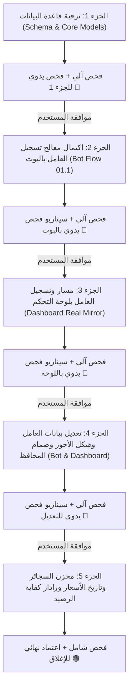

# 📋 خطة العمل رقم 26: المطابقة المعمارية لتدفقات تسجيل العامل ولوحة التحكم وهيكل الأجور والنزاهة المالية
## Master Plan 26: Workforce Onboarding Parity, Dashboard Mirroring, Duty Cycles, Canteen Price History, Custom Allowances & Fraud Prevention

> [!IMPORTANT]
> **ميثاق الحوكمة وبروتوكول التنفيذ المرحلي (Staged Execution & Manual Verification Protocol):**
> تستند هذه الخطة إلى المقررات المعتمدة في جلسة العصف الذهني وفق المرجع الوظيفي الأساسي [`F:\HR`](file:///F:/HR/src/bot/conversations/new-worker.conversation.ts) ودستور العمل المعتمد في `AGENTS.md`.
> **قاعدة التنفيذ الإلزامية:** تُنفذ الخطة على **5 أجزاء صغيرة متعاقبة (Small Sequential Milestones)**؛ بعد كل جزء يُقدم تقرير تنفيذي متضمناً **سيناريو الفحص اليدوي الموجه** ولا يتم الانتقال للجزء التالي إلا بعد موافقة واعتماد المستخدم الصريحة.

---

## 🏛️ مرجعية التعديلات والقرارات المعتمدة
1. **استعادة خطوات تسجيل العامل الـ 12 بالبوت بمطابقة 100% مع النظام السابق** مع تزويدها بزر تخطي سريع (`⏭️ تخطي`).
2. **سد الفجوة في لوحة التحكم (`Admin Dashboard`)** لتكون مرآة مطابقة تماماً لبيانات البوت، وبناء مسار `POST /api/workers` الحقيقي، والربط الديناميكي للمواقع والوظائف.
3. **تصحيح نظام الورديات إلى «دورات العمل والإجازات الميدانية (Duty Cycles)»** (20/10، 30/10، 40/10، ومخصص) موروثة تلقائياً من الوظيفة `JobTitle` مع إمكانية التخصيص اليدوي.
4. **ربط صنف السجائر بمخزن الكانتين وتأسيس سجل تاريخي للأسعار (`CanteenItemPriceHistory`)** بتاريخ بداية سريان (`effectiveDate`) لحماية المعاملات والمقاصة السابقة.
5. **حظر عرض أو إدخال الأجر اليومي (`dailyWage`) تماماً**، وحصره كمعامل اشتقاق محاسبي داخلي بحت.
6. **هيكلة الراتب الشهري:** (أساسي + إضافي + بدلات ثابتة مدمجة بإجمالي الراتب وتظهر في قسيمة الراتب وبطاقة العامل، مع حرية تسمية كل بدل لكل عامل بشكل مستقل)، وعزل البدلات المؤقتة المحددة بشهور.
7. **صمامات أمان النزاهة المالية ومكافحة الاحتيال:** صمام أمان حوكمة تغيير أرقام المحافظ وحسابات الصرف البنكية، ورادار سقف كفاية الرصيد لمسحوبات الكانتين والسجائر.
8. **اعتماد نوع التعاقد الافتراضي:** `PERMANENT` (عمالة دائمة) مع إمكانية التعديل من الواجهتين.

---

## 📦 الأجزاء الخمسة لخطة التنفيذ (Chunked Execution Milestones)

---

### 🔹 الجزء الأول (Milestone 1): ترقية بنية قاعدة البيانات والنواة المالية والتشغيلية
**الهدف:** تهيئة جداول قاعدة البيانات ومحركات التشفير والأنواع لاستيعاب الراتب الإضافي، البدلات المسماة، تاريخ أسعار الكانتين، ودورات العمل.

#### الملفات المتأثرة:
* **[MODIFY]** [`packages/database/prisma/schema.prisma`](file:///f:/Alsaada-Smart-Bot/packages/database/prisma/schema.prisma):
  - إضافة حقل `additionalSalary Decimal @default(0) @db.Decimal(12, 2)` لنموذج `Worker`.
  - تعديل القيمة الافتراضية لحقل `contractType` في `Worker` لتصبح `"PERMANENT"`.
  - تحديث حقل دورة العمل ليعبر عن دورات العمل الميدانية (20/10, 30/10, 40/10).
  - تحديث نموذج `WorkerCustomAllowance` بإضافة `title String` لإتاحة تسمية كل بدل بحرية لكل عامل.
  - إنشاء نموذج جديد `CanteenItemPriceHistory` يتضمن (`id`, `canteenItemId`, `costPrice`, `sellingPrice`, `effectiveDate`, `changedBy`, `reason`).
* **[MODIFY]** توليد عميل Prisma المحدث والمزامنة مع قاعدة البيانات المحلية (`prisma generate` / migration).
* **[MODIFY]** [`modules/workforce/src/flows/01.1-worker-registration/flow.types.ts`](file:///f:/Alsaada-Smart-Bot/modules/workforce/src/flows/01.1-worker-registration/flow.types.ts): تحديث الواجهات والأنواع المطابقة للـ Schema.

#### التحقق الآلي:
* بناء حزمة قاعدة البيانات: `pnpm --filter @alsaada/database build`.
* تشغيل اختبارات التحقق من الـ Schema والفهارس: `pnpm --filter @alsaada/database test`.

#### 🛑 بروتوكول التوقف والفحص اليدوي الموجه (Manual Test Guide 1):
* **توجيه المستخدم:**
  1. مراجعة مخرجات تجميع Prisma للتأكد من خروج الأمر بـ `Exit 0`.
  2. فحص السكيما للتأكد من إضافة الحقول (`additionalSalary`, `title` للبدلات، جدول `CanteenItemPriceHistory`، و `PERMANENT` كافتراضي).
* **بوابة الاعتماد:** التوقف وانتظار تأكيد المستخدم لنجاح الجزء الأول قبل لمس أي كود في معالج البوت.

---

### 🔹 الجزء الثاني (Milestone 2): اكتمال معالج تسجيل العامل بالبوت بمطابقة 100% مع النظام السابق
**الهدف:** استعادة كافة خطوات التسجيل الـ 12 الميدانية في البوت مع دعم زر التخطي، والتوريث التلقائي للراتب الأساسي والإضافي ودورة العمل من كتالوج الوظائف، وحظر الأجر اليومي.

#### الملفات المتأثرة:
* **[MODIFY]** [`modules/workforce/src/flows/01.1-worker-registration/flow.handler.ts`](file:///f:/Alsaada-Smart-Bot/modules/workforce/src/flows/01.1-worker-registration/flow.handler.ts):
  - تفعيل الانتقال المتسلسل لكافة الخطوات الـ 12 بعد تاريخ المباشرة:
    1. رخصة القيادة (`DRIVING_LICENSE`) مع أزرار الاختيار وزر تخطي.
    2. الموقف التجنيدي (`MILITARY_STATUS`) مع أزرار الاختيار وزر تخطي.
    3. هاتف الطوارئ والقريب (`EMERGENCY_PHONE`) مع خيار التخطي.
    4. الموقف التأميني السابق بجهة أخرى (`INSURANCE_STATUS`) مع أزرار الاختيار وزر تخطي.
    5. الحالة الاجتماعية (`MARITAL_STATUS`) مع أزرار الاختيار وزر تخطي.
    6. رقم المحفظة / التحويل المخصص (`CUSTOM_WALLET_INPUT`) إذا لم يكن نفس رقم الموبايل.
  - إزالة أي ذكر أو إدخال للأجر اليومي من المعالج بالكامل.
* **[MODIFY]** [`modules/workforce/src/flows/01.1-worker-registration/flow.service.ts`](file:///f:/Alsaada-Smart-Bot/modules/workforce/src/flows/01.1-worker-registration/flow.service.ts):
  - استدعاء كتالوج الوظائف وتوريث `baseSalary` و `additionalSalary` ودورة العمل الافتراضية (مثلاً 20/10) آلياً وتثبيتها في بيانات العامل وحساب الراتب الإجمالي تلقائياً.
  - تفعيل رادار تكرار رقم الهاتف (`phoneBlindIndex`) لتنبيه المشرف في حال كان الهاتف مسجلاً مسبقاً لعامل آخر.
* **[MODIFY]** [`modules/workforce/src/flows/01.1-worker-registration/flow.repository.ts`](file:///f:/Alsaada-Smart-Bot/modules/workforce/src/flows/01.1-worker-registration/flow.repository.ts):
  - حفظ كافة الحقول المستعادة ذرّياً في جدول `Worker`.
  - إنشاء القيد الافتتاحي للراتب في `SalaryHistory` متضمناً الراتب الأساسي والإضافي المشتقين تلقائياً.
* **[MODIFY]** [`modules/workforce/src/flows/01.1-worker-registration/flow.messages.ts`](file:///f:/Alsaada-Smart-Bot/modules/workforce/src/flows/01.1-worker-registration/flow.messages.ts) و [`flow.keyboard.ts`](file:///f:/Alsaada-Smart-Bot/modules/workforce/src/flows/01.1-worker-registration/flow.keyboard.ts):
  - تحديث بطاقة المراجعة النهائية (`confirmationCard`) لتعرض تفاصيل الراتب التلقائي (الأساسي + الإضافي) ودورة العمل وكافة الحقول المستعادة.

#### التحقق الآلي:
* تشغيل حزمة اختبارات موديول القوى العاملة: `pnpm --filter @alsaada/workforce test`.
* التحقق السريع: `pnpm flow:check modules/workforce/src/flows/01.1-worker-registration`.

#### 🛑 بروتوكول التوقف والفحص اليدوي الموجه (Manual Test Guide 2):
* **توجيه المستخدم:**
  1. فتح البوت بتليجرام كمسؤول أو مشرف والدخول إلى: `الموارد البشرية والعمالة` ⬅️ `شؤون العاملين والتعيينات` ⬅️ `➕ تسجيل وتعيين عامل جديد`.
  2. اختيار بطاقة رقم قومي ⬅️ تخطي الصورة ⬅️ كتابة اسم رباعي ⬅️ اعتماد اسم الشهرة ⬅️ إدخال رقم قومي 14 رقماً ⬅️ إدخال هاتف ⬅️ اختيار وسيلة صرف ⬅️ اختيار وظيفة (مثلاً: سائق لودر).
  3. التحقق من ظهور الخطوات المتتالية الجديدة (رخصة القيادة، التجنيد، هاتف الطوارئ، التأمين السابق، الحالة الاجتماعية) وتجربة زر `[ ⏭️ تخطي ]` في أحدها للتأكد من مرونته.
  4. فحص "بطاقة المراجعة النهائية": التأكد من ظهور الراتب الأساسي والإضافي الموروثين تلقائياً من الوظيفة، وظهور دورة العمل (مثلاً 20 يوم عمل / 10 راحة)، وعدم وجود أي ذكر للأجر اليومي.
  5. تأكيد الحفظ والتأكد من استلام رابط واتساب الترحيبي بنجاح.
* **بوابة الاعتماد:** التوقف وانتظار تأكيد المستخدم لنجاح تجربة البوت قبل الانتقال للوحة التحكم.

---

### 🔹 الجزء الثالث (Milestone 3): سد الفجوة البرمجية في لوحة التحكم وتفعيل تسجيل العامل الفعلي كمرآة للبوت
**الهدف:** تحويل صفحة تسجيل العامل الجديد في لوحة التحكم من مجرد واجهة وهمية إلى نظام قيد متكامل ومطابق للبوت.

#### الملفات المتأثرة:
* **[NEW]** [`apps/admin-dashboard/src/app/api/workers/route.ts`](file:///f:/Alsaada-Smart-Bot/apps/admin-dashboard/src/app/api/workers/route.ts):
  - إنشاء مسار `POST /api/workers` الحقيقي.
  - دعم التشفير للأرقام الحساسة (الهاتف، الرقم القومي، الحسابات) وتوليد الفهارس العمياء.
  - توليد كود العامل الذكي المهيكل آلياً.
  - اشتقاق الراتب الأساسي والإضافي ودورة العمل الافتراضية من كتالوج `JobTitle`.
  - القيد الذري في `Worker`، `SalaryHistory`، `WorkerChangeLog`، `AuditLog`، و `OutboxEvent`.
* **[MODIFY]** [`apps/admin-dashboard/src/app/admin/workforce/new/page.tsx`](file:///f:/Alsaada-Smart-Bot/apps/admin-dashboard/src/app/admin/workforce/new/page.tsx):
  - جلب المواقع والوظائف ديناميكياً من قاعدة البيانات عبر Server Action أو API.
  - حذف حقل الأجر اليومي من الصفحة نهائياً.
  - عرض الراتب الأساسي والإضافي المعتمدين للوظيفة فور اختيارها تلقائياً.
  - إضافة الحقول المطابقة للبوت: وسيلة الصرف ورقم المحفظة، دورة العمل والراحة، نوع التعاقد (افتراضي دائم `PERMANENT`)، هاتف الطوارئ، الرخص، التجنيد، والموقف التأميني.
  - إتاحة إضافة "بدل ثابت" للراتب مع كتابة مسماه وقيمته بحرية.
  - إرسال البيانات الفعلية عبر `fetch('/api/workers', { method: 'POST' })` مع معالجة الأخطاء ورسائل النجاح والتحويل لدليل العاملين.

#### التحقق الآلي:
* بناء لوحة التحكم والتأكد من خلوها من أي أخطاء Type أو Lint: `pnpm --filter @alsaada/admin-dashboard build`.

#### 🛑 بروتوكول التوقف والفحص اليدوي الموجه (Manual Test Guide 3):
* **توجيه المستخدم:**
  1. فتح لوحة التحكم على المسار `/admin/workforce/new`.
  2. التأكد من أن قوائم الوظائف والمواقع مسحوبة حياً من قاعدة البيانات وليست أسماء ثابتة.
  3. إدخال بيانات عامل جديد: رقم قومي، اسم، شهرة، هاتف، اختيار وظيفة (ملاحظة ظهور الراتب الأساسي والإضافي تلقائياً وبدء التعاقد كدائم).
  4. الضغط على حفظ والتأكد من نجاح العملية والانتقال لدليل العاملين (`/admin/workforce/directory`).
  5. التأكد من ظهور العامل الجديد بكوده الذكي الرسمي في الدليل وقاعدة البيانات.
* **بوابة الاعتماد:** التوقف وانتظار تأكيد المستخدم لنجاح التسجيل من لوحة التحكم قبل الانتقال لشاشات التعديل.

---

### 🔹 الجزء الرابع (Milestone 4): مواءمة شاشات تعديل بيانات العامل وهيكل الأجور وصمام المحافظ
**الهدف:** استكمال كافة الحقول الناقصة في صفحة تعديل العامل باللوحة، وإتاحة إدارة البدلات المسماة، وتفعيل صمام أمان المحافظ لمنع الاحتيال المالي.

#### الملفات المتأثرة:
* **[MODIFY]** [`apps/admin-dashboard/src/app/admin/workforce/[id]/edit/edit-worker-client.tsx`](file:///f:/Alsaada-Smart-Bot/apps/admin-dashboard/src/app/admin/workforce/[id]/edit/edit-worker-client.tsx):
  - حذف حقل الأجر اليومي تماماً من واجهة التعديل.
  - عرض الراتب كعناصر مستقلة: الراتب الأساسي + الراتب الإضافي + البدلات الثابتة لكل عامل باسمها المستقل.
  - إتاحة قسم لإدارة البدلات (إضافة بدل مسمى وقيمته، وتحديد ما إذا كان ثابتاً مستمراً أو مؤقتاً لشهور محددة).
  - إضافة الحقول التي كانت غائبة في اللوحة: وسيلة الصرف ورقم المحفظة، دورة العمل والراحة، رخصة القيادة، الموقف التجنيدي، هاتف الطوارئ، وحفظ الملاحظات الطبية.
* **[MODIFY]** [`apps/admin-dashboard/src/app/api/workers/[id]/route.ts`](file:///f:/Alsaada-Smart-Bot/apps/admin-dashboard/src/app/api/workers/[id]/route.ts):
  - استقبال وتحديث الحقول المضافة وتأمين حفظ `medicalNotes`، `emergencyPhone`، `drivingLicense`، `militaryStatus`، `maritalStatus`، `shiftSystem`.
  - تطبيق صمام أمان تغيير المحافظ وحسابات الصرف: حظر تعديل رقم المحفظة أو وسيلة الصرف لغير السوبر أدمن، وإرسال سجل تدقيق فوري بالعملية.
* **[MODIFY]** [`modules/workforce/src/flows/01.2.D-worker-edit/flow.handler.ts`](file:///f:/Alsaada-Smart-Bot/modules/workforce/src/flows/01.2.D-worker-edit/flow.handler.ts):
  - مواءمة معالج تعديل الراتب بالبوت ليدعم إظهار وتعديل الراتب الأساسي والإضافي والبدلات الثابتة المسماة، وحذف الأجر اليومي من واجهات العرض.

#### التحقق الآلي:
* تشغيل اختبارات تدفق التعديل 01.2.D بالبوت: `pnpm --filter @alsaada/workforce test`.
* فحص بناء واجهات التعديل: `pnpm --filter @alsaada/admin-dashboard build`.

#### 🛑 بروتوكول التوقف والفحص اليدوي الموجه (Manual Test Guide 4):
* **توجيه المستخدم:**
  1. فتح صفحة تعديل العامل في لوحة التحكم (`/admin/workforce/[id]/edit`).
  2. معاينة تبويب "المستحقات": التأكد من غياب الأجر اليومي وظهور الراتب الأساسي والإضافي وقسم البدلات المسماة.
  3. تجربة إضافة بدل ثابت باسم مخصص (مثلاً: "بدل إشراف موقع") بقيمة 1500 ج.م، وحفظ التعديلات والتأكد من انضمامه لإجمالي الراتب الشهري.
  4. تجربة فتح نفس العامل في البوت عبر: `الموارد البشرية` ⬅️ `تعديل بيانات عامل` ⬅️ معاينة بطاقة العامل والتأكد من قراءة نفس البيانات والبدلات بدقة تامة.
* **بوابة الاعتماد:** التوقف وانتظار تأكيد المستخدم لنجاح التعديل والمطابقة قبل الانتقال للجزء الأخير.

---

### 🔹 الجزء الخامس (Milestone 5): ربط مخزن السجائر بأسعار تاريخية ورادار كفاية الرصيد
**الهدف:** استكمال حوكمة مخصص السجائر بالربط المباشر مع أصناف ومخزن الكانتين، وإنشاء محرك الأسعار ذات السريان التاريخي لحماية الحسابات السابقة، ورادار سقف كفاية الرصيد.

#### الملفات المتأثرة:
* **[MODIFY]** [`packages/core-components`](file:///f:/Alsaada-Smart-Bot/packages/core-components) أو الموديول المختص:
  - بناء دالة تسعير السجائر والكانتين بناءً على تاريخ الحركة ومقارنته بـ `effectiveDate` في جدول `CanteenItemPriceHistory`.
  - تحديث واجهة تحديث أسعار الكانتين بحيث يتم حفظ السعر القديم تلقائياً في جدول التاريخ مع تثبيت تاريخ بدء السريان.
* **[MODIFY]** [`modules/workforce/src/flows/01.2.D-worker-edit/flow.cigarette-handler.ts`](file:///f:/Alsaada-Smart-Bot/modules/workforce/src/flows/01.2.D-worker-edit/flow.cigarette-handler.ts):
  - التأكد من ربط اختيار السجائر بجدول `CanteenItem` الفعلي وعرض السعر الساري لحظياً.
* **[NEW/MODIFY]** محرك صمام أمان كفاية الرصيد (Accrual Safety Buffer):
  - فحص رصيد أيام العمل المكتسبة للعامل ومقارنتها بإجمالي السلف ومسحوبات السجائر وإظهار تحذير فوري عند تجاوز سقف الأمان (70%).

#### التحقق الآلي:
* تشغيل اختبارات المقاصة وحسابات الأسعار التاريخية.
* تشغيل الفحص العام الشامل لكافة موديولات وحزم المشروع: `pnpm test` و `pnpm governance:verify`.

#### 🛑 بروتوكول التوقف والفحص اليدوي الموجه (Manual Test Guide 5):
* **توجيه المستخدم:**
  1. تحديث سعر صنف سجائر في لوحة التحكم أو البوت إلى سعر جديد مع تحديد تاريخ سريان من اليوم.
  2. فحص سحوبات العامل السابقة للتأكد من أنها احتفظت بالسعر القديم ولم تتغير قيمتها (حماية المحاسبة السابقة).
  3. تجربة تسجيل مسحوب سجائر جديد والتأكد من احتسابه بالسعر الجديد الساري.
  4. فحص رسالة التحذير في حال اقتراب مسحوبات العامل من سقف استحقاقه الشهري.
* **بوابة الاعتماد:** الاعتماد الختامي للخطة وتحديث سجل الترحيل `docs/19` بنسبة 100%.

---

## 🔒 التحقق النهائي الشامل (Final Verification Plan)
* تشغيل اختبارات الانحدار الشاملة: `pnpm test`.
* التأكد من التجميع الكامل لكافة الحزم والموديولات بدون أي أخطاء `any`: `pnpm build`.
* فحص بوابة الحوكمة وأدوات القياس: `pnpm governance:verify`.
