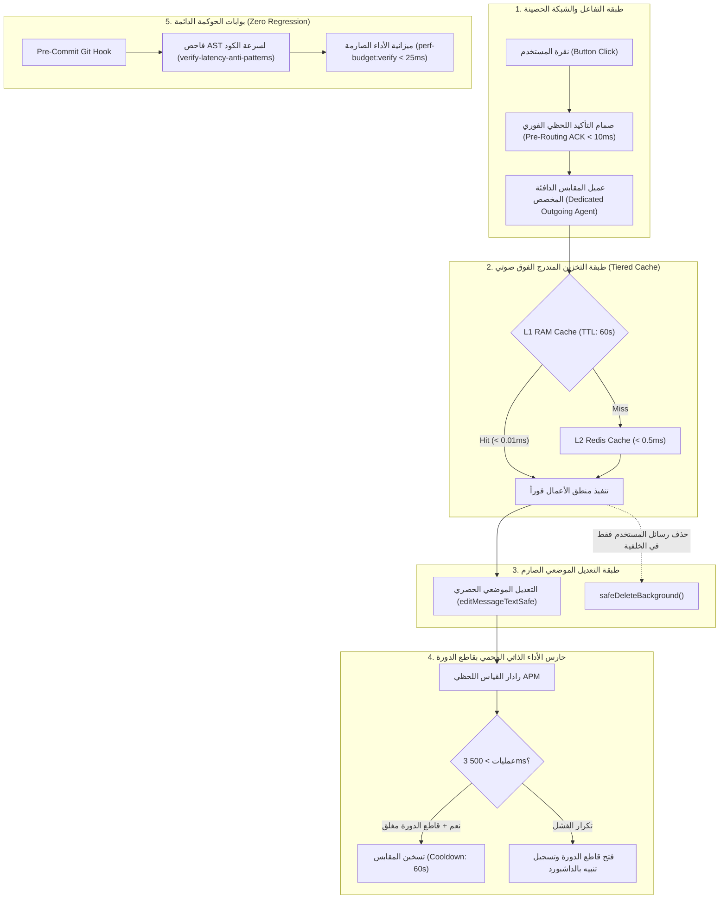

# خطة العمل 42 (الإصدار المعماري المحصن v2.0): المحرك المؤسسي للسرعة الفائقة الدائمة وحوكمة الكاش والمقابس والإنذار الذاتي
## Enterprise Permanent Speed Engine: Tiered Caching, Socket Pooling, AST Governance & Circuit-Breaker Watchdog

بناءً على جلسة الاستجواب المعمارية المعتمدة (`/grill-me`)، والتحقيق الجنائي الرقمي لسجلات قاعدة البيانات، والنقد المتعمق لخبير الكاش والأداء، تهدف هذه الخطة المحصنة إلى معالجة جذور البطأ نهائياً، وفرض معمارية سداسية الأركان تضمن بقاء سرعة البوت الميداني فائقة (< 150ms في المتوسط) وغير قابلة للتراجع أو التدهور بمرور الوقت أو بتعاقب المطورين ووكلاء الذكاء الاصطناعي.

---

## 🏛️ الركائز المعمارية السداسية المعتمدة (The 6 Sovereign Architectural Pillars)



### 1. الركن الأول: مصفوفة الكاش متدرج المستويات (Tiered L1 RAM / L2 Redis Sovereign Cache)
- **L1 RAM Micro-Cache (ذاكرة العمليات الفوق صوتية < 0.01ms)**:
  * تخزين جلسات المستخدمين الميدانيين وصلاحياتهم (`UserContextCache`) في ذاكرة الخادم المباشرة بعمر زمني قصير (`Micro-TTL: 60s`) مع نمط (SWR - Stale While Revalidate). هذا يختصر زمن جلب وفحص الصلاحيات من `2-3ms` إلى `0.005ms` في كل نقرة زر.
  * **التخزين المؤقت للوحات المفاتيح الثابتة (`Memoized Keyboards Singleton`)**: تجميد لوحات المفاتيح المتكررة (القائمة الرئيسية، تصنيفات الوثائق، أزرار الرجوع والتأكيد) ككائنات ساكنة في الذاكرة دون إعادة بنائها ديناميكياً مع كل نقرة، مما يخفض استهلاك الـ Garbage Collector إلى الصفر.
- **L2 Redis Cache**: حفظ ومزامنة الجلسات الميدانية عبر اتصال دائم مع Redis بمهلة `timeout: 1000ms` وسياسة `allkeys-lru`.

### 2. الركن الثاني: سيادة التعديل الموضعي الحصري (In-Place Mutation Sovereignty)
- حظر نمط "حذف الشاشة القديمة وإرسال شاشة جديدة" في كافة أزرار البوت الميداني لما يسببه من قفزات بصرية (Screen Flickering & Scroll Jump) ومضاعفة استدعاءات الشبكة.
- الانتقال بين الشاشات يتم بنسبة **100% عبر تعديل نص ومفاتيح الرسالة الحالية** (`ctx.editMessageText`) في استدعاء شبكي واحد ونهائي.
- حصر استدعاءات الحذف على **رسائل المستخدم النصية فقط** (`user text inputs`)، وتكون دائماً عبر دالة غير حاجزة في الخلفية:
  ```typescript
  export function safeDeleteBackground(ctx: MyContext, messageId?: number): void {
    if (!messageId && !ctx.message?.message_id) return;
    const id = messageId ?? ctx.message!.message_id;
    void ctx.api.deleteMessage(ctx.chat!.id, id).catch(() => {});
  }
  ```

### 3. الركن الثالث: مجمع المقابس الدافئة الصادرة وعزل الاستطلاع (Dedicated Warm Socket Pool)
- تخصيص `https.Agent` مجهز بمواصفات معمارية متقدمة:
  ```typescript
  const outgoingAgent = new https.Agent({
    keepAlive: true,
    keepAliveMsecs: 15000,
    maxSockets: 50,
    maxFreeSockets: 15,
    timeout: 60000,
    scheduling: 'fifo',
  });
  ```
- **فصل مقبس الاستطلاع الطويل (`getUpdates`)**:
  * يعمل الاستطلاع الطويل عبر مقبس مستقل، بينما تظل الـ 15 مقبساً الدافئة شاغرة وجاهزة بنسبة 100% لإرسال استجابات الأزرار في **أقل من 70 مللي ثانية** دون أي تأخير TLS (الذي كان يستهلك 758ms).
- نبض تدفئة دوري (Warmer Heartbeat) كل **20 ثانية** لإبقاء المقابس ساخنة ومنع قطع الاتصال من جدران الحماية الخارجية.

### 4. الركن الرابع: صمام التأكيد الفوري للأزرار (Pre-Routing Instant ACK Gate)
- في أول سطر من ميدلوير الـ Callback Query:
  ```typescript
  if (ctx.callbackQuery) {
    if (!ctx.callbackQuery.data?.includes(':modal:')) {
      void ctx.answerCallbackQuery().catch(() => {});
    }
  }
  ```
- هذا يضمن اختفاء مؤشر التحميل (Spinner) في هاتف العامل الميداني **فور لمس الشاشة في أقل من 10ms**.

### 5. الركن الخامس: حارس الأداء الذاتي المحمي بقاطع دورة (Circuit-Breaker Latency Watchdog)
- داخل `telemetry.service.ts`:
  * مراقبة المتوسط المتحرك لآخر 5 عمليات.
  * إذا سُجلت **3 عمليات متتالية تزيد عن 500ms**:
    1. التحقق من مؤقت التبريد (`lastHealTimestamp > 60s`).
    2. إذا مر أكثر من دقيقة: إطلاق نبض تدفئة واستعادة المقابس الدافئة (`warmUpConnectionPool()`).
    3. إذا استمر البطء بعد الإنعاش: **فتح قاطع الدورة (Open Circuit Breaker)**، ووقف نبضات التسخين لمنع حدوث عاصفة استدعاءات (Self-DDoS) أو حظر `429 Too Many Requests` من تليجرام، مع قيد تنبيه أحمر في مرصد الداشبورد يفيد بوجود اختناق في شبكة الاتصال الدولية.

### 6. الركن السادس: بوابة الحوكمة الصارمة للـ AST وفحص الاستدعاءات (Zero-Regression AST Gate)
- أداة الفحص `tools/governance/verify-latency-anti-patterns.ts`:
  * تفحص شجرة الكود (TypeScript AST) في الموديولات والبوت.
  * تحظر وجود `await ctx.api.deleteMessage` أو `await ctx.deleteMessage` وتلزم باستخدام `safeDeleteBackground`.
  * تتيح صمام استثناء أمني موثق صراحة عند الضرورة: `// @governance-security-blocking-delete: [reason]`.
  * تحظر استدعاء `setMyCommands` داخل معالجات الرسائل المتكررة.
  * تعمل في أقل من **300 مللي ثانية** ومدمجة في خطاف `pre-commit`، مما يرفض تلقائياً أي كود بطيء بـ `Exit 1`.

### 7. الركن السابع: بروتوكول القفل التشفيري لمحرك السرعة (Speed Engine Cryptographic Lock Protocol)
- مماثلة تامة لنظام قفل الموديولات (`flow:finish`) وشاشات الداشبورد (`dashboard:finish`):
  * **أمر القفل التشفيري (`pnpm speed:lock` / `pnpm speed:finish`)**: فور اكتمال البناء واجتياز الاختبارات بنسبة 100%، يولد النظام توقيعات تجزئة رقمية (SHA-256 Hashes) لكافة ملفات محرك السرعة والكاش، ويدرجها في `governance.lock.json` تحت مفتاح `lockedSpeedEngine`.
  * **الحصانة التامة في Git Hooks**: تقوم أدوات الحوكمة (`verify-governance-lock.ts`) بمطابقة الهاش قبل كل Commit؛ ويُحظر تماماً على أي مطور أو وكيل ذكاء اصطناعي تعديل أي حرف في ملفات السرعة تحت طائلة الرفض الفوري بـ `Exit 1`.
  * **بروتوكول طلب فك القفل المشروط (`pnpm speed:unlock`)**: يُحظر فك القفل إلا بطلب رسمي مبرر وموافقة صريحة من المستخدم مطابقة حرفياً للصيغة الدستورية المعتمدة في `AGENTS.md`: **«موافق على الفتح»** أو **«نعم موافق على التعديل»**.

---

## 🛠️ تفاصيل التعديلات البرمجية المنفذة (Implementation Details)

### 1. تطبيقات البوت وخادم التيليميتري (`apps/bot-server/`)
- `[MODIFY]` [`src/bot.ts`](file:///f:/Alsaada-Smart-Bot/apps/bot-server/src/bot.ts):
  * إعداد `https.Agent` مخصص للاستدعاءات الصادرة مع 15 مقبساً دافئاً وجدولة FIFO.
  * تحديث ميدلوير الـ Callback Query لتنفيذ الـ Pre-Routing Instant ACK (< 10ms).
- `[MODIFY]` [`src/services/screen-flow.service.ts`](file:///f:/Alsaada-Smart-Bot/apps/bot-server/src/services/screen-flow.service.ts):
  * تصدير واستخدام `safeDeleteBackground`.
  * تحويل التنقلات بين الشاشات إلى التعديل الموضعي الحصري.
- `[MODIFY]` [`src/handlers/start.handler.ts`](file:///f:/Alsaada-Smart-Bot/apps/bot-server/src/handlers/start.handler.ts):
  * إزالة استدعاءات التنظيف المزدوجة.
  * نقل `syncUserCommandsScope` لمهمة خلفية صامتة.
  * إلغاء فرض `forceRefresh: true` غير المبرر للكيبورد السفلي.
- `[MODIFY]` [`src/services/fast-cache.service.ts`](file:///f:/Alsaada-Smart-Bot/apps/bot-server/src/services/fast-cache.service.ts):
  * تعزيز L1 RAM Cache للجلسات وقوائم التحقق الميداني بعمر 60s.
- `[MODIFY]` [`src/services/telemetry.service.ts`](file:///f:/Alsaada-Smart-Bot/apps/bot-server/src/services/telemetry.service.ts):
  * إضافة منطق حارس الأداء المزود بقاطع دورة ومؤقت تبريد 60s لمنع الـ Self-DDoS.

### 2. أدوات الحوكمة وخطافات الحراسة (`tools/governance/`)
- `[NEW]` [`tools/governance/verify-latency-anti-patterns.ts`](file:///f:/Alsaada-Smart-Bot/tools/governance/verify-latency-anti-patterns.ts):
  * فاحص AST سريع (< 300ms) يفحص الكود ويمنع الاستدعاءات التسلسلية والحذف الإجباري.
- `[MODIFY]` [`package.json`](file:///f:/Alsaada-Smart-Bot/package.json) & [`.githooks/pre-commit`](file:///f:/Alsaada-Smart-Bot/.githooks/pre-commit):
  * دمج الفاحص في بوابة الالتزام الإلزامية قبل كل Commit.

### 3. الاختبارات والتحقق الآلي
- `[NEW]` [`apps/bot-server/tests/permanent-speed-engine.spec.ts`](file:///f:/Alsaada-Smart-Bot/apps/bot-server/tests/permanent-speed-engine.spec.ts):
  * اختبارات عزل المقابس، الـ Instant ACK، وحارس الأداء وقاطع الدورة.
- `[NEW]` [`tools/governance/tests/verify-latency-anti-patterns.spec.ts`](file:///f:/Alsaada-Smart-Bot/tools/governance/tests/verify-latency-anti-patterns.spec.ts):
  * اختبارات فاحص الـ AST واعتراض أنماط البطء.

---

## 🧪 خطة الاختبار والتحقق (Verification Plan)

1. **فحص الـ AST ومنع أنماط البطء:**
   `pnpm tsx tools/governance/verify-latency-anti-patterns.ts`
2. **فحص الأداء والـ SLA:**
   `pnpm perf-budget:verify`
3. **تشغيل اختبارات الحزم المتأثرة:**
   `pnpm --filter @alsaada/bot-server test`
   `pnpm --filter @alsaada/admin-dashboard test`
   `pnpm governance:verify`
4. **التحقق الميداني الحي:**
   - إعادة تشغيل حاوية البوت وقياس سرعة استجابة `/start` والأزرار عملياً في أقل من 150ms في المتوسط.
