# خطة العمل 43 (الإصدار المعماري التنفيذي فائق التفصيل v4.0): التحصين المعماري الشامل للنواة التحتية لمنظومة السعادة سمارت بوت
## Enterprise Core Hardening: Zero-Improvisation Technical Blueprint (Microkernel Bus, Universal Wizard Engine, Module Lifecycle Suite & DB Index Armor)

> [!IMPORTANT]
> **دستور المواصفة الفنية الشاملة والمعيارية الصفرية للارتجال (Zero-Improvisation SSOT):**  
> صُممت هذه النسخة التنفيذية (v4.0) لتكون **دليلاً هندسياً شاملاً لكل سطر كود، وتوقيع نوع، ومفتاح كاش، ومخطط قاعدة بيانات**، بحيث لا يُترك أي تفصيل فني أو افتراض هندسي لاجتهاد أو تخمين الأداة المنفذة.
> تخضع الخطة بالكامل لمبادئ `AGENTS.md`، والمواصفة 24، ومعايير علي بابا الست (`open-code-review`).

---

## 🧭 خريطة الركائز المعمارية الخمس المحصنة (The 5 Sovereign Core Hardening Pillars)

```mermaid
flowchart TD
    subgraph P1 ["1️⃣ ناقل الموديولات السيادي ونواة البوت المصغرة (Sovereign Microkernel Bus)"]
        A["apps/bot-server/src/bot.ts<br/>(خادم نواة مصغرة مقفل تشفيرياً)"] --> B["modules.registry.ts<br/>(سجل الموديولات المركزي)"]
        B --> C1["Workforce Module"]
        B --> C2["Settings Module"]
        B --> C3["الموديولات الجديدة القادمة..."]
        A -. "توجيه O(1) عبر بادئات المسارات (Prefixes)" .-> B
        B -. "دورة الحياة: init() و shutdown() و status" .-> A
    end

    subgraph P2 ["2️⃣ محرك الجلسات الموحد المحمي (Universal Wizard Session Engine)"]
        D["User Wizard Action"] --> E["UniversalWizardSessionEngine<TState>"]
        E --> F["L2 Redis Distributed State (SSOT)"]
        E --> G["Circuit-Breaker L1 Fallback (< 0.01ms)"]
        E --> H["Auto BackStack (Bounded Depth <= 10)"]
        E --> I["Self-Releasing Mutex Guard withLock()"]
        E --> J["كنس الجلسات العالقة عند تبديل السياق (Context Switch GC)"]
    end

    subgraph P3 ["3️⃣ طاقم حوكمة وتوليد الموديولات (Module Scaffolding & Lifecycle Suite)"]
        K["pnpm make:module <name> <title>"] --> L["توليد كامل لهيكل الموديول القياسي (10 ملفات)"]
        L --> M["pnpm module:finish / pnpm module:unlock"]
        M --> N["إدارة الحالة: draft -> active -> locked"]
    end

    subgraph P4 ["4️⃣ تحصين فهارس قاعدة البيانات والنزاهة المالية (DB Index & Transaction Armor)"]
        O["PostgreSQL 16 Schema"] --> P["فهارس مركبة ذكية (Compound Indexes) على المفاتيح الأجنبية"]
        P --> Q["حظر سباق السحب المالي عبر الذرية وعزل المعاملات"]
        Q --> R["استعلامات سريعة دائماً < 2ms لبيانات الملايين"]
    end

    subgraph P5 ["5️⃣ تثبيت حوكمة المستودع والتوقيع التشفيري (Zero-Drift Baseline)"]
        S["تدقيق الملفات وتطهير الشوائب"] --> T["تحديث التوقيع التشفيري governance:lock"]
        T --> U["Commit نظيف ومرجعي"]
        U --> V["pnpm governance:verify (11/11 PASS)"]
    end
```



---

## 🛠️ المواصفات الفنية التنفيذية الدقيقة (Exhaustive Technical Specifications)

### 1️⃣ الركن الأول: ناقل الموديولات السيادي المتكامل (`ModuleRuntimeContext` & `AppModuleDefinition`)

#### أ. مسار العقد المشترك: `packages/core-components/src/contracts/module.contract.ts`
```typescript
import type { Bot, Context } from 'grammy';
import type { PrismaClient } from '@alsaada/database';

export interface ModuleRuntimeContext<C extends Context = Context> {
  prisma: PrismaClient;
  redis: any; // Redis client instance with status checking
  api: Bot<C>['api'];
  telemetry?: any;
  screenFlow?: any;
}

export type ModuleStatus = 'active' | 'draft' | 'maintenance';

export interface AppModuleDefinition<C extends Context = Context> {
  name: string;
  titleArabic: string;
  version: string;
  status: ModuleStatus;
  callbackPrefixes: string[];
  init?: (bot: Bot<C>, runtime: ModuleRuntimeContext<C>) => Promise<void>;
  shutdown?: () => Promise<void>;
  registerRoutes: (bot: Bot<C>, runtime: ModuleRuntimeContext<C>) => void;
  onTextInput?: (ctx: C, text: string) => Promise<boolean>;
  onPhotoInput?: (ctx: C, fileId: string) => Promise<boolean>;
  onDocumentInput?: (ctx: C, doc: NonNullable<NonNullable<Context['message']>['document']>) => Promise<boolean>;
  getPersistentReplyButtons?: (role: string) => string[];
}

export type ModuleFactory<C extends Context = Context> = (
  runtime: ModuleRuntimeContext<C>
) => AppModuleDefinition<C>;
```

#### ب. مسار السجل المركزي: `apps/bot-server/src/modules.registry.ts`
```typescript
import type { MyContext } from './types/context.js';
import type { AppModuleDefinition, ModuleRuntimeContext } from '@alsaada/core-components';
import { createWorkforceAppModule } from '@alsaada/workforce';
import { createSettingsAppModule } from '@alsaada/settings';

export class ModulePrefixRouter<C extends MyContext = MyContext> {
  private readonly prefixMap = new Map<string, AppModuleDefinition<C>>();
  private readonly activeModules: AppModuleDefinition<C>[] = [];

  constructor(modules: AppModuleDefinition<C>[]) {
    for (const mod of modules) {
      if (mod.status === 'active' || process.env.NODE_ENV !== 'production') {
        this.activeModules.push(mod);
        for (const prefix of mod.callbackPrefixes) {
          this.prefixMap.set(prefix, mod);
        }
      }
    }
  }

  resolveByCallback(data: string): AppModuleDefinition<C> | undefined {
    for (const [prefix, mod] of this.prefixMap.entries()) {
      if (data.startsWith(prefix)) return mod;
    }
    return undefined;
  }

  getActiveModules(): AppModuleDefinition<C>[] {
    return this.activeModules;
  }
}

export function buildRegisteredModules(runtime: ModuleRuntimeContext<MyContext>): {
  router: ModulePrefixRouter<MyContext>;
  modules: AppModuleDefinition<MyContext>[];
} {
  const modules: AppModuleDefinition<MyContext>[] = [
    createWorkforceAppModule(runtime),
    createSettingsAppModule(runtime),
  ];
  const router = new ModulePrefixRouter(modules);
  return { router, modules };
}
```

#### ج. إعادة هيكلة وتجريد: `apps/bot-server/src/bot.ts`
- استبدال كافة استدعاءات الموديولات المباشرة بـ:
  ```typescript
  const runtimeContext: ModuleRuntimeContext<MyContext> = {
    prisma,
    redis,
    api: bot.api,
    telemetry: telemetryService,
    screenFlow: screenFlowService,
  };
  const { router, modules } = buildRegisteredModules(runtimeContext);

  // 1. Lifecycle init & Route registration
  for (const mod of modules) {
    if (mod.init) await mod.init(bot, runtimeContext);
    mod.registerRoutes(bot, runtimeContext);
  }

  // 2. Optimized Fast O(1) Prefix Callback Delegation
  bot.on('callback_query:data', async (ctx, next) => {
    const data = ctx.callbackQuery.data;
    const targetModule = router.resolveByCallback(data);
    // Let Grammy standard routers execute, but targetModule is pre-indexed
    return next();
  });

  // 3. Unified Text Input Delegation loop
  bot.on('message:text', async (ctx, next) => {
    const text = ctx.message.text.trim();
    for (const mod of modules) {
      if (mod.onTextInput && (await mod.onTextInput(ctx, text))) {
        return;
      }
    }
    return next();
  });

  // 4. Unified Photo & Document Delegation loop
  bot.on('message:photo', async (ctx, next) => {
    const photo = ctx.message.photo;
    const bestPhoto = photo[photo.length - 1];
    if (bestPhoto) {
      for (const mod of modules) {
        if (mod.onPhotoInput && (await mod.onPhotoInput(ctx, bestPhoto.file_id))) {
          return;
        }
      }
    }
    return next();
  });
  ```

---

### 2️⃣ الركن الثاني: محرك الجلسات والمسودات الموحد (`UniversalWizardSessionEngine`)

#### أ. مسار الكود: `packages/core-components/src/wizard-session/wizard-session.engine.ts`
* **مخطط الكائن المخزن في الكاش (`WizardSessionState`):**
```typescript
export interface WizardSessionState<TData = Record<string, unknown>> {
  flowKey: string;
  step: string;
  history: string[]; // Bounded LIFO stack (MAX: 10)
  data: TData;
  createdAt: number;
  updatedAt: number;
}

export interface WizardEngineOptions {
  ttlSeconds?: number;       // الافتراضي: 900 ثانية (15 دقيقة)
  lockTtlMs?: number;        // الافتراضي: 1500 مللي ثانية
  maxHistoryDepth?: number;  // الافتراضي: 10 خطوات سابقة
}
```

* **مفاتيح التخزين الصارمة في Redis:**
  - مفتاح الجلسة: `session:wizard:${telegramId}`
  - مفتاح قفل التزامن (Mutex): `lock:wizard:${telegramId}`
  - مفتاح تتبع التدفق النشط: `active:wizard:${telegramId}`

* **دوال المحرك الإلزامية:**
  1. `getSession(telegramId: bigint): Promise<WizardSessionState<TData> | null>`:
     - فحص L2 Redis مع fallback لـ L1 LRU محلي في حال سقوط الاتصال.
  2. `startSession(telegramId: bigint, flowKey: string, initialStep: string, initialData?: TData): Promise<WizardSessionState<TData>>`:
     - كنس ومسح أي جلسة سابقة عالقة للمستخدم فورياً (`Context Switch GC`).
     - إنشاء الجلسة الجديدة بـ `history = [initialStep]`.
  3. `transitionStep(telegramId: bigint, nextStep: string, patchData?: Partial<TData>): Promise<WizardSessionState<TData>>`:
     - إضافة الخطوة الحالية إلى `history` مع قص المكدس إذا تجاوز `maxHistoryDepth (10)`.
     - تحديث `step = nextStep`، وتحديث `updatedAt`، وتجديد `TTL = 900s`.
  4. `popPreviousStep(telegramId: bigint): Promise<{ previousStep: string; state: WizardSessionState<TData> } | null>`:
     - استخراج آخر خطوة من `history` والرجوع إليها موضعياً.
  5. `clearSession(telegramId: bigint): Promise<void>`:
     - مسح مفاتيح الجلسة من Redis و L1.
  6. `withLock<R>(telegramId: bigint, fn: () => Promise<R>): Promise<R>`:
     - تنفيذ العملية داخل قفل ذري مدته 1500ms مع تحرير إلزامي في كتلة `finally`.

---

### 3️⃣ الركن الثالث: طاقم حوكمة وتوليد وإغلاق الموديولات (`Module Scaffolding & Lifecycle Suite`)

#### أ. أداة توليد الموديولات: `tools/scaffold/scaffold-module.ts`
الأمر: `pnpm make:module <name> <title-arabic>`
* **الملفات الـ 10 المولدة في `modules/<name>/`:**
  1. `package.json`:
     ```json
     {
       "name": "@alsaada/<name>",
       "version": "2.0.0-alpha.1",
       "type": "module",
       "main": "./dist/index.js",
       "scripts": {
         "build": "tsc",
         "typecheck": "tsc --noEmit",
         "test": "vitest run"
       },
       "dependencies": {
         "@alsaada/core-components": "workspace:*",
         "@alsaada/database": "workspace:*"
       }
     }
     ```
  2. `tsconfig.json`: يرث من `../../tsconfig.base.json`.
  3. `src/index.ts`: يصدر `create<PascalName>AppModule` وكافة الواجهات والخدمات.
  4. `src/shared/module.types.ts`: يعرف سياق الموديول وحالات التدفقات.
  5. `src/shared/module.constants.ts`: الثوابت والألوان وبادئات الكولباك.
  6. `src/module.permissions.ts`: مصفوفة صلاحيات النطاق المتوافقة مع `@alsaada/rbac`.
  7. `src/flows.manifest.ts`: مصفوفة عقود التدفقات `FlowContractMetadata[]`.
  8. `src/module.routes.ts`: موجه مسارات تيليجرام الخاص بالموديول.
  9. `src/module.register.ts`: دالة المصنع `create<PascalName>AppModule(runtime)` بحالة افتراضية `status: 'draft'`.
  10. `tests/<name>-module.spec.ts`: اختبار تكامل أولي يتحقق من تسجيل الموديول وبادئاته.
* **الأتمتة الصامتة الفورية:**
  - إدراج `@alsaada/<name>: "workspace:*"` في `apps/bot-server/package.json`.
  - إدراج استدعاء المصنع في `apps/bot-server/src/modules.registry.ts`.

#### ب. أداة إغلاق واعتماد الموديول: `tools/scaffold/finish-module.ts`
الأمر: `pnpm module:finish <name>`
* التحقق من اجتياز فحص `flow:check` لكافة تدفقات الموديول.
* تعديل الحالة في `src/module.register.ts` من `status: 'draft'` إلى `status: 'active'`.
* تحديث سجل الترحيل المرجعي `docs/19`.
* الاستفسار الحرفي الإلزامي عن القفل:
  > «تم الانتهاء بنجاح من بناء واختبار موديول **[اسم الموديول]**. هل نقفل ونحمى هذا الموديول تشفيرياً ضد أي تعديل؟  
  > **لإتمام القفل والحماية، يرجى الرد بالصيغة المعتمدة حصراً:**  
  > **«نعم اقفل»**»
* قفل المجلد تشفيرياً في `governance.lock.json` فور استلام الرد الحرفي.

#### ج. أداة فك قفل الموديول: `tools/scaffold/unlock-feature.ts`
الأمر: `pnpm module:unlock <name>`
* لا يبدأ فك القفل إلا بعد استلام الموافقة الصريحة الحرفية: **«موافق على الفتح»** أو **«نعم موافق على التعديل»**.

---

### 4️⃣ الركن الرابع: تحصين فهارس قاعدة البيانات المركبة (`Database Index Armor`)

#### التعديلات الإلزامية الدقيقة في `packages/database/prisma/schema.prisma`:
1. **جدول العمال `model Worker`:**
   ```prisma
   @@index([tenantId, status])
   @@index([siteId, status])
   @@index([jobTitleId])
   @@index([departmentId])
   ```
2. **جدول الأستاذ المالي `model FinancialLedger`:**
   ```prisma
   @@index([workerId, transactionType])
   @@index([createdAt])
   @@index([accountingMonth])
   ```
3. **جدول العهد المالية `model FinancialCustody`:**
   ```prisma
   @@index([siteId, status])
   @@index([custodianWorkerId, status])
   ```
4. **جدول طلبات السلف `model AdvanceRequest`:**
   ```prisma
   @@index([workerId, status])
   @@index([siteId, createdAt])
   ```
5. **جدول أصناف الكانتين `model CanteenItem`:**
   ```prisma
   @@index([siteId, isActive])
   ```
6. **جدول الإجازات `model Leave`:**
   ```prisma
   @@index([workerId, status])
   @@index([siteId, startDate])
   ```
7. **جدول مهمات الوقاية `model PPEAsset`:**
   ```prisma
   @@index([workerId, status])
   @@index([siteId, assetType])
   ```

---

### 5️⃣ الركن الخامس: تثبيت حوكمة المستودع والتوقيع التشفيري (Zero-Drift Baseline)

1. مراجعة وتدقيق الـ 54 ملفاً الحالية والتأكد من سلامتها.
2. تشغيل `pnpm governance:lock` لإعادة حساب هاشات الحوكمة وتحديث `governance.lock.json`.
3. إجراء Commit مرجعي نظيف لتأمين خط الأساس:
   `git add . && git commit -m "chore(governance): baseline core hardening and lock signature sync"`
4. تشغيل `pnpm governance:verify` والتأكد من ظهور:
   ```
   arch:verify: PASS
   migration:verify: PASS
   flow-contracts:verify: PASS
   telegram-contracts:verify: PASS
   docs:audit: PASS
   docs:parity: PASS
   dashboard-auth:verify: PASS
   financial:verify: PASS
   perf-budget:verify: PASS
   governance:tamper-check: PASS
   ai-compliance:verify: PASS
   ```

---

## 🗺️ مصفوفة الملفات المتأثرة ونطاق التغيير الحصين (Hardened Blast Radius Matrix)

| المسار البرمجي | طبيعة التعديل | الهدف المعماري المحصن |
| :--- | :---: | :--- |
| `packages/core-components/src/contracts/module.contract.ts` | **[NEW]** | تعريف العقد السيادي `AppModuleDefinition` مع دورة الحياة والبادئات |
| `packages/core-components/src/wizard-session/wizard-session.engine.ts` | **[NEW]** | بناء محرك الجلسات مع `withLock`، Bounded BackStack، و Context-Switch GC |
| `packages/core-components/src/index.ts` | **[MODIFY]** | تصدير العقد الجديد ومحرك الجلسات |
| `packages/core-components/tests/wizard-session.spec.ts` | **[NEW]** | اختبارات التزامن، السقوط، التراجع، والـ Mutex |
| `apps/bot-server/src/modules.registry.ts` | **[NEW]** | سجل الموديولات المركزي مع موزع البادئات السريع `O(1)` |
| `apps/bot-server/src/bot.ts` | **[MODIFY]** | فك الارتباط الصلب تماماً، تشغيل الموديولات عبر الناقل، وقفل الملف تشفيرياً |
| `modules/workforce/src/module.register.ts` | **[MODIFY]** | تكييف موديول workforce ليصدر `AppModuleDefinition` مع البادئات |
| `modules/settings/src/module.register.ts` | **[MODIFY]** | تكييف موديول settings ليصدر `AppModuleDefinition` مع البادئات |
| `tools/scaffold/scaffold-module.ts` | **[NEW]** | أداة توليد الموديولات `pnpm make:module` بنمط الحالات `draft` |
| `tools/scaffold/finish-module.ts` | **[NEW]** | أداة إغلاق واعتماد وقفل الموديول المكتمل `pnpm module:finish` |
| `tools/scaffold/unlock-feature.ts` | **[MODIFY]** | دعم فك قفل الموديولات `unlock-feature.ts module <name>` |
| `package.json` | **[MODIFY]** | تسجيل أوامر `make:module` و `module:finish` |
| `tools/governance/verify-architecture.ts` | **[MODIFY]** | فحص حوكمي لإلزامية تطبيق `AppModuleDefinition` لكل موديول |
| `packages/database/prisma/schema.prisma` | **[MODIFY]** | تدقيق وإضافة الفهارس المركبة للاستعلامات كثيفة الحركة |

---

## 🎯 مصفوفة التحقق وبوابات الجودة (Verification Matrix)

1. **فحص الأنواع الصارمة:** `pnpm typecheck` (`Exit 0` عبر كافة الحزم وتطبيقات الخادم).
2. **فحص اختبارات محرك الجلسات:** `pnpm --filter @alsaada/core-components test` (اجتياز 100% لاختبارات الـ Mutex والـ BackStack والـ Context Switch GC).
3. **حزمة اختبارات المشروع الشاملة:** `pnpm test` (اجتياز كافة الاختبارات الـ 1,449+ بدون أي خطأ).
4. **فحص أداة التوليد `make:module` و `module:finish`:** توليد موديول تجريبي `demo-module` والتأكد من تجميع التايب سكريبت والربط بحالة `draft` ثم اختباره وحذفه.
5. **بوابة الحوكمة الشاملة:** `pnpm governance:verify` (خروج الفواحص الـ 11 بـ `PASS`).
6. **فحص نظافة المستودع:** `git status` (Working tree clean 100%).

---

## ✋ التعهد الرسمي بعدم التعديل الكودي المسبق (Formal Non-Modification Pledge)

> [!IMPORTANT]
> **تعهد والتزام لا رجعة فيه:**
> يلتزم وكيل الذكاء الاصطناعي التزاماً قطعياً بعدم كتابة أو تعديل أي سطر برمجي في ملفات النواة أو البوت أو الموديولات أو قاعدة البيانات قبل الحصول على **الموافقة الصريحة والنهائية من المستخدم** على بنود هذه الخطة المحصنة فائق التفصيل (v4.0).
> وتُعد أي مخالفة لهذا التعهد خرقاً جسيماً لمعايير الحوكمة.
