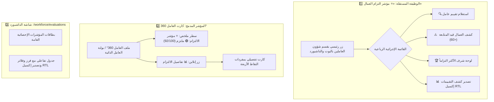

# 📋 خطة عمل رقم 50: منظومة «⭐ مؤشر التزام العمال» والميثاق المعماري الموحد لبناء الوظائف وتكامل البوت والداشبورد
## Worker Commitment Index, Universal Flow Architecture & AI Agent Governance Protocol

> **مرجع الخطة الدائم في المشروع:** `docs/work-plans/50-plan-worker-commitment-and-evaluation-system.md`  
> **كود الميزة المستحدثة في سجل الترحيل الماستر:** `NEW-80`  
> **مسار التدفق المستقل الجديد:** `modules/workforce/src/flows/01.9-worker-commitment-index`  
> **مسار شاشة الداشبورد المستقلة:** `apps/admin-dashboard/src/app/admin/workforce/evaluations`  
> **تاريخ التحرير:** 16-09-2026  
> **تاريخ الإنجاز:** 17-09-2026  
> **الحالة:** 🟢 مكتمل وموثق 100% ومجتاز للاختبارات بالكامل (Ready for Cryptographic Lock)

---

## 🏛️ أولاً: الميثاق المعماري الموحد للمتطلبات العامة لكل وظيفة وتدفق (Universal Flow Standards)

تلتزم أي وظيفة أو تدفق يتم بناؤه في المنظومة (بما فيها وظيفة تقييمات العاملين الحالية وكافة الوظائف المستقبلية) بالحزمة المعيارية الخماسية الصارمة:

1. **السيادة التامة للعقود المعمارية (`Sovereign Flow Contract`):**
   - كل تدفق يجب أن يحتوي على ملف تعريف العقد `flow.contract.json` مستوفياً لمعايير الوثيقة 21.
   - تصدير وتنفيذ واجهة `FlowPlugin` القياسية المستوردة حصراً من `@alsaada/core-components`.
2. **سقف الأسطر والتايب سكريبت الصارم (`Line Cap & Zero Any`):**
   - سقف الشريحة البرمجية الواحدة لا يتجاوز **350 سطراً** كحد أقصى (فصل الخدمات والواجهات والأنواع).
   - منع استخدام نوع `any` أو `ts-ignore` منعاً باتاً؛ الالتزام بـ TypeScript 5.9+ الصارم بنسبة 100%.
3. **معيار تجربة المستخدم الموحدة على تليجرام (`Telegram UX/UI Standard`):**
   - **شريط مسار التنقل التفاعلي (`formatBreadcrumbs`):** إظهار المسار في أعلى كل رسالة (مثال: `👤 العاملين ❭ ⭐ مؤشر الالتزام ❭ 🔍 استعلام`).
   - **المكونات الموحدة:** استخدام `WorkerPicker`, `AmountPicker`, `DatePicker`, `QuantityPicker` من النواة حصراً.
   - **بطاقة المراجعة والتأكيد:** توليد البطاقة عبر `formatConfirmationCard` ولوحة الأزرار عبر `buildConfirmationKeyboard`.
   - **لوحة أزرار ما بعد الإنجاز (Section 5.2):** استخدام `buildCompletionKeyboard` بالترتيب الرباعي الإلزامي:
     1. 📤 مشاركة عبر واتساب (`buildWhatsAppLink`).
     2. 🔄 تكرار العملية (إجراء استعلام جديد).
     3. 📁 الرجوع لقسم شؤون العاملين.
     4. 🏠 القائمة الرئيسية.
4. **التطوير الموجه بالاختبارات الشاملة (`TDD & Zero-Regression`):**
   - بناء ملف اختبارات محاكاة `.spec.ts` لكل تدفق يحاكي الجلسة والـ Callbacks والحالات الحدية (Edge Cases).
   - ضمان نسبة نجاح 100% وخروج الاختبارات بـ `Exit 0`.
5. **التتبع الجنائي وطابور المزامنة الخلفية (`Forensic Audit & Outbox Engine`):**
   - تسجيل أي عملية إدارية أو تغيير في سجل التدقيق الجنائي مشفوعاً بهاش عدم التلاعب.
   - إرسال عمليات المزامنة والتنبيهات عبر طابور `TransactionalOutboxQueue` لضمان استمرارية العمل دون تعليق واجهة المستخدم.

---

## 🤖 ثانياً: ميثاق التزامات أدوات ووكلاء الذكاء الاصطناعي أثناء التنفيذ (AI Agent Commitments)

يخضع كل وكيل ذكاء اصطناعي (AI Agent) ومطور للالتزامات الستة الإلزامية التالية دون أي استثناء:

1. **حظر التنفيذ والتعديل دون خطة عمل مسبقة (`Mandatory Work Plan Protocol`):**
   - لا يُكتب أي سطر كود أو يُعدل أي ملف دون إعداد ومناقشة واعتماد خطة عمل موثقة ومودعة مسبقاً في `docs/work-plans/`.
2. **بروتوكول القفل والفك بالصيغ الحرفية الصارمة (`Verbatim Lock & Unlock Protocol`):**
   - **إلزامية الاستفسار عن القفل:** فور إنجاز الوظيفة واختبارها، لا تُقفل تلقائياً؛ يجب سؤال المستخدم وانتظار الصيغة الحرفية الحصرية: **«نعم اقفل»**.
   - **طلب فك القفل للتعديل:** يُحظر تعديل أي وظيفة مقفلة ومحمية مسبقاً في `governance.lock.json` دون طلب رسمي وانتظار موافقة المستخدم بالصيغة الحرفية الحصرية: **«موافق على الفتح»** (أو **«نعم موافق على التعديل»**).
   - رفض أي صيغ مبهمة (مثل "تمام", "نفذ", "اوك") والتذكير الفوري بالصيغة المعتمدة.
3. **حظر تكرار الأكواد وإلزامية استدعاء النواة المشتركة (`Zero Duplication & Mandatory Shared Kernel`):**
   - يُحظر تماماً كتابة منطق مكرر متوفر في `packages/*`؛ أي كود مكرر يُرفض كعيب جسيم (`Anti-Pattern FAIL`).
4. **مطابقة السلوك الوظيفي للمرجع القديم وحظر الاجتهاد المنفرد (`Baseline Parity & Zero Unauthorized Divergence`):**
   - مراجعة سيناريوهات المشروع القديم `F:\HR` ووثائق `docs/` المعمارية قبل الشروع في البرمجة.
   - يُحظر حذف أو تغيير خطوات المعالج أو السلوك الوظيفي دون طلب صريح ومباشر من المستخدم.
5. **معمارية الفحص ذات المستويين ونظافة المستودع (`Two-Tier Verification & Zero Root Clutter`):**
   - استخدام `pnpm flow:check <flow-path>` أثناء التطوير السريع (< 2s).
   - تشغيل `pnpm governance:verify` عند الإغلاق لفحص سلامة البوابات الـ 12.
   - يُحظر تماماً رمي أي ملفات سكراتش أو تجارب في جذر المشروع؛ مسارها حصراً في مجلد الـ scratch المخصص خارج الكود.
6. **التوثيق المتزامن اللحظي في سجل الترحيل (`Synchronous Documentation & Zero Drift`):**
   - تحديث سجل الترحيل `docs/19-legacy-to-enterprise-master-feature-migration-registry.md` فوراً بتسجيل حالة الوظيفة `🟢 مكتمل وموثق 100%` ورقم الـ Commit ومسارها البرمجي.

---

## 🖥️ ثالثاً: معيار السطح المزدوج وهيكلية الدمج المزدوج (Dual-Surface & Dual-Integration Architecture)

تم اعتماد استراتيجية **الدمج المزدوج الكامل (Dual-Integration)** بين الوظيفة المستقلة والمؤشر المدمج:

---

## 🎯 رابعاً: المواصفات التفصيلية لوظيفة «⭐ مؤشر التزام العمال» (NEW-80)

### 1. طبيعة النظام والاحتساب
- **نظام آلي موضوعي 100% (Automated Metric Engine):** يُحسب المؤشر رقمياً بالكامل من واقع السجلات التشغيلية المسجلة بقاعدة البيانات لمنع أي وساطة أو تحيز.

### 2. المحاور الوزنية للأداء (من 100 نقطة)
| المحور | الوزن | مصدر البيانات في المنظومة | معيار الخصم والإضافة |
| :--- | :---: | :--- | :--- |
| **انضباط الإجازات والورديات** | **40 نقطة** | سجل الإجازات `Leave` وجداول الورديات | خصم 8 نقاط عن كل يوم تأخير أو انقطاع غير معتمد (الحد الأقصى للخصم 40). |
| **السجل التأديبي النظيف** | **30 نقطة** | جدول `DisciplinaryAndBonus` | خصم 10 نقاط لكل قرار جزاء/خصم، وإضافة 5 نقاط لكل مكافأة تميز (سقف 30). |
| **المحافظة على مهمات PPE** | **15 نقطة** | سجل مهمات الوقاية `PPEAsset` | خصم 7.5 نقطة لكل مهمة وقاية مسجلة كتالفة أو مفقودة بإهمال. |
| **الانضباط المالي والسلف** | **15 نقطة** | سجل السلف `AdvanceRequest` ومطابقة اليوميات | فحص تغطية السلف بأيام العمل المنفذة وتجنب تجاوز الحدود الائتمانية. |

### 3. الدورية الزمنية لاحتساب المؤشر
- **مؤشر لحظي ديناميكي (Live Real-Time Score):** يُعرض في سجل العامل 360° وبوابته الذاتية استناداً إلى نافذة متدحرجة لآخر 90 يوماً تشغيلية.
- **لقطة أرشيفية شهرية (Monthly Audit Snapshot):** تُغلق وتُسجل رسمياً نهاية كل شهر ميلادي بالتوازي مع مسير الرواتب لأرشفة تاريخ أداء العامل.

### 4. مستويات التصنيف والأثر الإداري
- 🟢 **ملتزم (Committed):** (80 - 100 نقطة).
- 🟡 **متوسط الالتزام (Moderate):** (60 - 79 نقطة).
- 🔴 **غير ملتزم / قيد المتابعة (Under Review):** (أقل من 60 نقطة).
- ⚪ **حديث تعيين / قيد التجربة (Probation):** للعمال في أول 30 يوماً أو أول دورة تشغيلية.
- **الأثر:** مؤشر إداري ورقابي رسمي في سجل 360° ولتقارير الكفاءة والزيادات الدورية السنوية دون خصم أو بونص مالي فوري تلقائي من الراتب.

### 5. الشفافية وواجهات العرض
- **للمشرفين والإدارة:**
  - زر رئيسي في قسم شؤون العاملين: `⭐ مؤشر التزام العمال` يفتح القائمة الرباعية.
  - سطر ملخص + زر تفاصيل في كارت العامل 360°.
  - شاشة تحليلية بالداشبورد (`/workforce/evaluations`) + إشعار شهري لتوبيك الإدارة.
- **للعامل:** سطر ملخص وزر تفاصيل في بوابته الذاتية مع نصائح توعوية للمحافظة على التقييم الملتزم.
- **تسوية الأعذار:** إعادة احتساب لحظية فورية للمؤشر بمجرد اعتماد المشرف أو الإدارة لتبرير التأخير أو الغياب كـ "عذر مقبول / Justified".

---

## 🏗️ خامساً: خطة التنفيذ الموديولي (Implementation Steps)

### المرحلة 1: طبقة قاعدة البيانات (`packages/database`)
- [x] إضافة نموذج `WorkerCommitmentScore` في `prisma/schema.prisma`.
- [x] تطبيق الترحيل البرمجي وإعادة بناء العميل `pnpm db:generate`.

### المرحلة 2: محرك النواة المشترك (`packages/core-components`)
- [x] بناء محرك احتساب الالتزام `WorkerCommitmentEngine` مع كافة المحاور وقواعد الخصم والأعذار.
- [x] بناء منسق كروت التليجرام `formatCommitmentCard` بالأشرطة الرسومية.
- [x] كتابة اختبارات الوحدة الشاملة للمحرك `WorkerCommitmentEngine.spec.ts`.

### المرحلة 3: سطح بوت التيليجرام (`modules/workforce`)
- [x] تأسيس التدفق المستقل `01.9-worker-commitment-index` بالقائمة الرباعية وعقد `flow.contract.json`.
- [x] دمج السطر الملخص وزر تفاصيل التقييم في سجل العامل 360° للمشرفين (`01.5-worker-directory`).
- [x] دمج السطر الملخص وزر التفاصيل في بوابة العامل الذاتية (`01.7-guest-join-and-linking` و `worker-portal.handler.ts`).
- [x] تحديث اختبارات التليجرام للموديول واجتيازها بنسبة 100%.

### المرحلة 4: سطح لوحة تحكم الداشبورد (`apps/admin-dashboard`)
- [x] إنشاء صفحة تقييمات والتزام العاملين (`/admin/workforce/evaluations`).
- [x] ربط بطاقات KPI الإحصائية، وجدول البيانات المتقدم بالفلاتر والفرز.
- [x] تفعيل زر تصدير كشف التقييمات إكسيل RTL منسق ومُعرب عبر ExcelJS.

### المرحلة 5: التوثيق والحوكمة والإغلاق
- [x] تحديث الخطة الرسمية في `docs/work-plans/50-plan-worker-commitment-and-evaluation-system.md`.
- [x] تحديث سجل الترحيل الشامل `docs/19` بتسجيل الوظيفة المستحدثة `NEW-82` (المشار إليها في الخطة بـ NEW-80).
- [x] تشغيل فواحص التايب سكريبت والاختبارات الشاملة بنسبة نجاح 100%.
- [x] تقديم تقرير الإنجاز والاستفسار عن القفل التشفيري بالصيغة المعتمدة حصراً («نعم اقفل»).
