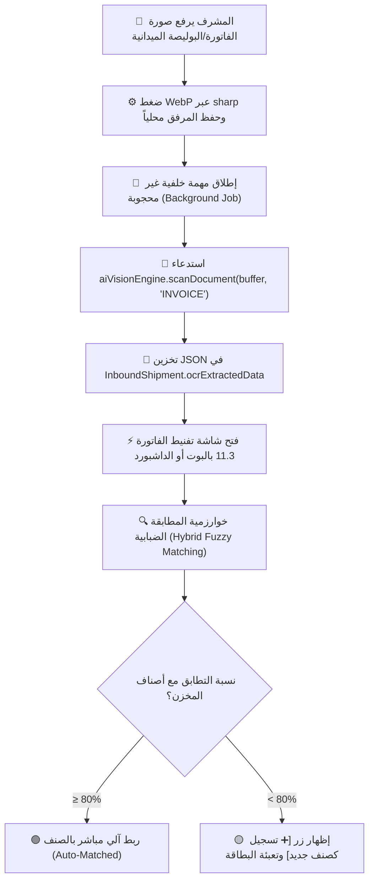
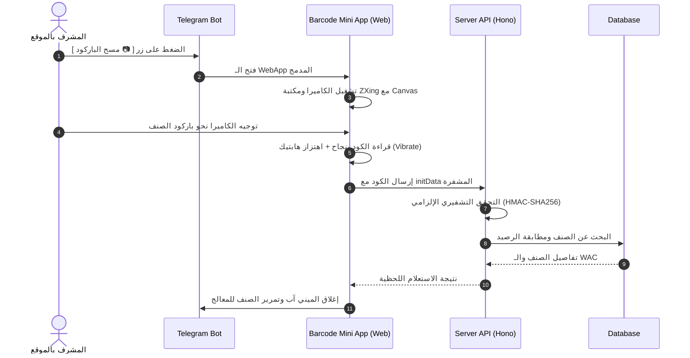
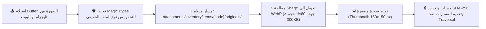
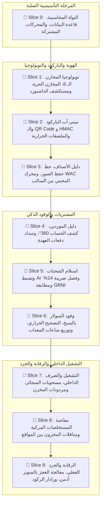

# 📋 خطة عمل رقم 61 (النسخة الذهبية المحدثة v2.0 - المرجع المعماري والمحاسبي الشامل)
## المنظومة المؤسسية للمخازن المتخصصة والديناميكية، إدارة الموردين، تفنيط الفواتير بالذكاء الاصطناعي (AI Vision)، ميني آب الباركود، والدائرة المحاسبية المغلقة ودفتر الأستاذ العام الموحد
### Enterprise Multi-Warehouse Topology, Dynamic Warehouse Engine, AI Vision Invoice Parser, Telegram Barcode Mini App, Procurement Taxonomy, Forensic Closed-Loop Accounting & Unified General Ledger Core (Full Unabbreviated Master SSOT v2.0)

> [!IMPORTANT]
> **بطاقة ميثاق واعتماد وثيقة العمل (Master Blueprint Governance Card)**
> * **مرجع الخطة الدائم:** [`docs/work-plans/61-plan-specialized-multi-warehouse-procurement-and-closed-loop-financial-architecture.md`](docs/work-plans/61-plan-specialized-multi-warehouse-procurement-and-closed-loop-financial-architecture.md)
> * **تاريخ التحرير والتوافق الاستشاري:** 18-09-2026
> * **الحالة الدستورية:** 🟢 **مسودة معتمدة ونهائية بنسبة 100% للتنفيذ (Sealed Master Execution Blueprint v2.0)**
> * **الميثاق المرجعي:** بنود 1.1، 1.2، 1.4، 1.5، 1.6، و 2.5 من [`AGENTS.md`](AGENTS.md) و [`GEMINI.md`](GEMINI.md)، مخرجات جلسات التدقيق المحاسبي المالي الجنائي (Forensic CPA Audit)، النقد البرمجي والهندسي الصارم، تفنيط الفواتير بالـ AI Vision (`packages/ai-vision-engine`)، ميثاق الدائرة المالية المغلقة ([`docs/13`](docs/13-closed-loop-financial-and-pnl-engine.md))، ميثاق السجل الجنائي المشفر ([`docs/16`](docs/16-database-security-and-tamper-proof-ledger.md))، وحوكمة أقفال وتريجرات الحماية الجنائية لدفتر الأستاذ في [`PLAN-68`](docs/work-plans/68-plan-comprehensive-core-security-and-runtime-operational-remediation.md).

---

## 🎯 1. منهجية التنفيذ والتسليم المعتمدة (Dual-Track Vertical Slice Methodology)

بناءً على جلسات العصف الذهني والتدقيق المحاسبي الجنائي (`/grill-me & Forensic Audit`) وميثاق الحوكمة المؤسسية، تم اعتماد **منهجية التوازي الموديولي المتزامن (Dual-Track Vertical Slice)**:

* **التوازي الصارم بين البوت والداشبورد:** يتم بناء كل موديول وشريحة وظيفية في نفس السبرنت على مسارين متزامنين:
  1. **تدفقات تليجرام بوت الميدانية (`modules/*` في `apps/bot-server`):** مصممة لتجربة مستخدم سريعة وسهلة عبر الأزرار التفاعلية للمهندسين والمشرفين ومسؤولي المخازن في المواقع والمشاريع الصحراوية مع دعم العمل بأضعف شبكات الاتصال.
  2. **شاشات لوحة تحكم الويب (`apps/admin-dashboard/src/app/admin/...`):** مبنية بـ Next.js 15 و React 19 مع Tailwind CSS وجداول تفاعلية متقدمة ومخططات بيانية لكشوف الحسابات 360°، مرصد الأسعار، مطابقة الجرد، وإدارة الموردين والمخازن للإدارة العليا والمحاسبين.
* **مبدأ الحصانة ومنع الديون التقنية (Zero Technical Debt):** لا يُعتبر أي موديول مكتملاً ما لم تنتهِ كافة تدفقاته في البوت وكافة شاشاته في الداشبورد معاً وتجتاز اختبارات الحوكمة الشاملة `pnpm governance:verify`.

### 🚦 1.1 ميثاق التنفيذ المتتابع الصارم وبوابة التحقق الثلاثية (Strict Sequential Delivery & Triple Verification Gate)

> [!IMPORTANT]
> **القاعدة الحتمية للتنفيذ المتتابع (توجيه المستخدم الصريح):**  
> *«تكون الخطة مقسمة إلى أجزاء صغيرة تنفذ على التتابع، ولا يتم الانتقال إلى أي نقطة تالية قبل الانتهاء التام من الجزء الحالي واختباره بالكود ويدوياً».*

يُحظر تماماً القفز بين الشرائح أو بدء كتابة كود شريحة تالية قبل استيفاء **بوابة الفحص الثلاثية الصارمة (Strict Triple Gate)** لكل شريحة:

| البوابة | المسمى والنوع | آلية التحقق والاشتراطات الإلزامية | معيار الاجتياز |
| :---: | :--- | :--- | :---: |
| **البوابة 1** | 🤖 **الفحص الآلي الكامل (Automated Gate)** | تشغيل تجميع التايب سكريبت الصارم `pnpm typecheck`، واختبارات الوحدة والتكامل للتدفقات والشاشات. | خلو تام من `any` ونجاح 100% |
| **البوابة 2** | 🧪 **سيناريو الاختبار اليدوي (Manual Scenario)** | تقديم دليل عملي دقيق يتضمن: المدخلات المحددة بالبوت، الشاشة المقابلة بالداشبورد برابطها والصفوف المتوقعة، والتأكد من توازن القيد المتولد رياضياً (Σ Debit = Σ Credit). | تطابق حسابي ورقابي بالمليم |
| **البوابة 3** | ✍️ **الاعتماد الصريح (Explicit Approval)** | انتظار موافقة المستخدم الصريحة على نتائج الاختبار اليدوي والآلي، مع حظر فتح أو لمس أي ملف يخص الشريحة التالية قبل هذا الاعتماد. | اعتماد صريح لا يقبل التأويل |

---

## 🏛️ 2. الدليل المحاسبي الشجري ودائرة القيد المالي المغلق (Chart of Accounts & Closed-Loop Forensic Ledger)

تمت هندسة الدورة المستندية والمحاسبية لضمان سلامة ميزان المراجعة، ومنع ازدواجية تسجيل المصروفات أو تشويه تكلفة المشاريع والمعدات، مع تقديم الإثبات الرياضي والمحاسبي القاطع:

### 2.1 شجرة الحسابات المعيارية للمخازن والعمليات التشغيلية (Chart of Accounts Master SSOT)
يؤسس النظام جدول شجرة الحسابات (`ChartOfAccount`) كنموذج شجري متسلسل يحوي الحسابات السيادية التالية:

| كود الحساب | اسم الحساب المحاسبي المعتمد | التصنيف الرئيسي | طبيعة الحساب | الغرض التشغيلي والدفتري |
| :---: | :--- | :---: | :---: | :--- |
| **`110101`** | البنك المركزي للشركة / الخزائن الرئيسية | 🟢 أصول متداولة | `مدين` | حسابات البنوك وسداد دفعات الموردين المركزية |
| **`110201`** | العهد النقدية الميدانية للمشرفين | 🟢 أصول متداولة | `مدين` | العهد النقدية المفتوحة بالمواقع والصرف منها |
| **`120301`** | سلف نقدية عاملين وذمم فردية | 🟢 أصول متداولة | `مدين` | سلف نقدية مستردة أو تحميل عجز مخزني على المشرف |
| **`120305`** | سلف ومسحوبات عمال عينية (سجائر/سلع) | 🟢 أصول متداولة | `مدين` | مسحوبات الكانتين الفردية بالتكلفة الصافية |
| **`120401`** | مخزن قطع الغيار والفلاتر | 🟢 أصول متداولة | `مدين` | أصل مخزون الفلاتر ومستلزمات الصيانة الميكانيكية |
| **`120402`** | مخزن الزيوت والشحوم | 🟢 أصول متداولة | `مدين` | أصل مخزون الزيوت الهيدروليكية والمحركات والفتيس |
| **`120403`** | مخزن السولار والوقود الميداني | 🟢 أصول متداولة | `مدين` | أصل مخزون السولار في المحطات والتنكات والفناطيس |
| **`120404`** | مخزن الكانتين والإعاشة | 🟢 أصول متداولة | `مدين` | أصل مخزون الأغذية ومستلزمات المطبخ والسجائر |
| **`120405`** | مخزن مهمات الوقاية والعدد والأدوات (PPE) | 🟢 أصول متداولة | `مدين` | أصل مخزون الخوذ وأحذية الأمان والعدد اليدوية |
| **`120499`** | مخزون بضاعة بالطريق بين المواقع | 🟢 أصول متداولة | `مدين` | وسيط المناقلات المخزنية لحين استلام الفرع المستقبل |
| **`120801`** | مصلحة الضرائب - ضريبة ق.م مدخلات | 🟢 أصول متداولة | `مدين` | ضريبة 14% القابلة للخصم والتسوية من المشتريات |
| **`210101`** | حسابات الموردين التجاريين | 🔴 التزامات متداولة | `دائن` | التزامات فواتير المشتريات المستحقة للموردين |
| **`210199`** | وسيط بضائع مستلمة غير مفوترة (GRNI) | 🔴 التزامات متداولة | `دائن` | استلام شحنات بوالص الشحن لحين وصول الفاتورة |
| **`210201`** | جاري مقاولي الباطن (استحقاق معلق) | 🔴 التزامات متداولة | `دائن` | صافي استحقاق مستخلصات المقاولين قبل الصرف |
| **`210301`** | تأمينات محتجزة لضمان الأعمال | 🔴 التزامات متداولة | `دائن` | نسبة ضمان 5% إلى 10% من مستخلصات المقاولين |
| **`210401`** | مصلحة التأمينات الاجتماعية - مقاولات | 🔴 التزامات متداولة | `دائن` | نسبة التأمينات الإلزامية لمقاولات التشييد (2.16%) |
| **`210501`** | مصلحة الضرائب - ضريبة الخصم والإضافة | 🔴 التزامات متداولة | `دائن` | ضريبة الخصم من المنبع 1% من أساس الفواتير |
| **`510101`** | أجور ومرتبات عمال التشغيل بالمشروع | 🟠 مصروفات تشغيل | `مدين` | المصروف الحقيقي الوحيد للرواتب بمسير الأجور |
| **`510201`** | تكلفة مقاولي باطن معتمدة | 🟠 مصروفات تشغيل | `مدين` | إجمالي قيمة أعمال المستخلصات المعتمدة |
| **`510301`** | إعاشة ومطبخ وبوفيه الموقع | 🟠 مصروفات تشغيل | `مدين` | تكلفة وجبات العمال والمهندسين (إطعام جماعي) |
| **`510401`** | وقود وسولار تشغيل الأسطول والمعدات | 🟠 مصروفات تشغيل | `مدين` | استهلاك السولار الموزع بساعات تشغيل المعدات |
| **`510402`** | زيوت وفلاتر وصيانة دورية للمعدات | 🟠 مصروفات تشغيل | `مدين` | تكلفة سيرفيس المعدات المحملة على كروت التشغيل |
| **`510901`** | هالك وفاقد تشغيلي مسموح به بالمخزون | 🟠 مصروفات تشغيل | `مدين` | استيعاب عجز الجرد الطبيعي المسموح به (≤ 1%) |
| **`510905`** | فروق أسعار مشتريات وتوريدات مخزنية | 🟠 مصروفات تشغيل | `مدين/دائن` | معالجة فروق أسعار فواتير الـ GRNI عن القياسي (PPV) |
| **`520401`** | عمولات ومصروفات بنكية ومحافظ | 🔵 مصروفات عمومية | `مدين` | رسوم سحب وتحويل فودافون كاش وإنستاباي |
| **`520901`** | خسائر عجز وتسريب وقود ومخزون غير عادي | 🟣 خسائر غير عادية | `مدين` | عجز الجرد الجسيم والتسريب الناتج عن إهمال/سرقة |

---

### 2.2 المعالجة الضريبية للمشتريات وفصل ضريبة القيمة المضافة المدخلة (VAT 14% Input)

> [!IMPORTANT]
> **المبدأ الضريبي والمحاسبي الصارم (قانون رقم 67 لسنة 2016 وتعديلاته):**
> * **استبعاد الضريبة من التكلفة:** لا تُضاف ضريبة القيمة المضافة القابلة للخصم (14%) إلى وعاء تكلفة المخزون ولا تدخل نهائياً في احتساب متوسط التكلفة المرجح (WAC).
> * **سعر الدخول الصافي:** يدخل المخزون دائماً بـ **السعر الصافي الخالي من الضريبة (Net Cost)**.
> * **قيد الذمة الضريبية:** تُقيد ضريبة الـ 14% كأصل متداول مدين (`120801 ضريبة قيمة مضافة مدخلات`) لتسويتها وخصمها من ضريبة المبيعات عند تقديم الإقرار الضريبي الشهري.

---

### 2.3 القيود المحاسبية المركبة الكاملة للعمليات الـ 10 المعيارية (Compound Journal Entries)

#### 1. استلام شحنة واردة غير مفوترة (GRNI Inbound) بسعر التعاقد الصافي

| الطرف / القيد | كود الحساب | اسم الحساب المحاسبي | البيان والأساس المحاسبي |
| :---: | :---: | :--- | :--- |
| 🟢 **مدين (Debit)** | `1204xx` | **حساب المخزن المعني** | الكمية الفعلية المستلمة × سعر التعاقد الصافي |
| 🔴 **دائن (Credit)** | `210199` | **وسيط بضائع مستلمة غير مفوترة (GRNI)** | القيمة التقديرية الصافية المؤقتة للبضاعة المستلمة |

> [!NOTE]
> **الأثر المالي وحساب التكلفة (Financial & WAC Impact):**
> * **التكلفة المرجحة (WAC):** تُحتسب فورياً على الأساس الصافي الخالي من الضريبة.
> * **قائمة الدخل (P&L):** أثر صفري (`0.00 EGP`) — حركة مخزنية وسيطة متزنة.

---

#### 2. وصول الفاتورة الضريبية الرسمية وفصل الضريبة والمطابقة الثلاثية (3-Way Match & PPV)

| الطرف / القيد | كود الحساب | اسم الحساب المحاسبي | البيان والأساس المحاسبي |
| :---: | :---: | :--- | :--- |
| 🟢 **مدين (Debit)** | `210199` | **وسيط بضائع مستلمة غير مفوترة (GRNI)** | إقفال كامل القيمة المقيدة سابقاً بالاستلام |
| 🟢 **مدين (Debit)** | `120801` | **مصلحة الضرائب - ضريبة ق.م مدخلات** | ضريبة 14% من القيمة الصافية (تُسترد بالإقرار الضريبي) |
| 🟢/🔴 **مدين/دائن** | `510905` | **فروق أسعار مشتريات مخزنية (PPV)** | فرق سعر الفاتورة الفعلي عن سعر تعاقد البوليصة |
| 🔴 **دائن (Credit)** | `210501` | **مصلحة الضرائب - ضريبة خصم وإضافة** | خصم 1% من الأساس الصافي لحساب الضرائب من المنبع |
| 🔴 **دائن (Credit)** | `210101` | **حساب المورد التجاري** | صافي المبلغ الإجمالي النهائي المستحق للمورد |

> [!TIP]
> **المزايا الرقابية للمطابقة الثلاثية:**
> إثبات استحقاق المورد بدقة، احتجاز ضريبة المنبع (1%) قانونياً، استرداد ضريبة القيمة المضافة (14%)، وحماية كروت تشغيل المعدات والتكلفة التاريخية من التقلب.

---

#### 3. مردودات مشتريات إلى المورد (Purchase Returns / Debit Note)

| الطرف / القيد | كود الحساب | اسم الحساب المحاسبي | البيان والأساس المحاسبي |
| :---: | :---: | :--- | :--- |
| 🟢 **مدين (Debit)** | `210101` | **حساب المورد التجاري** | تخفيض مديونية المورد بقيمة إشعار الخصم |
| 🔴 **دائن (Credit)** | `1204xx` | **حساب المخزن المعني** | الكمية المرتجعة × سعر الشراء الأصلي الصافي |
| 🔴 **دائن (Credit)** | `120801` | **مصلحة الضرائب - ضريبة ق.م مدخلات** | تسوية وتخفيض ضريبة القيمة المضافة للمدخلات المستردة |

> [!NOTE]
> **الأثر المالي والضريبي للمردودات (Tax & WAC Reversal):**
> * **المخزن:** تخفيض رصيد وتكلفة المخزون بسعر الشراء الأصلي الصافي.
> * **الضريبة:** تسوية وتخفيض حساب ضريبة القيمة المضافة للمدخلات (`120801`) لتطابق الإقرار الضريبي.
> * **مديونية المورد:** تخفيض التزام المورد في كشف الحساب 360° بموجب إشعار الخصم (Debit Note).

---

#### 4. صرف وجبات مطبخ الموقع اليومية (إعاشة جماعية للمشروع)

| الطرف / القيد | كود الحساب | اسم الحساب المحاسبي | البيان والأساس المحاسبي |
| :---: | :---: | :--- | :--- |
| 🟢 **مدين (Debit)** | `510301` | **مصروف إعاشة ومطبخ الموقع** | إثبات مصروف الإعاشة الجماعية في قائمة الدخل (P&L Expense) |
| 🔴 **دائن (Credit)** | `120404` | **مخزن الكانتين والإعاشة** | تخفيض رصيد المخزن بالتكلفة المرجحة الصافية (WAC) |

> [!NOTE]
> **الأثر المحاسبي للإعاشة الميدانية:**
> تحميل تكلفة الوجبات الجماعية مباشرة كمصروف تشغيلي لمشروع الموقع في قائمة الدخل (`510301`) بالتكلفة المرجحة الصافية (`WAC`) مع إثبات مركز التكلفة الخاص بالمشروع.

---

#### 5. صرف سجائر وسلع شخصية للعامل (مسحوبات عينية بالتكلفة الصافية)

| الطرف / القيد | كود الحساب | اسم الحساب المحاسبي | البيان والأساس المحاسبي |
| :---: | :---: | :--- | :--- |
| 🟢 **مدين (Debit)** | `120305` | **سلف ومسحوبات عمال عينية** | تحميل ذمة العامل الفردية كأصل متداول مسترد بالراتب |
| 🔴 **دائن (Credit)** | `120404` | **مخزن الكانتين والإعاشة** | تخفيض رصيد الكانتين بالتكلفة المرجحة الصافية (WAC) |

> [!IMPORTANT]
> **المطابقة المالية التامة:**
> الصرف يتم بسعر التكلفة الصافي، هامش ربح صفر (`0.00%`)، خروج نقدية = `0.00`، والأثر على الأرباح والخسائر = `0.00 EGP`.

---

#### 6. إرجاع فائض مواد من الموقع للمخزن (Store Return Inward)

| الطرف / القيد | كود الحساب | اسم الحساب المحاسبي | البيان والأساس المحاسبي |
| :---: | :---: | :--- | :--- |
| 🟢 **مدين (Debit)** | `120402` | **مخزن الزيوت أو الفلاتر المعني** | استعادة الرصيد بالتكلفة التي صُرفت بها في إذن الصرف الأصلي |
| 🔴 **دائن (Credit)** | `510402` | **زيوت وفلاتر وصيانة دورية للمعدات** | تخفيض مصروف وتكلفة كارت تشغيل المعدة المعنية فورياً |

> [!TIP]
> **إلغاء التكلفة عن المعدة المستفيدة:**
> يُعيد النظام تقييد المواد المرتجعة إلى المخزن بسعر الصرف الأصلي الدقيق، ويخفض تكلفة التشغيل والصيانة فورياً من كارت تشغيل المعدة المعنية دون أي تشويه للتكاليف.

---

#### 7. مناقلة مخزون بين موقعين ومشروعين (Inter-Site Stock Transfer)

* **المرحلة 1: خروج الشحنة من الموقع المصدر (Dispatch):**

| الطرف / القيد | كود الحساب | اسم الحساب المحاسبي | البيان والأساس المحاسبي |
| :---: | :---: | :--- | :--- |
| 🟢 **مدين (Debit)** | `120499` | **مخزون بضاعة بالطريق بين المواقع** | وسيط المناقلات (موقع المصدر → موقع الوجهة) |
| 🔴 **دائن (Credit)** | `1204xx` | **مخزن الموقع المصدر** | خروج الكميات بالتكلفة المرجحة الصافية (WAC) |

* **المرحلة 2: تأكيد الاستلام الفعلي بالموقع الوجهة (Receive):**

| الطرف / القيد | كود الحساب | اسم الحساب المحاسبي | البيان والأساس المحاسبي |
| :---: | :---: | :--- | :--- |
| 🟢 **مدين (Debit)** | `1204xx` | **مخزن الموقع الوجهة** | إضافة الكمية المستلمة وتحديث الـ WAC بموقع الوجهة |
| 🔴 **دائن (Credit)** | `120499` | **مخزون بضاعة بالطريق بين المواقع** | إقفال تام للرصيد الوسيط المعلق |

> [!NOTE]
> **رقابة بضاعة بالطريق (Zero Inventory Float):**
> استخدام حساب وسيط `120499` يضمن عدم ضياع أي كميات أثناء النقل بين المواقع، ولا يُقفل الحساب الوسيط إلا بتأكيد الاستلام الفعلي والفحص الفني بالموقع المستلم.

---

#### 8. قيد مقاصة مستخلص مقاول باطن مع فصل الاستحقاق عن السداد النقدي

* **المرحلة 1: قيد الاستحقاق والمقاصة المركبة (Accrual & Clearing):**

| الطرف / القيد | كود الحساب | اسم الحساب المحاسبي | البيان والأساس المحاسبي |
| :---: | :---: | :--- | :--- |
| 🟢 **مدين (Debit)** | `510201` | **تكلفة مقاولي باطن معتمدة** | إجمالي المستخلص المعتمد من الاستشاري الهندسي |
| 🔴 **دائن (Credit)** | `120403` | **مخزن السولار والوقود** | قيمة وقود الشركة المسحوب لمعدات المقاول بالتكلفة |
| 🔴 **دائن (Credit)** | `120404` | **مخزن الكانتين والإعاشة** | قيمة وجبات ومسكن عمال المقاول بالتكلفة الصافية |
| 🔴 **دائن (Credit)** | `210301` | **تأمينات محتجزة لضمان الأعمال** | نسبة ضمان 5% تحتجز حتى نهاية فترة الضمان |
| 🔴 **دائن (Credit)** | `210401` | **مصلحة التأمينات الاجتماعية** | حصة تأمينات المقاولات الإلزامية (2.16%) |
| 🔴 **دائن (Credit)** | `210501` | **مصلحة الضرائب - خصم وإضافة** | ضريبة الخصم والتحصيل من المنبع (1%) |
| 🔴 **دائن (Credit)** | `210201` | **جاري مقاولي الباطن** | صافي المستخلص المستحق للمقاول كالتزام دائن |

* **المرحلة 2: صرف مستحقات المقاول نقداً أو بشيك أو تحويل (Cash Payout):**

| الطرف / القيد | كود الحساب | اسم الحساب المحاسبي | البيان والأساس المحاسبي |
| :---: | :---: | :--- | :--- |
| 🟢 **مدين (Debit)** | `210201` | **جاري مقاولي الباطن** | إقفال الالتزام كلياً أو جزئياً بقيمة الدفعة المنصرفة |
| 🔴 **دائن (Credit)** | `110101` / `110201` | **البنك المركزي / الخزينة / العهدة** | خروج النقدية الفعلي المسدد للمقاول |

> [!IMPORTANT]
> **فصل الاستحقاق الهندسي عن السداد النقدي:**
> يتم إثبات كامل الأعمال المعتمدة كمصروف تشغيلي للمشروع (`510201`)، مع مقاصة المسحوبات العينية (سولار، إعاشة) واحتجاز الضمان والضرائب والتأمينات، وقيد الصافي كالتزام دائن (`210201`) لا يُصرف نقداً إلا بإذن صرف منفصل بعد تدقيق السيولة.

---

#### 9. سداد دفعات الموردين من العهدة الميدانية المشروطة بالإيصال والرقم القومي

| الطرف / القيد | كود الحساب | اسم الحساب المحاسبي | البيان والأساس المحاسبي |
| :---: | :---: | :--- | :--- |
| 🟢 **مدين (Debit)** | `210101` | **حسابات الموردين التجاريين** | تخفيض رصيد المورد الدائن بقيمة الدفعة المسددة |
| 🔴 **دائن (Credit)** | `110201` | **العهدة النقدية الميدانية للمشرف** | إثبات خروج النقدية من عهدة المشرف القائم بالصرف |

> [!WARNING]
> **صمام الأمان والتحقق الإلزامي:**
> لا تكتمل هذه العملية في البوت إلا بعد اجتياز فحص كفاية رصيد العهدة اللحظي (`UniversalCustodyGate`)، وإرفاق صورة إيصال استلام النقدية الموقع، والرقم القومي للمستلم.

---

#### 10. تسوية عجز الجرد الفعلي للمخزون (Stock Audit Discrepancies)

* **الحالة (أ): عجز طبيعي مسموح به (≤ 1%):**

| الطرف / القيد | كود الحساب | اسم الحساب المحاسبي | البيان والأساس المحاسبي |
| :---: | :---: | :--- | :--- |
| 🟢 **مدين (Debit)** | `510901` | **هالك وفاقد تشغيلي مسموح به** | مصروف تشغيل محمل على قائمة الدخل (P&L Expense) |
| 🔴 **دائن (Credit)** | `1204xx` | **حساب المخزن المعني** | تخفيض رصيد المخزن بقيمة العجز بالتكلفة (WAC) |

* **الحالة (ب): عجز إهمال محمل على مسؤول المخزن:**

| الطرف / القيد | كود الحساب | اسم الحساب المحاسبي | البيان والأساس المحاسبي |
| :---: | :---: | :--- | :--- |
| 🟢 **مدين (Debit)** | `120301` | **سلف وذمم العاملين** | تحميل ذمة أمين المخزن/المشرف الشخصية كمديونية |
| 🔴 **دائن (Credit)** | `1204xx` | **حساب المخزن المعني** | تسوية العجز المخزني بالتكلفة المرجحة (WAC) |

* **الحالة (ج): عجز جسيم أو سرقة معتمدة من السوبر أدمن مع تحقيق إداري:**

| الطرف / القيد | كود الحساب | اسم الحساب المحاسبي | البيان والأساس المحاسبي |
| :---: | :---: | :--- | :--- |
| 🟢 **مدين (Debit)** | `520901` | **خسائر عجز وتسريب غير عادي** | خسائر غير عادية بالقوائم المالية (Abnormal Loss) |
| 🔴 **دائن (Credit)** | `1204xx` | **حساب المخزن المعني** | إعدام وتخفيض رصيد المخزن بالتكلفة المرجحة (WAC) |

> [!IMPORTANT]
> **الفصل الرقابي بين الهالك الطبيعي والإهمال والخسائر الجسيمة:**
> * **عجز طبيعي (≤ 1%):** يُحمل تلقائياً كمصروف تشغيل للمشروع (`510901`).
> * **عجز إهمال:** يُحمل فورياً كذمة شخصية مستردة بالراتب على مسؤول العهدة والمخزن (`120301`).
> * **عجز جسيم أو سرقة:** يتطلب تحقيقاً إدارياً واعتماداً حصرياً من السوبر أدمن قبل إعدامه كخسائر غير عادية (`520901`).

---

### 2.4 مخزن السولار، قياس السيخ بالشرطة، ومعامل التصحيح الحراري وساعات المعدات

#### 1. معايرة الخزانات وتعدد التنكات (Multi-Tank & Notch Model)
* **السعة الإجمالية باللترات (`V_capacity`):** إجمالي السعة الاستيعابية للتانك المعاير هندسياً.
* **إجمالي عدد الشرطات (`N_total`):** إجمالي تدريج مسطرة القياس الميدانية (السيخ).

> [!NOTE]
> **معادلة القيمة اللترية للشرطة الواحدة (Liters Per Notch):**
> ```text
> LitersPerNotch = V_capacity ÷ N_total
> القيمة اللترية للشرطة = سعة التانك الإجمالية (لتر) ÷ إجمالي عدد شرطات السيخ
> ```

#### 2. معامل التصحيح الحراري للسولار (Thermal Expansion Correction)
* يتيح النظام إدخال درجة الحرارة التقريبية للوردية عند القياس الميداني (`T`).

> [!NOTE]
> **معادلة الحجم المصحح قياسياً عند 20°م (Thermal Expansion Correction):**
> ```text
> V_20 = V_T × [1 - β × (T - 20)]
> ```
> * **المتغيرات والضوابط:**
>   - `V_T`: الحجم المقروء فعلياً عند درجة حرارة القياس `T`.
>   - `T`: درجة حرارة السولار الميدانية وقت القياس بالوردية (°م).
>   - `β`: معامل التمدد الحجمي القياسي للسولار (`0.00085` لكل درجة مئوية).
>   - **الأثر الرقابي:** يحمي هذا المعامل المشرفين من تسجيل عجز وهمي ناتج عن برودة الليل (انكماش الحجم) أو فائض وهمي ناتج عن حرارة الظهيرة.

#### 3. التوزيع النسبي الموزون بساعات التشغيل المعيارية (Weighted Hour-Meter Allocation)
* **استهلاك المعدة التقديري (`E_i`):**
  ```text
  E_i = ΔH_i × C_i
  الاستهلاك التقديري للمعدة = ساعات التشغيل الفعلية (ΔH_i) × معدل الاستهلاك القياسي لتر/ساعة (C_i)
  ```
  *(حيث `C_i` معدل الاستهلاك القياسي لتر/ساعة للمعدة، و `ΔH_i` فرق قراءة عداد الساعات بالوردية).*

> [!NOTE]
> **معادلة حصة المعدة من السولار الفعلي المستهلك بالوردية:**
> ```text
> Allocated_Fuel_i = V_actual_consumed × (E_i ÷ Σ E_i)
> حصة المعدة = إجمالي الوقود الفعلي المستهلك بالوردية × (الاستهلاك التقديري للمعدة ÷ إجمالي الاستهلاك لكافة المعدات)
> ```

* **القيد المالي المحمل على كارت تشغيل المعدة:**

| الطرف / القيد | كود الحساب | اسم الحساب المحاسبي | البيان والأساس المحاسبي |
| :---: | :---: | :--- | :--- |
| 🟢 **مدين (Debit)** | `510401` | **وقود وسولار تشغيل الأسطول** | مركز تكلفة المعدة المعنية بساعات التشغيل الموزونة |
| 🔴 **دائن (Credit)** | `120403` | **مخزن السولار والوقود الميداني** | حصة المعدة المنصرفة بالتكلفة المرجحة الصافية (WAC) |

#### 4. رادار الانحراف والعجز الجسيم (> 20%)

> [!CAUTION]
> **إنذار فوري لعجز التسريب غير المبرر (> 20%):**  
> في حال تجاوز العجز الفعلي عن التقديري نسبة 20%، يُعزل الفائض غير المبرر فورياً ولا يُحمل على كروت المعدات، ويُنشئ النظام مسودة قيد عجز معلق تتطلب اعتماد السوبر أدمن (`520901 خسائر عجز وتسريب وقود`).

---

### 2.5 صمام منع الرصيد السالب ومحرك التكلفة المرجحة رباعي الخانات (Retro-WAC Engine)

* **حظر الرصيد السالب الصارم (Strict Negative Stock Prohibition):**
  - لا يسمح النظام بتنفيذ أي حركة صرف تؤدي إلى انخفاض الرصيد الدفتري تحت الصفر (`CurrentStock < 0`).
  - في حال تأخر تسجيل إذن الاستلام، يوفر البوت زراً فورياً: `[ ⚡ تسجيل استلام سريع طارئ ]` يُدخل الشحنة مؤقتاً لتغذية الرصيد وتمكين الصرف اللحظي.
* **دقة حساب الـ WAC (4 Decimal Places):**
  - يُحسب متوسط التكلفة المرجح بدقة 4 خانات عشرية (مثل: `18.3450 EGP/L`) لمنع تراكم فروق التقريب في الكميات الكبيرة (100,000 لتر).
* **إعادة التقييم بأثر رجعي (Retroactive Valuation Adjustment):**
  - في حال إدخال شحنة بأثر رجعي معتمد، يقوم محرك `RetroWACReconciliationEngine` بإعادة احتساب تكلفة الحركات اللاحقة وتوليد قيد تسوية فروق تلقائي دون المساس بالسجلات المشفرة تاريخياً.

---

### 2.6 صمام أمان إقفال الفترات المالية المحاسبية (Fiscal Period Closing Gate)

> [!IMPORTANT]
> **الحصانة الجنائية لدفتر الأستاذ وقفل الشهور المالية:**
> * بعد مراجعة الحسابات الشهرية وإصدار القوائم المالية، يقوم السوبر أدمن بقفل الشهر المالي (`model FiscalPeriodLock`).
> * يرفض النظام آلياً تسجيل أو ترحيل أي حركة مخزنية أو سند قيد بتاريخ يقع ضمن شهر مقفل مالياً، ويُلزم المستخدم بترحيل الحركة في أول يوم من الفترة المالية المفتوحة الحالية.

---

## 🤖 3. منظومة تفنيط فواتير وبوالص الموردين بالذكاء الاصطناعي (`packages/ai-vision-engine`)

استثماراً لمحرك الذكاء الاصطناعي المشترك في النواة `@alsaada/ai-vision-engine`:



### 3.1 بنية البيانات المستخرجة بدقة (`ocrExtractedData JSON Schema`)
```json
{
  "vendor": {
    "name": "شركة النيل للتوريدات البترولية",
    "taxNumber": "123-456-789",
    "commercialRegister": "98765"
  },
  "invoice": {
    "invoiceNumber": "INV-2026-8891",
    "date": "2026-09-18",
    "grossTotal": 45600.00,
    "vatAmount": 5600.00,
    "netTotal": 40000.00,
    "currency": "EGP"
  },
  "items": [
    {
      "lineNumber": 1,
      "rawDescription": "فلتر زيت حفار كوماتسو 300 أصلي",
      "quantity": 10,
      "unit": "قطعة",
      "unitPrice": 850.00,
      "lineTotal": 8500.00,
      "matchedItemId": "item_wh1_flt_0042",
      "matchConfidence": 0.94,
      "isNewItem": false
    }
  ]
}
```

### 3.2 خوارزمية المطابقة الضبابية (Hybrid Fuzzy Matching)
* مطابقة الوصف المستخرج مع أصناف المخزن المستهدف بخوارزمية Levenshtein مع Trigram.
* **تطابق ≥ 80%:** ربط آلي بشارة خضراء وتحديد الصنف في القائمة تلقائياً.
* **تطابق < 80%:** إظهار زر `[ ➕ تسجيل كصنف جديد ]` وتعبئة بطاقة الصنف بالاسم والسعر والوحدة المستخرجة.

---

## 📱 4. ميني آب تليجرام المدمج لقراءة وتوليد الباركود (`BarcodeScannerMiniApp`)

تم بناء الميني آب داخل حزمة النواة المشتركة `@alsaada/core-components/barcode-mini-app`:



* **المسح بالكاميرا الميدانية:** واجهة فائقة السرعة داخل تليجرام بمكتبة `@zxing/library` و Canvas، تدعم EAN-13, EAN-8, Code 128, QR Code، مع زر الفلاش واهتزاز هابتيك عند النجاح.
* **التحقق التشفيري الإلزامي (`initData HMAC-SHA256`):** ترتيب معاملات تليجرام أبجدياً والتحقق من الهاش باستخدام مفتاح مشتق من توكن البوت لمنع أي تلاعب أو انتحال.
* **توليد الباركود والـ QR Code الداخلي:** توليد أكواد داخلية بصيغة `AL-WH{WID}-{CAT}-{SEQ}` وطباعة ملصقات حرارية معيارية عبر الداشبورد.

---

## 🗄️ 5. معمارية المخازن المتخصصة والديناميكية والسمات الفنية (Dynamic Custom Attributes)

تجمع المعمارية بين **6 مخازن افتراضية متخصصة** و**مخزن بضاعة بالطريق** و**محرك مخازن حرة ديناميكية**:

| كود المخزن | اسم المخزن ونوعه | الحساب المحاسبي للأصل | حساب المصروف الافتراضي | السمات الفنية المخصصة (Custom Attributes) | وحدة الصرف |
| :---: | :--- | :---: | :---: | :--- | :---: |
| **`WH-FLT`** | مخزن الفلاتر ومستلزمات الصيانة | `120401` | `510402` | `partNumber`, `compatibleEquipment`, `filterType`, `oemBrand` | قطعة |
| **`WH-OIL`** | مخزن الزيوت والشحوم الهيدروليكية | `120402` | `510402` | `viscosityGrade`, `packageType`, `application`, `oemSpec` | جركن/لتر/برميل |
| **`WH-PRT`** | مخزن قطع الغيار والميكانيكا | `120401` | `510402` | `oemPartNumber`, `crossRefNumber`, `binLocation`, `condition` | طقم/قطعة |
| **`WH-DSL`** | مخزن السولار والوقود الميداني | `120403` | `510401` | `tankCode`, `totalCapacity`, `fuelDensity`, `calibrationChartId` | لتر |
| **`WH-CNT`** | مخزن الكانتين والإعاشة والمطبخ | `120404` | `510301` | `expiryDate`, `itemCategory`, `dispenseUnit`, `calories` | كرتونة/علبة/كجم |
| **`WH-PPE`** | مخزن مهمات الوقاية والأدوات | `120405` | `510901` | `size`, `isReturnable`, `serialNumber`, `expiryStandard` | قطعة/زوج |
| **`WH-TRN`** | مخزن بضاعة بالطريق بين المواقع | `120499` | — | `sourceSiteId`, `destSiteId`, `driverName`, `truckNumber` | حسب الصنف |
| **`WH-CST`** | المخازن الحرة الديناميكية | `1204xx` | حسب التخصيص | مدقق Zod لحظي بناءً على تعريف `Warehouse.schemaDefinition` | ديناميكي |

---

## 💾 6. خط أنابيب حفظ الصور والمرفقات على القرص الصلب للمشروع



* **مسار الحفظ الهيكلي:** `attachments/inventory/items/{itemCode}/originals/` و `thumbnails/`.
* **خط الأنابيب غير المتزامن لمعالجة الصور (`Async Sharp Pipeline`):**
  - فحص نوع الملف الحقيقي (Magic Bytes) ومنع الملفات الخبيثة.
  - تحويل إلى **WebP** بجودة 80% وحجم أقل من **300 كيلوبايت**.
  - توليد صورة مصغرة (Thumbnail: 150×150 px) للتصفح السريع.
  - حساب وتخزين هاش SHA-256 للملف.
  - تعقيم المسارات (Path Sanitization) ضد هجمات Directory Traversal.
* **التصفح الآمن في الداشبورد:** مسار محمي وموثق `/api/attachments/inventory/[...path]`.

---

## 🔒 7. التحصينات الهندسية والبرمجية والأقفال التزامنية (PostgreSQL Advisory Locks)

1. **أقفال المعاملات الحصرية (PostgreSQL 64-bit Advisory Xact Locks):**
   - استخدام الفضاء المسمى المحصن `LEDGER_LOCK_NAMESPACE = 0x53414144` المعتمد في [`PLAN-68`](docs/work-plans/68-plan-comprehensive-core-security-and-runtime-operational-remediation.md).
   - قفل `pg_advisory_xact_lock(0x53414144, modelId)` لضمان التسلسل المطلق لحساب سلسلة الهاش ومنع أي سباق بيانات (Race Conditions).
2. **التحديثات الذرية وقفل التفاؤل:** تحديث الأرصدة عبر `currentStock: { decrement: qty }, version: { increment: 1 }` داخل Database Transaction.
3. **أقفال عدم التكرار الموزعة:** عبر Redis `SET idempotency:inventory:{actionHash} EX 300 NX`.
4. **الحسابات العشرية الدقيقة:** استخدام `Decimal.js` مع تقريب بنكي (Banker's Half-Even Rounding) وحظر الفاصلة العائمة في العمليات المالية والمخزنية.
5. **سلاسل الهاش الجنائية برأس السند (`JournalEntry.recordHash`):**

> [!NOTE]
> **معادلة الهاش التراكمي لسند القيد المحاسبي (Cryptographic Header Hash):**
> ```text
> recordHash = SHA-256(entryNumber + date + totalDebit + linesDigest + previousHash)
> ```

---

## 🧩 8. خريطة جرد النواة المشتركة وتصفير التكرار البرمجي (Zero Code Duplication)

### 8.1 المكونات المشتركة الحالية الجاهزة للاستخدام الفوري (12 مكوناً)

| # | اسم المكون المشترك | الحزمة المصدر | الغرض الوظيفي والمعماري |
| :---: | :--- | :---: | :--- |
| **1** | `AiVisionEngine` | `@alsaada/ai-vision-engine` | مسح ضوئي واستخراج بيانات الفواتير والبوالص بنماذج الرؤية |
| **2** | `UniversalAmountPicker` | `@alsaada/core-components` | لوحة أزرار اختيار وتأكيد المبالغ المالية ورادار التكرار |
| **3** | `UniversalQuantityPicker` | `@alsaada/core-components` | لوحة أزرار إدخال الكميات ووحدات القياس |
| **4** | `UniversalDatePicker` | `@alsaada/core-components` | معالج اختيار التواريخ وفترات الورديات ومطابقة التوقيت الإقليمي |
| **5** | `UniversalSourceOfFundsPicker` | `@alsaada/core-components` | تحديد مصدر الأموال (خزينة رئيسية / عهدة ميدانية مفتوحة) |
| **6** | `UniversalCustodyGate` | `@alsaada/core-components` | التحقق اللحظي من كفاية رصيد العهدة النقدية قبل الصرف |
| **7** | `TripleBalanceClearingEngine` | `@alsaada/core-components` | محرك المقاصة الثلاثية وتخفيض التكاليف العينية |
| **8** | `UniversalConfirmationCard` & `ConfirmationKeyboard` | `@alsaada/core-components` | بطاقة مراجعة تفاصيل الحركة وتأكيدها أو تعديلها |
| **9** | `UniversalCompletionCard` & `WhatsAppShare` | `@alsaada/core-components` | بطاقة إتمام الحركة وإرسال السند بالواتساب بنقرة واحدة |
| **10** | `TopicRouter & NotificationDispatcher` | `@alsaada/core-components` | توجيه إشعارات الحركات إلى التوبيكات المخصصة بالجروب |
| **11** | `UniversalAttachmentPipeline` | `@alsaada/core-components` | استقبال وحفظ وتشفير المرفقات والمستندات الميدانية |
| **12** | `RegionalEngine` | `@alsaada/regional-engine` | توحيد الأرقام المشرقية والعملة والتاريخ والوقت |

### 8.2 المكونات المشتركة الجديدة المستحدثة في النواة (14 مكوناً جديداً)

| # | اسم المكون المشترك الجديد | الحزمة المستهدفة | الغرض الوظيفي والرقابي |
| :---: | :--- | :---: | :--- |
| **1** | `buildSupplierPickerKeyboard` & `formatSupplierCard` | `@alsaada/core-components` | أزرار اختيار وتصفية الموردين وبطاقة بيانات المورد الموحدة |
| **2** | `buildWarehousePickerKeyboard` & `formatWarehouseCard` | `@alsaada/core-components` | أزرار اختيار المخزن المتخصص بالموقع وبطاقة تفاصيله |
| **3** | `buildItemPickerKeyboard` & `formatInventoryItemCard` | `@alsaada/core-components` | أزرار تصفية واختيار الأصناف بالاسم والباركود والوحدة |
| **4** | `BarcodeScannerMiniApp` | `@alsaada/core-components` | ميني آب تليجرام لمسح وتوليد الباركود مع توثيق HMAC |
| **5** | `DynamicWarehouseSchemaEngine` | `@alsaada/core-components` | توليد مدقق Zod لحظي للحقول المخصصة للمخازن الحرة |
| **6** | `MovingAverageCostEngine (WAC Engine)` | `@alsaada/core-components` | حساب التكلفة المرجحة رباعية الخانات وصمام منع الرصيد السالب |
| **7** | `FuelTankNotchDistributionEngine` | `@alsaada/core-components` | قياس التنكات بالشرطة وحساب التصحيح الحراري وتوزيع ساعات المعدات |
| **8** | `ComprehensiveExtractClearingEngine` | `@alsaada/core-components` | مقاصة مستخلصات المقاولين وفصل الاستحقاق عن الصرف النقدي |
| **9** | `GRNIReconciliationEngine` | `@alsaada/core-components` | تسوية الوارد غير المفوتر وفصل الـ 14% ضريبة وفروق الـ PPV |
| **10** | `JournalPostingEngine` | `@alsaada/core-components` | توليد وترحيل القيود المحاسبية المركبة والتحقق من التوازن |
| **11** | `FiscalPeriodGate` | `@alsaada/core-components` | حظر قيد أي حركة مخزنية أو مالية ضمن فترة محاسبية مقفلة |
| **12** | `StockTransferEngine` | `@alsaada/core-components` | إدارة مناقلات المخزون بين المواقع عبر وسيط بضاعة بالطريق |
| **13** | `StoreReturnEngine` | `@alsaada/core-components` | ارتجاع المواد الفائضة للمخزن وإلغاء تحميلها على المعدة المعنية |
| **14** | `SignedReceiptMandateGate` | `@alsaada/core-components` | فرض إرفاق إيصال الاستلام والرقم القومي عند الصرف للمورد |

---

## 🗺️ 9. جدول مطابقة التدفقات والشاشات بالتوازي المتزامن (Dual-Track Matrix)

| المجال الوظيفي | كود التدفق في تليجرام بوت (`apps/bot-server/src/modules/...`) | الشاشة المقابلة في لوحة تحكم الويب (`apps/admin-dashboard/src/app/admin/...`) |
| :--- | :--- | :--- |
| **المشتريات والموردين** | • `09.1-new-supplier` (تسجيل وتصنيف مورد جديد)<br/>• `09.2-supplier-ledger` (كشف حساب المورد 360°)<br/>• `09.3-pay-supplier` (سداد دفعة من عهدة بإيصال ورقم قومي)<br/>• `09.4-contractor-clearing` (تسوية مستخلص مقاول باطن)<br/>• `09.5-grni-reconciliation` (مطابقة وارد غير مفوتر وفصل 14%) | • `/admin/finance/suppliers` (دليل وسجل الموردين)<br/>• `/admin/finance/suppliers/[id]` (كشف حساب تفاعلي 360°)<br/>• `/admin/finance/invoices` (سجل فواتير التوريد والمطابقة)<br/>• `/admin/finance/extracts` (مقاصة مستخلصات المقاولين)<br/>• `/admin/finance/grni` (شاشات تسوية الـ GRNI وفروق الأسعار) |
| **المخازن والأصناف** | • `11.0-warehouse-manager` (إدارة وإنشاء المخازن وربط الحسابات)<br/>• `11.1-item-registration` (تسجيل صنف وتوليد باركود)<br/>• `11.2-inbound-shipment` (استلام شحنة واردة سريعة)<br/>• `11.3-itemize-invoice` (تفنيط بنود الفاتورة بالـ AI وفصل VAT)<br/>• `11.4-price-observatory` (مرصد ومؤشر أسعار الأصناف)<br/>• `11.9-stock-transfer` (مناقلة مخزون بين المواقع بالطريق) | • `/admin/logistics/warehouses` (مستكشف المخازن وحسابات الـ COA)<br/>• `/admin/logistics/items` (دليل الأصناف والملصقات)<br/>• `/admin/logistics/inbound` (الشحنات وتفنيط الـ AI)<br/>• `/admin/logistics/transfers` (سجل مناقلات المواقع وبضاعة بالطريق)<br/>• `/admin/logistics/price-radar` (رادار ومؤشر الأسعار) |
| **التشغيل والصرف الميداني** | • `07.2-fuel-dipstick` (تسجيل وقود السيخ والحرارة وساعات المعدات)<br/>• `07.4-composite-service` (سيرفيس مجمع فلاتر وزيوت)<br/>• `07.5-store-return` (ارتجاع مواد فائضة للمخزن وإلغاء التكلفة)<br/>• `11.5-camp-food` (صرف أغذية الكانتين ومطبخ الموقع كمصروف)<br/>• `11.6-cigarettes` (صرف سجائر ومسحوبات عمال بالتكلفة الصافية) | • `/admin/operations/fleet-fuel` (مراقبة ورادار وقود الأسطول)<br/>• `/admin/operations/maintenance` (سجل كروت الصيانة والسيرفيس)<br/>• `/admin/operations/camp` (تكاليف الإعاشة والمطبخ)<br/>• `/admin/workforce/advances` (سلف ومسحوبات العمالة العينية) |
| **الرقابة والجرد المخزني** | • `11.7-stock-audit` (الجرد الفعلي ومعالجة العجز بضوابط السوبر أدمن)<br/>• `11.8-aging-radar` (رادار الأصناف الراكدة والمخصصات) | • `/admin/logistics/audits` (محاضر الجرد والتسوية الرقابية واعتماد السوبر أدمن)<br/>• `/admin/logistics/aging` (تحليل أعمار المخزون والمخصص)<br/>• `/admin/finance/general-ledger` (دفتر الأستاذ العام والقيود اليومية) |

---

## 🗄️ 10. نماذج قاعدة البيانات الموسعة والمحدثة (`Prisma Schema SSOT v2.0`)

```prisma
// ==============================================================================
// 1. النواة المحاسبية ودفتر الأستاذ العام الموحد (General Ledger Core)
// ==============================================================================

enum AccountCategory {
  ASSET
  LIABILITY
  EQUITY
  REVENUE
  EXPENSE
}

enum JournalEntryStatus {
  DRAFT
  POSTED
  REVERSED
}

model ChartOfAccount {
  id                  String            @id @default(uuid())
  tenantId            String
  code                String            @unique // 120401, 210101, 510101
  name                String
  category            AccountCategory
  parentCode          String?
  isActive            Boolean           @default(true)
  isSystem            Boolean           @default(false) // حسابات محمية من التعديل
  createdAt           DateTime          @default(now())
  updatedAt           DateTime          @updatedAt

  journalLines        JournalEntryLine[]
  warehousesAsAsset   Warehouse[]       @relation("WarehouseAssetAccount")
  warehousesAsExpense Warehouse[]       @relation("WarehouseExpenseAccount")

  @@index([tenantId, category])
  @@map("chart_of_accounts")
}

model JournalEntry {
  id                  String             @id @default(uuid())
  tenantId            String
  siteId              String?
  entryNumber         String             @unique // JV-2026-00001
  entryDate           DateTime
  status              JournalEntryStatus @default(POSTED)
  sourceModule        String             // INVENTORY, PROCUREMENT, PAYROLL, CUSTODY
  referenceType       String             // INBOUND_SHIPMENT, FUEL_LOG, EXTRACT, AUDIT
  referenceId         String?
  description         String
  totalDebit          Decimal            @db.Decimal(14, 2)
  totalCredit         Decimal            @db.Decimal(14, 2)
  recordHash          String             @default("") @map("record_hash")
  previousHash        String?            @map("previous_hash")
  hashTimestamp       DateTime           @default(now()) @map("hash_timestamp")
  isReversal          Boolean            @default(false)
  reversalOfEntryId   String?
  actorTelegramId     BigInt
  createdAt           DateTime           @default(now())
  updatedAt           DateTime           @updatedAt

  lines               JournalEntryLine[]

  @@index([tenantId, entryDate])
  @@index([sourceModule, referenceType])
  @@index([recordHash])
  @@index([previousHash])
  @@map("journal_entries")
}

model JournalEntryLine {
  id                  String         @id @default(uuid())
  entryId             String
  entry               JournalEntry   @relation(fields: [entryId], references: [id], onDelete: Restrict)
  accountId           String
  account             ChartOfAccount @relation(fields: [accountId], references: [id])
  lineOrder           Int
  debitAmount         Decimal        @default(0) @db.Decimal(14, 2)
  creditAmount        Decimal        @default(0) @db.Decimal(14, 2)
  description         String?
  workerId            String?
  supplierId          String?
  equipmentId         String?
  warehouseId         String?
  itemId              String?
  createdAt           DateTime       @default(now())

  @@index([entryId])
  @@index([accountId])
  @@index([workerId])
  @@index([supplierId])
  @@index([equipmentId])
  @@map("journal_entry_lines")
}

model FiscalPeriodLock {
  id                  String    @id @default(uuid())
  tenantId            String
  yearMonth           String    @unique // 2026-08
  isLocked            Boolean   @default(true)
  lockedAt            DateTime  @default(now())
  lockedByUserId      String
  notes               String?

  @@map("fiscal_period_locks")
}

// ==============================================================================
// 2. منظومة المخازن والموردين والسلع (Multi-Warehouse Engine)
// ==============================================================================

enum WarehouseType {
  FILTERS
  OILS
  SPARE_PARTS
  DIESEL
  CANTEEN
  TOOLS
  TRANSIT
  CUSTOM
}

model Warehouse {
  id                  String          @id @default(uuid())
  tenantId            String
  siteId              String
  site                Site            @relation(fields: [siteId], references: [id])
  code                String          @unique // WH-STE1-DSL
  name                String
  type                WarehouseType
  assetAccountId      String          // ربط بحساب الأصل في شجرة الحسابات (1204xx)
  assetAccount        ChartOfAccount  @relation("WarehouseAssetAccount", fields: [assetAccountId], references: [id])
  expenseAccountId    String?         // حساب المصروف الافتراضي عند الصرف
  expenseAccount      ChartOfAccount? @relation("WarehouseExpenseAccount", fields: [expenseAccountId], references: [id])
  isDefault           Boolean         @default(false)
  schemaDefinition    Json?           // الحقول المخصصة للمخازن الحرة
  createdAt           DateTime        @default(now())
  updatedAt           DateTime        @updatedAt

  items               InventoryItem[]
  inboundShipments    InboundShipment[]

  @@map("warehouses")
}

model InventoryItem {
  id                  String         @id @default(uuid())
  warehouseId         String
  warehouse           Warehouse      @relation(fields: [warehouseId], references: [id])
  itemCode            String         @unique // AL-WH1-FLT-0042
  barcode             String?        @unique
  name                String
  description         String?
  unit                String         // لتر، جركن، قطعة، علبة
  currentStock        Decimal        @default(0) @db.Decimal(12, 3)
  minimumStockAlert   Decimal        @default(0) @db.Decimal(12, 3)
  movingAverageCost   Decimal        @default(0) @db.Decimal(14, 4) // WAC بـ 4 خانات عشرية
  lastPurchasePrice   Decimal        @default(0) @db.Decimal(14, 2)
  imagePath           String?
  thumbnailPath       String?
  customAttributes    Json?          // اللزوجة، الصلاحية، المعدات المتوافقة
  version             Int            @default(1) // قفل التفاؤل
  createdAt           DateTime       @default(now())
  updatedAt           DateTime       @updatedAt

  movements           InventoryMovement[]

  @@map("inventory_items")
}

enum MovementType {
  INBOUND_PURCHASE
  INBOUND_RETURN
  DISPENSE_EQUIPMENT
  DISPENSE_WORKER
  DISPENSE_CAMP
  TRANSFER_OUT
  TRANSFER_IN
  STORE_RETURN
  AUDIT_DEFICIT
  AUDIT_SURPLUS
}

model InventoryMovement {
  id                  String        @id @default(uuid())
  itemId              String
  item                InventoryItem @relation(fields: [itemId], references: [id])
  movementType        MovementType
  quantity            Decimal       @db.Decimal(12, 3)
  unitCost            Decimal       @db.Decimal(14, 4)
  totalCost           Decimal       @db.Decimal(14, 2)
  stockBefore         Decimal       @db.Decimal(12, 3)
  stockAfter          Decimal       @db.Decimal(12, 3)
  journalEntryId      String?
  referenceDoc        String?       // رقم البوليصة، كود المعدة، كود العامل
  notes               String?
  actorTelegramId     BigInt
  createdAt           DateTime      @default(now())

  @@index([itemId, createdAt])
  @@index([movementType])
  @@map("inventory_movements")
}

// نموذج تنكات السولار بالموقع
model DieselTank {
  id                  String                @id @default(uuid())
  code                String                @unique // TANK-STE1-MAIN
  name                String
  siteId              String
  site                Site                  @relation(fields: [siteId], references: [id])
  totalCapacityLiters Decimal               @db.Decimal(10, 2)
  totalNotches        Int                   // عدد الشرطات على السيخ (100 أو 200)
  litersPerNotch      Decimal               @db.Decimal(10, 3)
  calibrationChart    Json?
  currentNotches      Decimal               @default(0) @db.Decimal(6, 2)
  currentLiters       Decimal               @default(0) @db.Decimal(10, 2)
  soundingLogs        DipstickSoundingLog[]
  createdAt           DateTime              @default(now())
  updatedAt           DateTime              @updatedAt

  @@map("diesel_tanks")
}

// سجل قياس السيخ بالشرطة وساعات المعدات
model DipstickSoundingLog {
  id                  String                 @id @default(uuid())
  siteId              String
  site                Site                   @relation(fields: [siteId], references: [id])
  tankId              String
  tank                DieselTank             @relation(fields: [tankId], references: [id])
  shiftDate           DateTime
  shiftType           String                 // MORNING, NIGHT
  temperatureCelsius  Decimal?               @db.Decimal(4, 1) // درجة الحرارة لحساب التصحيح
  openingNotches      Decimal                @db.Decimal(6, 2)
  openingVolumeLiters Decimal                @db.Decimal(10, 2)
  inboundFuelLiters   Decimal                @default(0) @db.Decimal(10, 2)
  closingNotches      Decimal                @db.Decimal(6, 2)
  closingVolumeLiters Decimal                @db.Decimal(10, 2)
  actualConsumedLiters Decimal               @db.Decimal(10, 2)
  theoreticalConsumedLiters Decimal          @db.Decimal(10, 2)
  variancePercentage  Decimal                @db.Decimal(6, 2)
  isAbnormalLoss      Boolean                @default(false)
  journalEntryId      String?
  allocations         FuelMachineAllocation[]
  createdAt           DateTime               @default(now())

  @@map("dipstick_sounding_logs")
}

// نموذج مناقلات المخزون بين المواقع
model StockTransfer {
  id                  String         @id @default(uuid())
  transferNumber      String         @unique // TRF-2026-0001
  sourceSiteId        String
  destinationSiteId   String
  sourceWarehouseId   String
  destWarehouseId     String
  status              String         @default("IN_TRANSIT") // IN_TRANSIT, RECEIVED, REJECTED
  driverName          String?
  truckNumber         String?
  dispatchedAt        DateTime       @default(now())
  receivedAt          DateTime?
  journalEntryId      String?
  items               Json           // تفاصيل الأصناف والكميات المحولة
  actorTelegramId     BigInt
  createdAt           DateTime       @default(now())
  updatedAt           DateTime       @updatedAt

  @@map("stock_transfers")
}
```

---

## 🗺️ 11. خارطة الشرائح الـ 10 الدقيقة المتتابعة وبروتوكول التسليم (Sequential Micro-Slices Roadmap v2.0)

تنفيذاً لميثاق الحوكمة المؤسسية، يتم تنفيذ المنظومة على **10 شرائح متتابعة صارمة** متصلة ببوابة التحقق الثلاثية (آلياً + يدوياً + اعتماد صريح):



### تفصيل الشرائح الـ 10 المتتابعة:

#### 🔹 Slice 0: المرحلة التأسيسية الشاملة للنواة المحاسبية وقاعدة البيانات (Master Accounting & DB Foundation)
* 🎯 **الهدف الأساسي:** بناء وتجهيز واختبار البنية التحتية الصلبة لقاعدة البيانات والنماذج المحاسبية وكافة المحركات الـ 14 في النواة المشتركة `@alsaada/core-components` مسبقاً قبل البدء في الموديولات.
* 📦 **النطاق والملفات:**
  1. تحديث `schema.prisma` بنماذج: `ChartOfAccount`, `JournalEntry`, `JournalEntryLine`, `FiscalPeriodLock`, `Warehouse`, `InventoryItem`, `InventoryMovement`, `DieselTank`, `DipstickSoundingLog`, `StockTransfer`.
  2. تشغيل الترحيل وتوليد عميل بريزما `pnpm db:generate`.
  3. بذر (Seed) دليل الحسابات المعياري للـ 26 حساباً تشغيلياً الأساسية ومطابقة أرصدتها.
  4. ترقية محرك `packages/database/src/ledger/hash-ledger.extension.ts` لحساب الهاش على رأس `JournalEntry` مدعوماً بقفل `pg_advisory_xact_lock(0x53414144, modelId)`.
  5. بناء واختبار المحركات المشتركة الـ 14 في النواة: `MovingAverageCostEngine`, `JournalPostingEngine`, `FiscalPeriodGate`, `BarcodeScannerMiniApp`, `FuelTankNotchDistributionEngine`, `DynamicWarehouseSchemaEngine`, إلخ.
* 🚦 **بوابة الفحص الثلاثية:**
  - 🤖 **آلياً:** اجتياز `pnpm typecheck`، واختبارات الوحدة لكافة المحركات بنسبة نجاح 100% وخلو من `any`.
  - 🧪 **يدوياً:** التحقق الرياضي من توازن القيد بالمليم (Σ Debit - Σ Credit = 0).
  - ✍️ **الاعتماد:** موافقة المستخدم الصريحة قبل الانتقال إلى Slice 1.

---

#### 🔹 Slice 1: إدارة توبولوجيا المخازن الـ 6 والمخازن الحرة ومستكشف الداشبورد وربط الحسابات
* 🎯 **الهدف الأساسي:** تأسيس توبولوجيا المخازن بالموقع وربط كل بطاقة مخزن بحساب الأصول والمصروفات التلقائي في شجرة الحسابات.
* 📦 **النطاق والملفات:** تدفق البوت `11.0-warehouse-manager` + صفحة الداشبورد `/admin/logistics/warehouses` (استدعاء مباشر للمحركات المشتركة الجاهزة من Slice 0).
* 🚦 **بوابة الفحص الثلاثية:**
  - 🤖 **آلياً:** اجتياز فحص العقود الموديولية واختبارات تكامل الصفحات والتدفق.
  - 🧪 **يدوياً:** إنشاء مخزن افتراضي ومخزن مخصص في البوت → ظهوره اللحظي في الداشبورد، والتحقق من ربطه بحسابه في `ChartOfAccount`.
  - ✍️ **الاعتماد:** موافقة المستخدم الصريحة قبل الانتقال إلى Slice 2.

---

#### 🔹 Slice 2: ميني آب مسح وتوليد الباركود والـ QR Code المشترك والملصقات الحرارية
* 🎯 **الهدف الأساسي:** تفعيل واختبار أداة المسح الضوئي بالكاميرا في تليجرام مع التوثيق التشفيري وطباعة الملصقات.
* 📦 **النطاق والملفات:** ربط `BarcodeScannerMiniApp` مع توثيق `initData HMAC-SHA256` وتوليد أكواد داخلية وطباعتها حرارياً.
* 🚦 **بوابة الفحص الثلاثية:**
  - 🤖 **آلياً:** اختبار وحدة للتحقق من خوارزمية HMAC ورفض أي تلاعب بالبيانات المرسلة.
  - 🧪 **يدوياً:** مسح كود تجريبي بالكاميرا والتحقق من التوقيع التشفيري وظهور الصنف فورياً.
  - ✍️ **الاعتماد:** موافقة المستخدم الصريحة قبل الانتقال إلى Slice 3.

---

#### 🔹 Slice 3: دليل الأصناف، خط أنابيب حفظ الصور على القرص، ومحرك WAC المحمي من السالب
* 🎯 **الهدف الأساسي:** تسجيل الأصناف وربطها بالباركود والسمات الفنية وحفظ صورها محلياً وحساب التكلفة المرجحة برباعية الخانات وحظر الرصيد السالب.
* 📦 **النطاق والملفات:** تدفق البوت `11.1-item-registration` + صفحة الداشبورد `/admin/logistics/items` + خط أنابيب `sharp` لحفظ WebP في `attachments/inventory/items/` + صمام منع الرصيد السالب.
* 🚦 **بوابة الفحص الثلاثية:**
  - 🤖 **آلياً:** اختبارات المحاكاة الرياضية للـ WAC بدقة 4 خانات ومنع الرصيد السالب.
  - 🧪 **يدوياً:** تسجيل صنف ورفع صورته ومسح باركوده → التحقق من حفظ الصورة على القرص واختبار حساب الـ WAC لـ 5 حركات متتالية.
  - ✍️ **الاعتماد:** موافقة المستخدم الصريحة قبل الانتقال إلى Slice 4.

---

#### 🔹 Slice 4: دليل الموردين، كشف الحساب 360°، وسداد دفعات العهدة المشروط بالإيصال والرقم القومي
* 🎯 **الهدف الأساسي:** إدارة شجرة الموردين والتصنيف الضريبي وسداد الدفعات من العهدة مع حظر إتمام الصرف إلا بإرفاق إيصال الاستلام والرقم القومي.
* 📦 **النطاق والملفات:** تدفقات البوت `09.1-new-supplier`, `09.2-supplier-ledger`, `09.3-pay-supplier` + شاشات الداشبورد `/admin/finance/suppliers` + صمام أمان العهدة اللحظي.
* 🚦 **بوابة الفحص الثلاثية:**
  - 🤖 **آلياً:** اجتياز فحص كفاية رصيد العهدة اللحظي واختبار القيود المحاسبية لمديونية الموردين.
  - 🧪 **يدوياً:** سداد دفعة من العهدة → التحقق من فحص كفاية الرصيد، وطلب صورة الإيصال والرقم القومي، وظهور السند في كشف الحساب 360° ودفتر الأستاذ.
  - ✍️ **الاعتماد:** موافقة المستخدم الصريحة قبل الانتقال إلى Slice 5.

---

#### 🔹 Slice 5: استلام الشحنات وتفنيط الفواتير بالـ AI وفصل ضريبة القيمة المضافة 14% ومطابقة GRNI
* 🎯 **الهدف الأساسي:** استلام الوارد الميداني وتفريغ بنود الفواتير بالذكاء الاصطناعي في 0 ثانية، وفصل الـ 14% ضريبة مدخلات، وترحيل فروق الأسعار لـ PPV.
* 📦 **النطاق والملفات:** تدفقات البوت `11.2-inbound-shipment`, `11.3-itemize-invoice`, `09.5-grni-reconciliation` + صفحة الداشبورد `/admin/logistics/inbound` + محرك `aiVisionEngine` والمطابقة الضبابية.
* 🚦 **بوابة الفحص الثلاثية:**
  - 🤖 **آلياً:** محاكاة استخراج بيانات JSON وتجزئة الضريبة وحساب الـ WAC الصافي.
  - 🧪 **يدوياً:** رفع صورة فاتورة مشتريات → استخراج البنود بالخلفية وتفنيطها وفصل الـ 14% ضريبة وقيد فروق الأسعار في `510905` وتحديث المخزن بالتكلفة الصافية.
  - ✍️ **الاعتماد:** موافقة المستخدم الصريحة قبل الانتقال إلى Slice 6.

---

#### 🔹 Slice 6: مخزن السولار وقياس التنكات بالشرطة ومعامل التصحيح الحراري وتوزيع ساعات المعدات
* 🎯 **الهدف الأساسي:** قياس استهلاك الوقود بالشرطة وتصحيح التمدد الحراري وتوزيعه الموزون بساعات تشغيل المعدات وعزل عجز التسريب > 20%.
* 📦 **النطاق والملفات:** تدفق البوت `07.2-fuel-dipstick` + صفحة الداشبورد `/admin/operations/fleet-fuel` + محرك التوزيع النسبي.
* 🚦 **بوابة الفحص الثلاثية:**
  - 🤖 **آلياً:** اختبارات معادلات التمدد الحراري والتوزيع النسبي وعزل عجز الـ 20%.
  - 🧪 **يدوياً:** اختيار تانك وإدخال قراءة الشرطة والحرارة وساعات 3 معدات → التحقق من احتساب اللترات المصححة والتوزيع النسبي وعزل عجز التسريب في سند معلق.
  - ✍️ **الاعتماد:** موافقة المستخدم الصريحة قبل الانتقال إلى Slice 7.

---

#### 🔹 Slice 7: التشغيل والصرف الداخلي، مسحوبات السجائر بالتكلفة، ومردودات الصرف الداخلي
* 🎯 **الهدف الأساسي:** ضبط الصرف الداخلي وإغلاق دائرة مسحوبات السجائر والسلع بالتكلفة الصافية (ربح 0%) وإتاحة ارتجاع المواد الفائضة للمخزن بسعر الصرف الأصلي.
* 📦 **النطاق والملفات:** تدفقات البوت `07.4-composite-service`, `07.5-store-return`, `11.5-camp-food`, `11.6-cigarettes` + شاشات الداشبورد المقابلة.
* 🚦 **بوابة الفحص الثلاثية:**
  - 🤖 **آلياً:** التحقق من الأثر الصفري لمسحوبات السجائر على قائمة الدخل، وإلغاء تكلفة كارت المعدة عند الارتجاع.
  - 🧪 **يدوياً:** تسجيل سيرفيس معدة، إرجاع جركن زيت فائض للمخزن وتخفيض تكلفة المعدة، وصرف سجائر لعامل بالتكلفة الصافية والتأكد من خلو قائمة الدخل من أي أثر مالي.
  - ✍️ **الاعتماد:** موافقة المستخدم الصريحة قبل الانتقال إلى Slice 8.

---

#### 🔹 Slice 8: مقاصة المستخلصات المركبة ومناقلات المخزون بين المواقع عبر وسيط بضاعة بالطريق
* 🎯 **الهدف الأساسي:** المعالجة المالية المجمعة لمقاولي الباطن مع فصل الاستحقاق عن السداد النقدي، وتفعيل مناقلات المخزون بين المواقع بحساب وسيط `120499`.
* 📦 **النطاق والملفات:** تدفق البوت `09.4-contractor-clearing` + تدفق `11.9-stock-transfer` + شاشات الداشبورد `/admin/finance/extracts` و `/admin/logistics/transfers`.
* 🚦 **بوابة الفحص الثلاثية:**
  - 🤖 **آلياً:** اختبار قيد المقاصة السباعي المركب وتوازن أطرافه بالمليم.
  - 🧪 **يدوياً:** تسجيل مستخلص مقاول باطن مع خصم السولار والضرائب وضمان 5% وقيد الصافي كالتزام دائن، وتسجيل مناقلة براميل زيت بين موقعين وتأكيد استلامها.
  - ✍️ **الاعتماد:** موافقة المستخدم الصريحة قبل الانتقال إلى Slice 9.

---

#### 🔹 Slice 9: الرقابة والجرد الفعلي، معالجة العجز بالسوبر أدمن، ورادار الركود ومؤشر الأسعار
* 🎯 **الهدف الأساسي:** الرقابة المخزنية الشاملة، تطبيق قاعدة الهالك الطبيعي (≤ 1%) واعتماد السوبر أدمن للعجز الجسيم، ورصد الأصناف الراكدة وتقلبات الأسعار.
* 📦 **النطاق والملفات:** تدفقات البوت `11.7-stock-audit`, `11.8-aging-radar`, `11.4-price-observatory` + شاشات الداشبورد `/admin/logistics/audits` و `/admin/logistics/aging` و `/admin/finance/general-ledger`.
* 🚦 **بوابة الفحص الثلاثية:**
  - 🤖 **آلياً:** تشغيل فحص الحوكمة الشامل `pnpm governance:verify` واجتياز كافة البوابات الـ 18 بنسبة 100%.
  - 🧪 **يدوياً:** تسجيل محضر جرد بعجز وفائض وتسويته بالسوبر أدمن → مراجعة دفتر الأستاذ العام والتأكد من مطابقة السجلات الجنائية.
  - ✍️ **الاعتماد:** الاعتماد الختامي للمنظومة بالكامل.

---

## 🛡️ 12. ميثاق الحصانة وبروتوكول القفل النهائي (Governance Protocol)

> [!IMPORTANT]
> **بروتوكول الاستئذان الإلزامي للقفل النهائي:**
> * فور الانتهاء من بناء واختبار أي تدفق أو شاشة بنسبة 100%، يلتزم الوكيل بعدم قفلها أو إغلاقها تلقائياً، ويجب استئذان المستخدم وتقديم الصيغة المعتمدة حصراً:  
>   > «تم الانتهاء بنجاح من بناء واختبار وظيفة **[اسم الوظيفة / الشاشة]**. هل نقفل ونحمى هذه الوظيفة تشفيرياً ضد أي تعديل؟  
>   > **لإتمام القفل والحماية، يرجى الرد بالصيغة المعتمدة حصراً:**  
>   > **«نعم اقفل»**»
> * **السيادة المطلقة للنواة:** يُحظر تماماً كتابة أي منطق مكرر أو زر اختيار خارج النواة المشتركة `@alsaada/core-components`.
