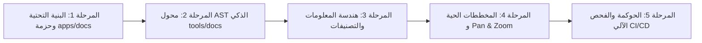

# 📋 خطة عمل رقم 62: البوابة التفاعلية للتوثيق المؤسسي وخريطة المعمارية الحية وبوابات الحراسة الآلية
## Master Work Plan 62: Enterprise Interactive Documentation Portal, AST Transformation Pipeline, Living Architecture Suite & Zero-Drift Governance Gates

> **مرجع الخطة الدائم:** `docs/work-plans/62-plan-enterprise-interactive-documentation-portal-and-living-architecture-suite.md`  
> **تاريخ التحرير والتوافق الاستشاري:** 17-09-2026  
> **الحالة:** 🟡 مسودة معتمدة قيد التنفيذ (Approved Blueprint - In Progress)  
> **الميثاق المرجعي:** بنود 1.2 و 1.5 و 2.1 و 2.4 من `AGENTS.md` و `GEMINI.md`، مخرجات جلسة النقد الفني الاستشاري المعماري (/grill-me + /boost)، دستور حفظ مصدر الحقيقة المطلق (`docs/00-baseline-and-ssot-charter.md`)، وسجلات القرارات المعمارية المعتمدة (ADRs 001 to 037).

---

## 🎯 1. الرؤية والأهداف الاستراتيجية (Core Vision & Objectives)

تحويل التوثيق المؤسسي العملاق لمنظومة **السعادة سمارت بوت** (المكون من 27 وثيقة رئيسية، 37 سجلاً معمارياً ADR، ومخططات الكيانات والتدفقات الـ 126) إلى **بوابة توثيق تفاعلية سحابية حية (Living Interactive Documentation Portal)** تضاهي بوابات كبرى المشاريع البرمجية العالمية (مثل Stripe و Kubernetes و Prisma)، مع الالتزام الحتمي بـ:
1. **حرمة وقدسية المرجعية الأساسية (Preserving SSOT):** الإبقاء على مجلد `docs/` الجذري في مكانه كمرجع كتابي دستوري وحيد لا يتغير ولا يُنقل ولا يُكرر.
2. **خط أنابيب المعالجة والتحويل الذكي (Smart AST Pipeline):** استبدال النسخ الأعمى الساذج بمحول AST يقوم بتنظيف الـ HTML، تحويل الروابط النسبية إلى Web Slugs، وحقن الـ Frontmatter القياسي.
3. **هندسة المعلومات المؤسسية (Tier-1 Information Architecture):** تنظيم التوثيق في 6 مسارات استراتيجية تحل محل فوضى الترقيم المسطح (`00-`, `01-`).
4. **المخططات المعمارية التفاعلية (Living Architecture & Interactive ERD):** دعم Mermaid مع ميزة Pan & Zoom للخرائط الكبرى، واستخراج خريطة الاعتماديات الحية من واقع حزم Turborepo.
5. **بوابة حراسة منع الانجراف (Zero Documentation Drift Gate):** فحص آلي لسلامة الروابط وصحة التجميع قبل الالتزام.

---

## 🚦 2. ميثاق التنفيذ المتتابع الصارم وبوابة التحقق الثلاثية (Strict Sequential Phases)

تطبيقاً للمنهجية المعتمدة: تُقسم الخطة إلى **5 مراحل متتابعة**، لا يُنتقل إلى مرحلة تالية قبل إتمام السابقة والتحقق منها بالكود ويدوياً:

---

### 📦 المرحلة 1: تأسيس تطبيق البوابة التفاعلية (`apps/docs`)
* **الهدف:** إنشاء تطبيق Astro Starlight ضمن الـ Monorepo مع التوافق التام مع معمارية Turborepo ودعم اللغة العربية (RTL).
* **خطوات التنفيذ:**
  - [ ] إنشاء حزمة `apps/docs` وملف `package.json` الخاص بها.
  - [ ] ضبط تبعيات Astro Starlight مع إضافات Mermaid والبحث المحلي Pagefind.
  - [ ] إعداد `astro.config.mjs` لضبط الهوية المؤسسية (Al-Saada Enterprise Docs) ودعم اللغتين العربية (افتراضية RTL) والإنجليزية.
  - [ ] تحديث `pnpm-workspace.yaml` و `turbo.json` ليشمل مهام بناء وتشغيل `docs`.
  - [ ] تحصين `.gitignore` لاستبعاد مخلفات البناء والمحتوى المولد تلقائياً لمنع تلويث المستودع.
* **بوابة التحقق للمرحلة 1:**
  - تشغيل `pnpm install` ونجاح التجميع الأولي.
  - خروج أمر فحص التايب سكريبت بـ Exit Code 0.

---

### 🔄 المرحلة 2: محول خط الأنابيب الذكي (`tools/docs/transform-pipeline.ts`)
* **الهدف:** بناء معالج AST ذكي يقرأ ملفات `docs/*.md` الجوهرية ويحولها إلى صفحات ويب متوافقة بنسبة 100% مع Starlight.
* **خطوات التنفيذ:**
  - [ ] بناء سكريبت `tools/docs/transform-pipeline.ts` باستخدام مكتبات `unified` / `remark`.
  - [ ] **تصحيح الروابط الميتة (Link Rewriter):** تحويل الروابط المرجعية النسبية (مثل `docs/00-...md`) تلقائياً إلى روابط ويب نظيفة ومسارات Slugs صحيحة.
  - [ ] **تطهير وسوم HTML (HTML Sanitizer):** تصحيح أي وسوم غير مغلقة أو أكواد مثل `<T>` في الجداول التي قد تعطل مجمع MDX.
  - [ ] **حقن الـ Frontmatter:** استخراج عناوين الوثائق وحقن ترويسة YAML متوافقة تتضمن العنوان والوصف والتصنيف.
* **بوابة التحقق للمرحلة 2:**
  - تشغيل أداة التحويل على وثائق النظام الـ 27 والتأكد من نجاح التحويل بدون أخطاء.
  - التأكد من عدم وجود أي رابط مكسور ناتج عن التحويل.

---

### 🗂️ المرحلة 3: هندسة المعلومات وشجرة التصفح المؤسسية (Information Architecture)
* **الهدف:** هيكلة شريط التنقل الجانبي (Sidebar) وتصنيف الوثائق الـ 27 والـ 37 ADR في 6 مسارات استراتيجية واضحة.
* **خطوات التنفيذ:**
  - [ ] **مسار 1: الأسس والميثاق التأسيسي (Foundations & Baseline):** الوثائق 00, 01, 14.
  - [ ] **مسار 2: المعمارية وحزم النواة (Core Architecture & Engines):** الوثائق 02, 03, 04, 07, 10, 11, 17, 25.
  - [ ] **مسار 3: المالية والحوكمة والرقابة (Financial Engine & Governance):** الوثائق 08, 09, 12, 13, 15, 16, 20, 21, 26.
  - [ ] **مسار 4: قواعد البيانات وسجل الترحيل (Data & Migration Radar):** الوثائق 18, 19.
  - [ ] **مسار 5: تجربة مستخدم البوت (Telegram UX & Bot Ergonomics):** الوثائق 22, 23, 24.
  - [ ] **مسار 6: السجلات المعمارية (Architecture Decision Records - ADRs):** تبويب ADR-001 إلى ADR-037.
* **بوابة التحقق للمرحلة 3:**
  - مراجعة شجرة التصفح والتأكد من سهولة الوصول لأي موضوع خلال نقرتين فقط.

---

### 📊 المرحلة 4: المعالجة البصرية التفاعلية وخريطة المعمارية الحية
* **الهدف:** تمكين مهندسي النظام والمراجعين الماليين من استعراض المخططات الكبرى والتنقل فيها بتكبير وتصغير سلس.
* **خطوات التنفيذ:**
  - [ ] تفعيل دعم Mermaid التفاعلي مع ميزة **Pan & Zoom** للرسوم البيانية المعقدة (خاصة ERD ومخططات التدفق المالي).
  - [ ] إضافة صفحة **"خريطة المعمارية الحية (Living Architecture Map)"** مستخرجة آلياً من اعتماديات Turborepo (`pnpm turbo graph`).
  - [ ] بناء ويدجت تفاعلي في صفحة الترحيل (Doc 19) يظهر نسبة الإنجاز اللحظية للـ 126 تدفق استناداً لبيانات السجل.
* **بوابة التحقق للمرحلة 4:**
  - تجربة تكبير وتصغير مخططات Doc 18 و Doc 19 والتأكد من وضوح كافة النصوص دون تشويه بصري.

---

### 🛡️ المرحلة 5: بوابات الحراسة الآلية وربط الـ CI/CD (Governance Gates)
* **الهدف:** حظر تسليم أي كود جديد مع وجود روابط مكسورة أو انحراف توثيقي.
* **خطوات التنفيذ:**
  - [ ] إضافة أمر `pnpm docs:sync` لتحديث محتوى البوابة لحظياً.
  - [ ] إضافة أمر `pnpm docs:verify` لفحص الروابط الميتة والتحقق من سلامة بناء البوابة.
  - [ ] إضافة أوامر التشغيل في `package.json`:
    - `pnpm docs:dev`: تشغيل خادم التطوير المحلي للبوابة (`http://localhost:4321`).
    - `pnpm docs:build`: بناء البوابة الثابتة (Static Export) مع فهرس Pagefind.
    - `pnpm docs:preview`: استعراض النسخة الإنتاجية المبنية محلياً.
  - [ ] ربط فحص `docs:verify` مع خطافات الحوكمة `.githooks/pre-commit` لضمان مبدأ Zero-Drift.
* **بوابة التحقق للمرحلة 5:**
  - تشغيل `pnpm docs:verify` والتأكد من نجاح الفحص بـ Exit 0 وخلو المشروع من الروابط المعطلة.

---

## 📋 جدول متابعة تنفيذ المهام (Execution Progress Checklist)

- [ ] **المرحلة 1:** تأسيس تطبيق البوابة `apps/docs` وإعداد Astro Starlight.
- [ ] **المرحلة 2:** بناء محول الـ AST الذكي `tools/docs/transform-pipeline.ts` وتصحيح الروابط.
- [ ] **المرحلة 3:** برمجة هندسة المعلومات وشجرة التصفح الشاملة للمسارات الستة.
- [ ] **المرحلة 4:** تفعيل Pan & Zoom للمخططات الكبرى وتضمين خريطة الاعتماديات الحية.
- [ ] **المرحلة 5:** فواحص الحوكمة والربط التلقائي في `package.json` و `pre-commit`.
- [ ] **التدقيق والمراجعة الختامية:** التحقق الميداني واعتماد المستخدم الرسمي للقفل.
