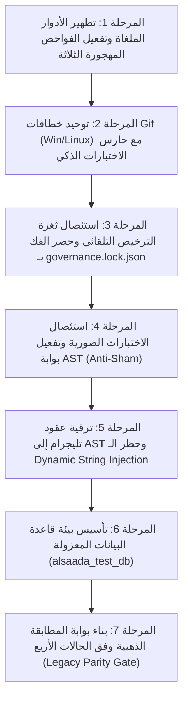

# 📋 خطة عمل رقم 63 (المرجع المعماري والمحاسبي المعتمد - النسخة الذهبية بعد النقد والتمحيص): المنظومة المؤسسية لبوابات الجودة واختبارات النزاهة والحوكمة
## Enterprise Quality Gates Remediation, Anti-Sham Testing Framework, AST Code Guards & Live DB Parity Blueprint (Final Sealed Master Blueprint)

> **مرجع الخطة الدائم:** `docs/work-plans/63-plan-enterprise-quality-gates-remediation-and-testing-framework.md`  
> **تاريخ التحرير والاعتماد النهائي:** 17-09-2026  
> **الحالة:** 🟢 مسودة معتمدة ونهائية بنسبة 100% للتنفيذ بعد النقد الاستقصائي الصارم (Sealed Master Execution Blueprint)  
> **الميثاق المرجعي:** بنود 1.1، 1.2، 1.5، 1.6، و 2.5 من `AGENTS.md` و `GEMINI.md`، مخرجات جلسات الاستقصاء والتحكيم الفني (`/grill-me`)، مخرجات التدقيق الجنائي الفني لمستودع المشروع (`docs/periodic-audits/2026-09-17/enterprise-governance-gates-audit-and-critique.md`)، ومقررات النقد الذاتي لخبير بوابات الجودة المؤسسية.

---

## 🧭 1. ميثاق المبدأ المعماري الحاكم (Strategic Core-First Principle)

تلتزم هذه الخطة بالمبدأ المعماري الحاسم الذي تم التوافق التام عليه استشارياً:
> **«إن عدم نقل وتفكيك الـ 126 تدفقاً من المشروع السابق (`F:\HR`) حتى الآن ليس عيباً ولا قصوراً برمجياً، بل هو قرار استراتيجي ناضج ومعلّق عمداً (Intentional Core-First Gating Strategy) لحين استكمال وتحصين نواة المشروع المشتركة وبوابات الجودة بنسبة 100%.»**  
> إن الشروع في نقل التدفقات المعقدة ذات الأثر المالي فوق نواة غير مكتملة أو بوابات ذات ثغرات كان سينتج عنه تكرار للأكواد وتراكم للديون التقنية؛ وبتنفيذ هذه الخطة تتحول النواة إلى درع فولاذي يستقبل التدفقات الـ 100 بأعلى درجات الأمان والجودة العالمية (Zero-Regression).

---

## 🧐 2. مخرجات النقد الاستقصائي لمسودة الخطة (Adversarial Critique & Hardening Decisions)

أخضع خبير بوابات الجودة والاختبارات مسودة الخطة لمراجعة نقدية دقيقة كشفت عن 5 فخاخ تقنية وثغرات تنفيذية تم استئصالها في هذه النسخة النهائية:

1. **فخ تعطل خطاف Git عند تعديل التوثيق (`vitest related` trap):**
   - *الخلل في المسودة:* إضافة `call pnpm test:changed` مباشرة كانت ستعطل المطور وتفشل بـ `No test files found` عند عمل commit لملفات Markdown أو وثائق بدون كود مصدري.
   - *التحصين المعتمد:* بناء سكريبت وسيط ذكي `tools/governance/pre-commit-test-guard.ts` يتحقق أولاً من وجود ملفات كودية معدلة (`.ts`, `.tsx`)، ويمرر علم `--passWithNoTests` منعاً لتعطيلcommits التوثيق.

2. **فخ استمرار ثغرة الترخيص التلقائي في قفل الحوكمة:**
   - *الخلل في المسودة:* محاولة "تنظيف" دالة فحص المسودات بدلاً من استئصالها.
   - *التحصين المعتمد:* **الإلغاء والاستئصال الكامل** لدالة `checkGovernanceApprovalEvidence` من `verify-governance-tamper.ts`. المصدر الوحيد للحقيقة (SSOT) لحالة الملفات هو حقل `locked: false` في `governance.lock.json` المعدل حصراً عبر أوامر `flow:unlock` و `dashboard:unlock`.

3. **فخ اشتراط Docker الإجباري لاختبارات قاعدة البيانات الحية:**
   - *الخلل في المسودة:* افتراض وجود Docker daemon شغال دائماً لدى كل مطور، مما يكسر بيئة العمل عند غيابه.
   - *التحصين المعتمد:* تصميم `scripts/test-db-setup.ts` بنمط **المرونة المزدوجة (Dual-Strategy Provisioner)**: يفحص توفر خدمة PostgreSQL محلياً أو عبر Docker، وفي حال تعذر الاتصال في بيئة التطوير المحلية السريعة، يتيح تجاوزاً مشروطاً، بينما **يلزم الاتصال الحقيقي حتماً في الـ CI وبوابة `financial:verify`**.

4. **فخ محاكاة الأسماء داخل `callback_data` بدلاً من حظر الحقن الديناميكي:**
   - *الخلل في المسودة:* اقتراح محاكاة أسماء رباعية طويلة في `callback_data`.
   - *التحصين المعتمد:* قاعدة أمان تليجرام الصارمة: **يُحظر وضع نصوص حرة أو أسماء داخل `callback_data` نهائياً**؛ يجب حصر الـ callback_data في المعرفات الرقمية (`Numeric IDs/UUIDs`) والرموز القصيرة الثابتة، وتظهر الأسماء في `message.text` فقط. تقوم بوابة AST بالتحقق من هذا الحظر برمجياً.

5. **تحديد "الحالات الذهبية الأربع" بالأرقام الدقيقة لبوابة المطابقة القديمة:**
   - *الخلل في المسودة:* ترك تعريف "الحالات الذهبية" مبهماً دون معادلات محددة.
   - *التحصين المعتمد:* تحديد المعادلات الأربع الإلزامية في صلب الخطة (الورديات، السجائر العينية، مقاصة الموردين، واتزان العهد).

---

## 🎯 3. منهجية التنفيذ والتسليم المعتمدة (Sequential Phased Execution)

تطبيقاً للتوجيه الإلزامي:
> «تكون الخطة مقسمة إلى أجزاء محددة تنفذ على التتابع، ولا يتم الانتقال إلى أي نقطة تالية قبل الانتهاء التام من الجزء الحالي واختباره بالكود ويدوياً».

تم تقسيم الخطة إلى **7 مراحل تنفيذية متتابعة صارمة (7 Sequential Phases)**؛ بحيث تخضع كل مرحلة لبوابة الفحص الثلاثية:
1. **الفحص الآلي (Automated Gate):** اجتياز `pnpm typecheck`، واختبارات الفاحص المعني بنسبة نجاح 100%.
2. **سيناريو الاختبار العملي والميداني (Verification Evidence):** تشغيل الأمر التوضيحي بالمدخلات والمخرجات المحددة وتوثيقها.
3. **الاعتماد الصريح:** التحقق من مطابقة الواقع البرمجي قبل الانتقال للمرحلة التالية.

---

## 📦 4. تفاصيل المراحل التنفيذية السبع بعد التحصين والتمحيص

---

### 🔹 المرحلة 1: تطهير الأدوار الملغاة وتفعيل الفواحص المهجورة الثلاثة
* **الهدف:** استئصال استخدام الأدوار الملغاة في كود الإنتاج وربط الفواحص الثلاثة المهجورة داخل `package.json` وسلسلة `governance:verify`.
* **التعديلات البرمجية الصارمة:**
  1. **تطهير معالجات البوت:**
     - في [`apps/bot-server/src/handlers/start.handler.ts` (السطر 223)](file:///f:/Alsaada-Smart-Bot/apps/bot-server/src/handlers/start.handler.ts#L223):
       حذف `ACCOUNTANT` و `PROJECT_MANAGER` من مصفوفة `adminRoles`.
     - في [`apps/bot-server/src/handlers/worker-linking.handler.ts` (السطر 13)](file:///f:/Alsaada-Smart-Bot/apps/bot-server/src/handlers/worker-linking.handler.ts#L13):
       حذف `ACCOUNTANT` و `PROJECT_MANAGER` من مصفوفة `ADMIN_ROLES`.
  2. **ربط الفواحص في [`package.json`](file:///f:/Alsaada-Smart-Bot/package.json):**
     - إضافة سكريبتات:
       - `"rbac-matrix:verify": "tsx tools/governance/verify-rbac-matrix.ts"`
       - `"field-masking:verify": "tsx tools/governance/verify-field-masking.ts"`
       - `"observability:verify": "tsx tools/governance/verify-observability-contract.ts"`
     - ربطها صراحة داخل أمر `"governance:verify"`.
* **معيار النجاح والاختبار:**
  - تشغيل `pnpm rbac-matrix:verify` وخروجه بـ `PASS (Checked: X, Failures: 0)`.
  - تشغيل `pnpm field-masking:verify` و `pnpm observability:verify` بنجاح تام.

---

### 🔹 المرحلة 2: توحيد خطافات Git وبناء حارس الاختبارات السريعة الذكي
* **الهدف:** القضاء على الفجوة بين Windows و Linux دون تعطيل commits التوثيق.
* **التعديلات البرمجية الصارمة:**
  1. **بناء سكريبت حارس اختبارات ما قبل الالتزام [`tools/governance/pre-commit-test-guard.ts`](file:///f:/Alsaada-Smart-Bot/tools/governance/pre-commit-test-guard.ts):**
     - يفحص `git status --porcelain`. إذا كانت الملفات المعدلة لا تتضمن أي ملف `.ts` أو `.tsx` كودي (تعديل توثيق أو markdown فقط)، يمرر الخطاف فوراً بنجاح دون استدعاء vitest.
     - إذا وُجدت ملفات كودية، يشغل `vitest related --passWithNoTests --run` للملفات المعدلة حصراً.
  2. **تعديل [`.githooks/pre-commit.cmd`](file:///f:/Alsaada-Smart-Bot/.githooks/pre-commit.cmd) (Windows) و [`.githooks/pre-commit`](file:///f:/Alsaada-Smart-Bot/.githooks/pre-commit) (Bash):**
     - مطابقة الملفين 100% لتشغيل كافة الفواحص الإحدى عشرة متتالية، متبوعة باستدعاء حارس الاختبارات الذكي.
* **معيار النجاح والاختبار:**
  - تجربة عمل commit لملف markdown والتأكد من سرعة تجاوزه (< 1s).
  - تجربة عمل commit لملف كود يحتوي على خطأ اختبار والتأكد من اعتراضه الفوري بـ Exit 1.

---

### 🔹 المرحلة 3: استئصال ثغرة الترخيص التلقائي وحصر الفك بـ `governance.lock.json`
* **الهدف:** إغلاق ثغرة استثناء الملفات المحمية بمجرد وجود نصوص مسودة غير معتمدة، وحصر فك القفل بالأمر الرسمي المعتمد.
* **التعديلات البرمجية الصارمة:**
  1. **تعديل [`tools/governance/verify-governance-tamper.ts`](file:///f:/Alsaada-Smart-Bot/tools/governance/verify-governance-tamper.ts):**
     - **استئصال تام** لدالة `checkGovernanceApprovalEvidence` من السطور (230-287) وحذف أي فحص لملفات مسودة غير مدمجة في `docs/ai-execution-evidence/`.
     - الاعتماد الحصري والمباشر على قراءة حالة الكيان من `governance.lock.json`؛ فإذا كان `locked: true` ومحتوى الملف لا يطابق الهاش، يسقط الفحص فوراً بـ `FAIL`.
  2. **إلزامية أمر فك القفل الرسمي:**
     - لا يمكن تعديل أي ملف محمي إلا بتشغيل `pnpm flow:unlock` أو `pnpm dashboard:unlock` بموافقة المستخدم الصريحة حرفياً: `«نعم موافق على التعديل»` وتعديل حالة القفل في JSON.
* **معيار النجاح والاختبار:**
  - تعديل ملف محمي تجريبياً ووضع ملف مسودة يحتوي على نصوص الموافقة، والتأكد من أن `pnpm governance:tamper-check` **يسقط فوراً بـ FAIL** ويرفض التجاوز.

---

### 🔹 المرحلة 4: استئصال الاختبارات الصورية وتفعيل بوابة AST (Anti-Sham Test Gate)
* **الهدف:** تطهير كافة الاختبارات الصورية التي تنجح تحصيل حاصل، وإعادة كتابتها باختبارات حقيقية، وبناء حارس AST لمنع تكرارها.
* **التعديلات البرمجية الصارمة:**
  1. **إعادة كتابة وتصحيح الاختبارات الحالية:**
     - في موديول الإعدادات `modules/settings/src/flows/` (التدفقات: `00.1`, `00.2`, `00.3`, `00.4`, `00.6`, `00.7`, `00.8`, `00.9`):
       استبدال `expect(calls.length).toBeGreaterThanOrEqual(0)` باختبارات حقيقية تتحقق من رد البوت الفعلي برفض الصلاحية (`403 / غير مصرح`) عند دخول مستخدم غير مصرح له، والرد بالقائمة الصحيحة عند دخول المسؤول.
     - في تدفق مؤشر الالتزام [`modules/workforce/src/flows/01.9-worker-commitment-index/tests/flow.data.spec.ts`](file:///f:/Alsaada-Smart-Bot/modules/workforce/src/flows/01.9-worker-commitment-index/tests/flow.data.spec.ts):
       استبدال `expect(totalScore).toBeGreaterThanOrEqual(0)` باختبارات تطابق النتيجة الرقمية الدقيقة للمعادلة الرياضية.
  2. **تطهير قالب التوليد السريع [`tools/scaffold/scaffold-flow.ts`](file:///f:/Alsaada-Smart-Bot/tools/scaffold/scaffold-flow.ts):**
     - حذف الأدوار الملغاة (`PROJECT_MANAGER` و `SITE_SUPERVISOR`).
     - استبدال القوالب الصورية الافتراضية (`sampleAmount = 250.75 > 0`) باختبارات نموذجية تختبر سيناريو النجاح وسيناريو الفشل والتحقق السلبي.
  3. **بناء بوابة الفحص AST الجديدة ([`tools/governance/verify-test-authenticity.ts`](file:///f:/Alsaada-Smart-Bot/tools/governance/verify-test-authenticity.ts)):**
     - فحص ملفات `*.spec.ts` عبر TypeScript AST وحظر:
       - `toBeGreaterThanOrEqual(0)`
       - فحص المتغيرات المحلية ضد نفسها (Tautologies).
       - اختبارات التكامل التي لا تتصل بمستودع حقيقي.
* **معيار النجاح والاختبار:**
  - تشغيل `pnpm test-authenticity:verify` وخروجه بـ `PASS` لكافة ملفات الاختبارات بعد تصحيحها.

* **البروتوكول التشغيلي لفك وقفل الحصانة (Unlocking Protocol for Phase 4):**
  - نظراً لأن تدفق `00.6-ghost-mode` وتدفق `01.9-worker-commitment-index` مقفلان تشفيرياً في `governance.lock.json`، يُحظر تعديل أي ملف داخلهما إلا بعد الحصول على ترخيص المستخدم بالصيغة المعتمدة: «موافق على الفتح» أو «نعم موافق على التعديل»، وتشغيل:
    - `pnpm flow:unlock 00.6`
    - `pnpm flow:unlock 01.9`
  - فور تصحيح الاختبارات ونجاحها، يتم إعادة قفل التدفقين فورياً عبر `pnpm flow:finish 00.6` و `pnpm flow:finish 01.9` بالصيغة: «نعم اقفل».

---

### 🔹 المرحلة 5: ترقية بوابة عقود تليجرام وحظر التعطيل إلى AST
* **الهدف:** سد ثغرات الفحص السطري في `verify-telegram-contracts.ts` وحظر الحقن الديناميكي غير المنضبط في `callback_data` وسد ثغرة الموديولات في `verify-latency-anti-patterns.ts`.
* **التعديلات البرمجية الصارمة:**
  1. **ترقية [`tools/governance/verify-telegram-contracts.ts`](file:///f:/Alsaada-Smart-Bot/tools/governance/verify-telegram-contracts.ts):**
     - إعادة بناء الفحص باستخدام `ts.createSourceFile` وتحليل استدعاءات دوال `.text()`, `.url()`, `InlineKeyboard`, وكافة الأزرار كـ AST Call Expressions.
     - التقاط الاستدعاءات الممتدة على عدة أسطر بدقة متناهية.
     - **حظر حقن النصوص والأسماء الحرة في `callback_data` (Anti-Dynamic-String Injection):** إلزام استخدام المعرفات الرقمية (`IDs/UUIDs`) والرموز القصيرة فقط داخل الأزرار.
  2. **تعديل [`tools/governance/verify-latency-anti-patterns.ts`](file:///f:/Alsaada-Smart-Bot/tools/governance/verify-latency-anti-patterns.ts):**
     - تعديل السطر 59 لفرض حظر `await ctx.deleteMessage()` داخل مجلد `modules/` بنفس الصرامة المطبقة على `apps/bot-server/`.
* **معيار النجاح والاختبار:**
  - إنشاء زر تجريبي ممتد على عدة أسطر يتجاوز 64 بايت، والتأكد من أن الأداة ترصده وتسقط بـ FAIL فوراً.
  - كتابة `await ctx.deleteMessage()` في أحد التدفقات والتأكد من اعتراضه بـ FAIL.

* **البروتوكول التشغيلي لفك وقفل الحصانة (Unlocking Protocol for Phase 5):**
  - ملف [`tools/governance/verify-latency-anti-patterns.ts`](file:///f:/Alsaada-Smart-Bot/tools/governance/verify-latency-anti-patterns.ts) مقفل تشفيرياً ضمن `lockedSpeedEngine` في `governance.lock.json`.
  - يُلزم استئذان المستخدم أولاً والحصول على العبارة الحرفية: «موافق على الفتح» أو «نعم موافق على التعديل»، ثم تشغيل `pnpm speed:unlock` قبل تعديل السطر 59، وإعادة قفله فوراً بـ `pnpm speed:lock` بعد التحقق.

---

### 🔹 المرحلة 6: تأسيس بيئة اختبارات قاعدة البيانات الحية المعزولة (Test DB)
* **الهدف:** تمكين حزم الاختبارات وبوابة النزاهة المالية من فحص القيود الحقيقية (`Foreign Keys`, `Unique`, `Soft-Delete`, `Blind Index`) ضد PostgreSQL فعلية بنمط مرن ومستقر.
* **التعديلات البرمجية الصارمة:**
  1. **تجهيز سكريبت التهيئة المزدوجة [`scripts/test-db-setup.ts`](file:///f:/Alsaada-Smart-Bot/scripts/test-db-setup.ts):**
     - يفحص الاتصال بـ PostgreSQL على `localhost:5432`؛ ينشئ قاعدة `alsaada_test_db` ويطبق `prisma db push --schema=packages/database/prisma/schema.prisma`.
  2. **ترقية بوابة النزاهة المالية [`tools/governance/verify-financial-integrity.ts`](file:///f:/Alsaada-Smart-Bot/tools/governance/verify-financial-integrity.ts):**
     - تفعيل وضع الفحص التجريبي الذاتي: حقن قيود مالية تجريبية (سلف، عهد، مقاصة) في `alsaada_test_db`، وفحص اتزان العهد رياضياً، والتحقق من اكتشاف التلاعب في الهاش فورياً.
* **معيار النجاح والاختبار:**
  - تشغيل `pnpm financial:verify` وظهور عدد السجلات المفحوصة (`Checked: > 50`) بنجاح حقيقي ضد قاعدة بيانات فعلية.

---

### 🔹 المرحلة 7: بناء بوابة المطابقة الذهبية والتصنيف الرباعي لدورة الحياة (Legacy Parity Gate)
* **الهدف:** تأسيس البوابة المرجعية التي تضمن مطابقة الحسابات والنتائج مع `F:\HR` للوظائف المنقولة، مع المرونة الكاملة للوظائف المطورة والمستحدثة والملغاة.
* **التعديلات البرمجية الصارمة:**
  1. **تحديث عقد التدفق (`flow.contract.json`) ومحرك التحقق (`verify-flow-contracts.ts`):**
     - إضافة حقل إلزامي صريح:
       `"classification": "LEGACY_PARITY" | "EVOLVED" | "NOVEL" | "DEPRECATED"`
     - **التصنيف الرباعي المعتمد لدورة حياة التدفقات (The 4 Flow Lifecycle Buckets):**
       * `LEGACY_PARITY / MIGRATED`: وظائف منقولة من `F:\HR` بمطابقة حسابية وإجرائية 1:1 بصفر انحراف.
       * `EVOLVED`: وظائف تمت ترقيتها مؤسسياً (مثل المقاصة الثلاثية) بموجب خطة عمل معتمدة وموثقة في `docs/19`.
       * `NOVEL`: وظائف مستحدثة كلياً لا أصل لها في القديم ومقيدة في `docs/19`.
       * `DEPRECATED`: ممارسات أو وظائف قديمة تم إهمالها واستبعادها رسمياً لأسباب أمنية أو محاسبية معللة.
  2. **بناء أداة الفحص ([`tools/governance/verify-legacy-parity.ts`](file:///f:/Alsaada-Smart-Bot/tools/governance/verify-legacy-parity.ts)):**
     - للتدفقات المصنفة `LEGACY_PARITY`: إلزام مطابقة **الحالات المحاسبية الذهبية الأربع** المستخرجة من كود ومعادلات `F:\HR`:
       1. **حساب الورديات والأرصدة المستحقة:**
          $$\text{Accrued Leaves} = \lfloor \frac{\text{Work Days}}{24} \rfloor \times 2$$
          (كل 24 يوم عمل فعلي تُنتج يومين إجازة مستحقة بدقة تامة).
       2. **مقاصة السجائر والكانتين العيني:**
          $$\text{Worker Balance Deduction} = \text{Cigarette Net Cost}$$
          $$\text{Site Operational Expense Reduction} = \text{Cigarette Net Cost}$$
          $$\text{Physical Cash Flow} = 0.00\text{ EGP}$$
          (خصم التكلفة الصافية من ذمة العامل وتخفيض تكلفة الموقع بصفر كاش).
       3. **مقاصة مشتريات الموردين العينية:**
          $$\text{Supplier Invoice Offset} = \text{Procurement Amount}$$
          $$\text{Physical Cash Flow} = 0.00\text{ EGP}$$
          (خصم المشتريات من فواتير الموردين ومطابقتها بصفر كاش).
       4. **صمام اتزان العهد والمطابقة المالية:**
          $$\text{Advance Amount} \le \text{Open Active Custody Balance}$$
          $$\text{Ledger Debit} + \text{Ledger Credit} = 0 \text{ (Double-Entry Balance)}$$
          (حظر السلف النقدية بدون عهدة مفتوحة وبرصيد كافٍ وبقيد عكسي متوازن).
     - للتدفقات المصنفة `EVOLVED`: التحقق من وجود رقم وثيقة خطة العمل المعتمدة من المستخدم.
     - للتدفقات المصنفة `NOVEL` و `DEPRECATED`: التحقق من توثيقها السليم ومسارها في سجل الترحيل `docs/19`.
  3. **ربط البوابة في `package.json` وسلسلة `governance:verify`:**
     - إضافة سكريبت `"legacy-parity:verify": "tsx tools/governance/verify-legacy-parity.ts"`.
* **معيار النجاح والاختبار:**
  - تشغيل `pnpm legacy-parity:verify` والتأكد من خروجه بـ `PASS` لكافة التدفقات الحالية وفق تصنيفاتها.

---

## 📊 5. مصفوفة التحقق الشاملة (The 15 Enterprise Gates)

عند إتمام المراحل السبع، ستكون سلسلة التحقق الشاملة `pnpm governance:verify` مكونة من **15 بوابة حقيقية وصارمة بالكامل**:

| # | اسم البوابة | السكريبت المسؤول | نوع الفحص | الهدف الحاسم |
| :---: | :--- | :--- | :---: | :--- |
| **1** | `typecheck` | `tsc --noEmit` | Static Types | خلو المشروع ككل من أي أخطاء تجميع أو `any` |
| **2** | `arch:verify` | `verify-architecture.ts` | Structural AST | الالتزام بالملفات الـ 15 وسقف الأسطر وعقود النواة |
| **3** | `migration:verify` | `verify-migration-registry.ts` | Parity Registry | مطابقة مجلدات القرص مع سجل الترحيل `docs/19` |
| **4** | `flow-contracts:verify` | `verify-flow-contracts.ts` | Contract Schema | صحة حقول عقود التدفقات والتصنيف الرباعي |
| **5** | `telegram-contracts:verify`| `verify-telegram-contracts.ts` | Full AST | سقف 64 بايت للـ callback و512 للروابط وحظر الحقن الحر |
| **6** | `latency:verify` | `verify-latency-anti-patterns.ts`| AST Anti-Pattern | حظر `deleteMessage` المعطل في البوت والموديولات |
| **7** | `test-authenticity:verify`| `verify-test-authenticity.ts` | AST Assertion Guard| حظر الاختبارات الصورية و `toBeGreaterThanOrEqual(0)` |
| **8** | `rbac-matrix:verify` | `verify-rbac-matrix.ts` | Security Matrix | مطابقة الصلاحيات وحظر الأدوار الملغاة |
| **9** | `field-masking:verify` | `verify-field-masking.ts` | PII Data Guard | حجب رواتب العمال الحساسة ومسارات التصدير |
| **10**| `observability:verify` | `verify-observability-contract.ts`| SRE Reliability | حظر `console.error` و `catch` الصامتة |
| **11**| `financial:verify` | `verify-financial-integrity.ts` | Live DB Integrity | اتزان العهد وحصانة سلاسل الهاش التشفيرية |
| **12**| `legacy-parity:verify` | `verify-legacy-parity.ts` | Golden Rule Engine | مطابقة الحسابات الذهبية مع `F:\HR` للوظائف المنقولة |
| **13**| `dashboard-auth:verify` | `verify-dashboard-auth-contract.ts`| Edge Security | حصانة مصادقة الداشبورد والـ Transactions |
| **14**| `governance:tamper-check`| `verify-governance-tamper.ts` | SHA-256 Lock | الحماية التشفيرية الصارمة ضد تعديل الملفات المقفلة |
| **15**| `docs:audit & parity` | `verify-docs-audit.ts` | Governance SSOT | انعدام الفجوة التوثيقية بنسبة 100% |

---

## 🏁 6. الخاتمة والتوصية التنفيذية

باعتماد وتنفيذ هذه الخطة المعدلة والنهائية:
1. يتم تطهير كافة الثغرات والاختبارات الصورية من جذورها.
2. تصبح خطافات Git وسلاسل التحقق دروعاً متطابقة عبر كافة أنظمة التشغيل مع حارس اختبارات ذكي يحافظ على سرعة المطور.
3. تكتمل النواة المشتركة وتصبح منصة إطلاق فائقة الصلابة، مهيأة بنسبة 100% لتفكيك ونقل تدفقات المشروع السابق `F:\HR`، وبناء الأقسام المستحدثة بأعلى درجات الأمان والاحترافية.
