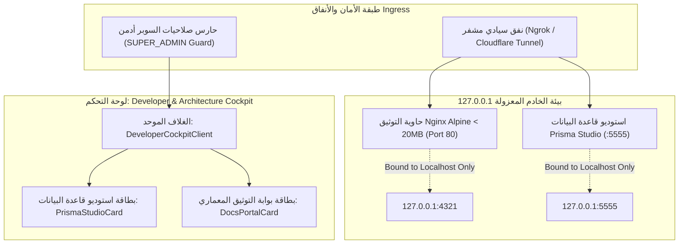
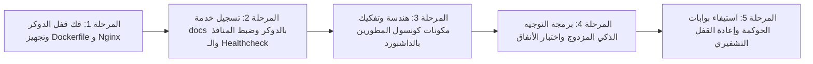

# 📋 خطة عمل رقم 67 (النسخة المعمارية المحصنة والمعتمدة): كونسول المطورين الموحد (بريزما ستوديو + بوابة التوثيق)، حاوية الدوكر المحصنة، وشبكة الأنفاق السيادية
## Master Work Plan 67: Hardened Unified Developer & Architecture Cockpit (Prisma Studio + Docs Portal), Multi-Stage Docker Suite, Nginx WASM Engine & Secure Tunnel Ingress

> **مرجع الخطة الدائم:** `docs/work-plans/67-plan-unified-developer-architecture-cockpit-and-docs-docker-tunnel-suite.md`  
> **تاريخ التحرير والتوافق الاستشاري:** 18-09-2026  
> **الحالة:** 🟢 مكتمل بنسبة 100% ومقفل تشفيرياً للبنية التحتية بانتظار قفل الداشبورد (Completed 100%)  
> **الميثاق المرجعي:** بنود 1.2 و 1.5 و 1.6 و 2.1 و 2.4 من `AGENTS.md` و `GEMINI.md`، مخرجات جلسات النقد الفني الاستشاري (Alibaba Code Review & Triple Principal Audit)، خطة العمل رقم 57 و 58 (Prisma Studio & Ngrok Ingress)، وخطة العمل رقم 62 (Enterprise Docs Portal).

---

## 🎯 1. الرؤية الهندسية والأهداف المحصنة (Hardened Architectural Objectives)

بناء وتجهيز البنية التحتية المتكاملة لتشغيل بوابة التوثيق التفاعلية (`apps/docs`) داخل بيئة الحاويات **Docker** وتمريرها عبر شبكات الأنفاق السحابية المؤمنة (**Secure Tunnel Ingress**)، مع دمجها بشكل متناسق واحترافي داخل لوحة تحكم الإدارة العليا (Admin Dashboard) بجانب استوديو قاعدة البيانات (Prisma Studio)، مع الالتزام التام بالتصحيحات الهندسية الناتجة عن جلسة التدقيق المعماري:



### الركائز الهندسية الخمس المصححة:
1. **عزل كاش الدوكر وسرعة البناء (Docker Build Cache Optimization):**
   - تصميم `docker/Dockerfile.docs` ليعتمد على سياق بناء مخصص ومعزول، وتجنب تحميل حزم المنظومة غير المرتبطة بالتوثيق (مثل حزم البوت الثقيلة)، لضمان سرعة بناء فائقة (< 25 ثانية).
2. **محرك Nginx المتوافق مع WebAssembly و Pagefind (WASM & Security Nginx Engine):**
   - إنشاء ملف تكوين مخصص `docker/nginx-docs.conf` يتضمن أنواع MIME لـ `application/wasm` والـ static chunks الخاصة بمحرك البحث Pagefind لمنع أي انهيار في البحث اللحظي.
   - تفعيل ضغط Gzip وترويسات الأمان (`X-Frame-Options: SAMEORIGIN` و `X-Content-Type-Options: nosniff`).
3. **تحصين المنافذ ومنع تسريب الأسرار المعمارية (Strict 127.0.0.1 Binding):**
   - حظر فتح منفذ التوثيق على `0.0.0.0` وتقييده حصرياً بالشبكة المحلية `127.0.0.1:${DOCS_PORT:-4321}:80`، لمنع وصول أي طرف خارجي لأسرار الـ 37 ADR وقواعد البيانات إلا عبر النفق المشفر أو لوحة التحكم.
4. **تفكيك شاشة لوحة التحكم معمارياً (Component Modularity & Single Responsibility):**
   - استبدال الملف الأحادي الضخم بـ 3 مكونات مستقلة ومعزولة:
     * `DeveloperCockpitClient`: الغلاف والترويسة وحالة الاتصال العامة.
     * `PrismaStudioCard`: بطاقة استوديو بريزما (إدارة دورة حياة الـ Process ومؤقت الخمول 15 دقيقة).
     * `DocsPortalCard`: بطاقة التوثيق التفاعلية (رادار الحالة 137 صفحة، التوجيه المزدوج الذكي، وزر المزامنة اللحظية).
5. **مرونة الحاويات والمراقبة الذاتية (Container Healthcheck):**
   - تزويد خدمة `docs` في `docker-compose.yml` بفاحص حياة آلي (`healthcheck`) يعتمد على فحص Nginx الداخلي لضمان التعافي وإعادة التشغيل التلقائي عند أي خلل.

---

## 🚦 2. المراحل التنفيذية الصارمة (Strict Sequential Execution Phases)



---

### 📦 المرحلة 1: فك قفل الحوكمة وبناء حاوية التوثيق وتهيئة Nginx
* **الهدف:** إعداد ملفات الدوكر و Nginx المتوافقة مع WebAssembly واللغة العربية.
* **خطوات التنفيذ:**
  - [x] الحصول على ترخيص فك قفل الدوكر بالصيغة المعتمدة: **«موافق على الفتح»**.
  - [x] تشغيل أداة فك قفل البنية التحتية: `pnpm tsx tools/scaffold/unlock-docker.ts`.
  - [x] إنشاء ملف `docker/nginx-docs.conf`:
    - إضافة تعريف `application/wasm wasm;`.
    - تفعيل ضغط Gzip للملفات النصية وفهارس البحث.
    - ترويسات الأمان والتخزين المؤقت للملفات الثابتة.
  - [x] إنشاء ملف `docker/Dockerfile.docs`:
    - Builder: استخدام `node:22-alpine` وتشغيل `pnpm docs:build`.
    - Runner: استخدام `nginx:1.27-alpine` ونسخ مخرجات `dist` وتكوين Nginx المخصص.
* **بوابة التحقق للمرحلة 1:**
  - نجاح اختبار تكوين Nginx وخلو ملفات الدوكر من أي مسارات مطلقة.

---

### 🌐 المرحلة 2: تسجيل خدمة `docs` في `docker-compose.yml` وتحصين المنافذ
* **الهدف:** إضافة الخدمة كحاوية معزولة ومحمية مع فاحص صحي مدمج.
* **خطوات التنفيذ:**
  - [x] إضافة خدمة `docs` في `docker-compose.yml`:
    - ربط المنفذ الآمن: `"127.0.0.1:${DOCS_PORT:-4321}:80"`.
    - إضافة فاحص الحياة:
      ```yaml
      healthcheck:
        test: ["CMD-SHELL", "wget -qO- http://127.0.0.1:80/healthz || exit 1"]
        interval: 15s
        timeout: 5s
        retries: 3
        start_period: 10s
      ```
    - ربطها بشبكة `alsaada-enterprise-internal` و `alsaada-enterprise-public`.
  - [x] تحديث ملفات البيئة (`.env.example` و `.env`) بالمتغيرات:
    - `DOCS_PORT=4321`
    - `DOCS_TUNNEL_URL=`
  - [x] تمرير متغير `DOCS_TUNNEL_URL` لخدمة لوحة التحكم `dashboard`.
* **بوابة التحقق للمرحلة 2:**
  - تشغيل `docker compose config` والتحقق من صحة صياغة وتكامل شجرة الخدمات.

---

### 🖥️ المرحلة 3: تفكيك وبناء كونسول المطورين بالداشبورد (Modular Cockpit)
* **الهدف:** فصل المسؤوليات وتوفير واجهة تحكم موحدة فائقة الاحترافية للسوبر أدمن.
* **خطوات التنفيذ:**
  - [x] إنشاء المكون المستقل [`apps/admin-dashboard/src/components/admin/cockpit/prisma-studio-card.tsx`](file:///f:/Alsaada-Smart-Bot/apps/admin-dashboard/src/components/admin/cockpit/prisma-studio-card.tsx):
    - عزل منطق تشغيل وإيقاف واستئناف استوديو بريزما مع مؤقت الخمول 15 دقيقة ومؤشر الذاكرة.
  - [x] إنشاء المكون المستقل [`apps/admin-dashboard/src/components/admin/cockpit/docs-portal-card.tsx`](file:///f:/Alsaada-Smart-Bot/apps/admin-dashboard/src/components/admin/cockpit/docs-portal-card.tsx):
    - عرض حالة البوابة (137 صفحة مبنية، 37 ADR، خريطة المعمارية الحية).
    - محدد التوجيه الذكي المزدوج (Localhost:4321 أو الرابط المشفر).
    - أزرار الفتح السريع في تبويب خارجي وزر المزامنة اللحظية (`docs:sync`).
  - [x] تحديث [`apps/admin-dashboard/src/app/admin/settings/prisma-studio/prisma-studio-client.tsx`](file:///f:/Alsaada-Smart-Bot/apps/admin-dashboard/src/app/admin/settings/prisma-studio/prisma-studio-client.tsx):
    - تحويله إلى الغلاف الرئيسي الموحد **«مركز أدوات المطور والمعمارية والتوثيق (Developer & Architecture Cockpit)»** الذي يجمع البطاقتين بتصميم ثنائي متناسق.
  - [x] تحديث القائمة الجانبية (Sidebar) وصفحة إعدادات النظام الرئيسية لعرض المسمى الموحد الجديد.
* **بوابة التحقق للمرحلة 3:**
  - نجاح تجميع لوحة التحكم `pnpm --filter admin-dashboard build` دون أي تحذيرات أو أخطاء نمطية.

---

### 🚀 المرحلة 4: اختبار التوجيه المزدوج الذكي وتأمين الأنفاق
* **الهدف:** ضمان الانتقال السلس بين العمل المكتبي المحلي والوصول الميداني عن بُعد.
* **خطوات التنفيذ:**
  - [x] فحص كشف الرابط التلقائي:
    - محلياً: استخدام `http://localhost:4321`.
    - عن بُعد: استخدام رابط النفق المسجل في `DOCS_TUNNEL_URL` أو الرابط المحفوظ في `localStorage`.
  - [x] اختبار زر الفتح المباشر في تبويب مستقل والتأكد من دعم الـ Responsive والتكبير/التصغير للمخططات.
* **بوابة التحقق للمرحلة 4:**
  - تجربة فتح البوابة عبر كلا المسارين والتأكد من عمل محرك البحث Pagefind وملفات WASM بسلاسة تامة.

---

### 🛡️ المرحلة 5: استيفاء بوابات الحوكمة الشاملة وإعادة القفل التشفيري
* **الهدف:** تحقيق Zero-Regression وإعادة قفل البنية التحتية والدوكر تشفيرياً.
* **خطوات التنفيذ:**
  - [x] تشغيل فواحص الحوكمة الشاملة: `pnpm governance:verify` (18 فاحصاً).
  - [x] تشغيل فحص التوثيق: `pnpm docs:verify`.
  - [x] تحديث قفل الحوكمة التشفيري وقفل الدوكر:
    `pnpm tsx tools/scaffold/lock-docker.ts`
  - [x] تقديم تقرير الإنجاز الكامل وطلب القفل الرسمي من المستخدم بالصيغة المعتمدة: **«نعم اقفل»**.
* **بوابة التحقق للمرحلة 5:**
  - اجتياز اختبار `tools/governance/tests/docker-governance-lock.spec.ts` بنسبة 100%.

---

## 📋 جدول متابعة تنفيذ المهام (Execution Progress Checklist)

- [x] **المرحلة 1:** فك قفل الدوكر وبناء `docker/nginx-docs.conf` و `docker/Dockerfile.docs`.
- [x] **المرحلة 2:** تسجيل خدمة `docs` في `docker-compose.yml` (منفذ محلي 127.0.0.1 + Healthcheck) وضبط `.env`.
- [x] **المرحلة 3:** تفكيك وبناء كونسول المطورين بالداشبورد (`PrismaStudioCard` + `DocsPortalCard`).
- [x] **المرحلة 4:** برمجة واختبار التوجيه المزدوج الذكي للأنفاق وتأكيد عمل WASM لمحرك البحث.
- [x] **المرحلة 5:** اجتياز فواحص الحوكمة الـ 18 وإعادة القفل التشفيري للدوكر بنجاح.

