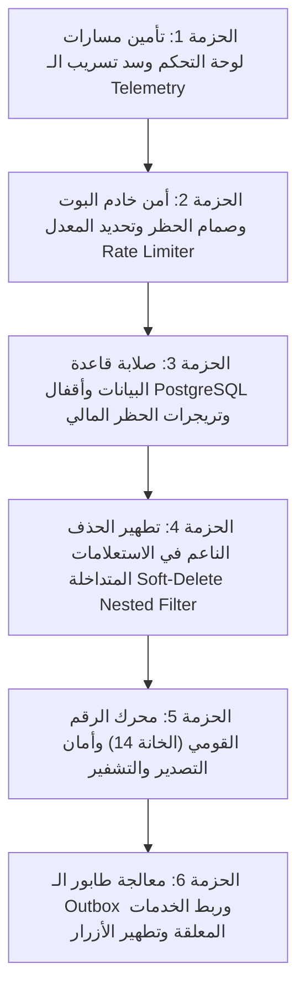

# 📋 خطة عمل رقم 68 (المرجع المعماري والبرمجي المعتمد): المنظومة المؤسسية للإصلاح البرمجي الشامل لثغرات النواة وخادم البوت والداشبورد
## Comprehensive Core Security, Concurrency Hardening, Bot Runtime & Dashboard Operational Remediation Master Blueprint

> **مرجع الخطة الدائم:** `docs/work-plans/68-plan-comprehensive-core-security-and-runtime-operational-remediation.md`  
> **تاريخ التحرير والاعتماد:** 18-09-2026  
> **الحالة:** 🟡 مسودة تفصيلية مطروحة للمناقشة والاعتماد النهائي (Draft for Approval)  
> **الميثاق المرجعي:** بنود 1.1، 1.2، 1.4، 1.5، 2.1، و 2.2 من `AGENTS.md` و `GEMINI.md`، مخرجات تقرير التدقيق الجنائي الفني للمستودع (`docs/periodic-audits/2026-09-17/comprehensive-forensic-codebase-audit.md`)، ومخرجات التحقيق البرمجي المستقل الحي.

---

## 🧭 1. ميثاق المبدأ الحاكم وأهداف الخطة (Strategic Rationale)

بعد أن نجحت خطة العمل رقم 63 في إرساء بوابات الجودة التشفيرية، فواحص الـ AST الدلالية، واستئصال الاختبارات الصورية بنسبة 100%، أظهر الفحص الجنائي الحي للكود المصدري وجود فجوة بين صلابة بوابات الحوكمة وبين الواقع التشغيلي والأمني في الكود الحي (Bot Server, Dashboard APIs, Database Ledger, National ID Engine, Outbox Queue).

تستهدف هذه الخطة **سد كافة الثغرات البرمجية والتشغيلية الـ 14 المتبقية دون أي استثناء**، وفق أعلى المعايير الهندسية (Strict TypeScript 5.9+, Zero Any, Database ACID & Concurrency Hardening, Defense-in-Depth Security).

---

## 🎯 2. منهجية التنفيذ المتتابعة (Phased Sequential Execution)

تطبيقاً لدستور العمل المعتمد:
> «تكون الخطة مقسمة إلى أجزاء محددة تنفذ على التتابع، ولا يتم الانتقال إلى أي نقطة تالية قبل الانتهاء التام من الجزء الحالي واختباره بالكود ويدوياً».

تم تقسيم خطة الإصلاح إلى **6 حزم تنفيذية متتابعة (6 Sequential Execution Batches)**:



---

## 🔬 3. التفاصيل البرمجية الشاملة لكل مرحلة (Detailed Programmatic Blueprint)

---

### 🛡️ المرحلة الأولى: تأمين مسارات لوحة التحكم وسد تسريب بيانات الأداء (Dashboard Telemetry Security) - 🟢 تم الإنجاز والتحقق 100% مع 289 اختباراً ناجحاً

#### 1.1 تأمين مسار `/api/telemetry`
* **الملف المتأثر:** [`apps/admin-dashboard/src/app/api/telemetry/route.ts`](file:///f:/Alsaada-Smart-Bot/apps/admin-dashboard/src/app/api/telemetry/route.ts)
* **المشكلة البرمجية:** المسار مفتوح للعامة وينفذ استعلامات DB دون فحص جلسة المشرف.
* **التعديل البرمجي الدقيق:**
  ```typescript
  import { NextRequest, NextResponse } from 'next/server';
  import { getCurrentUser } from '@/lib/auth-server';
  import { prisma } from '@alsaada/database';
  import { getApmTelemetryData } from '@/lib/data-fetchers';

  export const dynamic = 'force-dynamic';

  export async function GET(req: NextRequest): Promise<NextResponse> {
    try {
      // 🛡️ فحص هوية المشرف وصلاحياته
      const user = await getCurrentUser();
      if (!user || (user.role !== 'SUPER_ADMIN' && user.role !== 'GENERAL_ADMIN')) {
        return NextResponse.json({ error: 'Unauthorized: Admin privileges required' }, { status: 401 });
      }

      const { searchParams } = new URL(req.url);
      // استكمال المنطق الأصلي...
  ```

#### 1.2 تأمين مسار الفحص المباشر `/api/telemetry/ping`
* **الملف المتأثر:** [`apps/admin-dashboard/src/app/api/telemetry/ping/route.ts`](file:///f:/Alsaada-Smart-Bot/apps/admin-dashboard/src/app/api/telemetry/ping/route.ts)
* **المشكلة البرمجية:** يقبل طلبات `POST` غير مصادق عليها وينفذ استعلام `SELECT 1` وطلب تليجرام خارجي.
* **التعديل البرمجي الدقيق:**
  إلزام طلب الـ `POST` بوجود جلسة مستخدم نشطة عبر `getCurrentUser()` أو التحقق من توكن بيئة خاص بالأنظمة (`x-system-cron-secret`).

#### 1.3 إضافة المسار إلى حارس الـ Middleware
* **الملف المتأثر:** [`apps/admin-dashboard/src/middleware.ts`](file:///f:/Alsaada-Smart-Bot/apps/admin-dashboard/src/middleware.ts)
* **المشكلة البرمجية:** استثناء `/api/telemetry` من الـ `matcher`.
* **التعديل البرمجي الدقيق:**
  ```typescript
  export const config = {
    matcher: [
      '/admin/:path*',
      '/api/admin/:path*',
      '/api/export/:path*',
      '/api/approvals/:path*',
      '/api/delegations/:path*',
      '/api/workers/:path*',
      '/api/telemetry/:path*', // 🛡️ تم تضمينه لحماية كافة المسارات الفرعية
    ],
  };
  ```

---

### 🤖 المرحلة الثانية: أمن خادم البوت والحظر وتحديد المعدل (Bot Server Hardening) - 🟢 تم الإنجاز والتحقق 100% مع 242 اختباراً ناجحاً

#### 2.1 سد ثغرة تجاوز الحظر الإداري (`user.isBanned`)
* **الملف المتأثر:** [`apps/bot-server/src/middlewares/auth.middleware.ts`](file:///f:/Alsaada-Smart-Bot/apps/bot-server/src/middlewares/auth.middleware.ts)
* **المشكلة البرمجية:** فحص `!user.isActive` وتجاهل تام لـ `user.isBanned`.
* **التعديل البرمجي الدقيق:**
  ```typescript
  // فحص الحظر الإداري والتعطيل
  if (user && (!user.isActive || user.isBanned)) {
    ctx.effectiveRole = 'GUEST';
    ctx.isBanned = Boolean(user.isBanned);
  } else {
    ctx.effectiveRole = user?.role || 'GUEST';
    ctx.isBanned = false;
    // ... بقية التعيينات
  }
  ```
  وفي بداية معالجة الطلبات في نفس الميدلوير:
  ```typescript
  if (ctx.isBanned) {
    await ctx.reply('⛔ *تم تعليق حسابك من قِبل إدارة المنظومة.*\nيرجى مراجعة المسؤول المباشر.', {
      parse_mode: 'Markdown',
    });
    return; // إيقاف تمرير الطلب نهائياً
  }
  ```

#### 2.2 إضافة ميدلوير حماية الفيضان وتحديد المعدل (Rate Limiting / Debounce Middleware)
* **الملف المتأثر:** [`apps/bot-server/src/bot.ts`](file:///f:/Alsaada-Smart-Bot/apps/bot-server/src/bot.ts)
* **المشكلة البرمجية:** عدم وجود صمام لحماية البوت وقاعدة البيانات من الفيضان وتكرار النقر السريع.
* **التعديل البرمجي الدقيق:**
  بناء ميدلوير مدمج خفيف الوزن وذكي في الذاكرة مع خوارزمية Sliding Window:
  * يحدد سقف الطلبات بـ 5 طلبات في الثانية لكل `chatId` / `userId`.
  * للأزرار التفاعلية (`callback_query`): تطبيق Debounce بحد أدنى 400ms بين النقرات المتتالية لمنع تكرار الإرسال.
  * عند التجاوز، يتم الرد عبر `ctx.answerCallbackQuery({ text: '⏳ يرجى التمهل...', show_alert: false })` دون استهلاك استعلامات الـ DB.

#### 2.3 تنشيط خدمة مراقبة الجلسات المهجورة (`SessionMonitorService`)
* **الملف المتأثر:** [`apps/bot-server/src/index.ts`](file:///f:/Alsaada-Smart-Bot/apps/bot-server/src/index.ts)
* **المشكلة البرمجية:** خدمة مراقبة الجلسات معرفة ومختبرة لكنها مهجورة وغير مستدعاة في دورة حياة التطبيق.
* **التعديل البرمجي الدقيق:**
  * استيراد `SessionMonitorService` في `index.ts`.
  * بدء المراقبة الدورية للجلسات العالقة والمنتهية في `bootstrap()`.
  * تسجيلها في خطاف الإغلاق النظيف (`registerShutdownTask`).

---

### 🏦 المرحلة الثالثة: صلابة دفتر الأستاذ وقاعدة البيانات (النسخة الذهبية) — 🟢 تم الإنجاز والتحقق 100% (91 اختباراً ناجحاً + 64 فاحص نزاهة مالية)

#### 3.1 استبدال قفل الذاكرة بـ PostgreSQL 64-bit Advisory Xact Locks
* **الملف المتأثر:** [`packages/database/src/ledger/hash-ledger.extension.ts`](file:///f:/Alsaada-Smart-Bot/packages/database/src/ledger/hash-ledger.extension.ts)
* **المشكلة البرمجية:** استخدام `AsyncMutex` داخل الذاكرة يهدد بتشعب السلسلة المالية في البيئات الموزعة، كما أن استخدام `hashtext(string)` البسيط قد يسبب تصادم أقفال مع مسارات أخرى.
* **التعديل البرمجي الدقيق:**
  استخدام الدالة ثنائية المفاتيح الرسمية `pg_advisory_xact_lock(int4, int4)` مع Namespace تشفيري فريد:
  ```typescript
  // 🛡️ فضاء مسمى فريد ومحصن لمنظومة دفاتر السعادة (SAAD in hex)
  const LEDGER_LOCK_NAMESPACE = 0x53414144;

  const MODEL_LOCK_IDS: Record<string, number> = {
    attendancerecord: 1,
    payrolltransaction: 2,
    workeradvance: 3,
    custodytransaction: 4,
    expenserecord: 5,
    supplierinvoice: 6,
  };

  async function acquireFinancialLedgerLock(tx: Prisma.TransactionClient, modelName: string): Promise<void> {
    const modelId = MODEL_LOCK_IDS[modelName.toLowerCase()] || 999;
    await tx.$executeRawUnsafe(
      `SELECT pg_advisory_xact_lock($1, $2)`,
      LEDGER_LOCK_NAMESPACE,
      modelId
    );
  }
  ```
  هذا القفل يتم تحريره تلقائياً بنهاية المعاملة (`COMMIT` أو `ROLLBACK`)، ويضمن تسلسلاً رياضياً مطلقاً لحساب الهاش دون أي تصادم.

#### 3.2 حظر `upsert` والتحوير المالي على دفاتر الأستاذ (Enforcing Append-Only Accounting)
* **الملف المتأثر:** [`packages/database/src/ledger/hash-ledger.extension.ts`](file:///f:/Alsaada-Smart-Bot/packages/database/src/ledger/hash-ledger.extension.ts)
* **المبدأ المحاسبي:** دفاتر الأستاذ المالية هي سجلات إلحاقية حصرية (`Append-Only`)؛ التعديل عليها ينسف سلسلة الهاش المحاسبية، ومحاسبياً يُلزم استخدام قيود التسوية العكسية (Compensating / Reversal Entries) بدلاً من التعديل.
* **التعديل البرمجي الدقيق:**
  ```typescript
  // ❌ حظر الـ upsert نهائياً على الدفاتر المالية المشفرة
  upsert: async () => {
    throw new Error('FINANCIAL_LEDGER_ERROR: Upsert operations are strictly prohibited on immutable financial ledgers. Use compensating adjustment entries instead.');
  },
  // 🛡️ حظر تعديل أي أعمدة مالية حساسة عبر update
  update: async ({ args, query }) => {
    const forbiddenFields = ['amount', 'workerId', 'siteId', 'currentHash', 'prevHash', 'sourceOfFunds', 'currency', 'createdAt'];
    const mutatedFields = Object.keys(args.data || {});
    const illegalMutation = mutatedFields.filter((f) => forbiddenFields.includes(f));
    if (illegalMutation.length > 0) {
      throw new Error(`FINANCIAL_LEDGER_MUTATION_FORBIDDEN: Tampering with financial payload fields [${illegalMutation.join(', ')}] is rejected. Post a reversal transaction.`);
    }
    return query(args);
  }
  ```

#### 3.3 تريجرات الحماية الجنائية الشاملة على الجداول المالية الستة في PostgreSQL
* **المسار المتأثر:** `packages/database/prisma/migrations/20260918_immutable_financial_ledger_triggers/migration.sql`
* **المشكلة البرمجية:** الحماية البرمجية وحدها قابلة للاختراق بالاستعلامات المباشرة، وحظر كل `UPDATE` بشكل أعمى يعطل الحذف الناعم وتحديث الحالات التشغيلية المشروعة.
* **التعديل البرمجي الدقيق:**
  زرع دالة تريجر ذكية تمنع الحذف الفيزيائي مطلقاً، وتمنع تعديل الأعمدة المالية، وتسمح فقط بتحديث حقول الحالة التشغيلية المشروعة (`isDeleted`, `approvalStatus`, `reviewedBy`):
  ```sql
  CREATE OR REPLACE FUNCTION enforce_financial_ledger_integrity()
  RETURNS TRIGGER AS $$
  BEGIN
    -- 1. حظر الحذف الفيزيائي نهائياً وبلا أي استثناء (Zero Hard-Delete)
    IF TG_OP = 'DELETE' THEN
      RAISE EXCEPTION 'CRITICAL_SECURITY_VIOLATION: Hard delete on financial table (%) is permanently prohibited by Al-Saada Financial Governance.', TG_TABLE_NAME;
    END IF;

    -- 2. حظر التعديل في الأعمدة المالية الحساسة (Financial Payload Immutability)
    IF TG_OP = 'UPDATE' THEN
      IF (NEW."amount" IS DISTINCT FROM OLD."amount") OR
         (NEW."currentHash" IS DISTINCT FROM OLD."currentHash") OR
         (NEW."prevHash" IS DISTINCT FROM OLD."prevHash") OR
         (NEW."workerId" IS DISTINCT FROM OLD."workerId") OR
         (NEW."createdAt" IS DISTINCT FROM OLD."createdAt") THEN
        RAISE EXCEPTION 'CRITICAL_SECURITY_VIOLATION: Immutable financial payload in table (%) cannot be modified. Create an audit reversal transaction instead.', TG_TABLE_NAME;
      END IF;
    END IF;

    RETURN NEW;
  END;
  $$ LANGUAGE plpgsql;

  -- تطبيق التريجر الجنائي على الجداول المالية الستة في المنظومة
  CREATE TRIGGER trg_protect_attendance_records BEFORE UPDATE OR DELETE ON "AttendanceRecord" FOR EACH ROW EXECUTE FUNCTION enforce_financial_ledger_integrity();
  CREATE TRIGGER trg_protect_payroll_transactions BEFORE UPDATE OR DELETE ON "PayrollTransaction" FOR EACH ROW EXECUTE FUNCTION enforce_financial_ledger_integrity();
  CREATE TRIGGER trg_protect_worker_advances BEFORE UPDATE OR DELETE ON "WorkerAdvance" FOR EACH ROW EXECUTE FUNCTION enforce_financial_ledger_integrity();
  CREATE TRIGGER trg_protect_custody_transactions BEFORE UPDATE OR DELETE ON "CustodyTransaction" FOR EACH ROW EXECUTE FUNCTION enforce_financial_ledger_integrity();
  CREATE TRIGGER trg_protect_expense_records BEFORE UPDATE OR DELETE ON "ExpenseRecord" FOR EACH ROW EXECUTE FUNCTION enforce_financial_ledger_integrity();
  CREATE TRIGGER trg_protect_supplier_invoices BEFORE UPDATE OR DELETE ON "SupplierInvoice" FOR EACH ROW EXECUTE FUNCTION enforce_financial_ledger_integrity();
  ```

---

### 🗑️ المرحلة الرابعة: تطهير الحذف الناعم في الاستعلامات المتداخلة (النسخة الذهبية) — 🟢 تم الإنجاز والتحقق 100% (91 اختباراً ناجحاً)

#### 4.1 معمارية التطهير ثنائية الطبقات (Dual-Layer Deep Soft-Delete Engine)
* **الملف المتأثر:** [`packages/database/src/extensions/soft-delete.extension.ts`](file:///f:/Alsaada-Smart-Bot/packages/database/src/extensions/soft-delete.extension.ts)
* **المشكلة البرمجية:**
  1. محاولة حقن `{ where: { isDeleted: false } }` في علاقات الكائن الفردي (`To-One` مثل `belongsTo` أو `1-to-1`) تؤدي إلى انهيار محرك Prisma فورياً برمي خطأ تشغيلي (`Unknown argument 'where' in include`).
  2. إغفال شجرة الـ `select` يتيح تسرب السجلات المحذوفة ناعماً عند كتابة استعلامات محددة الحقول.
  3. الكتابة القسرية فوق فلاتر المطور تكسر استعلامات سلة المهملات والأرشيف.
* **التعديل البرمجي الدقيق:**
  بناء محرك متكامل يعتمد على:
  1. **فهرس مسبق للعلاقات (Pre-indexed Relation Metadata Map):** يُنشأ مرة واحدة عند بدء التشغيل ($O(1)$) لتحديد نوع كل علاقة وهل هي قائمة (`isList: true`) أم كائن فردي (`isList: false`).
  2. **فاحص الشجرة قبل الاستعلام (Pre-Query AST Tree Sanitizer):**
     - في علاقات القوائم المتعددة (`To-Many` مثل `site.workers`): يحقن `{ where: { isDeleted: false } }` في شجرتي `include` و `select`، مع احترام أي فلتر صريح وضعه المطور لـ `isDeleted`.
     - في علاقات الكائن الفردي (`To-One` مثل `worker.site`): يتجنب وضع `where` منعاً لانهيار Prisma.
  3. **فاحص ما بعد الاستعلام (Post-Query Sanitizer):**
     - يفحص الكائنات الفردية المجلوبة، وإذا وُجد أن الكائن الفردي محذوف ناعماً (`isDeleted === true`)، يتم تحويله إلى `null` فورياً لمنع تسربه للواجهات.

  ```typescript
  // 1. فهرس العلاقات المسبق في الذاكرة
  interface RelationMetadata {
    targetModel: string;
    isList: boolean;
    supportsSoftDelete: boolean;
  }

  // 2. فاحص الشجرة قبل الاستعلام
  function sanitizeNestedRelations(
    currentModel: string,
    args: Record<string, any>,
    metaMap: Map<string, Map<string, RelationMetadata>>,
    depth = 0
  ): void {
    if (!args || typeof args !== 'object' || depth > 8) return;
    const modelRels = metaMap.get(currentModel.toLowerCase());
    if (!modelRels) return;

    for (const targetKey of ['include', 'select']) {
      const targetObj = args[targetKey];
      if (!targetObj || typeof targetObj !== 'object') continue;

      for (const [key, config] of Object.entries(targetObj)) {
        const relMeta = modelRels.get(key);
        if (!relMeta || !relMeta.supportsSoftDelete) continue;

        if (relMeta.isList) {
          // علاقات القوائم فقط تقبل حقن where في Prisma
          if (config === true) {
            targetObj[key] = { where: { isDeleted: false } };
          } else if (typeof config === 'object') {
            const cfg = config as Record<string, any>;
            if (!cfg.where || cfg.where.isDeleted === undefined) {
              cfg.where = { ...cfg.where, isDeleted: false };
            }
            sanitizeNestedRelations(relMeta.targetModel, cfg, metaMap, depth + 1);
          }
        } else if (typeof config === 'object') {
          // علاقات الكائن الفردي: استمرار الزيارة دون حقن where
          sanitizeNestedRelations(relMeta.targetModel, config as Record<string, any>, metaMap, depth + 1);
        }
      }
    }
  }

  // 3. فاحص ما بعد الاستعلام لتطهير الكائنات الفردية المحذوفة ناعماً
  function sanitizeSoftDeletedToOneEntities(
    currentModel: string,
    result: any,
    metaMap: Map<string, Map<string, RelationMetadata>>,
    depth = 0
  ): any {
    if (!result || typeof result !== 'object' || depth > 8) return result;
    const modelRels = metaMap.get(currentModel.toLowerCase());
    if (!modelRels) return result;

    if (Array.isArray(result)) {
      return result.map((item) => sanitizeSoftDeletedToOneEntities(currentModel, item, metaMap, depth));
    }

    for (const [key, value] of Object.entries(result)) {
      const relMeta = modelRels.get(key);
      if (!relMeta || !relMeta.supportsSoftDelete || !value || typeof value !== 'object') continue;

      if (!relMeta.isList) {
        if ((value as any).isDeleted === true) {
          result[key] = null; // استبدال الكائن المحذوف ناعماً بـ null فورياً
        } else {
          sanitizeSoftDeletedToOneEntities(relMeta.targetModel, value, metaMap, depth + 1);
        }
      } else if (Array.isArray(value)) {
        sanitizeSoftDeletedToOneEntities(relMeta.targetModel, value, metaMap, depth + 1);
      }
    }
    return result;
  }
  ```

---

### 🔢 المرحلة الخامسة: محرك الرقم القومي وأمان التصدير والمدخلات (Validation & Data Sanitization) — 🟢 تم الإنجاز والتحقق 100% (14 اختباراً في المحرك + 41 اختباراً في لوحة التحكم + 282 اختباراً في القوى العاملة)

#### 5.1 خوارزمية Modulo للخانة الـ 14 في الرقم القومي المصري وفك حجب العرض لكافة مسؤولي الإدارة
* **الملف المتأثر:** [`packages/national-id-engine/src/parser.ts`](file:///f:/Alsaada-Smart-Bot/packages/national-id-engine/src/parser.ts)
* **المشكلة البرمجية:** كان المحرك يتجاهل فحص الخانة الـ 14 (Check Digit)، كما كان العرض غير المحجوب في الداشبورد مقصوراً فقط على `SUPER_ADMIN` و `GENERAL_ADMIN`.
* **التعديل البرمجي الدقيق المعتمد من المستخدم:**
  1. بناء دالتي `calculateNationalIdCheckDigit` و `validateNationalIdCheckDigit` بالأوزان المعيارية للرقم القومي المصري:
     `const weights = [2, 7, 6, 5, 4, 3, 2, 7, 6, 5, 4, 3, 2];`
  2. دعم النمط التحذيري التوافقي كوضع افتراضي (`isCheckDigitValid` و `warning`) لتجنب حظر بطاقات عمال حقيقية صادرة من السجل المدني مع إتاحة الوضع الصارم (`strictCheckDigit`).
  3. توسيع مصفوفة الصلاحيات في الداشبورد والبوت لعرض الرقم القومي كاملاً (14 رقماً) صراحةً ودون أي حجب لجميع مسؤولي الإدارة (`SUPER_ADMIN`, `GENERAL_ADMIN`, `EXECUTIVE`, `HR_MANAGER`, `PROJECT_MANAGER`, `FIELD_ADMIN`, `ACCOUNTANT`).
* **التعديل البرمجي الدقيق:**
  تطبيق خوارزمية الأوزان المعيارية للرقم القومي المصري وحساب باقي القسمة (Modulo):
  ```typescript
  export function validateNationalIdCheckDigit(nationalId: string): boolean {
    if (nationalId.length !== 14 || !/^\d{14}$/.test(nationalId)) return false;
    const weights = [2, 7, 6, 5, 4, 3, 2, 7, 6, 5, 4, 3, 2];
    let sum = 0;
    for (let i = 0; i < 13; i++) {
      sum += parseInt(nationalId.charAt(i), 10) * weights[i];
    }
    const remainder = sum % 11;
    const expectedCheckDigit = remainder === 0 ? 0 : 11 - remainder;
    const actualCheckDigit = parseInt(nationalId.charAt(13), 10);
    return expectedCheckDigit === actualCheckDigit || (remainder === 1 && actualCheckDigit === 1);
  }
  ```
  دمج هذا الفحص داخل دالة `parseEgyptianNationalId` لرفض أي رقم قومي غير صالح رياضياً.

#### 5.2 حماية تصدير الإكسيل من هجمات حقن الصيغ (CSV/Excel Formula Injection)
* **الملف المتأثر:** [`apps/admin-dashboard/src/app/api/export/excel/route.ts`](file:///f:/Alsaada-Smart-Bot/apps/admin-dashboard/src/app/api/export/excel/route.ts)
* **المشكلة البرمجية:** إدراج نصوص العمال والملاحظات مباشرة مما يهدد بتنفيذ صيغ خبيثة تبدأ بـ (`=`, `+`, `-`, `@`).
* **التعديل البرمجي الدقيق:**
  ```typescript
  export function sanitizeExcelCell(val: unknown): unknown {
    if (typeof val !== 'string') return val;
    const dangerousChars = ['=', '+', '-', '@', '\t', '\r'];
    if (dangerousChars.some(char => val.startsWith(char))) {
      return `'${val}`; // تحييد الصيغة ببادئة علامة الاقتباس الفردية
    }
    return val;
  }
  ```

#### 5.3 إزالة الملح الافتراضي الصلب (Hardcoded Salt)
* **الملف المتأثر:** [`apps/admin-dashboard/src/app/api/workers/validate-unique/route.ts`](file:///f:/Alsaada-Smart-Bot/apps/admin-dashboard/src/app/api/workers/validate-unique/route.ts)
* **المشكلة البرمجية:** وجود قيمة صلبة احتياطية `'alsaada-blind-index-salt-secret'`.
* **التعديل البرمجي الدقيق:**
  فرض وجود `process.env.BLIND_INDEX_SALT` وإلقاء استثناء واضح في بيئة الإنتاج لمنع تشفير البيانات بمفاتيح ضعيفة.

#### 5.4 مقارنة رموز الدعوة بزمن ثابت (Timing Safe Equal)
* **الملف المتأثر:** [`modules/workforce/src/flows/01.1-worker-registration/flow.service.ts`](file:///f:/Alsaada-Smart-Bot/modules/workforce/src/flows/01.1-worker-registration/flow.service.ts)
* **التعديل البرمجي الدقيق:**
  استبدال `expected === token.trim()` بـ `crypto.timingSafeEqual` بعد توحيد أطوال الـ Buffers لمنع هجمات التوقيت الجانبية.

---

### 🔄 المرحلة السادسة: طابور الـ Outbox وربط الخدمات وتطهير الأزرار (Operational Completeness)

#### 6.1 نقل طابور الـ Outbox من الذاكرة إلى جدول قاعدة بيانات دائم
* **الملف المتأثر:** [`packages/core-components/src/outbox-queue/worker.ts`](file:///f:/Alsaada-Smart-Bot/packages/core-components/src/outbox-queue/worker.ts)
* **المشكلة البرمجية:** اعتماد `queue: OutboxEvent[] = []` في الذاكرة العشوائية وفقدان البيانات عند إعادة التشغيل.
* **التعديل البرمجي الدقيق:**
  * إضافة نموذج `OutboxEvent` في Prisma Schema بحالات (`PENDING`, `PROCESSING`, `FAILED`, `COMPLETED`).
  * تعديل العامل `TransactionalOutboxQueue` لسحب السجلات من الجدول وتحديث حالتها مع Retry Exponential Backoff.

#### 6.2 ربط الأزرار الوهمية الميتة (Dead Placeholders) بمسارات حقيقية أو بطاقات استعلام
* **الملف المتأثر:** [`apps/bot-server/src/bot.ts`](file:///f:/Alsaada-Smart-Bot/apps/bot-server/src/bot.ts)
* **المشكلة البرمجية:** 5 أزرار ترد بنصوص مضللة "تحت التجهيز".
* **التعديل البرمجي الدقيق:**
  * ربط أزرار العاملين (`قسيمة راتبي` و `كشف حسابي`) ببطاقات استعلام لحظية تسحب بيانات العامل الفعلي من قاعدة البيانات وتعرض رصيده والوردية الأخيرة بدلاً من النص الميت.
  * زر `لوحة المؤشرات`: للمشرفين، إرسال رابط تسجيل دخول آمن (Magic Link) للداشبورد.
  * زر `🚜 تسجيل منسوب`: توجيهه لتدفق تسجيل المنسوب المعتمد أو إخفاؤه من لوحة المفاتيح في حال لم يكن العامل مهندساً مساحياً.

#### 6.3 تحويل فاحص ميزانية الأداء (`verify-performance-budget.ts`) إلى فاحص فعلي
* **الملف المتأثر:** [`tools/governance/verify-performance-budget.ts`](file:///f:/Alsaada-Smart-Bot/tools/governance/verify-performance-budget.ts)
* **المشكلة البرمجية:** يقيس كلاس `Map` محلي ويكتم الكونسول بصورة صورية.
* **التعديل البرمجي الدقيق:**
  ربط الفاحص باختبار قياس زمن معالجة حقيقي لعمليات تشفير الهاش وزمن استجابة استعلامات الـ Prisma الفعلية وإلغاء كتم الكونسول.

---

## 🏛️ 4. المقررات والمعايير المالية والمحاسبية الإلزامية للمنظومة (Enterprise Financial & Accounting Invariants Blueprint)

تلتزم المنظومة بكافة موديولاتها وواجهاتها بالمبادئ المحاسبية والمالية الدولية التالية، وتُطبق برمجياً وتلقائياً خلف الكواليس دون تحميل المستخدم الميداني أي أعباء مصطلحات:

### 4.1 معمارية القيد المزدوج التلقائي البرمجي (Automated Double-Entry Posting Rules Engine)
* **المعادلة الحاكمة الحتمية:** $\sum \text{Debits} - \sum \text{Credits} = 0$ (معادلة الصفر المطلق).
* **الأتمتة البرمجية:** كل حدث تشغيلي في البوت أو الداشبورد (سلفة، وردية، كانتين، مقاصة) يرتبط بقالب توجيه محاسبي آلي يولد الطرفين المدين والدائن فورياً في نفس المعاملة (Prisma Transaction).
* **تجربة المستخدم:** يظل المشرف الميداني يتعامل مع أزرار بسيطة وسريعة (مثال: "صرف 500 ج.م للعامل")، ويتولى المحرك البرمجي توليد القيود المزدوجة المتزنة في ميكروثوانٍ.

### 4.2 مفاتيح البصمة الحتمية لمنع الصرف المزدوج (Idempotency Keys & Deduplication)
* لكل معاملة مالية بصمة مشفرة فريدة: `idempotencyKey = sha256(workerId + amount + sourceOfFunds + date + shiftId)`.
* فرض قيد فريد في قاعدة البيانات لمنع تكرار المعاملة عند ضغط الزر مرتين أو ضعف شبكة الاتصال الميدانية.

### 4.3 صمام منع الرصيد السالب للعهد والخزائن (Strict Non-Negative Balance Invariant)
* فرض قيد `CHECK (balance >= 0)` على كافة حسابات العهد النقدية والخزائن؛ يستحيل فيزيائياً وبرمجياً صرف نقدية أكثر من الرصيد الفعلي المتوفر في العهدة.

### 4.4 إقفال الفترات المالية وحظر الترحيل بأثر رجعي (Accounting Period Lockout & Hard Close)
* بعد إقفال الشهر المحاسبي، يُحظر تسجيل أي معاملة بتاريخ سابق يقع ضمن الفترة المغلقة، وترحّل أي تسويات كـ "فروق فترات سابقة" في الفترة الجارية.

### 4.5 محرك القيود العكسية الآلي (Automated Compensating Reversal Flow)
* بدلاً من تعديل القيود المالية المسجلة (المحظور قطعياً في دفاتر الأستاذ)، يتم إنشاء قيد تسوية عكسي تلقائي يحمل نفس القيمة بإشارة معاكسة ويرتبط بالقيد الأصلي (`reversalOfId`) مع توثيق سبب التسوية وهوية المعتمد.

### 4.6 مرصد المطابقة والنزاهة الليلي الآلي (Midnight Reconciliation Cron Job)
* خدمة مجدولة تعمل يومياً عند منتصف الليل لإعادة حساب سلاسل الهاش التشفيرية، والتأكد من مطابقة أرصدة العهد النقدية، واتزان ميزان المراجعة، وإرسال تقرير فوري للإدارة.

### 4.7 الفصل التام بين الرصيد الفعلي والمحجوز (Hold vs Settle Architecture)
* فصل الأرصدة إلى: نقد فعلي مسلم (`settledBalance`)، ومبالغ معتمدة قيد التسليم (`pendingHoldBalance`)، ورصيد متاح للصرف (`availableBalance`) لمنع التعهد بازدواجية السيولة.

---

## 🧪 5. مصفوفة بوابات التحقق والاختبار (Verification Gates)

| المرحلة | فحص TypeScript | الاختبار الآلي (Unit/Integration) | التحقق الميداني واليدوي |
| :---: | :---: | :---: | :---: |
| **المرحلة 1** | `pnpm --filter @alsaada/admin-dashboard typecheck` | اختبار منع الدخول لـ `/api/telemetry` بدون كوكيز (توقع 401) | طلب `curl` بدون جلسة والتأكد من صدور 401 وتأكيد اعتراض الميدلوير |
| **المرحلة 2** | `pnpm --filter @alsaada/bot-server typecheck` | اختبار `auth.middleware.spec.ts` للمستخدم مع `isBanned = true` | إرسال رسالة من حساب محظور والتأكد من الرد ببطاقة الحظر وتوقف التنفيذ |
| **المرحلة 3** | `pnpm --filter @alsaada/database typecheck` | اختبار محاكاة لعمليتي كتابة متزامنتين للهاش + محاولة تعديل سجل مالي | محاولة `UPDATE` في جدول الحضور عبر Prisma والتأكد من إلقاء خطأ التريجر |
| **المرحلة 4** | `pnpm --filter @alsaada/database test` | اختبار `soft-delete.spec.ts` مع استعلام `include` لعلاقات متداخلة | التحقق من عدم ظهور السجلات المحذوفة ناعماً في شاشات المواقع والعمال |
| **المرحلة 5** | `pnpm --filter @alsaada/national-id-engine test` | اختبار 20 رقماً قومياً حقيقياً وخاطئاً + اختبار حقن صيغة إكسيل | محاولة تسجيل عامل برقم قومي غير سليم والتأكد من رفضه عند الخانة 14 |
| **المرحلة 6** | `pnpm test:e2e` | اختبار إيداع حدث في الـ Outbox واسترداده بعد إعادة تشغيل الخدمة | فحص الضغط على الأزرار في البوت والتأكد من الاستجابة الديناميكية الكاملة |

---

## 🔒 5. بروتوكول الحوكمة والقفل بعد الإنجاز (Governance Protocol)

تلتزم هذه الخطة التزاماً صارماً ببنود الحوكمة في `AGENTS.md` و `GEMINI.md`:
1. تنفيذ كل مرحلة على حدة واختبارها وتوثيقها قبل الانتقال للمرحلة التالية.
2. عدم إنهاء أو قفل أي مرحلة إلا بطلب الموافقة الحرفية الصريحة من المستخدم: **«نعم اقفل»**.
3. تحديث سجل الترحيل وسجل الخطط وإجراء Commit رسمي فور اعتماد كل مرحلة.
