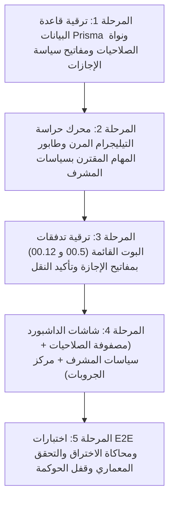

# 📋 خطة عمل رقم 69 (المرجع المعماري والبرمجي المعتمد - النسخة الماسية النهائية الشاملة): المنظومة المؤسسية للأدوار ومصفوفة الصلاحيات المتوارثة (Cascading RBAC) وأتمتة دورة حياة المشرفين وهندسة جروبات وتوبيكات تيليجرام
## Hardened Enterprise Cascading RBAC, Dynamic Permissions Matrix Hub, Resilient Supervisor Lifecycle Automation, Configurable Leave Policies & Telegram Groups Suite

> **مرجع الخطة الدائم:** `docs/work-plans/69-plan-enterprise-cascading-rbac-and-supervisor-lifecycle-automation.md`  
> **تاريخ التحرير والاعتماد النهائي:** 18-09-2026  
> **الحالة:** 🟢 مسودة تنفيذية ماسية معتمدة كلياً بعد إضافة التحكم الدقيق في سياسات الإجازات (Diamond Master Blueprint)  
> **الميثاق المرجعي:** بنود 1.1، 1.2، 1.4، 1.5، 2.1، 2.2، 2.5، و 2.8 من `AGENTS.md` و `GEMINI.md`، مخرجات جلسات العصف الذهني التفاعلية عبر `/grill-me`، والتدقيق الجنائي للأمان والتحكم الميداني المرن.

---

## 🧭 1. ميثاق المبدأ الحاكم وأهداف الخطة (Executive Strategic Rationale)

تُعد هذه الوثيقة **المرجع الهندسي والتنفيذي الأعلى والوحيد** لتحويل نظام الصلاحيات والأدوار في منظومة السعادة سمارت بوت إلى بنية تحتية مؤسسية ذكية، فائقة الأمان والسرعة.

### 🌟 خلاصة المقترحات والتحصينات الهندسية المدمجة كلياً:
1. **التحكم الدقيق في سياسة الإجازات لكل مشرف (Configurable Leave Policy Engine) [NEW]:**
   - إضافة مفتاحين مستقلين في بطاقة كل مشرف (`User` model) يُضبطان من الداشبورد والبوت معاً:
     * `freezeBotAccessOnLeave Boolean @default(true)`: تجميد/استمرار صلاحيات البوت الإشرافية أثناء الإجازة.
     * `ejectTelegramOnLeave Boolean @default(true)`: استبعاد/إبقاء المشرف في جروب تيليجرام الموقع أثناء الإجازة.
   - **الوضع الافتراضي الصارم:** مفعّلان تلقائياً (`true`) لأي مشرف جديد حمايةً لأسرار الموقع، مع إمكانية استثناء أي مشرف بضغطة زر واحدة لمنحه مرونة متابعة العمل عن بُعد أثناء إجازته.
2. **النموذج الهجين الذكي (Smart Hybrid UX):**
   - **لوحة التحكم (الداشبورد):**
     * إدارة **مصفوفة الصلاحيات الشجرية الشاملة (`/admin/settings/matrix`)** لكافة موديولات وتدفقات المنظومة الـ 27 بالحالات الثلاثية (`ALLOW / DENY / INHERITED`).
     * إدارة **مجموعات وتوبيكات تيليجرام الميدانية والمركزية (`/admin/settings/telegram-groups`)**: لوحة تحكم كاملة تعرض جروب الإدارة العليا وتوبيكاته الأربعة، ومصفوفة المواقع مع حالة كل جروب (Chat ID، فحص صلاحيات البوت كأدمن، وزر فحص الاتصال الحي Ping).
   - **بوت التيليجرام (قسم الإعدادات):** يختص بـ **الإجراءات الميدانية التنفيذية السريعة والحاسمة** عبر ترقية التدفقين القائمين `00.5` و `00.12` لتنفيذ النقل، الإجازات، ترقية وعزل العمال المشرفين، وتخصيص سياسة إجازة المشرف في أقل من ثانيتين.
3. **التمييز الحاسم بين "مشرف الموقع" و"العامل المشرف":**
   - **مشرف الموقع (`FIELD_ADMIN`):** دور قيادي مظلي شامل للموقع؛ بمجرد تعيينه وربطه بالموقع، **تُفتح له تلقائياً كافة الوظائف الميدانية للموقع بالكامل دفعة واحدة دون اختيار وظيفة وظيفة**، مع الحظر التشفيري الصارم للرواتب (`isFieldMasked`) والوظائف السيادية للإدارة العليا.
   - **العامل المشرف (`WORKER_SUPERVISOR`):** مخصص حصراً للعمال العاديين الذين يتم تفويضهم على مهام محددة فقط (وقود، كانتين، سكن، وردية) عبر قوالب معيارية بضغطة زر.
4. **استئصال ثغرة فهارس `NULL` في PostgreSQL:** اعتماد نموذج المحدّد الصريح للنطاق (`scopeType` + `scopeId`) لقيد الفهرس الفريد `@@unique([scopeType, scopeId, featureKey, action])`.
5. **ميثاق الأمان العسكري (Strict Least Privilege):** تطبيق قاعدة **الحظر الصريح يغلب المنح دائماً (`Explicit DENY Trumps ALLOW`)** مع الحصانة السيادية المطلقة للسوبر أدمن.
6. **أمان واجهات التيليجرام وسقف الـ 64 بايت:**
   - ضغط بيانات الأزرار (`callback_data`) عبر مرمز الاختصارات الرقمية (Compact Short-Slug Codec) إلى أقل من **24 بايت** منعاً لخطأ `BUTTON_DATA_INVALID`.
   - تطبيق **قفل التكرار الموزع (Redis Idempotency Lock)** لمدة 5 ثوانٍ لحماية العمليات الحساسة من النقر المزدوج (Double-Click Replay).
   - حظر فتح كروت الإدارة في المجموعات وفرض **صمام الأمان للخاص حصراً (`Private-Chat-Only Guard`)**.
   - منع سرقة روابط المجموعات عبر تفعيل **روابط الدعوة المشروطة بالموافقة (`creates_join_request: true`)** ومطابقة المعرف الرقمي آلياً.
7. **طابور مهام حراسة التيليجرام المرن (`TelegramEnforcementTask`):** فصل استدعاءات التيليجرام عن المعاملات الإدارية لمنع التوقف النصفي (Split-Brain) وتفادي أخطاء الـ Rate Limit.
8. **مقاومة تزاحم الكاش (Anti-Cache-Stampede):** إبطال موجه للكاش بنطاق الكيان المعدل فقط مع قفل تسلسلي قصير (Single-flight Lock) لضمان استجابة البوت بأحدث الصلاحيات في أقل من 5ms.
9. **إلزامية اسم الشهرة (Section 2.5):** عرض العمال في قوائم البوت بـ **اسم الشهرة (Nickname)** حصراً عبر `UniversalWorkerPicker` مع تصفية العمال باختيار الموقع أولاً.
10. **العزل الذري للنطاق الميداني:** إسقاط وإلغاء كافة تفويضات الموقع القديم تلقائياً وفورياً بمجرد نقل المشرف أو العامل لموقع جديد.

---

## 🗺️ 2. فهرس الصلاحيات والموديولات المعتمدة في المصفوفة (Master Feature Keys Catalog)

| الموديول | مفتاح الصلاحية (`featureKey`) | المسمى العربي | العمليات المتاحة (`actions`) |
| :--- | :--- | :--- | :--- |
| **Workforce** | `workforce.worker.view` | استعراض دليل وبطاقة العامل 360° | `view`, `export`, `print` |
| | `workforce.worker.create` | تسجيل وتعيين عامل جديد | `create`, `submit` |
| | `workforce.compensation.view` | استعراض المستحقات المالية والرواتب | `view` (Strict Masking) |
| | `workforce.compensation.edit` | تعديل الرواتب والمستحقات المالية | `edit`, `manage` (Super Admin Only) |
| | `workforce.clearance.create` | مخالصات إنهاء الخدمة | `create`, `submit`, `settle` |
| | `workforce.attendance.create` | تسجيل حضور وانصراف الوردية | `create`, `submit`, `view` |
| **Advances** | `advances.cash.create` | تسجيل سلفة نقدية للعامل | `create`, `submit` |
| | `advances.in_kind.create` | تسجيل مسحوب عيني | `create`, `submit` |
| | `advances.withdrawals.view` | كشف حساب مسحوبات وسلف العامل | `view`, `export` |
| **Canteen** | `canteen.sale.create` | صرف مبيعات ومسحوبات الكانتين | `create`, `submit` |
| | `canteen.inventory.view` | جرد واستعراض مخزون الكانتين | `view`, `export` |
| | `canteen.restock.create` | توريد واستلام بضاعة للكانتين | `create`, `submit` |
| **Custody** | `custody.expense.create` | تسجيل مصروف عهدة موقع | `create`, `submit` |
| | `custody.settlement.create` | تصفية وتسوية العهدة المالية | `create`, `submit`, `settle` |
| | `custody.balance.view` | كشف رصيد وحركات العهدة اللحظي | `view`, `print` |
| **Inventory** | `inventory.fuel.level.create` | تسجيل منسوب وقود السولار اليومي | `create`, `view` |
| | `inventory.fuel.dispense.create` | تموين وقود للمعدات والسيارات | `create`, `submit`, `view` |
| | `inventory.kitchen.issue.create` | صرف مخزن المطبخ والإعاشة | `create`, `view` |
| **Housing** | `housing.assignment.create` | تسكين العمال في الكرفانات والأسِرّة | `create`, `edit`, `view` |
| | `housing.inspection.create` | التفتيش الدوري على نظافة السكن | `create`, `submit` |
| **Tasks** | `site.task.dispatch` | إسناد وتوجيه المهام الميدانية | `create`, `edit`, `view` |
| | `phosphate.slip.create` | بونات نقل واستخراج الفوسفات | `create`, `submit`, `print` |
| **Approvals** | `requests.bonus.submit` | رفع طلب مكافأة أو جزاء أو سلفة استثنائية | `submit`, `withdraw`, `view` |
| | `requests.bonus.approve` | اعتماد طلبات المكافآت والجزاءات | `approve`, `reject` |
| **Settings** | `system.roles.manage` | إدارة المستخدمين والأدوار والتعيينات | `view`, `edit`, `manage` |
| | `system.matrix.manage` | التحكم في مصفوفة الصلاحيات والتوارث | `view`, `edit`, `manage` |
| | `system.telegram_groups.manage` | إدارة وربط مجموعات وتوبيكات تيليجرام | `view`, `edit`, `manage` |
| | `system.audit.view` | استعراض سجلات التدقيق الجنائي | `view`, `export` |

---

## 🎯 3. منهجية التنفيذ المتتابعة (Phased Sequential Execution)



---

## 🔬 4. التفاصيل البرمجية الشاملة والمحصنة لكل مرحلة (Detailed Blueprint)

---

### 🧱 المرحلة الأولى: قاعدة البيانات المحصنة ومحرك التوارث الحازم (`packages/database` & `packages/rbac`)

#### 1.1 المعمارية المصححة للنماذج في `schema.prisma`
* **الملف المتأثر:** [`packages/database/prisma/schema.prisma`](file:///f:/Alsaada-Smart-Bot/packages/database/prisma/schema.prisma)
* **التعديلات الجوهرية في نموذج `User`:**
  إضافة حقلي سياسة الإجازات الميدانية:
  ```prisma
  // تحديث في نموذج User:
  model User {
    ...
    freezeBotAccessOnLeave Boolean   @default(true) // 🛡️ تجميد صلاحيات البوت أثناء الإجازة
    ejectTelegramOnLeave   Boolean   @default(true) // 🛡️ الاستبعاد من جروب تيليجرام أثناء الإجازة
    ...
  }
  ```
* **التعديلات في نموذج `Site`:**
  إضافة حقل `telegramTopicId Int?` لدعم توبيكات المنتديات (Forum Topics):
  ```prisma
  model Site {
    ...
    telegramGroupId      BigInt?
    telegramTopicId      Int?    // 🛡️ معرف التوبيك داخل السوبرجروب (Forum Thread ID)
    ...
  }
  ```
* **الكود البرمجي لنماذج الصلاحيات وسجل الحركات:**
  ```prisma
  // 🛡️ الصلاحيات المتوارثة المحصنة تشفيرياً وفهرسياً ضد ثغرة الـ NULL
  model BotMenuPermission {
    id         String   @id @default(uuid())
    scopeType  String   // "ROLE" | "DEPARTMENT" | "JOB_TITLE" | "SITE" | "USER"
    scopeId    String   // Role name (e.g. 'FIELD_ADMIN') or UUID of (Department, JobTitle, Site, User)
    featureKey String   // e.g. "advances.cash.create", "canteen.sale.create"
    action     String   @default("view") // "view" | "create" | "edit" | "approve" | "export" | "manage"
    policy     String   @default("ALLOW") // "ALLOW" | "DENY" (Explicit DENY trumps ALLOW)
    createdAt  DateTime @default(now())
    updatedAt  DateTime @updatedAt

    @@unique([scopeType, scopeId, featureKey, action])
    @@index([scopeType, scopeId])
    @@index([featureKey, action])
    @@map("bot_menu_permissions")
  }

  // 🛡️ سجل دورة حياة وحركات المشرفين والتدقيق الأمني
  model SupervisorLifecycleLog {
    id                 String    @id @default(uuid())
    userId             String
    workerId           String?
    actionType         String    // "SITE_TRANSFER" | "LEAVE_START" | "LEAVE_RETURN" | "TERMINATION" | "PROMOTION" | "DEMOTION"
    previousSiteId     String?
    newSiteId          String?
    telegramGroupId    BigInt?
    telegramTopicId    Int?
    telegramAction     String?   // "KICKED" | "BANNED" | "INVITE_SENT" | "RESTORED" | "SKIPPED_POLICY" | "FAILED"
    telegramError      String?   // توثيق سبب تعثر استدعاء تيليجرام (مثال: CANNOT_REMOVE_ADMIN)
    notes              String?
    actorTelegramId    BigInt
    createdAt          DateTime  @default(now())

    user User @relation(fields: [userId], references: [id], onDelete: Cascade)

    @@index([userId, actionType])
    @@index([createdAt])
    @@map("supervisor_lifecycle_logs")
  }

  // 🛡️ طابور مهام حراسة التيليجرام المرن (Resilient Telegram Enforcer Queue)
  model TelegramEnforcementTask {
    id          String    @id @default(uuid())
    siteId      String
    telegramId  BigInt
    chatId      BigInt
    topicId     Int?
    taskType    String    // "KICK_MEMBER" | "BAN_MEMBER" | "GENERATE_INVITE" | "VERIFY_MEMBERSHIP"
    status      String    @default("PENDING") // "PENDING" | "PROCESSING" | "COMPLETED" | "FAILED"
    retryCount  Int       @default(0)
    maxRetries  Int       @default(5)
    lastError   String?
    executeAt   DateTime  @default(now())
    completedAt DateTime?
    createdAt   DateTime  @default(now())

    @@index([status, executeAt])
    @@map("telegram_enforcement_tasks")
  }
  ```

#### 1.2 خوارزمية التوارث الحازم (Explicit DENY Engine) في `packages/rbac/src/evaluator.ts`
* تطبيق قاعدة الأسبقية الصارمة مع مراعاة سياسة الإجازة:
  1. إذا كان `isBanned === true` أو `isActive === false` ➔ منع قاطع (`DENIED`).
  2. الحصانة السيادية للسوبر أدمن (`SUPER_ADMIN`) ➔ منح مطلق غير قابل للمس (`GRANTED`).
  3. **فحص المشرف في إجازة (Leave Status Check):**
     - إذا كان المشرف في إجازة وكان `user.freezeBotAccessOnLeave === true` ➔ يُعامل كعامل عادي (`WORKER`) وتُجمد صلاحياته الإشرافية.
     - إذا كان `user.freezeBotAccessOnLeave === false` ➔ يحتفظ بكامل صلاحياته الإشرافية كـ `FIELD_ADMIN`.
  4. **مشرف الموقع (`FIELD_ADMIN`):** منح تلقائي وشامل لكافة عمليات الموقع مع تطبيق الحجب التشفيري للرواتب (`isFieldMasked`) واستبعاد العمليات السيادية.
  5. فحص الحظر الصريح المباشر للمستخدم (`USER:DENY`) ➔ منع فوري.
  6. فحص الحظر الصريح للموقع الميداني (`SITE:DENY`) ➔ حجب الميزة في هذا الموقع.
  7. فحص الحظر الصريح للمسمى الوظيفي أو القسم (`JOB_TITLE:DENY` / `DEPARTMENT:DENY`).
  8. فحص المنح الإيجابي (`Supervisory Profile` -> `Job Title` -> `Department` -> `Base Role`).
  9. المنع الافتراضي الصارم (`DENIED_BY_DEFAULT`).

---

### ⚡ المرحلة الثانية: محرك حراسة التيليجرام المرن والمزامنة المحمية (`apps/bot-server`)

#### 2.1 منطق تنفيذ الإجازة المقترن بسياسات المشرف في `SupervisorLifecycleService`
* عند استلام أمر بدء إجازة المشرف (`LEAVE_START`):
  ```typescript
  // 1. فحص سياسة تجميد البوت
  if (user.freezeBotAccessOnLeave) {
    await tx.user.update({ where: { id: user.id }, data: { role: 'WORKER' } });
  }

  // 2. فحص سياسة استبعاد التيليجرام
  if (user.ejectTelegramOnLeave && site.telegramGroupId) {
    await this.enforcer.dispatchKickTask({
      siteId: site.id,
      chatId: site.telegramGroupId,
      telegramId: user.telegramId,
      topicId: site.telegramTopicId,
    });
  } else {
    // توثيق الاستثناء في سجل الحركات
    await tx.supervisorLifecycleLog.create({
      data: {
        userId: user.id,
        actionType: 'LEAVE_START',
        telegramAction: 'SKIPPED_POLICY',
        notes: 'تم الإبقاء في الجروب بموجب سياسة المشرف المخصصة',
        actorTelegramId,
      }
    });
  }
  ```

---

### 🤖 المرحلة الثالثة: ترقية تدفقات قسم الإعدادات في البوت (`00.5` و `00.12`)

#### 3.1 ترقية تدفق تعيين وتوزيع مدراء المواقع (`00.5-admin-assignment`)
* **الملفات المتأثرة:**
  - `modules/settings/src/flows/00.5-admin-assignment/flow.handler.ts`
  - `modules/settings/src/flows/00.5-admin-assignment/flow.keyboard.ts`
  - `modules/settings/src/flows/00.5-admin-assignment/flow.messages.ts`
* **الإضافات الميدانية:**
  1. حظر المجموعات الصارم: منع فتح الكارت إلا في الخاص (`Private-Chat-Only`).
  2. أزرار دورة الحياة: (نقل لموقع آخر، بدء إجازة، عودة من الإجازة، إنهاء خدمة وعزل).
  3. **زر ضبط سياسة الإجازات للمشرف:** `[ ⚙️ سياسة الإجازة: تجميد البوت (✔) | حجب الجروب (✔) ]` يتيح للأدمن تبديل الخيارين بنقرة زر واحدة من البوت.
  4. بطاقة المراجعة والتأكيد (`Confirmation Card`): توضيح الأثر الميداني والتيليجرامي الدقيق مع زري `[ ✅ تأكيد ]` و `[ ❌ إلغاء ]`.

#### 3.2 ترقية تدفق إدارة الأدوار وتفويض العمال (`00.12-user-rbac-management`)
* **الملفات المتأثرة:**
  - `modules/settings/src/flows/00.12-user-rbac-management/flow.handler.ts`
  - `modules/settings/src/flows/00.12-user-rbac-management/flow.keyboard.ts`
  - `modules/settings/src/flows/00.12-user-rbac-management/flow.messages.ts`
* **الإضافات الميدانية:**
  1. **الالتزام الإلزامي بـ `UniversalWorkerPicker`:** اختيار الموقع أولاً ثم اختيار العامل مع عرض **اسم الشهرة (Nickname)** حصراً عملاً بالميثاق (Section 2.5).
  2. ترقية العامل المشرف واختيار قالبه بنقرة واحدة (1=وقود، 2=كانتين، 3=سكن، 4=وردية).
  3. زر `[ 🔴 سحب صفة الإشراف الفوري ]` مع تأكيد سريع.
  4. بطاقة الصلاحيات الملخصة الذكية مع زر: `[ 🌐 فتح وضبط في الداشبورد ]`.

---

### 🌐 المرحلة الرابعة: واجهات الداشبورد المتكاملة (`apps/admin-dashboard`)

#### 4.1 مركز مصفوفة الصلاحيات التفاعلي `/admin/settings/matrix`
* شجرة موديولات بصرية تدعم فلاتر الأدوار، الأقسام، المسميات الوظيفية، والمواقع.
* شارات ثلاثية الحالة ملونة: 🟢 مسموح صراحة، 🔴 محظور صراحة، ⚪ موروث تلقائياً.
* مؤشر المزامنة الحية عبر Redis مع زر تعميم وتحديث كاش البوت.

#### 4.2 مركز إدارة وربط مجموعات وتوبيكات تيليجرام بالداشبورد `/admin/settings/telegram-groups`
* إدارة جروب الإدارة العليا وتوبيكاته الأربعة وفحص الاتصال الحي.
* مصفوفة مجموعات وتوبيكات المواقع الميدانية ودعم `telegramGroupId` و `telegramTopicId`.

#### 4.3 تطوير شاشة إدارة المستخدمين والمشرفين `/admin/settings/users`
* بطاقات المشرفين مع مفتاحي سياسة الإجازة:
  - `[Toggle]` تجميد صلاحيات البوت عند الإجازة.
  - `[Toggle]` الاستبعاد من جروب تيليجرام عند الإجازة.
* نافذة إجراءات دورة الحياة، ودرج إدارة العمال المشرفين.

---

### 🛡️ المرحلة الخامسة: الاختبارات الشاملة وقفل الحوكمة التشفيري (Verification & Lock)

#### 5.1 حزمة الاختبارات المؤتمتة الصارمة
1. `packages/rbac/tests/cascading-evaluator.spec.ts`: فحص التوارث، سياسة الإجازة المخصصة، وأسبقية DENY، وحصانة السوبر أدمن وحجب الرواتب لـ FIELD_ADMIN.
2. `apps/bot-server/tests/telegram-group-enforcer.spec.ts`: فحص هجرة المعرفات، فحص العضو الأدمن، طرد التيليجرام، وتطبيق استثناءات سياسة الإجازة (`SKIPPED_POLICY`).
3. `modules/settings/src/flows/00.5-admin-assignment/tests/flow.unit.spec.ts`: اختبار أزرار النقل، تبديل مفاتيح الإجازة، وقفل التكرار (Idempotency).
4. `modules/settings/src/flows/00.12-user-rbac-management/tests/flow.unit.spec.ts`: اختبار اختيار العمال باسم الشهرة وترقية وعزل العمال المشرفين.
5. `apps/admin-dashboard/tests/permissions-matrix.spec.ts`: اختبار مصفوفة الصلاحيات والـ APIs.
6. `apps/admin-dashboard/tests/telegram-groups.spec.ts`: اختبار واجهات ومسارات إدارة مجموعات وتوبيكات تيليجرام بالداشبورد.

#### 5.2 التحقق المعماري وقفل الحوكمة
1. تشغيل `pnpm governance:verify` للتأكد من استيفاء كافة البوابات المعمارية.
2. تحديث سجل الترحيل والميزات المستحدثة في `docs/19`.
3. الاستفسار الرسمي للقفل التشفيري بصيغة «نعم اقفل» ثم تشغيل `pnpm governance:lock`.

---

## 📊 5. مصفوفة التحقق والقبول الفني (Verification Matrix)

| المعيار | الهدف المطلوب | أداة الفحص | النتيجة المستهدفة |
| :--- | :--- | :--- | :--- |
| **تخصيص سياسة إجازة المشرف** | استثناء المشرف من الحجب عند تعطيل المفتاحين | Lifecycle Service Test | 🟢 Pass (Custom Policy Respected) |
| **هجرة الجروبات التلقائية** | تحديث الـ Chat ID عند ترقية السوبرجروب | Bot Migration Handler Test | 🟢 Pass (Auto-Migrated) |
| **فحص العضو الأدمن قبل الطرد** | منع الخطأ والتنبيه في حال كان المشرف أدمن | Pre-flight Member Check Test | 🟢 Pass (Admin Guarded) |
| **دعم التوبيكات الميدانية** | دعم `telegramTopicId` في السوبرجروب | Forum Routing Unit Test | 🟢 Pass (Topic Routed) |
| **شاشة مجموعات تيليجرام بالداشبورد** | واجهة متكاملة لربط الجروبات وفحصها | E2E & Route Test | 🟢 Pass (HQ & Sites) |
| **شمولية إشراف FIELD_ADMIN** | فتح كافة عمليات الموقع دون اختيار مسمى | RBAC Evaluator Test | 🟢 Pass (Full Site Scope) |
| **حجب الرواتب لمشرف الموقع** | حجب الرواتب التلقائي تشفيرياً | Masking Security Test | 🟢 Pass (Masked 100%) |
| **سقف Callback Data في البوت** | أقل من 24 بايت (أقصى حد 64 بايت) | اختبار سلامة أزرار التيليجرام | 🟢 Pass (< 24 bytes) |
| **عرض اسم الشهرة حصراً** | منع عرض الاسم الرباعي في أزرار العمال | `UniversalWorkerPicker` Test | 🟢 Pass (Nickname Only) |
| **سلامة فهارس PostgreSQL** | منع التكرار بدون ثغرات `NULL` | استعلامات قيد الفريد في Prisma | 🟢 Pass (Zero NULL Bugs) |
| **سرعة الاستجابة اللحظية** | < 5ms لتحديث صلاحيات البوت | Redis Targeted Invalidation Bench | 🟢 Pass (< 5ms) |
| **نظافة التايب سكريبت** | صفر Any وصفر تحذيرات | `pnpm check:types` | 🟢 Pass (Strict 100%) |

---

## 📌 6. الملاحظات الختامية وطلب الاعتماد

هذه الخطة تمثل المرجع النهائي الموحد والشامل لكل من **واجهة بوت التيليجرام** و**لوحة التحكم**.

> 📝 **للبدء في تنفيذ المرحلة الأولى فوراً، يرجى التكرم بالضغط على زر «Proceed» أو تأكيد الموافقة للانطلاق.**
