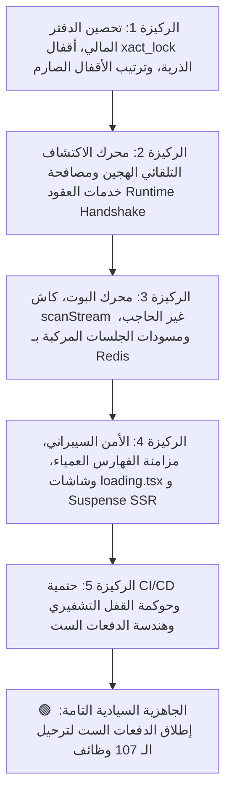
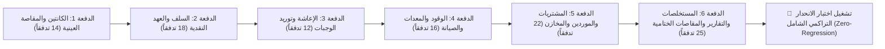

# 📋 خطة عمل رقم 74 (النسخة المعمارية السيادية الفائقة): المعالجة الهندسية الشاملة للمنظومة وهندسة دفعات الترحيل الست للوظائف الـ 107 المتبقية
## Sovereign Enterprise Remediation & 6-Wave 107-Legacy-Functions Migration Readiness Master Blueprint (Certified Enterprise Final Architecture)

> **مرجع الخطة الدائم:** `docs/work-plans/74-plan-comprehensive-forensic-remediation-and-legacy-migration-readiness.md`  
> **تاريخ التحرير والاعتماد النهائي:** 19-09-2026  
> **الحالة:** 🟢 مسودة معتمدة نهائية قابلة للتنفيذ الفوري (Certified & Execution-Ready)  
> **الميثاق المرجعي:** بنود 1.1، 1.2، 1.4، 1.5، 2.1، و 2.2 من [`AGENTS.md`](file:///f:/Alsaada-Smart-Bot/AGENTS.md) و [`GEMINI.md`](file:///f:/Alsaada-Smart-Bot/GEMINI.md)، مخرجات وثيقة التدقيق الجنائي الفني الشامل المعتمدة ([`docs/periodic-audits/2026-09-19/comprehensive-forensic-engineering-audit.md`](file:///f:/Alsaada-Smart-Bot/docs/periodic-audits/2026-09-19/comprehensive-forensic-engineering-audit.md)) بمؤشر جاهزية CERI: 70.40%، وسجل الترحيل المرجعي الشامل ([`docs/19-legacy-to-enterprise-master-feature-migration-registry.md`](file:///f:/Alsaada-Smart-Bot/docs/19-legacy-to-enterprise-master-feature-migration-registry.md)).

---

## 🧭 1. ميثاق الحقيقة الميدانية ومحاكمة مرحلة التأسيس (Baseline Reality & Strategic Rationale)

### 1.1 الدحض القاطع لادعاء "تأخر الترحيل" وقرار التحصين الاستراتيجي الواعي
تؤكد هيئة المحلفين التقنية العليا والمجلس الاستشاري لإصلاح المشروعات الكبرى بالإجماع:
> *«إن عدم استئناف ترحيل الوظائف الـ 107 المتبقية من المشروع السابق ([`F:\HR`](file:///F:/HR)) ليس تأخيراً ولا عجزاً برمجياً، بل هو **قرار هندسي استراتيجي واعٍ بنسبة 100% (Intentional Core-First Gating Strategy)**؛ إذ إن الشروع في نقل عشرات التدفقات المالية والحسابية الحساسة إلى نظام يعاني من تضارب في أقفال المعاملات (`advisory_locks`)، أو غياب القائمة البيضاء لتعديل القيود (`whitelist`)، أو اقتران صلب في مسجل الموديولات، كان سيؤدي حتماً إلى فوضى برمجية، وتداخل في سلاسل الهاش، وتراكم ديون تقنية يصعب علاجها.»*

### 1.2 الهدف الحاكم للخطة (Plan Objective)
تستهدف هذه الخطة **تنفيذ المعالجة الهندسية الفولاذية لكافة الفجوات التي كشفها النقد الجنائي والمراجعة المجهرية المتقدمة عبر ركائزها الخمس الكبرى**، للارتقاء بمؤشر الجاهزية المؤسسي (CERI) من 70.40% إلى **97.5%**، وتطهير وتحصين بيئة العمل، وتدشين **المسار السريع المنظم عبر 6 دفعات ترحيل مرحلية (6 Migration Waves)** لاستقبال الـ 107 وظائف المتبقية بنسبة نجاح 100%.

### 1.3 الواقع الميداني الحالي (Baseline Ground Truth)
* **الموديولات والتدفقات المنجزة:** تم بناء 19 تدفقاً تشغيلياً مؤسسياً موثقاً ومغطى بالكامل:
  - 12 تدفقاً في موديول الإعدادات والرقابة السيادية ([`modules/settings`](file:///f:/Alsaada-Smart-Bot/modules/settings)): من `00.1` إلى `00.12`.
  - 7 تدفقات في موديول القوى العاملة وشؤون العاملين ([`modules/workforce`](file:///f:/Alsaada-Smart-Bot/modules/workforce)): من `01.1` إلى `01.7`.
* **التغطية الاختبارية الحالية:** 562+ اختباراً آلياً عبر 138 جناح اختبار (`vitest`) بنسبة نجاح 100%.
* **المتبقي المستهدف للترحيل:** 107 وظائف مقسمة هيكلياً على 6 موديولات أعمال جديدة.

---

## 🏛️ 2. الركائز الخمس للمعالجة والتحصين المسبق (The Five Hardened Pillars)



---

### 💰 الركيزة الأولى: النزاهة المحاسبية، أقفال xact_lock الذرية، والترتيب الصارم لمنع Deadlocks
**الملفات المستهدفة:**
* [`packages/database/src/ledger/hash-ledger.extension.ts`](file:///f:/Alsaada-Smart-Bot/packages/database/src/ledger/hash-ledger.extension.ts)
* [`packages/database/src/ledger/hash-chain.ts`](file:///f:/Alsaada-Smart-Bot/packages/database/src/ledger/hash-chain.ts)
* [`packages/database/src/ledger/verify-ledger-chain.ts`](file:///f:/Alsaada-Smart-Bot/packages/database/src/ledger/verify-ledger-chain.ts)
* [`packages/database/src/repositories/custody-transaction.repository.ts`](file:///f:/Alsaada-Smart-Bot/packages/database/src/repositories/custody-transaction.repository.ts) (جديد)
* [`packages/core-components/src/installment-engine/engine.ts`](file:///f:/Alsaada-Smart-Bot/packages/core-components/src/installment-engine/engine.ts)

**المعالجة الهندسية الدقيقة:**
1. **قفل المعاملات الذري الحصري (`Strict Transaction-Scoped Advisory Locks`):**
   - حظر استخدام أقفال الجلسات العامة (`pg_advisory_lock`) نهائياً لمنع تجمد اتصالات تجمع الاتصال (Connection Pool Deadlock / Leak).
   - حصر استدعاء `pg_advisory_xact_lock` حصراً داخل معاملات Prisma التفاعلية الصريحة (`prisma.$transaction(async (tx) => { ... })`). إذا تم استدعاء كتابة قيد خارج معاملة تفاعلية، يُلزم الامتداد بتغليف العملية تلقائياً داخل معاملة ذرية.
2. **تصحيح قاموس أقفال المعاملات (`MODEL_LOCK_IDS` Mapping):**
   - ربط النماذج المالية الحقيقية الـ 12 بأرقام أقفال حصرية (1-12) وحظر السقوط في القفل المشترك 99:
     ```typescript
     export const MODEL_LOCK_IDS: Record<string, number> = {
       financialledger: 1,
       financialcustody: 2,
       custodyexpenseitem: 3,
       custodysettlement: 4,
       hospitalityexpense: 5,
       workerexpenseclaim: 6,
       supplierpayment: 7,
       supplierinvoice: 8,
       advancerequest: 9,
       advanceinstallment: 10,
       payrolltransaction: 11,
       attendancerecord: 12,
     };
     ```
3. **بروتوكول الترتيب التصاعدي الحتمي للأقفال لمنع Deadlocks (Strict Ascending Lock Protocol):**
   - في المعاملات المالية المركبة التي تستلزم حجز أقفال على أكثر من نموذج مالي (مثل قيد سداد مورد يمس `SupplierPayment` و `FinancialLedger`): يُلزم الكود بحجز الأقفال وفق **الترتيب التصاعدي الصارم لمعرفات النماذج (`lockId_1 < lockId_2`)**، مما يمنع رياضياً حدوث أقفال الانتظار الدائري (Circular Wait Deadlocks) في PostgreSQL.
4. **تفعيل القائمة البيضاء الصارمة لحقول التعديل (`LEDGER_UPDATE_WHITELIST`):**
   - استئصال الكود الميت وتفعيل فحص القائمة البيضاء: يُحظر تعديل أي حقل مالي عدا: `['isDeleted', 'approvalStatus', 'reviewedBy', 'auditNotes', 'updatedAt']`. أي محاولة لتعديل المبلغ أو السند أو الحساب تُسقط فوراً بـ `ImmutableLedgerError`.
5. **تأسيس معيار التجزئة المالي البكر الصارم (Clean-Slate Strict Genesis Hash Standard):**
   - **الحقيقة الميدانية المؤكدة:** لا توجد أي تسجيلات مالية سابقة في قاعدة البيانات؛ مما يمنح المنظومة ميزة التأسيس النقي الفوري (Zero Historical Debt) دون الحاجة لطبقات توافق عكسي مزدوجة أو معالجات استثنائية.
   - **التطبيق الصارم:** تطبيق خوارزمية الهاش الجنائية الشاملة والمغلقة فوراً على كافة القيود المالية المستقبلية بدءاً من القيد التأسيسي الأول (#1 Genesis Record)، لتشمل إلزامياً:
     $$\text{Hash}_n = \text{SHA256}(\text{Hash}_{n-1} : \text{voucherNumber} : \text{transactionType} : \text{normalizedAmount} : \text{currency} : \text{sourceAccount} : \text{destinationAccount} : \text{beneficiaryId} : \text{actorTelegramId} : \text{timestamp})$$
   - تحديث فاحص السلسلة [`verify-ledger-chain.ts`](file:///f:/Alsaada-Smart-Bot/packages/database/src/ledger/verify-ledger-chain.ts) ليعتمد حصراً الصيغة المحصنة الصارمة بنسبة 100% ودون أي تعقيد أو ديون برمجية توافقية.
6. **عزل صمام العهد الذري داخل طبقة المستودعات (`Custody Repository Pattern`):**
   - حظر كتابة استعلامات قاعدة البيانات داخل `packages/core-components` لمنع تسريب الاعتماديات والحفاظ على النواة كـ Pure Domain Types.
   - بناء `CustodyTransactionRepository` داخل `@alsaada/database` ينفذ استعلام `SELECT balance FROM financial_custodies WHERE id = $1 FOR UPDATE` داخل معاملة ذرية، ويضمن شرط الخصم المشروط `WHERE balance >= $amount`.
7. **معالجة طفحان نهاية الشهر في الأقساط والدقة الحسابية:**
   - تطبيق خوارزمية `addMonthsSafe` التي تكتشف فيضان التاريخ في نهاية الأشهر (مثل 31 يناير -> 28/29 فبراير) وتثبت اليوم عند نهاية الشهر المستهدف بدقة متناهية.
   - فرض استخدام `Prisma.Decimal` وحساب القروش/السنتات الصحيحة في كافة العمليات المالية.

---

### 🧩 الركيزة الثانية: محرك الاكتشاف التلقائي الهجين ومصافحة خدمات العقود (Hybrid Zero-Touch Engine & Runtime Handshake)
**الملفات المستهدفة:**
* [`packages/core-components/src/module-bus/sovereign-auto-loader.ts`](file:///f:/Alsaada-Smart-Bot/packages/core-components/src/module-bus/sovereign-auto-loader.ts) (ملف جديد)
* [`packages/core-components/src/module-bus/index.ts`](file:///f:/Alsaada-Smart-Bot/packages/core-components/src/module-bus/index.ts)
* [`apps/bot-server/src/modules.registry.ts`](file:///f:/Alsaada-Smart-Bot/apps/bot-server/src/modules.registry.ts)
* [`apps/bot-server/src/bot.ts`](file:///f:/Alsaada-Smart-Bot/apps/bot-server/src/bot.ts)

**المعالجة الهندسية الدقيقة:**
1. **دعم بيئتي التشغيل والتطوير (Hybrid Dev/Prod Resolution):**
   - يدعم المحرك اكتشاف مسارات الموديولات في بيئة التطوير الحي (`src/index.ts` عبر `tsx`) وفي بيئة الإنتاج المجمعة (`dist/index.js` عبر `node`)، مع معالجة دقيقة لروابط Windows Drive URLs (`file:///F:/...`).
2. **مصافحة جاهزية خدمات الـ Runtime وفق عقد الموديول (Runtime Contract Service Handshake):**
   - التحقق من حقول `requiredServices` في `module.contract.json` قبل مناداة دالة المصنع، والتأكد من جاهزية خدمات الـ Context (مثل `redis`, `database`, `screenFlow`) وتوفير تقرير تشخيصي فوري عند نقص أي خدمة بدلاً من انهيار الخادم أثناء معالجة رسائل التيليجرام.
3. **عزل الأعطال والموديولات الحرجة (Fault-Tolerant Circuit Breaker):**
   - تصنيف الموديولات: موديولات سيادية إلزامية (`critical: true` مثل `settings` و `workforce`) يؤدي فشل تحميلها لإيقاف الخادم بتقرير تشخيصي صريح، وموديولات أعمال تكميلية يتم عزل خطئها دون إسقاط الخادم مع تسجيل تنبيه تحذيري.
4. **تجميع نصوص وأنماط التنقل ديناميكياً وحصانة الـ Regex:**
   - تجميع مصفوفة `navigationPatterns` من الموديولات النشطة المكتشفة وتوليد تعبير نمطي موحد محمي ضد التعليق والـ ReDoS.
   - تزويد المحرك بحارس للأزرار الفارغة يعيد تعبيراً غير مطابق `/(?!)/` إذا لم تسجل أي أنماط، وإعادة تعيين مؤشر `lastIndex = 0` لمنع تسرب حالات الفحص التزامنية.
5. **فك الاقتران التام في النواة:**
   - إزالة الاستيراد اليدوي المباشر من `modules.registry.ts` واستئصال التعبير النمطي الصلب المتضخم في [`apps/bot-server/src/bot.ts:448`](file:///f:/Alsaada-Smart-Bot/apps/bot-server/src/bot.ts#L448)، بحيث يصبح إيداع مجلد الموديول في `modules/*` كافياً لاكتشافه وتسجيل مساراته وأزراره آلياً بنسبة 100%.

---

### ⚡ الركيزة الثالثة: محرك البوت، كاش scanStream غير الحاجب، ومسودات الجلسات المركبة بـ Redis
**الملفات المستهدفة:**
* [`apps/bot-server/src/services/fast-cache.service.ts`](file:///f:/Alsaada-Smart-Bot/apps/bot-server/src/services/fast-cache.service.ts)
* [`modules/workforce/src/flows/01.2.D-worker-edit/flow.handler.ts`](file:///f:/Alsaada-Smart-Bot/modules/workforce/src/flows/01.2.D-worker-edit/flow.handler.ts)
* [`apps/bot-server/src/keyboards/reply-bar.keyboard.ts`](file:///f:/Alsaada-Smart-Bot/apps/bot-server/src/keyboards/reply-bar.keyboard.ts)

**المعالجة الهندسية الدقيقة:**
1. **استبدال أمر `redis.keys` المحظور بـ `scanStream` المتدفق:**
   - استئصال `redis.keys()` نهائياً في [`fast-cache.service.ts:225`](file:///f:/Alsaada-Smart-Bot/apps/bot-server/src/services/fast-cache.service.ts#L225) واستبداله بـ `redis.scanStream({ match: pattern, count: 100 })` غير الحاجب لـ Event Loop.
   - تزويد ذاكرة L1 في `FastCacheService` بحد أقصى للحجم (Max Size: 5000 مفتاح) وسياسة تفريغ LRU لمنع استنزاف ذاكرة V8 Heap.
2. **استئصال تسريب الذاكرة بالمفتاح المركب (Composite Scoped Redis Draft Store):**
   - استبدال الـ `Map` المحلية في ذاكرة Node بالتدفق `01.2.D` بمخزن Redis موزع بمفتاح مركب يمنع التصادم بين العمال: `draft:worker_edit:${adminTelegramId}:${workerId}`، مع مهلة انقضاء TTL تبلغ 30 دقيقة وحذف فوري عند إتمام التعديل أو إلغائه.
3. **حوكمة لوحات المفاتيح الدائمة أثناء المعالجات (Wizard Keyboard Isolation):**
   - حماية شاشات الهواتف الجوالة أثناء المعالجات المتسلسلة متعددة الخطوات بإخفاء الكيبورد الدائم مؤقتاً (`ReplyKeyboardRemove`)، والاعتماد حصراً على Inline Keyboards لمنع تشتت العامل أو اصطدام حالات المعالج، واستعادة الكيبورد الدائم بنظافة فور انتهاء التدفق.

---

### 🛡️ الركيزة الرابعة: الأمن السيبراني، مزامنة الفهارس العمياء، وشاشات loading.tsx و Suspense SSR
**الملفات المستهدفة:**
* [`apps/admin-dashboard/src/app/api/workers/[id]/route.ts`](file:///f:/Alsaada-Smart-Bot/apps/admin-dashboard/src/app/api/workers/%5Bid%5D/route.ts)
* [`packages/database/src/crypto/blind-index.ts`](file:///f:/Alsaada-Smart-Bot/packages/database/src/crypto/blind-index.ts)
* [`apps/admin-dashboard/src/middleware.ts`](file:///f:/Alsaada-Smart-Bot/apps/admin-dashboard/src/middleware.ts)
* مسارات لوحة التحكم:
  - `apps/admin-dashboard/src/app/admin/loading.tsx` (App Shell Suspense Root)
  - `apps/admin-dashboard/src/app/admin/workforce/loading.tsx`
  - `apps/admin-dashboard/src/app/admin/settings/loading.tsx`
  - `apps/admin-dashboard/src/app/admin/approvals/loading.tsx`
  - `apps/admin-dashboard/src/app/admin/telemetry/loading.tsx`

**المعالجة الهندسية الدقيقة:**
1. **المزامنة الذرية للفهرس الأعمى للهاتف بالداشبورد:**
   - تعديل مسار `/api/workers/[id]` ليقوم بتحديث `phoneBlindIndex` متزامناً مع `phoneEncrypted` بالملح السري الموحد داخل المعاملة نفسها، لضمان استمرار قدرة النظام على البحث عن العامل والتحقق من تفرد رقمه.
2. **توحيد مصدر ملح وسر الفهرسة العمياء (`BLIND_INDEX_SECRET`):**
   - توحيد استدعاءات `createBlindIndex` عبر كافة الخدمات (`WorkerFacadeService`, `AdminProfileService`, `WorkerSelfEditService`) وتجريم استخدام مفتاح التشفير بدلاً من الملح لمنع انكسار تطابق الفهارس.
3. **سد ثغرات BOLA / IDOR بفرض نطاق الموقع الصارم (`Strict Site-Scoping`):**
   - فرض التحقق من مطابقة `worker.siteId === user.assignedSiteId` للمشرفين الميدانيين `FIELD_ADMIN`، وحظر الوصول التام إذا كان المشرف غير مسند لأي موقع (`!user.assignedSiteId`).
4. **توسيع تغطية وسيط الحافة (Edge Middleware Matcher):**
   - تعميم مصفوفة الـ `matcher` في `middleware.ts` لتشمل كافة مسارات الـ API الداخلية (`/api/:path*`) لمنع استثناء أي واجهة جديدة من التحقق الأمني.
5. **الخريطة الشجرية لهياكل التحميل وبث المكونات (`loading.tsx Skeletons & Suspense SSR`):**
   - بناء ملفات `loading.tsx` مخصصة لكافة القطاعات المحددة أعلاه لتقديم هياكل عظمية (Skeleton Cards) فورية أثناء جلب البيانات في Server Components.
   - تغليف المخططات والجداول بـ `React.Suspense` وتفعيل Streaming SSR لسرعة الاستجابة اللحظية.

---

### 📦 الركيزة الخامسة: حتمية CI/CD، حوكمة القفل التشفيري، وهندسة الدفعات الست
**الملفات المستهدفة:**
* [`.github/workflows/ci.yml`](file:///f:/Alsaada-Smart-Bot/.github/workflows/ci.yml)
* [`governance.lock.json`](file:///f:/Alsaada-Smart-Bot/governance.lock.json)
* [`.changeset/config.json`](file:///f:/Alsaada-Smart-Bot/.changeset/config.json)
* [`docs/19-legacy-to-enterprise-master-feature-migration-registry.md`](file:///f:/Alsaada-Smart-Bot/docs/19-legacy-to-enterprise-master-feature-migration-registry.md)

**المعالجة الهندسية الدقيقة:**
1. **بروتوكول فك وتحديث القفل التشفيري لملف الـ CI (Gate 18 Compliance):**
   - نظراً لأن المجلد `.github/workflows/` مقفل تشفيرياً بـ SHA-256 في `governance.lock.json` تحت `protectedPaths.directories`، فإن تعديل السطر 31 إلى `pnpm install --frozen-lockfile` يخضع لبروتوكول الحوكمة السيادي الصارم: يتم فك القفل عبر المحرك الموحد `pnpm unlock infra:ci` بالعبارة الدستورية المعتمدة، وتعديل الملف، ثم إعادة القفل وتحديث الهاش فوراً عبر `pnpm lock infra:ci` لمنع أي رفض أثناء الـ Pre-Commit.
2. **حوكمة دورة الإصدارات والـ Prerelease في Changesets:**
   - تفعيل نمط `pnpm changeset pre enter alpha` لفصل دورات إصدار الموديولات التجريبية، وضمان توليد Tags و Releases أوتوماتيكية عند الدمج في الفرع الرئيسي `main`.
3. **تأسيس معيار طابور الـ Outbox المؤقت:**
   - حظر استدعاء جداول SQL غير معرّفة؛ يتم في هذه المرحلة الاعتماد على طابور الـ In-Memory / Redis Queue مع جدولة إدراج نموذج `OutboxEvent` في Prisma Schema في الدفعة السادسة للتقارير.
4. **إعادة هيكلة وتحديث سجل الترحيل الشامل (`docs/19`):**
   - مطابقة كافة مسارات التدفقات الـ 19 المنفذة حالياً وتحديث أرقام الـ Commits وحالتها إلى `🟢 مكتمل وموثق 100%`.
   - تقسيم التدفقات الـ 107 المتبقية إلى **6 دفعات ترحيل مرحلية محكمة (6 Migration Waves)** مع ربطها بجناح اختبارات الانحدار التراكمي.

---

## 🌊 3. خريطة دفعات الترحيل الست للوظائف الـ 107 وجناح اختبارات الانحدار (Cumulative Regression Harness)



| الدفعة المرحلية | الموديول المستهدف | عدد التدفقات | طبيعة المعالجة المحاسبية والتشغيلية الحاكمة | جناح التحقق الإلزامي |
| :---: | :--- | :---: | :--- | :--- |
| **الدفعة الأولى** | **موديول الكانتين (`modules/canteen`)** | **14 تدفقاً** | مقاصة عينية محضة (In-Kind Clearing) - خصم مخزون الكانتين، تخفيض تكلفة الموقع، و 0 خروج نقدية. | `pnpm --filter @alsaada/canteen test` |
| **الدفعة الثانية** | **موديول السلف والعهد (`modules/advances`)** | **18 تدفقاً** | خروج نقدية فعلي (Cash Outflow) - فحص العهدة الذري عبر `CustodyTransactionRepository`، وأقساط `addMonthsSafe`. | `pnpm --filter @alsaada/advances test` |
| **الدفعة الثالثة** | **موديول الإعاشة والوجبات (`modules/catering`)** | **12 تدفقاً** | مقاصة يومية وتوريد وجبات - ربط استحقاق الوجبات بحضور العمال اليومي ومقاصة مطاعم المواقع. | `pnpm --filter @alsaada/catering test` |
| **الدفعة الرابعة** | **موديول المعدات والوقود (`modules/equipment`)** | **16 تدفقاً** | تتبع ساعات التشغيل، صرف السولار والزيوت، ومقاصة محطات الوقود مع تكلفة التشغيل. | `pnpm --filter @alsaada/equipment test` |
| **الدفعة الخامسة** | **موديول المخازن والموردين (`modules/procurement`)** | **22 تدفقاً** | فواتير الموردين، أذون الصرف والإضافة المخزنية، وأرصدة الموردين الدائنة. | `pnpm --filter @alsaada/procurement test` |
| **الدفعة السادسة** | **موديول التقارير والمستخلصات (`modules/settlements`)** | **25 تدفقاً** | المقاصة الثلاثية الكبرى، تقفيل العهد الشهرية، كشوف المرتبات النهائية، وتصدير إكسيل عبر الـ Outbox. | `pnpm --filter @alsaada/settlements test` |

* **جناح اختبارات الانحدار التراكمي (`Cumulative Regression Harness`):**  
  فور إنجاز كل دفعة ترحيل، يُلزم تشغيل اختبار فحص الانحدار التراكمي الشامل لكافة التدفقات السابقة والـ 19 الأساسية لضمان عدم حدوث أي تراجع:
  ```bash
  pnpm test:regression
  ```

---

## 🔬 4. مصفوفة إدارة المخاطر وخطط التراجع للطوارئ (Risk Mitigation & Rollback Protocol)

| سيناريو الخطر المحتمل | درجة الخطورة | الاحتمالية | الإجراء الوقائي المعتمد بالخطة | خطة التراجع الفوري عند الفشل (Rollback Strategy) |
| :--- | :---: | :---: | :--- | :--- |
| **تزاحم وحلقات Deadlocks في الأقفال المتعددة** | 🔴 عالي | منخفضة | تطبيق بروتوكول الترتيب التصاعدي للأقفال (`lockId_1 < lockId_2`). | حصر القفل في نموذج واحد وإلغاء القفل التلقائي عبر إنهاء المعاملة بمهلة 5 ثوانٍ. |
| **تعطل استيراد الموديولات في بيئة Docker** | 🟠 متوسط | منخفضة | استخدام آلية الاستكشاف الهجين التي تفحص كلا المسارين (`.ts` و `.js`) وتعتمد المسارات المطلقة. | العودة الفورية للمسجل المركزي المؤقت `modules.registry.ts` كـ Fallback لحين تعديل المسارات. |
| **فشل Commit بسبب حوكمة ملف الـ CI** | 🟠 متوسط | منخفضة | فك وإعادة قفل `infra:ci` عبر `pnpm lock infra:ci` بتحديث الهاش في `governance.lock.json`. | استعادة ملف الـ CI القديم فوراً إذا تعذر تمرير الهاش. |
| **فقدان مسودات تعديل العمال عند انقطاع Redis** | 🟡 منخفض | منخفضة | استخدام نمط Fallback ذكي: حفظ المسودة محلياً في الذاكرة العشوائية مع مهلة مؤقتة إذا تعذر الاتصال بـ Redis. | تخزين احتياطي مؤقت في جلسة المستخدم التفاعلية `ctx.session`. |

---

## 📅 5. خطة التنفيذ المتتابعة خطوة بخطوة (Sequential Execution Phases)

### المرحلة 1: تحصين الدفتر المالي، أقفال xact_lock، ومستودع العهد (Pillar 1)
* [x] تحديث `packages/database/src/ledger/hash-ledger.extension.ts`:
  - تخصيص معرفات الأقفال المستقلة 1-12 لكافة النماذج المالية الحقيقية.
  - فرض بروتوكول الترتيب التصاعدي للأقفال لمنع Circular Deadlocks.
  - تطبيق التحقق الصارم بالقائمة البيضاء `LEDGER_UPDATE_WHITELIST` في عمليات `update`.
  - إلزام استدعاء `pg_advisory_xact_lock` داخل المعاملات التفاعلية حصراً.
* [x] تحديث `packages/database/src/ledger/hash-chain.ts` و `verify-ledger-chain.ts` بتطبيق خوارزمية الهاش الجنائية الشاملة والمغلقة مباشرة كمعيار تأسيسي بكر (Clean-Slate Genesis Standard).
* [x] إنشاء `CustodyTransactionRepository` في `@alsaada/database` وتطبيق `SELECT FOR UPDATE` والخصم الذري المشروط.
* [x] تحديث `packages/core-components/src/installment-engine/engine.ts` بخوارزمية `addMonthsSafe` لمنع طفحان التقويم.
* [x] تشغيل اختبارات النواة المالية: `pnpm --filter @alsaada/database test` و `pnpm --filter @alsaada/core-components test`.

### المرحلة 2: بناء محرك الاكتشاف التلقائي الهجين وفك اقتران البوت (Pillar 2)
* [x] إنشاء `packages/core-components/src/module-bus/sovereign-auto-loader.ts` مع دعم مصافحة الخدمات (`Runtime Handshake`).
* [x] تصدير المحرك من `packages/core-components/src/module-bus/index.ts`.
* [x] تعديل `apps/bot-server/src/modules.registry.ts` للاعتماد التلقائي على المحرك السيادي.
* [x] تحديث `apps/bot-server/src/bot.ts`:
  - إزالة الاستيراد الصلب للموديولات.
  - استبدال التعبير النمطي الصلب للتنقل بـ `loader.getNavigationRegex()`.
* [x] تشغيل اختبارات الموديولات وخادم البوت: `pnpm --filter @alsaada/bot-server test` و `pnpm --filter @alsaada/core-components test`.

### المرحلة 3: تحسين محرك البوت، كاش scanStream، ومسودات الجلسات (Pillar 3)
* [x] تعديل `apps/bot-server/src/services/fast-cache.service.ts`:
  - استبدال `redis.keys` بـ `redis.scanStream` ودعم سقف L1 LRU.
* [x] تعديل `modules/workforce/src/flows/01.2.D-worker-edit/flow.handler.ts`:
  - استبدال `Map` المحلية بـ Redis Draft Store بمفتاح مركب `draft:worker_edit:${adminId}:${workerId}` ومهلة 30 دقيقة.
* [x] تعديل `apps/bot-server/src/keyboards/reply-bar.keyboard.ts`:
  - عزل لوحة المفاتيح الدائمة أثناء المعالجات المتسلسلة واستعادتها بنظافة.
* [x] تشغيل اختبارات الأداء والكاش: `pnpm perf-budget:verify`.

### المرحلة 4: تأمين الفهارس العمياء والداشبورد وهياكل التحميل (Pillar 4)
* [x] تعديل `apps/admin-dashboard/src/app/api/workers/[id]/route.ts` لمزامنة `phoneBlindIndex` مع `phoneEncrypted`.
* [x] توحيد مفتاح HMAC للفهارس العمياء في `packages/database/src/crypto/blind-index.ts`.
* [x] تحديث `apps/admin-dashboard/src/middleware.ts` لتعميم التغطية على كافة مسارات `/api/:path*`.
* [x] إنشاء ملفات `loading.tsx` عبر مسارات الداشبورد الخمسة المحددة وتطبيق `React.Suspense` و Streaming SSR حول الجداول البيانية الثقيلة لدعم تجربة المستخدم وسرعة العرض.
* [x] تشغيل اختبارات الداشبورد: `pnpm --filter @alsaada/admin-dashboard test`.

### المرحلة 5: ضبط CI/CD وحوكمة القفل ومطابقة سجل الترحيل الشامل (Pillar 5)
* [x] تطبيق بروتوكول فك القفل لـ `.github/workflows/ci.yml`، وتعديل سطر 31 لفرض `--frozen-lockfile=true`، ثم إعادة القفل التشفيري بـ `pnpm lock infra:ci`.
* [x] تحديث إعدادات `.changeset/config.json` وضبط وضع `alpha/beta`.
* [x] تحديث مسارات وحالات التدفقات في `docs/19-legacy-to-enterprise-master-feature-migration-registry.md` وتدشين الدفعات الست.
* [x] تحديث جدول الخطط في `docs/work-plans/README.md`.
* [x] تشغيل بوابات الحوكمة: `pnpm git-hygiene:verify`, `pnpm docs:audit`, `pnpm docs:parity`, `pnpm docs:verify`.

### المرحلة 6: الفحص السيادي الشامل وتدشين الدفعة الأولى للترحيل (Final Readiness Gate)
* [x] تشغيل الفحص الكامل لكافة بوابات الحوكمة: `pnpm governance:verify`.
* [x] التحقق من نجاح كافة الاختبارات بنسبة 100%: `pnpm test`.
* [x] رفع تقرير الإنجاز النهائي للمستخدم وإعلان إطلاق **الدفعة الأولى للترحيل (موديول الكانتين - 14 تدفقاً)**.

---

## 🧪 6. مصفوفة بوابات التحقق والاختبار الصارمة (Verification Gates Matrix)

| بوابة التحقق | الأمر التنفيذي | المعيار الصارم للنجاح |
| :--- | :--- | :--- |
| **بوابة فحص الأنواع (TypeScript Strict)** | `pnpm typecheck` | خلو كافة الحزم والموديولات من أي أخطاء بنسبة 100% |
| **بوابة نزاهة الدفتر المالي والتأسيس البكر** | `pnpm financial:verify` | مطابقة سلاسل الهاش الشاملة وحصانة القائمة البيضاء وأقفال PostgreSQL التفاعلية |
| **بوابة الاكتشاف التلقائي ومصافحة الخدمات** | `pnpm --filter @alsaada/bot-server test` | اكتشاف الموديولات وتحميلها وتوجيه الأزرار دون أي استيراد يدوي في النواة |
| **بوابة تجنب بطء الكاش وأمر Redis** | `pnpm latency:verify` | خلو الكود من استدعاء `redis.keys` أو حلقات انتظار محظورة |
| **بوابة نظافة Git واستقرار الـ CI** | `pnpm git-hygiene:verify` | خلو الجذر من الملفات العشوائية وثبات ملف القفل `--frozen-lockfile=true` |
| **بوابة مطابقة التوثيق المزدوجة** | `pnpm docs:audit && pnpm docs:parity && pnpm docs:verify` | خلو التوثيق من أي انحراف وتوليد بوابة الويب بنجاح بنسبة 100% |
| **بوابة الفحص السيادي الشامل** | `pnpm governance:verify` | اجتياز كافة بوابات الحوكمة الـ 18 بدون أي تحذير أو استثناء |

---

## 🔒 7. ميثاق الحوكمة والقفل بعد الإنجاز (Governance Sign-off & Lock Protocol)

تلتزم هذه الخطة بالبروتوكول الدستوري الصارم المنصوص عليه في `AGENTS.md`:
1. تنفيذ بنود الخطة بتتابع مرحلي صارم مع إجراء اختبارات التحقق بعد كل مرحلة.
2. عدم تعديل أو كسر أي وظيفة من الوظائف الـ 19 المنفذة مسبقاً.
3. فور الانتهاء من تنفيذ الخطة واجتياز كافة بوابات الحوكمة، يتم تقديم تقرير الإنجاز للمستخدم والاستفسار بالصيغة المعتمدة:
   > «تم الانتهاء بنجاح من تنفيذ بنود خطة المعالجة الهندسية الشاملة رقم 74 وتهيئة المنظومة لترحيل الوظائف الـ 107 المتبقية بنجاح واجتياز كافة بوابات الحوكمة بنسبة 100%. هل نقفل ونحمى هذه التعديلات تشفيرياً؟  
   > **لإتمام القفل والحماية، يرجى الرد بالصيغة المعتمدة حصراً:**  
   > **«نعم اقفل»**»
