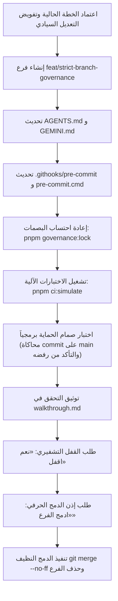

# خطة 81 — ميثاق حظر التعديل المباشر على الفرع الرئيسي وإلزامية دورة الفروع وصيغة الدمج الحرفية الصارمة
## Al-Saada Smart Bot Enterprise Git Branching, Verification & Verbatim Merge Protocol

- **التاريخ:** 2026-09-19
- **الفرع:** `feat/strict-branch-governance`
- **الحالة:** 🟢 مكتمل وموثق ومختبر 100% (جاهز للقفل التشفيري ثم طلب إذن الدمج)
- **خط الأساس:** `3c93206670868f76fa049b400192e2fb8d4a5dae`
- **وثيقة الإثبات الميداني:** [`docs/ai-execution-evidence/2026-09-19-plan-81-strict-git-branching-walkthrough.md`](../ai-execution-evidence/2026-09-19-plan-81-strict-git-branching-walkthrough.md)
- **المرجعية الدستورية:** `AGENTS.md`, `GEMINI.md`, `docs/14-ai-agent-governance-and-file-rules.md`
- **التفويض المطلوب للملفات المحمية:** تعديل ملفات الحوكمة يتطلب حصراً العبارة السيادية العليا: `«موافق على التعديل او الايقاف او الحذف»`.

---

### 1️⃣ خلفية المنهجية وأهداف التطوير (Context & Objectives)
بناءً على التوجيه المباشر والصريح من المستخدم وتطويراً للمنظومة الحوكمية الفائقة للمشروع، تقرر تعديل منهجية العمل لمنع أي تعديل مباشر على فرع الإنتاج والاستقرار (`main`)، وفرض دورة حياة برمجية صارمة لكل مهمة وخطة عمل عبر فروع مخصصة، مع تقييد عمليات الدمج بإذن لفظي صريح ومطابق حرفياً، وصمام أمان برمجي صلب يمنع الخطأ البشري أو الآلي.

---

### 2️⃣ النقد الجنائي المعماري للمسودة والمعالجة الهندسية (Forensic Critique & Solutions)
تم إخضاع المسودة الأولية لتدقيق نقدي معماري صارم من منظور هندسة مستودعات Git المؤسسية، وتم رصد ومعالجة 6 ثغرات وحالات حافة حرجة:

| # | الثغرة المرصودة في المسودة الأولية | مكمن الخطر الهندسي | المعالجة المعمارية المعتمدة في النسخة النهائية |
| :---: | :--- | :--- | :--- |
| **1** | فحص `.git/MERGE_HEAD` كمسار ثابت | يتعطل تماماً في بيئات **Git Worktrees** حيث يكون `.git` ملف مؤشر وليس مجلداً | استخدام استعلام Git الأصلي: `git rev-parse --git-path MERGE_HEAD` المتوافق 100% مع Worktrees و Submodules |
| **2** | التفريع دون مزامنة `origin/main` | التفريع من رأس محلي متأخر يسبب تعارضات تباعد (Stale Base) لاحقاً | فرض خطوة المزامنة الصفرية: `git checkout main && git pull --ff-only origin main` قبل إنشاء أي فرع |
| **3** | غياب بروتوكول فض النزاعات والتراجع | عند حدوث تعارض أثناء الدمج، قد يحاول الوكيل الـ commit على `main` | وضع بروتوكول صارم: إلغاء الدمج فوراً `git merge --abort`، العودة لفرع المهمة وحل التعارض وإعادة الاختبار |
| **4** | مخاطر انفصال نتائج الاختبارات | كود الفرع قد ينجح منفرداً لكنه ينكسر عند دمجه إذا كان `main` قد استقبل تحديثاً | إلزامية دمج `main` في الفرع واجتياز `pnpm ci:simulate` قبل تقديم طلب إذن الدمج |
| **5** | تراكم الفروع الميتة على السحاب | حذف الفرع محلياً فقط يترك فروعاً متراكمة على GitHub (`origin`) | إضافة خطوة تنظيف الفرع البعيد اختيارياً عند وجوده: `git push origin --delete <branch> 2>/dev/null \|\| true` |
| **6** | معضلة البيضة والدجاجة عند التفعيل | وجودنا حالياً على `main` وتفعيل الـ Hook سيمنع ارتكاب كومت التفعيل نفسه | اعتماد تفعيل هذه الخطة نفسها كأول تطبيق عملي حي بإنشاء فرع `feat/strict-branch-governance` |

---

### 3️⃣ الصياغة الدستورية المعتمدة في `AGENTS.md` و `GEMINI.md`
يتم إدراج البند السابع كبند دستوري ملزم لكافة المطورين ووكلاء الذكاء الاصطناعي:

```markdown
### 7️⃣ ميثاق حظر التعديل المباشر على main، دورة الفروع، وبروتوكول الدمج الحرفي الصارم
1. **الحظر المطلق للـ Commit والتعديل المباشر على `main` (Strict Main Immunity):**
   - يُحظر تماماً على أي وكيل ذكاء اصطناعي (AI Agent) أو مطور إجراء أي تعديلات برمجية أو ارتكاب أي Commit مباشر على الفرع الرئيسي `main`.
   - فرع `main` مخصص حصراً للشفرة المستقرة المعتمدة والمدمجة بعد اجتياز كافة الاختبارات الآلية واليدوية.

2. **بروتوكول بدء المهمة والتفريع النظيف والمزامنة (Zero-Stale Branching Protocol):**
   - فور مناقشة واعتماد أي خطة عمل في `docs/work-plans/`، وقبل كتابة أو تعديل أي سطر برمجي، يلتزم الوكيل بالتحقق من مزامنة `main` وإنشاء الفرع المخصص:
     ```bash
     git checkout main
     git pull --ff-only origin main
     git checkout -b <branch-name>
     ```
   - **قواعد تسمية الفروع الصارمة (Standard Branch Naming):**
     * للميزات والتدفقات الجديدة: `feat/<module-or-feature>` (مثال: `feat/worker-advances`)
     * للإصلاحات ومعالجة الأعطال: `fix/<issue-slug>` (مثال: `fix/canteen-stock-leak`)
     * لخطط العمل الكبرى وإعادة الهيكلة: `plan/<wp-number>-<slug>` (مثال: `plan/wp-81-git-branching`)
     * لمهام الصيانة والحوكمة والتوثيق: `chore/<task-slug>`

3. **حزمة التحقق والاختبار الشاملة على الفرع (Full Pre-Merge Quality Gate):**
   - يُحظر تقديم أي طلب لدمج الفرع إلى `main` قبل استيفاء واجتياز الشروط التالية على الفرع:
     1. اختبار التكامل الشامل: `pnpm ci:simulate` (فحص TypeScript 5.9+ الصارم، تشغيل حزمة Vitest، خلو جذر المشروع من الملفات العشوائية، واجتياز كافة بوابات الحوكمة الـ 19).
     2. استيفاء وتوثيق سيناريوهات الفحص الميداني والتحقق اليدوي في وثيقة الإنجاز `walkthrough.md`.

4. **بروتوكول القفل التشفيري للمكونات على الفرع أولاً:**
   - فور نجاح الاختبارات بالكامل، يستأذن الوكيل المستخدم لقفل الكيانات المنجزة تشفيرياً بالصيغة المعتمدة: **«نعم اقفل»**، لتسجيل بصمات SHA-256 في `governance.lock.json` داخل الفرع.

5. **صيغة الموافقة الحرفية الحصرية لدمج الفرع (Verbatim Merge Approval Protocol):**
   - بعد إتمام القفل، يقدم الوكيل تقرير الجاهزية النهائي ويطلب إذن الدمج حصراً بالصيغة المعتمدة:
     > «تم الانتهاء بنجاح من كافة الاختبارات الآلية واليدوية وحماية الكيان على الفرع **[اسم الفرع]**. هل ندمج التعديلات إلى الفرع الرئيسي `main`؟  
     > **لإتمام الدمج، يرجى الرد بالصيغة المعتمدة حصراً:**  
     > **«ادمج الفرع»**»
   - **الشرط الحصري والقطعي:** لا يجوز للوكيل تنفيذ الدمج إلا إذا كان رد المستخدم مطابقاً حرفياً لـ: **«ادمج الفرع»**.
   - **الرفض التام للعبارات البديلة أو المبهمة:** يُمنع قبول عبارات مثل: "تمام"، "ادمج"، "موافق"، "نفذ"، "اوك"، "نعم"، ويجب تذكير المستخدم فورياً:
     *«حفاظاً على سلامة الحوكمة وإدارة الفروع، يرجى كتابة الصيغة المعتمدة حرفياً: «ادمج الفرع» للاعتماد والتنفيذ.»*

6. **تنفيذ الدمج الصريح وتطهير الفروع (Merge Execution & Branch Cleanup):**
   - عند استلام صيغة «ادمج الفرع»، ينفذ الوكيل الخطوات التالية حصراً:
     ```bash
     git checkout main
     git merge --no-ff <branch-name> -m "merge: integrate <branch-name> into main"
     git branch -d <branch-name>
     # تنظيف الفرع من GitHub إن كان قد تم رفعه مسبقاً:
     git push origin --delete <branch-name> 2>/dev/null || true
     ```

7. **صمام فض النزاعات والتراجع الإلزامي (Conflict & Abort Protocol):**
   - إذا ظهر أي تعارض (Merge Conflict) أثناء تنفيذ الدمج على `main`:
     1. يُحظر تماماً محاولة حل النزاع أو عمل أي commit يدوي على `main`.
     2. إلغاء عملية الدمج فوراً: `git merge --abort`.
     3. العودة إلى فرع المهمة: `git checkout <branch-name>`.
     4. سحب فرع `main` داخل الفرع: `git merge main`، وحل التعارضات هناك، وإعادة تشغيل حزمة الاختبارات وتحديث التوثيق.
     5. إعادة طلب إذن الدمج بالصيغة الحرفية: **«ادمج الفرع»**.
```

---

### 4️⃣ الكود المعماري لخطافات Git وصمامات الأمان البرمجية
تحديث الخطافات لمنع أي Commit مباشر على `main` آلياً مع دعم Worktrees ومسارات Git الأصلية:

#### أ. خطاف Bash / Linux / Git Bash (`.githooks/pre-commit`):
```sh
# ==============================================================================
# 0. صمام الحماية السيادي: حظر الـ Commit المباشر على main (Main Branch Immunity)
# ==============================================================================
CURRENT_BRANCH=$(git symbolic-ref --short HEAD 2>/dev/null || git rev-parse --abbrev-ref HEAD 2>/dev/null)

if [ "$CURRENT_BRANCH" = "main" ]; then
  MERGE_HEAD_FILE=$(git rev-parse --git-path MERGE_HEAD 2>/dev/null)
  if [ -z "$MERGE_HEAD_FILE" ] || [ ! -f "$MERGE_HEAD_FILE" ]; then
    echo ""
    echo "🛑 [GOVERNANCE ERROR] يُحظر تماماً ارتكاب أي Commit مباشر على فرع 'main'."
    echo "📌 منهجية العمل تلزم بإنشاء فرع منفصل لكل مهمة (مثال: git checkout -b feat/<name>)."
    echo "🔒 لا يُدمج الفرع إلى main إلا بعد الاختبار الكامل وبإذن صريح ومطابق حرفياً: «ادمج الفرع»."
    echo ""
    exit 1
  fi
fi
```

#### ب. خطاف Windows CMD (`.githooks/pre-commit.cmd`):
```cmd
@echo off
setlocal enabledelayedexpansion

REM 0. فحص الفرع الحالي لمنع الـ Commit المباشر على main
for /f "tokens=*" %%i in ('git rev-parse --abbrev-ref HEAD 2^>nul') do set CURRENT_BRANCH=%%i

if "%CURRENT_BRANCH%"=="main" (
  for /f "tokens=*" %%m in ('git rev-parse --git-path MERGE_HEAD 2^>nul') do set MERGE_HEAD_FILE=%%m
  if not exist "!MERGE_HEAD_FILE!" (
    echo.
    echo 🛑 [GOVERNANCE ERROR] Direct commits to 'main' branch are strictly prohibited.
    echo 📌 Create a dedicated branch: git checkout -b feat/^<name^>
    echo 🔒 Merge to main requires full verification and explicit approval: "ادمج الفرع"
    echo.
    exit /b 1
  )
)
```

---

### 5️⃣ خطة التنفيذ خطوة بخطوة (Step-by-Step Execution)



---

### 6️⃣ معايير القبول والاعتماد (Acceptance Criteria)
1. رفض أي محاولة `git commit` مباشرة على `main` بـ `Exit 1` مع الرسالة التحذيرية التوجيهية.
2. قبول الـ Commit بسلاسة على أي فرع آخر (`feat/*`, `fix/*`, `plan/*`, `chore/*`).
3. قبول كومت الدمج الشرعي (`git merge --no-ff`) على `main` لوجود مؤشر `MERGE_HEAD`.
4. اجتياز كافة بوابات الحوكمة الـ 19 (`pnpm governance:verify`).
5. التوثيق الكامل والمتزامن في `docs/` و `governance.lock.json` بنسبة مطابقة 100%.
