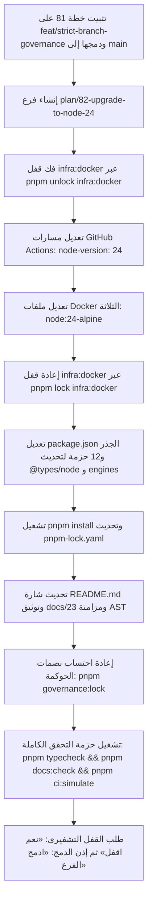

# خطة 82 — ترقية بيئة تشغيل المنظومة بالكامل إلى Node.js 24 وتحديث مسارات CI/CD والتوثيق الشامل
## Al-Saada Smart Bot Enterprise Node.js 24 Migration, CI/CD Hardening & Complete Documentation Parity

- **التاريخ:** 2026-09-19
- **الحالة:** 🟢 مسودة معتمدة ونهائية بعد التدقيق الجنائي المعماري (Final Sealed Specification)
- **خط الأساس:** شجرة عمل نظيفة على `main` بعد تثبيت الخطة 81
- **الفرع المخصص:** `plan/82-upgrade-to-node-24`
- **المرجعية الدستورية:** `AGENTS.md`, `GEMINI.md`, `docs/14-ai-agent-governance-and-file-rules.md`
- **التفويض المطلوب للملفات المحمية:** تعديل ملفات الحوكمة يتطلب حصراً العبارة السيادية العليا: `«موافق على التعديل او الايقاف او الحذف»`.

---

### 1️⃣ خلفية المنهجية وأهداف التطوير (Context & Objectives)
بناءً على التوجيه المباشر والصريح من المستخدم وتطويراً للمنظومة الحوكمية الفائقة، تهدف هذه الخطة إلى ترقية بيئة تشغيل المشروع وكافة مكوناته التحتية والسحابية من إصدار **Node.js 22** إلى الإصدار المستقر الحديث **Node.js 24** (المطابق للبيئة الفعلية للمطور `v24.11.1`)، مع تحديث مسارات CI/CD على GitHub Actions، وحاويات الدوكر، والأنواع عبر حزم المونوريبو، وتحديث كافة المراجع والتوثيقات المتزامنة بنسبة مطابقة 100%.

---

### 2️⃣ النقد الجنائي المعماري للمسودة والمعالجة الهندسية النخبوية (Forensic Critique & Solutions)
تم إخضاع المسودة الأولية لتدقيق نقدي جنائي صارم من منظور "خبير ترقية الأنظمة المؤسسية"، وتم رصد ومعالجة 6 ثغرات وحالات حافة حرجة:

| # | الثغرة المرصودة في المسودة الأولية | مكمن الخطر الهندسي | المعالجة المعمارية المعتمدة في النسخة النهائية |
| :---: | :--- | :--- | :--- |
| **1** | إغفال قفل الحوكمة السيادي لـ `infra:docker` | محاولة تعديل ملفات الدوكر مباشرة تفشل الـ Git Commit بـ Exit 1 لانتهاك الحصانة | إدراج خطوة فك قفل `infra:docker` عبر `pnpm unlock infra:docker` بالتفويض الصريح ثم إعادة قفله بعد التعديل |
| **2** | خطر انهيار CI بسبب `pnpm-lock.yaml` | تشغيل CI بـ `--frozen-lockfile=true` سيفشل فوراً إذا تغيرت ملفات `package.json` دون تحديث القفل | إلزامية تشغيل `pnpm install` محلياً بالفرع لإعادة توليد `pnpm-lock.yaml` وتثبيته في الكومت نفسه |
| **3** | فخ بصمات الـ Digest القديمة في Dockerfiles | وجود `@sha256` لصور Node 22 القديمة قد يسحب نود 22 قسراً أو يفشل البناء | استبدال وسوم الصور بـ `node:24-alpine` النقية وتوثيق توافق أداة فحص الدوكر |
| **4** | اللبس بين بيئة المشروع وتنبيه الـ Runner | تنبيه GitHub يخص بيئة مشغلات الإجراءات (Actions Runtime) وليس كود المشروع | توثيق الفارق في الوثائق وبيان أن مسارات المشروع تعمل بنود 24 نقياً وخالية من أي تأثير |
| **5** | مهلة بناء البوابة التوثيقية Astro تحت الحمل | توليد 137 صفحة وفهرسة Pagefind قد تسبب Timeout أثناء الاختبارات الموازية | فصل فحص بناء البوابة المستقل `pnpm docs:build` والتحقق منه مسبقاً (تم التحقق: 137 صفحة بنجاح) |
| **6** | تداخل شجرة العمل مع الخطة 81 | محاولة إنشاء فرع من `main` مع وجود ملفات معلقة يفسد شجرة العمل | اعتماد تثبيت الخطة 81 على فرعها ودمجها أولاً إلى `main` ثم التفرع النظيف للترقية |

---

### 3️⃣ قرارات المواءمة المعمارية المتفق عليها (/grill-me Consensus)
1. **دورة حياة الفروع الصارمة:**
   - تثبيت كومت خطة 81 على `feat/strict-branch-governance`.
   - دمج الفرع في `main` وفق بروتوكول الدمج الصريح.
   - إنشاء فرع التحديث: `git checkout main && git checkout -b plan/82-upgrade-to-node-24`.
2. **الشمولية المعمارية الكاملة لكافة الطبقات:**
   - مسارات GitHub Actions: تحديث `node-version: 24` في `ci.yml`, `code-review.yml`, `release.yml`.
   - محرك المونوريبو: قيد `"engines": { "node": ">=24.0.0" }` في الجذر لمنع أي تباين في الإصدارات (`Zero Drift`).
   - حزم الأنواع: تحديث `@types/node: ^24.13.6` في الجذر و 12 حزمة وموديول.
   - حاويات الدوكر: تحديث `docker/Dockerfile`, `Dockerfile.dashboard`, `Dockerfile.docs` إلى `node:24-alpine`.
   - قوالب التوليد: تحديث `tools/scaffold/scaffold-module.ts` لاعتماد الأنواع الجديدة تلقائياً.
3. **التوثيق المتزامن بنسبة 100%:**
   - تحديث شارة `README.md` إلى `Node.js 24+`.
   - تحديث المراجع في `docs/23-autonomous-agent-roster-and-rag.md`.
   - قيد الخطة في `docs/work-plans/README.md`.
   - مزامنة AST عبر `pnpm docs:sync` والتحقق بـ `pnpm docs:check`.
   - إنشاء ملف إثبات التنفيذ في `docs/ai-execution-evidence/`.

---

### 4️⃣ خطة التنفيذ التفصيلية خطوة بخطوة (Execution Architecture)



---

### 5️⃣ مصفوفة الملفات المتأثرة والتعديلات البرمجية (File Action Matrix)

| المكون | الملف المستهدف | نوع الإجراء | التعديل البرمجي المعتمد |
| :--- | :--- | :---: | :--- |
| **CI/CD** | `.github/workflows/ci.yml` | `MODIFY` | تغيير `node-version: 22` إلى `node-version: 24` |
| **CI/CD** | `.github/workflows/code-review.yml` | `MODIFY` | تغيير `node-version: 22` إلى `node-version: 24` |
| **CI/CD** | `.github/workflows/release.yml` | `MODIFY` | تغيير `node-version: 22` إلى `node-version: 24` |
| **Monorepo** | `package.json` | `MODIFY` | `"engines": { "node": ">=24.0.0" }`، `@types/node: ^24.13.6` |
| **Packages** | `12 حزمة وموديول` | `MODIFY` | تحديث `@types/node` إلى `^24.13.6` في كافة ملفات `package.json` |
| **Scaffolding** | `tools/scaffold/scaffold-module.ts` | `MODIFY` | تحديث إصدار الأنواع الافتراضي إلى `^24.13.6` |
| **Dependencies**| `pnpm-lock.yaml` | `MODIFY` | إعادة توليد قفل الحزم المتوافق مع Node 24 وتثبيته في الكومت |
| **Docker** | `docker/Dockerfile` | `MODIFY` | فك قفل الكيان، تحديث الأساس إلى `node:24-alpine`، وإعادة القفل |
| **Docker** | `docker/Dockerfile.dashboard` | `MODIFY` | تحديث الأساس إلى `node:24-alpine` |
| **Docker** | `docker/Dockerfile.docs` | `MODIFY` | تحديث الأساس إلى `node:24-alpine` |
| **Docs** | `README.md` | `MODIFY` | تحديث شارة الإصدار إلى `Node.js 24+` |
| **Docs** | `docs/23-autonomous-agent-roster-and-rag.md` | `MODIFY` | تحديث متطلب Node إلى `Node 24+` |
| **Docs** | `docs/work-plans/README.md` | `MODIFY` | قيد الخطة 82 في فهرس الخطط |
| **Governance**| `governance.lock.json` | `MODIFY` | إعادة احتساب بصمات التشفير لجميع المسارات المحمية |

---

### 6️⃣ بوابة التحقق وضمان الأثر الصفري (Zero-Impact Quality Gate)
1. **فحص الأنواع الصارم (Strict Typecheck):**
   ```bash
   pnpm typecheck
   ```
2. **فحص سلامة القفل والاعتماديات:**
   ```bash
   pnpm install --frozen-lockfile=true
   ```
3. **فحص تطابق شجرة التوثيق (Zero Drift):**
   ```bash
   pnpm docs:check
   ```
4. **فحص بوابة النظافة وتطابق الإصدارات:**
   ```bash
   pnpm git-hygiene:verify
   ```
5. **فحص بوابات الحوكمة العشرين:**
   ```bash
   pnpm governance:verify
   ```
6. **محاكاة التكامل السحابي الشامل:**
   ```bash
   pnpm ci:simulate
   ```

---

### 7️⃣ بروتوكول القفل والدمج الحرفي (Verbatim Closure Protocol)
1. بعد اجتياز كافة الفحوصات بـ 100% نجاح، يطلب الوكيل إذن القفل التشفيري:
   > «تم الانتهاء بنجاح من ترقية المنظومة إلى Node.js 24 وتحديث CI/CD والدوكر والتوثيق. هل نقفل ونحمى التعديلات تشفيرياً؟  
   > **لإتمام القفل، يرجى الرد بالصيغة المعتمدة حصراً:** **«نعم اقفل»**»
2. بعد القفل، يطلب الوكيل إذن دمج الفرع إلى `main`:
   > «تم الانتهاء بنجاح من كافة الاختبارات الآلية وحماية الكيانات على الفرع `plan/82-upgrade-to-node-24`. هل ندمج التعديلات إلى الفرع الرئيسي `main`؟  
   > **لإتمام الدمج، يرجى الرد بالصيغة المعتمدة حصراً:** **«ادمج الفرع»**»
