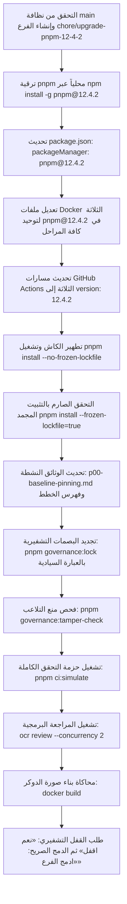

# خطة 83 — ترقية مدير الحزم إلى pnpm 12.4.2 وتحديث الحاويات ومسارات CI/CD والحوكمة التشفيرية
## Al-Saada Smart Bot Enterprise pnpm 12.4.2 Migration, Docker Parity & Governance Hardening

- **التاريخ:** 2026-09-19
- **الحالة:** 🟢 مسودة معتمدة ونهائية بعد التدقيق الجنائي المعماري والنقد الصارم (Final Sealed Specification)
- **خط الأساس:** شجرة عمل نظيفة على `main` بعد اكتمال الخطة 82
- **الفرع المخصص:** `chore/upgrade-pnpm-12-4-2`
- **المرجعية الدستورية:** `AGENTS.md`, `GEMINI.md`, `docs/14-ai-agent-governance-and-file-rules.md`, ومعايير `Alibaba OCR 6-Pillars`
- **التفويض المطلوب للملفات المحمية:** تعديل ملفات الحوكمة يتطلب حصراً العبارة السيادية العليا: `«موافق على التعديل او الايقاف او الحذف»`.

---

### 1️⃣ خلفية المنهجية وأهداف التطوير (Context & Objectives)
بناءً على التوجيه المباشر والصريح من المستخدم وتطويراً للبنية التحتية لمنظومة السعادة، تهدف هذه الخطة إلى ترقية مدير الحزم في المنظومة بالكامل من إصدار **pnpm 11.0.8** إلى أحدث إصدار مستقر **pnpm 12.4.2**. تشمل الترقية:
1. ترقية بيئة التطوير المحلية للمطور على نظام Windows.
2. تحديث قيد `packageManager` في `package.json` الرئيسي.
3. توحيد واستئصال أي تباين في إصدارات pnpm داخل كافة ملفات الدوكر (`Dockerfile`, `Dockerfile.dashboard`, `Dockerfile.docs`).
4. تحديث مسارات التكامل المستمر GitHub Actions (`ci.yml`, `release.yml`, `code-review.yml`).
5. إعادة توليد ملف القفل `pnpm-lock.yaml` بعد تطهير الـ Virtual Store لمنع أي تلف في الروابط الرمزية.
6. تحديث الوثائق الفنية النشطة (`p00-baseline-pinning.md`).
7. إعادة حساب البصمات التشفيرية SHA-256 للملفات المحمية في `governance.lock.json` واجتياز بوابات الحوكمة العشرين ومحاكاة بناء الدوكر بنسبة 100%.

---

### 2️⃣ النقد الجنائي المعماري للمسودة والمعالجة الهندسية النخبوية (Forensic Peer Review & Solutions)
تم إخضاع المسودة الأولية لتدقيق نقدي صارم من منظور "كبير مهندسي النظم وإدارة حزم pnpm وفاحص الكود Alibaba OCR"، وتم رصد ومعالجة 10 ثغرات وحالات حافة حرجة:

| # | الثغرة المرصودة في المسودة الأولية | مكمن الخطر الهندسي | المعالجة المعمارية المعتمدة في النسخة النهائية |
| :---: | :--- | :--- | :--- |
| **1** | تناقض إصدار الدوكر في الداشبورد (`@latest`) | السطر 114 في `Dockerfile.dashboard` يستخدم `pnpm@latest` بينما السطر 25 يستخدم إصداراً مخصصاً، مما يكسر التجميع الحتمي | توحيد كافة المراحل (Builder & Runner) في الـ Dockerfiles الثلاثة لتستخدم حصراً `pnpm@12.4.2` |
| **2** | فخ جمود بوابات منع العبث والـ Pre-Commit Hook | تعديل `package.json` وسير عمل الـ GitHub يفشل الـ Commit فوراً بـ `Exit 1` لأن SHA-256 لا يطابق `governance.lock.json` | إلزامية تشغيل `pnpm governance:lock` بالعبارة السيادية لإعادة حساب البصمات قبل محاولة الـ Commit |
| **3** | تلوث التخزين الافتراضي القديم (`.pnpm`) | الترقية بين إصدارين رئيسيين (11 ➡️ 12) مع وجود روابط قديمة قد تسبب ظاهرة الاعتماديات الشبحية وفشل Vitest | تطهير الـ Virtual Store وإجراء تثبيت نظيف على الفرع المنعزل |
| **4** | شرك الهجرة التلقائية لملف القفل (`--frozen-lockfile`) | محاولة التثبيت المجمد المباشر مع ملف قفل مولد بـ pnpm 11 تفشل فوراً | تطبيق بروتوكول الترقية الثنائي: تثبيت بدون تجميد أولاً للهجرة، ثم تثبيت مجمد صارم للتحقق |
| **5** | غياب بروتوكول الارتداد الفوري للطوارئ (Rollback) | في حال ظهور أي تعارض معماري غير متوقع مع Prisma أو Next.js لا توجد خطوات واضحة للإنقاذ | إدراج بروتوكول ارتداد فوري يعيد المنظومة إلى pnpm 11.0.8 وفرع main في أقل من 60 ثانية |
| **6** | إغفال الفحص الآلي عبر Alibaba OCR | عدم إخضاع مسارات CI/CD وملفات التكوين لمراجعة جودة الكود الاستباقية | إدراج خطوة تشغيل `ocr review --concurrency 2` كبوابة فحص إلزامية قبل طلب القفل والدمج |
| **7** | فحص إعدادات التوافق في `pnpm-workspace.yaml` | خشية تعارض إعدادات `allowBuilds` أو `minimumReleaseAge: 10080` مع محرك pnpm 12 | فحص ومطابقة الإعدادات والتأكد من دعمها الكامل في محرك pnpm 12.4.2 |
| **8** | قفل ملفات ويندوز التنازعي (EBUSY/EPERM) | ترقية الحزمة العامة أثناء تشغيل خوادم خلفية أو PM2 قد تقفل ملفات الـ exe | التأكد من إيقاف أي خدمات مراقبة أو خوادم محلية قبل ترقية الحزمة العامة على الجهاز |
| **9** | تشتت الإصدارات بين ملفات GitHub Actions | تكرار الإصدار في 3 ملفات يزيد من مخاطر انحراف التكوين مستقبلاً | مزامنة دقيقة وصارمة لكافة المسارات مع توثيق آلية القراءة التلقائية من `package.json` مستقبلاً |
| **10**| الحفاظ على تاريخية سجلات التدقيق السابقة | إمكانية إفساد سجلات التدقيق الجنائية المؤرخة (Periodic Audits) بتعديل ماضيها | حماية سجلات التدقيق السابقة كأدلة تاريخية وتحديث الوثائق النشطة فقط وإيداع هذه الخطة 83 |

---

### 3️⃣ قرارات المواءمة المعمارية المتفق عليها (/grill-me Consensus)
1. **البيئة المحلية:** ترقية pnpm عالمياً على بيئة Windows عبر `npm install -g pnpm@12.4.2`.
2. **الفرع المخصص:** إنشاء الفرع `chore/upgrade-pnpm-12-4-2` انطلاقاً من `main` النظيف.
3. **نطاق الحزم والاعتماديات:** ترقية مدير الحزم فقط (Strict Tooling-Only Upgrade) مع الحفاظ على إصدارات كافة مكتبات وحزم المنظومة الحالية دون تغيير.
4. **نطاق التوثيق:** تحديث الوثائق النشطة (`p00-baseline-pinning.md`، إيداع الخطة 83، تحديث فهرس الخطط) مع الإبقاء على سجلات 11-13 سبتمبر التاريخية كما هي.
5. **عمق التحقق:** تشغيل `pnpm ci:simulate` (بوابات الحوكمة العشرين + فحص TypeScript 5.9+ + اختبارات Vitest 100%) + فحص Alibaba OCR + محاكاة بناء صورة الدوكر.
6. **الحوكمة التشفيرية:** تجديد بصمات SHA-256 للمسارات المحمية في `governance.lock.json` باستخدام العبارة السيادية: `«موافق على التعديل او الايقاف او الحذف»`.

---

### 4️⃣ خطة التنفيذ التفصيلية خطوة بخطوة (Execution Architecture)



---

### 5️⃣ مصفوفة الملفات المتأثرة والتعديلات البرمجية (File Action Matrix)

| المكون | الملف المستهدف | نوع الإجراء | التعديل البرمجي المعتمد |
| :--- | :--- | :---: | :--- |
| **Monorepo** | `package.json` | `MODIFY` | تغيير `"packageManager": "pnpm@11.0.8"` إلى `"pnpm@12.4.2"` |
| **Dependencies**| `pnpm-lock.yaml` | `MODIFY` | إعادة توليد ملف القفل لمحرك pnpm 12 وتثبيته في الكومت |
| **Docker** | `docker/Dockerfile` | `MODIFY` | تحديث السطر 21 والسطر 105 إلى `RUN npm install -g pnpm@12.4.2` |
| **Docker** | `docker/Dockerfile.dashboard` | `MODIFY` | تحديث السطر 25 والسطر 114 لتوحيد `RUN npm install -g pnpm@12.4.2` |
| **Docker** | `docker/Dockerfile.docs` | `MODIFY` | تحديث السطر 18 إلى `RUN npm install -g pnpm@12.4.2` |
| **CI/CD** | `.github/workflows/ci.yml` | `MODIFY` | ضبط `version: 12.4.2` وتحديث نص تقرير الـ Step Summary |
| **CI/CD** | `.github/workflows/release.yml` | `MODIFY` | ضبط `version: 12.4.2` |
| **CI/CD** | `.github/workflows/code-review.yml` | `MODIFY` | ضبط `version: 12.4.2` |
| **Docs** | `docs/ai-execution-evidence/p00-baseline-pinning.md` | `MODIFY` | تحديث مدير الحزم إلى `pnpm v12.4.2` |
| **Docs** | `docs/work-plans/83-plan-upgrade-to-pnpm-12-4-2-and-cross-repo-verification.md` | `NEW` | إيداع وثيقة الخطة 83 الرسمية |
| **Docs** | `docs/work-plans/README.md` | `MODIFY` | قيد الخطة 83 في جدول فهرس خطط العمل المؤسسية |
| **Governance**| `governance.lock.json` | `MODIFY` | إعادة احتساب بصمات SHA-256 لكافة الملفات المحمية |

---

### 6️⃣ بوابة التحقق وضمان الأثر الصفري (Zero-Impact Quality Gate)

1. **فحص إصدار pnpm الفعلي:**
   ```bash
   pnpm --version
   # يجب أن يطبع: 12.4.2
   ```

2. **فحص سلامة القفل والاعتماديات المجمدة:**
   ```bash
   pnpm install --frozen-lockfile=true
   # يجب أن ينتهي بـ Exit Code 0 دون أي تغيير
   ```

3. **فحص النزاهة التشفيرية ومنع التلاعب:**
   ```bash
   pnpm governance:tamper-check
   # يجب أن يعيد: ✅ GOVERNANCE INTEGRITY VERIFIED (0 findings)
   ```

4. **حزمة محاكاة التكامل المستمر الشاملة:**
   ```bash
   pnpm ci:simulate
   ```
   يشمل:
   - `pnpm typecheck` (TypeScript 5.9+ Strict)
   - `pnpm test` (اجتياز كافة اختبارات Vitest 100%)
   - `pnpm git-hygiene:verify` (خلو جذر المشروع ونظافة التتبع)
   - `pnpm governance:verify` (اجتياز بوابات الحوكمة الـ 20 كاملة)

5. **فحص جودة وأمان الكود عبر Alibaba OCR:**
   ```bash
   ocr review --concurrency 2 --background-file ./AGENTS.md
   ```

6. **محاكاة بناء صورة الدوكر:**
   ```bash
   docker build -t alsaada-bot:pnpm12-test -f docker/Dockerfile .
   ```

---

### 7️⃣ بروتوكول الارتداد الفوري للطوارئ (Emergency Rollback Protocol)

في حال حدوث أي خلل جسيم غير قابل للحل أثناء اختبارات pnpm 12:
```powershell
# 1. إلغاء التغييرات وحذف الفرع المستقل
git checkout main
git branch -D chore/upgrade-pnpm-12-4-2

# 2. استعادة إصدار pnpm 11.0.8 العالمي على الجهاز
npm install -g pnpm@11.0.8

# 3. التحقق من عودة بيئة العمل لحالتها السابقة
pnpm --version # 11.0.8
pnpm install --frozen-lockfile=true
```

---

### 8️⃣ ميثاق القفل التشفيري وبروتوكول الدمج الصريح (Strict Lock & Merge Protocol)
- **القفل التشفيري:** فور اجتياز كافة الاختبارات بنسبة 100%، يطلب الوكيل إذن القفل بالصيغة الحرفية الحصرية: **«نعم اقفل»**.
- **الدمج الصريح:** بعد اكتمال القفل، يطلب الوكيل إذن الدمج بالصيغة الحرفية الحصرية: **«ادمج الفرع»**، ولا يتم الدمج إلى `main` إلا بعد استلام هذه العبارة حرفياً دون أي بديل.
