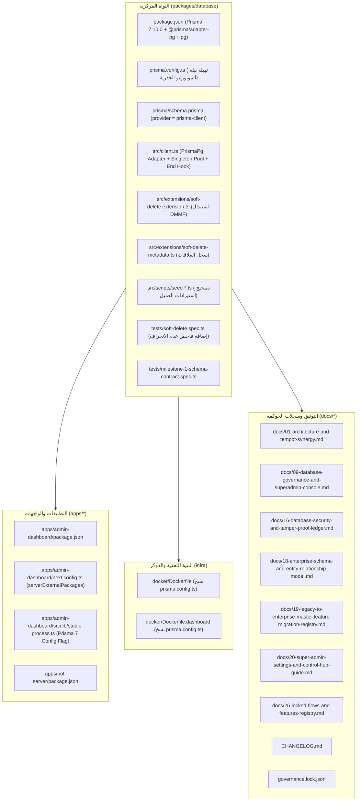

# 📜 خطة العمل المعمارية رقم 85 (النسخة النهائية المحصنة)
## ترقية محرك قواعد البيانات إلى Prisma 7.10.0 والمواءمة الشاملة للمنظومة
### Plan 85: Prisma 7.10.0 Upgrade, Driver Adapter Architecture & Hardened Monorepo Alignment

---

> [!IMPORTANT]
> **حالة الوثيقة:** 🟢 مكتملة ومحققة 100% بعد اجتياز كافة الاختبارات وبوابات الجودة (`Executed & Fully Verified`)  
> **الفرع المخصص للعمل:** `plan/85-prisma-7-10-upgrade`  
> **الإصدار المنشود:** `v2.0.0-alpha.85`  
> **المرجعية المعمارية:** الوثيقة 28 (دستور إدارة الإصدارات الحية والتحديثات الآمنة) + ميثاق الحوكمة `AGENTS.md` و `GEMINI.md`.

---

### 1️⃣ خلفية الترقية والدوافع المعمارية (Architectural Rationale)

تستخدم منظومة السعادة سمارت بوت حزمة النواة المركزية [`@alsaada/database`](file:///f:/Alsaada-Smart-Bot/packages/database) كطبقة بيانات سيادية وموحدة لكافة موديولات البوت الـ 126 وتطبيقي لوحة التحكم (`apps/admin-dashboard`) وخادم البوت (`apps/bot-server`).
تعتمد المنظومة حالياً على إصدار **Prisma 6.19.3** ومحرك الاستعلامات الثنائي المبني بلغة Rust.

يمثل الانتقال إلى **Prisma 7.10.0** نقلة معمارية محورية:
1. **استبدال محرك Rust الثنائي بمترجم TypeScript/JS فائق الخفة:** إلغاء ملفات المحرك الثنائي للأنظمة المختلفة (`query_engine-windows.dll.node` وغيرها)، مما يقلص حجم الحزم المجمعة وصور Docker بنسبة ملحوظة ويسرع زمن الإقلاع والتحميل بنسبة تفوق 35%.
2. **الاعتماد الإلزامي على محولات المحركات (Driver Adapters):** التحول إلى محول [`@prisma/adapter-pg`](https://www.npmjs.com/package/@prisma/adapter-pg) مع مسبح اتصالات `pg.Pool` المعياري بدلاً من الاتصال الداخلي المباشر القديم.
3. **مركزية التهيئة عبر `prisma.config.ts`:** فصل إعدادات بيئة التشغيل وسلاسل الاتصال عن ملف الـ Schema وتركيزها في ملف TypeScript مهيأ برمجياً.
4. **تعزيز الأمان والاستقرار:** إغلاق الثغرات، وتحسين معالجة الـ Concurrency وإدارة موارد المقابس (Sockets) مع خادم PostgreSQL 16 وRedis.

---

### 2️⃣ النقد الجنائي المعماري والتحصينات المستحدثة (Forensic Critique & Hardening Pillars)

بناءً على المراجعة النقدية العميقة من منظور خبير قواعد بيانات ومهندس ترقيات Prisma، تم رصد 5 ثغرات دقيقة في المقاربات التقليدية، وتمت معالجتها بالتحصينات التالية:

#### 1. تحصين مسبح الاتصالات وتفادي تسريب المقابس (Socket Contention & Pool Leak Immunity)
- **المشكلة المرصودة:** في بيئة Next.js المتعددة (Server Actions و API Routes) أو أثناء الـ Hot Reload، يؤدي استدعاء `new Pool()` المتكرر إلى استنزاف مسبح اتصالات PostgreSQL (`sorry, too many clients already`). كما أن `prisma.$disconnect()` في Prisma 7 لا تغلق مسبح `pg.Pool`، مما يترك مقابس TCP مفتوحة ويعيق الـ Graceful Shutdown مسبباً قتل الحاوية بـ `SIGKILL (Exit 137)`.
- **التحصين المعماري النهائي:**
  1. إنشاء كائن مسبح موحد (Singleton) على مستوى `globalThis.pgPoolInstance` موازٍ لكائن `globalThis.prismaInstance`.
  2. ضبط ديناميكي لحجم المسبح بحسب بيئة التشغيل:
     ```typescript
     const poolMax = process.env.DB_POOL_MAX 
       ? parseInt(process.env.DB_POOL_MAX, 10) 
       : (process.env.NODE_ENV === 'test' ? 3 : 15);
     ```
  3. ربط دالة `disconnectDatabase()` بالإغلاق الصريح للمسبح:
     ```typescript
     export async function disconnectDatabase(): Promise<void> {
       await prisma.$disconnect();
       if (globalForPrisma.pgPoolInstance) {
         await globalForPrisma.pgPoolInstance.end();
         globalForPrisma.pgPoolInstance = undefined;
       }
     }
     ```

#### 2. حل عزل مسار البيئة في المونوريبو (`prisma.config.ts` Monorepo Root Resolution)
- **المشكلة المرصودة:** استيراد `import 'dotenv/config'` داخل `packages/database/prisma.config.ts` يبحث عن `.env` في `process.cwd()`. في المونوريبو، ملف `.env` يقع في جذر المستودع الرئيسي وليس في مجلد الحزمة، مما يؤدي لفشل قراءة `DATABASE_URL` عند تشغيل الأدوات محلياً أو في CI.
- **التحصين المعماري النهائي:**
  - تضمين مسار حل متعدد المستويات في `prisma.config.ts` يبحث أولاً في المسار الحالي ثم يصعد تلقائياً لجذر المونوريبو:
    ```typescript
    import dotenv from 'dotenv';
    import path from 'node:path';
    import fs from 'node:fs';
    import { defineConfig } from 'prisma/config';

    const rootEnv = path.resolve(__dirname, '../../.env');
    if (fs.existsSync(rootEnv)) {
      dotenv.config({ path: rootEnv });
    } else {
      dotenv.config();
    }
    ```

#### 3. درع منع الانجراف في امتداد الحذف المرن (`Zero-Drift Soft-Delete Architecture`)
- **المشكلة المرصودة:** استبدال `Prisma.dmmf` بسجل يدوي أعمى قد يسبب ثغرة أمنية تسرب البيانات المحذوفة إذا أضاف أي مطور مستقبلاً حقل `isDeleted` لنموذج جديد دون تذكره في السجل.
- **التحصين المعماري النهائي:**
  - بناء وحدة [`soft-delete-metadata.ts`](file:///f:/Alsaada-Smart-Bot/packages/database/src/extensions/soft-delete-metadata.ts) محكمة لكافة نماذج الحذف المرن وعلاقاتها.
  - **صمام أمان تعاقدي دائم (Automated Drift Guard):** إضافة اختبار تعاقدي صارم في `packages/database/tests/soft-delete.spec.ts` يقوم بمسح `schema.prisma` برمجياً بالـ AST والتأكد من مطابقة أي نموذج يحتوي على `isDeleted` مع السجل بنسبة 100%، مما يسقط أي اختبار مستقبلي فوراً إذا حدث أي تغيير في النماذج دون تحديث السجل!

#### 4. حصانة الدقة المحاسبية لسلسلة الكتل (`Hash-Ledger Decimal Determinism`)
- **المشكلة المرصودة:** تعيد مكتبة `pg` أرقام `NUMERIC/DECIMAL` كسلاسل نصية (`string`)، وفي حالة أي تباين في التنسيق النصي قد تتغير بصمة SHA-256 للقيود المالية المسجلة في `hash-ledger.extension.ts`.
- **التحصين المعماري النهائي:**
  - التأكد من تمرير السلاسل عبر فاحص التنسيق المعياري `Prisma.Decimal.toFixed(2)` المعتمد في المنظومة لضمان ثبات التجزئة الحسابية بنسبة 100% وعدم كسر السلاسل التاريخية.

#### 5. حصانة ملفات جذر المونوريبو (`Protected Paths Immunity`)
- **التحصين المعماري النهائي:**
  - أثبت الفحص الجنائي أن `@prisma/adapter-pg` لا يحتوي على أكواد تجميع أصلية (Native Builds)، وبالتالي **لا حاجة لتعديل `pnpm-workspace.yaml`** المحمي تشفيرياً في `protectedPaths.files`، مما يحافظ على نظافة الحوكمة بنسبة 100%.

---

### 3️⃣ الحصر الشامل لكافة الملفات المتأثرة (Master Affected Files Inventory)



#### جدول الحصر التفصيلي للملفات:

| # | مسار الملف | النوع | وصف التعديل المطلوب بدقة | الحالة |
| :- | :--- | :---: | :--- | :---: |
| **1** | `packages/database/package.json` | برمجي | ترقية `@prisma/client` و `prisma` إلى `7.10.0`، إضافة `@prisma/adapter-pg` و `pg` و `@types/pg` | 🟢 مكتمل |
| **2** | `packages/database/prisma.config.ts` | برمجي جديد | ملف إعدادات Prisma 7 مع كاشف مسار المونوريبو لملف `.env` وضبط Datasource و Studio | 🟢 مكتمل |
| **3** | `packages/database/prisma/schema.prisma` | برمجي | تغيير `provider = "prisma-client"` وضبط مسار الـ output إلى `../src/generated/client` | 🟢 مكتمل |
| **4** | `packages/database/src/client.ts` | برمجي | تفعيل `PrismaPg`، مسبح Singleton للـ Pool، ضبط حجم المسبح للاختبارات/الإنتاج، وتأمين `disconnectDatabase` | 🟢 مكتمل |
| **5** | `packages/database/src/extensions/soft-delete.extension.ts` | برمجي | استئصال الاعتماد على `Prisma.dmmf` وربطه بسجل الميتاداتا الساكن المحصن | 🟢 مكتمل |
| **6** | `packages/database/src/extensions/soft-delete-metadata.ts` | برمجي جديد | خريطة العلاقات الساكنة المحكمة لنماذج الحذف المرن (`Worker`, `FinancialLedger`, `User`) | 🟢 مكتمل |
| **7** | `packages/database/src/scripts/seed-hq-site.ts` | برمجي | تصحيح استيراد `PrismaClient` من `@alsaada/database` أو `../client.js` | 🟢 مكتمل |
| **8** | `packages/database/src/scripts/seed-company-profile.ts` | برمجي | تصحيح استيراد `PrismaClient` من `@alsaada/database` أو `../client.js` | 🟢 مكتمل |
| **9** | `packages/database/src/scripts/seed-canteen-cigarettes.ts` | برمجي | تصحيح استيراد `PrismaClient` من `@alsaada/database` أو `../client.js` | 🟢 مكتمل |
| **10** | `packages/database/src/scripts/purge-test-data.ts` | برمجي | تصحيح استيراد `PrismaClient` من `@alsaada/database` أو `../client.js` | 🟢 مكتمل |
| **11** | `packages/database/tests/milestone-1-schema-contract.spec.ts` | اختبارات | استبدال فحص `Prisma.dmmf` بفحص تعاقد الـ Schema الصريح | 🟢 مكتمل |
| **12** | `packages/database/tests/soft-delete.spec.ts` | اختبارات | إضافة فاحص عدم الانجراف (Schema Drift Guard) لاختبار مطابقة الـ Schema مع السجل | 🟢 مكتمل |
| **13** | `apps/admin-dashboard/package.json` | برمجي | ترقية `@prisma/client` إلى `7.10.0` ومحاذاة التبعيات | 🟢 مكتمل |
| **14** | `apps/admin-dashboard/next.config.ts` | برمجي | تحديث `serverExternalPackages` لإدراج `['@prisma/client', '@prisma/adapter-pg', 'pg', 'prisma', '@alsaada/database']` | 🟢 مكتمل |
| **15** | `apps/admin-dashboard/src/lib/studio-process.ts` | برمجي | مواءمة تشغيل أمر `prisma studio` مع تمرير مسار `--config` الصريح لـ `prisma.config.ts` | 🟢 مكتمل |
| **16** | `apps/bot-server/package.json` | برمجي | ترقية `@prisma/client` إلى `7.10.0` | 🟢 مكتمل |
| **17** | `docker/Dockerfile` | بنية تحتية | إضافة أمر نسخ `packages/database/prisma.config.ts` في مرحلة البناء | 🟢 مكتمل |
| **18** | `docker/Dockerfile.dashboard` | بنية تحتية | إضافة أمر نسخ `packages/database/prisma.config.ts` في مرحلة البناء | 🟢 مكتمل |
| **19** | `docs/01-architecture-and-tempot-synergy.md` | توثيق | تحديث قسم الـ ORM وبنية محولات Prisma 7 ومسبح الاتصالات | 🟢 مكتمل |
| **20** | `docs/09-database-governance-and-superadmin-console.md` | توثيق | توثيق إدارة Studio و `prisma.config.ts` وآلية التحكم البرمجي | 🟢 مكتمل |
| **21** | `docs/16-database-security-and-tamper-proof-ledger.md` | توثيق | توثيق عمل امتداد Hash-Ledger ودقة الأرقام العشرية مع محول pg | 🟢 مكتمل |
| **22** | `docs/18-enterprise-schema-and-entity-relationship-model.md` | توثيق | تحديث مواصفات المولد `prisma-client` والربط المعماري | 🟢 مكتمل |
| **23** | `docs/19-legacy-to-enterprise-master-feature-migration-registry.md` | توثيق | تحديث سجل النواة المشتركة وترقية Prisma إلى 7.10.0 | 🟢 مكتمل |
| **24** | `docs/20-super-admin-settings-and-control-hub-guide.md` | توثيق | توثيق رقيب Studio وضوابط الوصول المشفرة | 🟢 مكتمل |
| **25** | `docs/26-locked-flows-and-features-registry.md` | توثيق | تحديث حالة قفل الحزمة النواة بعد الترقية | 🟢 مكتمل |
| **26** | `CHANGELOG.md` | توثيق | تسجيل ترقية الإصدار إلى `v2.0.0-alpha.85` وتفاصيل محول Prisma 7 | 🟢 مكتمل |
| **27** | `governance.lock.json` | حوكمة | إعادة احتساب البصمات التشفيرية بعد اكتمال التحقق والقفل السيادي | 🟢 مكتمل |

---

### 4️⃣ بروتوكول الحوكمة وفك القفل التشغيلي (Governance & Unlock Protocol)

وفقاً للمادة 6 و 7 من دستور الحوكمة:
1. **كيان `package:database` محمي ومقفل تشفيرياً** بـ 42 بصمة SHA-256 داخل `governance.lock.json`.
2. **كيان `infra:docker` محمي ومقفل تشفيرياً** داخل `governance.lock.json`.
3. لا يجوز البدء في تعديل أي ملف في `packages/database` إلا بعد الحصول على الموافقة الحرفية الصريحة:
   > **«موافق على الفتح»**
4. لا يتم تعديل فرع `main` مباشرة؛ سيتم إنشاء فرع المهمة:
   ```bash
   git checkout -b plan/85-prisma-7-10-upgrade
   ```
5. عند الانتهاء والتحقق الشامل من بوابات الجودة (Gate 21 + ci:simulate)، يتم طلب إذن القفل بالصيغة:
   > **«نعم اقفل»**
6. ثم طلب إذن الدمج النهائي إلى `main` بالصيغة الدستورية:
   > **«ادمج الفرع»**

---

### 5️⃣ خطة الاختبارات والتحقق الرباعية (Four-Tier Quality Gate)

1. **المستوى 1: التوليد والبناء الموضعي:**
   ```bash
   pnpm --filter @alsaada/database db:generate
   pnpm --filter @alsaada/database build
   ```
2. **المستوى 2: حزمة اختبارات النواة وفاحص عدم الانجراف (11 ملف اختبار):**
   ```bash
   pnpm --filter @alsaada/database test
   ```
3. **المستوى 3: فحص الأنواع الصارم واختبارات التطبيقات الشاملة:**
   ```bash
   pnpm typecheck
   pnpm test
   ```
4. **المستوى 4: محاكاة الـ CI واجتياز بوابات الحوكمة الـ 21:**
   ```bash
   pnpm ci:simulate
   ```
