# 📜 خطة العمل المعمارية رقم 86 (النسخة الذهبية المحصنة v2.1 - إطار الدفاع في العمق المؤسسي)
## المعالجة الجنائية الشاملة لثغرات النواة المالية والأمنية والصلاحيات والـ Outbox واعتماد معمارية Defense-in-Depth v2.1
### Plan 86: Sovereign Defense-in-Depth v2.1 Architecture, 5 Critical Invariants, Multi-Squad Hardening & Dual-Probe Verification

---

> [!IMPORTANT]
> **حالة الوثيقة:** 🟢 مكتمل ومنفذ وموثق 100% بنجاح تام (`Completed & Fully Verified 100% — Defense-in-Depth v2.1`)  
> **الفرع المخصص للعمل:** `plan/86-core-financial-and-security-hardening`  
> **الإصدار المستهدف:** `v2.0.0-alpha.86`  
> **المرجعية الدستورية:** ميثاق الحوكمة `AGENTS.md` و `GEMINI.md` + التقرير الجنائي الميداني + ميثاق الدفاع في العمق v2.1.

---

### 1️⃣ الرؤية المعمارية العليا: ميثاق الدفاع في العمق المؤسسي (Defense-in-Depth v2.1)

بناءً على النقد المعماري الجنائي المتقدم والملاحظات الخمس الحرجة، تم تحصين المنظومة لتتبنى معمارية **الدفاع في العمق متعددة الطبقات (6-Tier Sovereign Defense Matrix)**:

```mermaid
flowchart TD
    subgraph Tier0["الطبقة 0: الأمن التشغيلي والتوريد (Supply Chain & Operational Zero-Trust)"]
        T0A["SAST Semgrep & CodeQL"] --> T0B["SCA Dependency Audit"]
        T0C["Gitleaks & TruffleHog Secrets Scan"] --> T0D["PostgreSQL Least-Privilege & Transactional RLS"]
        T0E["Telegram Webhook secret_token"] --> T0F["Redis-backed Distributed Rate Limiter"]
    end

    subgraph Tier1["الطبقة 1: الأنواع المحصنة وبوابة الحدود (Type-Level & Gate 24)"]
        T1A["PositiveFiniteAmount Branded Nominal Types"] --> T1B["Single Point of Re-Branding: toPositiveFiniteAmount()"]
        T1C["Gate 24: Boundary Deserialization Gate"] --> T1D["حظر الـ Type Cast الأعمى (as PositiveFiniteAmount) بالـ AST"]
    end

    subgraph Tier2["الطبقة 2: بوابات AST التحذيرية وسلسلة القرارات (Gates 22, 23 & Decision Trace)"]
        T2A["Gate 22: حظر الموكس والـ Mutex واكتشاف Dead Architecture"]
        T2B["Gate 23: فحص تراتبية RBAC في الكود"]
        T2C["Decision Trace Array: كل قرار ALLOW يرفق معه إثبات فحص الموقع والسيادة أولاً"]
    end

    subgraph Tier3["الطبقة 3: النواة التزامنية وقاعدة البيانات الحية (Real DB & Sovereign Locks)"]
        T3A["القفل أولاً: pg_advisory_xact_lock قبل أي قراءة لـ previousHash"]
        T3B["ترقيم تتابعي أحادي عديم الفجوات (Gap-Free Monotonic ledger_seq) داخل القفل"]
        T3C["توقيع التجزئة بوقت خادم قاعدة البيانات now()"]
        T3D["تريجر SQL يمنع الفجوات ويثبت تطابق prev_hash مع آخر current_hash"]
        T3E["اختبار تدافع متوازي بـ 50 عملية متزامنة حقيقية مع التحقق الرياضي المزدوج"]
    end

    subgraph Tier4["الطبقة 4: طابور Outbox السحابي المرن (Cloud-Native Resilient Outbox)"]
        T4A["OutboxDaemon دائم في خادم البوت مع Polling وقفل استشاري"]
        T4B["Exponential Backoff: retry_count + next_retry_at"]
        T4C["Dead Letter Queue (dead_letter_events بعد 10 محاولات)"]
        T4D["Idempotency Key ثابت (event_id) لمنع تكرار الصفوف في Google Sheets"]
        T4E["Distributed Circuit Breaker ثلاثي الحالات (Closed / Open / Half-Open) عبر Redis"]
    end

    subgraph Tier5["الطبقة 5: السجل الجنائي والتوقيع الرقمي (Forensic Audit & Cryptographic Sealing)"]
        T5A["توقيع المعاملات بـ HMAC-SHA256 مع حوكمة KMS وتدوير دوري للمفاتيح (Key Rotation)"]
        T5B["سجل تدقيق DDL لمراقبة وتنبيه أي محاولة DISABLE TRIGGER"]
        T5C["مسبار التحقق المزدوج بالأثر الجنائي (Dual-Probe Verification)"]
    end

    Tier0 --> Tier1 --> Tier2 --> Tier3 --> Tier4 --> Tier5
```



---

### 2️⃣ المعالجة التفصيلية للملاحظات المعمارية الخمس الحرجة (The 5 Critical Invariants)

#### 🔴 1. حوكمة مفتاح HMAC-SHA256، سيادة الملكية، وتدوير المفاتيح الدوري (KMS Custody & Key Rotation)
* **المشكلة:** إذا احتفظ تطبيق الويب أو خادم البوت بالمفتاح السري مباشرة داخل كود المصدر أو بيئة التشغيل الساذجة دون سياسة تدوير دوري أو عزل، فإن أي اختراق لتطبيق الويب يمكن المهاجم من إعادة حساب التوقيعات للسجلات المزورة.
* **المعالجة المعمارية الصارمة:**
  1. **مالك المفتاح والحيازة المعزولة (Key Custodian & Isolation):**
     - في بيئات الإنتاج، تُدار المفاتيح السرية حصراً عبر خدمة إدارة مفاتيح خارجية معزولة (Cloud KMS / HashiCorp Vault / AWS KMS).
     - لا يمتلك خادم الويب العام (`admin-dashboard`) أو المشرفون صلاحية قراءة المفتاح الخام؛ التوقيع يتم حصراً عبر خادم التوقيع المالي المعزول (`sealing daemon`) أو عبر استدعاء موثق من خدمة معزولة.
  2. **بروتوكول تدوير المفاتيح الدوري (Key Rotation Protocol & `kid`):**
     - يُضاف حقل معرف المفتاح `hmac_kid` في جدول السجلات المالية:
       ```sql
       ALTER TABLE financial_ledgers ADD COLUMN hmac_kid VARCHAR(64) NOT NULL DEFAULT 'v1-2026-q1';
       ALTER TABLE financial_ledgers ADD COLUMN hmac_signature VARCHAR(128) NOT NULL;
       ```
     - صياغة التوقيع تجمع العناصر الجنائية التالية:
       $$\text{Signature} = \text{HMAC-SHA256}\Big(K_{\text{kid}}, \text{ledger\_seq} \parallel \text{prev\_hash} \parallel \text{current\_hash} \parallel \text{created\_at} \parallel \text{amount}\Big)$$
     - يحتفظ النظام بحلقة مفاتيح (Keyring) تحتوي المفتاح الحالي الفعال (`active`) والمفاتيح المؤرشفة السابقة (`retired`) للتحقق الجنائي المستمر عند مراجعة السجلات التاريخية.
     - تدوير المفاتيح يتم ربع سنوياً (Every 90 Days) أو فورياً عند حدوث أي حدث أمني استثنائي دون كسر التحقق من السجلات السابقة.

---

#### 🔴 2. السلسلة المالية عديمة الفجوات (Gap-Free Monotonic Sequencing) والتريجر المزدوج المعصوم
* **المشكلة:** الاعتماد على `BigSerial` العادي يؤدي إلى فجوات عددية (`Gaps`) عند حدوث `ROLLBACK` لأي معاملة فاشلة، مما يجعل الاستعلام `ORDER BY sequence DESC LIMIT 1` عرضة للالتباس ولا يضمن التسلسل الرياضي الصارم.
* **المعالجة المعمارية الصارمة:**
  1. **الترقيم التتابعي عديم الفجوات (Gap-Free Monotonic `ledger_seq`):**
     - يتم حسم رقم التسلسل `ledger_seq` **داخل نفس المعاملة الذرية التفاعلية وأثناء حيازة القفل الاستشاري** `pg_advisory_xact_lock(LEDGER_MUTEX_ID)`.
     - استعلام الترقيم الرياضي الحتمي:
       ```sql
       SELECT COALESCE(MAX(ledger_seq), 0) + 1 INTO v_next_seq FROM financial_ledgers;
       ```
     - نظراً لأن المعاملة محصنة بالقفل الاستشاري، فإنه يستحيل تداخل معاملتين؛ وفي حال حدوث `ROLLBACK`، لا يتم حجز الرقم ولا تتولد أي فجوة على الإطلاق.
  2. **معالجة السجل التأسيسي (Genesis Record Handling):**
     - إذا كان الجدول فارغاً، يُلزم التريجر بأن يكون `ledger_seq = 1` وأن يكون `prev_hash` مكوناً حصراً من 64 صفراً (`0000000000000000000000000000000000000000000000000000000000000000`).
  3. **تريجر التحقق المزدوج المعصوم (Dual-Check SQL Trigger):**
     ```sql
     CREATE OR REPLACE FUNCTION verify_financial_ledger_chain_integrity()
     RETURNS TRIGGER AS $$
     DECLARE
       v_last_hash TEXT;
       v_last_seq BIGINT;
     BEGIN
       -- جلب آخر سجل معتمد بالترتيب التتابعي
       SELECT current_hash, ledger_seq INTO v_last_hash, v_last_seq
       FROM financial_ledgers
       WHERE id <> NEW.id
       ORDER BY ledger_seq DESC
       LIMIT 1;

       IF NOT FOUND THEN
         -- التحقق من السجل التأسيسي (Genesis)
         IF NEW.ledger_seq <> 1 THEN
           RAISE EXCEPTION 'GENESIS_LEDGER_SEQ_MUST_BE_1';
         END IF;
         IF NEW.prev_hash <> '0000000000000000000000000000000000000000000000000000000000000000' THEN
           RAISE EXCEPTION 'GENESIS_PREV_HASH_MUST_BE_ZEROES';
         END IF;
       ELSE
         -- 1. التحقق من انعدام الفجوات التتابعية
         IF NEW.ledger_seq <> v_last_seq + 1 THEN
           RAISE EXCEPTION 'CRITICAL_LEDGER_SEQUENCE_GAP: Expected seq %, but got %', v_last_seq + 1, NEW.ledger_seq;
         END IF;
         -- 2. التحقق من تطابق السلسلة التشفيرية
         IF NEW.prev_hash IS DISTINCT FROM v_last_hash THEN
           RAISE EXCEPTION 'CRITICAL_HASH_CHAIN_INTEGRITY_VIOLATION: Expected prev_hash %, but got %', v_last_hash, NEW.prev_hash;
         END IF;
       END IF;

       RETURN NEW;
     END;
     $$ LANGUAGE plpgsql;
     ```

---

#### 🟡 3. المواصفة الكاملة لقاطع الدائرة الموزع (Distributed State Machine Circuit Breaker)
* **المشكلة:** القول بأن القاطع يفتح عند 5 إخفاقات غير مكتمل ما لم تُحدد حالة `Half-Open`، وكيفية مزامنة الحالة بين النسخ الموزعة، ومصير الأحداث الواصلة أثناء الحالة المفتوحة.
* **المواصفة الهندسية الدقيقة:**
  1. **توزيع الحالة عبر Redis (Distributed State via Redis):**
     - تُخزن حالة القاطع في Redis بمفتاح موحد: `cb:google_sheets:state` مع دعم Fallback محلي في الذاكرة للبيئات الفردية واختبارات الوحدة.
     - المفاتيح المرافقة:
       - `cb:google_sheets:failures`: عداد الإخفاقات المتتالية (TTL = 60 ثانية).
       - `cb:google_sheets:last_failure`: طابع وقت آخر إخفاق.
       - `cb:google_sheets:opened_at`: طابع وقت فتح القاطع.
  2. **آلة الحالات الثلاثية والانتقال لنصف المفتوح (Three-State FSM & Transitions):**
     - **الحالة المغلقة (`CLOSED` - الطبيعية):** تمر كافة الأحداث بصورة طبيعية. كل فشل يزيد العداد بمقدار 1. إذا بلغ العداد 5 إخفاقات متتالية، ينتقل القاطع فوراً إلى `OPEN`.
     - **الحالة المفتوحة (`OPEN` - الانقطاع):** يتم إحباط أي استدعاء شبكي خارجي فوراً (`Fail-Fast`) لمدة فترة التهدئة (`Cooldown = 60s`).
     - **الحالة نصف المفتوحة (`HALF_OPEN` - الاختبار الحذر):**
       - بمجرد انقضاء الـ 60 ثانية، يتحول القاطع تلقائياً إلى `HALF_OPEN`.
       - يُسمح لحدث واحد تجريبي فقط (**Canary Probe Event**) بمحاولة الإرسال لـ Google Sheets.
       - **إذا نجح المسبار:** يعود القاطع فورياً إلى `CLOSED`، ويُعاد تصفير عداد الإخفاقات إلى 0.
       - **إذا فشل المسبار:** يعود القاطع إلى `OPEN` فوراً، وتتضاعف فترة التهدئة وفق التراجع الأسي (120 ثانية، ثم 240 ثانية، حتى حد أقصى 15 دقيقة).
  3. **مصير الأحداث الواصلة أثناء فتح القاطع (Zero Event Loss Guarantee):**
     - **لا يتم فقد أي حدث أو رفضه أو إسقاطه نهائياً:**
     - تظل المعاملة المحلية ناجحة ومحسومة في قاعدة البيانات المحلية (PostgreSQL هي الـ SSOT المطلق).
     - يتلقى مستخدم البوت إشعار النجاح المالي الفوري محلياً.
     - طابور `outbox_events` يؤجل معالجة الحدث تلقائياً بتحديث حقل `nextRetryAt = now() + Cooldown` دون زيادة عداد الأخطاء `retryCount`؛ لأن التأجيل ناتج عن عطل مزود الخدمة السحابي وليس خطأ في بنية الحدث.

---

#### 🟡 4. سياسات أمان الصفوف (RLS) الآمنة مع مجمعات الاتصال (Connection Pooling & `SET LOCAL`)
* **المشكلة:** عند استخدام مجمعات الاتصال (Connection Pooling مثل PgBouncer أو Prisma Pool)، فإن استخدام أوامر `SET` العامة يلوث الجلسة ويتسرب بين الطلبات المختلفة (`Connection Pool Bleed`).
* **المعالجة المعمارية الصارمة:**
  1. **العزل التبادلي الموضعي عبر `SET LOCAL` داخل المعاملة:**
     - يُلزم استدعاء سياق الأمان حصراً باستخدام `SET LOCAL` داخل المعاملة الذرية التفاعلية:
       ```typescript
       await prisma.$transaction(async (tx) => {
         // ينتهي أثر هذا التعيين حتمياً وفورياً بانتهاء المعاملة (COMMIT أو ROLLBACK)
         await tx.$executeRaw`SET LOCAL app.current_site_id = ${siteId};`;
         await tx.$executeRaw`SET LOCAL app.current_user_id = ${userId};`;
         await tx.$executeRaw`SET LOCAL app.current_role = ${role};`;

         return await tx.worker.findMany({ ... });
       });
       ```
  2. **سياسة الانغلاق الافتراضي (Fail-Closed Default):**
     - يتم بناء سياسة PostgreSQL RLS بحيث إذا لم يتم استدعاء `SET LOCAL` (أي أن المتغير فارغ `NULL`)، تسقط السياسة في وضع الحجب التام:
       ```sql
       ALTER TABLE workers ENABLE ROW LEVEL SECURITY;

       CREATE POLICY worker_site_isolation_policy ON workers
         FOR ALL
         USING (
           current_setting('app.current_role', true) = 'GENERAL_ADMIN'
           OR
           site_id = NULLIF(current_setting('app.current_site_id', true), '')::text
         );
       ```
     - هذا يضمن أن أي استعلام عشوائي أو مباشر بدون سياق موقع صريح يعيد صفراً من الصفوف فوراً لحماية البيانات.

---

#### 🟡 5. معيار التحقق الرياضي المزدوج الصارم (Exact Monotonic Assertion & Dual-Probe Verification)
* **المشكلة:** الاكتفاء بفحص `Set(previousHashes).size === 50` لا يثبت انعدام الفجوات التتابعية ولا ينفي حدوث Rollback صامت.
* **المعيار الهندسي الصارم للاختبار (Strict 4-Pillar Assertion):**
  في اختبار التدافع المتوازي لـ 50 عملية إدراج متزامنة في `hash-chain.stress.spec.ts`:
  1. **فحص العدد الدقيق (Exact Cardinally):** التأكد من أن عدد السجلات الناتجة هو 50 سجلاً بالتمام والكمال دون أي نقص:
     ```typescript
     expect(results.length).toBe(50);
     ```
  2. **فحص الترتيب الرياضي الصارم وانعدام الفجوات (Strict Gap-Free Monotonicity):**
     ```typescript
     const sequences = results.map(r => Number(r.ledgerSeq));
     for (let i = 0; i < 50; i++) {
       expect(sequences[i]).toBe(i + 1); // [1, 2, 3, ..., 50] بالتمام دون أي قفزات
     }
     ```
  3. **فحص السلسلة التشفيرية المترابطة (Strict Cryptographic Lineage):**
     ```typescript
     for (let i = 1; i < results.length; i++) {
       expect(results[i].prevHash).toBe(results[i - 1].currentHash);
     }
     ```
  4. **مسبار التحقق المباشر من قاعدة البيانات (Dual-Probe Raw SQL Verification):**
     - تنفيذ استعلام SQL مباشر مستقل خارج ذاكرة Node.js:
       ```sql
       SELECT ledger_seq, prev_hash, current_hash FROM financial_ledgers ORDER BY ledger_seq ASC;
       ```
     - التأكد من تطابق ما في قرص PostgreSQL بنسبة 100% مع مصفوفة النتائج، مما يقطع الشك باليقين بعدم حدوث أي تراجع صامت أو تداخل تسابقي.

---

### 3️⃣ مصفوفة بوابات الحوكمة المعمارية المستحدثة (Gates 19 to 24)

| رقم البوابة | مسمى البوابة المعمارية | الملف التنفيذي المسؤول | نوع الفحص والإلزامية |
| :---: | :--- | :--- | :--- |
| **Gate 19** | **بوابة منع تسريب الأسرار (Secret Leakage)** | `tools/governance/verify-secrets.ts` | فحص Gitleaks لمنع ارتكاب أي مفاتيح أو أسرار نصية. |
| **Gate 20** | **بوابة فحص أمان الكود الساكن (SAST Semgrep)** | `tools/governance/verify-sast.ts` | فحص قواعد OWASP للـ TypeScript لمنع الثغرات البرمجية. |
| **Gate 21** | **بوابة محرك الإصدارات الآمنة (Release Engine)** | `tools/governance/verify-release.ts` | فحص نظافة الترقيم والحزم قبل بناء الإصدارات. |
| **Gate 22** | **بوابة حظر تزييف الاختبارات ورادار الكود الميت** | `tools/governance/verify-test-authenticity.ts` | حظر كلاسات Mutex والموكس المالية، واكتشاف المكونات المعزولة. |
| **Gate 23** | **بوابة تراتبية الصلاحيات وسلسلة القرارات** | `tools/governance/verify-rbac-invariants.ts` | فحص ترتيب فحص المواقع والمفاتيح السيادية بالـ AST و Trace. |
| **Gate 24** | **بوابة حظر الـ Cast الأعمى للأنواع المحصنة** | `tools/governance/verify-boundary-deserialization.ts` | حظر `as PositiveFiniteAmount` وإلزام المرور عبر دالة الفحص. |

---

### 4️⃣ وثيقة مسودة التكليف الفني المحدثة (Teamwork Preview Prompt Draft v2.1)

```markdown
# Teamwork Project Prompt — Official Sealed Defense-in-Depth v2.1

> Status: Ready for launch — awaiting user approval
> Goal: Execute complete 6-tier Defense-in-Depth v2.1 architectural hardening with 5 critical invariants
> Requested team: Full multi-agent team (Security & RBAC Architect, Database & Concurrency Specialist, Financial Auditor, Cloud Infrastructure Engineer, and Forensic QA Verifier)

Implement the enterprise Defense-in-Depth v2.1 framework across Al-Saada Smart Bot monorepo, addressing the 5 critical pre-execution invariants, establishing Gates 22, 23, and 24, enforcing first-statement advisory locks with gap-free monotonic sequence, resilient outbox queues with 3-state Redis circuit breaker, and dual-probe verification.

Working directory: F:/Alsaada-Smart-Bot
Integrity mode: development

## Requirements

### R1. Type-Level Hardening & Gate 24 Boundary Deserialization
- Implement `PositiveFiniteAmount` and `SafeFinancialQuantity` branded nominal types in `@alsaada/core-components`.
- Implement `toPositiveFiniteAmount()` as the Single Point of Re-Branding across all external system edges.
- Establish `Gate 24: Boundary Deserialization Gate` in `tools/governance` to prohibit direct `as PositiveFiniteAmount` casting via AST analysis.

### R2. Runtime RBAC Decision Trace & BOLA Dynamic Proof
- Enhance `packages/rbac/src/evaluator.ts` to generate an immutable `decisionTrace` array with every evaluation.
- Enforce that `granted: true` requires prior `SITE_BOUNDARY_CHECKED` and `SOVEREIGN_KEYS_CHECKED` entries.
- Add live dynamic E2E integration tests simulating cross-site field admin BOLA attacks asserting guaranteed `403 Forbidden`.
- Prohibit General Admin policy mutations on sovereign super admin keys in `apps/admin-dashboard/src/app/api/permissions/matrix/route.ts`.

### R3. Gap-Free Monotonic Sequence, First-Statement Lock & Dual-Check Trigger
- Refactor `hashLedgerExtension` so that `pg_advisory_xact_lock` executes as the absolute FIRST statement in the interactive transaction, strictly before querying `previousHash` or `ledger_seq`.
- Implement gap-free monotonic `ledger_seq` calculated inside the locked transaction (`COALESCE(MAX(ledger_seq), 0) + 1`).
- Add SQL trigger verifying both zero sequence gaps (`ledger_seq = v_last_seq + 1`) and cryptographic continuity (`prev_hash = v_last_hash`), with explicit Genesis validation.
- Execute 50 concurrent transactions via `Promise.all` asserting exact cardinally (50), gap-free monotonicity (`[1..50]`), and unbroken hash lineage via out-of-band direct database probe.

### R4. Distributed 3-State Circuit Breaker & Resilient Outbox Daemon
- Build an active, long-running `OutboxDaemon` in `apps/bot-server` with advisory-lock-protected polling.
- Implement Redis-backed 3-state Circuit Breaker (`CLOSED`, `OPEN`, `HALF_OPEN`) with 60s cooldown and Canary Probe.
- Enforce zero-event-loss semantics: incoming events during OPEN state defer `nextRetryAt` without dropping or failing user transactions.
- Implement exponential backoff and `dead_letter_events` table for toxic payloads exceeding 10 retries.
- Enforce `event.id` as the mandatory Idempotency Key for external Google Sheets synchronization.

### R5. HMAC-SHA256 Key Custody, Rotation Protocol & Transactional RLS
- Add `hmac_kid` and `hmac_signature` columns to `financial_ledgers`.
- Implement HMAC Keyring supporting active and retired keys for periodic 90-day rotation.
- Implement PostgreSQL Row-Level Security (RLS) using `SET LOCAL` strictly within interactive transactions to prevent connection pool session bleed.

### R6. Anti-Synthetic Testing & Supply Chain Security
- Upgrade `Gate 22: Anti-Synthetic-Test Gate` to prohibit local Mutex/Semaphore classes and financial database mocks via AST.
- Verify that every financial and security spec includes negative fault-injection tests (`NaN`, `Infinity`, cross-site BOLA, raw SQL mutations).
- Enforce Telegram Webhook `secret_token` validation and Redis-backed distributed rate limiting.

## Acceptance Criteria

### Security, Identity & Gate Criteria
- [ ] Gate 24 AST scanner halts commit if any file contains `as PositiveFiniteAmount` without `toPositiveFiniteAmount()`.
- [ ] RBAC evaluator returns `decisionTrace` proving site boundary and sovereign checks precede any `ALLOW`.
- [ ] BOLA integration test asserts `403 Forbidden` when Site A admin targets Site B API.
- [ ] Transactional RLS enforces site isolation via `SET LOCAL` without connection pool bleed.

### Database, Concurrency & Financial Criteria
- [ ] 50-concurrent insertion stress test passes against PostgreSQL with exact count (50), gap-free sequence (`[1..50]`), unbroken lineage, and zero test mutexes.
- [ ] Direct SQL update on `financial_ledgers` raises `CRITICAL_SECURITY_VIOLATION` from database trigger.
- [ ] Raw insert with mismatched `prev_hash` or skipped `ledger_seq` raises `CRITICAL_HASH_CHAIN_INTEGRITY_VIOLATION` or `CRITICAL_LEDGER_SEQUENCE_GAP`.
- [ ] HMAC signature verifies correctly with matching `hmac_kid`.

### Outbox & Resilience Criteria
- [ ] Redis-backed Circuit Breaker transitions `CLOSED -> OPEN -> HALF_OPEN -> CLOSED` on Canary Probe success.
- [ ] Incoming events during OPEN state remain queued in `outbox_events` without data loss or user disruption.
- [ ] Poisoned outbox events move to `dead_letter_events` after 10 failed exponential retries.
- [ ] Monorepo passes typecheck (`pnpm tsc --noEmit`) and all Vitest suites cleanly.
```

---

### 5️⃣ معايير القفل النهائي والاعتماد السيادي (Final Sovereign Protocol)
1. اجتياز كافة بوابات الحوكمة الـ 24 بنسبة 100%.
2. اجتياز كافة اختبارات التدافع المتوازي الـ 50 ضد PostgreSQL الحقيقية مع التحقق الرياضي المزدوج.
3. إثبات عمل الـ OutboxDaemon وقاطع الدائرة الموزع بنجاح تام.
4. تقديم تقرير إثبات جنائي شامل في `docs/ai-execution-evidence/`.
5. طلب إذن القفل التشفيري الحرفي: **«نعم اقفل»** وفق دستور الحوكمة.
