# 📜 خطة العمل المعمارية رقم 86 (النسخة الذهبية v2.0 - إطار الدفاع في العمق المؤسسي)
## المعالجة الجنائية الشاملة لثغرات النواة المالية والأمنية والصلاحيات والـ Outbox واعتماد معمارية Defense-in-Depth v2
### Plan 86: Sovereign Defense-in-Depth v2 Architecture, Multi-Squad Hardening & Dual-Probe Verification

---

> [!IMPORTANT]
> **حالة الوثيقة:** 🟢 مسودة معتمدة ونهائية v2.0 وموثقة بالكامل (`Approved Final Sealed Draft v2.0 — Ready for Squad Execution`)  
> **الفرع المخصص للعمل:** `plan/86-core-financial-and-security-hardening`  
> **الإصدار المستهدف:** `v2.0.0-alpha.86`  
> **المرجعية الدستورية:** ميثاق الحوكمة `AGENTS.md` و `GEMINI.md` + التقرير الجنائي الميداني + ميثاق الدفاع في العمق v2.0.

---

### 1️⃣ الرؤية المعمارية العليا: ميثاق الدفاع في العمق المؤسسي (Defense-in-Depth v2)

بناءً على النقد المعماري الجنائي المتقدم، تم تطوير وتحصين المنظومة لتتبنى معمارية **الدفاع في العمق متعددة الطبقات (6-Tier Sovereign Defense Matrix)** التي تسد كافة الثغرات عند حدود النظام والشبكة وقاعدة البيانات:

```mermaid
flowchart TD
    subgraph Tier0["الطبقة 0: الأمن التشغيلي والتوريد (Supply Chain & Operational Zero-Trust)"]
        T0A["SAST Semgrep & CodeQL"] --> T0B["SCA Dependency Audit"]
        T0C["Gitleaks & TruffleHog Secrets Scan"] --> T0D["PostgreSQL Least-Privilege & RLS"]
        T0E["Telegram Webhook secret_token"] --> T0F["Redis-backed Distributed Rate Limiter"]
    end

    subgraph Tier1["الطبقة 1: الأنواع المحصنة وبوابة الحدود (Type-Level & Gate 24)"]
        T1A["PositiveFiniteAmount Branded Nominal Types"] --> T1B["Single Point of Re-Branding: toPositiveFiniteAmount()"]
        T1C["Gate 24: Boundary Deserialization Gate"] --> T1D["حظر الـ Type Cast الأعمى (as PositiveFiniteAmount) بالـ AST"]
    end

    subgraph Tier2["الطبقة 2: بوابات AST التحذيرية وسلسلة القرارات (Gates 22, 23 & Decision Trace)"]
        T2A["Gate 22: حظر الموكس والـ Mutex واكتشاف Dead Architecture"]
        T2B["Gate 23: فحص تراتبية RBAC في الكود"]
        T2C["Decision Trace Array: كل قرار ALLOW يرفق معه إثبات فحص الموقع والسيادة أولاً"]
    end

    subgraph Tier3["الطبقة 3: النواة التزامنية وقاعدة البيانات الحية (Real DB & Sovereign Locks)"]
        T3A["القفل أولاً: pg_advisory_xact_lock قبل أي SELECT لـ previousHash"]
        T3B["عمود sequence مستقل (BigSerial) لترتيب أحادي مضمون قاعدة بياناتياً"]
        T3C["توقيع التجزئة بوقت خادم قاعدة البيانات now()"]
        T3D["تريجر SQL يرفض الإدراج إذا لم يطابق previousHash آخر current_hash"]
        T3E["اختبار تدافع متوازي بـ 50 عملية متزامنة مع حظر الموكس التزامنية"]
    end

    subgraph Tier4["الطبقة 4: طابور Outbox السحابي المرن (Cloud-Native Resilient Outbox)"]
        T4A["OutboxDaemon دائم في خادم البوت مع Polling وقفل استشاري"]
        T4B["Exponential Backoff: retry_count + next_retry_at"]
        T4C["Dead Letter Queue (dead_letter_events بعد 10 محاولات)"]
        T4D["Idempotency Key ثابت (event_id) لمنع تكرار الصفوف في Google Sheets"]
        T4E["Circuit Breaker عند تعطل خدمات Google Sheets السحابية"]
    end

    subgraph Tier5["الطبقة 5: السجل الجنائي والتوقيع الرقمي (Forensic Audit & Cryptographic Sealing)"]
        T5A["توقيع المعاملات المالية بـ HMAC-SHA256 لمنع التلاعب المباشر بالـ DB"]
        T5B["سجل تدقيق DDL لمراقبة وتنبيه أي محاولة DISABLE TRIGGER"]
        T5C["مسبار التحقق المزدوج بالأثر الجنائي (Dual-Probe Verification)"]
    end

    Tier0 --> Tier1 --> Tier2 --> Tier3 --> Tier4 --> Tier5
```



---

### 2️⃣ المعالجة التفصيلية للثغرات الـ 7 الحرجة (The 7 Critical Remediation Pillars)

#### 1. تحصين حدود النظام وبوابة إلغاء التسلسل (Gate 24: Boundary Deserialization Gate)
* **المشكلة:** الأنواع المحصنة (`Branded Types`) تنهار عند حدود النظام (Network Responses, Prisma reads, JSON, Env) إذا قام المطور بعمل Type Casting أعمى:
  ```typescript
  const amount = req.body.amount as PositiveFiniteAmount; // ثغرة قاتلة تتجاوز الفحص!
  ```
* **المعالجة المعمارية:**
  - جعل الدالة الصانعة `toPositiveFiniteAmount(val: unknown)` هي **نقطة العبور الوحيدة (Single Point of Re-Branding)** عند كل حد خارجي (Edge).
  - إنشاء **بوابة الحوكمة رقم 24 (`Gate 24: Boundary Deserialization Gate`)** تفحص شجرة الـ AST في الـ Pre-commit وتمنع منعاً باتاً أي `as PositiveFiniteAmount` مباشر، وتلزم باستدعاء `toPositiveFiniteAmount()`.

#### 2. تحصين فاحص الصلاحيات بسلسلة القرارات (Runtime Decision Trace Array) والاختبار الحي
* **المشكلة:** فحص تراتبية الكود بالـ AST وحده يمكن التحايل عليه باستخراج الدوال أو الـ Early Returns المتفرعة.
* **المعالجة المعمارية:**
  - **القاعدة الذهبية:** *«البوابة الساكنة تحذر وتراقب، والاختبار الحي يثبت ويحسم.»*
  - تزويد كائن نتيجة التقييم في `evaluator.ts` بمصفوفة **«سلسلة القرارات» (Decision Trace Array)**:
    ```typescript
    export interface AccessEvaluationResult {
      granted: boolean;
      decisionTrace: Array<'SITE_BOUNDARY_CHECKED' | 'SOVEREIGN_KEYS_CHECKED' | 'EXPLICIT_DENY_CHECKED' | 'USER_ALLOW_APPLIED'>;
      // ...
    }
    ```
  - كل نتيجة `granted: true` يجب أن تحتوي بالدليل القاطع على `SITE_BOUNDARY_CHECKED` و `SOVEREIGN_KEYS_CHECKED` قبل أي قاعدة `ALLOW`.
  - كتابة اختبار E2E حي يحاكي هجوم BOLA: محاولة `FIELD_ADMIN` من موقع A إرسال طلب لـ API موقع B، وإثبات رجوع `403 Forbidden` تنفيذياً.

#### 3. طابور Outbox السحابي المرن والمقاوم للأعطال (Cloud-Native Resilient Outbox)
* **المشكلة:** مجرد Polling دوري مع قفل يفتقر لآليات التراجع والـ DLQ ومفاتيح عدم التكرار.
* **المعالجة المعمارية:**
  - إضافة حقول `retryCount` و `nextRetryAt` و `maxRetries` (الافتراضي: 10) في جدول `outbox_events`.
  - تطبيق سياسة التراجع الأسي (Exponential Backoff):
    $$\text{delay} = \min(300, 2^{\text{retryCount}} \times 5) \text{ seconds}$$
  - إنشاء جدول `dead_letter_events` لنقل الأحداث السامة الفاشلة بعد 10 محاولات لمنع انسداد الطابور (Head-of-Line Blocking).
  - استخدام `event.id` كـ **Idempotency Key** إلزامي في أي استدعاء خارجي لمنع تكرار كتابة الصفوف في Google Sheets.
  - تطبيق نمط **Circuit Breaker** يوقف محاولات الاتصال مؤقتاً عند تكرار فشل خوادم Google Sheets API.

#### 4. هندسة القفل الأسبق والسلسلة الجنائية المؤرخة بقاعدة البيانات
* **المشكلة:** قراءة `previousHash` قبل حيازة القفل تفتح ثغرة Race Condition.
* **المعالجة المعمارية:**
  - **القفل أولاً:** تنفيذ `pg_advisory_xact_lock` كـ **أول أمر على الإطلاق** داخل المعاملة الذرية التفاعلية قبل أي استعلام `findFirst` أو `SELECT` لـ `previousHash`.
  - إضافة عمود تسلسل أحادي متزايد حتمياً في PostgreSQL (`sequence BigSerial UNIQUE`) لضمان الترتيب الرياضي على مستوى محرك قاعدة البيانات وليس خادم التطبيق.
  - استخدام وقت خادم قاعدة البيانات (`CURRENT_TIMESTAMP` / `now()`) في حساب التجزئة بدلاً من وقت معالج Node.js لمنع تزييف التسلسل الزمني.
  - إضافة شرط حتمي في تريجر قاعدة البيانات:
    ```sql
    IF NEW.prev_hash IS DISTINCT FROM (
      SELECT current_hash FROM financial_ledgers 
      WHERE id <> NEW.id ORDER BY sequence DESC LIMIT 1
    ) THEN
      RAISE EXCEPTION 'CRITICAL_HASH_CHAIN_INTEGRITY_VIOLATION';
    END IF;
    ```
  - كتابة اختبار إحباط حقيقي يحاول إدراج سجل بـ `previousHash` غير مطابق لآخر هاش والتأكد من رفضه عبر الـ Trigger في PostgreSQL.

#### 5. الأمن التشغيلي وقفل الصلاحيات على مستوى دور قاعدة البيانات (PostgreSQL Least Privilege & RLS)
* **المشكلة:** التريجر يحمي من استعلامات التطبيق العادية، لكنه لا يحمي في حال امتلاك التطبيق صلاحيات DDL أو في حال محاولة تعطيل التريجر.
* **المعالجة المعمارية:**
  - فصل مستخدم التطبيق (`app_user`) عن مستخدم الترحيل (`migration_user`):
    ```sql
    REVOKE UPDATE, DELETE ON TABLE financial_ledgers FROM app_user;
    GRANT SELECT, INSERT ON TABLE financial_ledgers TO app_user;
    ```
  - تفعيل **PostgreSQL Row-Level Security (RLS)** لفرض عزل مواقع المشرفين على مستوى محرك قاعدة البيانات نفسه.
  - إنشاء تريجر على مستوى الأحداث (Event Trigger) لمراقبة DDL وتسجيل أي محاولة لـ `ALTER TABLE ... DISABLE TRIGGER` في سجل جنائي فوري.
  - توقيع السجلات المالية بـ **HMAC-SHA256** باستخدام مفتاح سري معزول في بيئة التشغيل، بحيث يستحيل تزييف التوقيع حتى لو عُدلت البيانات مباشرة في قاعدة البيانات.

#### 6. المصفوفة الصارمة والمنضبطة لسياسة الـ Mocks (Strict Mocking Policy Matrix)
* **المشكلة:** حظر الـ Mocks الشامل يعطل اختبارات الوحدة المنطقية، بينما فتح الـ Mocks يمرر أكواداً معيبة خضراء زائفة.
* **المصفوفة الدستورية الحاكمة:**

| المكون المراد اختباره | سياسة الـ Mock المعتمدة | السند والضمانة المعمارية |
| :--- | :---: | :--- |
| **قاعدة البيانات / معاملات Prisma في الاختبارات المالية** | ❌ **محظور نهائياً** | إلزامية التشغيل ضد قاعدة بيانات PostgreSQL حقيقية (`alsaada_test_db`). |
| **أقفال التزامن و pg_advisory_xact_lock** | ❌ **محظور نهائياً** | يجب أن تُحسم عبر آلية الأقفال الحقيقية في PostgreSQL. |
| **تريجرز منع التعديل والحذف** | ❌ **محظور نهائياً** | يجب إثبات إلقاء `CRITICAL_SECURITY_VIOLATION` حقيقة في المحرك. |
| **خدمات Google Sheets API الخارجية في اختبارات Outbox** | ✅ **مسموح في الـ Unit Tests** | يُسمح بـ Mock لخدمة الشبكة الخارجية، **بشرط** وجود اختبار تكاملي E2E حي يثبت صحة الـ Payload. |
| **ساعة النظام (System Clock / Time Travel)** | ✅ **مسموح مشروطاً** | يُسمح بـ Mock للوقت (`vi.setSystemTime`) **فقط** في اختبارات احتساب فوائد وأقساط الأشهر اللاحقة المعزولة. |

#### 7. أمان الشيفرة وسلسلة التوريد في خط سير العمل (Code & Supply Chain Security)
* تفعيل فحص أمان الكود الساكن **SAST Semgrep** في الـ CI/CD (بوابة الحوكمة 20).
* تفعيل فحص ثغرات الاعتماديات **SCA (pnpm audit / Snyk)** لمنع الثغرات في `node_modules`.
* التحقق الإلزامي من توقيع تليجرام الرسمي (`X-Telegram-Bot-Api-Secret-Token`) عند استقبال الـ Webhooks.
* تفعيل **محدد معدل الطلبات الموزع (Distributed Redis Rate Limiter)** لحماية كافة واجهات API والداشبورد من هجمات الإغراق.
* فرض ترويسات الأمان المؤسسية (**Security Headers: CSP, HSTS, X-Frame-Options, X-Content-Type-Options**).
* مراجعة دورية لمنع تسريب الأسرار في الـ Git عبر **Gitleaks** في بوابات الـ Pre-commit والـ CI (بوابة 19).

---

### 3️⃣ مصفوفة بوابات الحوكمة المعمارية المحدثة (Gates 19 to 24)

| رقم البوابة | مسمى البوابة المعمارية | الملف التنفيذي المسؤول | نوع الفحص والإلزامية |
| :---: | :--- | :--- | :--- |
| **Gate 19** | **بوابة منع تسريب الأسرار (Secret Leakage)** | `tools/governance/verify-secrets.ts` | فحص Gitleaks لمنع ارتكاب أي مفاتيح أو أسرار نصية. |
| **Gate 20** | **بوابة فحص أمان الكود الساكن (SAST Semgrep)** | `tools/governance/verify-sast.ts` | فحص قواعد OWASP للـ TypeScript لمنع الثغرات البرمجية. |
| **Gate 21** | **بوابة محرك الإصدارات الآمنة (Release Engine)** | `tools/governance/verify-release.ts` | فحص نظافة الترقيم والحزم قبل بناء الإصدارات. |
| **Gate 22** | **بوابة حظر تزييف الاختبارات ورادار الكود الميت** | `tools/governance/verify-test-authenticity.ts` | حظر كلاسات Mutex والموكس المالية، واكتشاف المكونات المعزولة. |
| **Gate 23** | **بوابة تراتبية الصلاحيات وسلسلة القرارات** | `tools/governance/verify-rbac-invariants.ts` | فحص ترتيب فحص المواقع والمفاتيح السيادية بالـ AST و Trace. |
| **Gate 24** | **بوابة حظر الـ Cast الأعمى للأنواع المحصنة** | `tools/governance/verify-boundary-deserialization.ts` | حظر `as PositiveFiniteAmount` وإلزام المرور عبر دالة الفحص. |

---

### 4️⃣ وثيقة مسودة التكليف الفني المحدثة (Teamwork Preview Prompt Draft v2.0)

```markdown
# Teamwork Project Prompt — Official Sealed Defense-in-Depth v2.0

> Status: Ready for launch — awaiting user approval
> Goal: Execute complete 6-tier Defense-in-Depth v2.0 architectural hardening
> Requested team: Full multi-agent team (Security & RBAC Architect, Database & Concurrency Specialist, Financial Auditor, Cloud Infrastructure Engineer, and Forensic QA Verifier)

Implement the enterprise Defense-in-Depth v2.0 framework across Al-Saada Smart Bot monorepo, sealing all 7 critical forensic vectors, establishing Gates 22, 23, and 24, enforcing first-statement advisory locks, resilient outbox queues with backoff/DLQ, and strict non-synthetic verification.

Working directory: F:/Alsaada-Smart-Bot
Integrity mode: development

## Requirements

### R1. Type-Level Hardening & Gate 24 Boundary Deserialization
- Implement `PositiveFiniteAmount` and `SafeFinancialQuantity` branded nominal types in `@alsaada/core-components`.
- Implement `toPositiveFiniteAmount()` as the Single Point of Re-Branding across all external system edges (HTTP bodies, Prisma queries, Env).
- Establish `Gate 24: Boundary Deserialization Gate` in `tools/governance` to prohibit direct `as PositiveFiniteAmount` casting via AST analysis.

### R2. Runtime RBAC Decision Trace & BOLA Dynamic Proof
- Enhance `packages/rbac/src/evaluator.ts` to generate an immutable `decisionTrace` array with every evaluation.
- Enforce that `granted: true` requires prior `SITE_BOUNDARY_CHECKED` and `SOVEREIGN_KEYS_CHECKED` entries.
- Add live dynamic E2E integration tests simulating cross-site field admin BOLA attacks asserting guaranteed `403 Forbidden`.
- Prohibit General Admin policy mutations on sovereign super admin keys in `apps/admin-dashboard/src/app/api/permissions/matrix/route.ts`.

### R3. Atomic Concurrency, BigSerial Monotonic Sequence & DB Timestamp
- Refactor `hashLedgerExtension` so that `pg_advisory_xact_lock` executes as the absolute FIRST statement in the interactive transaction, strictly before querying `previousHash`.
- Add a monotonic `sequence BigSerial UNIQUE` column and cryptographic timestamp computed via PostgreSQL `CURRENT_TIMESTAMP` / `now()`.
- Add a PostgreSQL SQL trigger verifying that inserted `prev_hash` equals the latest committed `current_hash`, throwing `CRITICAL_HASH_CHAIN_INTEGRITY_VIOLATION`.
- Run authentic parallel barrage tests executing 50 concurrent transactions via `Promise.all` asserting `Set(previousHashes).size === 50`.

### R4. Cloud-Native Resilient Outbox Daemon
- Build an active, long-running `OutboxDaemon` in `apps/bot-server` with advisory-lock-protected polling.
- Implement exponential backoff retry policy with `retryCount` and `nextRetryAt` columns.
- Implement `dead_letter_events` table for toxic payloads exceeding 10 retries.
- Enforce `event.id` as the mandatory Idempotency Key for external Google Sheets synchronization.
- Implement Circuit Breaker pattern to protect against external Google Sheets API downtime.

### R5. Database Least-Privilege & Operational Hardening
- Implement database role separation revoking direct `UPDATE` and `DELETE` permissions on `financial_ledgers` from `app_user`.
- Enforce PostgreSQL Row-Level Security (RLS) for multi-site tenant isolation.
- Add an event trigger audit log detecting any DDL attempt to disable triggers.
- Sign all financial ledger rows with an isolated HMAC-SHA256 cryptographic secret.

### R6. Anti-Synthetic Testing & Supply Chain Security
- Upgrade `Gate 22: Anti-Synthetic-Test Gate` to prohibit local Mutex/Semaphore classes and financial database mocks via AST.
- Verify that every financial and security spec includes negative fault-injection tests (`NaN`, `Infinity`, cross-site BOLA, raw SQL mutations).
- Enforce Telegram Webhook `secret_token` validation and Redis-backed distributed rate limiting.
- Enforce security headers (CSP, HSTS, X-Frame-Options) on the admin dashboard.

## Acceptance Criteria

### Security, Identity & Gate Criteria
- [ ] Gate 24 AST scanner halts commit if any file contains `as PositiveFiniteAmount` without `toPositiveFiniteAmount()`.
- [ ] RBAC evaluator returns `decisionTrace` proving site boundary and sovereign checks precede any `ALLOW`.
- [ ] BOLA integration test asserts `403 Forbidden` when Site A admin targets Site B API.
- [ ] Telegram webhook rejects requests missing valid `X-Telegram-Bot-Api-Secret-Token`.

### Database, Concurrency & Financial Criteria
- [ ] 50-concurrent insertion stress test passes against PostgreSQL with `Set(previousHashes).size === 50` and zero test mutexes.
- [ ] Direct SQL update on `financial_ledgers` raises `CRITICAL_SECURITY_VIOLATION` from database trigger.
- [ ] Raw insert with mismatched `prev_hash` raises `CRITICAL_HASH_CHAIN_INTEGRITY_VIOLATION`.
- [ ] `app_user` database role attempting `DELETE` or `UPDATE` receives PostgreSQL permission denied error.

### Outbox & Resilience Criteria
- [ ] Poisoned outbox events move to `dead_letter_events` after 10 failed exponential retries.
- [ ] Duplicate event processing attempts are intercepted by the idempotency key without duplicating Google Sheets rows.
- [ ] Circuit breaker opens on 5 consecutive external API failures and enters cooldown.
- [ ] Monorepo passes typecheck (`pnpm tsc --noEmit`) and all Vitest suites cleanly.
```

---

### 5️⃣ معايير القفل النهائي والاعتماد السيادي (Final Sovereign Protocol)
1. اجتياز كافة بوابات الحوكمة الـ 24 بنسبة 100%.
2. اجتياز كافة اختبارات التدافع المتوازي الـ 50 ضد PostgreSQL الحقيقية بنسبة 100%.
3. إثبات عمل الـ OutboxDaemon مع الـ Retry والـ DLQ بنجاح تام.
4. تقديم تقرير إثبات جنائي شامل في `docs/ai-execution-evidence/`.
5. طلب إذن القفل التشفيري الحرفي: **«نعم اقفل»** وفق دستور الحوكمة.
