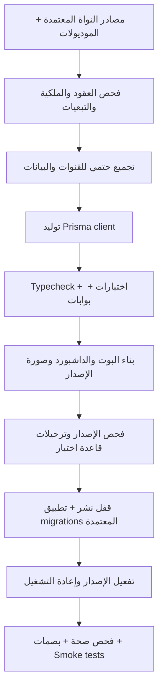

# خطة العمل 89: النواة الثابتة وقالب الموديولات والوظائف ذات الاكتشاف التلقائي

## Immutable Core & Automatically Discovered Modules — Specification and Implementation Plan

> **الحالة:** مسودة مواصفات وخطة تنفيذ للمراجعة؛ لم يبدأ التنفيذ البرمجي ولم تُعتمد جاهزية النواة.
> **التاريخ:** 2026-09-21.
> **الفرع الخاص بإعداد الخطة:** `plan/wp-89-immutable-core-autodiscovery`.
> **فرع التنفيذ المستقل لكامل الخطة:** `feat/wp-89-immutable-core-autodiscovery`؛ جميع المراحل P0–P11 وكوميتاتها داخل هذا الفرع، من أساس معتمد ونظيف عند بدء التنفيذ.
> **نمط التنفيذ:** منفّذ واحد وفق تفضيل المستخدم. تستخدم مهارة `superpowers:executing-plans` عند تكليف التنفيذ؛ لا تفويض ولا خدمة مراجعة بالذكاء الاصطناعي دون طلب صريح للمهمة.
> **Goal:** تمكين إضافة موديول أو وظيفة من ملفاتها الخاصة، واكتشاف البوت والداشبورد والصلاحيات وتعريفات البيانات تلقائيًا أثناء البناء والنشر، دون تعديل مصادر النواة بعد اعتمادها.
> **Architecture:** نواة ثابتة بعقود إصدارية، وموديولات تمتلك وظائفها وواجهاتها وبياناتها، وخط تجميع حتمي ينتج سجلات الربط ومخطط البيانات ومخرجات البناء. التفعيل يتم بعد التحقق والترحيل وإعادة التشغيل؛ لا تحميل ساخن.
> **Tech Stack:** تقنيات المشروع الحالية: TypeScript، pnpm workspace، grammY، Next.js/React، Prisma/PostgreSQL، Redis، Vitest، Docker. لا تشمل الخطة ترقية إصدارات هذه التقنيات.

---

## 1. مصدر التكليف والقرارات المعتمدة

1. المقصود بالنواة: كامل الوضع الحالي خارج الموديولات، ويشمل التطبيقات والحزم المشتركة والأدوات والتشغيل والحوكمة.
2. المطلوب النهائي: تطوير ملفات الموديول أو الوظيفة فقط عند النقل، مع حماية بقية المصادر المعتمدة.
3. الموديول يمثل مجال أعمال متماسكًا، دون حد عددي مصطنع لوظائفه. الوظيفة وحدة تطوير واختبار واعتماد وغلق مستقلة.
4. وافق المستخدم على الاكتشاف أثناء **البناء والنشر**، مع السماح بإعادة البناء والتشغيل.
5. لكل وظيفة واجهتا بوت وداشبورد عند الحاجة، ولهما نفس قواعد الأعمال والصلاحيات على الخادم.
6. إنشاء الجداول يعني تطبيق تعريفات وترحيلات صريحة يملكها الموديول. لا استنتاج للجداول من نصوص المحادثة، ولا تعديل تلقائي غير مراجع لبيانات الإنتاج.
7. ثبات مصادر النواة لا يعني ثبات الملفات المولدة أو سجلات الاعتماديات والنشر. تُحصر استثناءاتها وتُتحقق آليًا؛ لا تُترك كاستثناء عام.
8. الهدف القابل للإثبات: اجتياز جميع معايير القبول المقررة وصفر عيوب معروفة معلقة في نطاق الاعتماد. لا ادعاء باستحالة ظهور أخطاء مستقبلية.
9. تكليف هذه الجلسة هو **كتابة الخطة فقط**. اعتماد مبدأ البناء والنشر لا يُعد تصريحًا بفتح أقفال أو تغيير الحوكمة أو تنفيذ ترحيلات أو دمج فروع.

## 2. المرجعيات وأسبقية التعليمات

- `GEMINI.md`: المرجع الحاكم، خصوصًا الأجزاء 2 و4 و5 و6 و8 و10.
- `docs/27-enterprise-ai-governance-and-quality-gates-constitution.md`: المواصفات والبوابات والتوثيق.
- `.agents/rules/01-fhr-baseline-parity.md`، `02-autonomous-execution-and-checkpoints.md`، `03-git-branch-lifecycle-and-immunity.md`، `05-quality-gates-taxonomy-g1-g23.md`، `06-testing-and-mutation-constitution.md`، `10-ai-agent-discipline-and-preflight.md`.
- الخطة 70 لمحرك الغلق، والخطة 71 للتحكم في قوائم البوت، والخطة 88 لتوحيد الحوكمة وبنية الوظائف.
- `docs/19-legacy-to-enterprise-master-feature-migration-registry.md`: سجل النقل القائم.
- `F:\HR`: مرجع السلوك عند تكييف الوظائف الحالية أو نقل وظائف لاحقًا. هذه الخطة لا تمنح إذنًا لتغيير سلوك الأعمال.

أوامر المستخدم المباشرة لها الأولوية. لا يُشغّل وكلاء أو OCR ضمن هذه الخطة تلقائيًا. يُجري المنفذ مراجعة ذاتية موثقة، ولا ينسبها إلى مراجع مستقل. لا تحتوي الخطة على موافقات مصطنعة؛ تُستمد صلاحيات الفتح والغلق والتعديل والدمج من رسائل المستخدم وفق الصيغ في `GEMINI.md`.

## 3. الواقع المثبت بالفحص وحدود الدليل

الفحص هنا قراءة للمصادر بتاريخ الخطة، وليس تقرير نجاح اختبارات أو شهادة جاهزية تشغيلية.

| المجال | الدليل في المستودع | الفجوة التي تعالجها الخطة |
|---|---|---|
| اكتشاف الموديولات | `packages/core-components/src/module-bus/sovereign-auto-loader.ts` و`apps/bot-server/src/modules.registry.ts` | يوجد تحميل ديناميكي؛ يلزم تثبيت عقد بناء ونشر موحد والتحقق من الربط الإنتاجي |
| ربط الوظائف | `modules/workforce/src/flows.manifest.ts` و`module.routes.ts` | توجد قوائم وتجميعات مكتوبة يدويًا داخل الموديول |
| مولّد الموديول | `tools/scaffold/scaffold-module.ts` | يعدّل `apps/bot-server/package.json` و`apps/bot-server/src/modules.registry.ts` |
| مولّد الوظيفة | `tools/scaffold/scaffold-flow.ts` | يعدّل manifest الموديول؛ لا يحقق استقلال إضافة الوظيفة عن الملفات المشتركة |
| الداشبورد | `apps/admin-dashboard/src/dashboard.manifest.ts` و`tools/scaffold/scaffold-dashboard.ts` | قائمة مركزية وصفحات تنشأ في التطبيق، لا داخل الموديول |
| بناء الداشبورد | `apps/admin-dashboard/next.config.ts` | قائمة `transpilePackages` تتضمن أسماء الموديولات الحالية صراحة |
| البيانات | `packages/database/prisma.config.ts` و`packages/database/prisma/schema.prisma` | مخطط مركزي، وتوليد العميل مرتبط بحزمة قاعدة البيانات |
| الحاويات | `docker/Dockerfile` | نسخ ملفات وبناء `settings` و`workforce` بأسمائهما صراحة |
| الغلق | `tools/governance/unified-lock-engine.ts` و`verify-governance-tamper.ts` | أساس صالح للتوسعة، ويلزم إثبات حدود إضافة وظيفة دون تغيير بصمات الغلق الأب |
| بنية الوظيفة | `GEMINI.md` مقابل `tools/governance/verify-architecture.ts` | المرجع يطلب `controller.ts` وأسماء محددة، والفاحص يطلب `flow.handler.ts` وأسماء أخرى |

لا يُفترض أن جميع الاحتياجات المشتركة للوظائف القديمة متوفرة حاليًا. تتضمن المرحلة صفر حصر احتياجات النقل ومقارنتها بالخدمات الفعلية قبل إعلان الجاهزية.

## 4. نطاق العمل وحدوده

### 4.1 داخل النطاق

- عقود الموديول والوظيفة وواجهات الخدمة والصلاحيات وتوافق الإصدارات.
- الاكتشاف والتحقق والتجميع الحتمي ومخرجاته المنفصلة.
- ربط البوت والقوائم والجلسات، وربط صفحات الداشبورد وواجهات API.
- تركيب مخطط Prisma وإدارة ترحيلات الموديولات وتوليد العميل.
- تحديث المولّدات لتكتب داخل نطاق الموديول فقط.
- إعداد بناء workspace وDocker وCI ليشمل أي موديول مطابق دون تسجيل مركزي يدوي.
- تكييف الموديولات الحالية دون تغيير السلوك أو إعادة إنشاء البيانات.
- حماية النواة والموديول والوظيفة، ودستور نقل وقوالب أدلة واعتماد.
- إثبات عملي بإضافة موديول تجريبي ووظيفة لاحقة إليه بعد غلق بنيته المشتركة.

### 4.2 خارج النطاق

- نقل جميع وظائف `F:\HR` في هذه الخطة أو إعادة تصميم قواعدها المالية.
- تحميل موديولات أثناء التشغيل، ومتجر إضافات، وتشغيل كود جهات غير موثوقة.
- فصل النظام إلى خدمات مستقلة أو قاعدة بيانات منفصلة لكل وظيفة.
- توليد واجهة أعمال مكتملة من مجرد اسم وظيفة؛ التوليد يوفر البنية والربط، والمطور يكتب السلوك والشاشات.
- غلق النواة قبل استكمال الأدلة، أو اعتبار مرور فحوص شكلية دليلًا على سلامة الأعمال.

## 5. حدود النواة والمخرجات والملكية

### 5.1 التقسيم الملزم بعد التجهيز

| المنطقة | أمثلة | سياسة التغيير بعد اعتماد النواة |
|---|---|---|
| مصادر النواة | `apps/**/src`، `packages/**/src` باستثناء العميل المولد المحدد، `tools/**`، إعدادات البناء والحوكمة | لا تغيير بسبب إضافة موديول أو وظيفة |
| مصادر الموديول | `modules/<module>/**` | التغيير مقصور على الموديول المكلف به، مع احترام أقفال وظائفه |
| مخرجات الاشتقاق | `.generated/**`، `dist/**`، `.next/**`، مسار Prisma client المولد المحدد | توليد آلي موثق فقط؛ إعادة التوليد يجب أن تطابق المدخلات |
| سجلات الاعتماديات | `pnpm-lock.yaml` | تحديث أداة الحزم بسبب manifest الموديول، مع فحص عدم تغيير اعتماديات النواة القائمة |
| أدلة وحوكمة | خطة الوظيفة، سجل 19، topology، سجل الأقفال، أدلة الاختبار | تحديث مضبوط، لا يُستخدم لتغيير بصمات النواة أو اعتماد عمل غير مكتمل |
| حالة التشغيل | سجل ترحيلات DB، تهيئة القوائم، الجلسات | تتغير عبر عمليات موثقة قابلة للتدقيق مع الحفاظ على البيانات |

لا يستثني فاحص الثبات مجلدًا مثل `packages/database` أو `apps/admin-dashboard` بالكامل. يسمح فقط بالمسارات المولدة المسجلة مسبقًا. يتتبع الفاحص المحتوى **ومجموعة المسارات** لاكتشاف الإنشاء والحذف وإعادة التسمية، إضافة إلى التعديل.

المصدر الذي يكتبه المولد ويؤدي وظيفة تشغيلية ليس «مولدًا» بمجرد وضع تعليق عليه؛ يجب أن يكون مشتقًا حتميًا من مدخلات موثقة ويمكن إعادة بنائه في CI.

### 5.2 اتجاه الاعتماديات

```text
apps → runtime contracts + generated assembly → modules → packages
packages ─X→ modules/apps
module A ─X→ internal files of module B
```

- يستخدم الموديول واجهات خدمات مصدّرة أو أحداثًا بعقود إصدارية للتواصل مع غيره.
- يمنع الاستيراد المباشر من ملفات وظيفة أخرى؛ ينقل المشترك المستقر إلى خدمات المجال بعد تحليل أثر مستقل.
- لا سقف عددي لوظائف الموديول؛ فصل الموديولات يرتبط بملكية البيانات ودورة العمل والقواعد.
- الكود يعمل في نفس العمليات؛ ثبات الملفات ليس صندوق عزل أمنيًا. يلزم ضبط الصلاحيات والموارد وفشل التنفيذ، ولا يُسمح بإضافات غير موثوقة.

## 6. قالب الموديول والوظيفة المستهدف

الشجرة التالية مواصفة مستهدفة، وليست وصفًا لما تم تنفيذه. `sample-domain` و`89.1` مخصصان لمثال القبول في بيئة الاختبار.

```text
modules/sample-domain/
  package.json
  tsconfig.json
  module.contract.json
  src/
    index.ts
    module.register.ts
    shared/
      services.ts
      permissions.ts
    flows/89.1-create-record/
      flow.contract.json
      index.ts
      controller.ts
      menu.builder.ts
      action.handler.ts
      service.ts
      types.ts
      validator.ts
      error.handler.ts
    features/89.1/
      dashboard/page.tsx
      dashboard/client.tsx
      api/handler.ts
      data/repository.ts
  database/
    schema.prisma
    migrations/<globally-ordered-id>/migration.sql
    migrations/<globally-ordered-id>/migration.contract.json
  tests/
    flows/89.1-create-record.spec.ts
    dashboard/89.1-create-record.spec.tsx
    data/migrations.spec.ts
  docs/
    flows/89.1/migration-card.md
    flows/89.1/walkthrough.md
```

1. ملفات شريحة البوت التسعة والاختبار العاشر تتبع القائمة الصريحة في `GEMINI.md`. موارد الداشبورد والبيانات والتوثيق خارج مجلد الشريحة، لكنها مملوكة للوظيفة عبر عقدها.
2. لا يفرض ملف مستقل لكل نوع اختبار إن أمكن جمع الحالات في ملف اختبار الوظيفة؛ لا تنخفض تغطية الوحدة والتكامل والصلاحيات والواجهة والبيانات.
3. `src/features/<flow-id>` ليس موديولًا آخر؛ امتداد مملوك لنفس الوظيفة، وتشمَله بصمتها.
4. `module.register.ts` ثابت يستقبل الوظائف المكتشفة من التجميع، ولا يحتوي استيرادًا أو قائمة لكل وظيفة.
5. كل ما يُعرّف الوظيفة في القنوات المختلفة يعود إلى `flow.contract.json`، دون قوائم صلاحيات متعارضة أو manifest يدوي موازٍ.
6. جداول المجال المشتركة ملك للموديول؛ لا جدول مكرر لكل شاشة. إذا تطلبت وظيفة تعديل مخطط مشترك مغلق، فذلك تغيير مستقل معتمد للموديول؛ لا وعد باستقلال تغيير البيانات المشتركة.
7. القالب الجديد إصدار 2. الوظائف الحالية تُعامل كإصدار 1 في قائمة توافق صريحة ومحدودة أثناء الانتقال. منع استخدام التوافق لإضافة وظائف جديدة بالبنية القديمة.

## 7. العقود والاكتشاف والتجميع

### 7.1 عقد الموديول — الإصدار 2

ينشأ Zod schema في `packages/core-components/src/contracts/module-v2.contract.ts`، ويصدر JSON Schema إلى `docs/schemas/module-v2.schema.json`. تُنشأ `docs/schemas/` ضمن التنفيذ لأنها غير موجودة وقت الفحص.

حقول العقد الملزمة:

| الحقل | النوع/القيد |
|---|---|
| `schemaVersion` | القيمة `2` |
| `id` | اسم ASCII صغير يطابق اسم مجلد الموديول، وفريد على مستوى الإصدار |
| `version`، `coreApiRange` | إصدار الموديول ونطاق توافقه مع API النواة |
| `titleArabic` | عنوان عرض، يخضع نص الزر لميزانية UX مستقلة |
| `status` | `draft` أو `active` أو `maintenance` |
| `entry` | مسار نسبي داخل الموديول إلى factory معروفة التصدير |
| `dependencies` | قائمة `{ moduleId, versionRange }`؛ منع الدورات والتبعيات المفقودة |
| `requiredCapabilities` | أسماء خدمات النواة المطلوبة ونطاقات إصداراتها |
| `permissions` | مفاتيح صلاحيات بنطاق الموديول؛ لا اختراع أدوار سيادية جديدة |
| `database` | قيمة فارغة للموديول بلا بيانات، أو مسارات schema وmigrations وملكية الجداول |

أماكن الوظائف ثابتة `src/flows/*/flow.contract.json`؛ لا تُكتب قائمة الوظائف في عقد الموديول. المسارات النسبية تمنع `..` والمسارات المطلقة والخروج عبر symlink، بعد التحقق من المسار الحقيقي.

### 7.2 عقد الوظيفة — الإصدار 2

يُعرّف في `packages/core-components/src/contracts/flow-v2.contract.ts` ويصدر إلى `docs/schemas/flow-v2.schema.json`.

- `schemaVersion`, `id`, `moduleId`, `version`, `status`، وعنوان الوظيفة.
- `entry`: ملف البوت، أو قيمة فارغة إذا كانت الوظيفة خاصة بالداشبورد؛ يجب تعريف قناة واحدة على الأقل.
- `permissionKeys`: صلاحيات الاستخدام؛ التحقق منها على الخادم لكل إجراء.
- `bot`: نقطة البدء، callbacks المملوكة، موضع القائمة وترتيبها والنصوص والتنقل، أو قيمة فارغة.
- `dashboard`: المسار النسبي ومكوّن الصفحة والأيقونة والترتيب، أو قيمة فارغة.
- `api`: مصفوفة endpoints ذات `method`, `path`, `handler`, `permissionKey` وعقد إدخال/إخراج يصدّره handler.
- `ownedPaths`: المسارات الحصرية للوظيفة، ومنها الاختبارات والواجهة وrepository والتوثيق؛ منع اشتراك وظيفتين في ملكية نفس الملف.
- `usedModels`, `requiredCapabilities`, `legacyReferences`, `approvedBehaviorChanges`.
- حالة `Locked` لا تُصدَّق من JSON وحده؛ مصدرها سجل الغلق المتحقق منه.

المستندات النهائية توضح الفرق بين إصدار بنية العقد وإصدار API النواة وإصدار الموديول، ولا تُستخدم قيمة واحدة بديلًا عن الثلاثة.

### 7.3 السلوك الحتمي للمجمّع

1. اكتشاف عقود الموديولات والوظائف بالقراءة فقط؛ لا تنفيذ للكود أثناء قراءة metadata.
2. التحقق من Zod والملكية والصلاحيات ووجود نقاط الدخول والتوافق.
3. رفض تضارب IDs أو callbacks أو API method/path أو dashboard paths أو أسماء النماذج والجداول.
4. ترتيب الموديولات حسب التبعيات، ثم ID؛ وترتيب الوظائف حسب `order` ثم ID. منع الاعتماد على ترتيب filesystem.
5. توليد imports صريحة ومسارات نسبية قابلة للبناء؛ لا `eval` ولا مسارات import قادمة من طلب مستخدم.
6. نشر مخرجات التجميع كحزمة واحدة بعد اكتمال التحقق؛ فشل التوليد لا يستبدل الحزمة السابقة بنصف سجل.
7. فصل metadata المشتركة عن سجل server وعن سجل client، ومنع تسريب Prisma أو أسرار أو خدمات الخادم إلى bundle المتصفح.
8. ختم `catalogHash` ببصمات العقود ونقاط الدخول وملفاتها المملوكة ونسخة أدوات التوليد؛ تغيير كود الوظيفة دون تغيير العقد يغير بصمة الإصدار.

المخرجات:

```text
.generated/catalog/modules.json
.generated/catalog/flows.json
.generated/catalog/source-map.json
.generated/catalog/bot.registry.ts
.generated/catalog/dashboard.server.ts
.generated/catalog/dashboard.client.ts
.generated/catalog/api.registry.ts
.generated/catalog/permissions.json
.generated/database/schema.prisma
.generated/database/migrations/
.generated/release/manifest.json
```

هذه المخرجات لا تُحرر يدويًا. CI يعيد توليدها ويقارنها. لا يقرأ تشغيل الإنتاج موديولات غير موجودة في manifest الإصدار المبني.

## 8. ربط البوت والداشبورد والصلاحيات

### 8.1 البوت

- تطوير `SovereignAutoLoader` القائم بدل إنشاء محمّل متنافس. أثناء الإنتاج يستهلك سجل الإصدار؛ في التطوير يتم توليد السجل قبل التشغيل أيضًا.
- تمرير runtime services عبر واجهات معرفة الأنواع، وإزالة `any` من العقود الجديدة. أي انتقال للعقود القديمة يمر عبر adapter محدود.
- تسجيل كل route مرة واحدة. ترتيب التعارضات ليس حلًا: أي تضارب prefix يتسبب بفشل التحقق قبل التشغيل.
- ربط القوائم بمركز التحكم الحالي وخدمات bot-catalog. يحتفظ المستخدم بترتيبه وحالة التعطيل والصيانة؛ المزامنة لا تعيد ضبط تخصيصاته.
- تحديث metadata التقنية فقط، وإضافة العقد الجديدة بصورة idempotent، وتأريخ العقد المتوقفة دون حذف تاريخها.
- تنفيذ RBAC عند نقطة الدخول وعند action والخدمة الحساسة، حتى عند استدعاء callback قديم لزر مخفي.
- توجيه المدخلات النصية والملفات إلى الجلسة المالكة؛ عدم استهلاكها بواسطة أول وظيفة في قائمة عامة.
- سياسة الجلسة عند ترقية وظيفة: استئناف فقط عند توافق session schema، وإلا إنهاء آمن برسالة وإمكانية البدء مجددًا دون إعادة تنفيذ أثر مالي.
- الوظائف `draft` لا تظهر ولا تتاح مباشرة في الإنتاج. التعطيل يمنع التنفيذ ويحتفظ بالبيانات.

### 8.2 الداشبورد

اعتماد غلاف توجيه ثابت يُضاف مرة واحدة أثناء تجهيز النواة:

- `apps/admin-dashboard/src/app/admin/extensions/[module]/[[...path]]/page.tsx`.
- `apps/admin-dashboard/src/app/api/extensions/[module]/[[...path]]/route.ts`.
- الربط بمكونات الموديول عبر imports ثابتة مولدة قبل بناء Next.js.
- تجميع عناصر القائمة من catalog وإعادة استخدام التصميم الحالي وطبقة المصادقة والصلاحيات.
- تعريف الصفحة وhandler وDTO داخل الموديول. لا يتكرر منطق الأعمال بين البوت والداشبورد؛ كلاهما يستدعي خدمة الوظيفة نفسها.
- معالجة loading/error/not-found والـ RTL وميزانيات العرض، وفصل server/client components صراحة.
- رفض وصول غير مصرح حتى عند معرفة الرابط، والتحقق من tenant ونطاق البيانات عند الخدمة وAPI.
- الحفاظ على URLs الحالية في مرحلة التوافق بواسطة الصفحات الحالية أو تحويلات/rewrites مولدة، مع اختبار طرق HTTP والـ query والـ dynamic params. لا مسارات مكسورة عند الانتقال.
- إعداد `transpilePackages` وTypeScript وbundling مشتق من عقود الحزم المكتشفة، دون إضافة اسم موديول جديد إلى ملف مركزي.

### 8.3 الصلاحيات والتفعيل

تسجيل permission key لا يمنح الصلاحية تلقائيًا. تستخدم آلية RBAC الحالية وتبقى أدوار السيادة ثابتة. المفاتيح غير المعروفة أو التي لا يوجد لها grant صالح تُرفض. البوت والقائمة وصفحة الداشبورد وAPI تعتمد المرجع نفسه، مع بقاء تحقق الخادم إلزاميًا.

## 9. ملكية البيانات وترحيلاتها

### 9.1 القرار المعماري

الإبقاء على قاعدة PostgreSQL وPrisma client موحدين في هذه المرحلة. فصل مصادر تعريفات المجالات وتجميعها في مخطط مشتق؛ لا إنشاء client أو اتصال مستقل لكل وظيفة.

- تبقى تعريفات الكيانات المشتركة في `packages/database/prisma/schema.prisma` بعد إعادة تنظيم معتمدة لمرة واحدة.
- تعريفات المجال تنتقل إلى `modules/<module>/database/schema.prisma` عندما تكون ملكيتها معروفة. النماذج القديمة التي لا يوجد موديولها بعد تبقى في baseline الحالي حتى نقل ملكيتها بخطة منفصلة.
- لا إعادة تسمية جدول أو عمود أو فقد `@map`/`@@map` أو default/index/constraint بسبب نقل موقع تعريفه.
- المجمّع ينتج ملف schema واحدًا، ويُمرَّر إلى إعداد Prisma أثناء البناء. provider وdatasource وgenerator معرّفة مرة واحدة في النواة.
- لحل العلاقات العكسية مع نموذج مشترك: عقد محدود لإضافات العلاقات في `modules/<module>/database/relations.contract.json` يحدد target model/field/type/relation، ويدمج في **المخطط المولد فقط**. لا regex لرقع schema، ولا صلاحية لتغيير scalar fields أو constraints المشتركة.
- يلزم تحقق بنيوي و`prisma validate` واختبار صفر فرق DDL عند نقل ملكية التعريفات القديمة. أي تغيير حقيقي في بيانات النواة يُفصل عن النقل.
- يحتفظ العميل المولد بمسار معروف مستثنى صراحة، ويعاد توليده قبل typecheck والبناء. هذا تغيير لمخرجات الاشتقاق، وليس تعديلًا لمصادر النواة.

### 9.2 سجل الترحيلات

- الاحتفاظ بأسماء ومحتوى وبصمات جميع الترحيلات السابقة في `packages/database/prisma/migrations` دون إعادة كتابة أو إعادة تنفيذ.
- الترحيلات الجديدة تحت الموديول، ومع كل منها `migration.contract.json` يتضمن ID عالميًا فريدًا، والمالك، وdependencies، وتصنيف compatibility، واستراتيجية التراجع.
- التجميع ينشئ مجلد migrations موحدًا لـ Prisma يحافظ على هوية الملفات السابقة. المعرّف يبدأ بترتيب زمني عالمي ويحتوي module ID؛ يُرفض التكرار والإدراج المتأخر قبل آخر migration مطبق. تُصحح collisions قبل النشر دون تعديل سجل مطبق.
- التحقق من أن DDL يخص جداول الموديول أو العلاقات المعتمدة فقط، وتجربته على قاعدة معزولة بصلاحيات نشر مماثلة. لا يكفي البحث النصي في SQL.
- تعديل migration سبق تطبيقه يفشل بسبب checksum drift؛ لا تعديل لسجل Prisma لتجاوز الفشل.
- التوليد وbuild لا يتصلان بقاعدة الإنتاج. apply migrations خطوة نشر منفصلة باستخدام identity ذات صلاحية DDL؛ هوية تشغيل البوت والداشبورد لا تملكها.
- قفل PostgreSQL للنشر يمنع تشغيل ناشرين متزامنين. يوثّق ترتيب migration والمدة والنتيجة دون بيانات حساسة.
- الترحيلات التوافقية الإضافية هي النمط الافتراضي. حذف/إعادة تسمية/تحويل بيانات حساس يحتاج خطة expand/contract وصلاحية مستقلة ونسخة احتياطية مجرّبة.
- التراجع الافتراضي يعيد إصدار التطبيق السابق مع إبقاء توسعات schema المتوافقة؛ لا DROP تلقائيًا عند تعطيل موديول. إن كانت استعادة DB لازمة، تُختبر على نسخة معزولة وتوثّق حدود فقد البيانات وقرار المشغل.

## 10. خط البناء والنشر



- أمر التحقق/البناء لا ينشر ولا ينفذ ترحيلات إنتاج. أمر النشر يستهلك artifact سبق التحقق منه ومربوطًا بـ commit وcatalogHash.
- لا تشغيل جزئي بعد فشل migration أو فشل خدمات مطلوبة. يفشل health/readiness بوضوح ويبقى الإصدار السابق عندما يكون متوافقًا مع المخطط.
- Docker ينسخ مجموعة الموديولات ويبنيها بالـ dependency graph، دون قوائم `workforce/settings` صلبة. تُضبط `.dockerignore` لاستبعاد الأسرار والـ caches والمخرجات المحلية.
- تحديث lockfile يتم قبل CI؛ CI يستخدم frozen lockfile ولا يعيد حل الاعتماديات من تلقاء نفسه.
- مقارنة قسم اعتماديات النواة في lockfile تمنع تغيير إصداراتها العابرة بسبب إضافة موديول دون مراجعة مستقلة.
- بناء التطوير والإنتاج يستخدمان نفس catalog والتحقق. لا نجاح وهمي مع `tsx` يفشل لاحقًا مع `dist`.
- في إعادة البناء بنفس المدخلات، تتطابق المخرجات الدلالية وبصماتها. تُعزل timestamps وbuild IDs عن مقارنة الحتمية.

### 10.1 بيئة التجربة المبسطة المعتمدة

المشروع في مرحلة التطوير ولا توجد بيانات إنتاج حقيقية وفق توضيح المستخدم. الغرض من العزل حماية حالة التطوير وإتاحة اختبار قابل للتكرار؛ لا تتطلب هذه الخطة إنشاء خادم PostgreSQL إضافي أو بيئة إنتاج موازية. لفظ النشر في تجربة القبول يعني تشغيل الإصدار داخل بيئة الاختبار المحلية.

1. **الكود:** جميع مراحل التنفيذ داخل الفرع المستقل المحدد. الفرع يعزل ملفات المصدر، ولا يغير تلقائيًا وجهة اتصالات قاعدة البيانات أو Redis.
2. **PostgreSQL:** إعادة استخدام خادم PostgreSQL الموجود، وإنشاء قاعدة مستقلة باسم `alsaada_test_db`. تحتوي مخطط المشروع الكامل بعد التجميع، وجميع الترحيلات اللازمة، وجداول الموديول التجريبي وبيانات اصطناعية مترابطة. لا نقل لبيانات قاعدة التطوير ولا مسح لها.
3. **هوية قاعدة الاختبار:** مستخدم مخصص محدود بقاعدة الاختبار، دون superuser أو صلاحيات إدارة قواعد التطوير الأخرى. هوية تهيئة القاعدة منفصلة عن هوية تشغيل التطبيقات. يحتفظ مشغل PostgreSQL بحق إدارة الخادم؛ لا يعد اشتراك الخادم عزلًا كاملًا للموارد أو للأعطال.
4. **Redis:** حاوية اختبار مستقلة باسم خدمة `redis-wp89-test` وvolume مستقل إن لزم حفظ الحالة. لا مشاركة قاعدة Redis أو جلسات أو queues الحالية، ولا استخدام `FLUSHALL` على خدمة التطوير. يكفي الوصول عبر شبكة الاختبار؛ نشر منفذ على الجهاز يكون عند الحاجة فقط وعلى localhost بمنفذ غير مستخدم.
5. **التشغيل:** ملف إعداد محلي مستقل مستبعد من Git يحدد قاعدة الاختبار وRedis ومنافذ البوت والداشبورد. لا تعديل ملف إعدادات التطوير الموجود ولا fallback إليه عند غياب متغير اختبار. يفشل التشغيل إذا تعارض المنفذ بدل إيقاف خدمة أخرى تلقائيًا.
6. **الحارس:** قبل التهيئة أو إعادة الاختبار، يتحقق الأمر من اسم قاعدة البيانات الفعلي وهوية الاتصال وعلامة خاصة ببيئة الاختبار، ومن اتصال Redis المخصص. يرفض قاعدة التطوير أو وجهة مجهولة. إعادة الإنشاء والتنظيف محصوران في موارد الاختبار المعروفة؛ لا إزالة volume الخاص بـ PostgreSQL المشترك.
7. **التكرار:** بيانات seed اصطناعية ثابتة ووقت اختبار مثبت. تختبر دورة إنشاء كاملة من الصفر ودورة ترقية قاعدة اختبار بها بيانات سابقة، دون الحاجة إلى بيانات إنتاج. اختبارات التراجع والنسخ الاحتياطي في هذه الخطة تستخدم قاعدة الاختبار فقط.
8. **تجربة Telegram اليدوية:** تمنع النسختان من استهلاك تحديثات نفس هوية البوت بالتزامن. تستخدم هوية اختبار إن كانت متاحة، أو توقف نسخة التطوير المستهلكة لنفس الهوية خلال التجربة المنسقة ثم تعيد تشغيلها. لا توجّه نسخة التطوير وقاعدة الاختبار إلى نفس queues.

**ملفات التنفيذ ضمن P7:** إنشاء `docker/compose.wp89-test.yml` لخدمة Redis ونسخ التطبيقات التجريبية دون خدمة PostgreSQL مكررة، و`tools/modules/test-environment.ts` لحارس البيئة والتهيئة. توثق أسماء المتغيرات والموارد في `docs/ai-execution-evidence/wp-89/deployment-runbook.md`. يعدل CI لاستخدام PostgreSQL الخاص بالـ runner وRedis المعزول لديه، دون اتصال بخدمات جهاز المطور. تضاف أثناء التجهيز أوامر ثابتة `pnpm modules:test-env:up` و`pnpm modules:test-env:verify` و`pnpm modules:test-env:down`؛ أمر الإيقاف لا يحذف بيانات التطوير ولا ينظف قاعدة الاختبار إلا بطلب صريح مستقل.

**قبول العزل:** اختبار سلبي لاتصال قاعدة التطوير وRedis التطوير يثبت رفض الأداة قبل أي كتابة. يقارن سجل حالة موارد التطوير قبل التجربة وبعدها لإثبات عدم تعديلها؛ لا ادعاء بعزل موارد PostgreSQL بالكامل ما دام الخادم مشتركًا.

## 11. سياسة الغلق والثبات

1. توسيع محرك الغلق الحالي؛ لا محرك موازٍ ولا تعطيل للفاحص القائم.
2. baseline النواة يسجل نسخة العقود ومجموعة المسارات وبصماتها. لا إعادة حساب baseline عند إضافة موديول لتبرير تغييرها.
3. غلق بنية الموديول يشمل عقده ونقطة دخوله وخدماته المشتركة، ويستثني فقط ملكيات وظائفه المسجلة ومخرجاته المشتقة.
4. غلق الوظيفة يشمل ملفات البوت والداشبورد وAPI وrepository والاختبارات والتوثيق المملوك لها، وليس مجلد البوت وحده.
5. بيانات الموديول وترحيلاته كيان غلق مستقل عند الحاجة؛ إضافة migration تتطلب صلاحية تغيير هذا الكيان، ولا تستدعي فتح النواة.
6. إضافة وظيفة جديدة لا تستدعي تعديل manifest الموديول أو إعادة غلق الوظائف القديمة. يثبت الاختبار بقاء بصماتها ومجموعة مساراتها دون تغيير.
7. `governance.lock.json` قابل للتحديث المصرح لإضافة كيان جديد، مع تحقق أن entries القديمة لم تتغير. لا توضع موافقات بشرية مختلقة في metadata أو الأدلة.
8. أي نقص جديد في خدمة نواة ينتج طلب تغيير مستقل، وتحليل أثر واختبار مستهلكيها وإصدارًا جديدًا. لا يرقّع أثناء نقل وظيفة.
9. ادعاء اكتمال النقل أو الغلق ممنوع قبل مراجعة الأدلة وتحقق الأقفال الفعلية. المولّد ينشئ `draft` فقط.

## 12. تقسيم التنفيذ إلى حزم متتابعة

هذه خطة رئيسية متعددة الحزم. كل حزمة أدناه لها ملفات واختبارات ومخرج مستقل، وتنفذ بالتتابع. المواصفات أعلاه هي المرجع؛ تُكتب التفاصيل البرمجية والاختبارات القابلة للتنفيذ قبل كود كل حزمة، ولا تتغير العقود في صمت أثناء التنفيذ.

المسارات الجديدة المقترحة ليست موجودة بالضرورة الآن. لا تُنشأ لمجرد ورودها هنا. كل task يستخدم الترتيب: اختبار يفشل لسبب مرتبط بالمطلوب → تنفيذ محدود → اختبار ينجح → فحوص أثر → مراجعة diff → commit مستقل بعد الشروط. لا تعديل لاختبارات قائمة لتجميل النتائج.

### P0 — تثبيت خط الأساس والمواصفات والقفل

**قراءة:** `GEMINI.md`، سجل 19، topology، contracts، الحزم المشتركة، الاختبارات وCI وlock الحالي، وأجزاء `F:\HR` المتعلقة بالاحتياجات المشتركة.

**إنشاء:**
- `docs/ai-execution-evidence/wp-89/baseline.md`.
- `docs/ai-execution-evidence/wp-89/core-capability-matrix.md`.
- `docs/ai-execution-evidence/wp-89/ownership-map.json`.
- `docs/ai-execution-evidence/wp-89/authorization-scope.md`.

- [ ] تسجيل branch وcommit وحالة العمل وإصدارات الأدوات الفعلية؛ الحفاظ على أي عمل قائم دون reset أو stash تلقائي.
- [ ] حصر الملفات المغلقة المطلوبة لكل حزمة وربطها بكيانات الغلق؛ طلب الصلاحيات اللازمة من المستخدم عند التنفيذ قبل لمسها، وفق المرجع الحالي.
- [ ] مقارنة احتياجات الوظائف المتبقية من سجل 19 والقديم مع خدمات النواة: موجود ومثبت، موجود غير مثبت، ناقص؛ ترتيب الفجوات بحسب استخدامها ومخاطرها.
- [ ] جرد جميع مكونات النواة خارج الموديولات: لكل مكون مسؤولية ومستهلكون وعقد وتغطية واختبار فشل. يشمل انقطاع DB وRedis، وإعادة الاتصال، والجلسات، وoutbox والتعويض وإعادة المحاولة، والهوية والتشفير والسجلات والموارد. لا تقتصر شهادة الجاهزية على محمل الموديولات.
- [ ] فصل فجوات النواة الجوهرية التي تحتاج تغيير أعمال أو نطاقًا إضافيًا إلى خطط مستقلة مرتبطة؛ لا تعلن جاهزية النقل قبل إغلاق ما يؤثر منها على مصفوفة الاحتياجات. يسجل كل عنصر وأثره على قرار الاعتماد.
- [ ] تشغيل baseline checks الحالية وتوثيق أعطالها السابقة منفصلة. عطل مصدر قائم يتبع RCA الدستوري، ولا يُصلح عَرَضًا ضمن إعادة الهيكلة.
- [ ] اعتماد ملكية النماذج والخدمات وخريطة old/new لكل وظيفة قائمة؛ لا نقل ملكية جدول بالتخمين.
- [ ] توثيق تعارض بنية الوظائف والفاحص، وتحديد adapter الإصدار 1 والقائمة المحصورة لوظائفه.

**الخروج:** baseline موثق، قائمة النقص قابلة للمعالجة، ونطاق التعديلات محدد. لا شهادة نواة مستقرة في هذه المرحلة.

### P1 — العقود والتحقق من الحدود

**إنشاء:** `packages/core-components/src/contracts/module-v2.contract.ts`، `flow-v2.contract.ts`، `capability.contract.ts`، `docs/schemas/module-v2.schema.json`، `docs/schemas/flow-v2.schema.json`، `packages/core-components/tests/module-v2-contract.spec.ts`.

**تعديل:** `packages/core-components/src/index.ts`، عقود module/flow الحالية عبر adapter متوافق، `tools/governance/verify-architecture.ts` و`verify-flow-contracts.ts`، `GEMINI.md` وrulebook البنية عند الحاجة إلى توضيح موثق ومصرح فقط.

- [ ] كتابة حالات لقبول عقد v2 صحيح، ورفض version غير مدعومة ومسار خارج الموديول ومفتاح صلاحية مفقود.
- [ ] تعريف schemas وأكواد أخطاء ثابتة وإخراج path/field المسؤول؛ لا casting يتجاوز runtime validation.
- [ ] تعريف service capability registry بأسماء وإصدارات معلنة، ورفض missing capability قبل تشغيل الموديول.
- [ ] تحديث فاحص البنية ليفحص v2 وفق SSOT، ويقبل فقط وظائف v1 الموجودة في قائمة compatibility المثبتة.
- [ ] إثبات أن وظيفة جديدة لا يمكنها التحايل بإعلان v1، وأن اختبارات البنية القديمة تظل فعالة على النطاق القديم.

**الخروج:** عقود إصدارية معلنة، خطأ مفهوم لأي عقد غير صالح، وعدم توسيع الاستثناء إلى كل الموديولات.

### P2 — فهرسة وتجميع الموديولات والوظائف

**إنشاء:**
- `tools/modules/catalog.ts`، `validate-catalog.ts`، `generate-catalog.ts`، `cli.ts`.
- `tools/modules/tests/catalog.spec.ts`، `catalog-determinism.spec.ts`، `catalog-boundaries.spec.ts`.

**تعديل:** `package.json` لإضافة الأوامر المحددة في القسم 13، `.gitignore`، `tsconfig.json` و`tsconfig.dev.json` عند الحاجة لمسارات المخرجات.

- [ ] بناء fixture لموديولين ووظيفتين، وترتيب filesystem مختلف، وعقد مع symlink خارج الجذر، ودورة dependencies.
- [ ] إثبات الرفض قبل import لأي مسار غير صالح أو تصادم؛ فحص realpath على Windows وLinux.
- [ ] توليد imports والقوائم والـ source map وفق القسم 7، وكتابة output مؤقت ثم استبداله بعد نجاح المجموعة.
- [ ] إضافة schema/core API compatibility، ووضع مسار الخطأ ومالك العنصر في التقرير.
- [ ] إثبات تطابق hash لتجميعين بنفس المدخلات، وتغيّره عند تعديل service دون تغيير contract.

**الخروج:** catalog لا يحتاج تحرير أي قائمة مركزية، وgeneration لا يكتب خارج allowlist مخرجاته.

### P3 — تكامل البوت والجلسات والقوائم

**تعديل:** `packages/core-components/src/module-bus/sovereign-auto-loader.ts`، `apps/bot-server/src/modules.registry.ts`، `apps/bot-server/src/bot.ts`، خدمات `packages/core-components/src/bot-catalog/`، ونقاط الدخول المشتركة في الموديولين الحاليين ضمن النطاق المعتمد.

**إنشاء:** `packages/core-components/src/module-bus/catalog-adapter.ts`، `apps/bot-server/tests/catalog-bot-integration.spec.ts`، `apps/bot-server/tests/catalog-session-routing.spec.ts`.

- [ ] اختبار وظيفة fixture يستقبل مسارها callback مرة واحدة ويكتب سجلًا واحدًا عند إعادة الطلب بنفس idempotency key.
- [ ] اختبار رفض وظيفة draft أو disabled عبر رابط/زر قديم، ورفض دور غير مصرح.
- [ ] ربط loader بالسجل المولد والمصانع typed، وإزالة الحاجة لتسمية الموديول الجديد في `bot.ts`.
- [ ] مزامنة القوائم دون overwrite لترتيب وحالات المستخدم، واختبار تكرار المزامنة دون duplication.
- [ ] إثبات توجيه النص والصورة والملف إلى الجلسة الصحيحة وإغلاق جلسة إصدار غير متوافق بأمان.
- [ ] تسجيل boot diagnostics وhealth للخدمات والموديولات المطلوبة؛ منع نجاح readiness إذا فشل موديول مطلوب.

**الخروج:** البوت يكتشف موديولًا جديدًا ووظيفة لاحقة من catalog مع الحفاظ على السلوك القائم.

### P4 — الداشبورد وواجهات API والصلاحيات

**إنشاء:** غلافا page/route المحددان في القسم 8، `apps/admin-dashboard/src/lib/module-catalog.ts`، `apps/admin-dashboard/tests/module-pages.spec.tsx`، `module-api-auth.spec.ts`، `module-client-boundaries.spec.ts`.

**تعديل:** `apps/admin-dashboard/src/dashboard.manifest.ts` كجسر توافق ثم كقارئ catalog، `apps/admin-dashboard/next.config.ts`، `apps/admin-dashboard/tsconfig.json`، ومكونات navigation الحالية المستهلكة للقائمة دون إعادة تصميمها.

- [ ] اختبار صفحة fixture تظهر في القائمة وتُفتح فعليًا، وAPI ينفذ الخدمة المشتركة؛ لا يكفي اختبار وجود عنوان في array.
- [ ] اختبار رفض المستخدم غير المصرح، ونطاق tenant مخالف، وmethod غير مسموحة، ومسار غير موجود.
- [ ] توليد registries منفصلة للخادم والمتصفح؛ فحص أن client bundle لا يتضمن اتصال DB أو استيرادات خادم.
- [ ] بناء adapters للتوجيه والـ server/client props والتحقق من المدخلات وفق عقود الوظيفة.
- [ ] اختبار `next build` إنتاجي للصفحة، وRTL والموبايل وحالات الخطأ، والحفاظ على روابط الوظائف الحالية.

**الخروج:** صفحة وAPI موديول جديد يعملان دون إنشاء ملفات جديدة داخل تطبيق الداشبورد عند النقل اللاحق.

### P5 — تركيب البيانات وترحيلاتها

**إنشاء:** `tools/modules/compose-database.ts`، `validate-migrations.ts`، `deploy-migrations.ts`، `tools/modules/tests/database-composition.spec.ts`، `migration-upgrade.spec.ts`، `migration-concurrency.spec.ts`.

**تعديل:** `packages/database/prisma.config.ts`، `packages/database/package.json`، `packages/database/prisma/schema.prisma` في نقل الملكية المعتمد فقط، وصادرات العميل إذا احتاج التجميع ذلك. **لا تعديل للترحيلات القديمة**.

- [ ] حفظ schema baseline وDDL لقواعد اختبار؛ اختبار نقل التعريفات دون اختلاف database shape أو checksum للترحيلات القائمة.
- [ ] تركيب fragments وفحص AST/structure وإضافات العلاقات المسموحة؛ رفض duplicate model/table والعبث بحقول نواة.
- [ ] توليد العميل مرة واحدة قبل المستهلكين، والتحقق من عدم حلقة build بين database والموديولات.
- [ ] اختبار fresh install واختبار upgrade من نسخة بيانات ممثلة، وفحص rows وconstraints والفهارس بعد الترحيل.
- [ ] اختبار إعادة النشر دون تكرار، وناشرين متزامنين، وترحيل يفشل، وترحيل مطبق تغير محتواه؛ يجب منع التفعيل في الحالات غير الصالحة.
- [ ] إثبات نجاح rollback للتطبيق مع توسعة schema متوافقة، وتجربة مسار استعادة backup لسيناريو مصنف غير متوافق في قاعدة معزولة.

**الخروج:** جدول الموديول ينشأ من ترحيله في مرحلة النشر، مع سجل ثابت ودون تعديل مصادر النواة لإضافة الجدول التالي ضمن العقود المتاحة.

### P6 — تطوير المولّدات الحالية

**تعديل:** `tools/scaffold/scaffold-module.ts`، `scaffold-flow.ts`، `scaffold-dashboard.ts`، `scaffold-test.ts`.

**إنشاء:** `tools/scaffold/scaffold-module-migration.ts`، `tools/scaffold/tests/module-v2-scaffold.spec.ts`، `flow-v2-scaffold.spec.ts`، `scaffold-write-scope.spec.ts`، وقوالب تحت `tools/scaffold/templates/module-v2/` و`flow-v2/`.

- [ ] إثبات فشل المولد القديم في اختبار scope لأنه يكتب خارج الموديول، دون تشغيله على المستودع الحقيقي؛ استخدم fixture معزولًا.
- [ ] تحديث `make:module` لإنشاء عقد ومصنع وخدمات فارغة typed ووظائف draft، دون كتابة bot package/registry أو dashboard manifest.
- [ ] تحديث `make:flow` ليكتب مصادر الوظيفة ومواردها واختبارها فقط، ويمنع collision أو overwrite.
- [ ] توجيه `make:dashboard-feature` إلى ملكية الوظيفة داخل الموديول، مع منع duplicate sources للقائمة.
- [ ] إضافة مولّد migration يكتب داخل `modules/<module>/database/migrations` ويطلب تعريف DDL صريحًا؛ لا ينفذ DB أوامر.
- [ ] مقارنة snapshot كامل للملفات قبل/بعد، بما فيه الملفات غير المتتبعة، وإثبات عدم تعديل المصادر المشتركة أو سجل الغلق.

**الخروج:** أوامر التوليد تلتزم بحدود الملكية، ولا تصف وظيفة draft بأنها جاهزة أو مغلقة.

### P7 — البناء الإنتاجي وCI والنشر

**تعديل:** `docker/Dockerfile`، `docker-compose.yml`، `.dockerignore`، `.github/workflows/ci.yml`، `.github/workflows/release.yml`، `package.json`، إعدادات build للتطبيقين والحزم، وأي Dockerfile للداشبورد يثبته جرد P0 ضمن سجل نطاق واضح.

**إنشاء:** `tools/modules/build-release.ts`، `deploy-release.ts`، `verify-release.ts`، `tools/modules/tests/release-artifact.spec.ts`، `docs/ai-execution-evidence/wp-89/deployment-runbook.md`.

- [ ] إضافة موديول fixture غير اسمي `settings/workforce` إلى build context، والتحقق من وجوده في artifact وتشغيل entrypoint المترجم.
- [ ] استبدال أوامر النسخ والبناء الصلبة باكتشاف workspace وdependency graph؛ بناء Prisma قبل المستهلكين وتوليد registry قبل Next.
- [ ] إنتاج release manifest يربط core hash وcatalog hash وmigration checksums والـ commit وruntime versions.
- [ ] توليد إعدادات تجميع مستهلكي catalog تحت `.generated/build/` عند الحاجة، بدل تعديل `rootDir` أو `paths` يدويًا لكل موديول. اختبار imports من TypeScript ثم JavaScript المترجم، وحل workspace dependencies في الصورة الفعلية.
- [ ] فصل build عن deploy، وربط deploy فقط بإصدار متحقق ومحدد البيئة؛ منع deploy لموديول draft.
- [ ] فحص readiness للبوت والداشبورد بعد migrations وإعادة التشغيل، ومسار إعادة الإصدار السابق عند الفشل.
- [ ] التأكد من أن CI لا يغير lockfile ولا sources، وأن أسرار runtime لا توجد في الصورة أو client bundle.

**الخروج:** بناء ونشر قابلان للتكرار لموديول جديد دون تعديل Dockerfile أو workflows في كل إضافة.

### P8 — تكييف الموديولات الحالية والمحافظة على السلوك

**تعديل محدد بعد خريطة P0:** `modules/settings/module.contract.json`، `modules/workforce/module.contract.json`، ملفات `module.register.ts` و`module.routes.ts` و`flows.manifest.ts` في الموديولين، موارد الداشبورد المنقولة بملكية محددة، ونقاط الاعتماد الصريح في البوت.

**إنشاء:** `docs/ai-execution-evidence/wp-89/compatibility-map.md`، `tools/modules/tests/existing-modules-parity.spec.ts`، ومهايئات انتقال داخل الموديول المعني فقط.

- [ ] تثبيت خريطة callbacks وURLs وpermissions وsession keys والجداول لكل وظيفة حالية قبل النقل البنيوي.
- [ ] تكييف موديول واحد وتشغيل اختبارات parity واختبار يدوي مسجل قبل الانتقال للثاني.
- [ ] إبقاء factory أو route القديم كجسر حين يلزم، ومنع تسجيل handler القديم والجديد معًا.
- [ ] نقل UI وAPI إلى الموديول دون تغيير رحلة المستخدم؛ حماية الروابط القائمة عبر تحويلات مولدة مختبرة.
- [ ] نقل metadata إلى contracts ثم إزالة الازدواج بعد إثبات تطابق catalog. لا يُحذف مسار مستخدم قبل تأمين بديله.
- [ ] توثيق أي عنصر لا يمكن تكييفه دون تغيير أعمال كطلب منفصل؛ لا إعلان اكتمال التوافق إذا بقي استثناء غير محلول في النطاق.

**الخروج:** الموديولان الحاليان يعملان على مسار التجميع نفسه، أو عبر جسور محصورة موثقة ليس لها تسجيل يدوي مطلوب للموديولات الجديدة.

### P9 — إنفاذ الغلق واختبار عدم المساس بالنواة

**تعديل:** `tools/governance/unified-lock-engine.ts`، `verify-governance-tamper.ts`، `verify-architecture.ts`، `generate-topology.ts`، hooks القائمة و`package.json`، وسجل الغلق عند صدور الصلاحية فقط.

**إنشاء:** `tools/governance/verify-core-immutability.ts`، `verify-module-boundaries.ts`، `tests/core-immutability.spec.ts` و`tests/module-boundaries.spec.ts` تحت `tools/governance/`، `docs/ai-execution-evidence/wp-89/core-baseline.json`.

- [ ] اختبار رفض تغيير ملف نواة وإضافة ملف نواة وحذف ملف، ورفض إخفاء مصدر معدّل تحت استثناء generated.
- [ ] اختبار إضافة وظيفة جديدة دون تغيير بصمة الموديول المشتركة أو وظائفه السابقة.
- [ ] اختبار ملكية موارد dashboard/tests/database بما يمنع سقوطها خارج جميع الأقفال أو امتلاكها مرتين.
- [ ] السماح بإضافة سجل غلق مصرح فقط مع مقارنة entries القديمة؛ منع silent rebaseline.
- [ ] ربط verifier بـ CI والتحقق المحلي، وإعادة توليد outputs للتحقق منها بدل تجاهلها.

**الخروج:** تعديل مصدر نواة يفشل، وإضافة وظيفة مطابقة تمر دون فتح النواة؛ مع بقاء الغلق عملية اعتماد منفصلة وفق صلاحيات المشروع.

### P10 — دستور النقل وقوالب الإثبات

**إنشاء:** `docs/module-migration-constitution.md`، `docs/templates/module-migration-card.md`، `docs/templates/flow-migration-card.md`، `docs/templates/core-change-request.md`، `docs/templates/module-acceptance-report.md`.

**تعديل عند التنفيذ:** سجل 19 لإضافة قدرة النواة الجديدة تحت المستحدثات بعد اعتمادها، ومرجع README ووثائق العقود القائمة ذات الصلة؛ لا وسم وظائف قديمة مكتملة بسبب إنشاء القالب.

- [ ] إصدار دستور تنفيذي تابع لـ `GEMINI.md` لا مرجعية متنافسة، يثبت قواعد القسم 15.
- [ ] توثيق أوامر المولّدات والعقود ومكان كل ملف، ودورة DB والـ grants والتعطيل والتراجع.
- [ ] تسجيل أمثلة بطاقة نقل مكتملة للـ fixture ووظيفة قائمة، مع روابط أدلة فعلية لا قيم نجاح جاهزة.
- [ ] تحديث topology وسجل النقل وموقع الوثائق عبر المسار الموجود، وفحص عدم انحراف النسخ المولدة.

**الخروج:** منفذ جديد يستطيع إنشاء ونقل وظيفة باتباع القالب ومعرفة متى يلزم تغيير مستقل للنواة أو للموديول.

### P11 — اختبار القبول الشامل واعتماد الإصدار الأساسي

**إنشاء:** fixture مصادر تحت `tools/modules/tests/fixtures/acceptance-module/`، `tools/modules/tests/module-onboarding.e2e.spec.ts`، `docs/ai-execution-evidence/wp-89/acceptance-report.md` و`walkthrough.md` في نفس مجلد الأدلة.

- [ ] تجهيز العزل المبسط وفق القسم 10.1: قاعدة `alsaada_test_db` داخل PostgreSQL الموجود، وRedis مستقل، وإعدادات تشغيل اختبار خاصة؛ التحقق من حارس الوجهة قبل أي تهيئة وعدم تغيير بيانات التطوير.
- [ ] تسجيل baseline بصمات النواة، ثم توليد موديول fixture فعلي في نسخة الاختبار فقط.
- [ ] إضافة وظيفة `89.1` للبوت والداشبورد وAPI وجدول sample مملوك للموديول؛ build ثم migrate ثم تشغيل artifact.
- [ ] تنفيذ إنشاء سجل من البوت، قراءته من الداشبورد، ورفض مستخدم غير مصرح على القناتين؛ فحص SQL rows الفعلية.
- [ ] اعتماد fixture ضمن اختبار محرك الغلق، ثم إضافة وظيفة `89.2` تقرأ بياناته دون تغيير ملفات الوظيفة الأولى أو بنية الموديول المشتركة.
- [ ] اختبار توسعة بيانات بمهمة بيانات منفصلة مصرح بها في fixture، مع بقاء baseline النواة ثابتًا.
- [ ] تنفيذ جدول القبول في القسم 14 كاملًا، والاختبار اليدوي للبوت والداشبورد في بيئة اختبار وتسجيل النتائج الفعلية.
- [ ] تشغيل فحوص المشروع الكاملة وإغلاق العيوب المعروفة ضمن نطاق هذه الخطة؛ لا اعتماد عند أي فشل غير محلول.
- [ ] تقديم أدلة الغلق والقبول للمستخدم، وتنفيذ الغلق والدمج فقط عندما تصدر صلاحياتهما المستقلة.

**الخروج:** إصدار أساس موثق، وثبات مصادر مثبت قبل/بعد الإضافة، وسجل نتائج لا يحتوي حالات نجاح مفترضة.

## 13. أوامر التنفيذ والتحقق المقترحة

الأوامر في الجدول التالي **مواصفة لأوامر ستُضاف**، وليست أوامر متاحة الآن. تُضاف مرة واحدة إلى scripts أثناء مرحلة تجهيز النواة، ثم تستخدم دون سلاسل shell مخصصة.

| الأمر | الملف المسؤول | الأثر وشروط النجاح |
|---|---|---|
| `pnpm modules:verify` | `tools/modules/cli.ts` | قراءة وفحص العقود والملكية والتبعيات؛ Exit 0 فقط إذا لا أخطاء |
| `pnpm modules:generate` | `tools/modules/generate-catalog.ts` | كتابة `.generated/catalog` فقط وبصمة حتمية |
| `pnpm modules:db:compose` | `tools/modules/compose-database.ts` | كتابة schema/migrations المولدة؛ لا اتصال إنتاج |
| `pnpm modules:db:verify` | `tools/modules/validate-migrations.ts` | فحص schema والتاريخ وdrift في قاعدة الاختبار المحددة |
| `pnpm modules:db:deploy` | `tools/modules/deploy-migrations.ts` | ترحيلات artifact المعتمد للبيئة المحددة تحت قفل نشر |
| `pnpm modules:build` | `tools/modules/build-release.ts` | تحقق وتجميع وتوليد client وفحص وبناء artifact؛ لا نشر |
| `pnpm modules:release:verify` | `tools/modules/verify-release.ts` | مقارنة artifact وbaseline والعقود والبصمات |
| `pnpm modules:deploy` | `tools/modules/deploy-release.ts` | نشر الإصدار المحدد ومراقبة health بعد نجاح الترحيلات |
| `pnpm core:immutability:verify` | `tools/governance/verify-core-immutability.ts` | فحص source set/hash والاستثناءات المعروفة |
| `pnpm module-boundaries:verify` | `tools/governance/verify-module-boundaries.ts` | منع اعتماديات غير مسموحة ومصادر مزدوجة الملكية |
| `pnpm make:module-migration` | `tools/scaffold/scaffold-module-migration.ts` | توليد ملفات migration draft داخل الموديول؛ لا apply |

تضاف أوامر اختبارات ثابتة `test:modules:contracts` و`test:modules:catalog` و`test:modules:bot` و`test:modules:dashboard` و`test:modules:data` و`test:modules:scaffold` و`test:modules:release` و`test:modules:parity` و`test:modules:locks` و`test:modules:acceptance`. يربط كل منها ملفات الاختبار المحددة في حزمته ويُرجع Exit 1 عند الفشل. اختبارات data/acceptance تتحقق من هوية قاعدة الاختبار وتمنع الإنتاج قبل التهيئة.

الأوامر الموجودة حاليًا التي تُعاد الاستفادة منها: `pnpm make:module`، `pnpm make:flow`، `pnpm make:dashboard-feature`، `pnpm make:test`، `pnpm typecheck`، `pnpm test`، `pnpm arch:verify`، `pnpm flow-contracts:verify`، `pnpm governance:tamper-check`، `pnpm governance:verify`، `pnpm ci:simulate`.

النجاح النهائي يتطلب `pnpm ci:simulate` وأدلة تغطية G1–G23. اسم الأمر لا يثبت أنه يغطي كل بوابة؛ تُراجع سلسلة scripts في P0 وتسد أي فجوات، خصوصًا reversibility/concurrency/mobile/mutation. لا يمر gate تلقائيًا لأن موضوعه غير ممثل باختبار.

## 14. مصفوفة القبول الإلزامية

| ID | السيناريو | الدليل المطلوب |
|---|---|---|
| A01 | إضافة موديول جديد دون قائمة مركزية | فرق المصادر داخل الموديول فقط، ومخرجات مشتقة محددة |
| A02 | إضافة وظيفة ثانية بعد غلق الأولى والبنية المشتركة | بصمات الأولى والمشترك متطابقة قبل/بعد |
| A03 | وظيفة بوت حقيقية | callback مسجل مرة واحدة، تسلسل صحيح، أثر بيانات واحد |
| A04 | صفحة وAPI حقيقيان | قائمة ورابط وصفحة وطلب HTTP صحيح بعد build إنتاجي |
| A05 | جدول جديد | schema وmigration من الموديول، وجدول وفهارس وقيود فعلية في DB |
| A06 | تكرار النشر | عدم إعادة تنفيذ migration أو مضاعفة القوائم والبيانات |
| A07 | ناشران متزامنان | ناشر واحد يمسك قفل النشر، والآخر لا يطبق DDL بالتوازي |
| A08 | طلبان متزامنان أو إعادة callback | idempotency ونتائج DB مثبتة؛ لا mock للخدمة تحت الاختبار |
| A09 | مستخدم غير مصرح أو tenant مختلف | رفض في البوت والصفحة وAPI والخدمة دون تسريب بيانات |
| A10 | موديول draft/معطل/فاشل | إخفاء مناسب ورفض وصول مباشر وعدم readiness كاذبة |
| A11 | IDs/routes/models متعارضة أو dependency مفقودة/دائرية | فشل قبل النشر مع اسم المالك والمسار |
| A12 | مسار خارج الجذر أو symlink أو عقد إصدار غير متوافق | فشل قبل import أو generation |
| A13 | fresh install ثم upgrade من DB قائمة | نفس نماذج البيانات المتوقعة، وعدم فقد rows أو تاريخ migrations |
| A14 | migration تفشل أو checksum يتغير | عدم تفعيل الإصدار، تشخيص واضح، ومسار استعادة مجرّب |
| A15 | العودة لإصدار التطبيق السابق | health ناجحة وبيانات محفوظة ضمن compatibility المحددة |
| A16 | تعطيل الموديول | منع الاستخدام دون حذف جداول أو تاريخ |
| A17 | catalog generation مرتان | مخرجات متطابقة، وتغيير كود وظيفة يغير release hash |
| A18 | تبديل ترتيب ملفات filesystem | لا يغير routing أو UI أو hash الدلالي |
| A19 | وظيفة قديمة وروابط وجلسات قائمة | parity موثق وعدم duplicate handlers أو كسر URLs |
| A20 | تغيير/إضافة/حذف ملف نواة | فشل فاحص الثبات؛ لا silent baseline regeneration |
| A21 | موديول يحتاج حزمة جديدة | lockfile مضبوط؛ اعتماديات النواة لا تتغير دون اعتماد منفصل |
| A22 | فصل server/client | لا كود DB أو أسرار في browser bundle |
| A23 | تشغيل Docker | الموديول الجديد موجود ويعمل دون تعديل قائمة نسخ/بناء مركزية |
| A24 | جودة الاختبارات والأداء | assertions على مخرجات وآثار فعلية، clock ثابت، قياس latency وفق G6، وmutation موجه للمسارات الحرجة |

تعريف اختبار الثبات: مقارنة قبل/بعد لكل ملفات النواة الداخلة في baseline مع inventory للملفات الجديدة والمحذوفة، وتقرير منفصل للاستثناءات. مقارنة `git diff` وحدها غير كافية لأنها قد تتجاهل ملفات غير متتبعة أو artifacts.

## 15. دستور النقل الذي تصدره الخطة

1. لا وظيفة بلا بطاقة نقل: مرجع قديم محدد، خطوات وشاشات وحسابات وصلاحيات وآثار بيانات وحالات فشل.
2. تحديد الحفاظ على السلوك أو تغييره المعتمد قبل التنفيذ. غياب المعرفة يُسجل ويُحسم من المصدر؛ لا يُملأ بالتخمين.
3. اختيار الموديول بحسب مجال الأعمال وملكية البيانات، وفحص shared services قبل إنشاء بديل.
4. استخدام المولدات المعتمدة، ثم كتابة منطق الوظيفة وواجهاتها داخل المسارات المملوكة لها.
5. منع imports إلى internals لوظيفة أخرى أو تعديل قائمة مركزية لربط الوظيفة.
6. ترحيلات DB مراجعة صريحة، وعمليات النشر منفصلة عن generation/build.
7. أي نقص في النواة أو المشترك المغلق يمر بطلب تغيير مستقل؛ لا فتح ضمني بسبب تكليف نقل وظيفة.
8. اختبار النتيجة والسلوك وآثار البيانات، وحالات الرفض والإلغاء والانقطاع والتكرار والتزامن بحسب الوظيفة.
9. الوظيفة لا تصبح مكتملة بمجرد توليد ملفاتها أو ظهور زرها. يلزم ربطها وتشغيلها والتحقق من الصلاحيات والبيانات والتوثيق.
10. تحديث سجل النقل بالأدلة وcommit الفعلي عند الاعتماد، ثم الغلق بصلاحية المستخدم. لا hashes أو UAT أو موافقات مفترضة.
11. لا تعديل لاختبارات قائمة إلا وفق بروتوكول المشروع لتغيير المواصفة؛ tests جديدة لا تلغي القديمة.
12. الفصل بين مسؤولية الوظيفة ومسؤولية المجال: تعديل قاعدة بيانات مشتركة أو خدمة مجال يختبر جميع مستهلكيها.

قالب بطاقة النقل النهائي يحتوي: ID، الموديول، مصادر القديم، مخطط حالات Mermaid، القنوات، المدخلات والمخرجات، الصلاحيات، قواعد الحساب، ملكية البيانات، الخدمات المستخدمة، الفروق المعتمدة، السيناريوهات المرجعية، حدود الملفات، الترحيلات، خطة النشر والتراجع، وأدلة القبول والغلق.

## 16. ربط بوابات G1–G23 بالأدلة

| البوابات | كيف تُثبت ضمن هذه الخطة |
|---|---|
| G1–G5 | Typecheck، قالب الإصدار 2 والتوافق المحصور، سجل النقل، schemas للعقود، callback/URL budgets |
| G6–G10 | قياس الأداء، مصفوفة RBAC، إخفاء التعويضات، telemetry للأخطاء، اختبارات آثار فعلية |
| G11–G15 | parity للحسابات القائمة، عدم تغيير ledger invariants، فحص الغلق، regression/pre-commit، فرع ونطاق diff نظيف |
| G16–G20 | secret scan، SAST، release manifest، docs sync، upgrade/restore/rollback مختبر |
| G21–G23 | idempotency وقفل النشر، فحص UX للموبايل، pinned clock وmutation للمسارات الحرجة |

لا توصف بوابة مالية بأنها ناجحة لمجرد عدم تعديل schema المالي. يقدم تحليل أثر يثبت عدم المساس بها، وتُشغّل اختبارات الانحدار ذات الصلة عند تكييف مستهلكيها. عند اختلاف تسمية قديمة في مستند أو script عن `GEMINI.md` يُوثّق الفرق ويُصحّح ضمن صلاحية الحوكمة، دون إسقاط المتطلب.

## 17. المخاطر والقرارات الوقائية

| الخطر | القرار الملزم |
|---|---|
| غلق ملفات يمنع التوسع فعليًا | اختبار إضافة الموديول ثم الوظيفة الثانية قبل اعتماد baseline |
| تجميع Prisma يحتاج تعديل علاقة عكسية بالنواة | إضافات علاقات محدودة للمخطط المولد، مع منع تغيير حقول مشتركة وDDL خارج الملكية |
| تعارض ترتيب migrations بين الموديولات | ID عالمي وتحقق قبل الدمج والنشر، وعدم تغيير تاريخ مطبق |
| تسريب server imports للمتصفح | registries منفصلة وفحص bundle وbuild حقيقي |
| إعداد Docker أو TypeScript بقي صلبًا | fixture جديد باسم غير معروف واختبار production build |
| استثناء generated يخفي كودًا معدّلًا | allowlist دقيقة وإعادة توليد ومقارنة وبصمات أدوات التوليد |
| «قالب موحد» يغيّر رحلات القديم | adapter إصدار 1 واختبارات parity وخريطة URLs/callbacks |
| الإفراط في التعميم | عقود للربط والخدمات المثبتة فقط، ولا workflow engine عام أو DSL للأعمال |
| migrations تصبح وسيلة لتغيير جداول غير مملوكة | فحص أثر فعلي على DB معزولة وهوية نشر محدودة وتحليل الملكية |
| تثبيت نواة غير مكتملة للاحتياجات المتبقية | capability matrix في P0؛ استكمال الضروري المثبت قبل الاعتماد، مع آلية تغيير مستقبلية |

## 18. الإغلاق والتسليم

تسلسل الاعتماد: `P0 → P1 → P2 → P3 → P4 → P5 → P6 → P7 → P8 → P9 → P10 → P11`. لا تنفيذ متوازٍ بوكلاء دون طلب المستخدم. يسمح بتحسين ترتيب العمل داخل الحزمة إذا لم يغيّر العقود أو شروط الخروج؛ أي تغيير في قرار معماري يُحدّث في الخطة مع سببه قبل التنفيذ.

تنفذ الخطة بالكامل، من P0 إلى P11، داخل فرع واحد مستقل هو `feat/wp-89-immutable-core-autodiscovery`. لكل حزمة commit مستقل محدود داخل الفرع نفسه بعد نجاح فحوصها، مثل `feat(modules): add deterministic module catalog`. لا تنفيذ على `main` أو فروع أعمال أخرى، ولا stage شامل يضم عملًا خارج الخطة. ينشأ فرع التنفيذ من baseline معتمد ونظيف عند بدء التنفيذ؛ إذا كان موجودًا يتحقق من أساسه ومحتواه قبل استكماله دون reset أو استبدال. لا يُفترض أن فرع إعداد الوثيقة يمثل أحدث `main`، ولا تبدأ كتابة الخطة أو تحديثها التنفيذ البرمجي أو إنشاء بيئة الاختبار تلقائيًا.

التسليم النهائي يتضمن:

- [ ] المواصفات والعقود وقوالب module/flow ومراجع الاستخدام.
- [ ] كل مخرجات P0–P11، وحالة فعلية لكل A01–A24.
- [ ] نتائج الأوامر والبوابات مع timestamps وcommit IDs وبيئة الاختبار دون أسرار.
- [ ] تجربة بوت وداشبورد يدوية موثقة، و`stateDiagram-v2` في walkthrough للتدفق التجريبي.
- [ ] تقرير بصمات النواة والوظائف القديمة قبل وبعد إضافة الموديول والوظيفة الثانية.
- [ ] تقرير تطابق بيانات وترحيلات الموديولات الحالية وإثبات التراجع.
- [ ] دستور النقل وبطاقاته وخريطة الملكية والتوافق وإصدار API النواة.
- [ ] حالة الأقفال الفعلية والتصاريح البشرية المشار إليها دون توليدها داخل الأدلة.
- [ ] سجل العيوب المعروفة: لا عيوب معلقة في نطاق الاعتماد؛ أي نطاق مؤجل يُذكر صراحة ولا يُحسب مكتملًا.

**معيار إعلان الإنجاز:** يمكن إنشاء موديول جديد ووظيفتين عبر القالب، وبناؤه ونشره وظهوره في البوت والداشبورد وإنشاء بياناته المعرّفة صراحة، مع بقاء مصادر النواة وبنية الموديول المشتركة والوظائف المغلقة دون تغيير ضمن السيناريوهات المعتمدة. إنشاء هذه الوثيقة وحده لا يحقق هذا المعيار.
