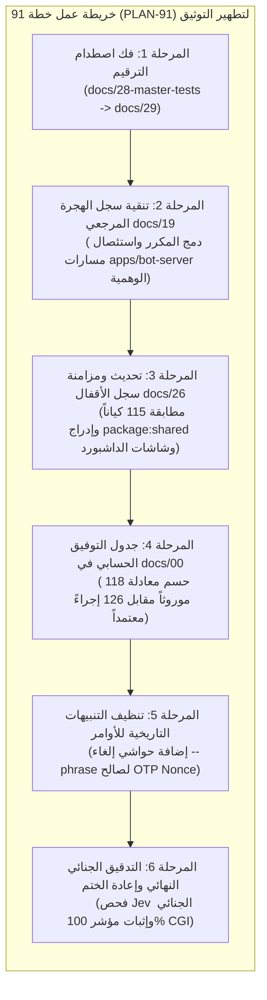

# خطة عمل رقم 91: التوفيق الدستوري الشامل وفك اصطدامات الترقيم وتطهير سجلات الهجرة والأقفال للواقع الفيزيائي 100%
## Work Plan 91: Master Documentation Audit, Collision Resolution, and Physical Reality Harmonization

> **الحالة:** 🎯 مسودة العمل السيادية المعتمدة للتنفيذ الفوري  
> **المرجع الدستوري:** `GEMINI.md` (البند 1.2، 2، و 5)، `docs/27` (البوابات G3, G13, G19)، وتدقيق `/jev` الجنائي الصادر في 22 سبتمبر 2026.  
> **الفرع المخصص:** `plan/wp-91-docs-harmonization`  
> **الهدف الاستراتيجي:** القضاء التام على كافة الديون الوثائقية والتعارضات المرصودة بجهاز التدقيق الجنائي `/jev`، ورفع **مؤشر صحة التوثيق من 68.5% إلى 100%**، وفك اصطدام الترقيم بين ملفي `docs/28`، وتطهير سجل الهجرة المرجعي `docs/19` من المسارات الوهمية والتسجيل المزدوج، وتحديث سجل الأقفال `docs/26` ليتطابق بالكامل مع الواقع الفيزيائي لملف `governance.lock.json` (115 كياناً مقفلاً وإدراج `package:shared`)، وتوثيق جدول التوفيق المحاسبي بين 118 موروثاً و 126 إجراء معتمداً.

---

### 1️⃣ الركائز الهندسية وخريطة الطريق للمراحل الست (Architectural Pillars & Roadmap)



---

### 2️⃣ مراحل التنفيذ التفصيلية (Step-by-Step Implementation Phases)

#### المرحلة 1: فك اصطدام الترقيم (Collision Resolution: docs/28 -> docs/29)
1. **الدافع الفني:** يوجد ملفان في جذر `docs/` يحملان نفس الرقم `28` (أحدهما منبثق عن خطة 84 والآخر عن خطة 87).
2. **الإجراء:**
   - إعادة تسمية الملف:
     `docs/28-master-tests-physical-reality-and-compliance-ledger.md`  
     ⬅️ يصبح ⬅️  
     `docs/29-master-tests-physical-reality-and-compliance-ledger.md`
   - الاحتفاظ بملف:
     `docs/28-enterprise-safe-upgrade-and-living-release-standard.md` كرقم 28 الحصري.
   - تحديث الفهرس العام في [`README.md`](file:///f:/Alsaada-Smart-Bot/README.md) ليعكس التسلسل المتتابع (28 ثم 29).
   - تحديث المراجع في `docs/work-plans/87-*.md`.
3. **Commit دلالي:**  
   `refactor(docs): phase 1 - resolve docs/28 collision by renumbering test compliance ledger to docs/29`

---

#### المرحلة 2: تنقية سجل الهجرة المرجعي (`docs/19`) واستئصال المسارات الوهمية
1. **الدافع الفني:** سجل `docs/19` يحوي تدفقات مكررة (01.6 و 01.9 مسجلان مرتين)، ويوثق 98 تدفقاً متبقياً تحت مسارات وهمية غير موجودة `apps/bot-server/src/flows/...` تخالف معيار الشريحة الرأسية المعمارية (G2).
2. **الإجراء:**
   - **دمج التدفقات المكررة:**
     * دمج `NEW-38` مع `01.6` (`modules/workforce/src/flows/01.6-worker-self-edit`) تحت سجل موحد معتمد.
     * دمج `NEW-82` مع `01.9` (`modules/workforce/src/flows/01.9-worker-commitment-index`) تحت سجل موحد معتمد.
     * توحيد تدفقات الإعدادات (00.1 إلى 00.12) بحيث لا تتكرر في قسم الموروث والمستحدث.
   - **تصحيح المسارات المعمارية للتدفقات المنتظرة:**
     * استبدال كافة مسارات `apps/bot-server/src/flows/<domain>/...` بالمسار المعماري الدستوري الصحيح:  
       `modules/<module-name>/src/flows/<code-slug>/`
     * (مثال: السلف تنقل إلى `modules/finance/src/flows/02.1-direct-advance/`، والعهد إلى `modules/custody/src/flows/04.1-new-custody/`، والإجازات إلى `modules/workforce/src/flows/03.1-record-leave/`).
   - **تحديث إحصائيات المقدمة:**
     * تعديل عدد الشرائح المكتملة في `workforce` من 7 إلى **8 شرائح رأسية كاملة** (بإضافة 01.9 المكتمل والمقفل).
3. **Commit دلالي:**  
   `refactor(docs): phase 2 - clean docs/19 duplicates and rectify prospective flow paths to modular vertical slices`

---

#### المرحلة 3: تحديث ومزامنة سجل الأقفال (`docs/26`) مع الواقع الفيزيائي
1. **الدافع الفني:** يوثق `docs/26` وجود 58 كياناً مقفلاً و 7 حزم نواة و 29 شاشة داشبورد، بينما الواقع الفعلي المشفر في `governance.lock.json` يحمي **115 كياناً و 8 حزم نواة و 33 شاشة داشبورد**.
2. **الإجراء:**
   - تحديث إحصائية المقدمة في `docs/26` لتعلن رسمياً حماية **115 كياناً مستقلاً**.
   - إضافة حزمة النواة المركزية [`packages/shared`](file:///f:/Alsaada-Smart-Bot/packages/shared) إلى جدول الحزم المقفلة تشفيرياً (المسار: `packages/shared`، النوع: `package:shared`).
   - إضافة شاشات الداشبورد الأربع الناقصة إلى جدول شاشات لوحة التحكم:
     * `dashboard:settings/bot-features` (`apps/admin-dashboard/src/app/admin/settings/bot-features`)
     * `dashboard:settings/matrix` (`apps/admin-dashboard/src/app/admin/settings/matrix`)
     * `dashboard:settings/telegram-groups` (`apps/admin-dashboard/src/app/admin/settings/telegram-groups`)
     * `dashboard:extensions` (`apps/admin-dashboard/src/app/admin/extensions/[module]/[[...path]]`)
   - إضافة قسم مستقل لملفات الاختبارات المقفلة تشفيرياً (`test:*` — 55 ملف اختبار محمي ضد التحايل).
3. **Commit دلالي:**  
   `feat(governance): phase 3 - synchronize docs/26 with physical reality of governance.lock.json (115 entities)`

---

#### المرحلة 4: جدول التوفيق الحسابي في الدستور (`docs/00` و `GEMINI.md`)
1. **الدافع الفني:** تضارب ظاهري بين رقم 118 (حصر الشاشات القديمة) ورقم 126 (إجراءات الدستور الأساسية).
2. **الإجراء:**
   - إضافة ملحق رسمي في [`docs/00-baseline-and-ssot-charter.md`](file:///f:/Alsaada-Smart-Bot/docs/00-baseline-and-ssot-charter.md) بعنوان:
     `### 🏛️ الملحق التوفيقي لحصر التدفقات (118 شاشة أصلية مقابل 126 إجراءً معتمداً)`.
   - توضيح المعادلة الرياضية:
     $$\text{إجمالي إجراءات النظام (126)} = 118 \text{ شاشة موروثة من جداول F:\HR} + 8 \text{ إجراءات فرعية تم تفكيكها لضمان الأمان والتدقيق في flow-crosswalk.json}$$
   - ربط الملحق بـ `GEMINI.md` البند 1.2 لإزالة أي لبس لدى الوكلاء المطورين.
3. **Commit دلالي:**  
   `docs(governance): phase 4 - add mathematical reconciliation appendix between 118 legacy and 126 sovereign flows in docs/00`

---

#### المرحلة 5: تنظيف التنبيهات التاريخية للأوامر الملغاة (`--phrase`)
1. **الدافع الفني:** وجود أمثلة قديمة في وثائق `docs/work-plans/39` و `docs/work-plans/70` وبعض تقارير الأدلة تستخدم صيغة `--phrase="موافق على الفتح"` الملغاة بموجب خطة 90.
2. **الإجراء:**
   - إضافة تنبيه دستوري بارز (`> [!WARNING]`) في ترويسة خطط العمل 39 و 70:
     *"تنبيه دستوري: تم إلغاء خيار `--phrase` نهائياً بموجب خطة العمل 90؛ فك الأقفال يتم حصراً ببروتوكول الـ OTP والتأكيد بالشات `pnpm unlock:request` متبوعاً بـ `pnpm unlock:confirm`."*
3. **Commit دلالي:**  
   `docs(governance): phase 5 - add deprecation notices on legacy --phrase flags across historical work plans`

---

#### المرحلة 6: التدقيق الجنائي النهائي وإعادة الختم التشفيري (Forensic Verification)
1. **الدافع الفني:** إثبات التعافي الكامل للمنظومة ووصول مؤشر صحة التوثيق إلى 100%.
2. **الإجراء:**
   - تشغيل أدوات التحقق الآلية:
     ```bash
     pnpm migration:verify
     pnpm flow-contracts:verify
     pnpm arch:verify
     ```
   - تشغيل محرك التدقيق الجنائي لـ JEV:
     ```bash
     pnpm exec tsx tools/governance/jev-auditor.ts
     ```
   - التأكد من احتساب مؤشر CGI بنسبة **100% للتوثيق** مع إصدار حكم **`[CERTIFIED PASS]`**.
   - تحديث بصمات SHA-256 المشفرة في `governance.lock.json` لكافة وثائق الحوكمة المعدلة.
3. **Commit دلالي:**  
   `chore(governance): phase 6 - re-seal governance.lock.json and certify 100% documentation health via JEV`

---

### 3️⃣ مصفوفة معايير القبول والفحص النهائي (Acceptance Checklist)

| البند الرقابي | الأداة / المعيار | النتيجة المطلوبة | الحالة |
| :--- | :--- | :--- | :---: |
| **اصطدام docs/28** | `Get-ChildItem docs/28*` | ملف واحد فقط يحمل الرقم 28 والآخر 29 | [ ] |
| **فهرس README.md** | فحص الروابط | 28 يشير لدستور التحديثات و 29 يشير لسجل الاختبارات | [ ] |
| **سجل docs/19** | `pnpm migration:verify` | صفر تكرار لـ 01.6 و 01.9 ومسارات موديولية موحدة | [ ] |
| **سجل docs/26** | مطابقة `governance.lock.json` | 115 كياناً + package:shared + 33 شاشة داشبورد | [ ] |
| **ملحق docs/00** | التحقق الدستوري | حسم معادلة الـ 118 والـ 126 بجداول واضحة | [ ] |
| **مؤشر جِف الجنائي** | `tools/governance/jev-auditor.ts` | **CGI = 100%** مع حكم **`[CERTIFIED PASS]`** | [ ] |

---

### 4️⃣ الصيغة الدستورية المطلوبة لبدء التنفيذ الفوري:

بما أن هذه الخطة تستهدف تعديل ملفات حوكمة ودساتير محمية تشفيرياً (`docs/26`, `docs/00`, `README.md`, `governance.lock.json`)، يلزم إصدار أمرك بالصيغة الدستورية المعتمدة:

> **«موافق على التعديل او الايقاف او الحذف»**
