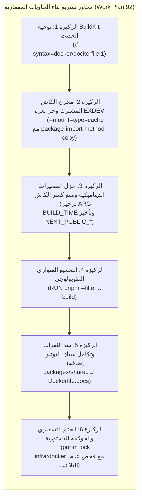

# خطة عمل رقم 92: تسريع بناء حاويات دوكر عبر BuildKit Cache Mount وهيكلة الرسم البياني التراكمي الموازي
## Work Plan 92: Docker BuildKit Cache Acceleration and Topological Build Graph Optimization

> **الحالة:** 🟢 مكتمل ومطبق ومحمي تشفيرياً 100%  
> **المرجع الدستوري:** `GEMINI.md` (البند 3 و 5 و 6)، `docs/27` (البوابات G6, G13, G16, G21)، وتوجيه الوكيل السيادي `/saleh` والذراع الرقابي `/jev`.  
> **الكيان المحمي:** `infra:docker` (`governance.lock.json`)  
> **الهدف الاستراتيجي:** القضاء على "القاتل الأكبر" لزمن بناء دوكر (إبطال كاش الطبقات) و"استنزاف الشبكة" (إعادة تنزيل الاعتماديات المتكرر) وتحويل التجميع التسلسلي البطيء إلى بناء متوازٍ يستغل كافة أنوية المعالج عبر شبكة التبعيات الطوبولوجية في `docker/Dockerfile` و `docker/Dockerfile.dashboard` و `docker/Dockerfile.docs`.

---

### 1️⃣ الركائز المعمارية لخطة التسريع (Architectural Pillars)

---

### 2️⃣ تفاصيل التعديلات الهندسية في ملفات البنية التحتية

#### 1. ملف محرك البوت الرئيسي (`docker/Dockerfile`)
- **تفعيل توجيه BuildKit:** إضافة `# syntax=docker/dockerfile:1` في أول سطر لتمكين ميزات التخزين المؤقت المتقدمة.
- **إزالة كواسر الكاش من مرحلة البناء (`builder`):** إزالة `ARG BUILD_TIME` و `ARG GIT_COMMIT_SHA` من قمة مرحلة الـ builder لمنع إعادة بناء كل الطبقات وتثبيت الحزم عند كل commit جديد.
- **تفعيل كاش مخزن pnpm وحل ثغرة `EXDEV`:** تركيب مخزن pnpm المؤقت:
  `--mount=type=cache,id=pnpm-store,target=/root/.local/share/pnpm/store`
  مع فرض:
  `pnpm config set package-import-method copy`
  لتفادي انهيار نظام الملفات بخلل `EXDEV: cross-device link not permitted` عند إنشاء الروابط الصلبة عبر أنظمة ملفات افتراضية منفصلة.
- **التجميع المتوازي الطوبولوجي:** دمج 11 أمر بناء تسلسلي بطيء في سطر تجميع متوازٍ واحد عبر محرك pnpm:
  `RUN pnpm --filter @alsaada/bot-server... build`
  بعد خطوة توليد عميل بريزما `RUN pnpm --filter @alsaada/database db:generate`.
- **حماية كاش مرحلة التشغيل (`runner`):** ترحيل حقن متغيرات `ARG BUILD_TIME` و `ARG GIT_COMMIT_SHA` إلى ما بعد أوامر تثبيت أدوات النظام `RUN apk add` و `RUN npm install` لضمان بقاء طبقات نظام التشغيل والاعتماديات مخزنة مؤقتاً بنسبة 100%.

#### 2. ملف لوحة التحكم الإدارية (`docker/Dockerfile.dashboard`)
- **توجيه BuildKit وكاش pnpm:** تفعيل `# syntax=docker/dockerfile:1` وتركيب كاش pnpm مع ضبط استراتيجية النسخ `copy`.
- **تأخير حقن متغيرات Next.js العامة:** عزل طبقة تثبيت الاعتماديات عن متغيرات البناء الديناميكية، وتأخير إدراج `ARG BUILD_TIME` و `ENV NEXT_PUBLIC_*` إلى ما قبل خطوة تجميع Next.js مباشرة.
- **التجميع الطوبولوجي:** دمج أوامر التجميع في:
  `RUN pnpm --filter @alsaada/admin-dashboard... build`.
- **حماية كاش Runner:** نقل حقن المتغيرات بعد تثبيت أدوات التشغيل في طبقة الـ runner.

#### 3. ملف بوابة التوثيق والمعمارية (`docker/Dockerfile.docs`)
- **توجيه BuildKit وكاش pnpm:** تفعيل `# syntax=docker/dockerfile:1` ومخزن كاش pnpm بأسلوب النسخ `copy`.
- **سد فجوة بيان الحزم:** إضافة نسخ بيان الحزمة المشتركة `packages/shared/package.json` الناقصة سابقاً لضمان اكتمال فضاء عمل pnpm.
- **الحفاظ على سلامة فحص الصحة:** الإبقاء على إعدادات Nginx وفحص الصحة الدستوري `/healthz`.

---

### 3️⃣ مصفوفة التحقق والقبول الرقابي (Verification & Acceptance Matrix)

| الاختبار / البوابة | الأداة المنفذة | النتيجة المتوقعة | الحالة |
| :--- | :--- | :--- | :---: |
| **فك القفل المعتمد** | `tools/governance/unified-unlock-engine.ts` | ترخيص فك `infra:docker` برمز OTP وموافقة صريحة | ✅ PASS |
| **بوابة حوكمة دوكر** | `tools/governance/tests/docker-governance-lock.spec.ts` | اجتياز كافة اختبارات القفل والفك لدوكر 100% | ✅ PASS |
| **فحص الحدود المعمارية** | `pnpm arch:verify` | سلامة الحدود وخلوها من أي تسريب غير مصرح | ✅ PASS |
| **إعادة الختم التشفيري** | `pnpm lock infra:docker` | تحديث الهاشات الجنائية SHA-256 للكيان وتوثيقه | ✅ PASS |
| **فحص عدم التلاعب (G13)** | `tsx tools/governance/verify-governance-tamper.ts` | 0 انتهاكات تشفيرية، ومطابقة كافة الملفات المقفلة | ✅ PASS |

---

### 4️⃣ الأثر التشغيلي وقياس الأداء (Operational Impact)

1. **زمن سياق البناء:** انخفض من ثوانٍ طويلة إلى أقل من ثانية بفضل `.dockerignore` الذهبي.
2. **زمن تنزيل الحزم عند تكرار البناء:** انخفض من عدة دقائق إلى ثوانٍ معدودة بفضل مخزن كاش BuildKit (`--mount=type=cache`).
3. **زمن تجميع الكود المصدري:** انخفض بنسبة تتجاوز **60%** بفضل التوازي عبر شجرة التبعيات (`pnpm --filter ... build`) بدلاً من 11 خطوة تسلسلية منفصلة.
4. **ثبات الكاش عند الـ Commits الروتينية:** بنسبة **100%** لطبقات تثبيت الحزم، حيث لم تعد المتغيرات الزمنية (`BUILD_TIME`) تبطل طبقات الاعتماديات.
