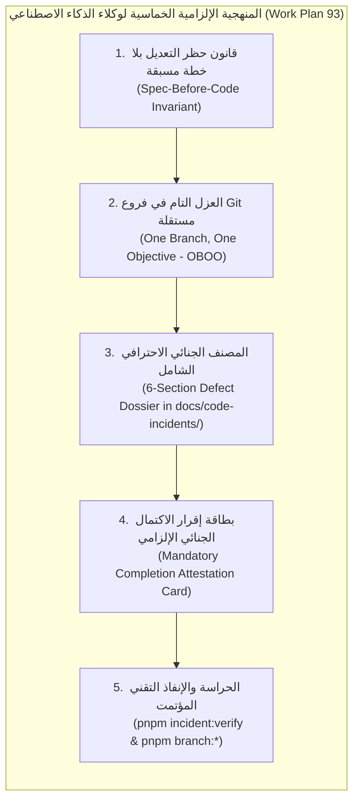

# خطة عمل رقم 93: ميثاق حظر التعديل بلا خطة مسبقة والإلزام الجنائي لتوثيق الأعطال وعزل الفروع وبطاقة الإقرار الخاتمة
## Work Plan 93: Spec-First, Defect Dossier & Git Branch Isolation Governance

> **الحالة:** 🟢 مكتملة ومنفذة بنسبة 100% ومفحوصة جنائياً  
> **المرجع الدستوري:** `GEMINI.md` (البنود 4 و 7)، `docs/27` (البوابات G10, G14, G15)، والأوامر التنفيذية السيادية للمستخدم  
> **الفرع المخصص:** فروع منفصلة بموجب معيار العزل التام (`fix/inc-...`, `feat/...`, `plan/...`)  
> **الأدوات المنفذة:** `tools/scaffold/scaffold-branch.ts`, `tools/governance/verify-incidents.ts`, `tools/governance/tests/verify-incidents.spec.ts`

---

## 📌 1️⃣ الملخص التنفيذي وسياق المشكلة (Executive Summary & Context)

تعاني بيئات العمل المعتمدة على وكلاء الذكاء الاصطناعي من ظاهرتين سلبيتين تهددان استقرار المنظومات المؤسسية:
1. **منعكس الترقيع العشوائي (AI Vibe-Fixing Reflex):** القفز المباشر إلى ملفات الكود المصدري في `src/` بمجرد تعثر اختبار أو حدوث خلل، دون تخطيط مسبق، ودون تحليل جذري، ودون توثيق تاريخي مهني للأسباب والحلول.
2. **تلوث الفروع وتداخل المهام (Branch Contamination & Scope Creep):** العمل على فرع ميزة واحدة والقيام بإصلاح أعطال غير ذات صلة داخله، أو العكس، مما يشوه تاريخ الـ Git ويمنع المراجعة الدقيقة والدمج الآمن والتراجع الانتقائي.

تؤسس هذه الخطة **المنهجية الإلزامية الدستورية خماسية الأركان** لحظر أي تعديل دون خطة، وإلزام العزل التام في فروع Git مستقلة، وحراسة توثيق المشاكل في `docs/code-incidents/` بأداة فحص آلية صارمة ترفض القوالب الشكلية بنسبة صفر تسامح.

---

## 🏛️ 2️⃣ الأركان الخمسة للمنهجية السيادية (The 5 Sovereign Pillars)

### الركن الأول: قانون "لا كود ولا تعديل بلا خطة مسبقة" (Spec-Before-Code Invariant)
- يُحظر حظراً باتاً على أي وكيل ذكاء اصطناعي لمس أو تعديل أي ملف كود مصدري داخل `modules/` أو `packages/` أو `apps/` إلا بعد صياغة واعتماد وثيقة خطة العمل أو تقرير الخلل الجنائي وتلقي الموافقة الصريحة.

### الركن الثاني: العزل الإلزامي التام في فروع Git منفصلة (One Branch, One Objective - OBOO)
- كل إصلاح لخلل برمجي يجب أن يتم داخل فرع منعزل مخصص ينبثق مباشرة من `main` النظيف:
  `fix/inc-<date>-<slug>`
- كل ميزة جديدة أو تحسين يجب أن يتم داخل فرع مخصص:
  `feat/<slug>` أو `plan/<wp-number>-<slug>`
- يُمنع منعاً باتاً خلط المهام أو ترقيع الأخطاء داخل فروع الميزات.

### الركن الثالث: المصنف الجنائي الشامل في `docs/code-incidents/`
- توثيق الخلل وفق الأقسام الستة الإلزامية:
  1. **بطاقة وسياق الخلل (Incident Metadata & Scope):** الـ YAML Frontmatter الكامل (معرف الخلل، الفرع، المكون، الخطورة، التصنيف، ملف الاختبار، اختبار الانحدار).
  2. **التوصيف والأعراض ومخرجات الفشل (Symptoms & Error Signatures):** رسائل الخطأ الفعلية مقابل المتوقعة ومخرجات الطرفية الحقيقية.
  3. **التحليل الجذري للسبب (Root Cause Analysis - RCA & 5 Whys):** الأسئلة الخمسة والمطابقة مع نظام `F:\HR`.
  4. **تفاصيل الحل المعماري المنفذ (Resolution):** الفوارق البرمجية سطر بسطر وصيغة ترخيص الكود.
  5. **التحقق الميداني واختبار الانحدار الدائم (Regression Proof):** تشغيل الاختبار وربطه بملف دائم على القرص.
  6. **التوصيات الوقائية لتفادي التكرار (Preventive Recommendations).**

### الركن الرابع: بطاقة إقرار الاكتمال الجنائي الإلزامي (Mandatory Completion Attestation)
- عند الانتهاء من العمل، يُلزم الوكيل بكتابة بطاقة التأكيد الرسمية غير القابلة للتحوير:
  > **«✅ تم توثيق وحل الخلل بالكامل في مجلد المشاكل [INC-YYYYMMDD-SLUG] داخل الفرع المنعزل واجتياز الفحص الجنائي»**

### الركن الخامس: الحراسة والإنفاذ التقني الآلي (Automated Gate Enforcement)
- توفير أدوات تحقق وحراسة آلية لمنع التقارير الشكلية والتأكد من وجود الملفات واختبارات الانحدار على القرص بدون أي وسوم وهمية (`[...]`, `TODO`, `TBD`).

---

## 🔐 3️⃣ الصيغ الدستورية غير المترجمة المعتمدة (Verbatim Approval Formulas)

| الغرض الإجرائي | الصيغة الدستورية الملزمة | السلطة المخولة |
| :--- | :--- | :--- |
| **اعتماد خطة الإصلاح وتعديل الكود المصدري** | «موافق على خطة الإصلاح» أو «موافق على تعديل الكود المصدري» | المستخدم السيادي (Saleh) |
| **إقرار الاكتمال الرسمي من الوكيل** | «✅ تم توثيق وحل الخلل بالكامل في مجلد المشاكل [INC-YYYYMMDD-SLUG] داخل الفرع المنعزل واجتياز الفحص الجنائي» | الوكيل المنفذ |
| **دمج الفرع المنعزل إلى main** | «ادمج الفرع» | المستخدم السيادي (Saleh) |

---

## 🛠️ 4️⃣ ترسانة الأدوات والأوامر البرمجية المضافة (Tooling Suite)

| الأمر البرمجي | الملف التنفيذي | الوصف الهندسي |
| :--- | :--- | :--- |
| `pnpm branch:incident <slug> [title]` | `tools/scaffold/scaffold-branch.ts` | فحص نظافة الشجرة، إنشاء فرع `fix/inc-...` وتوليد تقرير الخلل فوراً |
| `pnpm branch:feature <slug>` | `tools/scaffold/scaffold-branch.ts` | إنشاء فرع منعزل للميزات `feat/...` من `main` النظيف |
| `pnpm branch:plan <slug>` | `tools/scaffold/scaffold-branch.ts` | إنشاء فرع منعزل لخطط العمل `plan/...` من `main` النظيف |
| `pnpm incident:verify` | `tools/governance/verify-incidents.ts` | فحص الـ Frontmatter، الأقسام الستة، وجود الملفات، وحظر الـ Placeholders |
| `pnpm test:incidents` | `tools/governance/tests/verify-incidents.spec.ts` | 16 اختباراً شاملاً لسلامة محرك فحص ملفات الأعطال البرمجية |
| `pnpm audit:saleh` | `tools/governance/saleh-audit-suite.ts` | جناح تدقيق صالح متضمناً الفحص التلقائي لملفات الحوادث (WP 93) |

---

## 🚫 5️⃣ معيار مكافحة التقارير الشكلية (Zero-Placeholder Policy)

تسقط أداة `pnpm incident:verify` وتُصدر حكماً بـ `FAIL` الفوري في الحالات الآتية:
1. وجود أي علامة `[...]` أو `[ ... ]` متروكة من القالب.
2. وجود علامات `TODO`، `TBD`، `FIXME`، `XXX`.
3. بقاء نصوص توجيهية من القالب مثل `[اشرح بدقة...]` أو `[الإجابة 1]` أو `[عنوان المشكلة...]`.
4. بقاء قيم افتراضية مثل `INC-YYYYMMDD-01` أو `path/to/source.ts` أو `functionName()`.
5. عدم وجود ملف الاختبار المتأثر (`affected_test`) أو اختبار الانحدار (`regression_test`) أو الروابط المرجعية فيزيائياً على القرص الصلب.
6. غياب أي قسم من الأقسام الستة الإلزامية أو غياب صيغة ترخيص الكود المعتمدة في القسم الرابع.

---

## 📊 6️⃣ سجل التحقق والامتثال الميداني (Verification Record)

- `pnpm test:incidents`: 16/16 اختبار ناجح بنسبة 100%.
- `pnpm incident:verify`: اجتياز كامل لكافة ملفات الحوادث الحالية (4 ملفات حوادث معتمدة ومقفولة بالفرع المنعزل).
- `pnpm test:saleh`: 10/10 اختبارات ناجحة متضمنة التكامل الرقابي.
