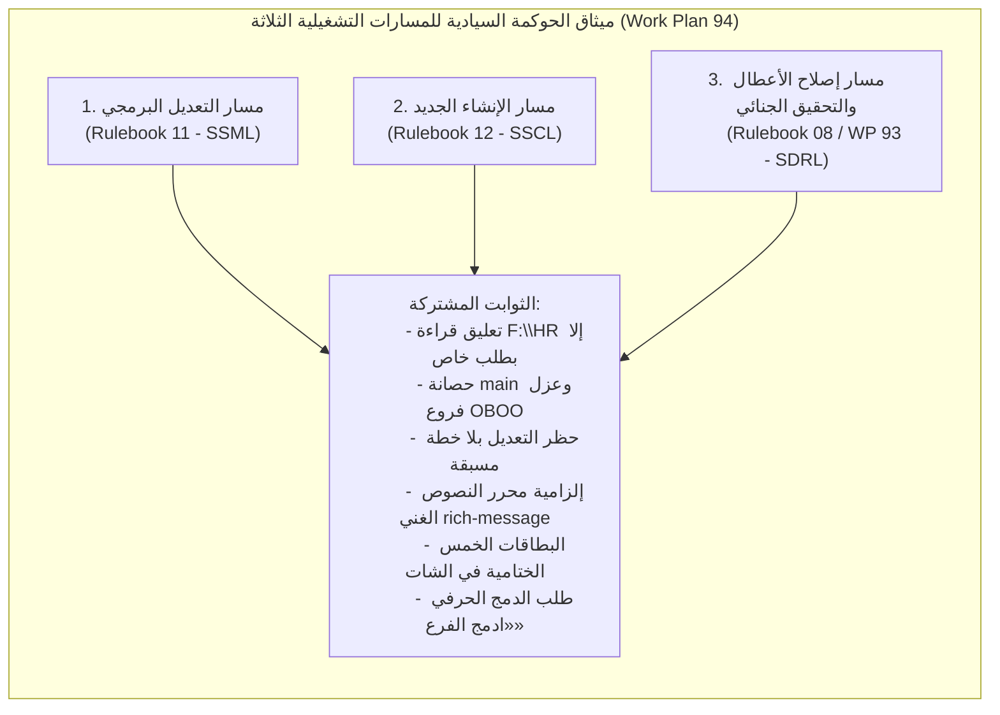

# خطة عمل رقم 94: ميثاق الحوكمة السيادية للمسارات التشغيلية الثلاثة وإلزامية وكلاء الذكاء الاصطناعي (التعديل — الإنشاء — إصلاح الأعطال)
## Work Plan 94: Sovereign Tri-Lifecycle Governance & AI Agent Operating Invariant (Modification, Creation, Defect Repair)

> **الحالة:** 🟢 مكتملة ومنفذة بنسبة 100% ومثبتة دستورياً  
> **المرجع الدستوري:** `GEMINI.md` (البنود 1, 2, 4, 7, 7.1), `AGENTS.md`, كتيبات القواعد (01, 08, 11, 12), وبوابات الجودة (G1–G23)  
> **السلطة الرقابية:** `/saleh` (Sovereign Strategic Advisor & Chief Forensic Reality Auditor)  
> **تثبيت الأمر الرئاسي:** يُعلّق فحص وقراءة الأصل القديم (`F:\HR`) ولا يتم الرجوع إليه نهائياً إلا إذا صدر طلب خاص وصريح من المستخدم.  
> **نطاق التطبيق:** إلزامية قطعية ومطلقة على كافة وكلاء الذكاء الاصطناعي (Gemini, Claude, Cursor, Copilot, Subagents) والأدوات البرمجية.

---

## 📌 1️⃣ الملخص التنفيذي وسياق الحوكمة (Executive Summary & Context)

تعاني بيئات التطوير المعتمدة على وكلاء الذكاء الاصطناعي من فجوة تشغيلية كبرى تتمثل في **"عشوائية المسارات والتدخل التلقائي غير المنضبط"**، والتي تتجلى في:
1. الشروع في تعديل الكود المصدري دون خطة مسبقة معتمدة (No Vibe Coding).
2. الالتفاف على منظومة الأقفال التشفيرية المشفرة بتجزئة SHA-256 (`governance.lock.json`).
3. خلط المهام البرمجية وإصلاح الأعطال داخل فروع الميزات أو على فرع `main` مباشرة.
4. إغفال بطاقات التوثيق وإعلانات القفل التلقائي في الشات أمام المستخدم.

تؤسس **خطة العمل السيادية رقم 94** للإلزام القطعي بالمسارات التشغيلية الثلاثة (The Tri-Lifecycle Sovereignty)، وتدمجها كحجر زاوية دستوري غير قابل للتجاوز، لتتحول منهجية العمل إلى نظام آلي محكم بمحطات توقف إجبارية وبطاقات ختامية إلزامية.

---

## 🏛️ 2️⃣ الركائز الثلاث للسيادة التشغيلية (The 3 Sovereign Lifecycles)



---

### الركيزة الأولى: مسار التعديل البرمجي (Sovereign Standard for Modification - Rulebook 11)
يطبق على أي تعديل لملف أو وظيفة أو مديول قائم وفق 6 مراحل متسلسلة:
1. **المرحلة 0 (المواصفة والخطة):** قراءة الملفات الساكنة وصياغة `implementation_plan.md` -> **🛑 محطة التوقف 1:** انتظار موافقة صالح الصريحة.
2. **المرحلة 1 (العزل وفك الأقفال):** إنشاء فرع `feat/<slug>` -> طلب الفك `pnpm unlock:request` -> **🛑 محطة التوقف 2:** انتظار الرمز المؤقت بالشات (`«موافق على الفتح UNLOCK-XXXXXX»`) -> تأكيد الفك الجنائي `pnpm unlock:confirm`.
3. **المرحلة 2 (التنفيذ):** دورة TDD Red أولاً -> تعديل الكود المصدري حصراً -> الالتزام بـ `@alsaada/core-components/rich-message` وميزانية تيليجرام (36/16/7/3) وحظر console.log.
4. **المرحلة 3 (التحقق الفيزيائي):** `pnpm preflight:fix`, `pnpm typecheck`, `pnpm test`, والمحاكاة الكاملة `pnpm ci:simulate` (23 بوابة).
5. **المرحلة 4 (إعادة القفل والتوثيق):** إعادة القفل التلقائي الإلزامي `pnpm lock <target>` وتوثيق `walkthrough.md`.
6. **المرحلة 5 (التقرير والدمج):** تسليم **البطاقات الخمس الإلزامية في الشات** -> **🛑 محطة التوقف 3:** انتظار الأمر الدستوري الحرفي: **«ادمج الفرع»** -> دمج آمن `git merge --no-ff`.

---

### الركيزة الثانية: مسار الإنشاء الجديد (Sovereign Standard for Creation - Rulebook 12)
يطبق عند إنشاء تدفق بوت جديد، مديول نطاق، أو حزمة داخلية:
1. **المرحلة 0 (المواصفة السداسية):** صياغة الملخص التنفيذي السداسي الأركان في `implementation_plan.md` -> **🛑 محطة التوقف 1:** اعتماد الخطة صراحة من صالح.
2. **المرحلة 1 (العزل والتوليد الآلي):** إنشاء فرع `feat/<slug>` -> حظر التوليد اليدوي؛ إلزامية تشغيل المولد المعياري:
   ```bash
   pnpm make:flow <module> <flow-code> <flow-slug>
   ```
   لتوليد الشريحة الرأسية ذات الـ 10 ملفات قياسياً.
3. **المرحلة 2 (التنفيذ المنضبط):** كتابة اختبار الفشل أولاً (TDD Red) -> استكمال طبقات الشريحة العشر بمخططات التحقق Zod -> حظر الرسائل المجردة واعتماد `rich-message`.
4. **المرحلة 3 (الفحص الفيزيائي):** تشغيل `preflight:fix`, `typecheck`, `test`, `arch:verify`, `telegram-contracts:verify`, و `ci:simulate`.
5. **المرحلة 4 (التشفير الأولي والتوثيق):** القفل التشفيري الأولي (First-Time Sealing) للكيان في `governance.lock.json` عبر `pnpm lock <target>` -> توثيق سجل الترحيل والميزات الحديثة [`docs/19`](file:///f:/Alsaada-Smart-Bot/docs/19-legacy-to-enterprise-master-feature-migration-registry.md) بعلامة `🟢 مكتمل وموثق 100%` -> إعداد `walkthrough.md` بمخطط الحالة `stateDiagram-v2`.
6. **المرحلة 5 (التقرير والدمج):** تسليم البطاقات الخمس الختامية -> **🛑 محطة التوقف 2:** انتظار أمر **«ادمج الفرع»** -> دمج `git merge --no-ff`.

---

### الركيزة الثالثة: مسار إصلاح الأعطال والتحقيق الجنائي (Sovereign Defect Repair - Rulebook 08 / WP 93)
يطبق عند ظهور أي خطأ أو تعثر في الاختبارات:
1. **المرحلة 0 (التجميد وصياغة الملف الجنائي):** حظر التعديل الفوري (Immediate Freeze) -> فتح فرع الحادثة `pnpm branch:incident <slug>` -> تحرير الأقسام (1 و 2 و 3) في `docs/code-incidents/INC-*.md` (توصيف العطل، مخرجات الطرفية الفعلية `Actual vs Expected`، والتحليل الجذري 5 Whys) -> **🛑 محطة التوقف 1:** انتظار صدور الأمر الحرفي:
   > **«موافق على خطة الإصلاح»** أو **«موافق على تعديل الكود المصدري»**
2. **المرحلة 1 (فك الأقفال إن وجدت):** طلب الفك برمز OTP ديناميكي -> **🛑 محطة التوقف 2:** إرسال الرمز في الشات -> تأكيد الفك.
3. **المرحلة 2 (اختبار التراجع والإصلاح):** كتابة اختبار تراجع دائم (Permanent Regression Test) يفشل أولاً (Red) -> إصلاح الكود المصدري جراحياً بأقل أثر (Zero Blast Radius) وتحول الاختبار للأخضر.
4. **المرحلة 3 (الفحص الجنائي المزدوج):** اجتياز فاحص الحوادث الآلي بصفر نواقص:
   ```bash
   pnpm incident:verify && pnpm test:incidents
   ```
   واجتياز محاكاة خط الإنتاج الكامل `pnpm ci:simulate`.
5. **المرحلة 4 (إعادة القفل وتوثيق ما تم لحله):** إعادة القفل `pnpm lock <target>` -> استكمال الأقسام (4 و 5 و 6) في الملف الجنائي متضمناً كود الفارق الفعلي المنفذ (Diff) وسجل مخرجات الطرفية بنتيجة `Exit Code: 0`.
6. **المرحلة 5 (التقرير الختامي وبطاقة الإقرار):** تسليم البطاقات الخمس + **بطاقة الإقرار الجنائي الإلزامية الحرفية**:
   > **«✅ تم توثيق وحل الخلل بالكامل في مجلد المشاكل [INC-YYYYMMDD-SLUG] داخل الفرع المنعزل واجتياز الفحص الجنائي»**
   -> **🛑 محطة التوقف 3:** انتظار أمر **«ادمج الفرع»** -> دمج `git merge --no-ff`.

---

## ⚡ 3️⃣ المصفوفة الدستورية لمحطات التوقف والصيغ الحرفية

| نوع المحطة الإجرائية | الإجراء البرمجي | الصيغة الدستورية الملزمة (حرفياً دون ترجمة) | جهة الإصدار |
| :--- | :--- | :--- | :--- |
| **اعتماد خطة التعديل / الإنشاء** | فحص المواصفة والخطة | موافقة صريحة من صالح على الخطة | صالح |
| **اعتماد خطة إصلاح العطل** | فحص تقرير الحادثة الجنائي | `«موافق على خطة الإصلاح»` أو `«موافق على تعديل الكود المصدري»` | صالح |
| **تصريح فك القفل المشفر** | توليد رمز OTP ديناميكي (300s) | `«موافق على الفتح <UNLOCK-XXXXXX>»` أو `«نعم موافق على التعديل <UNLOCK-XXXXXX>»` | صالح |
| **إقرار القفل وإعادة التشفير** | تشفير الكيان في lock.json | `«تم قفل الوظيفة [س]»` | الوكيل |
| **إقرار اكتمال الإصلاح الجنائي** | اجتياز incident:verify | `«✅ تم توثيق وحل الخلل بالكامل في مجلد المشاكل [INC-YYYYMMDD-SLUG] داخل الفرع المنعزل واجتياز الفحص الجنائي»` | الوكيل |
| **إذن دمج الفرع المنعزل في main** | اجتياز بوابات الجودة كاملة | `«ادمج الفرع»` | صالح |

---

## 🛡️ 4️⃣ الإجراءات الوقائية والإنفاذ التقني الآلي (Automated Gate Enforcement)

لضمان عدم تحول هذه الخطة إلى حبر على ورق، يتم الإنفاذ التقني عبر الحواجز الآلية التالية:
1. **بوابة مطابقة التوثيق (`pnpm docs:parity`):** فحص الترابط الدستوري المتبادل بين كافة الوثائق وكتيبات القواعد (01، 08، 11، 12) والتحقق من عدم وجود روابط ميتة.
2. **بوابة الحوادث الجنائية (`pnpm incident:verify`):** فحص تقارير الحوادث بنسبة خلو نواقص 100%، والتأكد من وجود كافة مسارات الكود والاختبارات فيزيائياً على القرص.
3. **بوابة الأقفال المشفرة (`pnpm lock:verify`):** التحقق من قفل وتشفير كافة الكيانات وعدم بقاء أي ملف مفتوح قبل الدمج.
4. **بوابة المحاكاة الإنتاجية (`pnpm ci:simulate`):** اجتياز كافة بوابات الجودة الـ 23 واختبارات Vitest بنتيجة Exit Code 0.
5. **ترسانة التدقيق الرقابي المستقل (`pnpm audit:saleh:boost`):** التفتيش الجنائي المستقل من `/saleh` عبر الترسانة الثلاثية (`clean-code-guard`, `test-guard`, `docs-guard`) لكشف أي التفاف.

---

## ⚖️ 5️⃣ مصفوفة الجزاءات وإسقاط العمل (`[REJECT]` Policy)

يُصدر المستشار السيادي (`/saleh`) حكم **`[REJECT]`** قطعي وفوري، ويُمنع دمج الفرع نهائياً في الحالات الآتية:
- البدء في تعديل أو كتابة أي سطر كود قبل اعتماد الخطة أو تقرير الخلل مسبقاً من صالح.
- تعديل أو إصلاح أي كود على فرع غير مخصص أو مباشرة على فرع `main`.
- محاولة الوكيل توليد رمز فك القفل بنفسه أو محاكاة موافقة المستخدم في المحادثة.
- استخدام نصوص مجردة وتجاوز مكتبة الرسائل الغنية `@alsaada/core-components/rich-message`.
- تعديل أو حذف أو إضعاف اختبارات سابقة لإجبار خط الإنتاج على النجاح (Anti-Cheating G10).
- إهمال إعادة قفل الكيان وتركه مفتوحاً قبل طلب الدمج.
- إغفال بطاقة الإقرار الجنائي الإلزامية عند إصلاح أي عطل.

---

## 📊 6️⃣ سجل المتابعة والاعتماد النهائي (Work Plan Status)

- **حالة التنفيذ:** 🟢 **مكتمل وموثق ومنفذ بنسبة 100%**.
- **الأصول المعتمدة فيزيائياً:**
  - `docs/work-plans/94-plan-sovereign-tri-lifecycle-governance-and-ai-agent-invariant.md`
  - `GEMINI.md` (البند الحاكم 7.1)
  - `AGENTS.md` (ربط الكتيبات 01, 08, 11, 12)
  - `.agents/rules/01-fhr-baseline-parity.md` (تعليق قراءة الأصل)
  - `.agents/rules/08-code-defect-and-regression-postmortem.md` (معيار إصلاح الأعطال)
  - `.agents/rules/11-modification-lifecycle-standard.md` (معيار التعديل)
  - `.agents/rules/12-creation-lifecycle-standard.md` (معيار الإنشاء الجديد)
- **التحقق الفيزيائي:** اجتياز `pnpm docs:parity` و `pnpm typecheck` بكود خروج `Exit 0`.
