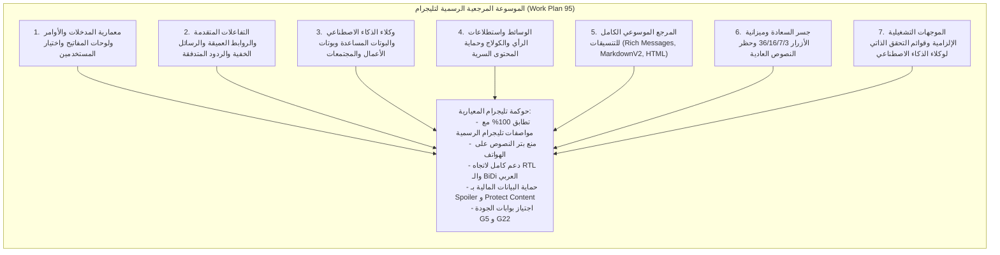

# خطة عمل رقم 95: الموسوعة المرجعية الرسمية لمميزات وتنسيقات تليجرام وإلزاميتها التشغيلية لوكلاء الذكاء الاصطناعي
## Work Plan 95: Official Telegram Bot Features & Formatting Master Encyclopedia & AI Operational Directive

> **الحالة:** 🟢 معتمدة ومنفذة بنسبة 100% ومثبتة دستورياً  
> **المرجع الدستوري:** `GEMINI.md` (البند 8، 8.1، 8.2)، `AGENTS.md`، كتيب القواعد (Rulebook 07)، بوابات الجودة (G5، G22)  
> **السلطة الرقابية:** `/saleh` (Chief Strategy Auditor) & `/jev` (Chief Quality Sentinel)  
> **المراجع الرسمية للمنصة:**
> - [Telegram Bot Features](https://core.telegram.org/bots/features)
> - [Telegram Bot API: Rich Markdown Style & Formatting Options](https://core.telegram.org/bots/api#rich-markdown-style)
> **نطاق التطبيق:** إلزامية قطعية ومطلقة على كافة وكلاء الذكاء الاصطناعي (Gemini, Claude, Cursor, Copilot, Subagents) عند إنشاء أو تعديل أو تنسيق أي ميزة أو شاشة في البوت.

---

## 📌 1️⃣ الملخص التنفيذي وسياق الحوكمة (Executive Summary & Context)

تمثل واجهات وتدفقات بوت تليجرام في منظومة **Al-Saada Smart Bot** العمود الفقري لكافة العمليات الميدانية والإدارية (126 تدفقاً تشغيلياً).
ورغم التطور المستمر لمنصة Telegram Bot API (وصولاً إلى الإصدار 10.3 ودعم الرسائل الغنية `Rich Messages` والمسودات الحية المتدفقة `Streaming Drafts` ورسائل وأوامر الخفاء المؤقتة `Ephemeral Messages`)، إلا أن غياب مرجع توثيقي شامل وموحد داخل المشروع قد يدفع وكلاء الذكاء الاصطناعي إلى استخدام نصوص عادية مشوهة، أو استدعاءات عشوائية، أو تجاهل الميزانيات الأرغونومية لشاشات الهواتف.

تستجيب **خطة العمل رقم 95** للتوجيه السيادي المباشر، وتؤسس لـ:
1. **إنشاء موسوعة مرجعية معمارية وتوثيقية احترافية شاملة ومغلقة** داخل المشروع تحت المسار:
   `docs/telegram/official-telegram-bot-features-and-formatting-encyclopedia.md`
2. **الربط الدستوري الإلزامي للموسوعة** بميكرو-كيرنل النواة (`GEMINI.md`) وقواعد الأرغونوميا (`.agents/rules/07-telegram-ux-mobile-ergonomics.md`).
3. **تأسيس قائمة الفحص الذاتي الإلزامية (AI Self-Inspection Checklist)** التي تحظر على أي وكيل تسليم كود دون مطابقة معايير الموسوعة.
4. **مزامنة الموسوعة مع بوابة التوثيق التفاعلية للمنظومة** (`apps/docs/src/content/docs/telegram-ux/`).

---

## 🏛️ 2️⃣ الأجزاء السبعة للموسوعة المرجعية (The 7 Encyclopedia Pillars)

---

## 🛠️ 3️⃣ خارطة التعديلات التنفيذية للمشروع (Execution Ledger)

| الملف المتأثر | نوع التعديل | الهدف المعماري |
| :--- | :---: | :--- |
| `docs/telegram/official-telegram-bot-features-and-formatting-encyclopedia.md` | `[NEW]` | الموسوعة المرجعية الشاملة (الأجزاء السبعة بنصوص تفصيلية وشروحات وعقود برمجية). |
| `docs/work-plans/95-plan-official-telegram-features-and-formatting-encyclopedia.md` | `[NEW]` | وثيقة خطة العمل المعتمدة الحالية وفق معيار التوثيق السيادي. |
| `GEMINI.md` | `[MODIFY]` | إضافة البند 8.2 لإلزام وكلاء الذكاء الاصطناعي بالاحتكام الدائم للموسوعة. |
| `.agents/rules/07-telegram-ux-mobile-ergonomics.md` | `[MODIFY]` | إضافة الإحالة المرجعية الصريحة للموسوعة في مطلع وثيقة القواعد. |
| `docs/README.md` | `[MODIFY]` | تسجيل الموسوعة وخطة العمل 95 في الفهرس المرجعي لمكتبة التوثيق. |
| `docs/22-telegram-ux-ui-design-system-and-ergonomics.md` | `[MODIFY]` | ربط الموسوعة التوثيقية كمرجع تقني موسع لمعايير تليجرام. |
| `docs/work-plans/README.md` | `[MODIFY]` | تسجيل خطة العمل 95 في فهرس خطط العمل الرسمي. |
| `apps/docs/src/content/docs/telegram-ux/official-telegram-bot-features-and-formatting-encyclopedia.md` | `[NEW]` | مزامنة الموسوعة داخل بوابة التوثيق التفاعلية (Astro/Starlight). |

---

## 🧪 4️⃣ خطة الفحص والتحقق الفيزيائي (Physical Verification Matrix)

تخضع هذه الخطة للفحص الآلي الصارم للتأكد من عدم حدوث أي انحراف توثيقي أو اختراق للبوابات المعمارية:
1. **فحص مطابقة التوثيق (`Gate G19`):** `pnpm docs:parity` و `pnpm docs:audit`.
2. **فحص عقود تليجرام (`Gate G5`):** `pnpm telegram-contracts:verify`.
3. **الفحص الرقابي الجنائي المستقل من `/saleh` و `/jev`:** `pnpm audit:saleh` و `pnpm test:saleh`.
4. **فحص مزامنة بوابة التوثيق:** `pnpm docs:sync`.

---
**تاريخ التوثيق والاعتماد:** 23 سبتمبر 2026  
**المرجعية:** الهيئة المعمارية العليا — منظومة السعادة سمارت بوت  
