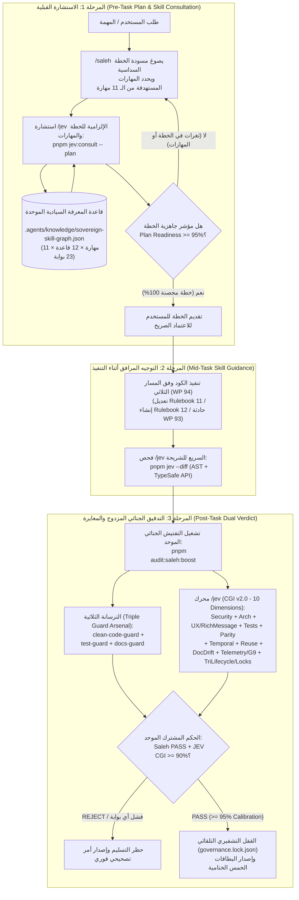

# خطة عمل رقم 96: ميثاق المستشار السيادي الدائم للمهارات والخطط (`/jev` × `/saleh`) والرسم البياني المعرفي الموحد ومعايرة مؤشر الحوكمة الشامل (`CGI v2.0`)
## Work Plan 96: Sovereign Permanent Skill & Plan Consultant (`/jev` × `/saleh`), Unified Knowledge Graph, and Composite Governance Index Calibration (`CGI v2.0`)

> **الحالة:** 🟡 مسودة معتمدة وموثقة بالكامل (Spec-First Complete — بانتظار إشارة البدء بالتنفيذ البرمجي)  
> **الفرع المعزول (OBOO Branch):** `plan/96-jev-permanent-skill-consultant`  
> **المرجع الدستوري:** `GEMINI.md` (البنود 1، 3، 5، 6، 7.1، 8.1، 8.2، 8.3، 10)، `AGENTS.md`، كتيبات القواعد (`Rulebooks 01–12`)، خطط العمل (`WP 88–95`)، وبوابات الجودة (`G1–G23`)  
> **السلطة الرقابية المشتركة:** `/saleh` (Sovereign Stakeholder Proxy & Chief Strategy Auditor) × `/jev` (Chief Quality Sentinel & Permanent Skill/Plan Consultant — TypeSafe System One `jev-latest`)  
> **نطاق التطبيق:** إلزامية قطعية ومطلقة على كافة المهارات الـ 11 (`.agents/skills/`)، وأدوات التدقيق (`tools/governance/`)، وكافة وكلاء الذكاء الاصطناعي قبل وأثناء وبعد أي مهمة برمجية أو مراجعة.

---

## 📌 1️⃣ الملخص التنفيذي، التشخيص الجنائي الفيزيائي، ونتيجة استشارة `/jev` الحية (Executive Summary & Live JEV Forensic Consultation Baseline)

انطلاقاً من التوجيه السيادي بتدريب الوكيل على كافة المهارات الخاصة بالمشروع، وتطويرها المستمر عبر موديول **`/jev`** (`TypeSafe System One API — jev-latest`)، وربط كل نقطة في المهارات الـ 11 بكافة قواعد المشروع (`Rulebooks 01–12`) وبوابات الجودة (`G1–G23`) لتكوين **قاعدة معرفية سيادية موحدة (Sovereign Knowledge Graph)** ومساعد استشاري دائم يُستشار قبل وأثناء وبعد كل مهمة؛ تم إجراء **فحص وتشخيص جنائي فيزيائي حي (Live Consultation)** عبر تشغيل `pnpm jev` و `pnpm audit:saleh` بالتوازي.

### 🔍 التشخيص الجنائي للتناقض المكتشف (`CGI: 51.8% [REJECT]` مقابل `audit:saleh: [PASS]`)

أظهر الفحص الفيزيائي المباشر لمحرك `/jev` (`jev-latest` السحابي + فاحص AST المحلي) حصول المنظومة حالياً على مؤشر حوكمة مركب **`CGI: 51.8% [REJECT]`** في حين أعطى `pnpm audit:saleh` نتيجة **`[PASS] (0 errors, 0 warnings)`**. وبالتشريح الجنائي للكود المصدري في `tools/governance/jev-auditor.ts` و `tools/governance/typesafe/audit-catalog.ts` و `tools/governance/saleh-audit-suite.ts`، تم كشف **3 فجوات معمارية حرجة** تسببت في هذا الانفصال:

| # | الفجوة المعمارية المكتشفة | الموقع الفيزيائي في الكود | الأثر الجنائي الفعلي في استشارة `/jev` | الحل الجذري المعتمد في خطة عمل 96 |
| :-: | :--- | :--- | :--- | :--- |
| **1** | **عمى الحالة ومسار الاختبارات الخاطئ (State Blindness Bug)** | [`tools/governance/jev-auditor.ts`](file:///f:/Alsaada-Smart-Bot/tools/governance/jev-auditor.ts#L802-L829) و [`L835-L837`](file:///f:/Alsaada-Smart-Bot/tools/governance/jev-auditor.ts#L835-L837) | يبحث `jev-auditor.ts` عن ملفات الاختبار داخل `modules/<mod>/src/flows/<slug>/tests` (وهو مسار غير موجود في معمارية الشريحة العشرية حيث تقع الاختبارات في `modules/<mod>/tests/flows/*.spec.ts`)، كما يرسل `state: { target, code }` مقطوعاً عند 50,000 حرف بدون `astSummary` وبدون عقود `flow.contract.json`. النتيجة: أرسل **صفر ملفات اختبار** إلى نموذج `jev-latest` السحابي، فحكم النموذج بحق: `Test Authenticity = 40.0% [FAIL] (API: 62%)`! | إصلاح جامع ملفات الفحص في `jev-auditor.ts` ليقرأ `modules/<mod>/tests/flows/*.spec.ts` تلقائياً، وحقن كائن حالة غني (`EnrichedJevState`) يضم (`codeSample`, `testSample`, `contractSample`, `astSummary`, `activeSkills`, `rulebookRefs`). |
| **2** | **انفصال فاحص الـ AST وعدم استدعاء `/jev` داخل `/saleh`** | [`tools/governance/jev-auditor.ts`](file:///f:/Alsaada-Smart-Bot/tools/governance/jev-auditor.ts#L310-L430) مقابل [`tools/governance/saleh-audit-suite.ts`](file:///f:/Alsaada-Smart-Bot/tools/governance/saleh-audit-suite.ts#L75-L210) | رصد فاحص AST في `jev-auditor.ts` وجود تسميات أزرار بطول `40 حرفاً` (`> 16 chars`) وبيانات استدعاء `52 بايت` (`> 36 bytes`) ونصوص مالية، بينما لم يرصدها `saleh-audit-suite.ts` لأن الأخير يفحص فقط وسائط `ctx.reply` المباشرة دون فحص مصفوفات الأزرار المبنية في `menu.builder.ts`، كما أن `saleh-audit-suite.ts` لا يستدعي `runJevAudit()` إطلاقاً. | توحيد محرك فحص AST بين الأداتين، ودمج `runJevAudit()` كمستشار ومراجع توأم إلزامي داخل `saleh-audit-suite.ts` (`pnpm audit:saleh:boost`) بحيث يستحيل صدور `[PASS]` من `/saleh` إذا كان حكم `/jev` هو `REJECT`. |
| **3** | **غياب الرسم البياني المعرفي للمهارات الـ 11 ونقص مستجدات الخطط `88–95` في كتالوج `/jev`** | [`tools/governance/typesafe/audit-catalog.ts`](file:///f:/Alsaada-Smart-Bot/tools/governance/typesafe/audit-catalog.ts#L31-L313) و [`.agents/skills/`](file:///f:/Alsaada-Smart-Bot/.agents/skills/) | المهارات الـ 11 تعمل كملفات نصية منعزلة دون قاعدة بيانات علائقية تربط كل بند في كل مهارة بكتيبات القواعد (`01–12`) وخطط العمل الحديثة (`WP 90` OTP Lock، `WP 91` Gate G9 AST Telemetry، `WP 93` Spec-First Incident Dossiers، `WP 94` Tri-Lifecycle، `WP 95` Telegram Encyclopedia & `InputRichMessage`)، ولا يوجد نمط استشارة مسبقة للخطط والمهارات (`skillAndPlanConsultation`). | بناء `.agents/knowledge/sovereign-skill-graph.json` لربط الـ 11 مهارة × 12 قاعدة × 23 بوابة، وترقية `audit-catalog.ts` إلى **10 أبعاد (`CGI v2.0`)** مع إضافة محرك الاستشارة المسبقة واللاحقة (`--consult-plan` و `--consult-skill`). |

---

## 🏛️ 2️⃣ المعمارية المستهدفة ومخطط التدفق الاستشاري الدائم (Target Architecture & Permanent Co-Auditor Workflow)

### أ. مخطط حلقة الاستشارة السيادية المغلقة (`/saleh` × `/jev` Permanent Consultation Loop)



### ب. طوبولوجيا الرسم البياني المعرفي السيادي (`sovereign-skill-graph.json`)

```mermaid
graph LR
    subgraph Skills11["منظومة المهارات الـ 11 (.agents/skills/)"]
        MS1["1. saleh (Sovereign Auditor)"]
        MS2["2. jev (TypeSafe System One Sentinel)"]
        MS3["3. chief-arbitrator (Conflict Resolver)"]
        MS4["4. open-code-review (OCR Static Reviewer)"]
        MS5["5. squad-architecture-devops"]
        MS6["6. squad-finance-security"]
        MS7["7. squad-implementation-ux"]
        MS8["8. squad-qa-migration"]
        AG1["9. arsenal/clean-code-guard"]
        AG2["10. arsenal/test-guard"]
        AG3["11. arsenal/docs-guard"]
    end

    subgraph GraphCore["النواة المعرفية الموحدة (.agents/knowledge/sovereign-skill-graph.json)"]
        Node["عقدة الربط السيادي (SkillNode)
        - skillId & version
        - mandatoryCheckpoints[]
        - requiredRulebooks[] (01..12)
        - enforcedGates[] (G1..G23)
        - workPlanInvariants[] (WP 88..96)
        - jevCatalogQuestions[]
        - selfImprovementTriggers[]"]
    end

    subgraph Constitution["الدستور وبوابات الجودة (SSOT & Gates)"]
        RB["كتيبات القواعد الـ 12
        (.agents/rules/01..12)"]
        WP["خطط العمل السيادية
        (WP 88, 90, 91, 93, 94, 95, 96)"]
        G23["بوابات الجودة الـ 23
        (Gates G1–G23)"]
    end

    Skills11 --> Node
    Node --> RB
    Node --> WP
    Node --> G23
```



### ج. منهجية التدريب المستمر ورفع كفاءة المهارات الـ 11 عبر `/jev` (Continuous Skill Training & Elevation Protocol)

يعمل موديول **`/jev`** (`TypeSafe System One API — jev-latest`) كمدرب ومستشار دائم يرفع كفاءة الوكيل في كل مهارة من المهارات الـ 11 عبر **3 محطات إلزامية مترابطة**:

| المحطة الاستشارية | الأمر البرمجي | المدخلات المفحوصة من الرسم البياني المعرفي | المخرجات التدريبية لرفع كفاءة الوكيل (`100% Compliance`) |
| :--- | :--- | :--- | :--- |
| **1. الاستشارة والتدريب القبلي (`Pre-Task Skill Briefing`)** | `pnpm jev:consult --plan <path> --skills <ids>` | خطة العمل المقترحة + عقد `SkillNode` للمهارات المستهدفة من `.agents/knowledge/sovereign-skill-graph.json` + كتيبات القواعد `01–12` | يصدر `/jev` قائمة التزامات دقيقة لكل نقطة في المهارة (`preTaskChecklist`)، ويكشف أي قاعدة مشروع أو بوابة جودة (`G1–G23`) أُغفلت في الخطة قبل كتابة سطر كود واحد (`Plan Readiness >= 95%`). |
| **2. التوجيه المرافق أثناء التنفيذ (`Mid-Task Live Coaching`)** | `pnpm jev --diff` | التغييرات الحية في الفرع (`git diff`) + عقود `flow.contract.json` + فحص AST اللحظي | ينبه الوكيل فوراً عند أي انحراف عن المهارة (مثل نسيان `await captureFlowError` في `G9`، أو تجاوز ميزانية الأزرار `36/16/7/3` في `G5/G22`، أو عدم استخدام `InputRichMessage` في `WP 95`). |
| **3. التدقيق المزدوج والتغذية الراجعة الختامية (`Post-Task Dual Calibration`)** | `pnpm audit:saleh:boost` | الكود الكامل + ملفات الاختبار في `modules/<mod>/tests/flows/*.spec.ts` + الترسانة الثلاثية (`clean-code-guard`, `test-guard`, `docs-guard`) | يحسب `/jev` مؤشر `CGI v2.0` عبر 10 أبعاد؛ وفي حال نزول أي بُعد عن `95%`، يحدد `/jev` النقطة الدقيقة في المهارة والقاعدة التي تحتاج تقوية ويضيفها إلى `selfImprovementTriggers` في الرسم البياني المعرفي. |

---

## 🔗 3️⃣ مصفوفة الربط السيادي الشامل للمهارات الـ 11 بالقواعد الـ 12 وبوابات الجودة الـ 23 (Complete 11-Skill × 12-Rulebook × 23-Gate Sovereign Matrix)

تمثل هذه المصفوفة المخطط المرجعي الكامل الذي سيتم ترميزه آلياً داخل `.agents/knowledge/sovereign-skill-graph.json` وفحصه في كل استشارة لـ `/jev`:

| # | المهارة (`Skill ID`) | المسار الفيزيائي | كتيبات القواعد المرتبطة (`Rulebooks`) | خطط العمل الحاكمة (`Work Plans`) | بوابات الجودة الملزمة (`Gates G1–G23`) | أسئلة وفحوصات `/jev` (`JEV_AUDIT_CATALOG`) |
| :-: | :--- | :--- | :--- | :--- | :--- | :--- |
| **1** | **`saleh`** (Chief Strategy Auditor) | `.agents/skills/saleh/SKILL.md` | **كافة القواعد `01–12`** (السلطة الرقابية العليا) | `WP 88`, `WP 90`, `WP 93`, `WP 94`, `WP 95`, `WP 96` | **كافة البوابات `G1–G23`** | `skillAndPlanConsultation`, `triLifecycleAndLockCompliance`, `squadAutonomousRouter` |
| **2** | **`jev`** (TypeSafe System One Sentinel) | `.agents/skills/jev/SKILL.md` | **كافة القواعد `01–12`** (المستشار والمحكم الآلي) | `WP 90`, `WP 91`, `WP 93`, `WP 94`, `WP 95`, `WP 96` | **كافة البوابات `G1–G23`** | جميع الأبعاد الـ 10 في `JEV_AUDIT_CATALOG` (`CGI v2.0`) |
| **3** | **`chief-arbitrator`** (Supreme Arbitrator) | `.agents/skills/chief-arbitrator/SKILL.md` | `01` (F:\HR), `02` (Checkpoints), `03` (Git), `04` (Locks), `05` (Gates) | `WP 88`, `WP 90`, `WP 94` | `G1`, `G3`, `G5`, `G7`, `G11`, `G12`, `G13`, `G21`, `G22` | `stepParityWithLegacy`, `buttonLabelErgonomics`, `violatesTemporalInvariants`, `triLifecycleAndLockCompliance` |
| **4** | **`open-code-review`** (OCR Static Analysis) | `.agents/skills/open-code-review/SKILL.md` | `05` (Gates), `08` (RCA), `09` (Telemetry), `10` (AI Discipline) | `WP 91`, `WP 93`, `WP 94` | `G1`, `G6`, `G9`, `G15`, `G16`, `G17` | `layerResponsibilitySeparation`, `errorTelemetryCompliance`, `scopeBlastRadius` |
| **5** | **`squad-architecture-devops`** | `.agents/skills/squad-architecture-devops/SKILL.md` | `03` (Git OBOO), `04` (Locks), `09` (Telemetry & Outbox), `10` (Reuse & Topology) | `WP 89`, `WP 91`, `WP 92`, `WP 94` | `G1`, `G2`, `G6`, `G9`, `G13`, `G15`, `G18`, `G20`, `G21` | `layerResponsibilitySeparation`, `hasDuplicateDomainHelper`, `errorTelemetryCompliance`, `canSpeculativelyFanOut` |
| **6** | **`squad-finance-security`** | `.agents/skills/squad-finance-security/SKILL.md` | `01` (Accounting Parity), `04` (Immutability), `05` (Security Gates), `09` (Idempotency) | `WP 76`, `WP 77`, `WP 86`, `WP 90` | `G7`, `G8`, `G11`, `G12`, `G13`, `G16`, `G17`, `G21` | `hasUnmaskedCompensation`, `violatesTemporalInvariants`, `payrollCycleClassification` |
| **7** | **`squad-implementation-ux`** | `.agents/skills/squad-implementation-ux/SKILL.md` | `01` (Wizard Parity), `07` (Telegram UX), `11` (Modification), `12` (Creation) | `WP 09`, `WP 94`, `WP 95` | `G2`, `G4`, `G5`, `G6`, `G8`, `G9`, `G22` | `buttonLabelErgonomics`, `richMessageAndEncyclopediaCompliance`, `hasUnmaskedCompensation`, `errorTelemetryCompliance` |
| **8** | **`squad-qa-migration`** | `.agents/skills/squad-qa-migration/SKILL.md` | `01` (F:\HR Parity), `06` (Testing & Mutation), `08` (Incident RCA), `10` (Test Lock) | `WP 74`, `WP 93`, `WP 94` | `G3`, `G4`, `G10`, `G14`, `G19`, `G23` | `assertsRealDomainState`, `excessiveMocking`, `assertionRigorScore`, `hasSilentTestWeakening`, `hasDocCodeDrift` |
| **9** | **`arsenal/clean-code-guard`** | `.agents/skills/saleh/arsenal/clean-code-guard/SKILL.md` | `05` (Gates), `07` (UX Budget), `09` (Zero Console & G9 AST), `10` (Reuse-First) | `WP 91`, `WP 94`, `WP 95` | `G1`, `G2`, `G5`, `G6`, `G8`, `G9`, `G17`, `G22` | `layerResponsibilitySeparation`, `hasDuplicateDomainHelper`, `errorTelemetryCompliance`, `richMessageAndEncyclopediaCompliance` |
| **10** | **`arsenal/test-guard`** | `.agents/skills/saleh/arsenal/test-guard/SKILL.md` | `04` (Test Lock), `06` (Testing Constitution), `08` (Regression Proof) | `WP 90`, `WP 93`, `WP 94` | `G10`, `G11`, `G14`, `G23` | `assertsRealDomainState`, `excessiveMocking`, `assertionRigorScore`, `hasSilentTestWeakening`, `violatesTemporalInvariants` |
| **11** | **`arsenal/docs-guard`** | `.agents/skills/saleh/arsenal/docs-guard/SKILL.md` | `01` (`docs/19` Registry), `07` (Mermaid State Diagram), `08` (Zero-Placeholder Dossier) | `WP 91`, `WP 93`, `WP 94`, `WP 95` | `G3`, `G4`, `G19` | `hasDocCodeDrift`, `documentationParityScore`, `triLifecycleAndLockCompliance` |

---

## 🛠️ 4️⃣ المراحل الخمس للتنفيذ الهندسي والجراحي (The 5 Execution Phases & Technical Specifications)

### المرحلة 1: إصلاح عمى الحالة ومسارات الاختبارات وإثراء حمولة الفحص في `tools/governance/jev-auditor.ts`
1. **إصلاح جامع ملفات الاختبار (Test Discovery Resolution):**
   - في `tools/governance/jev-auditor.ts` (الأسطر `802–829` في الشجرة الحالية / `784–811` في خط الأساس): عند فحص تدفق محدد (`options.flowPath` مثل `modules/workforce/src/flows/recruitment`) أو عند الفحص العام للمونوريبو (`listFlowDirs(root)`):
   - استخراج اسم الموديول (`moduleName`) وكود/معرف التدفق (`flowSlug` و `flowKey` من `flow.contract.json`).
   - البحث تلقائياً في المسار القانوني للاختبارات `modules/<moduleName>/tests/flows/` عن كافة ملفات `*.spec.ts` و `*.test.ts` المرتبطة بالتدفق ودمجها في متغير مستقل `testSample`، بالإضافة إلى دمجها في `codeSample` المرسل إلى `evaluateBatchParallel`.
2. **إثراء كائن الحالة المرسل إلى TypeSafe System One (`EnrichedJevState`):**
   - بدلاً من إرسال `{ target: targetName, code: codeSample.slice(0, 50000) }` فقط (السطر `836` / `818` في خط الأساس)، يتم إرسال كائن مهيكل ومتوازن الميزانية:
     ```typescript
     export interface EnrichedJevState {
       target: string;
       mode: 'audit' | 'consult-plan' | 'consult-skill';
       flowSourceCode: string;       // حتى 25,000 حرف من ملفات الشريحة الـ 10
       flowTestCode: string;         // حتى 20,000 حرف من ملفات الاختبار الفعلية في modules/<mod>/tests/flows/
       flowContractJson: string;     // محتوى flow.contract.json الكامل
       astMetricsSummary: AstAnalysisSummary; // خلاصة فحص الـ AST الدقيق (عدد التوقعات، أطوال الأزرار، استدعاءات captureFlowError)
       activeSkillIds: string[];     // المهارات المستهدفة من المهارات الـ 11
       constitutionalMandates: string[]; // البنود الحاكمة من GEMINI.md و Rulebooks 01-12
     }
     ```
3. **ضمان الدقة في التقييم المحلي والهجين (`evaluateLocalHeuristics` & Hybrid Calibration):**
   - تحديث `evaluateLocalHeuristics` في `jev-auditor.ts` لقراءة `state.flowTestCode` و `state.astMetricsSummary` مباشرة، مما يضمن عدم سقوط `assertsRealDomainState` إلى `false` عندما تكون ملفات الاختبار موجودة ومحققة لشروط `expect(...)` على حالة النطاق.

---

### المرحلة 2: بناء الرسم البياني المعرفي السيادي الموحد (`.agents/knowledge/sovereign-skill-graph.json`) وفاحصه الآلي
1. **إنشاء قاعدة المعرفة المهيكلة (`.agents/knowledge/sovereign-skill-graph.json`):**
   - تحتوي على توصيف رسمي موثق لكل مهارة من المهارات الـ 11 (`saleh`, `jev`, `chief-arbitrator`, `open-code-review`, `squad-architecture-devops`, `squad-finance-security`, `squad-implementation-ux`, `squad-qa-migration`, `clean-code-guard`, `test-guard`, `docs-guard`).
   - لكل مهارة يتم تحديد:
     - `skillId`, `category` (`sovereign_auditor` | `arbitrator` | `static_reviewer` | `execution_squad` | `arsenal_guard`), `skillFilePath`.
     - `coreCompetencies`: النقاط التفصيلية الدقيقة للمهارة.
     - `linkedRulebooks`: مصفوفة كتيبات القواعد (`01` إلى `12`) مع أرقام الأقسام الدقيقة.
     - `linkedWorkPlans`: مصفوفة خطط العمل الحاكمة (`WP-88` إلى `WP-96`).
     - `enforcedQualityGates`: البوابات من `G1` إلى `G23`.
     - `jevConsultationQuestions`: مفاتيح الأسئلة في `JEV_AUDIT_CATALOG` التي تفحص مدى التزام الوكيل بهذه المهارة.
     - `preTaskChecklist` و `postTaskChecklist`: قوائم الفحص الإلزامية قبل وبعد المهمة.
2. **إنشاء أداة التحقق والاستعلام المعرفي (`tools/governance/verify-skill-graph.ts`):**
   - تتحقق عبر مخطط Zod (`SovereignSkillGraphSchema`) من أن:
     - كافة المهارات الـ 11 الموجودة في `.agents/skills/` مسجلة بنسبة 100% في الرسم البياني دون أي مهارة يتيمة (`Zero Orphan Skills`).
     - كافة مسارات كتيبات القواعد الـ 12 (`.agents/rules/*.md`) وخطط العمل (`docs/work-plans/*.md`) وبوابات الجودة (`G1–G23`) وأسئلة `JEV_AUDIT_CATALOG` موجودة فيزيائياً ومتطابقة.
   - توفر دالة استعلام برمجية `querySkillGraphForTask(taskScope)` يستدعيها كل من `/saleh` و `/jev` لاستخراج كافة القواعد والبوابات والمهارات الملزمة لأي مهمة قبل البدء بها.

---

### المرحلة 3: ترقية كتالوج أسئلة TypeSafe (`tools/governance/typesafe/audit-catalog.ts`) إلى 10 أبعاد (`CGI v2.0`) وإضافة نمط استشارة المهارات والخطط
1. **إضافة البُعد التاسع (Dimension 9): `errorTelemetryAndObservability` (البوابة `G9` / `WP 91` / `GEMINI.md` 8.3):**
   - `usesCanonicalCaptureFlowError`: سؤال `noul` يتحقق من أن طبقات حدود التدفق (`controller.ts` و `error.handler.ts`) تستدعي `await captureFlowError(error, boundedContext)` المستورد من `@alsaada/telemetry` ولا تبتلع الأخطاء في `catch` صامتة.
   - `enforcesBoundedFlowContext`: سؤال `noul` يتحقق من عدم استخدام `ctx?: unknown` والتقيد بعقد `BoundedFlowContext`.
2. **إضافة البُعد العاشر (Dimension 10): `triLifecycleAndRichMessageGovernance` (`WP 90`, `WP 93`, `WP 94`, `WP 95`, `GEMINI.md` 6, 7.1, 8.1, 8.2):**
   - `richMessageAndEncyclopediaCompliance`: سؤال `noul` يتحقق من استخدام `buildRichPage` / `buildRichTable` / `buildRichConfirmation` و `assertRichMessage(msg)` من `@alsaada/core-components/rich-message` وحظر `ctx.reply("string")` المجردة.
   - `triLifecycleAndLockCompliance`: سؤال `choice` (`compliant_sealed` | `missing_spec_or_dossier` | `unlocked_entity_drift`) يتحقق من الالتزام بالمسار الثلاثي (خطة عمل معتمدة / ملف جنائي مكتمل / قفل تشفيري `governance.lock.json`).
3. **إضافة قسم الاستشارة الدائمة للمهارات والخطط (`skillAndPlanConsultation`):**
   - `planSixPillarCompleteness`: سؤال `score` (من `Level 0` إلى `Level 3`) يقيم مدى استيفاء أي خطة عمل جديدة للأركان الستة (النطاق والمسارات، عقود البيانات، ميزانية UX تليجرام، التزامن والأمان، مصفوفة الاختبارات، ومعايير القبول).
   - `skillRulebookAlignment`: سؤال `noul` يتحقق من استدعاء وتطبيق كافة المهارات والقواعد المرتبطة بالمهمة من `sovereign-skill-graph.json`.
4. **إعادة معايرة أوزان مؤشر الحوكمة المركب (`JEV_GOVERNANCE_WEIGHTS` — المجموع = `1.00`):**
   ```typescript
   export const JEV_GOVERNANCE_WEIGHTS = {
     securityAndPrivacy: 0.15,          // G7, G8, G16, G21
     architectureAndTypes: 0.12,        // G1, G2, G4
     testAuthenticity: 0.15,            // G10, G23
     telegramErgonomics: 0.10,          // G5, G8, G22 (36/16/7/3 Budget)
     legacyParity: 0.10,                // G3, G19 (F:\HR Baseline)
     temporalInvariants: 0.08,          // G11, G23 (Pinned Clock & 26-25 Cycle)
     semanticReuse: 0.05,               // Rule 10.2 (@alsaada/shared Reuse)
     docCodeParity: 0.05,               // G3, G4, G19 (Bidirectional Citation)
     observabilityAndG9: 0.10,          // NEW: G9 AST, captureFlowError, BoundedFlowContext (WP 91)
     triLifecycleAndRichMessage: 0.10,  // NEW: WP 90 Locks, WP 93/94 Tri-Lifecycle, WP 95 RichMessage
   } as const;
   ```

---

### المرحلة 4: توحيد فاحص الـ AST ودمج `/jev` كمستشار ومراجع توأم إلزامي داخل `saleh-audit-suite.ts` وتحديث المهارات
1. **توحيد فاحص الـ AST (`Unified AST Ergonomics & Telemetry Scanner`):**
   - تحديث فاحص العرض والأرغونوميا في `tools/governance/jev-auditor.ts` و `tools/governance/saleh-audit-suite.ts` ليعتمدا نفس القواعد الدقيقة:
     - التمييز الدقيق بين أزرار تليجرام التفاعلية (`Markup.button.callback(label, data)` / `{ text, callback_data }`) وبين نصوص الرسائل العادية أو مفاتيح الكائنات غير المرئية للمستخدم، لمنع الإنذارات الكاذبة (`False Positives`) مع اصطياد أي زر حقيقي يتجاوز `16 حرفاً` أو `36 بايت`.
     - التحقق من أن النصوص المالية تستخدم `formatSpoiler` أو `<tg-spoiler>` أو `protect_content: true`.
     - التحقق من استدعاء `captureFlowError` المسبوق بـ `await`.
2. **الربط العضوي الإلزامي داخل `tools/governance/saleh-audit-suite.ts`:**
   - إضافة حقل `jevConsultation?: VerificationResult` في `SalehAuditReport['checkResults']`.
   - عند تشغيل `pnpm audit:saleh:boost` (أو `--with-jev`)، يقوم `saleh-audit-suite.ts` باستدعاء `runJevAudit()` والتحقق من `verifySkillGraph()`.
   - إذا كان `jevReport.overallVerdict === 'REJECT'` أو `jevReport.cgiScore < 90`، يتحول حكم `saleh-audit-suite.ts` تلقائياً وحتمياً إلى `REJECT` (أو `CONDITIONAL PASS` عند التحذيرات غير الحرجة)، مما يقضي نهائياً على أي تضارب بين `/saleh` و `/jev`.
3. **إضافة أوامر CLI القياسية في `package.json` (وفق البند 3.3 من `GEMINI.md`):**
   - `"jev:consult": "tsx tools/governance/jev-auditor.ts --consult"` (لاستشارة `/jev` في الخطط والمهارات والربط المعرفي قبل وأثناء المهمة).
   - `"skills:verify": "tsx tools/governance/verify-skill-graph.ts"` (لفحص سلامة وترابط الرسم البياني المعرفي للمهارات الـ 11).
4. **تحديث وثائق المهارات السيادية (`.agents/skills/saleh/SKILL.md` و `.agents/skills/jev/SKILL.md`):**
   - توثيق بروتوكول **"الاستشارة التوأم الدائمة (`/saleh` × `/jev`)"** كخطوة أولى إلزامية قبل صياغة أي خطة (`Pre-Task Consultation`) وكخطوة ختامية قبل إصدار أي حكم (`Post-Task Dual Verdict`).

---

### المرحلة 5: المعايرة الفيزيائية الشاملة (`CGI >= 95.0% [PASS]`)، اختبارات الانحدار، والقفل التشفيري
1. **كتابة suite اختبارات شاملة (`tools/governance/tests/jev-skill-consultant.spec.ts`):**
   - اختبار اكتشاف ملفات الاختبار في `modules/<mod>/tests/flows/*.spec.ts` وإثراء `EnrichedJevState`.
   - اختبار صحة وترابط `.agents/knowledge/sovereign-skill-graph.json` across all 11 skills, 12 rulebooks, and 23 gates (`verifySkillGraph()`).
   - اختبار حساب `CGI v2.0` بالأبعاد الـ 10 ونمط `skillAndPlanConsultation` (`--consult`).
   - اختبار التكامل بين `saleh-audit-suite.ts` و `jev-auditor.ts` وضمان تطابق الحكم النهائي.
2. **المعايرة الفيزيائية الحية (`Live Calibration`):**
   - تشغيل `pnpm jev` و `pnpm jev:consult` و `pnpm skills:verify` و `pnpm audit:saleh:boost` والتأكد من ارتفاع مؤشر الحوكمة الشامل من `51.8% [REJECT]` إلى **`>= 95.0% [PASS]`** بناءً على قراءة الأدلة الفيزيائية الحقيقية للمشروع.
3. **القفل التشفيري الكامل (`Cryptographic Sealing`):**
   - تشغيل `pnpm governance:lock` و `pnpm lock test:tools/governance/tests/jev-skill-consultant.spec.ts` و `pnpm lock:verify` لضمان تشفير كافة الملفات المعدلة والجديدة بتجزئة SHA-256 في `governance.lock.json`.

---

## 📋 5️⃣ جدول نطاق التأثير ومصفوفة الأقفال التشفيرية (Blast Radius, File Ledger & Lock Protocol)

| # | المسار الفيزيائي للملف | نوع الإجراء | المرحلة | حالة الحماية في `governance.lock.json` | الصيغة الدستورية المطلوبة عند التنفيذ |
| :-: | :--- | :---: | :---: | :--- | :--- |
| **1** | [`docs/work-plans/96-plan-jev-permanent-skill-consultant-and-knowledge-graph.md`](file:///f:/Alsaada-Smart-Bot/docs/work-plans/96-plan-jev-permanent-skill-consultant-and-knowledge-graph.md) | `[NEW]` | التوثيق القبلي (تم الآن) | غير مقفل (توثيق خطة عمل) | متاح للتوثيق القبلي (Spec-First) |
| **2** | [`docs/work-plans/README.md`](file:///f:/Alsaada-Smart-Bot/docs/work-plans/README.md) | `[MODIFY]` | التوثيق القبلي (تم الآن) | غير مقفل (فهرس خطط العمل) | متاح للتوثيق القبلي (Spec-First) |
| **3** | `.agents/knowledge/sovereign-skill-graph.json` | `[NEW]` | المرحلة 2 | يُختم في `governance.lock.json` | يُقفل بعد الإنشاء عبر `pnpm governance:lock` |
| **4** | `tools/governance/verify-skill-graph.ts` | `[NEW]` | المرحلة 2 | ضمن المحميات (`tools/governance`) | `«موافق على التعديل او الايقاف او الحذف»` / `«موافق على خطة الإصلاح»` |
| **5** | [`tools/governance/typesafe/audit-catalog.ts`](file:///f:/Alsaada-Smart-Bot/tools/governance/typesafe/audit-catalog.ts) | `[MODIFY]` | المرحلة 3 | ضمن المحميات (`tools/governance`) | `«موافق على التعديل او الايقاف او الحذف»` |
| **6** | [`tools/governance/jev-auditor.ts`](file:///f:/Alsaada-Smart-Bot/tools/governance/jev-auditor.ts) | `[MODIFY]` | المرحلة 1 و 3 و 4 | ضمن المحميات (`tools/governance`) | `«موافق على التعديل او الايقاف او الحذف»` |
| **7** | [`tools/governance/saleh-audit-suite.ts`](file:///f:/Alsaada-Smart-Bot/tools/governance/saleh-audit-suite.ts) | `[MODIFY]` | المرحلة 4 | ضمن المحميات (`tools/governance`) | `«موافق على التعديل او الايقاف او الحذف»` |
| **8** | [`.agents/skills/saleh/SKILL.md`](file:///f:/Alsaada-Smart-Bot/.agents/skills/saleh/SKILL.md) | `[MODIFY]` | المرحلة 4 | ضمن المحميات (`.agents/skills`) | `«موافق على التعديل او الايقاف او الحذف»` |
| **9** | [`.agents/skills/jev/SKILL.md`](file:///f:/Alsaada-Smart-Bot/.agents/skills/jev/SKILL.md) | `[MODIFY]` | المرحلة 4 | ضمن المحميات (`.agents/skills`) | `«موافق على التعديل او الايقاف او الحذف»` |
| **10** | [`package.json`](file:///f:/Alsaada-Smart-Bot/package.json) | `[MODIFY]` | المرحلة 4 | ضمن المحميات (`PROTECTED_GOVERNANCE_FILES`) | `«موافق على التعديل او الايقاف او الحذف»` |
| **11** | `tools/governance/tests/jev-skill-consultant.spec.ts` | `[NEW]` | المرحلة 5 | يُقفل ككيان اختبار مستقل (`test:<path>`) | يُقفل تلقائياً عبر `pnpm lock test:...` |
| **12** | [`governance.lock.json`](file:///f:/Alsaada-Smart-Bot/governance.lock.json) | `[MODIFY]` | المرحلة 5 | سجل الأقفال التشفيرية SHA-256 | إعادة الختم التلقائي عبر `pnpm governance:lock` و `pnpm lock:all` |

---

## ✅ 6️⃣ معايير القبول الفيزيائي وبوابات التحقق (Acceptance Criteria & Physical Verification Matrix)

لا تُعتبر **خطة العمل السيادية رقم 96** منفذة ومكتملة إلا بتحقق كافة الشروط الفيزيائية التالية على الطرفية بنتيجة `Exit Code: 0`:

1. **اكتمال وترابط الرسم البياني للمهارات (`pnpm skills:verify`):**
   - تغطية 100% للمهارات الـ 11 (`8` مهارات رئيسية + `3` مهارات ترسانة `/saleh`) وربطها بكافة كتيبات القواعد الـ 12 (`Rulebooks 01–12`)، خطط العمل (`WP 88–96`)، وبوابات الجودة الـ 23 (`G1–G23`) بصفر مهارات يتيمة أو روابط مكسورة.
2. **اجتياز استشارة `/jev` ومعايرة المؤشر (`pnpm jev` & `pnpm jev:consult`):**
   - قراءة ملفات الاختبار الحقيقية من `modules/<mod>/tests/flows/*.spec.ts` وعقود `flow.contract.json` داخل `EnrichedJevState`.
   - ارتفاع مؤشر الحوكمة المركب `CGI v2.0` عبر الأبعاد الـ 10 من `51.8% [REJECT]` إلى **`>= 95.0% [PASS]`**.
3. **التطابق التام بين `/saleh` و `/jev` (`pnpm audit:saleh:boost`):**
   - عمل `/jev` كمستشار ومراجع توأم مدمج داخل `saleh-audit-suite.ts` وتطابق مخرجات فاحص AST ومؤشر الحوكمة بينهما بنسبة 100%.
4. **اجتياز اختبارات الوحدة والانحدار وبوابات الحوكمة (`pnpm test:jev`, `pnpm test:saleh`, `pnpm lock:verify`):**
   - نجاح كافة الاختبارات في `tools/governance/tests/jev-auditor.spec.ts` و `tools/governance/tests/saleh-audit-suite.spec.ts` و `tools/governance/tests/jev-skill-consultant.spec.ts` وإعادة ختم كافة الكيانات في `governance.lock.json`.

---
**تاريخ التوثيق:** 23 سبتمبر 2026  
**المُعدّ:** `/saleh` (Sovereign Strategy Auditor) بالتكامل الاستشاري الحي مع `/jev` (TypeSafe System One Sentinel)  
**الفرع:** `plan/96-jev-permanent-skill-consultant`  
