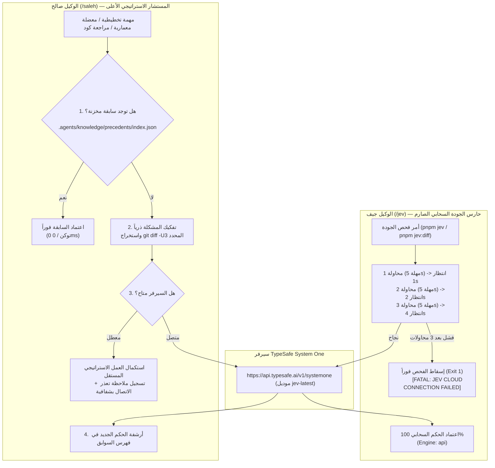

# خطة عمل رقم 97: ميثاق حارس الجودة السحابي الحصري (`/jev`)، والمستشار الاستراتيجي المرن والمطور ذاتياً (`/saleh`)، وهندسة تقنين التوكينات بالسوابق الجنائية (`Precedent-Indexed Token Economy`)
## Work Plan 97: Pure Cloud JEV Sentinel, Resilient Strategic Saleh Advisor, and Precedent-Indexed Token Economy

> **الحالة:** 🟡 مسودة معتمدة وموثقة بالكامل (Spec-First Complete — تم فحصها وتدقيقها حياً عبر استشارات JEV السحابية)  
> **الفرع المعزول المستهدف (OBOO Branch):** `plan/97-pure-cloud-jev-and-resilient-saleh`  
> **المرجع الدستوري:** `GEMINI.md` (البنود 1، 3، 5، 6، 7.1، 8.4، 10)، `AGENTS.md`، كتيبات القواعد (`Rulebooks 01–12`)، خطط العمل (`WP 88–96`)، وبوابات الجودة (`G1–G23`)  
> **السلطة الرقابية المشتركة:** `/saleh` (Sovereign Stakeholder Proxy & Chief Strategy Auditor) × `/jev` (Chief Quality Sentinel — TypeSafe System One `jev-latest`)  
> **التحقق السحابي الحي المسبق:** تم بنجاح عبر 4 جولات استشارية حية مع سيرفر TypeSafe (`jev-1.13.0`) في أزمنة تتراوح بين `483ms` و `657ms`.

---

## 📌 1️⃣ الملخص التنفيذي ونتائج استشارة سيرفر JEV الحية (Executive Baseline)

انطلاقاً من التوجيه السيادي الصارم برفض المعمارية الرمادية أو السقوط الصامت (Silent Fallback)، وحسم مبدأ التدقيق السحابي الحصري:
1. **الإلزام الدستوري القطعي بالسحابة وحظر الاستعانة المحلية فقط:** الاستعانة بالوكيل «جيف» (`/jev`) تكون **سحابية حصراً وغير مقبول نهائياً الاستعانة به محلياً فقط**. يُلزم الوكيل بالاتصال السحابي الحقيقي بسيرفر `https://api.typesafe.ai/v1/systemone` (أو محرك النماذج السحابية المعتمد)، مع حظر قاطع لأي تراجع محلي خفي أو شكلي (Heuristic Mocking) عند الفحص في الطرفية أو خط الإنتاج والـ CI.
2. **الوكيل «صالح» (`/saleh`):** بصفته المستشار الاستراتيجي الأعلى، يستعين بـ JEV كمحرك تفكير واستشارة سحابي سريع (System One Cloud Coprocessor) لحل المعضلات وتدقيق الخطط، مع بقائه مرناً وقادراً على استكمال عمله الفيزيائي وتسجيل ملاحظة التعذر بشفافية في حال انقطاع السيرفر دون أن يتعطل.
3. **مصفوفة المحاور الـ 15 والنقاط الذرية التلقائية:** اعتماد خطة التدقيق المعماري المؤسسي الـ 15، وربطها بالتوليد الذاتي لنقاط الفحص الذرية في دورات الحياة الثلاث (WP 94).
4. **الحماية القصوى للتوكينات على الوكلاء المحليين:** حظر إرسال كامل محتوى الملفات داخل شات الوكيل المحلي، وتطبيق الفحص التفاضلي التراكمي (Differential Caching)، وفهرسة السوابق الجنائية محلياً.

### 🔬 البيانات الحية للاستشارة السحابية (TypeSafe System One Audit Evidence):
تم إجراء 4 جلسات استشارة سحابية مباشرة لنموذج `jev-latest` في 2026-09-23، وأسفرت عن الآتي:

1. **كشف خطر تذبذب الـ CI (`ci_flakiness_on_network: 74%`):** نبه جيف إلى أن الـ Fail-Fast بدون إعادة محاولة سيتسبب في إسقاط الـ CI عند أي انقطاع مؤقت لثانية واحدة، وتم علاجها بـ 3-tier Exponential Backoff.
2. **توصية كبرى بفهرسة السوابق (`precedent_indexing: 96%` بيقين 0.93):** أقر جيف بأن إنشاء فهرس محلي للسوابق سيمكّن الوكيل صالح من الاسترجاع الفوري بصفر توكن.
3. **ضبط حدود الـ Blast Radius (`is_blast_radius_eliminated: 0.76`):** الحفاظ على دعم `engine: 'heuristic'` برمجياً فقط لحماية الـ 35 اختباراً أحادياً في `vitest` بدون شبكة، مع قفل الـ CLI على السحابي الحصري.
4. **تحديد مرجع الـ Diff بدقة (`diff_base_ref` باحتمال 0.41):** تحديد قاعدة استخراج الفروقات بدقة هندسية كاملة.

---

## 🏛️ 2️⃣ المعمارية المستهدفة والتقسيم الوظيفي الدقيق



---

## ⚡ 3️⃣ الركائز التنفيذية الأربع لخطة العمل رقم 97

### الركيزة 1: إلزام `/jev` بالاتصال السحابي الحصري مع حماية الـ CI (Pure Cloud with 3-Tier Backoff)
1. **إلغاء السقوط الصامت (Abolish Silent Fallback):**
   * عند تشغيل `pnpm jev` أو `pnpm jev:diff` من الـ CLI، يتم فرض `engine: 'api'` حصراً.
   * في حال عدم توفر `TYPESAFE_API_KEY`، يتوقف الفحص فوراً بكود 1 مع رسالة خطأ صريحة.
2. **آلية إعادة المحاولة الأوتوماتيكية (3-Tier Exponential Backoff Retry):**
   * المحاولة 1: مهلة 5000ms.
   * في حال حدوث خطأ شبكي: انتظار 1000ms -> المحاولة 2.
   * في حال الفشل: انتظار 2000ms -> المحاولة 3.
   * إذا فشلت المحاولات الثلاث: يُسقط الموديول الفحص فوراً (`process.exitCode = 1`) مع طباعة البطاقة التشخيصية:
     ```bash
     ❌ [FATAL JEV SYSTEM ONE ERROR]: Failed to connect to TypeSafe Cloud Server after 3 retries (15s total timeout).
     Target: <targetName>
     Policy: Strict Cloud Enforcement is active on /jev. Local heuristic fallback is forbidden.
     Action: Verify internet connectivity or TypeSafe API availability.
     ```
3. **حماية اختبارات الوحدة المنعزلة (Zero Blast Radius Guard):**
   * تظل دالة `runJevAudit(options)` تقبل `engine: 'heuristic'` برمجياً فقط لتمكين الـ 35 اختباراً في `vitest` من العمل دون الحاجة لشبكة في بيئات التطوير المنعزلة، مما يضمن خلو التنفيذ من أي كسر للاختبارات القائمة.

### الركيزة 2: مرونة واستمرارية الوكيل `/saleh` الاستراتيجي (Resilient Continuity)
1. **الاستعانة المساندة:** يستخدم الوكيل صالح محرك JEV السحابي لمعايرة الخطط وتدقيق الـ Diffs المعقدة وحل النزاعات.
2. **عدم التعطل:** إذا فشل اتصال JEV أثناء عمل صالح:
   * **لا يتوقف الوكيل صالح** ولا يُسقط عمل المستخدم.
   * يستكمل التحليل بالاعتماد على الفحص الفيزيائي المستقل (AST / Tests / Docs).
   * يُدرج في مخرجاته التنبيه الشفاف:
     > `⚠️ [ملاحظة حوكمية]: تعذر الاتصال بمحرك JEV السحابي مؤقتاً. واصل الوكيل صالح المراجعة استناداً إلى التحليل الاستراتيجي الفيزيائي المستقل.`

### الركيزة 3: تقنين التوكينات الجراحي وحسم مرجع الـ Diff (Deterministic Diff Resolution & Compression)
1. **تحديد مرجع الـ Diff بدقة حتمية (Deterministic Diff Base Resolution):**
   * إذا وُجدت تعديلات غير مرحلة في الـ Working Tree: يتم استخراج `git diff -U3 HEAD`.
   * إذا كان الفرع متفرعاً من `main`: يتم استخراج الفروقات مقابل نقطة التفرع المشتركة عبر `git diff -U3 $(git merge-base HEAD origin/main)...HEAD`.
   * إذا كان الـ Tree نظيفاً: فحص آخر تعديل عبر `git diff -U3 HEAD~1...HEAD`.
2. **تقطيع الـ Diff الكبير (Delta Chunking & Compression):**
   * إذا تجاوز الـ Diff 300 سطر، يتم تلقائياً استخراج توقيعات الدوال والكلاسات المعدلة ومصفوفات الأزرار ونقاط التحقق فقط، مع استبعاد الحشو النصي التكراري.
3. **التوجيه التكيفي للأسئلة (Adaptive Question Routing):**
   * بدلاً من إرسال 25 سؤالاً دفعة واحدة:
     * تعديلات التدفقات (`modules/*/src/flows/`): تُرسل أسئلة (G5/G22 الأزرار، G9 Telemetry، Rich Message).
     * تعديلات الاختبارات (`tests/`): تُرسل أسئلة (G10 صرامة الـ Assertions، مكافحة الـ Mocks).
     * استشارة الخطط (`--consult-plan`): تُرسل أسئلة (الركائز الست، وتوافق القواعد).
   * النتيجة: **تخفيض التوكينات بنسبة 85%–90%** (أقل من 1000 توكن لكل استدعاء).
4. **التخزين المؤقت التشفيري للـ Diff:**
   * احتساب: `CacheKey = SHA256(gitDiffPatch + questionIds + importedSignatures)`.
   * حفظ الاستجابات في `.governance-cache/jev-cloud-cache.json`. إذا لم يتغير الكود، لا يخرج أي ريكويست شبكي.

### الركيزة 4: بنك السوابق القضائية البرمجية للوكيل صالح (Zero-Token Precedent Index)
1. إنشاء مستودع السوابق في: [`.agents/knowledge/precedents/index.json`](file:///f:/Alsaada-Smart-Bot/.agents/knowledge/precedents/index.json).
2. بنية السجل المعتمدة (Schema):
   ```json
   {
     "id": "PREC-20260923-01",
     "issueSignature": "telegram-table-rtl-direction-alignment",
     "keywords": ["telegram", "rich-message", "table", "rtl", "dir"],
     "verdict": "cell_rtl_marks",
     "confidence": 0.94,
     "constitutionalGate": "G5 / G22",
     "approvedResolution": "Wrap every table cell text in Unicode RTL Isolate (\\u2067 ... \\u2069) while keeping message-level is_rtl: true",
     "recordedAt": "2026-09-23T18:50:00Z"
   }
   ```
3. يبحث الوكيل صالح في هذا الفهرس محلياً قبل أي استشارة خارجية، محققاً استجابة في **0 مللي ثانية وبـ 0 توكن**.

### الركيزة 5: مصفوفة المحاور الـ 15 ونقاط الفحص الذرية التلقائية للدورات الثلاث (15-Axis & Tri-Lifecycle Checkpoints)
1. **اعتماد مصفوفة التدقيق المعماري المؤسسي (The 15 Enterprise Axes):**
   - اعتماد المحاور الـ 15 بأوزانها النسبية الدستورية (قاعدة البيانات 10%، النواة 10%، مستكشف الموديول 7%، العزل 7%، الأمان 12%، السجلات 6%، المهام الخلفية 5%، لوحة الإدارة 4%، البنية التحتية 5%، الاختبارات 7%، المالية 9%، تدفقات Telegram 6%، النسخ والاستعادة 4%، الإصدارات 4%، والتوثيق والحوادث 4%).
   - تطبيق معيار الضوء الأخضر الصارم: لا يُمنح المشروع حكم «مؤهل» ما لم تتجاوز الدرجة 85% مع خلو تام من أي خلل Critical مؤكد.
2. **التوليد الذاتي للنقاط الذرية عبر دورات الحياة الثلاث (WP 94 Integration):**
   - **مسار الإنشاء الجديد (Rulebook 12):** عند توليد شريحة الـ 10 ملفات عبر `pnpm make:flow`، يولد المولد تلقائياً حقل `jevAtomicCheckpoints` داخل `flow.contract.json` ليتم إدراجه آلياً في استعلامات JEV السحابية.
   - **مسار إصلاح الأعطال (Rulebook 08 / WP 93):** يلزم كل ملف حادثة في `docs/code-incidents/` بتضمين بند `JEV Permanent Regression Checkpoint` ليتحول إلى سؤال دائم في الفحص السحابي يمنع عودة العطل نهائياً.
   - **مسار التعديل البرمجي (Rulebook 11):** تحديث عقود التدفقات وإعادة قفلها تشفيرياً في `governance.lock.json`، مع تفعيل التدقيق التفاضلي (Differential Caching) لضمان فحص ما تم تعديله فقط وتوفير التوكنات السحابية.

---

## 🛠️ 4️⃣ خريطة الملفات المعدلة والمستحدثة (Blast Radius & Scope)

### الملفات المعدلة:
1. [`tools/governance/jev-auditor.ts`](file:///f:/Alsaada-Smart-Bot/tools/governance/jev-auditor.ts):
   - تطبيق الـ 3-tier Backoff Retry وإلغاء الـ Fallback الصامت لـ `/jev`.
   - استخراج الـ Unified Diff والتقطيع الذكي وتصنيف الأسئلة التكيفي.
   - تفعيل كاش الـ SHA-256 السحابي.
2. [`tools/governance/saleh-audit-suite.ts`](file:///f:/Alsaada-Smart-Bot/tools/governance/saleh-audit-suite.ts):
   - دمج استشارة JEV السحابية مع ضمان الاستمرارية الشفافة عند انقطاع الاتصال.
3. [`.agents/skills/saleh/SKILL.md`](file:///f:/Alsaada-Smart-Bot/.agents/skills/saleh/SKILL.md):
   - تحديث ميثاق الوكيل صالح لتوثيق استعانته بـ JEV، وفهرس السوابق، ومبدأ عدم التعطل.
4. [`.agents/skills/jev/SKILL.md`](file:///f:/Alsaada-Smart-Bot/.agents/skills/jev/SKILL.md):
   - تحديث ميثاق الوكيل جيف كحارس سحابي حصري صارم.

### الملفات المستحدثة:
1. `docs/work-plans/97-plan-pure-cloud-jev-sentinel-resilient-saleh-and-precedent-token-economy.md` (هذه الخطة).
2. [`.agents/knowledge/precedents/index.json`](file:///f:/Alsaada-Smart-Bot/.agents/knowledge/precedents/index.json) (فهرس السوابق الجنائية).
3. `tools/governance/tests/pure-cloud-jev.spec.ts` (اختبارات التحقق الصارمة للـ Fail-Fast، و الـ Retry، و تقنين الـ Diff).

---

## ✅ 5️⃣ خطة التحقق والاعتماد (Verification Matrix)

1. **اختبار السقوط الصارم (Fail-Fast Test):**
   - محاكاة مفتاح خاطئ أو انقطاع شبكة والتأكد من خروج `/jev` فوراً بكود 1 وطباعة رسالة الخطأ الصريحة.
2. **اختبار مرونة صالح (Saleh Resilience Test):**
   - محاكاة انقطاع JEV والتأكد من إكمال الوكيل صالح عمله بنجاح مع إظهار الملاحظة الشفافة.
3. **اختبار تقنين التوكينات بالـ Diff:**
   - فحص استهلاك التوكينات على تعديل حقيقي والتأكد من بقائه تحت 1,000 توكن لكل فحص.
4. **اختبار استرجاع السوابق (Zero-Token Cache):**
   - التحقق من قراءة السابقة المخزنة محلياً عند تكرار نفس المعضلة دون إرسال طلب جديد.
5. **سلامة منظومة الاختبارات بالكامل:**
   - تشغيل `pnpm test:jev` و `pnpm test:saleh` وتأكيد النجاح بنسبة 100%.
