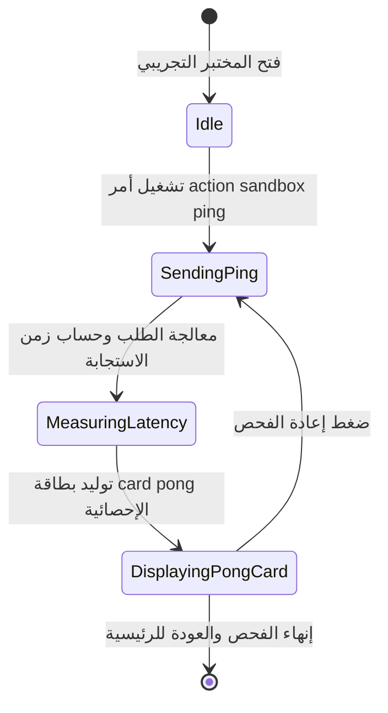

# تدفق 99.1: فحص النبض والاستجابة (Sandbox Ping)

## الوصف المعماري
تدفق تشخيصي وتجريبي داخل المختبر (`sandbox`) لقياس زمن استجابة البوت (Latency & Heartbeat SLA)، والتحقق من الجاهزية التشغيلية للاتصال وتفريغ الذاكرة بدون أي تأثير على قواعد البيانات التشغيلية.

## الصلاحيات والأمان
- **الأدوار المسموحة:** `SUPER_ADMIN`، `FIELD_ADMIN`
- **الأدوار المحجوبة:** `WORKER`، `GUEST`
- **أثر البيانات:** لا يوجد أي أثر مالي أو تعديل على الجداول التشغيلية (Zero Blast Radius).

## مخطط حالات التدفق (State Machine Diagram)

