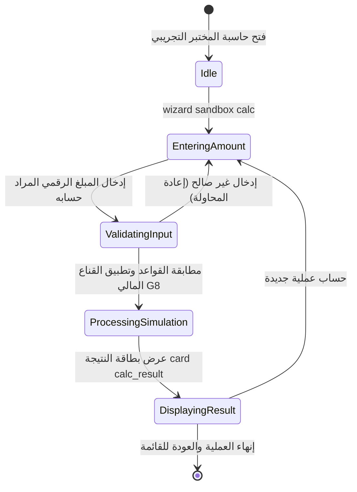

# تدفق 99.2: العمليات الحسابية والقناع المالي (Sandbox Calc & Masking)

## الوصف المعماري
تدفق تجريبي داخل بيئة المختبر (`sandbox`) لاختبار دقة محرك العمليات الحسابية المالية والتحقق الصارم من تطبيق بوابة القناع المالي (Gate G8 - Compensation Field Masking) ومنع تسريب الأرقام الحساسة، واختبار قيود الإدخال الرقمي دون المساس بالسجلات المالية للشركة.

## الصلاحيات والأمان
- **الأدوار المسموحة:** `SUPER_ADMIN`، `FIELD_ADMIN`
- **الأدوار المحجوبة:** `WORKER`، `GUEST`
- **أثر البيانات:** محاكاة حسابية بالذاكرة حصراً (In-Memory Simulation) دون كتابة في جداول دفتر الأستاذ أو السلف.

## مخطط حالات التدفق (State Machine Diagram)

