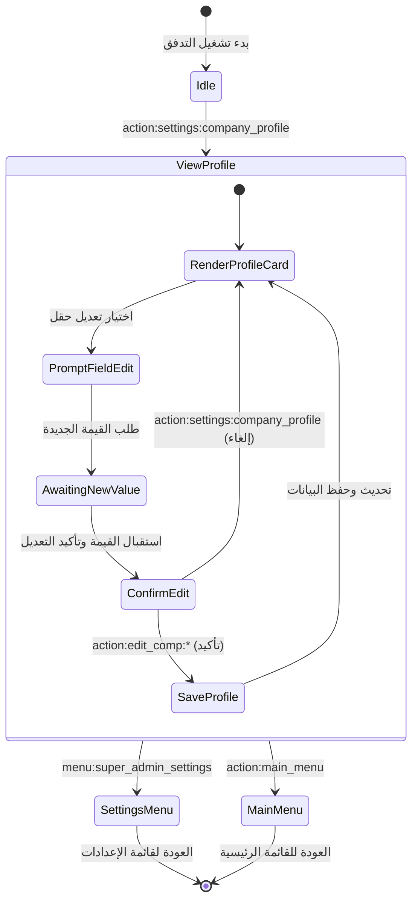

# تدفق 00.1: الملف التعريفي وبيانات المؤسسة
## Flow 00.1: Corporate Profile & Enterprise Settings

> **الموديول:** `modules/settings`  
> **كود التدفق:** `00.1`  
> **الرتب المصرح لها:** `SUPER_ADMIN`, `GENERAL_ADMIN`  
> **ميزانية التيليجرام:** 36/16/7/3  
> **حالة التدفق:** 🟢 مكتمل وموثق 100%  

---

### 🗺️ مخطط دورة حياة التدفق (State Machine Diagram)

---

### 🛡️ القواعد الحوكمية المعمارية المطبقة
1. **عقد الشريحة الرأسية (Gate G2):** الالتزام بمعمارية الـ 10 ملفات مع فصل طبقة العرض والخدمة.
2. **ميزانية التيليجرام (Gate G5):** الالتزام بألا يتجاوز طول الـ Callback الـ 36 بايت.
3. **حماية التعديل (Gate G7):** قصر صلاحية تعديل بيانات الشركة على السوبر أدمن والمدير العام.
