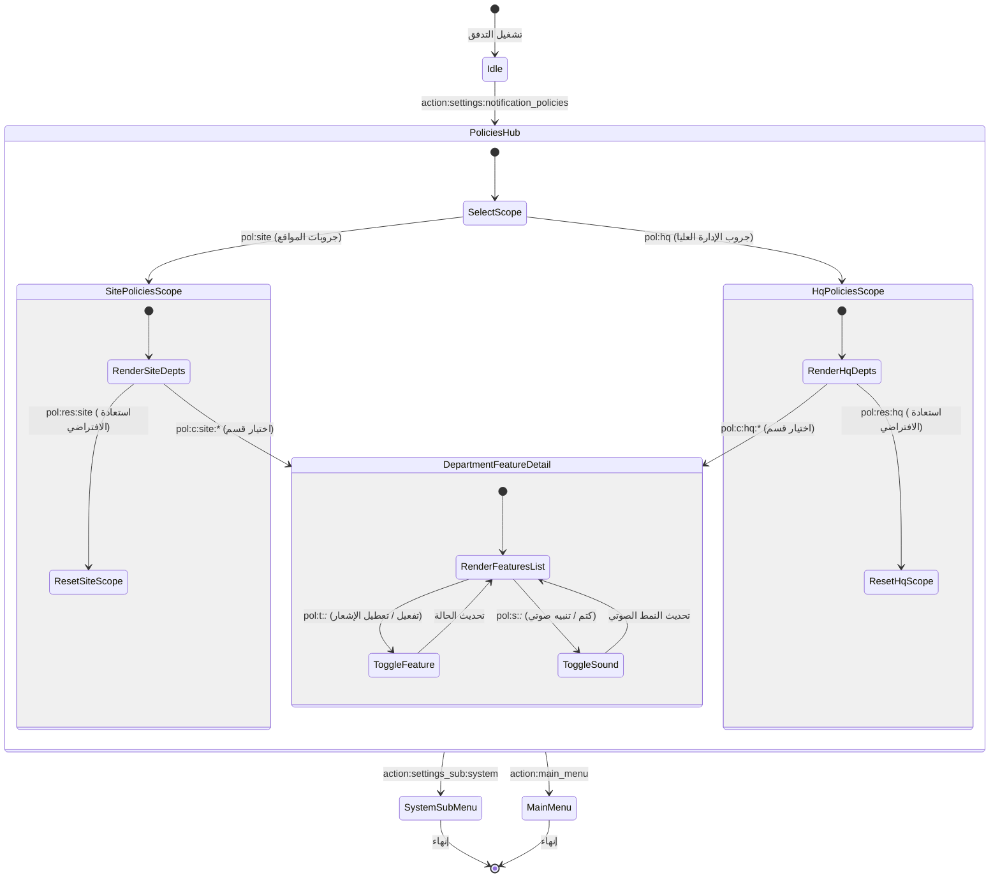

# تدفق 00.10: سياسات وقنوات الإشعارات والتنبيهات الميدانية (Notification Policies)
## Flow 00.10: Field & HQ Notification Routing & Policies Hub

> **الموديول:** `modules/settings`  
> **كود التدفق:** `00.10`  
> **الرتب المصرح لها:** `SUPER_ADMIN`, `GENERAL_ADMIN`  
> **ميزانية التيليجرام:** 36/16/7/3  
> **حالة التدفق:** 🟢 مكتمل وموثق 100%  

---

### 🗺️ مخطط دورة حياة التدفق (State Machine Diagram)

---

### 🛡️ القواعد الحوكمية المعمارية المطبقة
1. **عقد الشريحة الرأسية (Gate G2):** فصل سياسات التوجيه عن منطق إرسال رسائل البوت.
2. **ميزانية التيليجرام (Gate G5):** الالتزام بألا يتجاوز طول الـ Callback الـ 36 بايت.
3. **حوكمة الإشعارات (Gate G8):** التحقق من كتم الأصوات للإشعارات الليلية غير الحرجة.
