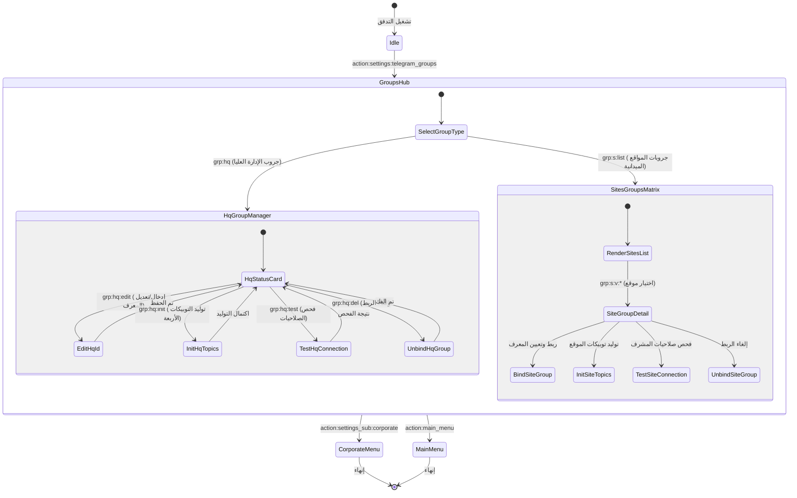

# تدفق 00.11: إدارة وربط مجموعات وتوبيكات تيليجرام (Telegram Groups & Topics)
## Flow 00.11: Telegram Groups Binding & Topic Provisioning Hub

> **الموديول:** `modules/settings`  
> **كود التدفق:** `00.11`  
> **الرتب المصرح لها:** `SUPER_ADMIN`, `GENERAL_ADMIN`  
> **ميزانية التيليجرام:** 36/16/7/3  
> **حالة التدفق:** 🟢 مكتمل وموثق 100%  

---

### 🗺️ مخطط دورة حياة التدفق (State Machine Diagram)

---

### 🛡️ القواعد الحوكمية المعمارية المطبقة
1. **عقد الشريحة الرأسية (Gate G2):** عزل واجهات Telegram API الخاصة بالمجموعات والتوبيكات.
2. **ميزانية التيليجرام (Gate G5):** الالتزام بألا يتجاوز طول الـ Callback الـ 36 بايت وتضمين روابط إضافة البوت الرسمية.
3. **حوكمة التوبيكات (Rulebook 07):** توليد التوبيكات الرسمية الأربعة المعتمدة حصراً.
