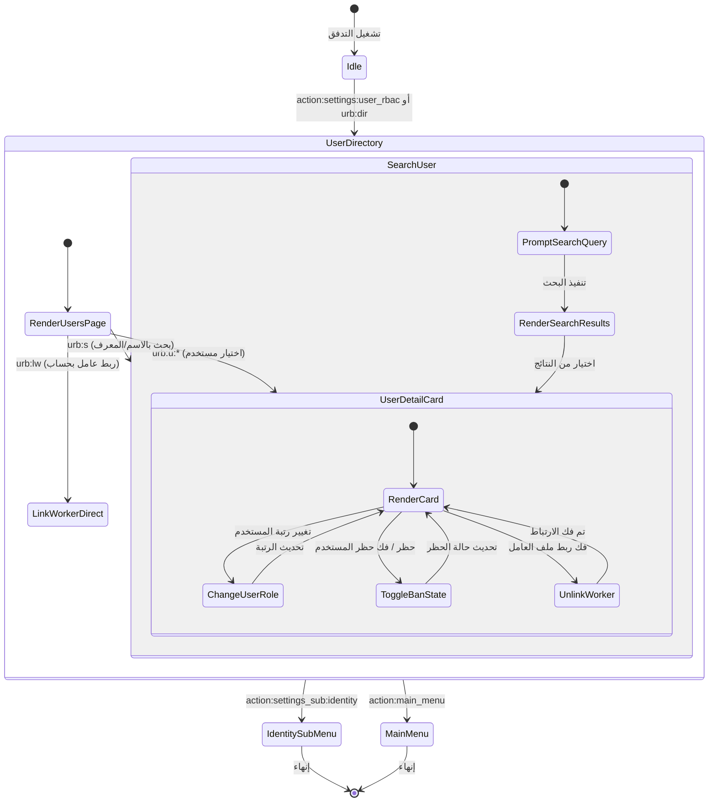

# تدفق 00.12: إدارة وتفويض المستخدمين ومصفوفة الأدوار (User RBAC Management)
## Flow 00.12: User Management, RBAC Matrix & Worker Linking Hub

> **الموديول:** `modules/settings`  
> **كود التدفق:** `00.12`  
> **الرتب المصرح لها:** `SUPER_ADMIN`, `GENERAL_ADMIN`  
> **ميزانية التيليجرام:** 36/16/7/3  
> **حالة التدفق:** 🟢 مكتمل وموثق 100%  

---

### 🗺️ مخطط دورة حياة التدفق (State Machine Diagram)

---

### 🛡️ القواعد الحوكمية المعمارية المطبقة
1. **عقد الشريحة الرأسية (Gate G2):** فصل طبقة تفويض المستخدمين عن الجلسات الميدانية.
2. **ميزانية التيليجرام (Gate G5):** الالتزام بميزانية الـ Callbacks والتقسيم الصفحي للأدوار.
3. **حصانة السوبر أدمن (Gate G7):** حظر تخفيض رتبة السوبر أدمن أو حظره لمنع تعطيل الإدارة العليا.
