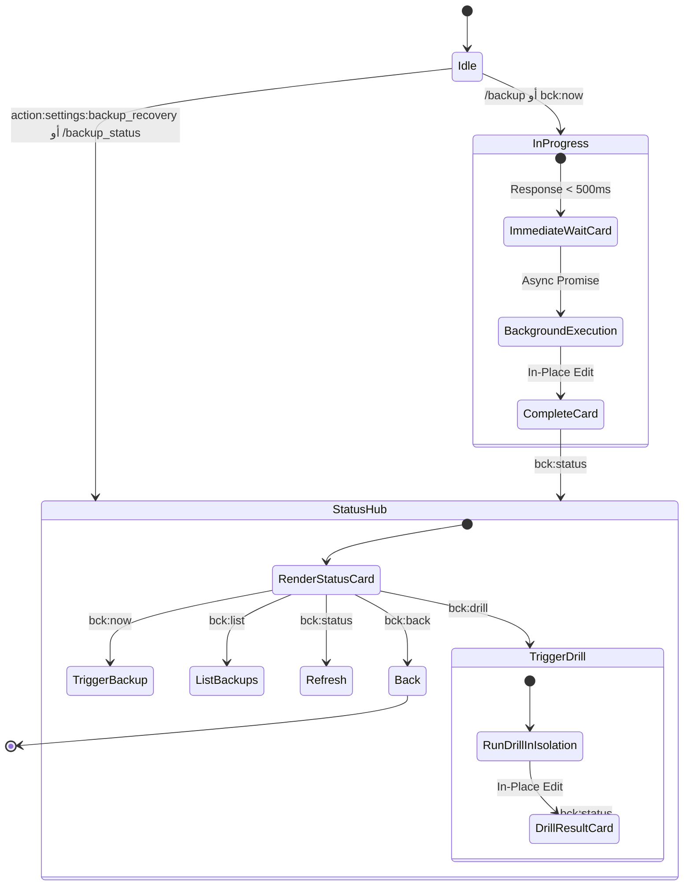

# تدفق 00.13: منظومة النسخ الاحتياطي واستعادة الكوارث
## Flow 00.13: System Backup & Disaster Recovery (Work Plan 99)

> **الموديول:** `modules/settings`  
> **كود التدفق:** `00.13`  
> **الرتب المصرح لها:** `SUPER_ADMIN`, `GENERAL_ADMIN`  
> **ميزانية التيليجرام:** 36/16/7/3  
> **مؤشر RPO:** < 24 ساعة | **مؤشر RTO:** < 15 دقيقة  

---

### 🗺️ مخطط دورة حياة التدفق (State Diagram)

---

### 🛡️ التحصينات الأمنية المطبقة
1. **استجابة فورية غير متزامنة (<500ms):** منع انتهاء مهلة الـ 10 ثوانٍ لـ Telegram Webhooks.
2. **تفريغ ذري لقاعدة البيانات:** استخدام `--single-transaction -F c` لحماية سلاسل دفاتر الأستاذ G12.
3. **تشفير AES-256-GCM:** مفتاح مشتق بـ PBKDF2 من عبارة الطوارئ الباردة لحل معضلة المفتاح.
4. **حظر التضخم (Zero-Bloat <30MB):** استخدام `git bundle` واستبعاد تام لكافة الاعتماديات المؤقتة.
5. **حماية الاستعادة عبر الجوال:** حظر الاستعادة بنقرة واحدة من البوت، وقصرها على لوحة التحكم بمصادقة مزدوجة وكود التأكيد اليومي.
