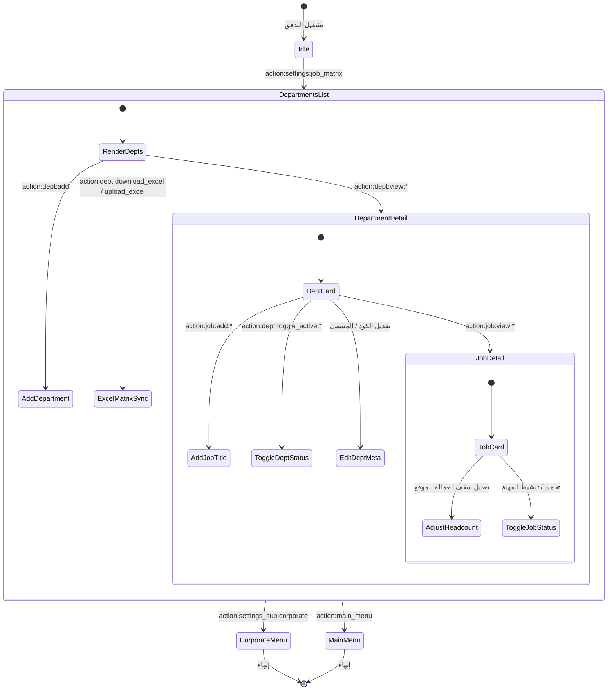

# تدفق 00.3: مصفوفة الوظائف والأقسام الميدانية (Job Matrix)
## Flow 00.3: Department & Job Titles Matrix

> **الموديول:** `modules/settings`  
> **كود التدفق:** `00.3`  
> **الرتب المصرح لها:** `SUPER_ADMIN`, `GENERAL_ADMIN`  
> **ميزانية التيليجرام:** 36/16/7/3  
> **حالة التدفق:** 🟢 مكتمل وموثق 100%  

---

### 🗺️ مخطط دورة حياة التدفق (State Machine Diagram)

---

### 🛡️ القواعد الحوكمية المعمارية المطبقة
1. **عقد الشريحة الرأسية (Gate G2):** عزل مصفوفة الوظائف عن بيانات العمالة المباشرة.
2. **ميزانية التيليجرام (Gate G5):** الالتزام بألا يتجاوز طول الـ Callback الـ 36 بايت.
3. **تكامل البيانات (Gate G19):** مطابقة هيكل الأقسام مع السجلات المالية المعتمدة في F:\HR.
