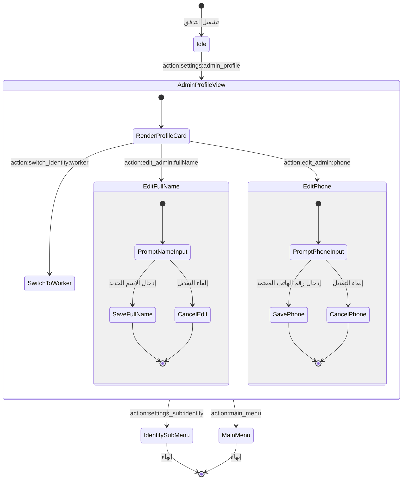

# تدفق 00.4: إدارة الملف الشخصي للأدمن والمشرفين
## Flow 00.4: Administrator & Supervisor Profile Hub

> **الموديول:** `modules/settings`  
> **كود التدفق:** `00.4`  
> **الرتب المصرح لها:** `SUPER_ADMIN`, `GENERAL_ADMIN`, `FIELD_ADMIN`  
> **ميزانية التيليجرام:** 36/16/7/3  
> **حالة التدفق:** 🟢 مكتمل وموثق 100%  

---

### 🗺️ مخطط دورة حياة التدفق (State Machine Diagram)

---

### 🛡️ القواعد الحوكمية المعمارية المطبقة
1. **عقد الشريحة الرأسية (Gate G2):** التحقق من صحة أرقام الهواتف المصرية (11 رقماً تبدأ بـ 01).
2. **ميزانية التيليجرام (Gate G5):** الالتزام بألا يتجاوز طول الـ Callback الـ 36 بايت.
3. **تبديل الهوية الآمن (Gate G7):** عزل جلسات الإشراف الميداني عن جلسات الخدمة الذاتية للعامل.
