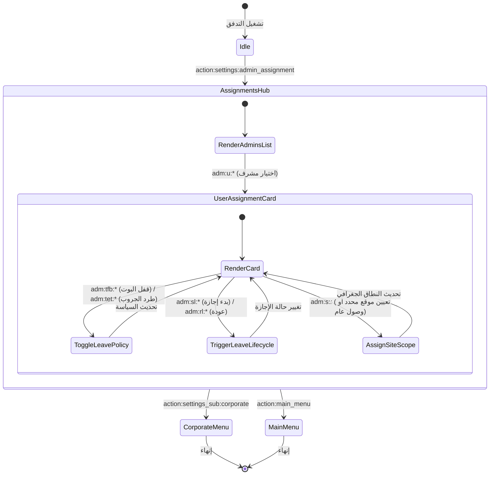

# تدفق 00.5: تفويض وتعيين المشرفين وإدارة الإجازات الميدانية
## Flow 00.5: Field Admin Site Scoping & Leave Lifecycle Hub

> **الموديول:** `modules/settings`  
> **كود التدفق:** `00.5`  
> **الرتب المصرح لها:** `SUPER_ADMIN`, `GENERAL_ADMIN`  
> **ميزانية التيليجرام:** 36/16/7/3  
> **حالة التدفق:** 🟢 مكتمل وموثق 100%  

---

### 🗺️ مخطط دورة حياة التدفق (State Machine Diagram)

---

### 🛡️ القواعد الحوكمية المعمارية المطبقة
1. **عقد الشريحة الرأسية (Gate G2):** عزل سياسات الإجازات الميدانية ونطاق المشرفين.
2. **ميزانية التيليجرام (Gate G5):** الالتزام بميزانية الـ Callbacks والأزرار المقتضبة (36/16/7/3).
3. **حصانة الصلاحيات (Gate G7):** التحقق من منع الوصول الميداني عند بدء الإجازة إذا كانت السياسة مفعلة.
