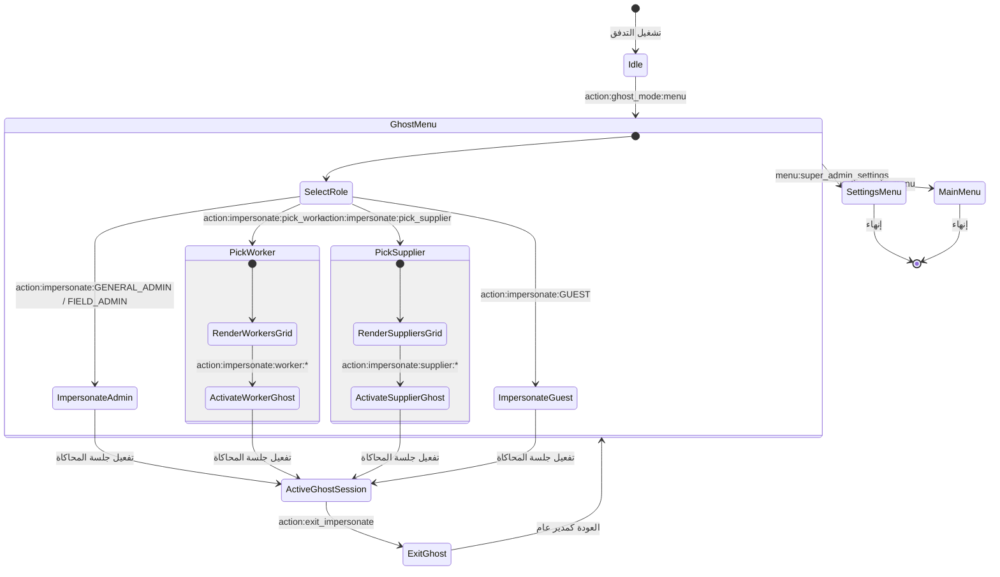

# تدفق 00.6: وضع المحاكاة وانتحال الأدوار (Ghost Mode)
## Flow 00.6: Super Admin Impersonation & Ghost Mode Hub

> **الموديول:** `modules/settings`  
> **كود التدفق:** `00.6`  
> **الرتب المصرح لها:** `SUPER_ADMIN` حصراً  
> **ميزانية التيليجرام:** 36/16/7/3  
> **حالة التدفق:** 🟢 مكتمل وموثق 100%  

---

### 🗺️ مخطط دورة حياة التدفق (State Machine Diagram)

---

### 🛡️ القواعد الحوكمية المعمارية المطبقة
1. **عقد الشريحة الرأسية (Gate G2):** عزل جلسة المحاكاة داخل الـ Session Store وعدم المساس ببيانات المستخدم الأصلية.
2. **ميزانية التيليجرام (Gate G5):** الالتزام بميزانية الـ Callbacks والأزرار المقتضبة (36/16/7/3).
3. **الحصانة الأمنية (Gate G7):** الحظر القطعي لغير السوبر أدمن من استدعاء وضع المحاكاة.
