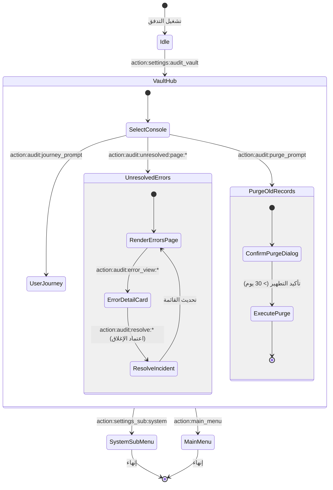

# تدفق 00.7: خزانة التحقيق الجنائي والأعطال (Audit & Incident Vault)
## Flow 00.7: Audit Logging & Unresolved Incident Vault

> **الموديول:** `modules/settings`  
> **كود التدفق:** `00.7`  
> **الرتب المصرح لها:** `SUPER_ADMIN`, `GENERAL_ADMIN`  
> **ميزانية التيليجرام:** 36/16/7/3  
> **حالة التدفق:** 🟢 مكتمل وموثق 100%  

---

### 🗺️ مخطط دورة حياة التدفق (State Machine Diagram)

---

### 🛡️ القواعد الحوكمية المعمارية المطبقة
1. **عقد الشريحة الرأسية (Gate G2):** ربط خزانة الأعطال مع منظومة التتبع والقياس `@alsaada/telemetry`.
2. **ميزانية التيليجرام (Gate G5):** الالتزام بميزانية الـ Callbacks والتقسيم الصفحي للأعطال.
3. **التوثيق الجنائي (Gate G9):** تتبع مرجع العطل `#ERR-XXXXXXXX` وربطه بالخطأ الأصلي ومستويات الخطورة.
