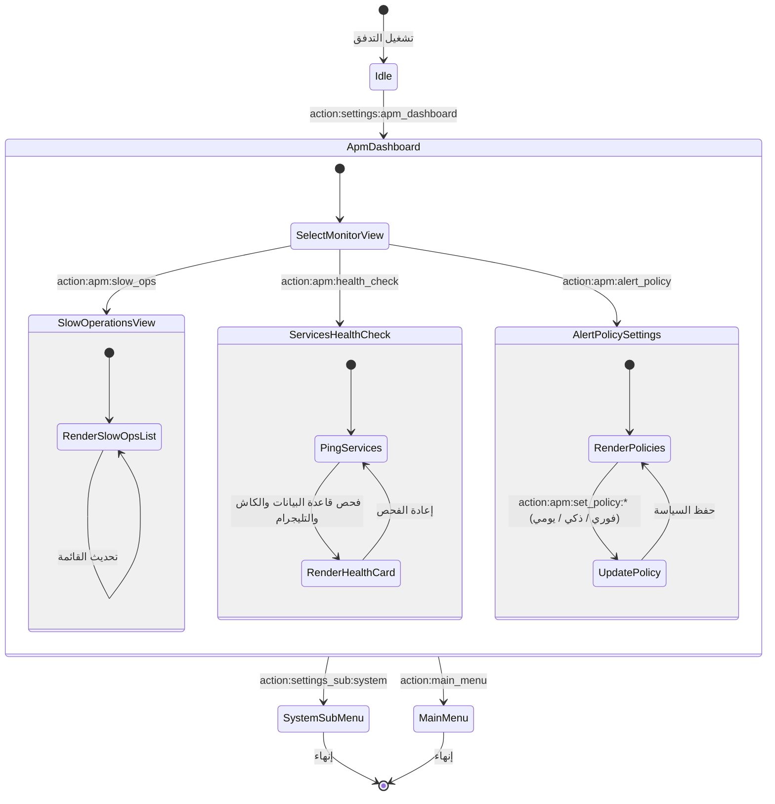

# تدفق 00.8: مرصد قياس الأداء والسرعة (APM Telemetry Hub)
## Flow 00.8: Application Performance Monitoring & Telemetry Hub

> **الموديول:** `modules/settings`  
> **كود التدفق:** `00.8`  
> **الرتب المصرح لها:** `SUPER_ADMIN`, `GENERAL_ADMIN`  
> **ميزانية التيليجرام:** 36/16/7/3  
> **حالة التدفق:** 🟢 مكتمل وموثق 100%  

---

### 🗺️ مخطط دورة حياة التدفق (State Machine Diagram)

---

### 🛡️ القواعد الحوكمية المعمارية المطبقة
1. **ميزانية زمن الاستجابة (Gate G6):** مراقبة العمليات البطيئة التي تتجاوز سقف الـ 300ms.
2. **ميزانية التيليجرام (Gate G5):** الالتزام بميزانية الـ Callbacks والأزرار المقتضبة (36/16/7/3).
3. **تكامل المراقبة (Gate G9):** توفير رؤية حية لنبض خدمات PostgreSQL و Redis و Telegram API.
