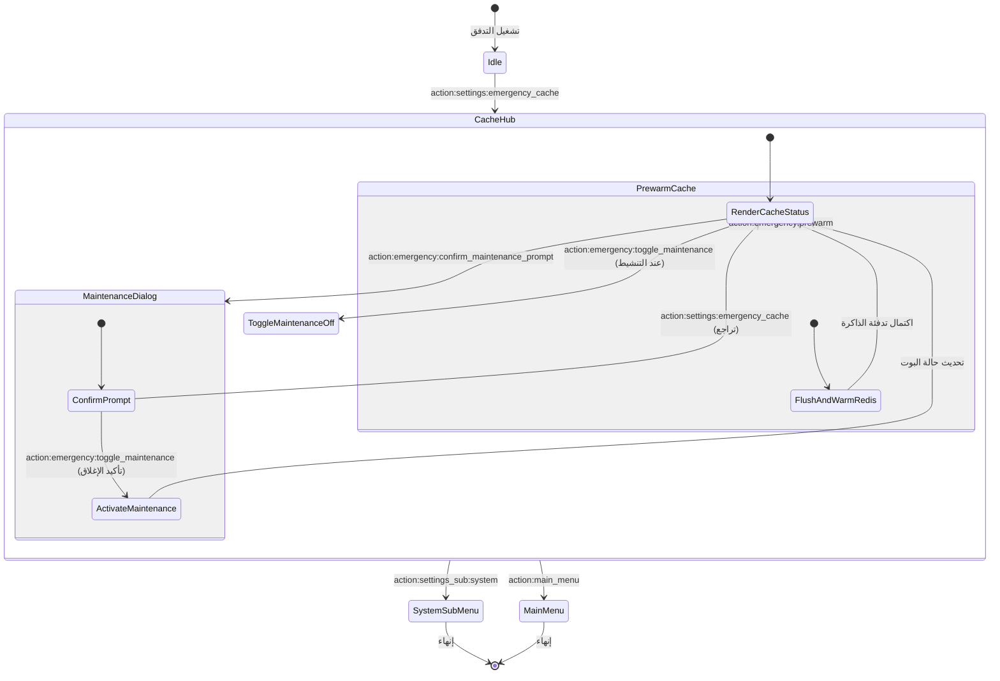

# تدفق 00.9: الكاش الاحتياطي وتجاوز الأعطال ووضع الصيانة (Emergency Cache)
## Flow 00.9: Emergency Cache, Maintenance Mode & Redis Failover

> **الموديول:** `modules/settings`  
> **كود التدفق:** `00.9`  
> **الرتب المصرح لها:** `SUPER_ADMIN`, `GENERAL_ADMIN`  
> **ميزانية التيليجرام:** 36/16/7/3  
> **حالة التدفق:** 🟢 مكتمل وموثق 100%  

---

### 🗺️ مخطط دورة حياة التدفق (State Machine Diagram)

---

### 🛡️ القواعد الحوكمية المعمارية المطبقة
1. **استمرارية الأعمال (Gate G21):** حماية الجلسات وضمان استئناف العمل فور إيقاف وضع الصيانة.
2. **ميزانية التيليجرام (Gate G5):** الالتزام بألا يتجاوز طول الـ Callback الـ 36 بايت.
3. **حصانة السوبر أدمن (Gate G7):** تمكين السوبر أدمن دائماً من استخدام البوت حتى أثناء تفعيل وضع الصيانة العام.
