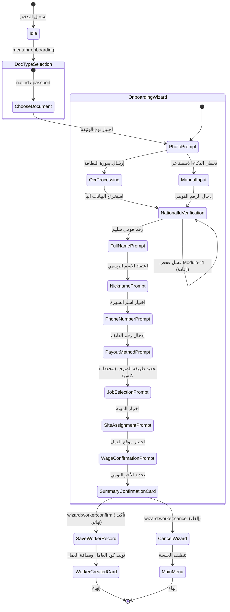

# تدفق 01.1: معالج تسجيل وتعيين العمالة الميدانية (Worker Registration Wizard)
## Flow 01.1: Comprehensive Worker Onboarding & National ID Verification Wizard

> **الموديول:** `modules/workforce`  
> **كود التدفق:** `01.1`  
> **الرتب المصرح لها:** `SUPER_ADMIN`, `GENERAL_ADMIN`, `FIELD_ADMIN`  
> **ميزانية التيليجرام:** 36/16/7/3  
> **حالة التدفق:** 🟢 مكتمل وموثق 100%  

---

### 🗺️ مخطط دورة حياة التدفق (State Machine Diagram)

---

### 🛡️ القواعد الحوكمية المعمارية المطبقة
1. **التحقق الجنائي من الرقم القومي (Gate G1):** فحص خوارزمية Modulo-11 المصرية واستخراج تاريخ الميلاد والمحافظة.
2. **شريحة الـ 10 ملفات (Gate G2):** فصل جلسات المعالج عبر `UniversalWizardSessionEngine`.
3. **حجب الأجور والبيانات الحساسة (Gate G8):** تطبيق `formatSpoiler` على تفاصيل الأجر والراتب اليومي.
4. **ميزانية التيليجرام (Gate G5):** الالتزام بألا يتجاوز طول الـ Callback الـ 36 بايت.
