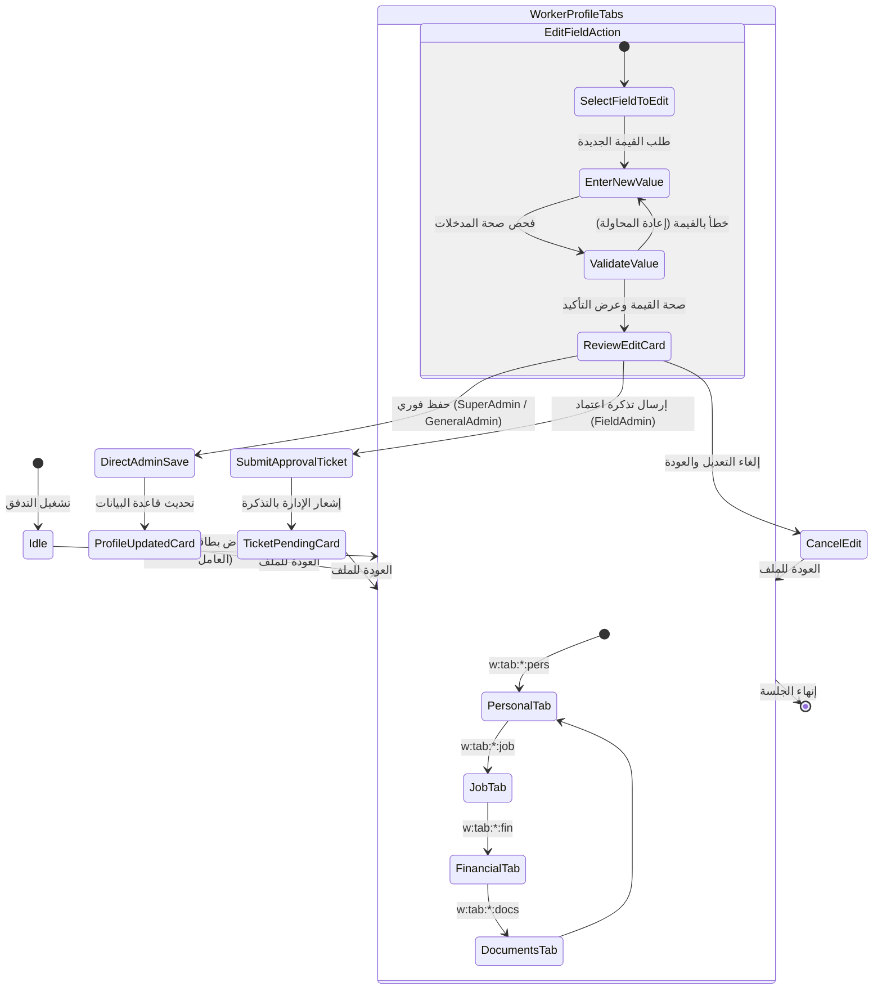

# تدفق 01.2.D: تعديل وتحديث بيانات العامل وتذاكر الاعتماد
## Flow 01.2.D: Worker Profile Editing & Field Admin Change Approval Hub

> **الموديول:** `modules/workforce`  
> **كود التدفق:** `01.2.D`  
> **الرتب المصرح لها:** `SUPER_ADMIN`, `GENERAL_ADMIN`, `FIELD_ADMIN`  
> **ميزانية التيليجرام:** 36/16/7/3  
> **حالة التدفق:** 🟢 مكتمل وموثق 100%  

---

### 🗺️ مخطط دورة حياة التدفق (State Machine Diagram)

---

### 🛡️ القواعد الحوكمية المعمارية المطبقة
1. **عقد الشريحة الرأسية (Gate G2):** تقسيم بطاقة العامل إلى أربعة تبويبات منظمة (36/16/7/3).
2. **حوكمة الأجور (Gate G8):** حجب تفاصيل الراتب والبدلات عبر `formatSpoiler` في تبويب الماليات.
3. **تذاكر الموافقة للمشرفين (Gate G7):** تحويل تعديل الحقول المالية للمشرف الميداني إلى تذاكر معلقة تنتظر اعتماد الإدارة العامة.
